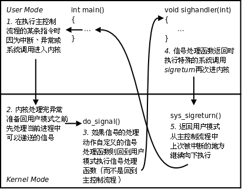
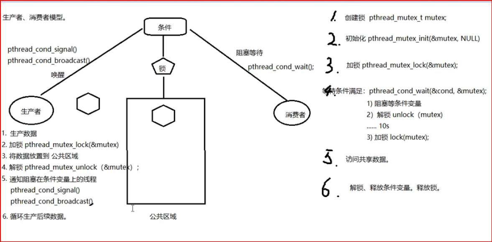

# day8 

## 信号共性：

	简单、不能携带大量信息、满足条件才发送。

## 信号的特质：

```
信号是软件层面上的“中断”。一旦信号产生，无论程序执行到什么位置，必须立即停止运行，处理信号，处理结束，再继续执行后续指令。

所有信号的产生及处理全部都是由【内核】完成的。
```

重点: **每个进程收到的所有信号，都是由内核负责发送的，内核处理。**

> 所有的手段  都是 驱使内核产生信号, 而不是自己产生信号


## 信号相关的概念：

	产生信号：
	
		1. 按键产生 ctrl+c 等等
	
		2. 系统调用产生  kill,raise,abort等
	
		3. 软件条件产生 定时器 alarm等
	
		4. 硬件异常产生  段错误,总线错误等
	
		5. 命令产生  kill命令
	
	概念：  未决 和 递达 是状态
		未决：产生 与 递达之间状态。  主要由于阻塞(屏蔽)导致该状态。 
	
		递达：产生并且送达到进程。直接被内核处理掉。
	
		信号处理方式： 执行默认处理动作、忽略、捕捉（自定义  调用户处理信号）


	在pcb进程快中, 包含 有信号相关信息:	
		
		阻塞信号集（信号屏蔽字）： 本质：位图。用来记录信号的屏蔽状态。一旦被屏蔽的信号，在解除屏蔽前，一直处于未决态。
	
		未决信号集：本质：位图。用来记录信号的处理状态。该信号集中的信号，表示，已经产生，但尚未被处理。


## 阻塞信号集(gpt)

也叫 信号屏蔽字

阻塞信号集用于定义当前进程已经阻塞的信号。进程可以通过修改其信号集来阻塞某些信号，从而防止这些信号在进程当前执行时中断进程。

- **阻塞信号**是指在进程当前被阻塞期间，这些信号不会立即传递给该进程。信号会被暂时“挂起”，直到信号集恢复后才能传递。
- 使用 `sigprocmask()` 或 `pthread_sigmask()` 等系统调用可以控制进程的阻塞信号集。

阻塞信号集的作用：

- **防止信号打断**：有些操作可能需要在信号发送过程中进行完整执行，例如临界区操作。如果信号被阻塞，就可以保证在这些操作执行过程中不会被中断。
- **延迟信号处理**：通过阻塞信号，进程可以决定在适当的时机处理信号，而不是在信号发生时立即处理它们。

> 默认是 0, 表示 不阻塞该信号 
>
> 这两 默认值 有歧义,  具体不知道   

## 未决信号集(gpt)

未决信号集包含了所有已被发送给进程，但由于进程当前处于阻塞状态，尚未处理的信号。即使信号被阻塞，系统也会将其保存到未决信号集中，直到该信号被解除阻塞并被进程处理。

- **未决信号**：当信号被阻塞时，系统会将这些信号保留在未决信号集中。一旦信号被解除阻塞，系统会尽快将这些信号交给进程处理。
- 系统会保证进程按照信号发送的顺序处理信号。如果多个信号被发送并且被阻塞，进程在解除阻塞后会按顺序处理这些信号。

> 未决信号集的所有位也默认是 **0**，表示没有信号等待处理。   


> 二者 都是 位图

## 协作机制

这两者的协作机制保证了进程对信号的控制性和灵活性：

- **信号发送**：当信号发送给进程时，操作系统首先检查该信号是否被阻塞。如果信号未被阻塞，则会立即传递给进程。如果信号被阻塞，则将其保存在未决信号集中。
- **阻塞与解除阻塞**：进程可以通过 `sigprocmask()` 阻塞或解除阻塞信号。阻塞信号意味着进程不会立即处理这些信号。解除阻塞信号意味着信号可以立即被处理，且如果信号已经被发送，它会从未决信号集中取出并交给进程处理。
- **未决信号的处理**：解除阻塞后，操作系统会检查未决信号集，并依次将其中的信号交给进程处理。

> 跟课程讲的有出入

## 补充-1

### 1.按键信号

`Ctrl + C`：通常发送 `SIGINT` 信号，终止进程。

`Ctrl + Z`：通常发送 `SIGTSTP` 信号，将进程挂起（暂停）。  使用 

`Ctrl + D`：通常表示 EOF（文件结束符），可以用于退出终端会话。

`Ctrl + \`：通常发送 `SIGQUIT` 信号，终止进程并生成核心转储。

### 2.bg fg

`bg` 命令用于将一个被暂停的作业（例如，使用 `Ctrl + Z` 暂停的进程）移到后台继续运行。它不会停止进程，而是使进程在后台继续执行，并释放终端控制。

`fg` 命令用于将后台作业带回前台运行。你可以用它来恢复一个已放到后台的进程，并将其带回到当前终端会话的前台，这样你可以继续与该进程交互。


## 信号4要素：(大量的 见课件)

kill -l

man 7 signal

> 		信号使用之前，应先确定其4要素，而后再用！！！
> 		
> 		编号、名称、对应事件、默认处理动作。
> 		value或者standard   sisnal   comment   action   

重点: 

SIGKILL: 无条件终止进程。本信号不能被忽略，处理和阻塞。默认动作为终止进程。它向系统管理员提供了可以杀死任何进程的方法。

SIGSTOP：停止进程的执行。信号不能被忽略，处理和阻塞。默认动作为暂停进程。


**9) SIGKILL** **和19) SIGSTOP**信号，不允许忽略和捕捉，只能执行默认动作。甚至不能将其设置为阻塞。

## action默认处理动作

`Term`表示终止当前进程，`Core`表示终止当前进程并且Core Dump（产生core 文件），`Ign`表示忽略该信号，`Stop`表示停止当前进程，`Cont`表示继续执行先前停止的进程

## 补充-2

### **指令集架构（ISA）**

**指令集架构（ISA，Instruction Set Architecture）** 是芯片架构的核心，定义了处理器能够执行的指令集以及指令的格式。指令集架构决定了芯片如何与软件进行交互。常见的指令集架构有：

- **x86架构**：
  - 由Intel和AMD等公司生产的CPU使用的架构，广泛用于桌面计算机和服务器。x86架构的特点是复杂的指令集（CISC，Complex Instruction Set Computing）。
  - 支持多种高级功能，如多核处理、超线程技术（Hyper-Threading）等。
- **ARM架构**：
  - 由ARM公司设计的架构，广泛用于移动设备、嵌入式系统、单板计算机等。ARM架构的特点是简化指令集（RISC，Reduced Instruction Set Computing）。
  - ARM芯片功耗低，计算效率高，因此被广泛应用于智能手机、平板电脑和物联网设备中。
- **MIPS架构**：
  - 一种基于RISC设计的架构，过去常用于嵌入式系统、工作站、路由器等设备中。MIPS架构的指令集相对简单，适合低功耗设备。
- **RISC-V架构**：
  - 一种开源的RISC架构，正在迅速发展并被广泛应用于学术研究和商业领域。RISC-V与ARM类似，但其最大的特点是开源，允许用户自由修改和扩展。

## 终端按键产生信号

  Ctrl + c → 2) SIGINT（终止/中断）  "INT" ----Interrupt

  Ctrl + z → 20) SIGTSTP（暂停/停止） "T" ----Terminal 终端。

  Ctrl + \ → 3) SIGQUIT（退出） 

## 硬件异常产生信号

  除0操作  → 8) SIGFPE (浮点数例外)   "F" -----float 浮点数。

  非法访问内存 → 11) SIGSEGV (段错误)

  总线错误 → 7) SIGBUS   

## kill命令 和 kill函数 产生信号：

	kill 命令    命令行 kill -
	kill -9 -pid   是组pid
	
	函数
	int kill（pid_t pid, int signum）
	
	参数：
		pid: 	> 0:发送信号给指定进程
	
			= 0：发送信号给跟调用kill函数的那个进程处于同一进程组的进程。
	
			< -1: 取绝对值，发送信号给该绝对值所对应的进程组的所有组员。
	
			= -1：发送信号给，有权限发送的所有进程。
	
		signum：待发送的信号
	
	返回值：
		成功： 0
	
		失败： -1 errno

## 补充-3

### kill 实例-1

```c++
#include <stdio.h>
#include <stdlib.h>
#include <string.h>
#include <unistd.h>
#include <errno.h>
#include <pthread.h>
#include <signal.h>

void sys_err(const char *str)
{
	perror(str);
	exit(1);
}

int main(int argc, char *argv[])
{
    pid_t pid = fork();

    if (pid > 0) {
        while(1) {
            printf("parent, pid = %d\n", getpid());
            sleep(1);
        }

    } else if (pid == 0) {

        printf("child pid = %d, ppid = %d\n", getpid(), getppid());
        sleep(10);

        kill(0, SIGKILL);
    }

	return 0;
}

```


## alarm 函数： 软件条件产生信号

使用自然计时法。

每个进程有且只有一个

作用 : 用于在指定时间后执行某个操作。

当指定的秒数到达时，进程会收到一个 `SIGALRM` 信号，默认情况下，接收到信号的进程会终止。

	定时发送SIGALRM给当前进程。


​	
​	unsigned int alarm(unsigned int seconds);
​	
​		seconds：定时秒数
​	
​		返回值：上次定时剩余时间。
​	返回值是剩余的时间（秒），即上次设定的定时器时间。如果没有设定定时器，返回 0。
​	
​			无错误现象。
​	
​		alarm（0）； 取消闹钟。
​	
​	time 命令 ： 查看程序执行时间。   实际时间 = 用户时间 + 内核时间 + 等待时间。  --》 优化瓶颈 IO

> alarm(5) → 3sec → alarm(4) → 5sec → alarm(5) → alarm(0) 
>
> 返回值
>
> ​    0               2                    0          5


使用time命令查看程序执行的时间。    程序运行的瓶颈在于IO，优化程序，首选优化IO。

实际执行时间 = 系统时间 + 用户时间 + 等待时间

## setitimer函数：软件条件产生信号(比较复杂)

set i  timer      

	int setitimer(int which, const struct itimerval *new_value, struct itimerval *old_value);
	
	参数：
		which：	ITIMER_REAL： 采用自然计时。 ――> SIGALRM
	
			ITIMER_VIRTUAL: 采用用户空间计时  ---> SIGVTALRM  只计算进程占用cpu的时间
	
			ITIMER_PROF: 采用内核+用户空间计时 ---> SIGPROF  计算占用cpu及执行系统调用的时间
		
		new_value：定时秒数
	
		           类型：struct itimerval {
	
	           				struct timeval {
	           					time_t      tv_sec;         /* seconds */
	           					suseconds_t tv_usec;        /* microseconds */
	
	       				}it_interval;---> 周期定时秒数
	
	           				 struct timeval {
	           					time_t      tv_sec;         
	           					suseconds_t tv_usec;        
	
	       				}it_value;  ---> 第一次定时秒数  
	       			 };
	
		old_value：传出参数，上次定时剩余时间。
	
		e.g.
			struct itimerval new_t;	
			struct itimerval old_t;	
	
			new_t.it_interval.tv_sec = 0;
			new_t.it_interval.tv_usec = 0;
			new_t.it_value.tv_sec = 1;
			new_t.it_value.tv_usec = 0;
	
			int ret = setitimer(&new_t, &old_t);  定时1秒
	
	返回值：
		成功： 0
	
		失败： -1 errno


其他几个发信号函数：

	int raise(int sig);
	
	void abort(void);

## 信号集操作函数：

	sigset_t set;  自定义信号集。
	
	sigemptyset(sigset_t *set);	清空信号集
	
	sigfillset(sigset_t *set);	全部置1
	
	sigaddset(sigset_t *set, int signum);	将一个信号添加到集合中
	
	sigdelset(sigset_t *set, int signum);	将一个信号从集合中移除
	
	sigismember（const sigset_t *set，int signum); 判断一个信号是否在集合中。 在--》1， 不在--》0

## 设置信号屏蔽字和解除屏蔽：

	int sigprocmask(int how, const sigset_t *set, sigset_t *oldset);
	
		how:	SIG_BLOCK:	设置阻塞
	
			SIG_UNBLOCK:	取消阻塞
	
			SIG_SETMASK:	用自定义set替换mask。
	
		set：	自定义set
	
		oldset：旧有的 mask。

## 查看未决信号集：

	int sigpending(sigset_t *set);
	
		set： 传出的 未决信号集。

## 补充-4 综合实例-1

综合运用了 信号集操作函数, 设置信号屏蔽字, 查看未决信号

在 vscode 终端 有点小问题, ctrl + c 会终止, 在linux 终端则不会

```c++
#include <stdio.h>
#include <signal.h>
#include <stdlib.h>
#include <string.h>
#include <unistd.h>
#include <errno.h>
#include <pthread.h>

void sys_err(const char *str)
{
    perror(str);
    exit(1);
}

void print_set(sigset_t *set)
{
    int i;
    for (i = 1; i<32; i++) {
        if (sigismember(set, i)) 
            putchar('1');
        else 
            putchar('0');
    }
    printf("\n");
}
int main(int argc, char *argv[])
{
    sigset_t set, oldset, pedset;
    int ret = 0;

    sigemptyset(&set);
    sigaddset(&set, SIGINT);
    sigaddset(&set, SIGQUIT);
    sigaddset(&set, SIGBUS);
    sigaddset(&set, SIGKILL);  // 无法阻塞, 因为 这个信号 就这样

    ret = sigprocmask(SIG_BLOCK, &set, &oldset);
    if (ret == -1)
        sys_err("sigprocmask error");

    while (1) {
        ret = sigpending(&pedset);
        print_set(&pedset);
        sleep(1);
    }

    return 0;
}

```


## 【信号捕捉】：

特别注意: 这是 注册 一个信号处理

	signal();  //  一般不要用, 问题多
	
			#include <signal.h>
	
	       typedef void (*sighandler_t)(int);      // 函数指针  指向函数的指针    int 实际上 就是 信号编号
	
	       sighandler_t signal(int signum, sighandler_t handler);   
	 注意多在复杂结构中使用typedef。


```c++
	【sigaction();】 重点！！！
​			#include <signal.h>
​	       int sigaction(int signum, const struct sigaction *act,
​	                     struct sigaction *oldact);
​	// 补充
​	struct sigaction {
​	    void (*sa_handler)(int);   // 信号处理函数
​	    void (*sa_sigaction)(int, siginfo_t *, void *);  // 备用信号处理函数，提供更多信息
​	    sigset_t sa_mask;          // 在信号处理期间屏蔽的信号
​	    int sa_flags;              // 信号处理的标志
​	    void (*sa_restorer)(void); // 已废弃，通常为 NULL
​	};
```


## 补充-5 指针常量 指针函数

1. **指针常量**（Pointer Constant）：

   - 指针常量通常指的是指向常量的指针（const pointer）。

   - 它是指向常量数据的指针，因此无法修改指针所指向的数据，但可以修改指针本身使其指向其他位置。

   - 例如：

     ```
     const int *ptr = &a;  // 指向常量的指针
     ```

2. **常量指针**（Constant Pointer）：

   - 常量指针是指针本身是常量，一旦指向某个变量，就不能改变它所指向的地址，但可以修改指针指向的内容。

   - 例如：

     ```
     int * const ptr = &a;  // 常量指针
     ```

3. **指针函数**（Pointer Function）：

   - 指针函数是返回指针的函数，通常用于返回一个指向某种数据类型的指针。

   - 例如：

     ```
     int* func() {
         int *p;
         p = (int *)malloc(sizeof(int));
         return p;
     }
     ```

4. **函数指针**（Function Pointer）：

   - 函数指针是指向函数的指针，可以用来调用函数。它通常用于实现回调机制。

   - 例如：

     ```
     int add(int a, int b) {
         return a + b;
     }
     
     int (*func_ptr)(int, int) = add;  // 函数指针
     printf("%d\n", func_ptr(2, 3));    // 使用函数指针调用函数
     ```

总结：

- **指针常量**（指向常量数据）和 **常量指针**（指针本身是常量）是对指针本身和指针所指向数据限制的不同方式。
- **指针函数** 返回指针，而 **函数指针** 是指向函数的指针，可以用来调用函数。

## 补充-6 signal实例  (无法使用, 有问题,尽量用 sigaction)

```c++
#include <stdio.h>
#include <signal.h>
#include <stdlib.h>
#include <string.h>
#include <unistd.h>
#include <errno.h>
#include <pthread.h>


void sys_err(const char *str)
{
	perror(str);
	exit(1);
}

void sig_catch(int signo)
{
    printf("catch you!! %d", signo);

    return ;
}

int main(int argc, char *argv[])
{
	signal(SIGINT, sig_catch);   

    while (1);

	return 0;
}

//上面这个例子 没有体现出 sighandler_t的意思

#include <stdio.h>
#include <signal.h>
#include <stdlib.h>
#include <string.h>
#include <unistd.h>
#include <errno.h>
#include <pthread.h>
typedef void (*sighandler_t)(int);   // 修改处
void sys_err(const char *str)
{
	perror(str);
	exit(1);
}

void sig_catch(int signo)
{
    printf("catch you!! %d", signo);

    return ;
}

int main(int argc, char *argv[])
{
    sighandler_t handler;
    handler = signal(SIGINT, sig_catch);
    
    if (handler == SIG_ERR) {
        perror("signal error");
        exit(1);
    }    
    
    while (1);

	return 0;
}

```


## 补充-7 typedef 函数指针

`typedef` 可以用来为函数指针定义别名，从而简化函数指针的使用，特别是在处理复杂的函数指针时，它使得代码更具可读性。

typedef 函数指针 是一种类型

**基本语法：**

要为函数指针使用 `typedef`，我们需要明确指定函数的返回类型和参数类型。其基本语法如下：

```
typedef return_type (*alias_name)(parameter_types);
```

- `return_type`：函数的返回类型。
- `alias_name`：给函数指针取的别名。
- `parameter_types`：函数的参数类型（如果有多个参数，参数类型需要以逗号分隔）。

```c++
#include <stdio.h>

typedef int (*AddFunction)(int, int);

int add(int a, int b) {
    return a + b;
}

int main() {
    AddFunction add_ptr = add;  // 将函数指针指向 add 函数     typedef 函数指针 是一种类型

    int result = add_ptr(5, 3);  // 使用函数指针调用 add 函数
    printf("Result: %d\n", result);

    return 0;
}

```

## 补充-8 sigaction实例 (重点)

```c++
#include <stdio.h>
#include <signal.h>
#include <stdlib.h>
#include <string.h>
#include <unistd.h>
#include <errno.h>
#include <pthread.h>

void sys_err(const char *str)
{
	perror(str);
	exit(1);
}

void sig_catch(int signo)                   // 回调函数
{
    if (signo == SIGINT) {
        printf("catch you!! %d\n", signo);
        // sleep(10);
    }

    else if (signo == SIGQUIT)
        printf("-----------catch you!! %d\n", signo);

    return ;
}

int main(int argc, char *argv[])
{
    struct sigaction act, oldact;

    act.sa_handler = sig_catch;         // set callback function name       设置回调函数
    sigemptyset(&(act.sa_mask));        // set mask when sig_catch working. 清空sa_mask屏蔽字, 只在sig_catch工作时有效
    sigaddset(&act.sa_mask, SIGQUIT);
    act.sa_flags = 0;                   // usually use.                     默认值
    
    int ret = sigaction(SIGINT, &act, &oldact);     //注册信号捕捉函数
    if (ret == -1)
        sys_err("sigaction error");
   ret = sigaction(SIGQUIT, &act, &oldact);     //注册信号捕捉函数

    while (1);

	return 0;
}

```


## 信号捕捉特性：

	1. 捕捉函数执行期间，信号屏蔽字 由 mask --> sa_mask , 捕捉函数执行结束。 恢复回mask   // 这里注意, 是取并集, 不咋懂  详见 补充10
	
	2. 捕捉函数执行期间，本信号自动被屏蔽(sa_flgs = 0).
	
	3. 捕捉函数执行期间，被屏蔽信号多次发送，解除屏蔽后只处理一次！     // 补充8里面的 sleep(10)


## 补充-9 信号大总结-1 (概念混乱):

### 1. 产生信号

信号是由操作系统或程序主动产生的异步事件，通常用于通知进程某些事件的发生。例如：

- **外部信号**：比如按下 `Ctrl+C` 产生 `SIGINT` 信号。
- **内部信号**：比如程序调用 `raise(SIGSEGV)` 产生一个 `SIGSEGV`（段错误）信号。

当某个信号发生时，操作系统会向目标进程发送该信号，进程可以选择处理、忽略或执行默认行为。

### 2. 阻塞信号（信号屏蔽字）

每个进程都有一个信号屏蔽字（signal mask），它指定了哪些信号在进程执行期间被阻塞（即不会被传递给进程）。当信号被阻塞时，信号不会立即传递给进程，而是被保存在内核中，直到信号屏蔽字解除该信号的阻塞。

- **默认情况下**，许多信号（例如 `SIGINT`）在进程运行时并不被阻塞。
- **阻塞信号**：如果你通过 `sigprocmask()` 函数将信号加入到信号屏蔽字中，进程就会屏蔽这些信号。这意味着，即使这些信号发生了，进程也不会立即响应它们。

#### 例子：

```
sigset_t set;
sigemptyset(&set);
sigaddset(&set, SIGINT);  // 阻塞 SIGINT 信号
sigprocmask(SIG_BLOCK, &set, NULL);  // 屏蔽 SIGINT 信号
```

### 3. 捕捉信号（信号处理）

信号捕捉（或信号处理）是指当信号发生时，进程可以选择自定义一个处理函数来响应该信号。你可以使用 `signal()` 或 `sigaction()` 注册一个信号处理函数。

- **默认处理**：某些信号会有系统默认的处理行为（例如，`SIGINT` 默认终止程序）。
- **自定义处理**：你可以设置一个处理函数，使得当信号发生时，进程执行自定义的代码。

#### 例子：使用 `signal()` 捕捉信号

```
#include <stdio.h>
#include <signal.h>
#include <stdlib.h>

void sig_handler(int signo) {
    if (signo == SIGINT) {
        printf("Caught SIGINT signal\n");
    }
}

int main() {
    signal(SIGINT, sig_handler);  // 捕获 SIGINT 信号

    while (1) {
        sleep(1);  // 等待信号
    }

    return 0;
}
```

### 4. 信号的屏蔽字（`sa_mask`）

在 `sigaction` 中，`sa_mask` 用于指定在信号处理函数执行期间，额外需要屏蔽的信号。换句话说，`sa_mask` 定义了哪些信号在处理当前信号时会被阻塞，防止它们干扰当前的处理过程。

- 当信号处理函数执行时，进程会屏蔽 `sa_mask` 中指定的信号，直到信号处理函数结束。
- `sa_mask` 的信号屏蔽字是与进程当前信号屏蔽字取并集的。这样做的目的是防止信号处理函数在执行时被中断。

#### 例子：使用 `sigaction` 设置 `sa_mask`

```
#include <stdio.h>
#include <signal.h>
#include <stdlib.h>

void sig_handler(int signo) {
    printf("Caught signal: %d\n", signo);
}

int main() {
    struct sigaction sa;
    sigemptyset(&sa.sa_mask);  // 不额外屏蔽信号
    sigaddset(&sa.sa_mask, SIGQUIT);  // 在信号处理期间屏蔽 SIGQUIT

    sa.sa_handler = sig_handler;
    sa.sa_flags = 0;  // 默认标志

    if (sigaction(SIGINT, &sa, NULL) == -1) {
        perror("sigaction");
        exit(1);
    }

    while (1) {
        sleep(1);  // 等待信号
    }

    return 0;
}
```

### 总结一下信号的工作流程：

1. **信号产生**：程序或操作系统产生信号，可能是外部的（比如按下 `Ctrl+C`）或者内部的（如通过 `raise()`）。
2. **信号阻塞（屏蔽）**：
   - 每个进程有一个信号屏蔽字。通过 `sigprocmask()` 等函数，进程可以阻塞某些信号。
   - 阻塞的信号不会立即传递给进程，而是等待被解除屏蔽时再处理。
3. **信号捕捉**：
   - 当信号发生时，操作系统会根据信号的类型决定是否传递给进程。
   - 如果信号被传递给进程，并且该信号有对应的处理函数（如使用 `signal()` 或 `sigaction()` 注册的处理函数），则执行信号处理函数。
4. **信号处理中的屏蔽字（`sa_mask`）**：
   - `sa_mask` 可以指定在信号处理期间屏蔽的信号，防止当前的信号处理函数被中断。

### 小结：

- **信号产生**：系统或程序主动发出的异步事件。
- **信号阻塞**：通过信号屏蔽字，可以选择阻塞某些信号，防止它们干扰当前的程序执行。
- **信号捕捉**：当信号发生时，进程可以注册自定义的信号处理函数来响应信号。
- **信号屏蔽字**：控制信号在处理期间是否可以中断当前的信号处理函数。

信号是操作系统中用于进程间通信的一种机制，通过它我们可以响应不同的事件或异常。理解信号的屏蔽字、捕捉和处理过程，有助于更好地控制程序的行为。


## 补充-10 信号捕捉和信号注册

在信号捕捉函数中, sa_mask定义了 额外的屏蔽信号, 除非 注册该信号,  否则 仅在 信号捕捉过程中的 信号处理函数中有用,   

> 在信号捕捉函数中，`sa_mask` 定义了在信号处理期间要额外屏蔽的信号。也就是说，只有在信号处理函数执行时，`sa_mask` 中列出的信号会被阻止，防止它们打断当前的处理过程。除非你注册了对这些信号的处理函数，否则这些信号在捕捉函数外部不会被影响，系统会继续按默认方式处理它们。

```c++
// 典型的就是  sleep(10)  这进入sleep, SIGINT无效,被屏蔽, 不在信号处理函数中时, SIGINT有效, 会终止进程

#include <stdio.h>
#include <signal.h>
#include <stdlib.h>
#include <unistd.h>

void sig_handler(int signo) {
    printf("Caught signal: %d\n", signo);
    sleep(10);
}

int main() {
    struct sigaction sa;

    // 设置信号处理函数
    sa.sa_handler = sig_handler;

    // 清空 sa_mask，表示默认不屏蔽任何信号
    sigemptyset(&sa.sa_mask);

    // 在信号处理函数期间额外屏蔽 SIGINT 
    sigaddset(&sa.sa_mask, SIGINT);

    sa.sa_flags = 0;

    // 注册 SIGQUIT 的信号处理函数
    if (sigaction(SIGQUIT, &sa, NULL) == -1) {
        perror("sigaction");
        exit(1);
    }

    printf("Waiting for signals...\n");

    // 进入等待信号的循环
    while (1) {
        sleep(1);
    }

    return 0;
}

```


## 补充-11 内核捕捉实现信号捕捉过程

在用户区 产生信号 

在内核区 处理信号



## SIGCHLD

子进程 状态  只要 发生变化, 就会产生 sigchild 信号

```c++
SIGCHLD的产生条件:
子进程终止时
子进程接收到SIGSTOP信号停止时
子进程处在停止态，接受到SIGCONT后唤醒时
```


## 借助SIGCHLD信号完成 子进程回收


```c++
#include <stdio.h>
#include <stdlib.h>
#include <string.h>
#include <unistd.h>
#include <signal.h>
#include <sys/wait.h>
#include <errno.h>
#include <pthread.h>

void sys_err(const char *str)
{
    perror(str);
    exit(1);
}

void catch_child(int signo)
{
    pid_t wpid;
    int status;

    //while((wpid = wait(NULL)) != -1) {   //不加循环, 容易出现 多个子进程同时 死, 多个信号过来,只处理一个
    while((wpid = waitpid(-1, &status, 0)) != -1) {         // 循环回收,防止僵尸进程出现.
        if (WIFEXITED(status))
            printf("---------------catch child id %d, ret=%d\n", wpid, WEXITSTATUS(status));
    }

    return ;
}

int main(int argc, char *argv[])
{
    pid_t pid;
//阻塞  解决 父进程还未注册, 子进程就结束了, 将捕捉不到
    sigset_t set, oldset, pedset;   // 自己的信号集合
    int ret = 0;

    sigemptyset(&set);
    sigaddset(&set, SIGCHLD);    
    ret = sigprocmask(SIG_BLOCK, &set, &oldset);   // 将自己集合 与 pcb mask 产生关系, 设置阻塞
    if (ret == -1)
        sys_err("sigprocmask error");
    
    int i; 
    for (i = 0; i < 15; i++)
        if ((pid = fork()) == 0)                // 创建多个子进程
            break;

    if (15 == i) {
        struct sigaction act;

        act.sa_handler = catch_child;           // 设置回调函数
        sigemptyset(&act.sa_mask);              // 设置捕捉函数执行期间屏蔽字
        act.sa_flags = 0;                       // 设置默认属性, 本信号自动屏蔽

        sigaction(SIGCHLD, &act, NULL);         // 注册信号捕捉函数 
        // 捕捉信号 是父进程的事, 所以放到 父进程代码里,  放到前面, 会徒增 存储
//解除阻塞
		ret = sigprocmask(SIG_UNBLOCK, &set, &oldset);
        if (ret == -1)
        	sys_err("sigprocmask error");
        
        printf("I'm parent, pid = %d\n", getpid());

        while (1);

    } else {
        printf("I'm child pid = %d\n", getpid());
        return i;
    }

    return 0;
}

```


## 慢速系统调用

gpt

### 慢速系统调用（Slow System Call）简介

**慢速系统调用**指的是在执行过程中可能因为等待外部资源或事件而导致阻塞的系统调用。这类系统调用会使调用进程处于睡眠状态，直到所需条件满足后才返回。

### 信号与慢速调用的关系：

1. 信号中断

   ：

   - 当进程正在执行慢速调用时，若收到信号，调用可能会被中断并返回 `EINTR`。

2. 自动重启

   ：

   - 如果设置了 `SA_RESTART` 标志，系统调用会在信号处理后自动重新开始，而不返回错误。

### 应对方法：

1. 设置 `SA_RESTART`

   ：

   - 在信号处理程序中使用 `sigaction`，设置 `SA_RESTART`，让系统调用在中断后自动重启。

2. 手动处理 `EINTR`

   ：

   - 检查返回值，若是 `EINTR`，重新调用系统调用。

3. 非阻塞 I/O

   ：

   - 使用 `O_NONBLOCK` 标志避免长时间阻塞。

4. 多线程/异步编程

   ：

   - 使用线程或异步机制分离阻塞操作。

慢速系统调用是 I/O 密集型程序和高并发服务中需要特别关注的细节。


# day 9

## 会话

一般依托于 bash 创建 

例子:   cat | cat | wc -l   其三个父进程pid(ppid) 与 会话pid (sid) 相同, 都是bash的pid

进程组id (pgid), 一般与第一个进程pid有关


杀死这些进程, 要么 kill -9 -pgid---------显示 以杀死

要么 杀死 第一个进程 ------ 显示0   第一个cat 结束, 啥也没读到,管道读端也没有读到, 就是0

## 创建会话 setsid

setsid()的限制

```c++
创建一个会话需要注意以下6点注意事项：
1.	调用进程不能是进程组组长，该进程变成新会话首进程(session header)
2.	该进程成为一个新进程组的组长进程。
3.	需有root权限 (ubuntu不需要)
4.	新会话丢弃原有的控制终端，该会话没有控制终端
5.	该调用进程是组长进程，则出错返回
6.	建立新会话时，先调用fork, 父进程终止，子进程调用setsid

    低4点很重要, 守护进程脱离 控制终端的 原因
```

```c++
pid_t getsid(pid_t pid); 成功：返回调用进程的会话ID；失败：-1，设置errno
pid为0表示察看当前进程session ID

```


## 补充-1 简单会话例子

```c++
#include <stdio.h>
#include <stdlib.h>
#include <unistd.h>

int main(void)
{
    pid_t pid;

    if ((pid = fork()) < 0) {
        perror("fork");
        exit(1);

    } else if (pid == 0) {

        printf("child process PID is %d\n", getpid());
        printf("Group ID of child is %d\n", getpgid(0));
        printf("Session ID of child is %d\n", getsid(0));

        sleep(10);
        setsid();       //子进程非组长进程，故其成为新会话首进程，且成为组长进程。该进程组id即为会话进程

        printf("Changed:\n");

        printf("child process PID is %d\n", getpid());
        printf("Group ID of child is %d\n", getpgid(0));
        printf("Session ID of child is %d\n", getsid(0));

        sleep(20);

        exit(0);
    }

    return 0;
}

```


## 守护进程：

与会话 息息相关

	daemon进程。通常运行与操作系统后台，脱离控制终端。一般不与用户直接交互。周期性的等待某个事件发生或周期性执行某一动作。
	
	不受用户登录注销影响。通常采用以d结尾的命名方式。
	
	httpd, sshd, vsftpd, ....

## 守护进程创建步骤：

> 组长进程不能成为新会话首进程，新会话首进程必定会成为组长进程。

	1. fork子进程，让父进程终止。
	---创建子进程,父进程是组长,不能创建会话
	
	2. 子进程调用 setsid() 创建新会话
	
	3. 通常根据需要，改变工作目录位置 chdir()， 防止目录被卸载。
	
	4. 通常根据需要，重设umask文件权限掩码，影响新文件的创建权限。  022 -- 755	0345 --- 432   r---wx-w-   422
	
	5. 通常根据需要，关闭/重定向 文件描述符 (0,1,2)  
	---- 可以关闭, 也可以重定向, 1与2重定向到 /dev/null, 0 关闭
	
	6. 守护进程 业务逻辑。while（）

## 补充-2 守护进程实例(重点)

 即使注销用户, 也不影响运行

```c++
#include <stdio.h>
#include <sys/stat.h>
#include <fcntl.h>
#include <stdlib.h>
#include <string.h>
#include <unistd.h>
#include <errno.h>
#include <pthread.h>

void sys_err(const char *str)
{
	perror(str);
	exit(1);
}

int main(int argc, char *argv[])
{
    pid_t pid;
    int ret, fd;

    pid = fork();
    if (pid > 0)                // 父进程终止
        exit(0);

    pid = setsid();           //创建新会话
    if (pid == -1)
        sys_err("setsid error");

    ret = chdir("/root/hzhdata/2025cppheima");       // 改变工作目录位置
    if (ret == -1)
        sys_err("chdir error");

    umask(0022);            // 改变文件访问权限掩码

    close(STDIN_FILENO);    // 关闭文件描述符 0

    fd = open("/dev/null", O_RDWR);  //  fd --> 0
    printf("fd is %d\n",fd);
    if (fd == -1)
        sys_err("open error");

    dup2(fd, STDOUT_FILENO); // 重定向 stdout和stderr
    dup2(fd, STDERR_FILENO);

    while (1);              // 模拟 守护进程业务.

	return 0;
}

```


=============================================================

## 线程概念：

> gdb 无法调试 线程

	进程：有独立的 进程地址空间。有独立的pcb。	分配资源的最小单位。
	
	线程：有独立的pcb。没有独立的进程地址空间。	最小单位的执行。
	LWP：light weight process 轻量级的进程，本质仍是进程(在Linux环境下)
	
	ps -Lf(路飞) 进程id 	---> 线程号。LWP  --》cpu 执行的最小单位。
	
	通过查看 LWP号, 发现, 是接着 进程号增加的,  也就是在 cpu眼里,还是进程
	线程越多, 越快(同时进程pid, cpu被其占用的时间更多), 但 物极必反.

> 在linux下，线程最是小的执行单位；进程是最小的分配资源单位

> 线程可看做寄存器和栈的集合

## 线程资源共享：

> 线程 和 信号 尽量不要 混着用

```c++
	1.文件描述符表 
	2.每种信号的处理方式   谁抢到谁收  注意:mask不共享
	3.当前工作目录
	4.用户ID和组ID
	5.内存地址空间 (.text/.data/.bss/heap/共享库)  0-4g  没有栈

```

## 线程独享:

```c++
	1.线程id
	2.处理器现场和栈指针(内核栈)
	3.独立的栈空间(用户空间栈)
	4.errno变量
	5.信号屏蔽字  mask
	6.调度优先级 

```

结论:

	独享 栈空间（内核栈、用户栈）
	
	共享 ./text./data ./rodataa ./bsss heap  ---> 共享【全局变量】（除了errno）

## 线程控制原语pthread_self：

> 区别 线程id(进程区分线程)  和  线程号 lwp(cpu标识的身份)

	pthread_t pthread_self(void);	获取线程id。 线程id是在进程地址空间内部，用来标识线程身份的id号。
	
		返回值：本线程id


	检查出错返回：  线程中。  原因见 后面, 有详写
	
		fprintf(stderr, "xxx error: %s\n", strerror(ret));


> pthread_t  是 %lu 长无符号类型

## 补充-3 pthread_self实例-1

```c++
#include <stdio.h>
#include <stdlib.h>
#include <string.h>
#include <unistd.h>
#include <errno.h>
#include <pthread.h>

void sys_err(const char *str)
{
	perror(str);
	exit(1);
}


int main(int argc, char *argv[])
{
    pthread_t tid;
    tid = pthread_self();

    printf("main: pid = %d, tid = %lu\n", getpid(), tid);
    sleep(20);
}

```

## pthread_create 创建线程

> Compile and link with -pthread. ----  man
> 此 函数 需要 编译时 加 该参数


	int pthread_create(pthread_t *tid, const pthread_attr_t *attr, void *(*start_rountn)(void *), void *arg); 创建子线程。
	
		参1：传出参数，表新创建的子线程 id
	
		参2：线程属性。传NULL表使用默认属性。
	
		参3：子线程回调函数。创建成功，ptherad_create函数返回时，该函数会被自动调用。
		
		参4：参3的参数。没有的话，传NULL
	
		返回值：成功：0
	
			失败：errno

> 参4 特别注意:  循环创建 案例

## 循环创建N个子线程：


​	   
​	
​		for （i = 0； i < 5; i++）
​	
​			pthread_create(&tid, NULL, tfn, (void *)i);   // 将 int 类型 i， 强转成 void *， 传参。	


> 进程pid是一样的, 因为共用 地址空间


## pthread_exit  退出线程

> 编译加 -pthread


	在 子线程 里 如果使用 exit(0), 将会退出 整个 进程
	
	return null;  可以达到 退出某个子线程的 目的


​	 
​	
​	void pthread_exit(void *retval);  退出当前线程。
​	
​		retval：退出值。 无退出值时，NULL
​		
​	对比:
​	
​		exit();	退出当前进程。
​	
​		return: 返回到调用者那里去。
​	

		pthread_exit(): 退出当前线程。

## 补充-4 pthread_create实例-1

```c++
#include <stdio.h>
#include <stdlib.h>
#include <string.h>
#include <unistd.h>
#include <errno.h>
#include <pthread.h>

void sys_err(const char *str)
{
	perror(str);
	exit(1);
}

void *tfn(void *arg)  // 子线程
{
    printf("thread: pid = %d, tid = %lu\n", getpid(), pthread_self());

    return NULL;
}

int main(int argc, char *argv[])
{
    pthread_t tid;

    int ret = pthread_create(&tid, NULL, tfn, NULL);   // 回调函数 便是子线程
    if (ret != 0) {
        perror("pthread_create error");
    }

    printf("main: pid = %d, tid = %lu\n", getpid(), pthread_self());  // 主线程
    /*sleep(1);  

	return 0;   // 若使用 return, 必须sleep, 你能直接返回, 主线程和子线程
    //共用 地址空间, 主线程 返回,整个地址空间 被销毁, 子进程也被销毁 
    */
    pthread_exit((void *)0);  // 仅退出 主线程, 不退出子线程, 整个进程未退出
}

```


## 补充-5 循环创建线程 

使用地址传递, 而不使用 值传递, 将不会 复制, 

而 局部变量 位于 栈区, 线程 共享栈区, 所以会出问题


主子线层 共享全局变量   已测试

```c++
#include <stdio.h>
#include <stdlib.h>
#include <string.h>
#include <unistd.h>
#include <errno.h>
#include <pthread.h>
int var = 100;
void sys_err(const char *str)
{
    perror(str);
    exit(1);
}

void *tfn(void *arg) // 子线程
{
    // int i = *(int*)arg;   
    int i = (int)arg;  // 搭配值传递
    var = 400;
    printf("thread %dth pid = %d, tid = %lu, var = %d\n",i, getpid(), pthread_self(), var);

    return NULL;
}

int main(int argc, char *argv[])
{
    pthread_t tid;
    int i;
    var = 200;
    printf("var = %d\n", var); // 主线程

    for (i = 1; i < 6; i++)
    {
        // int ret = pthread_create(&tid, NULL, tfn, &i); //不能用地址, 这样的地址, 在传到线程时, 地址上的内容会变, 导致i值错乱
        int ret = pthread_create(&tid, NULL, tfn, (void*)i); //值传递
        if (ret != 0)
        {
            perror("pthread_create error");
        }
    }
    var = 300;
    sleep(1);
    printf("main: pid = %d, tid = %lu,var = %d\n", getpid(), pthread_self(),var); // 主线程
    /*sleep(1);

    return 0;   // 若使用 return, 必须sleep, 你能直接返回, 主线程和子线程
    //共用 地址空间, 主线程 返回,整个地址空间 被销毁, 子进程也被销毁
    */
    pthread_exit((void *)0);
}


```


## pthread_join 回收拿到返回值

> 说是 回收吗实际是 拿到 子线程的 返回值
>
> 阻塞 回收


	int pthread_join(pthread_t thread, void **retval);	阻塞 回收线程。
	
		thread: 待回收的线程id 
	
		retval：传出参数。 回收的那个线程的退出值。
	
			线程异常借助，值为 -1。
	
		返回值：成功：0
	
			失败：errno
	
	int pthread_detach(pthread_t thread);		设置线程分离
	
		thread: 待分离的线程id
		返回值：成功：0
	​	
	​			失败：errno	

​	

## 补充-6 join 实例

`void*` 是一种通用指针类型

使用 `void*` 是 C 语言中实现多态性的一种典型方法。

> int *retval;
>
> retval是指针, 再取地址, &retval 就是 二级指针

```c++
#include <stdio.h>
#include <stdlib.h>
#include <string.h>
#include <unistd.h>
#include <errno.h>
#include <pthread.h>

void sys_err(const char *str)
{
	perror(str);
	exit(1);
}

// void *tfn(void *arg)  // 错误1
// {
//     return (void *)74;  // 这个 返回的74 是地址, 74是不能随便访问的 
// }

// void *tfn(void *arg) // 错误2
// {
//     int i=74;    
//     return (void *)&i;
// }// 这是 局部变量,  退出函数 即销毁, 因此 主线程取地址已经没了

// void *tfn(void *arg)   // 正确1  该 74是地址指向的值
// {
//     int *i = malloc(sizeof(int));  
//     *i = 74;
//     return (void *)i;   // 对应 *retval  %d 
// }

// void *tfn(void *arg)   // 正确2  该 74 是地址
// {
//     return (void *)74;  // 这个是 返回 地址是74,  因此 主线程 调用, 使用 void* 74,  而不是解引用 
// }  // 对应 (void *)retval   不过 %p 是正规的, %d 会警告, 但仍然可拿到
//    // %p 拿到的是 16进制地址,  %d 虽警告, 但是10进制

void *tfn(void *arg)   // 正确3  该 74是地址指向的值    
{
    int *i = (int *) arg;    // 将 主线程的 局部变量 使用地址 传来, 主线程调用时, 就还在
    return (void *)i;   // 对应 *retval  %d 
}

int main(int argc, char *argv[])
{
    pthread_t tid;
    int *retval;
    int i = 74;  // 配合 正确3

    // int ret = pthread_create(&tid, NULL, tfn, NULL); 
    int ret = pthread_create(&tid, NULL, tfn, (void *)&i); //配合正确3
    if (ret != 0)
        sys_err("pthread_create error");

    ret = pthread_join(tid, (void **)&retval);  //这里是因为 join必须二级指针,因此 &retval
    if (ret != 0)
        sys_err("pthread_join error");
    
    printf("child thread exit with %d\n", *retval);  // retval本身就是一级指针, 直接解引用 就是值

    pthread_exit(NULL); 
}

```


```c++
// 这个 是结构体 传入, 基本同理
#include <stdio.h>
#include <stdlib.h>
#include <string.h>
#include <unistd.h>
#include <errno.h>
#include <pthread.h>

struct thrd {
    int var;
    char str[256];
};

void sys_err(const char *str)
{
	perror(str);
	exit(1);
}
/*
void *tfn(void *arg)
{
    struct thrd *tval;

    tval = malloc(sizeof(tval));  // 应该是 sizeof(struct thrd)
    tval->var = 100;
    strcpy(tval->str, "hello thread");

    return (void *)tval;
}
*/
/*
void *tfn(void *arg)
{
     struct thrd tval;              // 局部变量地址,不可做返回值

    tval.var = 100;
    strcpy(tval.str, "hello thread");

    return (void *)&tval;
}
*/ 
void *tfn(void *arg)
{
    struct thrd *tval = (struct thrd *)arg;

    tval->var = 100;
    strcpy(tval->str, "hello thread");

    return (void *)tval;
}

int main(int argc, char *argv[])
{
    pthread_t tid;

    struct thrd arg;
    struct thrd *retval;

    int ret = pthread_create(&tid, NULL, tfn, (void *)&arg);
    if (ret != 0)
        sys_err("pthread_create error");

    //int pthread_join(pthread_t thread, void **retval);
    ret = pthread_join(tid, (void **)&retval);
    if (ret != 0)
        sys_err("pthread_join error");

    printf("child thread exit with var= %d, str= %s\n", retval->var, retval->str);
    
    pthread_exit(NULL);

}


```


## pthread_cancel 杀死线程必须有取消点

```c++
int pthread_cancel(pthread_t thread);		杀死一个线程。  需要到达取消点（保存点）
​	
​		thread: 待杀死的线程id
​		
​		返回值：成功：0
​	
​			失败：errno
    
    使用pthead_join 回收  的值 则是 -1
​	
​		如果，子线程没有到达取消点， 那么 pthread_cancel 无效。
​	
​		我们可以在程序中，手动添加一个取消点(保存点)。使用 		     void pthread_testcancel(void);
​	

```

> 成功被 pthread_cancel() 杀死的线程，返回 -1.使用pthead_join 回收。

> 无取消点, 则无效


## 取消点

在多线程编程中，`pthread_cancel` 函数用于向目标线程发送一个取消请求，但目标线程并不会立即终止，而是会在合适的时机响应这个取消请求。这些合适的时机被称为 **取消点**。

**取消点** 是线程可以检查并响应取消请求的特定位置。当线程运行到这些位置时，如果收到取消请求，就会按照线程的取消类型进行处理（立即终止或继续运行）。


### **常见的取消点**

POSIX 标准中明确规定了一些函数是取消点，例如：

- I/O 相关函数
  - `read`, `write`
  - `select`, `poll`
  - `printf`, `scanf`
- 线程同步函数
  - `pthread_cond_wait`, `pthread_cond_timedwait`
- 文件和目录操作
  - `open`, `close`
  - `fopen`, `fclose`
- 动态内存管理
  - `malloc`, `free`

**注意**：`pthread_testcancel()` 是一个显式的取消点，用于主动检查是否收到取消请求。

## 补充-7 cancel 实例

```c++
#include <stdio.h>
#include <unistd.h>
#include <pthread.h>
#include <stdlib.h>


void *tfn1(void *arg)
{
	printf("thread 1 returning\n");

	return (void *)111;         
}

void *tfn2(void *arg)
{
	printf("thread 2 exiting\n");
	pthread_exit((void *)222);
}

void *tfn3(void *arg)
{
	while (1) {

		// printf("thread 3: I'm going to die in 3 seconds ...\n");
		// sleep(1);  //这两句 会进入系统调用, 到达 取消点, 若没有这两句, 需手动添加取消点

        // pthread_testcancel(); //自己添加取消点*/
	}

    return (void *)666;
}

int main(void)
{
	pthread_t tid;
	void *tret = NULL;

	pthread_create(&tid, NULL, tfn1, NULL);
	pthread_join(tid, &tret);
	printf("thread 1 exit code = %d\n\n", (int)tret);

	pthread_create(&tid, NULL, tfn2, NULL);
	pthread_join(tid, &tret);
	printf("thread 2 exit code = %d\n\n", (int)tret);

	pthread_create(&tid, NULL, tfn3, NULL);
	sleep(3);
    pthread_cancel(tid);
	pthread_join(tid, &tret);
	printf("thread 3 exit code = %d\n", (int)tret);

	return 0;
}

```


## pthread_detach 线程分离

> 自动回收自己

```c++
 int pthread_detach(pthread_t thread)
     返回值: 成功0, 失败 errno

	线程分离状态：指定该状态，线程主动与主控线程断开关系。线程结束后，其退出状态不由其他线程获取，而直接自己自动释放。网络、多线程服务器常用。

```

> 进程若有该机制，将不会产生僵尸进程。僵尸进程的产生主要由于进程死后，大部分资源被释放，一点残留资源仍存于系统中，导致内核认为该进程仍存在。


## 线程不能用 perror

使用: 

printf(stderr, "....%s\n", strerror(ret))

> 这是根本原因
>
> 由于`pthread_create`的错误码不保存在`errno`中，因此不能直接用`*perror*(3)`打印错误信息，
>
> 以前学过的系统函数都是成功返回0，失败返回-1，而错误号保存在全局变量`errno`中，而pthread库的函数都是通过返回值返回错误号，虽然每个线程也都有一个`errno`，但这是为了兼容其它函数接口而提供的，pthread库本身并不使用它，通过返回值返回错误码更加清晰。


## 补充-8 detach 实例

```c++
#include <stdio.h>
#include <stdlib.h>
#include <string.h>
#include <unistd.h>
#include <errno.h>
#include <pthread.h>


void *tfn(void *arg)
{
    printf("thread: pid = %d, tid = %lu\n", getpid(), pthread_self());

    return NULL;
}

int main(int argc, char *argv[])
{
    pthread_t tid;

    int ret = pthread_create(&tid, NULL, tfn, NULL);
    if (ret != 0) {
        fprintf(stderr, "pthread_create error: %s\n", strerror(ret));
        exit(1);
    }
    ret = pthread_detach(tid);              // 设置线程分离` 线程终止,会自动清理pcb,无需回收
    if (ret != 0) {
        fprintf(stderr, "pthread_detach error: %s\n", strerror(ret));
        exit(1);
    }

    sleep(1);

    ret = pthread_join(tid, NULL);  // 这里 出现错误, 无效参数, 因为 分离了, 线程id 读不到了
    if (ret != 0) {
        fprintf(stderr, "pthread_join error: %s\n", strerror(ret));
        exit(1);
    }

    printf("main: pid = %d, tid = %lu\n", getpid(), pthread_self());

    pthread_exit((void *)0);
}

```


## 线程 进程原语对比


	线程控制原语					进程控制原语


	pthread_create()				fork();
	
	pthread_self()					getpid();
	
	pthread_exit()					exit(); 		/ return 
	
	pthread_join()					wait()/waitpid()
	
	pthread_cancel()				kill()
	
	pthread_detach()

## 线程属性,不适用detach进行分离：

	设置分离属性。
	
	pthread_attr_t attr  	创建一个线程属性结构体变量
	
	pthread_attr_init(&attr);	初始化线程属性
	
	pthread_attr_setdetachstate(&attr,  PTHREAD_CREATE_DETACHED);		设置线程属性为 分离态
	
	pthread_create(&tid, &attr, tfn, NULL); 借助修改后的 设置线程属性 创建为分离态的新线程
	
	pthread_attr_destroy(&attr);	销毁线程属性


## 补充-9 属性设置分离 实例

```c++
#include <stdio.h>
#include <stdlib.h>
#include <string.h>
#include <unistd.h>
#include <errno.h>
#include <pthread.h>


void *tfn(void *arg)
{
    printf("thread: pid = %d, tid = %lu\n", getpid(), pthread_self());

    return NULL;
}

int main(int argc, char *argv[])
{
    pthread_t tid;

    pthread_attr_t attr;

    int ret = pthread_attr_init(&attr);
    if (ret != 0) {
        fprintf(stderr, "attr_init error:%s\n", strerror(ret));
        exit(1);
    }

    ret = pthread_attr_setdetachstate(&attr, PTHREAD_CREATE_DETACHED);      // 设置线程属性为 分离属性
    if (ret != 0) {
        fprintf(stderr, "attr_setdetachstate error:%s\n", strerror(ret));
        exit(1);
    }

    ret = pthread_create(&tid, &attr, tfn, NULL);
    if (ret != 0) {
        perror("pthread_create error");
    }

    ret = pthread_attr_destroy(&attr);
    if (ret != 0) {
        fprintf(stderr, "attr_destroy error:%s\n", strerror(ret));
        exit(1);
    }

    ret = pthread_join(tid, NULL);  //出错,则表示 线程 分离
    if (ret != 0) {
        fprintf(stderr, "pthread_join error:%s\n", strerror(ret));
        exit(1);
    }

    printf("main: pid = %d, tid = %lu\n", getpid(), pthread_self());

    pthread_exit((void *)0);
}
```


## 线程使用注意事项

```c++
1. 主线程退出其他线程不退出，主线程应调用pthread_exit
2. 避免僵尸线程

pthread_join

pthread_detach

pthread_create指定分离属性

被join线程可能在join函数返回前就释放完自己的所有内存资源，所以不应当返回被回收线程栈中的值;

3. malloc和mmap申请的内存可以被其他线程释放 
4. 应避免在多线程模型中调用fork除非，马上exec，子进程中只有调用fork的线程存在，其他线程在子进程中均pthread_exit

5. 信号的复杂语义很难和多线程共存，应避免在多线程引入信号机制
```

> 应该 在 fork 前用 线程


# day 10

## 同步

```c++
不同的对象，对“同步”的理解方式略有不同。

设备同步，是指在两个设备之间规定一个共同的时间参考；

数据库同步，是指让两个或多个数据库内容保持一致，或者按需要部分保持一致；

文件同步，是指让两个或多个文件夹里的文件保持一致
```

## 线程同步：

> 按序

	协同步调，对公共区域数据按序访问。防止数据混乱，产生与时间有关的错误。

## 锁的使用：

	建议锁！对公共数据进行保护。所有线程【应该】在访问公共数据前先拿锁再访问。但，锁本身不具备强制性。

在多线程编程中，**互斥量（mutex, mutual exclusion）** 是一种同步原语，用于确保多个线程在访问共享资源时不会发生冲突。通过互斥量，只有一个线程可以在某一时刻访问资源，从而避免竞争条件和数据不一致问题。

## 建议锁

**建议锁（Advisory Lock）** 是一种基于约定的锁机制，主要用于文件或资源的协作访问管理。在这种机制下，锁的实施与约束需要参与者（进程或线程）自觉遵守，没有强制的系统级约束。

> 同一时刻，只能有一个线程持有该锁。

​     当A线程对某个全局变量加锁访问，B在访问前尝试加锁，拿不到锁，B阻塞。**C线程不去加锁，而直接访问该全局变量，依然能够访问，但会出现数据混乱。**

需自觉遵守

## 使用mutex(互斥量、互斥锁)一般步骤： 

	pthread_mutex_t 类型。 
	
	1. pthread_mutex_t lock;  创建锁   // 这是一个 锁的 数据类型
	
	2  pthread_mutex_init; 初始化		1
	
	3. pthread_mutex_lock;加锁		1--	--> 0
	
	4. 访问共享数据（stdout)		
	
	5. pthrad_mutext_unlock();解锁		0++	--> 1
	
	6. pthead_mutex_destroy；销毁锁

`restrict` 表示一个指针是唯一访问其所指向内存的手段。编译器据此可以优化代码，因为它保证了该指针的内存区域不会通过其他指针访问。

不能使用 诸如  *p = q, 使用 p 访问q指向的内容

## restrict关键字：

	用来限定指针变量。被该关键字限定的指针变量所指向的内存操作，必须由本指针完成。


```c++
#include <pthread.h>

       int pthread_mutex_destroy(pthread_mutex_t *mutex);
       int pthread_mutex_init(pthread_mutex_t *restrict mutex,
           const pthread_mutexattr_t *restrict attr);
```

## 补充-1 无mutex实例

rand():

生成一个伪随机整数。
返回值范围为 [0, RAND_MAX]，其中 RAND_MAX 是标准库定义的一个宏，通常为一个大整数（如 32767）。

```c++
取模操作 % 3:

通过对 rand() 的结果取模，将随机数限制在 [0, 2] 范围内。

```


```c++
#include <stdio.h>
#include <string.h>
#include <pthread.h>
#include <stdlib.h>
#include <unistd.h>


void err_thread(int ret, char *str)
{
    if (ret != 0) {
        fprintf(stderr, "%s:%s\n", str, strerror(ret));
        pthread_exit(NULL);
    }
}

void *tfn(void *arg)
{
    srand(time(NULL));

    while (1) {

        printf("hello ");
        sleep(rand() % 3);	/*模拟长时间操作共享资源，导致cpu易主，产生与时间有关的错误*/
        printf("world\n");
        sleep(rand() % 3);

    }

    return NULL;
}

int main(void)
{
    pthread_t tid;
    srand(time(NULL));

    pthread_create(&tid, NULL, tfn, NULL);
    while (1) {

        printf("HELLO ");
        sleep(rand() % 3);
        printf("WORLD\n");
        sleep(rand() % 3);

    }

    return 0;
}

// 输出
HELLO hello world
WORLD
HELLO hello WORLD
world
HELLO hello world
WORLD
hello world
hello world
/*线程之间共享资源stdout*/

```

## 补充-2 有mutex实例

`srand(time(NULL));` 是用来初始化随机数生成器的代码

**`srand(unsigned int seed)`**:

- 用于设置随机数生成器的种子值。
- 种子值相同时，后续调用 `rand()` 生成的随机数序列也相同。

**`time(NULL)`**:

- 返回当前时间的时间戳，即自 1970 年 1 月 1 日以来的秒数。
- 通过将 `time(NULL)` 作为种子，确保每次程序运行时的种子值不同，从而生成不同的伪随机数序列。


搭配 rand()使用

```c++
#include <stdio.h>
#include <string.h>
#include <pthread.h>
#include <stdlib.h>
#include <unistd.h>

pthread_mutex_t mutex;

void *tfn(void *arg)
{
    srand(time(NULL));

    while (1) {
        pthread_mutex_lock(&mutex);  // 枷锁
        printf("hello ");
        sleep(rand() % 2);	/*模拟长时间操作共享资源，导致cpu易主，产生与时间有关的错误*/
        printf("world\n");
        pthread_mutex_unlock(&mutex);  // 解锁   若解锁后, 不休息,直接循环枷锁, 将导致某一线程一直抢不到cpu
        sleep(rand() % 2);// sleep位置还是比较重要的

    }

    return NULL;
}

int main(void)
{
    pthread_t tid;
    srand(time(NULL));

    pthread_mutex_init(&mutex, NULL);

    pthread_create(&tid, NULL, tfn, NULL);
    while (1) {

        pthread_mutex_lock(&mutex);
        printf("HELLO ");
        sleep(rand() % 2);
        printf("WORLD\n");
        pthread_mutex_unlock(&mutex);
        sleep(rand() % 2);

    }
    pthread_join(tid, NULL);
    pthread_mutex_destroy(&mutex);

    return 0;
}


/*线程之间共享资源stdout*/

```

>  若解锁后, 不休息,直接循环枷锁, 将导致某一线程一直抢不到cpu


## mutex注意:


	初始化互斥量：
	
		pthread_mutex_t mutex;
	
		1. pthread_mutex_init(&mutex, NULL);   			动态初始化。
	
		2. pthread_mutex_t mutex = PTHREAD_MUTEX_INITIALIZER;	静态初始化。
	
	注意事项：
	
		尽量保证锁的粒度， 越小越好。（访问共享数据前，加锁。访问结束【立即】解锁。）
	
		互斥锁，本质是结构体。 我们可以看成整数。 初值为 1。（pthread_mutex_init() 函数调用成功。）
	
		加锁： --操作， 阻塞线程。
	
		解锁： ++操作， 换醒阻塞在锁上的线程。
	
		try锁：尝试加锁，成功--。失败，返回。同时设置错误号 EBUSY

## lock与trylock： 

​     lock加锁失败会阻塞，等待锁释放。

​     trylock加锁失败直接返回错误号（如：EBUSY），不阻塞。

`trylock` 是在多线程编程中与互斥锁（mutex）相关的一个概念，通常用于非阻塞地尝试锁定一个互斥锁。它的目的是避免因为等待锁而导致的线程阻塞。

### **`trylock` 的基本概念**

- **`trylock`** 是一个用于互斥锁的操作，它会尝试获取锁，如果锁已经被其他线程持有，它不会阻塞当前线程，而是直接返回一个状态，告诉调用者锁是否成功获得。
- 与标准的 `lock` 操作不同，`trylock` 仅尝试锁定，若无法获取锁（即锁已被占用），它会立即返回，而不是使线程等待锁的释放。

```c++
int pthread_mutex_trylock(pthread_mutex_t *mutex);
```

```c++
如果成功，则 pthread_mutex_lock（）、pthread_mutex_trylock（） 和 pthread_mutex_unlock（） 函数应返回零;否则，应返回错误号以指示错误。
```


## 补充-3 trylock

```c++
#include <pthread.h>
#include <stdio.h>
#include <unistd.h>

pthread_mutex_t mutex = PTHREAD_MUTEX_INITIALIZER;

void* thread_function(void* arg) {
    if (pthread_mutex_trylock(&mutex) == 0) {
        printf("Thread %ld: Acquired lock\n", (long)arg);
        sleep(2);  // 模拟操作
        pthread_mutex_unlock(&mutex);
    } else {
        printf("Thread %ld: Could not acquire lock (lock is busy)\n", (long)arg);
    }
    return NULL;
}

int main() {
    pthread_t t1, t2;
    pthread_create(&t1, NULL, thread_function, (void*)1);
    pthread_create(&t2, NULL, thread_function, (void*)2);

    pthread_join(t1, NULL);
    pthread_join(t2, NULL);

    return 0;
}

```


## 【死锁】：

	是使用锁不恰当导致的现象：
	
		1. 对一个锁反复lock。 后续lock 将会阻塞
	
		2. 两个线程，各自持有一把锁，请求另一把。
		线程1拥有A锁，请求获得B锁；线程2拥有B锁，请求获得A锁

## 读写锁：rwlock

> 锁只有一把。以读方式给数据加锁――读锁。以写方式给数据加锁――写锁。
>
> 读共享，写独占。
>
> 写锁优先级高。   读已加锁, 当写和读 同时来, 写优先高, 将都阻塞, 而不是读 可进,


​	
​	相较于互斥量而言，当读线程多的时候，提高访问效率
​	
​	pthread_rwlock_t  rwlock;
​	
​	pthread_rwlock_init(&rwlock, NULL);
​	
​	pthread_rwlock_rdlock(&rwlock);		try
​	

	pthread_rwlock_wrlock(&rwlock);		try
	
	pthread_rwlock_unlock(&rwlock);
	
	pthread_rwlock_destroy(&rwlock);


## 条件变量 cond ：

条件变量（**Condition Variable**）是用于多线程编程中的一种同步机制，常常和互斥锁（mutex）一起使用。条件变量允许一个线程在满足某个条件时被其他线程通知，从而避免不必要的等待。

	本身不是锁！  但是通常结合锁来使用。 mutex
	
	pthread_cond_t cond;
	
	初始化条件变量：
	
		1. pthread_cond_init(&cond, NULL);   			动态初始化。
	
		2. pthread_cond_t cond = PTHREAD_COND_INITIALIZER;	静态初始化。


​	

## pthread_cond_wait

```c++
阻塞等待条件：

	pthread_cond_wait(&cond, &mutex);

	作用：	1） 阻塞等待条件变量满足

		2） 解锁已经加锁成功的信号量 （相当于 pthread_mutex_unlock(&mutex)）
        
        1.2 是原子操作

		3)  当条件满足，函数返回时，重新加锁信号量 （相当于， pthread_mutex_lock(&mutex);）
```


## 原子操作

**原子操作**（Atomic Operation）是指在并发环境下，某一操作在执行过程中不会被中断或打断的操作。它是最基本的同步机制之一，可以有效避免多线程中的竞态条件。原子操作要么完全成功，要么完全失败，不会有中间状态。

### **原子操作的特点**

- **不可分割性**：原子操作是不可分割的，意味着执行该操作时，操作不会被其他线程干扰，不会被中断。
- **线程安全**：原子操作保证了多线程访问时的数据一致性和安全性，避免了并发访问数据时出现的不一致性。
- **高效**：原子操作通常是硬件层面支持的，因此它们的执行效率比使用锁（如互斥锁）要高。


## 并发

**并发环境**（Concurrent Environment）是指多个任务（线程或进程）在同一时间段内运行的环境，这些任务可能是同时执行的，也可能是轮流执行的。并发并不意味着任务是同时发生的，而是它们的执行有重叠，通常是通过任务调度来实现。

### **并发与并行的区别**

- **并发**：并发是指多个任务在同一时间段内被管理和调度，虽然它们可能会在不同时间段内交替执行。并发关注的是任务的调度和管理，而不一定要求同时执行。
- **并行**：并行是指多个任务在同一时刻在不同的处理器或核上同时执行。并行是并发的一种特殊形式，它要求硬件支持多个任务的真正并行执行。


## 唤醒阻塞pthread_cond_signal


	pthread_cond_signal(): 唤醒阻塞在条件变量上的 (至少)一个线程。
	
	pthread_cond_broadcast()： 唤醒阻塞在条件变量上的 所有线程。


	【要求，能够借助条件变量，完成生成者消费者】

 


## 生产者和消费者




## 链表 头插法

```c++
// 定义链表节点结构
struct Node {
    int data;
    struct Node* next;
};

// 头插法插入一个新的节点
void insertAtHead(struct Node* head, int value) {
    // 创建新节点
    struct Node* mp = (struct Node*)malloc(sizeof(struct Node));
    mp->data = value;  // 设置新节点的数据
    mp->next = head;   // 将新节点的 next 指针指向原头节点

    // 更新头指针
    head = mp;  // 让头指针指向新节点
}

head = mp; 中，head 和 mp 都是指针类型，但这里的赋值是将 head 指向 mp 所指向的内存地址，而不是将 mp 的内容赋值给 head
```


## 补充-4 生产消费 实例

```c++
/*借助条件变量模拟 生产者-消费者 问题*/
#include <stdlib.h>
#include <unistd.h>
#include <pthread.h>
#include <stdio.h>

/*链表作为公享数据,需被互斥量保护*/
struct msg {
    struct msg *next;
    int num;
};

struct msg *head;

/* 静态初始化 一个条件变量 和 一个互斥量*/
pthread_cond_t has_product = PTHREAD_COND_INITIALIZER;
pthread_mutex_t lock = PTHREAD_MUTEX_INITIALIZER;

void *consumer(void *p)
{
    struct msg *mp;  //该mp不需要free 

    for (;;) {
        pthread_mutex_lock(&lock);
        while (head == NULL) {           //头指针为空,说明没有节点    可以为if吗
            pthread_cond_wait(&has_product, &lock);
        }
        mp = head;      
        head = mp->next;                 //模拟消费掉一个产品
        pthread_mutex_unlock(&lock);

        printf("-Consume %lu---%d\n", pthread_self(), mp->num);
        free(mp);  // free掉的, 是生产者里 malloc 的mp
        sleep(rand() % 5);
    }
}

void *producer(void *p)
{
    struct msg *mp;

    for (;;) {
        mp = malloc(sizeof(struct msg));
        mp->num = rand() % 1000 + 1;        //模拟生产一个产品
        printf("-Produce ---------------------%d\n", mp->num);

        pthread_mutex_lock(&lock);
        mp->next = head;   // 
        head = mp;  // 这个意思是 让 head 指向mp, 实际上就是, head 成为了mp, 这个是 指针地址的 赋值, 不是 里面内容的赋值
        pthread_mutex_unlock(&lock);

        pthread_cond_signal(&has_product);  //将等待在该条件变量上的一个线程唤醒
        sleep(rand() % 5);
    }
}

int main(int argc, char *argv[])
{
    pthread_t pid, cid;
    srand(time(NULL));

    pthread_create(&pid, NULL, producer, NULL);
    pthread_create(&cid, NULL, consumer, NULL);

    pthread_join(pid, NULL);
    pthread_join(cid, NULL);

    return 0;
}

```


## 多消费者顺序

消费者 问题, 使用 while 循环 判断 是否为空, 不能是 单if, 


## 信号量semaphore： 

> 和信号无关
>
> 张三 和 张三丰的关系 

```c++
应用于线程、进程间同步。

相当于 初始化值为 N 的互斥量。  N值，表示可以同时访问共享数据区的线程数。

函数：
	sem_t sem;	定义类型。

	int sem_init(sem_t *sem, int pshared, unsigned int value);

	参数：
		sem： 信号量 

		pshared：	0： 用于线程间同步
				
				1： 用于进程间同步

		value：N值。（指定同时访问的线程数）
```


```c
	sem_destroy();

	sem_wait();		一次调用，做一次-- 操作， 当信号量的值为 0 时，再次 -- 就会阻塞。 （对比 pthread_mutex_lock）

	sem_post();		一次调用，做一次++ 操作. 当信号量的值为 N 时, 再次 ++ 就会阻塞。（对比 pthread_mutex_unlock）
```


## 信号量实现生产者消费者

该例子 限制了 生产的最大量 不让他 无限生产

```c++
/*信号量实现 生产者 消费者问题*/

#include <stdlib.h>
#include <unistd.h>
#include <pthread.h>
#include <stdio.h>
#include <semaphore.h>

#define NUM 5               

int queue[NUM];                                     //全局数组实现环形队列
sem_t blank_number, product_number;                 //空格子信号量, 产品信号量

void *producer(void *arg)
{
    int i = 0;

    while (1) {
        sem_wait(&blank_number);                    //生产者将空格子数--,为0则阻塞等待
        queue[i] = rand() % 1000 + 1;               //生产一个产品
        printf("----Produce---%d\n", queue[i]);        
        sem_post(&product_number);                  //将产品数++

        i = (i+1) % NUM;                            //借助下标实现环形
        sleep(rand()%1);
    }
}

void *consumer(void *arg)
{
    int i = 0;

    while (1) {
        sem_wait(&product_number);                  //消费者将产品数--,为0则阻塞等待
        printf("-Consume---%d\n", queue[i]);
        queue[i] = 0;                               //消费一个产品 
        sem_post(&blank_number);                    //消费掉以后,将空格子数++

        i = (i+1) % NUM;
        sleep(rand()%3);
    }
}

int main(int argc, char *argv[])
{
    pthread_t pid, cid;

    sem_init(&blank_number, 0, NUM);                //初始化空格子信号量为5, 线程间共享 -- 0
    sem_init(&product_number, 0, 0);                //产品数为0

    pthread_create(&pid, NULL, producer, NULL);
    pthread_create(&cid, NULL, consumer, NULL);

    pthread_join(pid, NULL);
    pthread_join(cid, NULL);

    sem_destroy(&blank_number);
    sem_destroy(&product_number);

    return 0;
}

```


## 环形队列实现机制

i = (i+1) % NUM;
