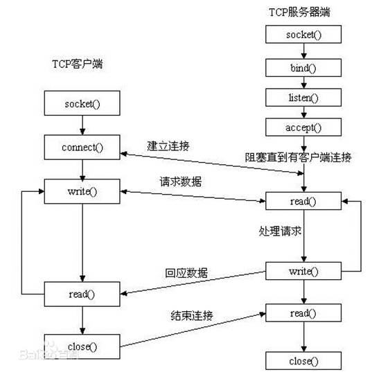
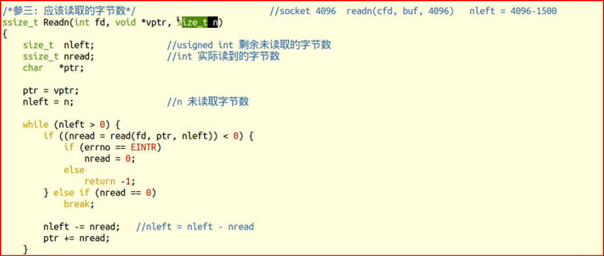
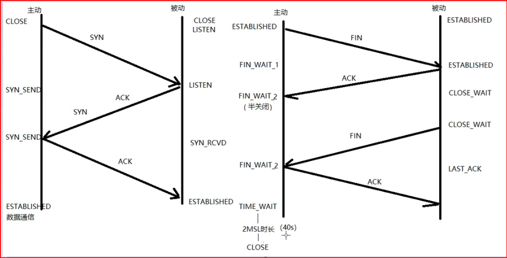
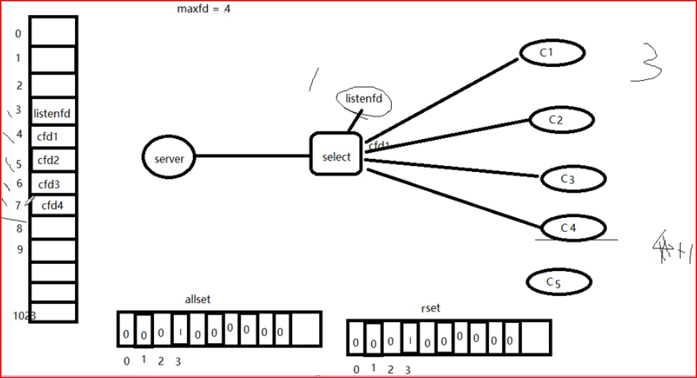

# day11

## 协议：

​	一组规则。

## 分层模型结构：

	OSI七层模型：  物、数、网、传、会、表、应
	
	TCP/IP 4层模型：网（链路层/网络接口层）、网、传、应
	
		应用层：http、ftp、nfs、ssh、telnet。。。
	
		传输层：TCP、UDP
	
		网络层：IP、ICMP、IGMP
	
		链路层：以太网帧协议、ARP

## c/s模型--客户端-服务器：

	client-server

## b/s模型--浏览器-服务器：

	browser-server


​					

|        | C/S                            | B/S                                  |
| ------ | ------------------------------ | ------------------------------------ |
| 优点： | 缓存大量数据、协议选择灵活     | 安全性、跨平台、开发工作量较小速度快 |
| 缺点： | 安全性、跨平台、开发工作量较大 | 不能缓存大量数据、严格遵守 http      |
|        | 需要安装 客户端                |                                      |

## 网络传输流程：

	数据没有封装之前，是不能在网络中传递。
	
	数据-》应用层-》传输层-》网络层-》链路层  --- 网络环境

​	

## 以太网帧协议： 

	ARP协议：根据 Ip 地址获取 mac 地址。
	
	以太网帧协议：根据mac地址，完成数据包传输。

## IP协议：

	版本： IPv4、IPv6  -- 4位
	
	TTL： time to live 。 设置数据包在路由节点中的跳转上限。每经过一个路由节点，该值-1， 减为0的路由，有义务将该数据包丢弃
	
	源IP： 32位。--- 4字节		192.168.1.108 --- 点分十进制 IP地址（string）  --- 二进制 
	
	目的IP：32位。--- 4字节

>
> IP地址：可以在网络环境中，唯一标识一台主机。
>
> 端口号：可以网络的一台主机上，唯一标识一个进程。
>
> ip地址+端口号：可以在网络环境中，唯一标识一个进程。
>

## UDP：

​	16位：源端口号。	2^16 = 65536  

	16位：目的端口号。

## TCP协议：记住

	16位：源端口号。	2^16 = 65536  
	
	16位：目的端口号。
	
	32序号;
	
	32确认序号。	
	
	6个标志位。
	
	16位窗口大小。	2^16 = 65536 


------

# socket-1

## 网络套接字：  socket(中文 插座的意思)

	一个文件描述符指向一个套接字（该套接字内部由内核借助两个缓冲区实现。）
	
	在通信过程中， 套接字一定是成对出现的。 有插 座,就得有插头
	一堆套接字


## 网络字节序函数：

**网络字节序**是指在网络通信中使用的一种标准的字节排列方式，规定了多字节数据的高字节在前，低字节在后的排列方式，即 **大端字节序 (Big-Endian)**。这种格式被广泛用于网络协议，以确保不同系统之间数据的正确传输和解析。

	小端法：（pc本地存储）	高位存高地址。地位存低地址。	int a = 0x12345678
	
	大端法：（网络存储）	高位存低地址。地位存高地址。
	
	htonl --> 本地--》网络 （IP）			192.168.1.11 --> string --> atoi --> int --> htonl --> 网络字节序
	
	将主机字节序的 32 位整数（long 类型，通常为 uint32_t）转换为网络字节序（大端字节序）。
	
	htons --> 本地--》网络 (port) 
	
	ntohl --> 网络--》 本地（IP）
	
	ntohs --> 网络--》 本地（Port）
	
	一个 IPv4 地址由 32 位表示。
	端口号由 16 位表示。
	因此 转到port 大多是 short
	转到 网络 大多是 long

> 由于 小端到大端, 不能直接读, 所以需要转换

> host to network long   32位
> h-to-n-l
>
> host to network short 16位
>
> htons
>
> 以及反过来

```c++
uint32_t htonl(uint32_t hostlong);
```


## atoi

`atoi` 是 C 标准库中的一个函数，用于将字符串转换为整数。它的名称来源于 "ASCII to integer"。


## IP地址转换函数inet_pton：

> 一般的:
>
> 192.168.1.1 -> string ->atoi -> int -> htonl -> 网络字节序
>
> 扎样太麻烦烦, 下面是整合的 函数

`inet_pton` 是一个在 C 语言中用于将字符串形式的 IP 地址转换为二进制形式的函数，适用于 IPv4 和 IPv6 地址。其名称来源于 **"presentation to network"**（表示形式到网络字节序）。

	int inet_pton(int af, const char *src, void *dst);		本地字节序（string IP） ---> 网络字节序
	
		af：AF_INET(代表ipv4)、AF_INET6(代表ipv6)
	
		src：传入，IP地址（点分十进制）
	
		dst：传出，转换后的 网络字节序的 IP地址。   
	
		返回值：
	
			成功： 1
	
			异常： 0， 说明src指向的不是一个有效的ip地址。
	
			失败：-1
			
			inet_pton（） 成功时返回 1（网络地址已成功转换）。如果 src 不包含表示指定地址族中有效网络地址的字符串，则返回 0。如果 af 不包含有效的地址系列，则返回 -1 并将 errno 设置为 EAFNOSUPPORT。


​			
​	
​	   const char *inet_ntop(int af, const void *src, char *dst, socklen_t size);	网络字节序 ---> 本地字节序（string IP）
​	
​		af：AF_INET、AF_INET6
​	
​		src: 网络字节序IP地址
​	
		dst：本地字节序（string IP）
	
		size： dst 的大小。 缓冲区大小
	
		返回值： 成功：dst。 	
	
			失败：NULL

## sockaddr地址结构--函数参数：	

IP + port	--> 在网络环境中唯一标识一个进程。

> man 7 ip 查看 该结构


```c++
struct sockaddr_in {
    sa_family_t    sin_family; /* address family: AF_INET */
    in_port_t      sin_port;   /* port in network byte order */
    struct in_addr sin_addr;   /* internet address */
};

/* Internet address */
struct in_addr {
    uint32_t       s_addr;     /* address in network byte order */
};

参1: 网络类型  ipv4 ipv6
参2: 端口的网络字节序 --- htons   
    表示端口号。端口号是 16 位整数，但需要以 网络字节序（大端字节序）存储，因此通常使用 htons() 函数将主机字节序转换为网络字节序。
参3: 网络地址 使用整合的 inet_pton   不是点分十进制
    在计算机内部和网络传输中，网络地址通常使用 二进制形式，并按照 网络字节序（大端字节序）进行存储和传输。
```

### 用法: 


	struct sockaddr_in addr; //强转实现 对应
	
	addr.sin_family = AF_INET/AF_INET6				
	
	addr.sin_port = htons(9527);
	------------------------------------
		int dst;
	
		inet_pton(AF_INET, "192.157.22.45", (void *)&dst);
	
	addr.sin_addr.s_addr = dst;  // 这三行 一般不这么用  下面那么用
	----------------------------------------
	
	【*】addr.sin_addr.s_addr = htonl(INADDR_ANY);		取出系统中有效的任意IP地址。二进制类型。
	//INADDR_ANY 是自动取 系统中有效的 ip地址, 且是 二进制类型, 因此使用 htonl函数
	
	bind(fd, (struct sockaddr *)&addr, size);   // 强转实现 对应


## htonl 和 inet_pton区别

**`htonl()`**：用于 **整数数据**的字节顺序转换，将主机字节序（例如，小端字节序）转换为网络字节序（大端字节序）。它通常用于处理 **端口号** 和 **IP 地址**（IPv4 地址）的 **网络字节序表示**。

**`inet_pton()`**：将 **点分十进制的 IP 地址** 字符串转换为 **网络字节序** 的二进制地址形式，存储在 `struct in_addr` 或 `struct in6_addr` 中，适用于网络编程中处理 **IP 地址**。

## socket函数-创建套接字：

	#include <sys/socket.h>
	
	int socket(int domain, int type, int protocol);		创建一个 套接字
	
		domain：AF_INET、AF_INET6、AF_UNIX(本地套接字) ip地址类型
	
		type：SOCK_STREAM、SOCK_DGRAM   数据传输协议 流式通信(代表:tcp) 和 数据报通信(代表:udp)。
	
		protocol: 0   表示 选用协议的 代表协议
	
		返回值：
	
			成功： 新套接字所对应文件描述符
	
			失败: -1 errno
	
	fd = socket(AF_INET, SOCK_STREAM,0)

> **用途**：初始化网络通信的入口，用于创建服务器或客户端的通信接口。

## bind函数-绑定(ip+端口号)地址结构

> 指定服务器监听的本地地址和端口号，使得客户端可以连接到服务器。

```c++
 #include <arpa/inet.h>

 int bind(int sockfd, const struct sockaddr *addr, socklen_t addrlen);		给socket绑定一个 地址结构 (IP+port)

	sockfd: socket 函数返回值

		struct sockaddr_in addr;

		addr.sin_family = AF_INET;   // 与socket第一个参数一致

		addr.sin_port = htons(8888); 

		addr.sin_addr.s_addr = htonl(INADDR_ANY);

	addr: 传入参数(struct sockaddr *)&addr   // 强转实现 对应., 新的此 addr 是 struvt sockaddr_in  ipv4 结构

	addrlen: sizeof(addr) 地址结构的大小。

	返回值：

		成功：0

		失败：-1 errno
```

## listen函数: 设置同时监听个数

> **用途**：服务器进入监听状态，准备接收客户端连接。

```c++
int listen(int sockfd, int backlog);		设置同时与服务器建立连接的上限数。（同时进行3次握手的客户端数量）

	sockfd: socket 函数返回值

	backlog：上限数值。最大值 128.   
        
        返回值：

		成功：0

		失败：-1 errno	
```


## accept函数\- 阻塞监听客户端连接

- > **用途**：服务器与客户端建立连接，进入通信状态。


​	
​	int accept(int sockfd, struct sockaddr *addr, socklen_t *addrlen);	阻塞等待客户端建立连接，成功的话，返回一个与客户端成功连接的socket文件描述符。
​	
​		sockfd: socket 函数返回值
​	
​		addr：传出参数。成功与服务器建立连接的那个客户端的地址结构（IP+port）------没有了 const


​		
​	
​			socklen_t clit_addr_len = sizeof(addr);
​	
​		addrlen：传入传出。 &clit_addr_len
​	
​			 入：addr的大小。 出：客户端addr实际大小。
​			 对于 struct sockaddr_in，通常返回值仍然是 sizeof(struct sockaddr_in)，但在某些协议扩展或特定情况下可能不同。
​	
		返回值：
	
			成功：能与客户端进行数据通信的 socket 对应的文件描述。
	
			失败： -1 ， errno


## 区别 bind 和 accept 的 addr参数

bind 里 是传入参数, 有 const 修饰

accept 里 是传出参数, 无 const修饰

bind里 addr 绑定的是 服务端自己的 地址结构

accept里 addr 绑定的是 客户端的 地址结构


## 客户端一般不需要 bind

在客户端,不使用, 将会是 隐式绑定

## connect函数​-与服务器建立连接     

     int connect(int sockfd, const struct sockaddr *addr, socklen_t addrlen);	  使用现有的 socket 与服务器建立连接
    ​    
        	sockfd： socket 函数返回值
        		
    		struct sockaddr_in srv_addr;		// 服务器地址结构
    
    		srv_addr.sin_family = AF_INET;
    
    		srv_addr.sin_port = 9527 	跟服务器bind时设定的 port 完全一致。
    
    		inet_pton(AF_INET, "服务器的IP地址"，&srv_adrr.sin_addr.s_addr);
    
    	addr：传入参数。服务器的地址结构
    				
    ​		addrlen：服务器的地址结构的大小
    ​	
    		返回值：
    				成功：0
    
    		失败：-1 errno
    
    	如果不使用bind绑定客户端地址结构, 采用"隐式绑定".

> 特别注意:  addr的参数  有些 不能随便设置

## 套接字个数--很重要

> 一个客户端,  一个服务端,  但是有 三个 套接字
>
> 一对 通信的
>
> 一个 服务端监听的

**服务端监听套接字**（`listening socket`）

- 服务端通过 `socket()` 创建的套接字，用于监听客户端的连接请求。
- 这是一个 **被动套接字**，只负责接受连接请求，不直接用于数据通信。
- 在 `bind()` 后绑定到特定的 IP 和端口，通过 `listen()` 开始监听连接。

**服务端通信套接字**（`connected socket`）

- 服务端通过 `accept()` 从监听套接字中获取的新套接字，用于与某个客户端进行通信。
- 每当一个客户端连接成功，服务端会创建一个新的通信套接字，与该客户端独立通信。

**客户端套接字**（`client socket`）

- 客户端通过 `socket()` 创建的套接字，主动发起与服务端的连接请求。
- 这个套接字在 `connect()` 成功后，直接用于与服务端通信。


> 就比如,  酒店门口有一个 迎宾小姐, 把你领进房间, 房间有另一个人 接待你


## TCP通信流程分析:

	server:
		1. socket()	创建socket
	
		2. bind()	绑定服务器地址结构
	
		3. listen()	设置监听上限,  （同时进行3次握手的客户端数量）
	
		4. accept()	阻塞监听客户端连接
	
		5. read(fd)	读socket获取客户端数据
	
		6. 小--大写	toupper()
	
		7. write(fd)
	
		8. close();
	
	client:
	
		1. socket()	创建socket
	
		2. connect();	与服务器建立连接  ip和端口号
	
		3. write()	写数据到 socket
	
		4. read()	读转换后的数据。
	
		5. 显示读取结果
	
		6. close()


## 流程图-重中之重



## 补充-1 socket实例-1 server

大小写转换

该server实例,  在没有客户端的情况下, 可以使用nc 命令, 进行通讯


一般不会自动退出 程序, 需手动停止, 或者 客户端发 终止信号

```c++
#include <stdio.h>
#include <ctype.h>
#include <sys/socket.h>
#include <arpa/inet.h>
#include <stdlib.h>
#include <string.h>
#include <unistd.h>
#include <errno.h>
#include <pthread.h>

#define SERV_PORT 9527


void sys_err(const char *str)
{
    perror(str);
    exit(1);
}

int main(int argc, char *argv[])
{
    int lfd = 0, cfd = 0;
    int ret, i;
    char buf[BUFSIZ], client_IP[1024];

    struct sockaddr_in serv_addr, clit_addr;  // �����������ַ�ṹ �� �ͻ��˵�ַ�ṹ
    socklen_t clit_addr_len;				  // �ͻ��˵�ַ�ṹ��С

    serv_addr.sin_family = AF_INET;				// IPv4
    serv_addr.sin_port = htons(SERV_PORT);		// תΪ�����ֽ���� �˿ں�
    serv_addr.sin_addr.s_addr = htonl(INADDR_ANY);	// ��ȡ����������ЧIP

    lfd = socket(AF_INET, SOCK_STREAM, 0);		//����һ�� socket
    if (lfd == -1) {
        sys_err("socket error");
    }

    bind(lfd, (struct sockaddr *)&serv_addr, sizeof(serv_addr));//��������socket�󶨵�ַ�ṹ��IP+port)

    listen(lfd, 128);					//	���ü�������

    clit_addr_len = sizeof(clit_addr);	// 	��ȡ�ͻ��˵�ַ�ṹ��С

    cfd = accept(lfd, (struct sockaddr *)&clit_addr, &clit_addr_len);	// �����ȴ��ͻ�����������
    if (cfd == -1)
        sys_err("accept error");

    printf("client ip:%s port:%d\n", 
            inet_ntop(AF_INET, &clit_addr.sin_addr.s_addr, client_IP, sizeof(client_IP)), 
            ntohs(clit_addr.sin_port));			// 可以拿到 客户端的ip和端口

    while (1) {
        ret = read(cfd, buf, sizeof(buf));		// ���ͻ�������
        write(STDOUT_FILENO, buf, ret);			// д����Ļ�鿴

        for (i = 0; i < ret; i++)				// Сд -- ��д
            buf[i] = toupper(buf[i]);

        write(cfd, buf, ret);					// ����д��д�ظ��ͻ��ˡ�
    }

    close(lfd);
    close(cfd);

    return 0;
}

```


## 补充-2 client

```c++
#include <stdio.h>
#include <sys/socket.h>
#include <arpa/inet.h>
#include <stdlib.h>
#include <string.h>
#include <unistd.h>
#include <errno.h>
#include <pthread.h>

#define SERV_PORT 9527

void sys_err(const char *str)
{
	perror(str);
	exit(1);
}

int main(int argc, char *argv[])
{
    int cfd;
    int conter = 10;
    char buf[BUFSIZ];
    
    struct sockaddr_in serv_addr;          //服务器地址结构

    serv_addr.sin_family = AF_INET;
    serv_addr.sin_port = htons(SERV_PORT);
    //inet_pton(AF_INET, "127.0.0.1", &serv_addr.sin_addr.s_addr);
    inet_pton(AF_INET, "127.0.0.1", &serv_addr.sin_addr);

    cfd = socket(AF_INET, SOCK_STREAM, 0);
    if (cfd == -1)
        sys_err("socket error");

    int ret = connect(cfd, (struct sockaddr *)&serv_addr, sizeof(serv_addr));
    if (ret != 0)
        sys_err("connect err");

    while (conter--) {
        write(cfd, "hello\n", 6);
        ret = read(cfd, buf, sizeof(buf));
        write(STDOUT_FILENO, buf, ret);
        sleep(1);
    }

    close(cfd);

	return 0;
}

```


## 客户端注意点:

客户端不需要 设置客户端的 地址结构, 也就是 bind函数, 会隐式确定

connect函数, 里面是 服务端的 ip和port


## nc命令

`nc`（全称为 **Netcat**）是一款功能强大的网络工具，用于调试和网络通信。它支持 TCP 和 UDP 协议，能够作为客户端或服务器工作。

### **基本功能**

1. **监听端口**：作为服务端接收连接。
2. **发起连接**：作为客户端连接到目标主机和端口。
3. **数据传输**：发送或接收数据流。
4. **端口扫描**：扫描目标主机的开放端口。
5. **文件传输**：通过网络传递文件。

```c++
nc [选项] [目标地址] [端口]
```

### **常见用法**

#### **1. 简单监听端口**

在本地端口 `1234` 上监听，等待连接：

```
nc -l -p 1234
```

#### **2. 发起 TCP 连接**

连接到 `192.168.1.100` 的 `80` 端口：

```
nc 192.168.1.100 80
```

#### **3. 文件传输**

**服务端**监听并接收文件：

```
nc -l -p 1234 > received_file.txt
```

**客户端**发送文件：

```
nc 192.168.1.100 1234 < file_to_send.txt
```

#### **4. 端口扫描**

扫描目标主机的指定端口范围（如 1-1000）：

```
nc -z -v 192.168.1.100 1-1000
```

#### **5. 测试 UDP 连接**

服务端监听 UDP 端口：

```
nc -u -l -p 
```

## 网络编程 常用头文件

**`<sys/socket.h>`**：定义套接字函数和相关常量。

**`<netinet/in.h>`**：定义网络地址结构和协议。

**`<arpa/inet.h>`**：提供 IP 地址转换的工具函数。

**`<unistd.h>`**：定义 `close` 等函数。

**`<string.h>`**：处理字符串和内存操作。

**`<errno.h>`**：提供错误码。 


# day12

## 三次握手(tcp)：

	主动发起连接请求端，发送 SYN 标志位，请求建立连接。 携带序号号、数据字节数(0)、滑动窗口大小。
	
	被动接受连接请求端，发送 ACK 标志位，同时携带 SYN 请求标志位。携带序号、确认序号、数据字节数(0)、滑动窗口大小。
	
	主动发起连接请求端，发送 ACK 标志位，应答服务器连接请求。携带确认序号。

这个连接请求端, 好像表达的有问题

## 四次挥手(tcp)：关闭连接

	主动关闭连接请求端， 发送 FIN 标志位。 
	
	被动关闭连接请求端， 应答 ACK 标志位。 		 ----- 半关闭完成。

> 关的是 缓冲区, 而不是整个 套接字


	被动关闭连接请求端， 发送 FIN 标志位。
	
	主动关闭连接请求端， 应答 ACK 标志位。		 ----- 连接全部关闭

## 滑动窗口：

	发送给连接对端，本端的缓冲区大小（实时），保证数据不会丢失。

------

回看 socket里面的 c/s  tcp模型图, 对应这个 三次握手, 四次挥手(课件)

# socket-2

## 错误处理函数(自己封装函数)： 

	封装目的： 
	
		在 server.c 编程过程中突出逻辑，将出错处理与逻辑分开，可以直接跳转man手册。


	【wrap.c】								【wrap.h】


	存放网络通信相关常用 自定义函数						存放 网络通信相关常用 自定义函数原型(声明)。
	
	命名方式：系统调用函数首字符大写, 方便查看man手册
		
		  如：Listen()、Accept();
	
	函数功能：调用系统调用函数，处理出错场景。
	
	在 server.c 和 client.c 中调用 自定义函数
	
	联合编译 server.c 和 wrap.c 生成 server
	 
		 client.c 和 wrap.c 生成 client


## 补充-1 封装错误处理函数

对于 函数名, 如果 大写, 仍然可以跳转man手册

因此, 使用大写 封装 原函数的 错误处理信息

```c++
// wrap.h
#ifndef __WRAP_H_
#define __WRAP_H_

void perr_exit(const char *s);
int Accept(int fd, struct sockaddr *sa, socklen_t *salenptr);
int Bind(int fd, const struct sockaddr *sa, socklen_t salen);
int Connect(int fd, const struct sockaddr *sa, socklen_t salen);
int Listen(int fd, int backlog);
int Socket(int family, int type, int protocol);
ssize_t Read(int fd, void *ptr, size_t nbytes);
ssize_t Write(int fd, const void *ptr, size_t nbytes);
int Close(int fd);
ssize_t Readn(int fd, void *vptr, size_t n);
ssize_t Writen(int fd, const void *vptr, size_t n);
ssize_t my_read(int fd, char *ptr);
ssize_t Readline(int fd, void *vptr, size_t maxlen);

#endif

```


```c++
// wrap.c
#include <stdlib.h>
#include <stdio.h>
#include <unistd.h>
#include <errno.h>
#include <sys/socket.h>

void perr_exit(const char *s)
{
	perror(s);
	exit(-1);
}

int Accept(int fd, struct sockaddr *sa, socklen_t *salenptr)
{
	int n;

again:
	if ((n = accept(fd, sa, salenptr)) < 0) {
		if ((errno == ECONNABORTED) || (errno == EINTR))
			goto again;
		else
			perr_exit("accept error");
	}
	return n;
}

int Bind(int fd, const struct sockaddr *sa, socklen_t salen)
{
    int n;

	if ((n = bind(fd, sa, salen)) < 0)
		perr_exit("bind error");

    return n;
}

int Connect(int fd, const struct sockaddr *sa, socklen_t salen)
{
    int n;

	if ((n = connect(fd, sa, salen)) < 0)
		perr_exit("connect error");

    return n;
}

int Listen(int fd, int backlog)
{
    int n;

	if ((n = listen(fd, backlog)) < 0)
		perr_exit("listen error");

    return n;
}

int Socket(int family, int type, int protocol)
{
	int n;

	if ((n = socket(family, type, protocol)) < 0)
		perr_exit("socket error");

	return n;
}

ssize_t Read(int fd, void *ptr, size_t nbytes)
{
	ssize_t n;

again:
	if ( (n = read(fd, ptr, nbytes)) == -1) {
		if (errno == EINTR)
			goto again;
		else
			return -1;
	}
	return n;
}

ssize_t Write(int fd, const void *ptr, size_t nbytes)
{
	ssize_t n;

again:
	if ( (n = write(fd, ptr, nbytes)) == -1) {
		if (errno == EINTR)
			goto again;
		else
			return -1;
	}
	return n;
}

int Close(int fd)
{
    int n;
	if ((n = close(fd)) == -1)
		perr_exit("close error");

    return n;
}

/*参三: 应该读取的字节数*/
ssize_t Readn(int fd, void *vptr, size_t n)
{
	size_t  nleft;              //usigned int 剩余未读取的字节数
	ssize_t nread;              //int 实际读到的字节数
	char   *ptr;

	ptr = vptr;
	nleft = n;

	while (nleft > 0) {
		if ((nread = read(fd, ptr, nleft)) < 0) {
			if (errno == EINTR)
				nread = 0;
			else
				return -1;
		} else if (nread == 0)
			break;

		nleft -= nread;
		ptr += nread;
	}
	return n - nleft;
}

ssize_t Writen(int fd, const void *vptr, size_t n)
{
	size_t nleft;
	ssize_t nwritten;
	const char *ptr;

	ptr = vptr;
	nleft = n;
	while (nleft > 0) {
		if ( (nwritten = write(fd, ptr, nleft)) <= 0) {
			if (nwritten < 0 && errno == EINTR)
				nwritten = 0;
			else
				return -1;
		}

		nleft -= nwritten;
		ptr += nwritten;
	}
	return n;
}

static ssize_t my_read(int fd, char *ptr)
{
	static int read_cnt;
	static char *read_ptr;
	static char read_buf[100];

	if (read_cnt <= 0) {
again:
		if ( (read_cnt = read(fd, read_buf, sizeof(read_buf))) < 0) {
			if (errno == EINTR)
				goto again;
			return -1;
		} else if (read_cnt == 0)
			return 0;
		read_ptr = read_buf;
	}
	read_cnt--;
	*ptr = *read_ptr++;

	return 1;
}

ssize_t Readline(int fd, void *vptr, size_t maxlen)
{
	ssize_t n, rc;
	char    c, *ptr;

	ptr = vptr;
	for (n = 1; n < maxlen; n++) {
		if ( (rc = my_read(fd, &c)) == 1) {
			*ptr++ = c;
			if (c  == '\n')
				break;
		} else if (rc == 0) {
			*ptr = 0;
			return n - 1;
		} else
			return -1;
	}
	*ptr  = 0;

	return n;
}

```


> 通过封装,降低 主函数的 长度, 强化处理逻辑


## read和write局限

在系统中, 用系统调用

不在系统中时, 多用库函数, 提高效率,  自己封装read 会有点麻烦

但是

在 sockrt里, 不能用 库函数 fread, fwrite,  因为需要 文件结构体指针 

但 socket里 只有文件描述符

## readn 自封装(见课程)：



​	读 N 个字节

## readline：

	读一行

## read 函数的返回值(重点)：

	1. > 0 实际读到的字节数
	
	2. = 0 已经读到结尾（对端已经关闭）【 ！重 ！点 ！】
	
	3. -1 应进一步判断errno的值：
	
		errno = EAGAIN or EWOULDBLOCK: 设置了非阻塞方式 读。 没有数据到达。 
	
		errno = EINTR 慢速系统调用被 中断。
	
		errno = “其他情况” 异常。


> 网络编程中, read返回0 非常重要
>
>  = 0 已经读到结尾（对端已经关闭）

## 多进程并发服务器：server.c

只用子进程 处理,  父进程 持续监听, 因此 每个子进程 开始时, 必须关闭 最初的 服务器第一个 套接字

	1. Socket();		创建 监听套接字 lfd
	2. Bind()	绑定地址结构 Strcut scokaddr_in addr;
	3. Listen();	
	4. while (1) {
	
		cfd = Accpet();			接收客户端连接请求。
		pid = fork();
		if (pid == 0){			子进程 read(cfd) --- 小-》大 --- write(cfd)
	
			close(lfd)		关闭用于建立连接的套接字 lfd
	
			read()
			小--大
			write()
	
		} else if （pid > 0） {	
	
			close(cfd);		关闭用于与客户端通信的套接字 cfd	
			contiue;
		}
	  }
	
	5. 子进程：
	
		close(lfd)
	
		read()
	
		小--大
	
		write()	
	
	   父进程：
	
		close(cfd);
	
		注册信号捕捉函数：	SIGCHLD
	
		在回调函数中， 完成子进程回收
	
			while （waitpid()）;

## 多线程并发服务器： server.c  

	1. Socket();		创建 监听套接字 lfd
	
	2. Bind()		绑定地址结构 Strcut scokaddr_in addr;
	
	3. Listen();		
	
	4. while (1) {		
	
		cfd = Accept(lfd, );
	
		pthread_create(&tid, NULL, tfn, (void *)cfd);
	
		pthread_detach(tid);  				// pthead_join(tid, void **);  新线程---专用于回收子线程。    
	  }
	
	5. 子线程：
	
		void *tfn(void *arg) 
		{
			// close(lfd)			不能关闭。 主线程要使用lfd  线程共享 fd
	
			read(cfd)
	
			小--大
	
			write(cfd)
	
			pthread_exit（(void *)10）;	
		}

> 兄弟线程之间可以回收   pthread_join
>
> 兄弟进程 不能,  所以才有了 信号捕捉 SIGCHLD 处理子进程退出

## 补充-1 多进程并发服务器 实例

```c++
#include <stdio.h>
#include <ctype.h>
#include <stdlib.h>
#include <sys/wait.h>
#include <string.h>
#include <strings.h>
#include <unistd.h>
#include <errno.h>
#include <signal.h>
#include <sys/socket.h>
#include <arpa/inet.h>
#include <pthread.h>

#include "wrap.h"

#define SRV_PORT 9999

void catch_child(int signum)
{
    while ((waitpid(0, NULL, WNOHANG)) > 0);
    return ;
}

int main(int argc, char *argv[])
{
    int lfd, cfd;
    pid_t pid;
    struct sockaddr_in srv_addr, clt_addr;
    socklen_t clt_addr_len; 
    char buf[BUFSIZ];
    int ret, i;

    //memset(&srv_addr, 0, sizeof(srv_addr));                 // 将地址结构清零
    bzero(&srv_addr, sizeof(srv_addr));

    srv_addr.sin_family = AF_INET;
    srv_addr.sin_port = htons(SRV_PORT);
    srv_addr.sin_addr.s_addr = htonl(INADDR_ANY);

    lfd = Socket(AF_INET, SOCK_STREAM, 0);

    Bind(lfd, (struct sockaddr *)&srv_addr, sizeof(srv_addr));

    Listen(lfd, 128);

    clt_addr_len = sizeof(clt_addr);

    while (1) {

        cfd = Accept(lfd, (struct sockaddr *)&clt_addr, &clt_addr_len);

        pid = fork();
        if (pid < 0) {
            perr_exit("fork error");
        } else if (pid == 0) {
            close(lfd);
            break;        
        } else {
            struct sigaction act;

            act.sa_handler = catch_child;
            sigemptyset(&act.sa_mask);
            act.sa_flags = 0;

            ret = sigaction(SIGCHLD, &act, NULL);
            if (ret != 0) {
               perr_exit("sigaction error");
            }
            close(cfd); 
            continue;
        }
    }

    if (pid == 0) {
        for (;;) {
            ret = Read(cfd, buf, sizeof(buf));
            if (ret == 0) {
                close(cfd);
                exit(1);
            } 

            for (i = 0; i < ret; i++)
                buf[i] = toupper(buf[i]);

            write(cfd, buf, ret);
            write(STDOUT_FILENO, buf, ret);
        }
    }

    return 0;
}

```

## memset函数和bzero函数

### **`memset` 函数**

`memset` 是一个标准的 C 库函数，用于将某个值填充到一块内存区域中。

#### **函数原型**

```
void *memset(void *s, int c, size_t n);
```

#### **参数说明**

- `s`：指向需要初始化的内存区域的指针。
- `c`：要填充的值（会被转换为无符号字符类型，即 `unsigned char`）。
- `n`：需要填充的字节数。

#### **功能**

将内存区域的前 `n` 个字节设置为值 `c`。

### **`bzero` 函数**

`bzero` 是一个非标准函数，主要用于将一块内存清零。

#### **函数原型**

```
void bzero(void *s, size_t n);
```

#### **参数说明**

- `s`：指向需要清零的内存区域的指针。
- `n`：需要清零的字节数。

#### **功能**

将内存区域的前 `n` 个字节设置为 0。


在现代 C 编程中，优先使用 `memset` 替代 `bzero`，因为：

- `memset` 是标准库函数，具有更好的兼容性和移植性。
- `bzero` 在一些新的系统（如 Linux 的 glibc）中已经被标记为过时，可能会引发警告。


## wait函数 和 信号捕捉实现 回收进程区别

### **`wait` 系列函数**

`wait` 和 `waitpid` 是最直接的方式，用于等待子进程退出并回收其资源。

#### **关键点**

- **`wait`**：阻塞当前进程，直到任意子进程退出。
- **`waitpid`**：可以等待指定的子进程，支持非阻塞模式。

#### **优点**

- 精确控制：父进程明确等待某个或任意子进程，控制逻辑清晰。
- 支持非阻塞：通过 `waitpid` 的 `WNOHANG` 选项，可以轮询子进程状态。

#### **缺点**

- 阻塞问题：`wait` 会阻塞父进程，如果没有子进程退出，父进程会一直等待。
- 繁琐：需要显式调用 `wait` 或 `waitpid`，父进程需要主动管理子进程。

### **信号捕捉 (`SIGCHLD`)**

信号捕捉是通过处理 `SIGCHLD` 信号，在子进程退出时自动触发信号处理函数，用于回收子进程资源。

#### **关键点**

- 当子进程退出时，内核会向父进程发送 `SIGCHLD` 信号。
- 父进程可以在信号处理函数中调用 `waitpid` 来回收子进程。

#### **优点**

- 非阻塞：信号处理是异步的，不会阻塞父进程。
- 自动化：无需主动轮询，内核会在子进程退出时通知父进程。

#### **缺点**

- 信号竞争问题：如果在信号处理期间有多个子进程退出，可能需要额外的逻辑处理。
- 复杂度稍高：需要正确设置信号处理函数，处理好信号和主程序的逻辑。


## 补充-2 多线程并发服务器

多线程 需要数组 存线程id


```c++
#include <stdio.h>
#include <string.h>
#include <arpa/inet.h>
#include <pthread.h>
#include <ctype.h>
#include <unistd.h>
#include <fcntl.h>

#include "wrap.h"

#define MAXLINE 8192
#define SERV_PORT 8000

struct s_info {                     //定义一个结构体, 将地址结构跟cfd捆绑
    struct sockaddr_in cliaddr;
    int connfd;
};

void *do_work(void *arg)
{
    int n,i;
    struct s_info *ts = (struct s_info*)arg;
    char buf[MAXLINE];
    char str[INET_ADDRSTRLEN];      //#define INET_ADDRSTRLEN 16  可用"[+d"查看

    while (1) {
        n = Read(ts->connfd, buf, MAXLINE);                     //读客户端
        if (n == 0) {
            printf("the client %d closed...\n", ts->connfd);
            break;                                              //跳出循环,关闭cfd
        }
        printf("received from %s at PORT %d\n",
                inet_ntop(AF_INET, &(*ts).cliaddr.sin_addr, str, sizeof(str)),
                ntohs((*ts).cliaddr.sin_port));                 //打印客户端信息(IP/PORT)

        for (i = 0; i < n; i++) 
            buf[i] = toupper(buf[i]);                           //小写-->大写

        Write(STDOUT_FILENO, buf, n);                           //写出至屏幕
        Write(ts->connfd, buf, n);                              //回写给客户端
    }
    Close(ts->connfd);

    return (void *)0;
}

int main(void)
{
    struct sockaddr_in servaddr, cliaddr;
    socklen_t cliaddr_len;
    int listenfd, connfd;
    pthread_t tid;

    struct s_info ts[256];      //创建结构体数组.
    int i = 0;

    listenfd = Socket(AF_INET, SOCK_STREAM, 0);                     //创建一个socket, 得到lfd

    bzero(&servaddr, sizeof(servaddr));                             //地址结构清零
    servaddr.sin_family = AF_INET;
    servaddr.sin_addr.s_addr = htonl(INADDR_ANY);                               //指定本地任意IP
    servaddr.sin_port = htons(SERV_PORT);                                       //指定端口号 

    Bind(listenfd, (struct sockaddr *)&servaddr, sizeof(servaddr));             //绑定

    Listen(listenfd, 128);                                                      //设置同一时刻链接服务器上限数

    printf("Accepting client connect ...\n");

    while (1) {
        cliaddr_len = sizeof(cliaddr);
        connfd = Accept(listenfd, (struct sockaddr *)&cliaddr, &cliaddr_len);   //阻塞监听客户端链接请求
        ts[i].cliaddr = cliaddr;
        ts[i].connfd = connfd;

        pthread_create(&tid, NULL, do_work, (void*)&ts[i]); //这里传值,会丢数据, 数组中一个结构体大小 20字节, void* 是4字节 强转 会丢数据   而数组没法变化,正好可以传地址
// 可以malloc 空间, 把这个空间地址 传过去, 
        pthread_detach(tid);                                                    //子线程分离,防止僵线程产生.
        i++;
    }

    return 0;
}


```

**32位系统：** void* 通常占用4个字节。

**64位系统：** void* 通常占用8个字节。


------


# day13

## TCP状态时序图：

> 重点是 课件的 图



	结合三次握手、四次挥手 理解记忆。


	1. 主动发起连接请求端：	CLOSE -- 发送SYN -- SEND_SYN -- 接收 ACK、SYN -- SEND_SYN -- 发送 ACK -- ESTABLISHED（数据通信态）
	
	2. 主动关闭连接请求端： ESTABLISHED（数据通信态） -- 发送 FIN -- FIN_WAIT_1 -- 接收ACK -- FIN_WAIT_2（半关闭）
	
				-- 接收对端发送 FIN -- FIN_WAIT_2（半关闭）-- 回发ACK -- TIME_WAIT（只有主动关闭连接方，会经历该状态）
	
				-- 等 2MSL时长 -- CLOSE 
	
	3. 被动接收连接请求端： CLOSE -- LISTEN -- 接收 SYN -- LISTEN -- 发送 ACK、SYN -- SYN_RCVD -- 接收ACK -- ESTABLISHED（数据通信态）
	
	4. 被动关闭连接请求端： ESTABLISHED（数据通信态） -- 接收 FIN -- ESTABLISHED（数据通信态） -- 发送ACK 
	
				-- CLOSE_WAIT (说明对端【主动关闭连接端】处于半关闭状态) -- 发送FIN -- LAST_ACK -- 接收ACK -- CLOSE


	重点记忆： ESTABLISHED、FIN_WAIT_2 <--> CLOSE_WAIT、TIME_WAIT（2MSL）
	
	netstat -apn | grep  端口号

> TIME_WAIT只有主动关闭端有这个状态
>
> 如果先关闭 服务端, 服务端是 FIN_WAIT_2 状态 客户端是CLOSE_WAIT
>
> 课件上的 实线和虚线 两个图

> 注意 上面的总结, 一直写的是  主动和被动, 没有对应到 服务端,客户端, 这个要注意, 具体情况具体分析你   

## netstat

`netstat` 是一个命令行工具，用于显示网络连接、路由表、网络接口统计信息等。它是诊断网络问题和监控网络活动的常用工具。

```
netstat -a
```

- 显示所有活动的 TCP 和 UDP 连接以及监听端口。


```
netstat -ap
```

- 显示与端口或连接关联的程序名和 PID。


**结合 grep 查找指定端口或服务**

```
netstat -an | grep <端口号> 或者 <服务程序>
```

- 例如，查找 80 端口相关连接：

  ```
  bash
  
  
  复制编辑
  netstat -an | grep :80
  ```


在某些现代 Linux 发行版中，`netstat` 已被标记为过时，建议使用 `ss` 命令替代。`ss` 提供类似功能，但效率更高。


### 使用

`-a`：显示所有连接和监听端口，包括 TCP 和 UDP。

`-p`：显示与每个连接或端口关联的程序名及其 PID（需要管理员权限）。

`-n`：以数字形式显示地址和端口，而不是解析主机名或服务名称（提高显示速度）。

```c++
netstat -apn | grep client
tcp        0      0 127.0.0.1:35268         127.0.0.1:8000          ESTABLISHED 1734/./client       
```

```c++
netstat -apn | grep 8000
tcp        0      0 0.0.0.0:8000            0.0.0.0:*               LISTEN      1553/./server       
tcp        0      0 127.0.0.1:8000          127.0.0.1:35268         ESTABLISHED 1553/./server       
tcp        0      0 127.0.0.1:35268         127.0.0.1:8000          ESTABLISHED 1734/./client   
```


## 2MSL时长：

> 等待 如果被动关闭端没收到最后的ACK,一定会 反复发送 FIN, 因此这个 等待 2MSL 是必须的

	一定出现在【主动关闭连接请求端】。 --- 对应 TIME_WAIT 状态。
	
	保证，最后一个 ACK 能成功被对端接收。（等待期间，对端没收到我发的ACK，对端会再次发送FIN请求。）

## 端口复用:

```c++
服务器先关闭, 会有 TIME_WAIT状态, 导致 2MSL时长, 再次马上开启 是不行的
    所以有了 端口复用
```

man手册无, 不全, 还得再书上找


这段代码 是死的, 复制即用  bind之前

opt 非0 表示开启,  0表示关闭

	int opt = 1;		// 设置端口复用。
	
	setsockopt(lfd, SOL_SOCKET, SO_REUSEADDR, (void *)&opt, sizeof(opt));
	// 加peror检查
	set---sock---opt

TIME_WAIT仍然在,但能用


## 半关闭：

	通信双方中，只有一端关闭通信。  --- FIN_WAIT_2
	
	close（cfd）;
	
	shutdown(int fd, int how);	// 特殊关闭,只关一端
	
		how: 	SHUT_RD	关读端
	
			SHUT_WR	关写端
	
			SHUT_RDWR 关读写
	
	shutdown在关闭多个文件描述符应用的文件时，采用全关闭方法。close，只关闭一个。


> 在 dup2(3,4)  close(3) 但4还能访问,
> shutdowmn(3)  将3和4都会关闭

​	

## select多路IO转接(selcet, poll, epoll)：

> 阻塞:
>
> 非阻塞忙轮询:
>
> 响应式: 多路io转接

## select


	int select(int nfds, fd_set *readfds, fd_set *writefds,fd_set *exceptfds, struct timeval *timeout);
	
	nfds：监听的所有文件描述符中，最大文件描述符+1  这个+1是man规定的, 但是写程序循环的时候, < +1 或者 <= 不+1  ,  他实际就是这个意思
	
	readfds： 读事件    文件描述符监听集合。	传入、传出参数
	
	writefds：写事件    文件描述符监听集合。	传入、传出参数		NULL
	
	exceptfds：异常事件   文件描述符监听集合	传入、传出参数		NULL
	
	timeout： 	> 0: 	设置监听超时时长。
	
			NULL:	阻塞监听
	
			0：	非阻塞监听，轮询
	返回值：
	
		> 0:	所有监听集合（3个）中， 满足对应事件的总数。
	
		0：	没有满足监听条件的文件描述符
	
		-1： 	errno


​		
	传入传出参数: 
	该函数   传进去的是要监听的,   传出来的 是 监听到发生事件的


> 集合使用位图, 因此有select 相关的 下列函数也要 注意

	原理：  借助内核， select 来监听， 客户端连接、数据通信事件。
	
	void FD_ZERO(fd_set *set);	--- 清空一个文件描述符集合。  位图置0
	
		fd_set rset;
	
		FD_ZERO(&rset);
	
	void FD_SET(int fd, fd_set *set);	--- 将待监听的文件描述符，添加到监听集合中
	
		FD_SET(3, &rset);	FD_SET(5, &rset);	FD_SET(6, &rset);


	void FD_CLR(int fd, fd_set *set);	--- 将一个文件描述符从监听集合中 移除。
	
		FD_CLR（4， &rset）;
	
	int  FD_ISSET(int fd, fd_set *set);	--- 判断一个文件描述符是否在监听集合中。
	
		返回值： 在：1；不在：0；
	
		FD_ISSET（4， &rset）;


## select思路分析：

	int maxfd = 0；
	
	lfd = socket() ;			创建套接字
	
	maxfd = lfd；
	
	bind();					绑定地址结构
	
	listen();				设置监听上限
	
	fd_set rset， allset;			创建r监听集合
	
	FD_ZERO(&allset);				将r监听集合清空
	
	FD_SET(lfd, &allset);			将 lfd 添加至读集合中。
	
	while（1） {
	
		rset = allset；			保存监听集合
	
		ret  = select(lfd+1， &rset， NULL， NULL， NULL);		监听文件描述符集合对应事件。
	
		if（ret > 0） {							有监听的描述符满足对应事件
		
			if (FD_ISSET(lfd, &rset)) {				// 1 在。 0不在。
	
				cfd = accept（）；				建立连接，返回用于通信的文件描述符
	
				maxfd = cfd；
	
				FD_SET(cfd, &allset);				添加到监听通信描述符集合中。
			}
	
			for （i = lfd+1； i <= 最大文件描述符; i++）{
	
				FD_ISSET(i, &rset)				有read、write事件
	
				read（）
	
				小 -- 大
	
				write();
			}	
		}
	}

## select优缺点：

	缺点：	监听上限受文件描述符限制。 最大 1024.
	
		检测满足条件的fd， 自己添加业务逻辑提高小。 提高了编码难度。
	(监听3,1023) 就必须循环1000多遍, 效率低
	
	优点：	跨平台。win、linux、macOS、Unix、类Unix、mips
	
	epoll 只能在 linux中用


## 补充-1 select实例

```c++
#include <stdio.h>
#include <stdlib.h>
#include <unistd.h>
#include <string.h>
#include <arpa/inet.h>
#include <ctype.h>

#include "wrap.h"

#define SERV_PORT 6666

int main(int argc, char *argv[])
{
    int listenfd, connfd;               // connect fd
    char buf[BUFSIZ];         /* #define INET_ADDRSTRLEN 16 */

    struct sockaddr_in clie_addr, serv_addr;
    socklen_t clie_addr_len;

    listenfd = Socket(AF_INET, SOCK_STREAM, 0);  

    int opt = 1;
    setsockopt(listenfd, SOL_SOCKET, SO_REUSEADDR, &opt, sizeof(opt));

    bzero(&serv_addr, sizeof(serv_addr));
    serv_addr.sin_family= AF_INET;
    serv_addr.sin_addr.s_addr = htonl(INADDR_ANY);
    serv_addr.sin_port= htons(SERV_PORT);
    Bind(listenfd, (struct sockaddr *)&serv_addr, sizeof(serv_addr));
    Listen(listenfd, 128);

    //---------------------------------------------------------------------------------至此, 是一般的 套接字 前部分
    
    fd_set rset, allset;                     // 定义 读集合,被份集合allset
    int ret, maxfd = 0, n, i, j;
    maxfd = listenfd;                       // 最大文件描述符

    FD_ZERO(&allset);                       // 清空 监听集合
    FD_SET(listenfd, &allset);              // 将待监听fd添加到监听集合中  
    /*  
    这是 把服务端的 第一个 套接字 作为监听目标
    */
    
    while (1) {
        rset = allset;                      // 备份  实际上, allset是想监听的集合, 后续将一直是   rset既是想监听的集合,又是实际听到的集合,会改变
        ret = select(maxfd+1, &rset, NULL, NULL, NULL);         // 使用select 监听  ret如果是1, 说明只有 listenfd, 不需要处理
        if (ret < 0) {
            perr_exit("select error");
        }

    /*
    这里难理解,  这样理解
    allset里面加入了 listenfd,  而 rset = allset,  那rset里不就肯定有 litenfd了吗, 为什么还要FD_ISSET?

    注意, 在select里,&rset 是一个 传入传出,  传入有listenfd的rset, 传出的 是实际发生了 读事件的 rset, 所以 当传出的 rset 还有listenfd, 那么就表示 有设备 来请求连接了 ! 

    */


        if (FD_ISSET(listenfd, &rset)) {                        // listenfd 满足监听的 读事件

            clie_addr_len = sizeof(clie_addr) ;
            connfd = Accept(listenfd, (struct sockaddr *)&clie_addr, &clie_addr_len);   // 建立链接  --- 不会阻塞
            
            FD_SET(connfd, &allset);                            // 将新产生的fd,添加到监听集合中, 监听数据读事件

            if (maxfd < connfd)                 // 修改maxfd
                maxfd = connfd;

            if (ret == 1)                   // 说明select 只返回一个,并且是listenfd, 后续执行无须执行.  46行
            //ret如果是1, 说明只有 listenfd, 不需要处理
                continue;
        }

/*
------------------------------------------------------------------------------------------------
注意:
下面这个 for循环,在第一次是不执行的,  根据上面的代码, 第一次 select仅监听 listenfd, 当监听到后, 会产生新的 connfd,然后加入到 监听队列, 
if (ret == 1) 在第一次循环是必然成立的, 因此 第二次循环开始, select 将监听 listenfd 和 connfd , 以此类推, 慢慢的就多了起来
而 第二次循环 将 大概率 ret >1, 进入下面的for循环, 开始进行 处理 客户端请求
*/

        for (i = listenfd+1; i <= maxfd; i++) {         // 处理满足读事件的 fd ,   这里见笔记的配图

            if (FD_ISSET(i, &rset)) {                   // 找到满足读事件的那个 fd
                n = Read(i, buf, sizeof(buf));
                if (n == 0) {                           // 检测到客户端已经关闭链接.
                    Close(i);                           
                    FD_CLR(i, &allset);                 // 将关闭的fd, 移除出监听集合.
                } else if (n == -1) {
                    perr_exit("read error");
                }
                else if(n > 0){
                    for (j = 0; j < n; j++)
                        buf[j] = toupper(buf[j]);

                    write(i, buf, n);
                    write(STDOUT_FILENO, buf, n);
                }


            }
        }
    }

    Close(listenfd);

    return 0;
}


```


75行配图, 不考虑 listenfd,  从下一个开始  




## 补充-2 数组+select实例(稍微非重点)


```c++
#include <stdio.h>
#include <stdlib.h>
#include <unistd.h>
#include <string.h>
#include <arpa/inet.h>
#include <ctype.h>

#include "wrap.h"

#define SERV_PORT 6666

int main(int argc, char *argv[])
{
    int i, j, n, maxi;

    int nready, client[FD_SETSIZE];                 /* 自定义数组client, 防止遍历1024个文件描述符  FD_SETSIZE默认为1024 */
    int maxfd, listenfd, connfd, sockfd;
    char buf[BUFSIZ], str[INET_ADDRSTRLEN];         /* #define INET_ADDRSTRLEN 16 */

    struct sockaddr_in clie_addr, serv_addr;
    socklen_t clie_addr_len;
    fd_set rset, allset;                            /* rset 读事件文件描述符集合 allset用来暂存 */

    listenfd = Socket(AF_INET, SOCK_STREAM, 0);

    int opt = 1;
    setsockopt(listenfd, SOL_SOCKET, SO_REUSEADDR, &opt, sizeof(opt));

    bzero(&serv_addr, sizeof(serv_addr));
    serv_addr.sin_family= AF_INET;
    serv_addr.sin_addr.s_addr = htonl(INADDR_ANY);
    serv_addr.sin_port= htons(SERV_PORT);

    Bind(listenfd, (struct sockaddr *)&serv_addr, sizeof(serv_addr));
    Listen(listenfd, 128);

    maxfd = listenfd;                                           /* 起初 listenfd 即为最大文件描述符 */

    maxi = -1;                                                  /* 将来用作client[]的下标, 初始值指向0个元素之前下标位置 */
    for (i = 0; i < FD_SETSIZE; i++)
        client[i] = -1;                                         /* 用-1初始化client[] */

    FD_ZERO(&allset);
    FD_SET(listenfd, &allset);                                  /* 构造select监控文件描述符集 */

    while (1) {   
        rset = allset;                                          /* 每次循环时都从新设置select监控信号集 */

        nready = select(maxfd+1, &rset, NULL, NULL, NULL);  //2  1--lfd  1--connfd
        if (nready < 0)
            perr_exit("select error");

        if (FD_ISSET(listenfd, &rset)) {                        /* 说明有新的客户端链接请求 */

            clie_addr_len = sizeof(clie_addr);
            connfd = Accept(listenfd, (struct sockaddr *)&clie_addr, &clie_addr_len);       /* Accept 不会阻塞 */
            printf("received from %s at PORT %d\n",
                    inet_ntop(AF_INET, &clie_addr.sin_addr, str, sizeof(str)),
                    ntohs(clie_addr.sin_port));

            for (i = 0; i < FD_SETSIZE; i++)
                if (client[i] < 0) {                            /* 找client[]中没有使用的位置 */
                    client[i] = connfd;                         /* 保存accept返回的文件描述符到client[]里 */
                    break;
                }

            if (i == FD_SETSIZE) {                              /* 达到select能监控的文件个数上限 1024 */
                fputs("too many clients\n", stderr);
                exit(1);
            }

            FD_SET(connfd, &allset);                            /* 向监控文件描述符集合allset添加新的文件描述符connfd */

            if (connfd > maxfd)
                maxfd = connfd;                                 /* select第一个参数需要 */

            if (i > maxi)
                maxi = i;                                       /* 保证maxi存的总是client[]最后一个元素下标 */

            if (--nready == 0)
                continue;
        } 

        for (i = 0; i <= maxi; i++) {                               /* 检测哪个clients 有数据就绪 */

            if ((sockfd = client[i]) < 0)
                continue;
            if (FD_ISSET(sockfd, &rset)) {

                if ((n = Read(sockfd, buf, sizeof(buf))) == 0) {    /* 当client关闭链接时,服务器端也关闭对应链接 */
                    Close(sockfd);
                    FD_CLR(sockfd, &allset);                        /* 解除select对此文件描述符的监控 */
                    client[i] = -1;
                } else if (n > 0) {
                    for (j = 0; j < n; j++)
                        buf[j] = toupper(buf[j]);
                    Write(sockfd, buf, n);
                    Write(STDOUT_FILENO, buf, n);
                }
                if (--nready == 0)
                    break;                                          /* 跳出for, 但还在while中 */
            }
        }
    }
    Close(listenfd);
    return 0;
}


```

