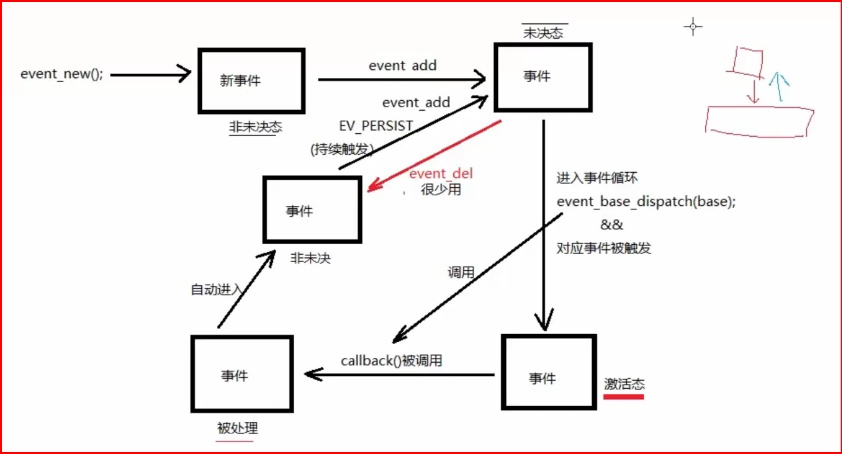
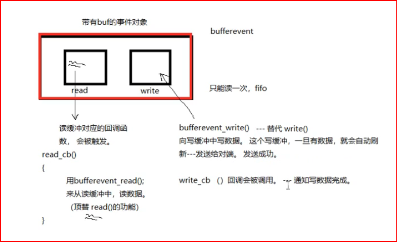
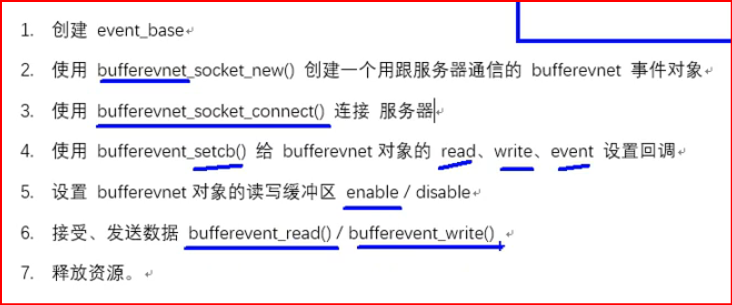

# day16

## 结合pdf libevent深入浅出

缺少课件

## libevent库

	开源。精简。跨平台（Windows、Linux、maxos、unix）。专注于网络通信。

## 源码包安装：  参考 README、readme

	./configure		检查安装环境 生成 makefile
	
	make			生成 .o 和 可执行文件
	
	sudo make install	将必要的资源cp置系统指定目录。
	
	进入 sample 目录，运行demo验证库安装使用情况。
	
	编译使用库的 .c 时，需要加 -levent 选项。
	
	库名 libevent.so --> /usr/local/lib   查看的到。

## 特性：

​	基于“事件”异步通信模型。--- 回调。   ...cb是 ...callback 

## libevent框架：

	1. 创建 event_base		(乐高底座)
	
		struct event_base *event_base_new(void);
	
		struct event_base *base = event_base_new();
	
	2. 创建 事件evnet	
	
		常规事件 event	--> event_new(); 
	
		bufferevent --> bufferevent_socket_new();


	3. 将事件 添加到 base上	
	
		int event_add(struct event *ev, const struct timeval *tv)
	
	4. 循环监听事件满足
	
		int event_base_dispatch(struct event_base *base);
	
			event_base_dispatch(base);
	
	5. 释放 event_base
	
		event_base_free(base);


## event_base 和 fork

fork后, 子进程会 复制一份 底座

并使用   event_reinit 进行重新初始化

```
int event_reinit(struct event_base *base);
```

成功时这个函数返回 0,失败时返回 -1。


## 补充-1 拿到支持的多路io

```c++
char* str1 = "Hello";
char* str2 = "World";
char* arr[] = {str1, str2, NULL};  // 字符串数组，最后一个元素为 NULL
char** ptr = arr;  // char** 指向字符串数组
```


```c++
#include <stdio.h>
#include <stdlib.h>
#include <fcntl.h>
#include <unistd.h>
#include <errno.h>
#include <string.h>
#include <event2/event.h>

int main(int argc, char *argv[])
{

    struct event_base *base = event_base_new(); // 创建底座

    const char **buf; // char** 字符串数组   char* 指向单个字符的指针
    buf = event_get_supported_methods(); // 得到系统支持的 多路 io
    /*
    event_get_supported_methods() 函数返回的是一个 const char** 类型的值，也就是说，它返回的是一个字符串数组的指针。每个字符串是一个支持的事件方法名称。返回的数组是一个指向多个 const char*（字符串指针）的指针，数组的最后一个元素是 NULL，用于表示数组的结束。

buf 变量是一个指向字符串数组的指针，声明为 const char** 类型，表示它是指向指向字符的指针的指针。这种声明方式让你可以通过 buf[i] 来访问数组中的每个字符串。
    */

    for (int i = 0; buf[i] != NULL; i++)
    {
        printf("buf[%d]=%s\n", i, buf[i]);
    }

    const char* buff;   //指针可以改变,  内容不能改变
    buff = event_base_get_method(base);  // 指针指向了 另一个地址
    printf("io is %s\n", buff);

    return 0;
}

```


## 创建事件event：

> 区别 event   event_base
>
> **`event_base`** 是事件循环的管理器，负责管理和调度所有事件。
>
> **`event`** 是具体的事件对象，表示你要处理的某个事件（例如 I/O 事件、定时器事件等）。


> 	struct event *ev；
> 				
> 	struct event *event_new(struct event_base *base，evutil_socket_t fd，short what，event_callback_fn cb;  void *arg);
> 				
> 		base： event_base_new()返回值。 
> 				
> 		 fd： 绑定到 event 上的 文件描述符
> 				
> 		what：对应的事件（r、w、e）
> 						
> 			EV_READ		一次 读事件
> 				
> 			EV_WRTIE	一次 写事件
> 				
> 			EV_PERSIST	持续触发。 结合 event_base_dispatch 函数使用，生效。
> 				
> 		cb：一旦事件满足监听条件，回调的函数。
> 				
> 		typedef void (*event_callback_fn)(evutil_socket_t fd,  short,  void *)	
> 				
> 		arg： 回调的函数的参数。
> 				
> 		返回值：成功创建的 event
>


waht参数 的 源码

```c++
#define EV_TIMEOUT 0x01    已废弃
#define EV_READ 0x02
#define EV_WRITE 0x04
#define EV_SIGNAL 0x08
#define EV_PERSIST 0x10
#define EV_ET 0x20

位图,   因此 使用 位计算
```


## 添加事件到 event_base

	int event_add(struct event *ev, const struct timeval *tv);
	
		ev: event_new() 的返回值。
	
		tv：NULL

## 从event_base上摘下事件		【了解】

	int event_del(struct event *ev);
	
		ev: event_new() 的返回值。

## 销毁事件

	int event_free(struct event *ev);
	
		ev: event_new() 的返回值。


## 补充-2 libevent实现fifo

```c++
// read
#include <stdio.h>
#include <unistd.h>
#include <stdlib.h>
#include <sys/types.h>
#include <sys/stat.h>
#include <string.h>
#include <fcntl.h>
#include <event2/event.h>

// 对操作处理函数
void read_cb(evutil_socket_t fd, short what, void *arg)
{
    // 读管道
    char buf[1024] = {0};
    
    int len = read(fd, buf, sizeof(buf));
    
    printf("read event: %s \n", what & EV_READ ? "Yes" : "No");
    printf("data len = %d, buf = %s\n", len, buf);
    
    sleep(1);
}


// 读管道
int main(int argc, const char* argv[])
{
    unlink("myfifo");

    //创建有名管道
    mkfifo("myfifo", 0664);

    // open file
    //int fd = open("myfifo", O_RDONLY | O_NONBLOCK);
    int fd = open("myfifo", O_RDONLY);
    if(fd == -1)
    {
        perror("open error");
        exit(1);
    }

    // 创建个event_base
    struct event_base* base = NULL;
    base = event_base_new();    // 创建底座

    // 创建事件
    struct event* ev = NULL;
    ev = event_new(base, fd, EV_READ | EV_PERSIST, read_cb, NULL);  

    // 添加事件
    event_add(ev, NULL);  // 插入底座

    // 事件循环
    event_base_dispatch(base);  // while（1） { epoll();}  // 循环在底座上的事件

    // 释放资源
    event_free(ev);
    event_base_free(base);
    close(fd);
    
    return 0;
}

```


```c++
// write
#include <stdio.h>
#include <unistd.h>
#include <stdlib.h>
#include <sys/types.h>
#include <sys/stat.h>
#include <string.h>
#include <fcntl.h>
#include <event2/event.h>

// 对操作处理函数
void write_cb(evutil_socket_t fd, short what, void *arg)
{
    // write管道
    char buf[1024] = {0};
    
    static int num = 0;
    sprintf(buf, "hello,world-%d\n", num++);
    write(fd, buf, strlen(buf)+1);
    
    sleep(1);
}


// 写管道
int main(int argc, const char* argv[])
{
    // open file
    //int fd = open("myfifo", O_WRONLY | O_NONBLOCK);
    int fd = open("myfifo", O_WRONLY);
    if(fd == -1)
    {
        perror("open error");
        exit(1);
    }

    // 写管道
    struct event_base* base = NULL;
    base = event_base_new();

    // 创建事件
    struct event* ev = NULL;
    // 检测的写缓冲区是否有空间写
    //ev = event_new(base, fd, EV_WRITE , write_cb, NULL);
    ev = event_new(base, fd, EV_WRITE | EV_PERSIST, write_cb, NULL);

    // 添加事件
    event_add(ev, NULL);

    // 事件循环
    event_base_dispatch(base);

    // 释放资源
    event_free(ev);
    event_base_free(base);
    close(fd);
    
    return 0;
}

```


## 图解




## 未决和非未决：

	非未决: 没有资格被处理     这个名字,和意思, 有点歧义   第一个非未决态 比较难以理解,结合意思理解
	
	未决： 有资格被处理，但尚未被处理
	
	event_new --> event ---> 非未决 --> event_add --> 未决 --> dispatch() && 监听事件被触发 --> 激活态 
	
	--> 执行回调函数 --> 处理态 --> 非未决 event_add && EV_PERSIST --> 未决 --> event_del --> 非未决

## 带缓冲区的事件 bufferevent

	#include <event2/bufferevent.h> 
	
	read/write 两个缓冲. 借助 队列.
	bufferevent_read
	bufferevent_write

## 图解




## 创建、销毁bufferevent：

	struct bufferevent *ev；
	
	struct bufferevent *bufferevent_socket_new(struct event_base *base, evutil_socket_t fd, enum bufferevent_options options);
	
		base： event_base
	
		fd:	封装到bufferevent内的 fd
	
		options：BEV_OPT_CLOSE_ON_FREE
	
	返回： 成功创建的 bufferevent事件对象。


​	
		void  bufferevent_socket_free(struct bufferevent *ev);


​	


## 给bufferevent设置回调：

​	

	对比event：	event_new( fd, callback .... );  	 new函数参数里有回调函数				
	event_add() -- 挂到 event_base 上。
	
	​			bufferevent_socket_new（fd）  // buffer的new函数没有回调函数参数
			bufferevent_setcb（ callback ） // 而是单独的另一个函数
	​	
	​	void bufferevent_setcb(struct bufferevent * bufev,
	​				bufferevent_data_cb readcb,
	​				bufferevent_data_cb writecb,
	​				bufferevent_event_cb eventcb,
	​				void *cbarg );
	​	
		bufev： bufferevent_socket_new() 返回值
	
		readcb： 设置 bufferevent 读缓冲，对应回调  read_cb{  bufferevent_read() 读数据  }
	
		writecb： 设置 bufferevent 写缓冲，对应回调 write_cb {  } -- 给调用者，发送写成功通知。  可以 NULL
	
		eventcb： 设置 事件回调。   也可传NULL

### 补充-3 typedef关键字

**基本数据类型的别名**：

```
typedef unsigned int uint;
```

这行代码定义了一个新的类型名 `uint`，它等价于 `unsigned int`，之后可以直接使用 `uint` 来代替 `unsigned int`：

```
uint x = 10;  // 相当于 unsigned int x = 10;
```

**结构体类型的别名**： 假设有一个结构体：

```
struct Person {
    char name[50];
    int age;
};
```

使用 `typedef` 为它创建别名：

```
typedef struct Person Person;
```

之后你可以直接使用 `Person` 来声明变量，而不需要每次都写 `struct Person`：

```
Person p;  // 相当于 struct Person p;
```

**指针类型的别名**： 假设你有一个指向 `int` 的指针：

```
typedef int* IntPtr;
```

之后，你就可以使用 `IntPtr` 来声明指向 `int` 的指针：

```
IntPtr ptr;  // 相当于 int* ptr;
```

**函数指针的别名**： 你也可以使用 `typedef` 为函数指针创建别名，简化函数指针的声明：

```
typedef void (*EventCallback)(int event);
```

这创建了一个名为 `EventCallback` 的函数指针类型，它指向返回 `void`、接受一个 `int` 类型参数的函数。之后可以这样使用：

```
EventCallback callback;
```


### eventcb 事件回调

	接续 bufferevent的回调参数:
		typedef void (*bufferevent_event_cb)(struct bufferevent *bev,  short events, void *ctx);
	
		void event_cb(struct bufferevent *bev,  short events, void *ctx)
		{
	
			。。。。。
		}
	
		events： BEV_EVENT_CONNECTED 等等 
		
	cbarg：	上述回调函数使用的 参数。


### read_cb 回调函数类型：


​	
		typedef void (*bufferevent_data_cb)(struct bufferevent *bev, void*ctx);  // 总的一个  bufferevent_data_cb 类型的 声明,  后续回调函数 是这个 类型
	
		void read_cb(struct bufferevent *bev, void *cbarg )
		{
			.....
			bufferevent_read();   --- read();
		}
	
	bufferevent_read()函数的原型：
	
		size_t bufferevent_read(struct bufferevent *bev, void *buf, size_t bufsize);

### write_cb 回调函数类型：

```c++
		int bufferevent_write(struct bufferevent *bufev, const void *data,  size_t size); 

跟 read_cb很想
## 
```

## 启动、关闭 bufferevent的 缓冲区：

> ​	默认、write 缓冲是 enable、read 缓冲是 disable

	enable 至关重要
	还有 disable, get_enable 等等
	void bufferevent_enable(struct bufferevent *bufev, short events);   启动	
	
		events： EV_READ、EV_WRITE、EV_READ|EV_WRITE
	
			bufferevent_enable(evev, EV_READ);		-- 开启读缓冲。


​			


## 网络通讯使用lib库

## 连接客户端：

	socket();connect();
	
	int bufferevent_socket_connect(struct bufferevent *bev, struct sockaddr *address, int addrlen);
	
		bev: bufferevent 事件对象（封装了fd）
	
		address、len：等同于 connect() 参2/3

## 创建监听服务器：

	------ socket();bind();listen();accept();
	
	struct evconnlistener * listner
	
	struct evconnlistener *evconnlistener_new_bind (	
		struct event_base *base,
		evconnlistener_cb cb, 
		void *ptr, 
		unsigned flags,
		int backlog,
		const struct sockaddr *sa,
		int socklen);
	
	base： event_base
	
	cb: 回调函数。 一旦被回调，说明在其内部应该与客户端完成， 数据读写操作，进行通信。
	
	ptr： 回调函数的参数
	
	flags： LEV_OPT_CLOSE_ON_FREE | LEV_OPT_REUSEABLE
	LEV_OPT_CLOSE_ON_FREE：在事件被销毁时自动关闭文件描述符。
	LEV_OPT_REUSEABLE：使事件或 bufferevent 可以复用，避免频繁的销毁和重新创建
	
	backlog： listen() 2参。 -1 表最大值
	
	sa：服务器自己的地址结构体
	
	socklen：服务器自己的地址结构体大小。
	
	返回值：成功创建的监听器。


## 注意

> cb这个回调函数 是自动调用的, 不需要用户自己调用, 该函数 调用后, 会完成 读写 和 通讯操作
>
> 该函数细节无需注意, 了解即可


`evconnlistener_cb` 是一个回调函数类型，指向一个函数，该函数会在监听器（`evconnlistener`）接收到新的连接时被触发。它的原型是：

```
void (*evconnlistener_cb)(struct evconnlistener *lev, evutil_socket_t fd,
                           struct sockaddr *sa, int socklen, void *ctx);


这里的参数解释如下：

lev (struct evconnlistener *lev)：

当前触发回调的 evconnlistener 对象。它是用来管理监听事件的结构体，回调中你可以通过它访问相关的监听器信息。
fd (evutil_socket_t fd)：

新接收到的客户端连接的套接字描述符。通过这个套接字，你可以与客户端进行通信。
sa (struct sockaddr *sa)：

新连接的客户端的地址信息。它是一个通用的 sockaddr 结构，包含了客户端的 IP 地址和端口号。你可以根据需要将其转换为具体的地址结构（例如 struct sockaddr_in 或 struct sockaddr_in6）。
socklen (int socklen)：

客户端地址的长度，通常是 sizeof(struct sockaddr_in) 或 sizeof(struct sockaddr_in6)，取决于客户端的地址类型。
ctx (void *ctx)：

这是传递给回调函数的用户上下文数据。你可以在 evconnlistener_new_bind 函数中设置它，并在回调函数中访问。通常，它指向你在程序中使用的某些结构体或对象，用于传递额外的状态信息。
回调函数的作用：
当 evconnlistener 对象监听到一个新的连接时，它会自动调用你传入的回调函数，并将连接的套接字（fd）、客户端地址（sa）以及其他信息传递给它。你可以在回调函数中处理这个新连接，例如：

创建 bufferevent 对象来处理读写事件。
向客户端发送数据。
进行一些初始化操作。
```


## 释放监听服务器:

	void evconnlistener_free(struct evconnlistener *lev);


## 服务器端 libevent 创建TCP连接 流程：

1. 创建event_base

2. 创建bufferevent事件对象。bufferevent_socket_new();

3. 使用bufferevent_setcb() 函数给 bufferevent的 read、write、event 设置回调函数。

4. 当监听的 事件满足时，read_cb会被调用， 在其内部 bufferevent_read();读

5. 使用 evconnlistener_new_bind 创建监听服务器， 设置其回调函数，当有客户端成功连接时，这个回调函数会被调用。

6. 封装 listner_cb() 在函数内部。完成与客户端通信。

7. 设置读缓冲、写缓冲的 使能状态 enable、disable

8. 启动循环 event_base_dispath();

9. 释放连接。


## 客户端 libevent TCP




## deepseek libevent server流程

###  1. 初始化 libevent 库

- **函数**: `event_base_new()`

- **作用**: 创建一个 `event_base` 对象，用于管理事件循环。

- **步骤**:

  ```
  struct event_base *base = event_base_new();
  ```

  - 如果返回 `NULL`，表示初始化失败。

------

### 2. 创建监听器

- **函数**: `evconnlistener_new_bind()`

- **作用**: 封装了 `socket()`、`bind()` 和 `listen()` 的操作，直接创建一个监听套接字并绑定到指定地址和端口。

- **参数**:

  - `base`: 关联的 `event_base` 对象。
  - `cb`: 回调函数，当有新连接时触发。
  - `ptr`: 传递给回调函数的用户数据。
  - `flags`: 监听器的选项（如 `LEV_OPT_CLOSE_ON_FREE` 等）。
  - `addr`: 绑定的地址（`struct sockaddr *` 类型）。
  - `socklen`: 地址结构体的长度。
  - `backlog`: 监听队列的最大长度（通常为 `-1`，使用默认值）。

- **步骤**:

  ```
  struct sockaddr_in sin;
  memset(&sin, 0, sizeof(sin));
  sin.sin_family = AF_INET;
  sin.sin_port = htons(8080); // 监听端口
  sin.sin_addr.s_addr = htonl(0); // 监听所有 IP 地址
  
  struct evconnlistener *listener = evconnlistener_new_bind(
      base, listener_cb, NULL, LEV_OPT_CLOSE_ON_FREE | LEV_OPT_REUSEABLE, -1,
      (struct sockaddr *)&sin, sizeof(sin));
  ```

  - 如果返回 `NULL`，表示创建监听器失败。

------

### 3. 定义监听器的回调函数

- **作用**: 当有新连接时，libevent 会调用该回调函数。

- **参数**:

  - `listener`: 监听器对象。
  - `fd`: 新连接的套接字文件描述符。
  - `sa`: 客户端的地址信息（`struct sockaddr *` 类型）。
  - `socklen`: 地址结构体的长度。
  - `ptr`: 用户数据（由 `evconnlistener_new_bind()` 传递）。

- **步骤**:

  ```
  void listener_cb(struct evconnlistener *listener, evutil_socket_t fd,
                   struct sockaddr *sa, int socklen, void *user_data) {
      // 处理新连接
  }
  ```

------

### 4. 为新连接创建 bufferevent

- **函数**: `bufferevent_socket_new()`

- **作用**: 为新连接创建一个 `bufferevent` 对象，用于管理 I/O 事件。

- **参数**:

  - `base`: 关联的 `event_base` 对象。
  - `fd`: 新连接的套接字文件描述符。
  - `options`: 选项（如 `BEV_OPT_CLOSE_ON_FREE`）。

- **步骤**:

  ```
  struct bufferevent *bev = bufferevent_socket_new(base, fd, BEV_OPT_CLOSE_ON_FREE);
  ```

------

### 5. 设置 bufferevent 的回调函数

- **函数**: `bufferevent_setcb()`

- **作用**: 设置 `bufferevent` 的读、写和事件回调函数。

- **参数**:

  - `bev`: `bufferevent` 对象。
  - `read_cb`: 读回调函数。
  - `write_cb`: 写回调函数。
  - `event_cb`: 事件回调函数。
  - `ptr`: 用户数据。

- **步骤**:

  ```
  bufferevent_setcb(bev, read_cb, NULL, event_cb, NULL);
  ```

------

### 6. 启用 bufferevent 的读写事件

- **函数**: `bufferevent_enable()`

- **作用**: 启用 `bufferevent` 的读或写事件。

- **参数**:

  - `bev`: `bufferevent` 对象。
  - `events`: 事件类型（如 `EV_READ | EV_WRITE`）。

- **步骤**:

  ```
  bufferevent_enable(bev, EV_READ | EV_WRITE);
  ```

------

### 7. 定义读写和事件回调函数

- **读回调函数**:

  ```
  void read_cb(struct bufferevent *bev, void *ctx) {
      char buf[1024];
      int n = bufferevent_read(bev, buf, sizeof(buf));
      // 处理接收到的数据
  }
  ```

- **事件回调函数**:

  ```
  void event_cb(struct bufferevent *bev, short events, void *ctx) {
      if (events & BEV_EVENT_EOF) {
          // 连接关闭
      } else if (events & BEV_EVENT_ERROR) {
          // 发生错误
      }
      bufferevent_free(bev); // 释放 bufferevent
  }
  ```

------

### 8. 启动事件循环

- **函数**: `event_base_dispatch()`

- **作用**: 启动事件循环，等待事件触发。

- **步骤**:

  ```
  event_base_dispatch(base);
  ```

------

### 9. 清理资源

- **释放监听器**:

  ```
  evconnlistener_free(listener);
  ```

- **释放 event_base**:

  ```
  event_base_free(base);
  ```

------

### 完整流程总结

1. 初始化 `event_base`。
2. 使用 `evconnlistener_new_bind()` 创建监听器。
3. 定义监听器的回调函数，处理新连接。
4. 为新连接创建 `bufferevent`，并设置回调函数。
5. 启动事件循环。
6. 在回调函数中处理数据收发和连接管理。
7. 释放资源。

这就是使用 libevent 创建 TCP 服务器的完整流程！


## bufferevent特别注意 自动回调

在 libevent 中，`bufferevent` 提供了`自动回调`机制来处理写缓冲区的数据。当写缓冲区中的数据被成功发送到底层套接字（例如 TCP 连接）时，libevent 会自动调用设置的写回调函数（`write_cb`）。这个机制非常适合用于处理异步 I/O 操作。


## bufferevent 特别注意 客户端显式的 socket

### 服务端：

在服务端，通常你会先创建一个监听套接字（socket），然后使用 `libevent` 监听该套接字上的连接。当客户端连接到服务器时，`bufferevent` 会为每个新的连接自动创建一个新的文件描述符（fd）。你不需要手动去创建这些 fd，`bufferevent` 会处理这一切。你只需要设置一个事件循环，监听和管理这些连接。

简言之，服务端的主要任务是监听客户端连接，`libevent` 会自动为每个连接创建并管理相应的 `fd`。

### 客户端：

客户端需要显式创建 socket，因为客户端通常会主动发起连接。你会通过 `socket()` 系统调用来创建一个套接字，之后使用 `bufferevent_socket_connect()` 建立连接。当连接建立后，你可以使用 `bufferevent` 来管理该连接的 I/O 操作。`bufferevent` 会封装底层的 socket 操作，帮助你处理读取和写入数据的异步任务。

总结：

- **服务端**：`bufferevent` 会自动为每个连接创建并管理 `fd`。
- **客户端**：需要显式地使用 `socket()` 来创建连接的文件描述符，并通过 `bufferevent` 进行管理。


## 补充-4 bufferevent实现TCP

```c++
// server
#include <stdio.h>
#include <unistd.h>
#include <stdlib.h>
#include <sys/types.h>
#include <sys/stat.h>
#include <string.h>
#include <event2/event.h>
#include <event2/listener.h>
#include <event2/bufferevent.h>

// 读缓冲区回调
void read_cb(struct bufferevent *bev, void *arg)
{
    char buf[1024] = {0};   
    bufferevent_read(bev, buf, sizeof(buf));
    printf("client say: %s\n", buf);

    char *p = "我是服务器, 已经成功收到你发送的数据!";
    // 发数据给客户端
    bufferevent_write(bev, p, strlen(p)+1); // 写缓冲有数据,会自动发给对端, 然后 自动回调 写缓冲的回调函数
    sleep(1);
}

// 写缓冲区回调
void write_cb(struct bufferevent *bev, void *arg) // 是写完回调的, 一般用于通知
{
    printf("I'm服务器, 成功写数据给客户端,写缓冲区回调函数被回调...\n"); 
}

// 事件
void event_cb(struct bufferevent *bev, short events, void *arg)
{
    if (events & BEV_EVENT_EOF)
    {
        printf("connection closed\n");  
    }
    else if(events & BEV_EVENT_ERROR)   
    {
        printf("some other error\n");
    }
    
    bufferevent_free(bev);    
    printf("buffevent 资源已经被释放...\n"); 
}


// 4. 回调函数 
void cb_listener(
        struct evconnlistener *listener, 
        evutil_socket_t fd, 
        struct sockaddr *addr, 
        int len, void *ptr)  // 仅有 ptr 是传来的,  其余的不用管细节
{
   printf("connect new client\n");

   struct event_base* base = (struct event_base*)ptr;   // 4.1 传进来的底座, 在这个函数里 继续用,   主函数的 base不是全局变量   主要是 4.3 需要这个base

   // 通信操作
   // 添加新事件
   struct bufferevent *bev;  // 4.2 创建bufferevent 对象
   bev = bufferevent_socket_new(base, fd, BEV_OPT_CLOSE_ON_FREE); // 4.3 为新连接 建立 套接字

   // 给bufferevent缓冲区设置回调
   bufferevent_setcb(bev, read_cb, write_cb, event_cb, NULL); // 4.4 设置回调函数
   bufferevent_enable(bev, EV_READ);
}


int main(int argc, const char* argv[])
{

    // init server 
    struct sockaddr_in serv;

    memset(&serv, 0, sizeof(serv));   // 1. 先设定好 ip与端口
    serv.sin_family = AF_INET;
    serv.sin_port = htons(9876);
    serv.sin_addr.s_addr = htonl(INADDR_ANY);

    struct event_base* base;  // 2. 建立 base 底座
    base = event_base_new();
    // 创建套接字
    // 绑定
    // 接收连接请求

    // 3. 建立监听器, 绑定监听的 地址结构
    struct evconnlistener* listener;   // 注意,在监听之前,  不能使用新连接创建 bufferevent对象, 不能使用 bufferevent_socket_new 创建新连接的socket
    // 必须是 先建立监听, 监听到了 才会创建新链接
    listener = evconnlistener_new_bind(base, cb_listener, base, 
                                  LEV_OPT_CLOSE_ON_FREE | LEV_OPT_REUSEABLE, 
                                  36, (struct sockaddr*)&serv, sizeof(serv));
                                  // 4. cb_listener 回调函数

    event_base_dispatch(base); // 5. 循环监听

    evconnlistener_free(listener); // 6. 销毁
    event_base_free(base);

    return 0;
}

```


```c++
// client
#include <stdio.h>
#include <unistd.h>
#include <stdlib.h>
#include <sys/types.h>
#include <sys/stat.h>
#include <string.h>
#include <event2/bufferevent.h>
#include <event2/event.h>
#include <arpa/inet.h>

void read_cb(struct bufferevent *bev, void *arg)
{
    char buf[1024] = {0}; 
    bufferevent_read(bev, buf, sizeof(buf));

    printf("fwq say:%s\n", buf);

    bufferevent_write(bev, buf, strlen(buf)+1);
    sleep(1);
}

void write_cb(struct bufferevent *bev, void *arg)
{
    printf("----------我是客户端的写回调函数,没卵用\n"); 
}

void event_cb(struct bufferevent *bev, short events, void *arg)
{
    if (events & BEV_EVENT_EOF)
    {
        printf("connection closed\n");  
    }
    else if(events & BEV_EVENT_ERROR)   
    {
        printf("some other error\n");
    }
    else if(events & BEV_EVENT_CONNECTED)
    {
        printf("已经连接服务器...\\(^o^)/...\n");
        return;
    }
    
    // 释放资源
    bufferevent_free(bev);
}

// 客户端与用户交互，从终端读取数据写给服务器
void read_terminal(evutil_socket_t fd, short what, void *arg)
{
    // 读数据
    char buf[1024] = {0};
    int len = read(fd, buf, sizeof(buf));

    struct bufferevent* bev = (struct bufferevent*)arg;
    // 发送数据
    bufferevent_write(bev, buf, len+1);
}

int main(int argc, const char* argv[])
{
    struct event_base* base = NULL;
    base = event_base_new();  // 1. 建立底座

    int fd = socket(AF_INET, SOCK_STREAM, 0); // 2. 手动建立 套接字 客户端需要手动

    // 通信的fd放到bufferevent中
    struct bufferevent* bev = NULL;  // 3. 创建 bufferevnet 对象
    bev = bufferevent_socket_new(base, fd, BEV_OPT_CLOSE_ON_FREE);

    // init server info
    struct sockaddr_in serv;  // 4. 初始化 要连接的 服务端的 地址结构
    memset(&serv, 0, sizeof(serv));
    serv.sin_family = AF_INET;
    serv.sin_port = htons(9876);
    inet_pton(AF_INET, "127.0.0.1", &serv.sin_addr.s_addr);

    // 连接服务器
    bufferevent_socket_connect(bev, (struct sockaddr*)&serv, sizeof(serv)); // 5. 建立连接

    // 设置回调
    bufferevent_setcb(bev, read_cb, write_cb, event_cb, NULL); // 6. 回调

    // 设置读回调生效
	// bufferevent_enable(bev, EV_READ);

    // 创建事件
    struct event* ev = event_new(base, STDIN_FILENO, EV_READ | EV_PERSIST,
                                 read_terminal, bev); // 伪7. 设置单个事件, 监听 标准输入, 将输入 传给 服务端
    // 添加事件                     
    event_add(ev, NULL);

    event_base_dispatch(base);

    event_free(ev);
    
    event_base_free(base);

    return 0;
}

```

 
