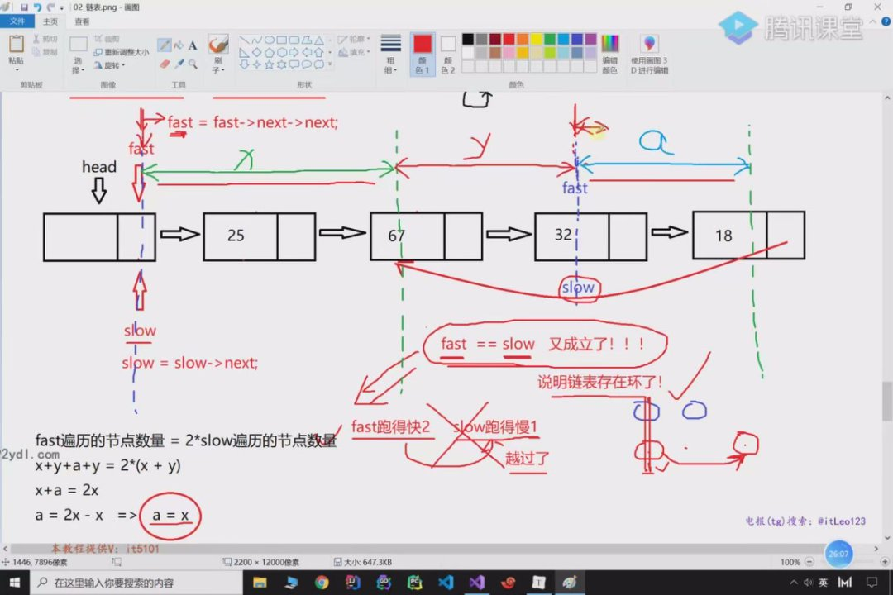
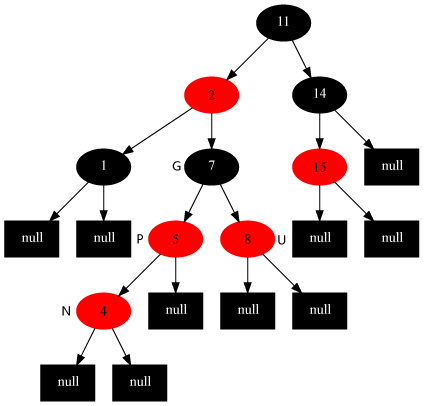
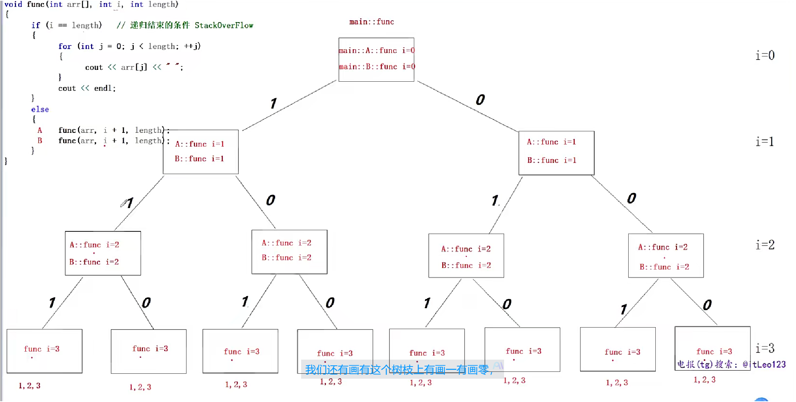
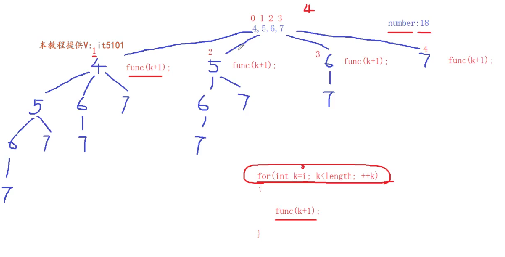
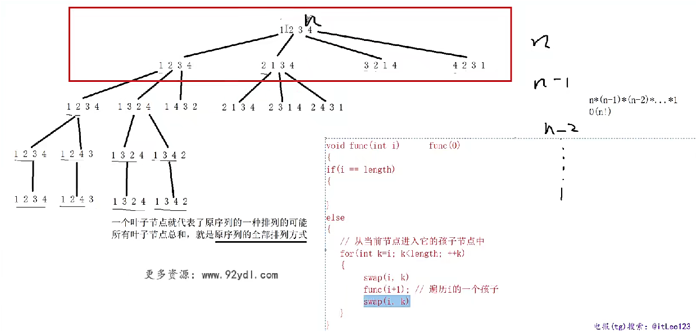
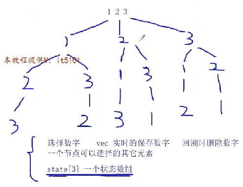
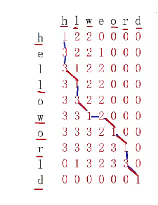
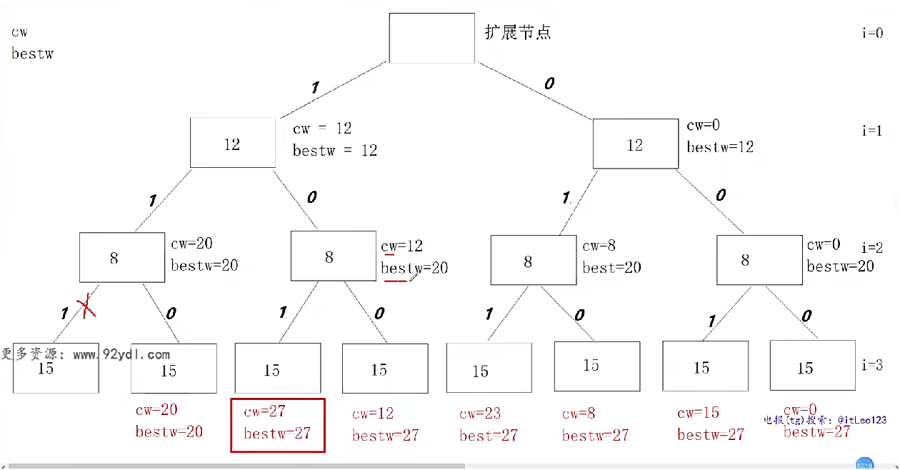
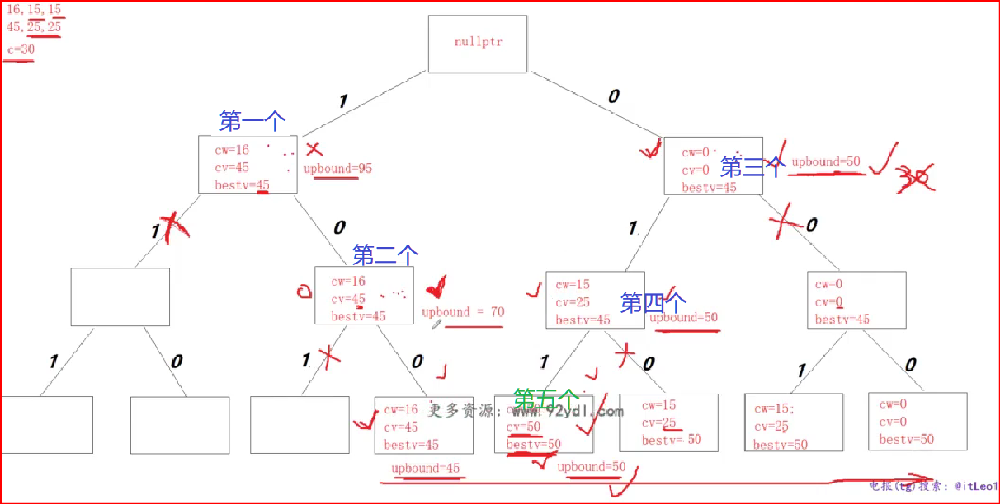

笔记仅是在 老师笔记上 补充--搭配老师笔记看


> **本笔记所有的 面试题, 都要能自己写出来!, 包括 数据结构的各个接口!**


# **C++ 各类传参的书写格式总结**--自己总结, 重点

---

## **1. 基本数据类型**
| 方式               | 书写格式                   | 说明                                     |
| ------------------ | -------------------------- | ---------------------------------------- |
| **按值传递**       | `void func(int a);`        | 传递副本，不影响原数据                   |
| **按指针传递**     | `void func(int* a);`       | 传递地址，可修改原数据，需检查 `nullptr` |
| **按引用传递**     | `void func(int& a);`       | 传递别名，直接修改原数据                 |
| **按常量引用传递** | `void func(const int& a);` | 传递别名，保护数据不被修改               |

---

## **2. 数组**
| 方式                  | 书写格式                                    | 说明                         |
| --------------------- | ------------------------------------------- | ---------------------------- |
| **按指针传递**        | `void func(int* arr, int size);`            | 传递指针，需额外传递大小     |
| **按引用传递**        | `void func(int (&arr)[5]);`                 | 传递数组的引用，大小必须固定 |
| **`std::array` 传递** | `void func(const std::array<int, 5>& arr);` | 避免退化，更安全             |

---

## **3. STL 容器（vector, list, map, etc.）**
| 方式               | 书写格式                                | 说明                             |
| ------------------ | --------------------------------------- | -------------------------------- |
| **按指针传递**     | `void func(std::vector<int>* v);`       | 允许 `nullptr`，需使用 `->` 访问 |
| **按引用传递**     | `void func(std::vector<int>& v);`       | 避免拷贝，提高效率               |
| **按常量引用传递** | `void func(const std::vector<int>& v);` | 保护数据，避免不必要的拷贝       |

---

## **4. 类对象**
| 方式               | 书写格式                      | 说明                       |
| ------------------ | ----------------------------- | -------------------------- |
| **按值传递**       | `void func(Person p);`        | 产生拷贝，适用于小对象     |
| **按指针传递**     | `void func(Person* p);`       | 允许 `nullptr`，需检查     |
| **按引用传递**     | `void func(Person& p);`       | 避免拷贝，直接操作对象     |
| **按常量引用传递** | `void func(const Person& p);` | 避免拷贝，保护数据不被修改 |


## **C++ 二维数组的传参方式对比**

都是 两行三列 二维数组

C/C++ 中的二维数组（如 `int arr[2][3]`）本质上是 **按行优先顺序连续存储的一维数组**：

```c++
int arr[2][3] = {{1,2,3}, {4,5,6}};

//地址低 → 高：[1,2,3,4,5,6]
// 只有知道 列数, 才能推出在第几行  所以 列数必须传
`void func(int (*arr)[3], int rows);`
    表示 arr 是一个 指向包含3个int的数组的指针。
```


| 方式                   | 书写格式                                         | 适用场景     | 说明                       |
| ---------------------- | ------------------------------------------------ | ------------ | -------------------------- |
| **按指针传递**         | `void func(int (*arr)[3], int rows);`            | 固定列数     | 不能自动推导列数           |
| **按引用传递**         | `void func(int (&arr)[2][3]);`                   | 固定大小数组 | **不会退化**，自动推导大小 |
| **使用 `std::vector`** | `void func(const vector<vector<int>>& arr);`     | 动态二维数组 | **灵活，可变大小**         |
| **使用 `std::array`**  | `void func(const array<array<int, 3>, 2>& arr);` | 固定大小数组 | 兼顾 **安全性和性能**      |

---

## **5. 指针与引用的综合**
| 方式             | 书写格式                              | 说明                     |
| ---------------- | ------------------------------------- | ------------------------ |
| **指针的引用**   | `void func(int*& p);`                 | 修改指针本身             |
| **数组指针**     | `void func(int (*arr)[3], int rows);` | 适用于二维数组           |
| **二维数组引用** | `void func(int (&arr)[2][3]);`        | 适用于固定大小的二维数组 |

---

## **🌟 总结**
1. **小数据类型（int, double）** → **按值传递**
2. **大对象（std::string, std::vector, class）** → **按引用传递**
3. **不修改数据** → **使用 `const &`**
4. **数组** → **传指针（`int* arr`）或引用（`int (&arr)[size]`）**
5. **类对象** → **传引用（`Person& p`）或 `const` 引用**

这样写更高效、易读、安全！🚀

# 1.杂谈-数据结构的重要性--最后 看看

1. 语言:

   c++, stl, 容器
   面试问vector, list, 要了解底层 各是什么, 一个是数组, 一个是 双向链表
   会问, set/map, unordered_map/set等等, 要了解时间复杂

2. 操作系统

   问 虚拟内存管理--进程的虚拟地址空间, 在内核是什么数据结构 存储的?

   红黑树, 那就要了解红黑树, 不了解, 怎么知道为什么用呢

3. 系统编程

   epoll--底层  是  红黑树+排序链表, 那就考到这个了

4. 项目

   mysql, 索引, 为什么好, 用了b+树, 那就要了解b+树

   redis/ memcache


# 2.数据结构和算法的概念

1. **区分数据结构  和  算法**

   **数据结构**：相互之间存在一种或者多种特定关系的数据元素的集合。在逻辑上可以分为**线性结构，散列结构、树形结构，图形结构**等等。
   **算法**：求解具体问题的步骤描述，代码上表现出来是**解决特定问题的一组有限的指令序列**。

2. **算法复杂度**：-- 数量级

   时间和空间复杂度，衡量算法效率，算法在执行过程中，随着数据规模n的增长，算法执行所花费的时间和空间的增长速度。
   
3. 笔试面试可能考察到  时间复杂度不能超过是多少


# 3.线性表

## 数组

### 特点分析

1. 定义数组, 中括号里 不能是变量(c/c++)
2. 面试时, 要区分 **下标访问**和**元素查找**, 这是不一样的
3. 数组的应用---vector, 扩容消耗大\
4. 面试一定要说准确, 说明复杂度
5.  **c/c++ 释放空指针, 是可以的**, 相当于空操作, 所以有些地方判空是多余的---**但是 要 避免 野指针问题**
6. 老师 实现了 数组的一些接口, 增删改查, 扩容等


### 面试笔试  --- 重点, 面试手写

**重点:  基于数组的 双指针**!!

#### **逆序字符串**--说明双指针

```c++
将字符串逆序, 即颠倒!

条件: p<q(位置)
初始: p=0, q=size-1
p<=>q   交换位置
相等了, 就结束了
```


```c++
#include <iostream>
#include <stdlib.h>
#include <time.h>
#include <string.h>
using namespace std;


// 逆序字符串
void Reverse(char arr[], int size)
{
    char* p = arr;
    char* q = arr + size - 1;
    while (p < q)
    {
        char ch = *p;
        *p = *q;
        *q = ch;
        p++;
        q--;
    }
}
int main()
{
    char arr[] = "hello world";   // dlrow olleh
    Reverse(arr, strlen(arr));
    cout << arr << endl;
}
```

#### 问题: 有一个整形数组, 把偶数调整到 数组左边, 奇数调整到 数组的右边

使用了  **位运算 0x1 表示 2, 要加括号**

```c++
#include <iostream>
#include <stdlib.h>
#include <time.h>
#include <string.h>
using namespace std;

// 整形数组，把偶数调整到数组的左边，把奇数调整到数组的右边
void AdjustArray(int arr[], int size)
{
    int* p = arr;
    int* q = arr + size - 1;

    while (p < q)
    {
        // p->奇数
        while (p < q)   // 这个减少了 重复的判断, 看上去繁琐,实际效率高
        {
            if ((*p & 0x1) == 1)  // 使用位运算, 要加括号
            {
                break;
            }
            p++;
        }

        // q <- 偶数
        while (p < q)
        {
            if ((*q & 0x1) == 0)
            {
                break;
            }
            q--;
        }

        // p->奇数   q->偶数
        if (p < q)
        {
            int tmp = *p;
            *p = *q;
            *q = tmp;
            p++;
            q--;
        }
    }
}
int main()
{
    int arr[10] = { 0 };
    srand(time(0));
    for (int i = 0; i < 10; i++)
    {
        arr[i] = rand() % 100;
    }

    for (int v : arr)
    {
        cout << v << " ";
    }
    cout << endl;

    AdjustArray(arr, 10);
    for (int v : arr)
    {
        cout << v << " ";
    }
    cout << endl;
}

```

#### 力扣--双指针--题目序号:27--移除元素

题目关键点: **原地**, 就是不能增加额外的空间

将 移出的值 放到右边,  其余放右边, 跟上一个很像!!

```c++
int removeElement(int *nums, int numsSize, int val)
{
    int *p = nums;
    int *q = nums + numsSize - 1;

    while (p<=q)
    {
        if(*q==val)
        {
            q--;
            continue;
        }
        if(*p==val)
        {
            *p=*q;
            q--;
            
        }
        p++;
        
    }

    return p-nums;
}

```


## 链表

### 单链表

#### 特点分析

1. **若有尾结点**, 尾插尾删是O(1)

2. 在 **单链表** 设计中，**头结点（Head Node）通常不是有效元素**，而是一个 **哨兵节点（dummy node）**，主要用于简化链表操作，比如插入、删除等。

3. 分布式系统的CAP定理: 在 **分布式系统** 中，无法同时满足以下三个特性

   C: 一致性:所有节点在同一时间看到的数据是一致的（强一致性）。
   A: 可用性:系统始终能响应请求，不会返回错误或超时。
   P: 分区合理性 :即使网络分区（节点间通信中断），系统仍能继续运行。 

   由于网络分区（P）在分布式系统中不可避免（如网络故障、机器宕机），**实际选择通常是 CP 或 AP**

   > ## **为什么无法同时满足 CAP？**
   >
   > - **网络分区（P）不可避免**：分布式系统中，节点间通信可能失败（网络故障、机器宕机）。
   > - **C 和 A 冲突**：
   >   - 如果要保证 **一致性（C）**，在分区发生时必须阻塞写入或读取（牺牲可用性）。
   >   - 如果要保证 **可用性（A）**，在分区发生时必须允许不一致的读写（牺牲一致性）。

4. 计算机 里 很少有最好的, 只有适合的

5. **搜索上, 有序地数组是 比 链表高的 -- 二分**

6. **怎么选择数组和链表?**

   下标访问/随机访问多, 搜索多(有序), 用数组

   增删多, 用链表

7. 单链表接口实现:

   自己实现链表:   写 链表接口-- **头插, 尾插, 删除一个节点, 删除节点(有重复), 搜索, 打印**

   ```c++
   // 单链表代码实现
   // 节点类型---可以放进类里,详见单向循环链表
   struct Node
   {
       Node(int data = 0) :data_(data), next_(nullptr) {}
       int data_;
       Node* next_;
   };
   
   class Clink
   {
   public:
       Clink()
       {
           // 给head_初始化指向头节点
           head_ = new Node();
       }
       ~Clink()
       {
           // 节点的释放
           Node* p = head_;
           while (p != nullptr)
           {
               head_ = head_->next_;
               delete p;
               p = head_;
           }
           head_ = nullptr;
       }
   
   public:
       // 链表尾插法 O(n)   head_:头节点    tail_:尾节点
       void InsertTail(int val)
       {
           // 先找到当前链表的末尾节点
           Node* p = head_;
           while (p->next_ != nullptr)
           {
               p = p->next_;
           }
   
           // 生成新节点
           Node* node = new Node(val);
           // 把新节点挂在尾节点的后面
           p->next_ = node;
       }
       // 链表的头插法  O(1)
       void InsertHead(int val)
       {
           Node* node = new Node(val);
           node->next_ = head_->next_;
           head_->next_ = node;
       }
       // 链表节点的删除
       void Remove(int val)
       {
           Node* q = head_;
           Node* p = head_->next_;
   
           while (p != nullptr)
           {
               if (p->data_ == val)
               {
                   // 删除一个节点本身的操作是O(1)
                   q->next_ = p->next_;
                   delete p;
                   return;
               }
               else
               {
                   q = p;
                   p = p->next_;
               }
           }
       }
       // 删除多个节点
       void RemoveAll(int val)
       {
           Node* q = head_;
           Node* p = head_->next_;
   
           while (p != nullptr)
           {
               if (p->data_ == val)
               {
                   q->next_ = p->next_;
                   delete p;
                   // 对指针p进行重置
                   p = q->next_;
               }
               else
               {
                   q = p;
                   p = p->next_;
               }
           }
       }
       // 搜索 list O(n) 数组的搜索  下表访问/随机访问arr[i]O(1)  搜索O(n)
       bool Find(int val)
       {
           Node* p = head_->next_;
           while (p != nullptr)
           {
               if (p->data_ == val)
               {
                   return true;
               }
               else
               {
                   p = p->next_;
               }
           }
           return false;
       }
       // 链表打印
       void Show()
       {
           Node* p = head_->next_;
           while (p != nullptr)
           {
               cout << p->data_ << " ";
               p = p->next_;
           }
           cout << endl;
       }
   private:
       Node* head_; // 指向链表的头节点
   };
   ```

   

#### 笔试面试

##### **单链表逆序**--后面的无法往前走!! 双指针就不行了

单链表逆序---头插

一般单链表第一个head节点, 不是一个有效的节点---使用这个特性

```c++
//核心

q=p->next;
p->next=head->next;
head->next=p;
p=q;
```

```c++
// 单链表逆序---可以从第二个开始, 节省了第一个插入
void ReverseLink(Clink &link)
{
    Node* head = link.head_;
    Node* p = head->next_;
    if (p == nullptr)
    {
        return;
    }

    head->next_ = nullptr;

    while (p != nullptr)
    {
        Node* q = p->next_;

        // p指针指向的节点进行头插
        p->next_ = head->next_;
        head->next_ = p;

        p = q;
    }
}
```

##### **单链表倒数第k个节点**---一定要多画图,  一定不要让程序挂掉

首先并不知道 链表有多少节点, 那么这个 倒数第k个 就无法一个指针 直接从头走了

而 如果 先逆序, 再正着找, 步骤多
使用数组, 更是 复杂度提高了
**本题还是双指针(快慢指针), 两个指针直接 差着 k-1个节点, 这样当快指针到达尾部, 慢的指针指向就是 这个 倒数第k个节点**

```c++
// 求倒数第k个节点的值
bool GetLaskKNode(Clink& link, int k, int& val)//有成功又失败,一般是返回bool, 使用引用带回结果
{
    Node* head = link.head_;
    Node* pre = head;
    Node* p = head;

    if (k < 1)//不判断,程序会有机会崩溃, 访问了 空指针
    {
        return false;
    }

    for (int i = 0; i < k; i++)
    {
        p = p->next_;
        if (p == nullptr) // 防止k>元素数量
        {
            return false;
        }
    }

    // pre在头节点，p在正数第k个节点
    while (p != nullptr)
    {
        pre = pre->next_;
        p = p->next_;
    }

    val = pre->data_;
    return true;
}
```

##### **合并两个有序地链表**--双指针应用在两个链表上

实际是3指针, 两个用于遍历, 一个用于插入

```c++
// 合并两个有序的单链表
void MergeLink(Clink& link1, Clink& link2)
{
    Node* p = link1.head_->next_;
    Node* q = link2.head_->next_;
    Node* last = link1.head_;
    link2.head_->next_ = nullptr;

    while (p != nullptr && q != nullptr)
    {
        if (p->data_ < q->data_)
        {
            last->next_ = p;
            p = p->next_;
            last = last->next_;
        }
        else
        {
            last->next_ = q;
            q = q->next_;
            last = last->next_;
        }
    }

    if (p != nullptr)
    {
        last->next_ = p;
    }
    else
    {
        last->next_ = q;
    }
}
```

##### **判断单链表是否有环? 求环 的 入口节点**--超经典问题

环: 即找不到末尾阶段了, 没有末尾节点是 nullptr

1. 方法1:主要是 **识别 链表地址 重不重复**,使用一个数组 记录 节点的地址---不建议开辟额外的内存

2. 尽量原地解决! **双指针的应用, 快慢指针**, 环, **能套一圈, 就是有环了**, 慢指针一次跑一个, 快指针一次跑两个,  **快的先跑到空, 就是没环, 当二者能遇上, 那么就有环了**

3. **b的挖坑**: 快指针跑的快,刚好把慢的越过去了, 会不会每次 都会跳过了?(会越过去的前提,是快慢已经相等了, 才会跨过)

4. 那使用b的方法, **怎么找 环的入口和环的入口的前一个呢?**

   使用数学推导:  **结论: 在再次相遇的地方, 定义一个指针,开头处再定义一个,两个一块走(a=x,这个a实际比图中的多了一步,注意分析), 相遇的地方, 就是 环入口**

   

```c++
// 判断单链表是否存在环，存在返回环的入口节点
bool IsLinkHasCircle(Node *head, int& val)
{
    Node *fast = head;
    Node* slow = head;

    while (fast != nullptr && fast->next_ != nullptr)//两步都得判断
    {
        slow = slow->next_;
        fast = fast->next_->next_;

        if (slow == fast)
        {
            // 快慢指针再次遇见，链表存在环
            fast = head;  // 开始找入口, 重用指针
            while (fast != slow)
            {
                slow = slow->next_;
                fast = fast->next_;
            }
            val = slow->data_;
            return true;
        }
    }
    return false;
}
```

##### **判断两个单链表是否相交, 返回相交节点的值**

**相交的定义**：两个单链表从某个节点开始，它们之后的节点完全相同，即从某个节点开始，两个链表共享相同的后续节点。

传统解法: 用数组 存一个链表地址, 找重复的第二个链表
**原地解法: **双指针---原地解法通过计算两个链表的长度差，让长链表的指针先走一段距离，再同步遍历，直到找到相交节点或返回 `nullptr`。

```c++
// 判断两个单链表是否相交，如果相交，返回相交节点的值
bool IsLinkHasMerge(Node* head1, Node* head2, int& val)
{
    int cnt1 = 0, cnt2 = 0;
    Node* p = head1->next_;
    Node* q = head2->next_;

    while (p != nullptr)
    {
        cnt1++;
        p = p->next_;
    }

    while (q != nullptr)
    {
        cnt2++;
        q = q->next_;
    }

    p = head1;
    q = head2;
    if (cnt1 > cnt2)
    {
        // 第一个链表长
        int offset = cnt1 - cnt2;
        while (offset-- > 0) 
        {
            p = p->next_;
        }
    }
    else
    {
        // 第二个链表长
        int offset = cnt2 - cnt1;
        while (offset-- > 0)
        {
            q = q->next_;
        }
    }

    while (p != nullptr && q != nullptr)
    {
        if (p == q)
        {
            val = p->data_;
            return true;
        }
        p = p->next_;
        q = q->next_;
    }

    return false;
}
```

##### 力扣-19:删除倒数第n个

此题的坑点, 没有第一个哨兵节点, 可以加一个临时的哨兵, 使得逻辑更简单

```c++
struct ListNode *removeNthFromEnd(struct ListNode *head, int n)
{
    // 在函数内部加一个哨兵节点, 问题就很简单, 思考的地方也会很少
    struct ListNode head_; // 在栈区, 仅这个函数用
    head_.next = head;

    struct ListNode *p = &head_; // c里面访问结构体, struct不能省略
    struct ListNode *q = &head_;
    for (int i = 0; i < n; ++i) // 找要删除的前一个, 差值要正确
    {
        if (p->next == NULL)
            return head;
        p = p->next;
    }
    while (p->next != NULL)
    {
        p = p->next;
        q = q->next;
    }

    struct ListNode *del = q->next;
    q->next = q->next->next;
    free(del);

    return head_.next;
}
```


##### 力扣-61:旋转链表

后面的依次使用头插---不能一个一个插, 单链表无法找到前一个

仔细观察, 就是把后面的**整体**做一个前插

```c++
//自己的
	//这种会出错, k=size时,会导致移动到最后访问越界
    //int m = k;
    //if(size<k) m = k%size;


struct ListNode* rotateRight(struct ListNode* head, int k) {
            struct ListNode *p = head;
    struct ListNode *q = head;
    int size = 1;

    
    if (p==NULL || p->next == NULL)
    {
        return head;
    }
    while (p->next != NULL)
    {
        p = p->next;
        ++size;
    }

    p = head;

    int m = k%size;
    for (int i = 0; i < m; ++i)
    {
        p = p->next;
    }
    while (p->next != NULL)
    {
        p = p->next;
        q = q->next;
    }
    p->next = head;
    head = q->next;
    q->next = NULL;
    return head;
}
```

```c++
//老师的 空间复杂度O(1)
struct ListNode *rotateRight(struct ListNode *head, int k)
{
    struct ListNode *p = head;
    struct ListNode *q = head;
    int number = 0;
    if (p==NULL || k==0)
    {
        return head;
    }
    //O(n)
    for(struct ListNode *m=head;m!=NULL;m=m->next)
    {
        ++number;
    }
    
    k=k%number;
    if(k==0)  // 这里加一个, 避免如冗余
    {
        return head;
    }
    
    //O(n)
    for(int i=0;i<k;++i)
    {
        p=p->next;
    }

    while (p->next != NULL)
    {
        p = p->next;
        q = q->next;
    }
    p->next = head;
    head = q->next;
    q->next = NULL;
    return head;
}
```


### 单向循环链表

#### 特点分析

1. 做题要注意, 题目是 单向 还是双向, 好好看别人的定义

2. **推荐使用带哨兵的头结点**

3. *操作**不带头节点的, 要注意各种边界条件**

4. 末尾节点的指针域指向了头节点**

5. **一般不要 使用next判断条件**, 除非特殊情况

6. 单向循环链表接口实现:(**要时刻记住维护 辅助指针head,tail**)

   多了tail, 既方便了, 也复杂了

   **头插法--注意tail节点的位置, 空的和不空的,不一样**

   **删除最后一个节点, tail也需要重置**

   ```c++
   // 单向循环链表
   class CircleLink
   {
   public:
       CircleLink()
       {
           head_ = new Node();
           tail_ = head_;
           head_->next_ = head_;
       }
       ~CircleLink()  //逐个删除释放
       {
           Node* p = head_->next_;
           while (p != head_)
           {
               head_->next_ = p->next_;
               delete p;
               p = head_->next_;
           }
           delete head_;
       }
   
   public:
       // 尾插法   O(1)   -- 本定义 带尾结点, 很快
       void InsertTail(int val)
       {
           Node* node = new Node(val);
           node->next_ = tail_->next_; // node->next_ = head_;
           tail_->next_ = node;
           tail_ = node; // 更新tail_指针指向新的尾节点
       } 
   
       // 头插法--注意tail节点的位置, 空的和不空的,不一样
       void InsertHead(int val)
       {
           Node* node = new Node(val);
           node->next_ = head_->next_;
           head_->next_ = node;
           if (node->next_ == head_) // 处理边界情况
           {
               tail_ = node;
           }
       }
   
       // 删除节点
       void Remove(int val)
       {
           Node* q = head_;
           Node* p = head_->next_;
   
           while (p != head_)
           {
               if (p->data_ == val)
               {
                   // 找到删除节点   head 
                   //                 q     
                   q->next_ = p->next_;
                   delete p;
                   if (q->next_ == head_)
                   {
                       tail_ = q;
                   }
                   return;
               }
               else
               {
                   q = p;
                   p = p->next_;
               }
           }
       }
   
       // 查询
       bool Find(int val) const
       {
           Node* p = head_->next_;
           while (p != head_)
           {
               if (p->data_ == val)
               {
                   return true;
               }
           }
           return false;
       }
   
       // 打印链表
       void Show() const
       {
           Node* p = head_->next_;
           while (p != head_)
           {
               cout << p->data_ << " ";
               p = p->next_;
           }
           cout << endl;
       }
   
   private:
       struct Node
       {
           Node(int data = 0) : data_(data), next_(nullptr) {}
           int data_;
           Node* next_;
       };
   
       Node* head_; // 指向头节点
       Node* tail_; // 指向末尾节点
   };
   ```

#### 约瑟夫环问题--面试

N 个人围成一个圈，从第 1 个人开始报数，每报到第 M 个人时，该人出局，接着从下一个人开始继续报数，报到第 M 个人继续出列, 直到所有人出列, 输出出列顺序。


1. 使用数组, 每次删除后, 都要重新排
2. **单向循环链表---非常适合**--经典应用问题
3. 以不带头节点 为例, 加大难度
4. 代码 以没有尾结点 为例

```c++
// 约瑟夫环问题 - 不带头结点的单项循环链表应用
void Joseph(Node* head, int k, int m)
{
    Node* p = head;
    Node* q = head;

    // q指向最后一个---解决第一个人就删除的问题, 保证 q永远在p前一个位置
    while (q->next_ != head)
    {
        q = q->next_;
    }

    // 从第k个人开始报数的
    for (int i = 1; i < k; i++)
    {
        q = p;
        p = p->next_;
    }

    // p -> 第k个人
    for (;;)
    {
        for (int i = 1; i < m; i++)
        {
            q = p;
            p = p->next_;
        }

        // 删除p指向的结点
        // q p node
        cout << p->data_ << " ";

        if (p == q)
        {
            delete p;
            break;
        }

        q->next_ = p->next_;
        delete p;
        p = q->next_;
    }
}
```


### 双向链表

#### 特点分析

1. 

2. 代码接口---良好的代码风格, 初始化列表一行一个

   ```c++
   // 定义双向链表的节点类型
   struct Node
   {
       Node(int data=0)
           : data_(data)
           , next_(nullptr)
           , pre_(nullptr)
       {}
       int data_;   // 数据域
       Node* next_; // 指向下一个节点
       Node* pre_;  // 指向前一个节点
   };
   
   // 双向链表
   class DoubleLink
   {
   public:
       DoubleLink()
       {
           head_ = new Node();
       }
       ~DoubleLink()
       {
           Node* p = head_;
           while (p != nullptr)
           {
               head_ = head_->next_;
               delete p;
               p = head_;
           }
       }
   
   public:
       // 头插法
       void InsertHead(int val)
       {
           Node* node = new Node(val);
           node->next_ = head_->next_;
           node->pre_ = head_;
           if (head_->next_ != nullptr)
           {
               head_->next_->pre_ = node;
           }
           head_->next_ = node;
       }
   
       // 尾插法
       void InsertTail(int val)
       {
           Node* p = head_;
           while (p->next_ != nullptr)
           {
               p = p->next_;
           }
   
           // p->尾节点
           Node* node = new Node(val);
           node->pre_ = p;
           p->next_ = node;
       }
   
       // 节点删除
       void Remove(int val)
       {
           Node* p = head_->next_;
           while (p != nullptr)
           {
               if (p->data_ == val)
               {
                   // 删除p指向的节点
                   p->pre_->next_ = p->next_;
                   if (p->next_ != nullptr)
                   {
                       p->next_->pre_ = p->pre_;
                   }
                   //Node* next = p->next_;
                   delete p;
                   //p = next;
                   return;
               }
               else
               {
                   p = p->next_;
               }
           }
       }
   
       // 节点搜索
       bool Find(int val)
       {
           Node* p = head_->next_;
           while (p != nullptr)
           {
               if (p->data_ == val)
               {
                   return true;
               }
               else
               {
                   p = p->next_;
               }
           }
           return false;
       }
   
       // 链表节点输出
       void Show()
       {
           Node* p = head_->next_;
           while (p != nullptr)
           {
               cout << p->data_ << " ";
               p = p->next_;
           }
           cout << endl;
       }
   
   private:
       Node* head_; // 指向头节点
   };
   ```

### 双向循环链表

1. 初始化链表, 头结点 前后指针都是自己
2. 

```c++
// 定义双向链表的节点类型
struct Node
{
    Node(int data=0)
        : data_(data)
        , next_(nullptr)
        , pre_(nullptr)
    {}
    int data_;   // 数据域
    Node* next_; // 指向下一个节点
    Node* pre_;  // 指向前一个节点
};

// 双向循环链表
class DoubleCircleLink
{
public:
    DoubleCircleLink()
    {
        head_ = new Node();
        head_->next_ = head_;
        head_->pre_ = head_;
    }
    ~DoubleCircleLink()
    {
        Node* p = head_->next_;
        while (p != head_)
        {
            head_->next_ = p->next_;
            p->next_->pre_ = head_;
            delete p;
            p = head_->next_; // 让p重新指向第一个节点，进行删除
        }
        delete head_;
        head_ = nullptr;
    }

public:
    // 头插法 O(1)
    void InsertHead(int val)
    {
        Node* node = new Node(val);
        node->next_ = head_->next_;
        node->pre_ = head_;
        head_->next_->pre_ = node;
        head_->next_ = node;
    }

    // 尾插法  O(1)
    void InsertTail(int val)
    {
        Node* p = head_->pre_;
        // p->尾节点
        Node* node = new Node(val);
        node->pre_ = p;
        p->next_ = node;
        node->next_ = head_;
        head_->pre_ = node;
    }

    // 节点删除
    void Remove(int val)
    {
        Node* p = head_->next_;
        while (p != head_)
        {
            if (p->data_ == val)
            {
                // 删除p指向的节点
                p->pre_->next_ = p->next_;
                p->next_->pre_ = p->pre_;
                delete p;
                return;
            }
            else
            {
                p = p->next_;
            }
        }
    }

    // 节点搜索
    bool Find(int val)
    {
        Node* p = head_->next_;
        while (p != head_)
        {
            if (p->data_ == val)
            {
                return true;
            }
            else
            {
                p = p->next_;
            }
        }
        return false;
    }

    // 链表节点输出
    void Show()
    {
        Node* p = head_->next_;
        while (p != head_)
        {
            cout << p->data_ << " ";
            p = p->next_;
        }
        cout << endl;
    }

private:
    Node* head_; // 指向头节点
};
```


## 栈--重要!!

### 顺序栈特点分析--数组---很重要, 纸上手写实现!

**先进后出, 后进先出**

1. 栈和队列不是全新的数据结构, 底层还是 数组和链表

2.  栈的相关名词:  **栈底, 栈顶, 入栈,出栈**

3. 栈初始化是空的, 下标要注意

4. 通常，`top` 作为下标用于指向栈顶，并通过 `top++` 和 `top--` 操作来管理栈的增长与收缩。**一般情况下，`top` 位置不存储元素，栈顶元素位于 `top - 1`**。只要合理控制 `top` 的变化，出栈操作未必需要显式清零--具体情况具体分析

5. top == 数组长度, 为栈满(下标从0开始)--具体情况具体分析

6. `memcpy` 是 C/C++ 中的一个函数，用于将一块内存区域的内容拷贝到另一块内存区域。

   `void* memcpy(void* dest, const void* src, size_t n);`

   不处理内存重叠，使用时确保源和目标地址没有重叠，否则使用 `memmove`。

   **按字节拷贝**，**不关心数据类型**。

7. **顺序栈接口代码: 底层是 数组**
   抛异常: `throw "stack is empty!";`

   ```c++
   // 顺序栈  C++容器适配器 stack    push   pop   top   empty  size
   class SeqStack
   {
   public:
   	SeqStack(int size = 10)
   		: mtop(0)
   		, mcap(size)
   	{
   		mpStack = new int[mcap];
   	}
   	~SeqStack()
   	{
   		delete[]mpStack;
   		mpStack = nullptr;
   	}
   
   public:
   	// 入栈
   	void push(int val)
   	{
   		if (mtop == mcap)
   		{
   			// 栈扩容
   			expand(2* mcap);
   		}
   		mpStack[mtop++] = val;
   	}
   	// 出栈
   	void pop()
   	{
   		if (mtop == 0)
   			throw "stack is empty!";
   		mtop--;
   	}
   
   	// 获取栈顶元素
   	int top() const
   	{
   		if (mtop == 0)
   			throw "stack is empty!";
   		return mpStack[mtop - 1];
   	}
   
   	// 栈空
   	bool empty() const
   	{
   		return mtop == 0;
   	}
   
   	int size() const { return mtop; }
   
   private:
   	void expand(int size)
   	{
   		int* p = new int[size];//数组空间开辟
   		memcpy(p, mpStack, mtop*sizeof(int));
   		delete[]mpStack;//顺序栈是数组
   		mpStack = p;
   		mcap = size;
   	}
   
   private:
   	int* mpStack;
   	int mtop;       // 栈顶位置
   	int mcap;       // 栈空间大小
   };
   ```


### 链式栈特点分析

1. 代码接口实现:

   ```c++
   // 链式栈
   class LinkStack
   {
   public:
   	LinkStack(): size_(0)
   	{
   		head_ = new Node;
   	}
   	~LinkStack()
   	{
   		Node* p = head_;
   		while (p != nullptr)
   		{
   			head_ = head_->next_;
   			delete p;
   			p = head_;
   		}
   	}
   
   public:
   	// 入栈 O(1)   把链表头节点后面，第一个有效节点的位置，当作栈顶位置
   	void push(int val)
   	{
   		// head_ -> 1
   		// head_ -> 2 -> 1
   		Node* node = new Node(val);
   		node->next_ = head_->next_;
   		head_->next_ = node;
   		size_++;
   	}
   	// 出栈 O(1)
   	void pop()
   	{
   		if (head_->next_ == nullptr)
   			throw "stack is empty!";
   		Node* p = head_->next_;
   		head_->next_ = p->next_;
   		delete p;
   		size_--;
   	}
   	// 获取栈顶元素
   	int top() const
   	{
   		if (head_->next_ == nullptr)
   			throw "stack is empty!";
   		return head_->next_->data_;
   	}
   	// 判空
   	bool empty() const
   	{
   		return head_->next_ == nullptr;
   	}
   	// 返回栈元素个数   遍历一遍链表，记录节点个数O(n)    想达到O(1)
   	int size() const
   	{
   		return size_;
   	}
   
   private:
   	struct Node
   	{
   		Node(int data = 0) : data_(data), next_(nullptr) {}
   		int data_;
   		Node* next_;
   	};
   
   	Node* head_;
   	int size_; //栈大小
   };
   ```


### 栈笔试面试

#### 力扣-20:括号匹配


```c++
class Solution
{
public:
    bool isValid(string s)
    {
        stack<char> stc;
        for (char ch : s)
        {
            if (ch == '(' || ch == '[' || ch == '{')
            {
                stc.push(ch);
                continue;
            }
            if (stc.empty())
                return false;
            else if (ch == ')' && stc.top() == '(' || ch == ']' && stc.top() == '[' || ch == '}' && stc.top() == '{')
            {
                stc.pop();
            }
            else
                return false;
            //     if(stc.empty())
            //     {
            //         return false;
            //     }
            //     else if(ch==')')
            //     {
            //         if(stc.top()=='(')
            //         {
            //             stc.pop();
            //         }
            //         else return false;
            //     }
            //     else if(ch==']' )
            //     {
            //         if(stc.top()=='[')
            //         {
            //             stc.pop();
            //         }
            //         else return false;
            //     }
            //     else if(ch=='}')
            //     {
            //         if(stc.top()=='{')
            //         {
            //             stc.pop();
            //         }
            //         else return false;
            //     }
            //     else{
            //         return false;
            //     }
        }
        if (!stc.empty())
        {
            return false;
        }
        else
        {
            return true;
        }
    }
};
```


#### 力扣-150:逆波兰表达式

中缀表达式->逆波兰表达式(后缀表达式)

**用栈,  遇到数字入栈,遇到运算符则出栈**

1. stoi函数, string[i]是char

```c++
class Solution {
public:
    int calc(int left, int right, char sign)
    {
        switch (sign)
        {
        case '+':
            return left+right;
        
            case '-':
            return left-right;
    
            case '*':
            return left*right;


            case '/':
            return left/right;
   
        }

        throw "sign is not";
    }

    int evalRPN(vector<string>& tokens) {
        stack<int> intstack;

        for(string &str : tokens)  //引用
        {
            if(str.size()==1 && ((str[0]=='+')|| (str[0]=='-')|| (str[0]=='*')|| (str[0]=='/')))
            {
                int right=intstack.top();
                intstack.pop();

                int left=intstack.top();
                intstack.pop();

                intstack.push(calc(left,right,str[0]));
            }
            else{
                intstack.push(stoi(str));
            }
        }
        return intstack.top();
    }
};
```


#### 中缀转后缀表达式--练习时加上结果输出

(1+2)*(3+4)   要注意先乘除后加减, 括号里的先计算

遇到数字直接输出.

**符号栈:** 

1. **遇到 `(`**：直接入栈（优先级最低，保证括号内优先计算）。
2. **遇到 `)`**：
   - 弹出栈顶运算符，直到遇到 `(`。
   - 弹出的运算符加入输出（或直接计算）。
3. **遇到 `+ - \* /`**：
   - 比较栈顶运算符优先级：**优先级高要入栈, 但( 要入栈**
     - 如果栈顶优先级 **≥ 当前运算符**，则弹出栈顶运算符。
     - 否则，当前运算符入栈。
4. **最终**：清空栈内剩余运算符。

数字仅个位数

```c++
// 比较符号优先级的
bool Priority(char ch, char topch)
{
	if ((ch == '*' || ch == '/') && (topch == '+' || topch == '-'))
		return true;
	if (topch == '(' && ch != ')')  
		return true;
	return false;
}

// 中缀表达式 => 后缀表达式
string MiddleToEndExpr(string expr)
{
	string result;
	stack<char> s;

	for (char ch : expr)
	{
		if (ch >= '0' && ch <= '9')
		{
			result.push_back(ch);
		}
		else
		{
			for (;;)
			{
				// 处理符号了
				if (s.empty() || ch == '(')
				{
					s.push(ch);
					break;
				}

				// 比较当前符号ch和栈顶符号top的优先级
				char topch = s.top();
				// Priority:true ch > topch   false ch <= topch
				if (Priority(ch, topch))
				{
					s.push(ch);
					break;
				}
				else
				{
					s.pop();
					if (topch == '(') // 如果遇见)，一直出栈，直到(
						break;
					result.push_back(topch);
				}
			}
		}
	}

	// 如果符号栈还存留符号，直接输出到后缀表达式里面     + /
	while (!s.empty())
	{
		result.push_back(s.top());
		s.pop();
	}

	return result;
}
```


多位数

```c++
// 比较运算符优先级
bool Priority(char ch, char topch) {
    if ((ch == '*' || ch == '/') && (topch == '+' || topch == '-'))
        return true;
    if (topch == '(' && ch != ')') // '(' 只有遇到 ')' 才弹出
        return true;
    return false;
}

// 中缀表达式 => 后缀表达式（支持多位数）
string MiddleToEndExpr(string expr) {
    string result;
    stack<char> s;

    for (int i = 0; i < expr.size(); i++) {
        char ch = expr[i];

        // 1. 处理数字（多位数）
        //isdigit 是 C/C++ 标准库中的一个函数，用于检查一个字符是否是十进制数字（0-9）。它在 <cctype>（C++）或 <ctype.h>（C）头文件中定义。
        if (isdigit(ch)) {
            while (i < expr.size() && isdigit(expr[i])) {  // 循环
                result.push_back(expr[i++]);
            }
            result.push_back(' '); // 数字后加空格分隔
            i--; // 回退一步，因为for循环会i++
        }
        // 2. 处理运算符
        else {
            for (;;) {
                if (s.empty() || ch == '(') {
                    s.push(ch);
                    break;
                }

                char topch = s.top();
                if (Priority(ch, topch)) {
                    s.push(ch);
                    break;
                }
                else {
                    s.pop();
                    if (topch == '(') // 遇到 ')' 弹出直到 '('
                        break;
                    result.push_back(topch);
                    result.push_back(' '); // 运算符后加空格
                }
            }
        }
    }

    // 3. 弹出栈内剩余运算符
    while (!s.empty()) {
        result.push_back(s.top());
        result.push_back(' '); // 用空格分隔
        s.pop();
    }

    return result;
}
```


#### 写代码要注意

从用例找逻辑,   再写代码


## 队列--重点

### 环形队列特点解析

1. 先进先出, 后进后出

2. 队头, 队尾, 一边进, 一边出

3. 与栈一样, 不是 全新的数据结构

4. 单纯数组实现: **要记录下标**, 使用**前后 两个** 记录**前后下标**--配合教学图片

   缺点: 出去的元素 占用空间 用不到

5. 不能用单向(++) 的 数组去完成,  但是可以使用 **类似的环形**,  使用**取余(模)操作,** 确定下标,  **first和rear  都将是 +1取模**

6. 环形队列里, 留下一个空位置, 用于区分 队列是满的 还是空的, 因为 满和空都是 first=rear, 且可能都是 0 ,  **(rear+1)%length= =first  为满**,  **first  == rear 为空**

7. 面试: 多线程可能会问 现成安全, 原子操作

8. 扩容 不能使用 memcpy了, 因为 first 和 rear 需要 更新的

```c++
// 环形队列   queue  push  pop  front  back  empty size
class Queue
{
public:
    Queue(int size = 10)
        : cap_(size)
        , front_(0)
        , rear_(0)
        , size_(0)
    {
        pQue_ = new int[cap_];
    }
    ~Queue()
    {
        delete[]pQue_;
        pQue_ = nullptr;
    }

public:
    // 入队 O(1)
    void push(int val)
    {
        if ((rear_ + 1) % cap_ == front_)
        {
            expand(2 * cap_);
        }
        pQue_[rear_] = val;
        rear_ = (rear_ + 1) % cap_;
        size_++;
    }
    // 出队 O(1)
    void pop()
    {
        if (front_ == rear_)
            throw "queue is empty!";
        front_ = (front_ + 1) % cap_;
        size_--;
    }
    // 队头元素
    int front() const
    {
        if (front_ == rear_)
            throw "queue is empty!";
        return pQue_[front_];
    }
    // 队尾元素
    int back() const
    {
        if (front_ == rear_)
            throw "queue is empty!";
        return pQue_[(rear_ - 1 + cap_) % cap_];
    }
    // 队空
    bool empty() const
    {
        return front_ == rear_;
    }
    // 队列元素的个数
    int size() const
    {
        // return size;  O(1)
        // 遍历一遍统计队列元素个数 O(n)
        int size = 0;
        for (int i = front_; i != rear_; i = (i + 1) % cap_)
        {
            size++;
        }
        return size;
    }

private:
    // 扩容接口
    void expand(int size)
    {
        int* p = new int[size];
        int i = 0;
        int j = front_;
        for (; j != rear_; i++, j = (j + 1) % cap_)
        {
            p[i] = pQue_[j];
        }
        delete[]pQue_;
        pQue_ = p;
        cap_ = size;
        front_ = 0;
        rear_ = i;
    }

private:
    int* pQue_;
    int cap_;   // 空间容量
    int front_; // 队头
    int rear_;  // 队尾
    int size_;  // 队列元素个数
};
```


### 链式队列特点解析

数组实现的环形队列, 扩容 太麻烦, O(n)的操作

缺点是  每个元素占用空间大了

1. 使用**双向 循环链表** 实现 

可自行添加 元素个数

```c++
// 链式队列
class LinkQueue
{
public:
	LinkQueue()
	{
		head_ = new Node();
		head_->next_ = head_;
		head_->pre_ = head_;
	}
	~LinkQueue()
	{
		Node* p = head_->next_;
		while (p != head_)
		{
			head_->next_ = p->next_;
			p->next_->pre_ = head_;
			delete p;
			p = head_->next_;
		}
		delete head_;
		head_ = nullptr;
	}

public:
	// 入队  链表尾插
	void push(int val)
	{
		Node* node = new Node(val);
		node->next_ = head_;
		node->pre_ = head_->pre_;
		head_->pre_->next_ = node;
		head_->pre_ = node;
	}
	// 出队  链表头删
	void pop()
	{
		Node* p = head_->next_;
		head_->next_ = p->next_;
		p->next_->pre_ = head_;
		delete p;
	}
	// 获取队头元素
	int front() const
	{
		if (head_->next_ == head_)
		{
			throw "queue is empty!";
		}
		return head_->next_->data_;
	}
	// 获取队尾元素
	int back() const
	{
		if (head_->next_ == head_)
		{
			throw "queue is empty!";
		}
		return head_->pre_->data_;
	}
	// 判空
	bool empty() const
	{
		return head_->next_ == head_;
	}

private:
	struct Node
	{
		Node(int data = 0) 
			: data_(data)
			, next_(nullptr)
			, pre_(nullptr) 
		{}
		int data_;
		Node* next_;
		Node* pre_;
	};

	Node* head_; // 指向头节点
};
```


### 栈和队列联合 面试

#### 力扣:232 两个栈实现一个队列

1. 实际就是 一个栈用于存储元素,  一个栈用于 实现先进先出, 即 每次都要挪元素
2. 为了减少时间复杂度, **可以在 操作 栈顶相关的 操作时, 直接从第二个栈操作**,而不是反复 挪过来挪过去
3. 也就是 要维护 两个栈, 出栈只在第二个栈里, 入栈只在第一个栈 
4. 在访问栈顶前, 不挪, 访问时, 全挪
5. 即使某些单次操作可能比较耗时（比如 O(n），但由于这些“昂贵”的操作不会频繁发生，所以 **长期来看，每个操作的平均时间仍然是 O(1)。

```c++
class MyQueue {
public:
    MyQueue() {
        // 不需要初始化, 默认构造
    }
    
    void push(int x) {
        s1.push(x);
    }
    
    int pop() {
        if(s2.empty())
        {
            while(!s1.empty())
            {
                s2.push(s1.top());
                s1.pop();
            }
            
        }
        int val = s2.top();
        s2.pop();
        return val;
    }
    
    int peek() {
        if(s2.empty())
        {
            while(!s1.empty())
            {
                s2.push(s1.top());
                s1.pop();
            }
            
        }
        int val = s2.top();
        return val;
    }
    
    bool empty() {
        return s1.empty()&&s2.empty();
    }

    private:
        stack<int> s1;
        stack<int> s2;
};

```


#### 力扣:225 两个队列实现一个栈

1. 原理: 入队, 后一个入队后, 前一个出队再入队--这个一个队列实现, 但是复杂度高
2. 为了减小 复杂度, 可以用一个队列 存放新入栈的 数据, 一个 队列存放 应调整好的 栈, 然后来回互换

可以使用指针

```c++
class MyStack {
public:
    MyStack() {
        
    }
    
    void push(int x) {
        q1.push(x);
        while(!q2.empty())
        {
            q1.push(q2.front());
            q2.pop();
        }
        queue<int> p=q2;
        q2=q1;
        q1=p;
    }
    
    int pop() {
        int val = q2.front();
        q2.pop();
        return val;
    }
    
    int top() {
        int val = q2.front();
        return val;
    }
    
    bool empty() {
        return q2.empty();
    }

private:
    queue<int> q1;  // queue是一般队列, deque是双端队列
    queue<int> q2;
};
```


# 4.搜索

## 二分搜索非递归---后续算法的基础

由于是  log级别,  按曲线, 数据量增长很大, 但是时间变化不大的

1. **必须有序**
2. **循环条件是很重要的,  容易忽略**----**left<=right,  要比较等于时的元素值**
3. 为什么是O(logn)?----可以把 有序序列, 组成一个有序二叉树,  树根是 一开始的mid,**二分搜素算法, 实际上就是 BST树 从  根节点 开始搜索的过程, 每一次搜索, 只会沿 一条路径 搜索下去**
4. 即  **层数 就是 搜索的次数, 即 时间复杂度**
5. 面试问的话, 可以写个有序序列, 画个有序树, 计算用的等式是:  元素总数不变

```c++
2^0+2^1+...+2^(l-1) = n  //l是层数
    ||
    \/
2^l - 1 = n
1忽略不计, 2^l = n    l=logn
```


- c++ 二分搜索泛型算法: **`std::binary_search()`**：C++ 标准库提供的实现，返回 `true/false`，效率高。


```c++
// 二分搜索非递归实现
int BinarySearch(int arr[], int size, int val)
{

    int first = 0;
    int last = size - 1;

    while (first <= last)
    {
        int mid = (first + last) / 2;
        if (arr[mid] == val)
        {
            return mid;
        }
        else if (arr[mid] > val)
        {
            last = mid - 1;
        }
        else
        {
            first = mid + 1;
        }
    }

    return -1;
}
```


## 递归实现二分搜索

1. 串行逻辑是给人看的, 循环逻辑是给计算机看的, 递归逻辑 是给神看的

2. 什么时候用递归?

   不管是什么数据规模, 求解方式是一样的

   不同规模的数据, 其计算结果 是有关系可寻的

   有递归尽头, 不能无限,  否则栈帧会溢出

3. 对于递归函数

   一定要搞清楚 递归函数的意义是什么,  返回值, 参数列表, 他能完成什么功能

4. 递归要有尽头

5. 递归问题 **思考是在水平方向**的, 代码的**具体执行是在 垂直方向上**的

6. **不要在垂直方向上去理解**


必须有两个下标, 才能递归

```c++
// 二分搜索递归代码
int BinarySearch(int arr[], int i, int j, int val)
{
    if (i > j)
        return -1;

    int mid = (i + j) / 2;
    if (arr[mid] == val)
    {
        return mid;
    }
    else if (arr[mid] > val)
    {
        return BinarySearch(arr, i, mid - 1, val);
    }
    else
    {
        return BinarySearch(arr, mid+1, j, val);
    }
}
```


# 6.排序算法---重点-学东西要能自己说出来

## 1.冒泡排序

1. 从开始元素开始, 两两比较, 然后满足条件就交换
2. 每一趟都会确定一个元素 的 最终位置

**特点分析:**

1. 细节: 最后一趟剩一个元素不用比较了, 所以是 i<size-1

2. **优化1:**  在一趟 没有任何数据交换,  就说明 后续已经有序了-----**flag的作用**

3. **性能指标**:   --- 笔记有汇总表格

   冒泡排序是 所有排序算法中, **效率最低的**

   原地排序.  空间 O(1)

   最好O(n),本身有序         最差和平均都是O(n^2)

   稳定性:  相同元素, 经过排序后, 其前后顺序 并没改变, 稳定性很多时候, 是用在  键值对数据上的

   冒泡是  **稳定**的. 

```c++
// 冒泡排序算法
void BubbleSort(int arr[], int size)
{
	for (int i = 0; i < size-1; i++) // 趟数  O(n) * O(n) = O(n^2)
	{
		bool flag = false;
		// 一趟的处理   
		for (int j = 0; j < size - 1 - i; j++)  // O(n)
		{
			if (arr[j] > arr[j + 1])   // 这是稳定的原因
			{
				int tmp = arr[j];
				arr[j] = arr[j + 1];
				arr[j + 1] = tmp;
				flag = true;
			}
		}

		if (!flag)
		{
			// 如果没有做任何的数据交换，那么说明数据已经有序了
			return;
		}
	}
}
```


## 2.选择排序

1. 选择: 每一次 选择 一个最小的值,  放到对应的位置

2. 选择 排序 每一趟没有进行 大量的 交换,只交换一次,  冒泡排序, 进行了 大量的交换

3. 但是  **选择排序 没法提前结束,  不像冒泡 可以提前 知道 是否该结束了**

4. **性能指标**:   --- 笔记有汇总表格----**选择排序难以优化**

   原地排序.  空间 O(1)

   **最好,最差和平均都**是O(n^2)---不管怎样, 都要从头开始,遍历找最小的, 最好时间复杂度 也不好

   选择排序是  **不稳定**的. -----**5,5,3**=>"3,5,5"   3和第一个5换位置了

5. **写代码  一定要先有思路, 要画图** 


```c++
// 选择排序算法 O(n) * O(n) = O(n^2)   空间复杂度： O(1)   稳定性：不稳定    
// 5 5 3
void ChoiceSort(int arr[], int size)
{
	for (int i = 0; i < size - 1; i++)  // O(n)
	{
		int min = arr[i]; // 每一趟找到了那趟的最小值, 下一次比较就不用拿最小的比较, 而是目前有序的 最后一个
		int k = i;
		for (int j = i+1; j < size; j++) // O(n)
		{
			if (arr[j] < min)
			{
				min = arr[j];
				k = j;
			}
		}
		// 找到后面剩余序列中的最小值，和开始位置的值进行交换
		if (k != i)
		{
			int tmp = arr[i];
			arr[i] = arr[k];
			arr[k] = tmp;
		}
	}
}
```


## 3.插入排序--重点!!

1. 如果**数据 趋于 有序**(条件), 那么  是 **所有排序算法中, 效率最高**的的 排序算法(包括 高级排序, 快排)
2. 基础排序中:   **插入>冒泡&选择**
3. 不仅**没有交换, 而且比较次数少**
4. 认为 **第一个是有序地**, 从这个开始,  每次比较有序部分的 后一个元素, 将其插到 有序部分的 合适位置
5. **性能指标**:   --- 笔记有汇总表格

原地排序.  空间 O(1)

最好O(n),本身有序         最差和平均都是O(n^2)

插入是  **稳定**的. 


```c++
// 插入排序算法  时间复杂度: 最坏、平均 O(n^2)  最好：O(n)  空间：O(1)  稳定性：稳定的
void InsertSort(int arr[], int size)
{
	for (int i = 1; i < size; i++) // O(n)
	{
		int val = arr[i]; // 先记录i的值
		int j = i - 1;
		for (; j >= 0; j--) // O(n)   找元素 插入的位置
		{
			if (arr[j] <= val)  // 决定了 是稳定的
			{
				break;
			}
			arr[j + 1] = arr[j];
		}
		arr[j + 1] = val;
	}
}
```


## 4.希尔排序---重点!!

插入排序 最优 是有条件的, 数据趋于有序

1. 希尔排序 --- 对插入的 优化---- **让全局的数据,  越来越有序**

2. 核心:   **对数据 分组, 进行插入排序**---看教学图片

3. 怎么分组, 具体情况 具体分析

4. **性能指标**:   --- 笔记有汇总表格

   原地排序.  空间 O(1)

   最好O(n),本身有序         最差是O(n^2)    **平均:O(n^1.3)依赖于不同的增量序列设置**

   希尔是  **不稳定**的.   因为分组, 值相同的在  不同的组里,  就可能 改变顺序

   **越往后, 越快**


代码是**在 插入排序的  基础**上, 加了  gap和gap的变化, 又套了 一层循环


```c++
// 希尔排序
void ShellSort(int arr[], int size)
{
	for (int gap = size / 2; gap > 0; gap /= 2) // 100W 19 1000W 24
	{
		for (int i = gap; i < size; i++) // O(n)  第一个的后一个不再是后面紧跟着的, 而是 gap 距离,   ++ 是因为 每个组换着 排
		{
			int val = arr[i];
			int j = i - gap; // 分组里的 前一个
			for (; j >= 0; j-=gap) // O(n)
			{
				if (arr[j] <= val)
				{
					break;
				}
				arr[j + gap] = arr[j];
			}
			arr[j + gap] = val;
		}
	}
}
```


## 5.基础排序性能对比--见 pdf

1. 在C和C++中，`clock()` 函数用于获取程序运行的时钟周期数，可用于测量程序的执行时间。它通常定义在 `<time.h>` 头文件中（C语言）或 `<ctime>` 头文件中（C++）。

2. `clock()` 返回值：

   - `clock_t` 类型，表示自程序启动以来所使用的 CPU 时间（单位是**时钟周期数**）。
   - 需要将其除以 `CLOCKS_PER_SEC` 来换算成秒。

3. clock 实例: 

   ```c++
   #include <stdio.h>
   #include <time.h>
   
   int main() {
       clock_t start, end;
       double cpu_time_used;
   
       start = clock();  // 记录开始时间
   
       // 这里放一些需要计时的代码
       for (volatile long i = 0; i < 100000000; i++);
   
       end = clock();  // 记录结束时间
   
       // 计算CPU时间（以秒为单位）
       cpu_time_used = ((double) (end - start)) / CLOCKS_PER_SEC;
       printf("程序执行时间: %f 秒\n", cpu_time_used);
   
       return 0;
   }
   
   ```

4. 本节课 **测试 四大基础排序的 主函数代码**:--clock

   ```c++
   int main()
   {
   	const int COUNT = 100000;
   	int* arr = new int[COUNT];
   	int* brr = new int[COUNT];
   	int* crr = new int[COUNT];
   	int* drr = new int[COUNT];
   
   	srand(time(NULL));
   
   	for (int i = 0; i < COUNT; i++)
   	{
   		int val = rand() % COUNT;
   		arr[i] = val;
   		brr[i] = val;
   		crr[i] = val;
   		drr[i] = val;
   	}
   
   	clock_t begin, end;
   
   	begin = clock();
   	BubbleSort(arr, COUNT);
   	end = clock();
   	cout << "BubbleSort spend:" << (end - begin) * 1.0 / CLOCKS_PER_SEC << "s" << endl;
   
   	begin = clock();
   	ChoiceSort(brr, COUNT);
   	end = clock();
   	cout << "ChoiceSort spend:" << (end - begin) * 1.0 / CLOCKS_PER_SEC << "s" << endl;
   
   	begin = clock();
   	InsertSort(crr, COUNT);
   	end = clock();
   	cout << "InsertSort spend:" << (end - begin) * 1.0 / CLOCKS_PER_SEC << "s" << endl;
   
   	begin = clock();
   	ShellSort(drr, COUNT);
   	end = clock();
   	cout << "ShellSort spend:" << (end - begin) * 1.0 / CLOCKS_PER_SEC << "s" << endl;
   }
   ```

5. 输出:

   ```c++
   //1万
   BubbleSort spend:0.087s
   ChoiceSort spend:0.027s
   InsertSort spend:0.022s
   ShellSort spend:0.001s
       
       
   //10万   --- 这个差距 很大的
   BubbleSort spend:16.329s
   ChoiceSort spend:2.539s
   InsertSort spend:2.232s
   ShellSort spend:0.015s
       
   
   //当输入的 数据 有序, 10万
   BubbleSort spend:0s  //这个得益于可以提前结束
   ChoiceSort spend:2.641s
   InsertSort spend:0s      //数据趋于有序, 插入效率最高, 比希尔高!!
   ShellSort spend:0.002s
   ```

   

## 6.快速排序----重点--两个优化

1. 一般**中等数据量**的排序都用**希尔排序**，选择**合适的增量序列**，效率就已经不错了，如果数据**量比较大**，可以选择**高级的排序算法**，如快速排序。

2. **快排思想**:   

   每次选择**基准数**，把**小于**基准数的放到基准数的**左边**，把大于基准数的放到基准数的右边，采用“**分治思想**”处理剩余的序列元素，直到整个序列变为有序序列。

3. **快排 使用 前后两个 辅助指针(下标)**

4. 边界条件:  二分搜索: l<=r,   **但是快排 是 l<r**, 画图理解, 快排等于的位置, 已经失效, 直接放基准元素

5. **分治了, 走的  二叉树 路线!!**

6. **性能指标**:   --- 笔记有汇总表格

   **因为递归, 每次都要开辟栈空间**   空间：O(logn) 递归的深度所占用的栈内存

   最坏 空间:   O(n), 对应 最差时间

   最好和平均**:O(nlogn)**              最差是O(n^2),**有序或逆序**时,是最差的,只有一边,就是没有分治, **几个元素, 就是多少深度, logn变为了n**    

   快排是  **不稳定**的.   ---- 一边快, 会导致放乱

7. **优化1:**由于有序的快排, 很慢-----**回顾:当数据趋于有序, 插入效率最高**

   随着 快排进行, 数据越  趋于有序,   **在区间元素小于一定数量下, 可以使用插入排序 代替**

8. **优化2**:  **基准数 的选择**----尽量获得一个 平衡的 二叉树

   **采用三数取中--作为基准**     arr[l]   arr[r]   arr[(l+r)/2] 取这里面**中等大小的数**

   把 **拿到的数,** **与第一个数 交换位置**, 还是 把第一个作为基准

   比  取随机数 靠谱


**各部分每次是取第一个元素 为基准**

```c++
// 快排分割处理函数
int Partation(int arr[], int l, int r)
{
	// 选择基准数的优化：“三数取中”法   arr[l]   arr[r]   arr[(l+r)/2]  
	// 记录基准数
	int val = arr[l];

	// 一次快排处理   时间：O(n) * O(logn) = O(nlogn)    空间：O(logn) 递归的深度所占用的栈内存    O(n): 每一层,即每一轮
	while (l < r)  
	{
		while (l < r && arr[r] > val) //再次l<r. 不比较自己
		{
			r--; // 找到右边有小的, 退出, 放入
		}

		if (l < r)
		{
			arr[l] = arr[r];
			l++;
		}

		while (l < r && arr[l] < val)
		{
			l++;// 找到左边有大的, 退出, 放入
		}

		if (l < r)
		{
			arr[r] = arr[l];
			r--;
		}
	}

	// l == r的位置，就是放基准数的位置
	arr[l] = val;
	return l;
}

// 快排的递归接口
void QuickSort(int arr[], int begin, int end)
{
	if (begin >= end) // 快排递归结束的条件
	{
		return;
	}

	// 优化一：当[begin, end]序列的元素个数小到指定数量，采用插入排序
	//if (end - begin <= 50)
	//{
		// InsertSort(arr, begin, end);
		//return;
	//}

	// 在[begin, end]区间的元素做一次快排分割处理
	int pos = Partation(arr, begin, end);

	// 对基准数的左边和右边的序列，再分别进行快排
	QuickSort(arr, begin, pos - 1);
	QuickSort(arr, pos + 1, end);
}

// 快速排序
void QuickSort(int arr[], int size)
{
	return QuickSort(arr, 0, size - 1);
}
```


## 7.归并排序

**特别注意:**  由于归并 需要额外空间, 为了**减少内存开辟**花费的时间,  可以只进行一次开辟, **直接开辟 n个元素大小的 空**间, 因为合并所需的最大的空间 就是 n个

1. 同样是 分治

2. 这里分析一下名词:

   递归:  递:是减少数据规模,    归: 从小的规模的 结果 合并成一个 大的结果

   归并: 在归的 过程中, 进行数据合并, 达到排序的 效果

3. **需要额外的 内存空间,  把两个小段的有序序列, 合并成打断有序地序列**

4. 水平理解!!!, 不要垂直去看

5. **快排是  先做快排分割, 获得一个元素的最终位置,   然后再递**

6. **归并排序,  先递, 递到最小,  然后再归, 归的时候排序**

7. 时间最好最差平均  都是  O(nlogn)

   **稳定**的, <= 就复制

   空间:  O(n)+O(logn)===>  **O(n)**


有关减少开辟的  之前的相关代码:

```c++
Merge函数里
void Merge(int arr[], int l, int m, int r)
{
	int* p = new int[r - l + 1];
    ....
}

```


优化后

```c++
// 归并过程函数  O(n)
void Merge(int arr[], int l, int m, int r, int* p)
{
	int idx = 0;
	int i = l; //左边序列第一个
	int j = m + 1;  // 右边序列第一个

	while (i <= m && j <= r)
	{
		if (arr[i] <= arr[j])
		{
			p[idx++] = arr[i++];
		}
		else
		{
			p[idx++] = arr[j++];
		}
	}

	while (i <= m) //处理剩余
	{
		p[idx++] = arr[i++];
	}

	while (j <= r)
	{
		p[idx++] = arr[j++];
	}

	// 再把合并好的大段有序的结果，拷贝到原始arr数组[l,r]区间内
	for (i = l, j = 0; i <= r; i++, j++)
	{
		arr[i] = p[j];
	}
}

// 归并排序递归接口     用于递
void MergeSort(int arr[], int begin, int end, int* p)
{
	// 递归结束的条件
	if (begin >= end)
	{
		return;
	}

	int mid = (begin + end) / 2;
	// 先递, 递到都只剩一个元素
	MergeSort(arr, begin, mid, p);
	MergeSort(arr, mid + 1, end, p);
	// 再归并  [begin, mid]  [mid+1, end] 把两个小段有序的序列，合并成大段有序的序列
	Merge(arr, begin, mid, end, p);
}

// 归并排序   首次调用
void MergeSort(int arr[], int size)
{
	int* p = new int[size];  // 一次开辟好全部的, 减少后续繁多的 开辟
	MergeSort(arr, 0, size - 1, p);
	delete[]p;
}
```


## 8.堆排序--大根堆小根堆重要

### 特点分析

1. 主要是  **二叉堆**

   是一颗**完全二叉树**，分为两种典型的堆，分别是**大根堆和小根堆**

2. **完全二叉树**是一种特殊的二叉树，满足以下条件：

   1. **层次填充**：除了最后一层，所有层的节点都必须是**满的**（即完全填充，从左到右没有空缺）。
   2. **左对齐**：最后一层的节点必须尽可能地向**左对齐**，即只能在最左侧缺少节点。

3. 如果**arr[i] <= arr[2 * i+1] && arr[i] <= arr[2 * i+2]**，就是**小根堆**
   如果**arr[i] >= arr[2 * i+1] && arr[i] >= arr[2 * i+2]**，就是**大根堆**
   这是每个根和 左右孩子的 下标 关系

4. 满足 **0 <= i <= (n-1)/2**  表示  **有孩子节点的 i**, 利用这个 i  的范围, 进行上面的比较, 判定 大小根堆--------- **(n-1)/2**最后一个 叶子结点

------


### **大小根堆 入堆,出堆逻辑**

1. 找父节点:   **(i-1)/2**,   比较 父节点(先) 

   **新元素插入到堆的末尾**（保证完全二叉树的结构）。

   **向上调整（上浮）**：

   - 比较新元素和其**父节点**的值：
     - 若新元素比父节点大，则交换。
     - 若不大，则停止。
   - 继续向上比较，直到满足堆的性质。

2. **小根堆（最小堆）插入过程**

   - **步骤**：
     1. **新元素插入到堆的末尾**。
     2. **向上调整（上浮）**：
        - 比较新元素和**父节点**的值：
          - 若新元素比父节点小，则交换。
          - 若不小，则停止。
        - 继续向上比较，直到满足堆的性质。

3. **大根堆（最大堆）出堆过程**

   1. **删除堆顶（索引 `0`），用最后一个元素替换堆顶**：
      - **取出堆顶元素**（最大值）。
      - **用堆的最后一个元素**（数组的最后一个元素）替换堆顶。
   2. **向下调整（下沉）**：
      - **找到左右子节点**：索引为 `2*i + 1` 和 `2*i + 2`。
      - **比较堆顶元素和左右子节点**的值：
        - 若某个子节点比堆顶元素大，则交换堆顶和该子节点。
        - 交换后，继续向下比较新的节点和它的左右子节点。
        - 如果没有子节点比当前节点大，则停止调整。
      - 继续向下调整，直到满足堆的性质。

4. **小根堆（最小堆）出堆过程**

   1. **删除堆顶（索引 `0`），用最后一个元素替换堆顶**：
      - **取出堆顶元素**（最小值）。
      - **用堆的最后一个元素**（数组的最后一个元素）替换堆顶。
   2. **向下调整（下沉）**：
      - **找到左右子节点**：索引为 `2*i + 1` 和 `2*i + 2`。
      - **比较堆顶元素和左右子节点**的值：
        - 若某个子节点比堆顶元素小，则交换堆顶和该子节点。
        - 交换后，继续向下比较新的节点和它的左右子节点。
        - 如果没有子节点比当前节点小，则停止调整。
      - 继续向下调整，直到满足堆的性质。

------


1. **为什么 `greater<int>()` 要加 `()`**

- `greater<int>()` **是一个仿函数（函数对象）**，`()` **表示创建一个该对象的实例**。

- 在 `Comp comp = greater<int>()` 中：

  - `greater<int>()` 代表**一个默认比较函数对象**，即 `comp` **默认等于 `greater<int>()`**。
  - 如果不加 `()`，`greater<int>` 只是**类名**，不能直接赋值给 `std::function<bool(int, int)>`。

- **仿函数（Functors，又称函数对象）\**是指\**重载了 `operator()`（函数调用运算符）\**的类，使其对象可以像\**函数一样调用**。

- ```c++
  #include <iostream>
  using namespace std;
  
  // 定义一个仿函数类
  class Add {
  public:
      int operator()(int a, int b) {
          return a + b;
      }
  };
  
  int main() {
      Add add;           // 创建仿函数对象
      cout << add(3, 4); // 调用仿函数，等价于 add.operator()(3, 4)
      return 0;
  }
  
  ```

  

```c++
template<class T> struct greater {
    bool operator()(const T& lhs, const T& rhs) const {
        return lhs > rhs;
    }
};
```


### **实现一个优先队列**-出堆实现排序

**出堆是有序地,  但是里面存的,不是有序**

大根堆出堆,就是从大到小


**优先队列**（priority queue）保证**堆顶是最大的元素**（对于最大堆）或**最小的元素**（对于最小堆），但是它并不要求**队列中的其他元素有序**。它只保证堆顶元素符合堆的性质。


**但是!!!如果一直出堆，那么队列中的元素会按照堆的顺序被取出，最终形成一个有序的序列。**


用于练习 堆的  上下浮调整:   核心是 **上浮和下沉**

```c++
// 优先级队列实现   priority_queue(vector)  push pop top empty size
class PriorityQueue
{
public:
    using Comp = function<bool(int, int)>;
    PriorityQueue(int cap = 20, Comp comp = greater<int>())
        : size_(0)
        , cap_(cap)
        , comp_(comp)
    {
        que_ = new int[cap_];
    }

    PriorityQueue(Comp comp)
        : size_(0)
        , cap_(20)
        , comp_(comp)
    {
        que_ = new int[cap_];
    }

    ~PriorityQueue()
    {
        delete[]que_;
        que_ = nullptr;
    }

public:
    // 入堆操作
    void push(int val)
    {
        // 判断扩容
        if (size_ == cap_)
        {
            int* p = new int[2 * cap_];
            memcpy(p, que_, cap_ * sizeof(int)); //浅拷贝, 不占用外部资源
            delete[]que_;
            que_ = p;
            cap_ *= 2;
        }

        if (size_ == 0)
        {
            // 只有一个元素，不用进行堆的上浮调整
            que_[size_] = val;
        }
        else
        {
            // 堆里面有多个元素，需要进行上浮调整
            siftUp(size_, val);
        }
        size_++;
    }

    // 出堆操作
    void pop()
    {
        if (size_ == 0)
            throw "container is empty!";
		// 先将最后一个元素放到堆顶   -- 老师代码不对
    	que_[0] = que_[size_ - 1];
        size_--;
        if (size_ > 0)
        {
            // 删除堆顶元素，还有剩余的元素，要进行堆的下沉调整
            siftDown(0, que_[size_]);
        }
    }

    bool empty() const { return size_ == 0; }

    int top() const 
    { 
        if (size_ == 0)
            throw "container is empty!";
        return que_[0];
    }

    int size() const { return size_; }

private:
    // 入堆上浮调整 O(logn)   O(1)  看图比
    void siftUp(int i, int val)
    {
        while (i > 0) // 最多计算到根节点(0号位)
        {
            int father = (i - 1) / 2;
            if (comp_(val, que_[father]))
            {
                que_[i] = que_[father];
                i = father;
            }
            else
            {
                break;
            }
        }
        // 把val放到i的位置
        que_[i] = val;
    }
    // 出堆下沉调整 O(logn)    O(1)
    void siftDown(int i, int val)
    {
        // i下沉不能超过最后一个有孩子的节点
        while (i < size_ / 2)  // 注意i是下标
        {
            int child = 2 * i + 1; // 第i个节点的左孩子
            if (child + 1 < size_ && comp_(que_[child + 1], que_[child]))
            {
                // 如果i节点右孩子的值大于左孩子, child记录右孩子的下标
                child = child + 1; 
            }

            if (comp_(que_[child], val))
            {
                que_[i] = que_[child];
                i = child;
            }
            else
            {
                break; // 已经满足堆的性质，提前结束
            }
        }
        que_[i] = val;
    }
private:
    int* que_;  // 指向动态扩容的数组
    int size_;  // 数组元素的个数
    int cap_;   // 数组的总空间大小
    Comp comp_; // 比较器对象
};
```


### 堆排序实现---区分 优先队列

1. **堆排序里: 小到大-->大根堆**    ----  区别一下 优先队列的出堆操作, 优先队列 大根堆 出堆就是由大到小 

2. 调整整个 待排序序列, 普通的二叉树调整为 大根堆的 完全二叉树

3. 第一步:构建堆

    **将无序数组转换成一个堆**（大根堆或小根堆）。

   - **从最后一个非叶子节点开始**，向下调整（下沉），构建出堆结构。
   - **大根堆**（最大堆）：每个父节点的值**大于等于**其子节点。
   - **小根堆**（最小堆）：每个父节点的值**小于等于**其子节点。

4. **步骤二：排序过程**

   1. **交换堆顶和最后一个元素**：
      - 堆顶（最大堆中的最大值或最小堆中的最小值）是**当前未排序部分的最大/最小值**。
      - 将堆顶元素与数组的最后一个元素交换。
      - 这样，最大/最小元素就被放到了最终排序的位置（数组末尾）。
   2. **减少堆的大小**：
      - 排除已经排序的元素（即调整堆的有效范围）。
   3. **对新的堆顶元素进行下沉调整**（`siftDown`）：
      - 维护堆的性质，使剩余元素继续保持大根堆或小根堆结构。
   4. **重复上述过程**：
      - 继续将**当前堆顶元素交换到数组末尾**，然后**下沉调整**，直到堆大小缩小到 `1`。

5. **整体大概**:   先构建一个 **大根堆**, 此时并不是有序地,  然后 进行类似于出堆的操作, 在数组里**倒着放**,  就实现了 **从小到大**的操作

6. **性能指标**:   --- 笔记有汇总表格

   空间:   O(1)

   最好和平均,最差**:O(nlogn)**  

   堆排序是  **不稳定**的

7. 辅助看一下:

   ```c++
   [4, 10, 3, 5, 1, 8, 6]
   //1. 转化为 完全二叉树, 就是看下标的
           4
          /  \
         10   3
        /  \  /  \
       5   1 8   6
   
   //2. 转化为大根堆
           10
          /  \
         5    8
        / \   / \
       4   1 3   6
   //3. 此时开始 下沉, 排序...
   ```

   

```c++
//大根堆, 由小到大

// 堆的下沉调整
void siftDown(int arr[], int i, int size)
{
	int val = arr[i];
	while (i < size / 2)
	{
		int child = 2 * i + 1;
		if (child + 1 < size && arr[child + 1] > arr[child])
		{
			child = child + 1;
		}

		if (arr[child] > val)
		{
			arr[i] = arr[child];
			i = child;  // i继续指向它的孩子，继续调整
		}
		else
		{
			break;
		}
	}
	arr[i] = val;
}

// 堆排序
void HeapSort(int arr[], int size)
{
	int n = size - 1;
	// 从第一个非叶子节点,  有孩子才能下沉
	for (int i = (n - 1) / 2; i >= 0; i--) //i是下标
	{
		siftDown(arr, i, size); // 下沉
	}  // 这里完成后 , 就成了 大根堆

	// 把堆顶元素和末尾元素进行交换，从堆顶开始进行下沉操作
	for (int i = n; i > 0; i--)
	{
		int tmp = arr[0];
		arr[0] = arr[i];
		arr[i] = tmp;

		siftDown(arr, 0, i); // 第三个参数，参与调整的元素的个数, 每一趟后, 最后一个元素不用考率了
	}
}
```


## 9.高级排序性能对比

1. 高级:  快排> 归并排> 堆排

2. 归并很重要, 在稳定的 情况下, 还 速度跟 快排差不多\

3. **堆排** 在高级里面, **差距 大**----原因:   ---**重点**

   快排和归并, 遍历元素都是按照元素顺序 遍历的 ,  对于 **cpu缓存 是友好的, 即cpu命中率高, 就是 其相邻数据 也在cpu缓存里**

   但是 堆排, **不是按照顺序访问, 是按照父子节点的关系, 对cpu缓存不友好!!**

   堆排序 在排序过程中, 进行**元素下沉**时,  **做的 无效比较过多**, 因为在从**大根堆->排序过程中**, 最后一个元素下沉的 时候, 又进行了 很多 在大根堆时 就比较过的操作


```c++
//一个亿数据
QuickSort spend:8.54s   //这还只是原始快排, 后续std::sort 还可以优化
MergeSort spend:13.617s
ShellSort spend:33.736s
HeapSort spend:28.458s


//1万   
QuickSort spend:0.001s
MergeSort spend:0.001s
ShellSort spend:0.002s
HeapSort spend:0.001s

//10万
QuickSort spend:0.008s
MergeSort spend:0.011s
ShellSort spend:0.018s
HeapSort spend:0.011s
```


汇总一下 大表格
| 排序算法 | 平均时间复杂度 | 最好时间复杂度 | 最坏时间复杂度 | 空间复杂度   | 稳定性 |
| -------- | -------------- | -------------- | -------------- | ------------ | ------ |
| 堆排序   | O(n logn)      | O(n logn)      | O(n logn)      | O(1)         | 不稳定 |
| 快速排序 | O(n logn)      | O(n logn)      | O(n²)          | O(logn)~O(n) | 不稳定 |
| 归并排序 | O(n logn)      | O(n logn)      | O(n logn)      | O(n)         | 稳定   |
| 冒泡排序 | O(n²)          | O(n)           | O(n²)          | O(1)         | 稳定   |
| 选择排序 | O(n²)          | O(n²)          | O(n²)          | O(1)         | 不稳定 |
| 插入排序 | O(n²)          | O(n)           | O(n²)          | O(1)         | 稳定   |
| 希尔排序 | O(n^1.3)       | O(n)           | O(n²)          | O(1)         | 不稳定 |


## 10.排序常见面试问题

1. **c++ 的STL 里 sort用的是什么算法?**

   快速排序! 插入排序!  堆排序!

   并且做了优化: 

   1. 源码里, 区间里 元素小于32个时, 会使用**插入排序**
   2. 还使用了 堆排,  有一个变量`Ideal`, `_Ideal = (_Ideal >> 1) + (_Ideal >> 2)`, 每递归一次, 进行这个操作, 该变量小于=0, 使用堆排, **为了减少 递归深度**

2. **快排的 时间复杂度不稳定, 最坏 n^2, 怎么解决 复杂度恶化问题**

   插入排序!   **主要是三数取中!**因为最坏,是**趋于有序** 或 **逆序** 的情况

3. **快排递归实现时, 怎么解决递归层次 过深的问题?**

   使用`Ideal`, 初始化为元素个数,  每次递归, 进行 >>1+>>2的衰减, <=0就用堆排

   每次递归, ideal会缩减3/4, 防止 有序时,退化为 冒泡

4. **递归过深会引发什么问题**

   调用函数 开销, 压栈 有很多东西,  

   递归深了, 会导致开销变大, 栈内存溢出, 程序挂掉

5. 怎么控制递归深度?达到递归深度了还没排完怎么办?

   还是Ideal变量,  没排完 换方式,  一般选择 堆排, 平均,最好,最差,都是nlogn, 且是原地排序

**剩余笔试题--见pdf**

1. 趋于有序, 是插入最好, 逆序 就不行了

2. 快排 是越乱越好, 有序,逆序是最差的

3. 排序算法里,   **归并** 是**额外开辟最多**的!!!除了 递归,还要 开辟原来大小的内存, 但是这个是 加法关系, 实际还是在 O(n)级别

4. **内排序**: 数据都在 内存上           **外排序**:内存小, 但数据量大--**只有归并能外排序**

   外排序, 没有办法吧数据都加载到 内存上

   数据1g,但是 内存是100m,  这就是外排序

5. 怎么解释 归并 去 外排?

   1024/10约为10倍,放大用11倍,    

   **具体操作:**  

   1. 创建 11个文件, 
   2. 循环读取原始文件, 每读出一个数, 轮询放入 11个文件,  ===> 这样每个小文件 就不足100mb了
   3. 分别把小文件的数据加载 内存上,  选择合适的 排序(比如快排), 进行排序, 完成后, 写回小文件  这样11个小文件都是有序的
   4. 循环每次从src01.txt 和 src02.txt各读入一个整数, 按**照归并的**思想, 选出小值, 写入最终的**src012.txt**文件中, 被写入的数字, 从其对应的文件读入下一个数字, 循环处理, **直到两个文件的数字合并完成**。---有新建了 第12个文件
   5. 剩余的 处理 src03和04, .....,依次处理完成,  然后 再合并,  直到所有数据 都合并进去了

## 11.基数排序-桶排序-非重点

也叫做   **桶排序**(不完全相同)

8大 排序 的最后一个,  用得不多

**算法思想:**

1、找出最长的数字,确定要处理的桶排序的趟数(位数)

2、依次由个位开始处理,把相应位数上的数字,放入相应序号的桶里面,完成后,再按照桶的序号,依次取出桶里面的数据,放回原始的数组当中

3、当处理完所有的位数,最终得到有序的序列


**桶 需要 二维数组**,  不过  `vector<vector<int>>` 更方便, 不用开辟 冗余空间


核心代码:

```c++
mod = 10 ;

dev = 1

for (int i= 0; i < len; i++, mod*=10, dev*=10)

{

int index = (number % mod) / dev;

}
```


代码没看, 有时间再看

`to_string` 是 C++ 标准库中的一个函数，用于将基本数据类型（如整数、浮动点数等）转换为字符串。它的功能非常简单，通过接受一个值并返回其字符串表示。


性能见 pdf

# 7.哈希表--链式是重点

## 基本理论

什么时候用哈希表?-----**查询效率 需求高**,不断查询,快速查询

如果**既要查询, 还要有序-----红黑树!!!**set/map, 红黑树后续讲

不能完全避免 哈希碰撞


无序关联容器--unordered_map/set   底层 就是哈希表

使用下标 作为映射

除留余数法映射:   哈希桶 的 长度, 一般是 取素数


1. 降低哈希冲突 是重点

   除留余数法:   哈希桶 的 长度, 一般是 取素数:  减少冲突, 提升均匀性

   线性探测法: 算出来的位置有元素, 往后 慢慢推

   链地址法--后续讲

   哈希表装载因子: 看图吧---用于 识别 是否该扩容了, 公式看图

2. 哈希表**扩容后,  需要重新哈希**!!!--代价大--时间O(n)----线性探测,**均摊时间O(1)**---看图吧, 还有很多


## 线性探测哈希--代码很长!-非重点


1. **增加**： 通过哈希函数计算数据存放的位置

   该位置空闲, 直接存储元素, 完成

   该位置被占用,从当前位置向后找空闲的位置, 存放该元素

1. **查询**: 通过哈希函数计算数据存放的位置, 从该位置取值--**判断状态**,是在使用还是被删了

   该值 == 要查询的元素值, 找到了!

   该值 != 要查询的元素值 (之前往这个位置放元素时, 发生哈希冲突了), 继续遍历往后找该元素

2. **删除**： 通过哈希函数计算数据存放的位置,从该位置取值,**判断状态STATE_USING**

   该值 == 要删除的值,直接修改当前位置的状态就可以 STATE_DEL

   该值 != 要删除的值(之前有发生过哈希冲突),从当前位置向后遍历,找到该元素,修改状态,如果遇到 STATE_UNUSE,结束!

3. 注意:  空的位置的 状态

   1、这个位置一直是空的, 没放过元素---查询到该位置,不需要继续往后搜索了

   2、这个位置是空的, 以前放过元素, 后来被删除了--需要额**外存储一个 状态(枚举类型)**, 用于标识, **正在使用, 从未使用,元素被删**,删除元素不用置0或者-1, 直接看状态

**静态常量（`static const`）\**是一种用于定义\**在编译时确定值**且**属于类或作用域的**常量。它可以提高性能并避免不必要的内存分配。

- 可以直接在类内初始化（仅限 `int`、`char` 等**基本类型**）。
- **无需实例化对象**，可以通过 `MyClass::VALUE` 直接访问。
- 如果 `static const` 变量是 **浮点数、数组、字符串**，就**不能**在类内初始化，必须在**类外定义**：
- C++11 之后，可以用 `constexpr` 代替 `static const`，`constexpr` 允许**所有类型的常量**在类内初始化：
- **`static const` vs. `const static`**, 两者是**等价的**，但推荐 `static const`


```c++
enum 默认是 int 类型，所以你可以这样写：


enum State {
    STATE_UNUSE,  // 0
    STATE_USING,  // 1
    STATE_DEL     // 2
};
```


```c++
// 桶的状态
enum State
{
	STATE_UNUSE, // 从未使用过的桶
	STATE_USING, // 正在使用的桶
	STATE_DEL,   // 元素被删除了的桶
};

// 桶的类型
struct Bucket
{
	Bucket(int key = 0, State state = STATE_UNUSE)
		: key_(key)
		, state_(state)
	{}

	int key_;      // 存储的数据
	State state_;  // 桶的当前状态
};

// 线性探测哈希表类型
class HashTable
{
public:
	HashTable(int size = primes_[0], double loadFactor = 0.75)
		: useBucketNum_(0)
		, loadFactor_(loadFactor)
		, primeIdx_(0)   // 构造
	{
		// 把用户传入的size调整到最近的比较大的素数上
		if (size != primes_[0])
		{
			for (; primeIdx_ < PRIME_SIZE; primeIdx_++)
			{
				if (primes_[primeIdx_] >= size)
					break;
			}
			// 用户传入的size值过大，已经超过最后一个素数，调整到最后一个素数
			if (primeIdx_ == PRIME_SIZE)
			{
				primeIdx_--;
			}
		}

		tableSize_ = primes_[primeIdx_];
		table_ = new Bucket[tableSize_];
	}

	~HashTable()
	{
		delete[]table_;
		table_ = nullptr;
	}

public:
	// 插入元素
	bool insert(int key)
	{
		// 考虑扩容
		double factor = useBucketNum_*1.0 / tableSize_;
		cout << "factor:" << factor << endl;
		if (factor > loadFactor_)
		{
			// 哈希表开始扩容
			expand();
		}

		int idx = key % tableSize_;

		int i = idx;
		do
		{
			if (table_[i].state_ != STATE_USING)
			{
				table_[i].state_ = STATE_USING;
				table_[i].key_ = key;
				useBucketNum_++;
				return true; // O(1)
			}
			i = (i + 1) % tableSize_;
		} while (i != idx); // O(n)

		return false;
	}

	// 删除元素
	bool erase(int key)
	{
		int idx = key % tableSize_;

		int i = idx;
		do
		{
			if (table_[i].state_ == STATE_USING && table_[i].key_ == key)
			{
				table_[i].state_ = STATE_DEL;
				useBucketNum_--;
			}
			i = (i + 1) % tableSize_;
		} while (table_[i].state_ != STATE_UNUSE && i != idx);

		return true;
	}

	// 查询  count(key)
	bool find(int key)
	{
		int idx = key % tableSize_;

		int i = idx;
		do
		{
			if (table_[i].state_ == STATE_USING && table_[i].key_ == key)
			{
				return true;
			}
			i = (i + 1) % tableSize_;
		} while (table_[i].state_ != STATE_UNUSE && i != idx);

		return false;
	}

private:
	// 扩容操作
	void expand()
	{
		++primeIdx_;
		if (primeIdx_ == PRIME_SIZE)
		{
			throw "HashTable is too large, can not expand anymore!";
		}

		Bucket* newTable = new Bucket[primes_[primeIdx_]];
		for (int i = 0; i < tableSize_; i++)
		{
			if (table_[i].state_ == STATE_USING) // 旧表有效的数据，重新哈希放到扩容后的新表
			{
				int idx = table_[i].key_ % primes_[primeIdx_];

				int k = idx;
				do
				{
					if (newTable[k].state_ != STATE_USING)
					{
						newTable[k].state_ = STATE_USING;
						newTable[k].key_ = table_[i].key_;
						break;
					}
					k = (k + 1) % primes_[primeIdx_];
				} while (k != idx);
			}
		}

		delete[]table_;
		table_ = newTable;
		tableSize_ = primes_[primeIdx_];
	}

private:
	Bucket* table_;    // 指向动态开辟的哈希表
	int tableSize_;    // 哈希表当前的长度
	int useBucketNum_; // 已经使用的桶的个数
	double loadFactor_;// 哈希表的装载因子

	static const int PRIME_SIZE = 10; // 素数表的大小
	static int primes_[PRIME_SIZE];   // 素数表
	int primeIdx_; // 当前使用的素数下标
};


int HashTable::primes_[PRIME_SIZE] = { 3, 7, 23, 47, 97, 251, 443, 911, 1471, 42773 };
```


简单的 素数 输出:

```c++
int main()
{
    int val = 3;
    for (; val < 10000; val++)
    {
        int j = 2;
        for (; j <= sqrt(val); j++)  // sqrt为优化
        {
            if (val % j == 0)
            {
                break;
            }
            
        }
        //if (val == j)   //使用sqrt,这就要变了
        if(j>sqrt(val))
        {
            cout << val << " ";
        }
    }
}
```


## 链式地址哈希表--配合图看-重点

商业级 大多使用 链式 哈希表!!!---**其代码逻辑简单, 不需要状态**

1. **线性探测哈希表**的**缺陷**:

​	1、发生**哈希冲突**时, =>靠近O(n)的时间复杂度, **存储变慢了能否优化**呢?

​	2、**多线程环境**中, 线性探测所用到的**基于数组实现**的哈希表, 只能给全局的表用**互斥锁**来保证哈希表的原子操作, 保证线程安全!

2. 解决办法:

   **链式的 哈希表** 可以使用**分段的锁!** 既保证了线程安全, 又有一定的**并发量**, 提高了效率!

3. 在每个桶里面,  开辟 链表这种数据结构,  把 **哈希冲突的 元素, 放到一个桶里 的 链表上**

4. **分段锁**, 就在 这些 不一样的桶里


> `vector<list<int>> table`


1. 桶的 链表 比较长时, 链表搜索花费时间就大,怎么优化呢?
   **优化1**: 链表长度 大于 8(或者10), 把桶里面的链表 转化为 **红黑树O(logn)**,但是空间效率就低了

   **优化2**: 链式哈希表 都可以创建自己的互斥锁, 不同桶 的链表可以并发!!


1. ::find:   使用全局find, 而不是自己的成员方法 find

2. `swap` 函数用于交换两个同类型容器的内容，它通常以 **常数时间 O(1)\*O\*(1)** 完成交换，不会发生元素的逐个拷贝或移动。不同的 STL 容器（如 `std::vector`、`std::list`、`std::unordered_map` 等）都提供了 `swap` 成员函数，同时标准库还提供了全局的 `std::swap` 泛型版本。

   ```c++
   std::vector<int> v1 = {1, 2, 3};
   std::vector<int> v2 = {4, 5, 6};
   
   v1.swap(v2);  // 交换 v1 和 v2 的内容
   
   // 现在：
   // v1 = {4, 5, 6}
   // v2 = {1, 2, 3}
   ```

   ```c++
   #include <algorithm>  // C++98 需要包含此头文件
   // C++11 之后，std::swap 在 <utility> 中
   
   std::list<std::string> list1 = {"hello", "world"};
   std::list<std::string> list2 = {"foo", "bar"};
   
   std::swap(list1, list2);  // 调用 list1.swap(list2)
   
   // 现在：
   // list1 = {"foo", "bar"}
   // list2 = {"hello", "world"}
   ```

3. **swap 的底层**怎么实现的?

   只是 交换了 ;两个容器的 成员变量, 即交换资源

   如果两个容器使用的**空间配置器 allocator**是**一样**的, 那么直接交换两个容器的成员变量即可, 效率高!

   如果两个容器使用的**空间配置器 allocator**是**不一样**的, 那么意味着 两个容器管理外部堆内存的方式不一样,  此时 需要效率低的  整个数据的交换


```c++
// 链式哈希表
class HashTable
{
public:
	HashTable(int size = primes_[0], double loadFactor = 0.75)
		: useBucketNum_(0)
		, loadFactor_(loadFactor)
		, primeIdx_(0)
	{
		if (size != primes_[0])
		{
			for (; primeIdx_ < PRIME_SIZE; primeIdx_++)
			{
				if (primes_[primeIdx_] >= size)
					break;
			}

			if (primeIdx_ == PRIME_SIZE)
			{
				primeIdx_--;
			}
		}

		table_.resize(primes_[primeIdx_]);
	}

public:
	// 增加元素 不能重复插入key
	void insert(int key)
	{
		// 判断扩容
		double factor = useBucketNum_ * 1.0 / table_.size();
		cout << "factor:" << factor << endl;
		if (factor > loadFactor_)
		{
			expand();
		}

		int idx = key % table_.size();  // O(1)
		if (table_[idx].empty())
		{
			useBucketNum_++;
			table_[idx].emplace_front(key);
		}
		else // 去重
		{
			// 使用全局的::find泛型算法，而不是调用自己的成员方法find
			auto it = ::find(table_[idx].begin(), table_[idx].end(), key);  // 去重为O(n),  不去重为O(1),红黑树默认去重,因此去重可以试着用红黑树,logn级别
			if (it == table_[idx].end())
			{
				// key不存在
				table_[idx].emplace_front(key);
			}
		}
	}

	// 删除元素
	void erase(int key)
	{
		int idx = key % table_.size();  // O(1)
		// 如果链表节点过长：如果散列结果比较集中（散列函数有问题！！！）
		//                 如果散列结果比较离散，链表长度一般不会过程，因为有装载因子
		auto it = ::find(table_[idx].begin(), table_[idx].end(), key); // O(n)
		if (it != table_[idx].end())
		{
			table_[idx].erase(it);
			if (table_[idx].empty())
			{
				useBucketNum_--;
			}
		}
	}

	// 搜索元素
	bool find(int key)
	{
		int idx = key % table_.size();  // O(1)
		auto it = ::find(table_[idx].begin(), table_[idx].end(), key); // 
		return it != table_[idx].end();
	}

private:
	// 扩容函数
	void expand()
	{
		if (primeIdx_ + 1 == PRIME_SIZE)
		{
			throw "hashtable can not expand anymore!";
		}

		primeIdx_++;
		useBucketNum_ = 0;

		vector<list<int>> oldTable;
		// swap会不会效率很低？？？ 交换了两个容器的成员变量
		table_.swap(oldTable);
		table_.resize(primes_[primeIdx_]);

		for (auto list : oldTable)
		{
			for (auto key : list)
			{
				int idx = key % table_.size();
				if (table_[idx].empty())
				{
					useBucketNum_++;
				} // 扩容不需要去重
				table_[idx].emplace_front(key);
			}
		}
	}

private:
	vector<list<int>> table_; // 哈希表的数据结构
	int useBucketNum_;        // 记录桶的个数, 而不是元素数量
	double loadFactor_;       // 记录哈希表装载因子

	static const int PRIME_SIZE = 10; // 素数表的大小
	static int primes_[PRIME_SIZE];   // 素数表
	int primeIdx_; // 当前使用的素数下标
};

int HashTable::primes_[PRIME_SIZE] = { 3, 7, 23, 47, 97, 251, 443, 911, 1471, 42773 };
```


## 总结-见pdf


1. 一亿 大约 100mb, 10亿是大约1g,  这个大致关系记住, 这个是按1字节, 多个字节,就要乘
2. 对内存要求严格,  就不能使用哈希表了
3. 数字分析法: 比如电话前三位重复率高


# 8.大数据处理面试问题-重点-要写代码

## 查重--代码真短

### 1.哈希表

1. 面试很少让手写代码, 但是 如果要处理查重, 又要写代码,  可以使用容器: unordered_set/unordered_map,  **其底层是 哈希表**,  set/map 底层是 红黑树

2. **找第一个 重复的数字**:  unordered_set    **找 所有重复的数字**: unordered_set 

3. **统计 重复次数**, 就需要 undered_map,存键值对了

4. 查重的**面试相关**问题

   有两个文件分别是a和b，里面放了很多ip地址(url地址、email地址)，让你找出来两个文件重复的ip，输出出来

   ==> 把a文件中所有的ip存放在一个哈希表中，然后依次遍历文件b里面的ip，每
   遍历一个ip，在哈希表中搜索一下，搜到的，即是两个文件重复的ip并输出
       用到了哈希表的查询O(1)

   有两个文件分别是a和b，各自存放在约**1亿条ip地址**，每个**ip地址是4个**字节**限制内存使用100M**，让找出来两个文件中重复的ip地址并输出

   ==> 分治, 分而治之, 把两个文件, 分别 分成 10个 小文件,  然后 把 10个小文件 作为桶, 将原始数据 哈希到 小文件里
   看一下内存--> 10个问价, 一个文件 平均 1千万个数据, 即 10mb*4=40mb, a1,b1一起就是 80mb, 就可以放入内存了

代码:

```c++
int main()
{
    string src = "jjhfgiyuhrtytrs";
    // 让你找出来第一个没有重复出现过的字符, 就需要遍历完才能知道有没有重复
    unordered_map<int, int> m;
    for (char ch : src)
    {
        m[ch]++; 
    }

    for (char ch : src)
    {
        if (m[ch] == 1)
        {
            cout << "第一个没有重复出现过的字符是:" << ch << endl;
            return 0;
        }
    }

    cout << "所有字符都有重复出现过!" << endl;
    return 0;
}
```


```c++
int main()
{
    // 模拟问题，vector中放原始的数据
    vector<int> vec;
    srand(time(NULL));
    for (int i = 0; i < 10000; i++)
    {
        vec.push_back(rand() % 10000);
    }

    // 找第一个出现重复的数字
    // 找所有重复出现的数字
    //unordered_set<int> s1;
    //for (auto key : vec)
    //{
    //    auto it = s1.find(key); // O(1)
    //    if (it == s1.end())
    //    {
    //        s1.insert(key);
    //    }
    //    else
    //    {
    //        cout << "key:" << key << endl;
    //        break;//有无break, 则是找第一个还是找所有的
    //    }
    //}
    
    // 统计重复数字以及出现的次数
    unordered_map<int, int> m1;
    for (int key : vec)
    {
        // pair first second
        //auto it = m1.find(key); // O(1)
        //if (it == m1.end())
        //{
        //    m1.emplace(key, 1);  // O(1)
        //}
        //else
        //{
        //    it->second += 1;
        //}
        m1[key]++;  // 这一句 直接表示了 上一段
    }

    for (auto pair : m1)
    {
        if (pair.second > 1)
        {
            cout << "key:" << pair.first << " cnt:"
                << pair.second << endl;
        }
    }

    // 一组数据有些数字是重复的，把重复的数字过滤掉，每个数字只出现一次
    unordered_set<int> s1;  // set会 自动过滤重复
    for (auto key : vec)
    {
        s1.emplace(key);
    }
}
```


### 2.位图

上面的  问题, 不能使用位图, 就是因为 不确定 最大值的大小

1. 有1亿个整数，最大值不超过1亿，问都有哪些元素重复了？谁是第一个重复的？谁是第一个不重复的(1个位保存数据的状态，2个位保存数据的状态)？   内存限制100M

   ```c++
   1亿 = 100M
   100M * 4 = 400M * 2(放到哈希表) = 800M
   
   
   ```

2. 引出位图方法:--看教学图片

   1、需要知道元素序列的最大值， 根据最大值来定义bitmap位图数组 

   2、根据阿 / % 两个操作,映射到元素对应的位 --具体除几, 看元素类型的 位数

   3、读取该位的值0 1

3. 如何**获取 位  的 值?**

   先得到 该数在哪个 位置(下标),然后 按位与--该位是1, 其余位都是0

   `**bitmap[idx]&(1<<offset)**`--offset 是 % 出来的 该放到的 那一位 的 位号

   1左移 offset位----比如 offset算出来是7: 1左移7位-> 1000000

   按位与后, 该位置是 1, 就是原来是1;  是0, 原来是0

4. 如何**修改 位的值?**

   按位或,  上面的 改成 按位或

5. 位图数组的  **空间**?--整型

   一亿是 最大数, 1亿/32位---就是一共需要多少个桶

   bitmap[100000000/32+1] = bitmap[3125001]  3125001的int型,约为3125001字节* 4=3.125*4 约 12.5mb

6. **缺陷**:   int 20亿    unsigned int 40亿
   1 3 1000000000    三个数据, 却用了 30mb

   int bitmap[1000000000/32+1]  30M

   3*4 = 12 * 2 = 24byte

   **推荐的数据序列,使用场景**：**数据的个数 >= 序列里面数字的最大值**


代码:--可以调试 看,跟着视频

```c++
int main()
{
    vector<int> vec{ 12,78,90,78,123,8,9,90 };

    // 定义位图数组
    int max = vec[0];
    for (int i = 1; i < vec.size(); i++) // O(n)
    {
        if (vec[i] > max)
            max = vec[i];
    }

    int* bitmap = new int[max / 32 + 1]();
    unique_ptr<int> ptr(bitmap);

    // 找第一个重复出现的数字
    for (auto key : vec)
    {
        int index = key / 32;
        int offset = key % 32;

        // 取key对应的位的值
        if (0 == (bitmap[index] & (1 << offset)))
        {
            // 表示key没有出现过
            bitmap[index] |= (1 << offset);
        }
        else
        {
            //cout << key << "是第一个重复出现的数字" << endl;
            //return 0;
            cout << key << "重复出现过!" << endl;
        }
    }
}
```


### 3.布隆过滤器

1. 在内存有所限制的情况下（如上面的面试问题），快速判断一个元素是否在一个集合（容器）当中，还可以使用**布隆过滤器**。

2. 没有上面位图法所说的缺陷

3. 本质是:   **一个位数组+k个哈希函数**

4. 具体的  增加, 搜索, 在pdf里

5. 无法进行删除,  可能删掉了 别人的 占用位

6.  判断**不在 一**个集合里,  **100%准确,**   但判断 **在**集合里,  就不一定了, 因为可能有一个 得到的位 一模一样

7. **效率非常 高!!**

8. 缺点是  误报率问题----pdf

9. **场景一**：提示过滤一些非法的网站、或者钓鱼网站等等---**黑名单过滤**

   浏览器 https://www.xxxxxx.com/

   Bloom Filter: 把所有可能怀疑有问题的网站的URL添加到布隆过滤器当中

   https://www.xxxxxx.com/ 查找当前访问的网址URL是否在黑名单中

   如果网址**URL不存在, 那肯定是白名单上的合法的网站,** 直接访问

   如果存在（有误判率）, 会进行提示 当前网站有风险, 禁止访问!

10. 场景2: redis缓存库的应用---看视频吧

    


代码:----url黑名单实现
至于  url 的 字符串 哈希处理,  直接使用现成的, 不自己写

`std::string` 类的 `c_str()` 方法用于返回一个指向以 **null 终止（'\0' 结尾）** 的 C 风格字符串（`const char*`）的指针

```c++

场景						推荐方式
获取 '\0' 结尾的字符串	c_str()（始终安全）
获取底层数据（C++11+）	data()（也保证 '\0' 结尾）
修改底层数据（C++17+）	data() + 谨慎操作
避免未定义行为			不要直接访问 &s[0] 当作 C 字符串
    
```


```c++
// 布隆过滤器实现
class BloomFilter
{
public:
    BloomFilter(int bitSize = 1471)
        : bitSize_(bitSize)
    {
        bitMap_.resize(bitSize_ / 32 + 1);
    }

public:
    // 添加元素 O(1)
    void setBit(const char* str)
    {
        // 计算k组哈希函数的值---先用这种类似 除留余数法, 确定 str 被确定的 数
        int idx1 = BKDRHash(str) % bitSize_;
        int idx2 = RSHash(str) % bitSize_;
        int idx3 = APHash(str) % bitSize_;

        // 把相应的idx1 idx2 idx3这几个在位图的位置的 位全部置1
        int index = 0;
        int offset = 0;

        index = idx1 / 32;
        offset = idx1 % 32;
        bitMap_[index] |= (1 << offset);

        index = idx2 / 32;
        offset = idx2 % 32;
        bitMap_[index] |= (1 << offset);

        index = idx3 / 32;
        offset = idx3 % 32;
        bitMap_[index] |= (1 << offset);
    }

    // 查询元素 O(1)
    bool getBit(const char* str)
    {
        // 计算k组哈希函数的值
        int idx1 = BKDRHash(str) % bitSize_;
        int idx2 = RSHash(str) % bitSize_;
        int idx3 = APHash(str) % bitSize_;

        int index = 0;
        int offset = 0;

        index = idx1 / 32;
        offset = idx1 % 32;
        if (0 == (bitMap_[index] & (1 << offset)))
        {
            return false;
        }

        index = idx2 / 32;
        offset = idx2 % 32;
        if (0 == (bitMap_[index] & (1 << offset)))
        {
            return false;
        }

        index = idx3 / 32;
        offset = idx3 % 32;
        if (0 == (bitMap_[index] & (1 << offset)))
        {
            return false;
        }

        return true;
    }

private:
    int bitSize_;   // 位图的长度
    vector<int> bitMap_; // 位图数组
};

// URL黑名单
class BlackList
{
public:
    void add(string url)
    {
        blockList_.setBit(url.c_str());
    }
    bool query(string url)
    {
        return blockList_.getBit(url.c_str());
    }
private:
    BloomFilter blockList_;
};

int main()
{
    BlackList list;
    list.add("http://www.baidu.com");
    list.add("http://www.360buy.com");
    list.add("http://www.tmall.com");
    list.add("http://www.tencent.com");

    string url = "http://www.alibaba.com";
    cout << list.query(url) << endl;
}
```


## 求 top k问题

**Top K 问题** 是指从一个数据集中找出 **前 K 个最大（或最小）的元素**，常见于算法面试和大数据处理

### 1.大小根堆

1. top K 问题通常用**大小根堆**（即最小堆或最大堆）来高效解决，**核心思想**是：

   - **求前 K 大**：用**最小堆**（小根堆），维护 K 个最大元素，堆顶是当前 K 大中最小的。遍历数据时，若新元素比堆顶大，则替换并调整堆。
   - **求前 K 小**：用**最大堆**（大根堆），维护 K 个最小元素，堆顶是当前 K 小中最大的。新元素比堆顶小，则替换并调整堆。

   堆的插入、删除操作是 **O(logK)**，处理 N 个元素的总复杂度为 **O(N logK)**，适用于 **K 远小于 N** 的情况。

2. 利用**大根堆******过滤前top k小****的数据；******小根堆过滤前top k大******的数据

3. 要求在 **O(n)线**性 时间内 找到  top k 的元素 (logk * n-->n, k是常数)


代码:---> 肯定不直接写大根堆, 有**优先队列**, 可以自己选择 大小根堆

```c++
    // 求vec中值最小的前5个元素
    priority_queue<int> maxheap;
    int k = 5;

    // 由前k个元素构建一个大根堆
    for (int i = 0; i < 5; i++)
    {
        maxheap.push(vec[i]);
    }

//直接构建了 k 个元素的  大根堆!!!


priority_queue<int, vector<int>, greater<int>> minheap;

//就是小根堆, 怎么传参, 可以去看源码!
```


补充:

**在 STL 堆结构中，Compare 定义的是 “是否应该排在后面” 的规则**

**仅在对结构中!!!,  其他的 sort,set,map 还是 less 是 从小到大**

`less<T>`：小的排后面，堆顶是最大值 → **大根堆**

`greater<T>`：大的排后面，堆顶是最小值 → **小根堆**

以及!!!!

**容器用 `less<>`（无括号），算法用 `less<>()`（带括号）。**


```c++
int main()
{
    vector<int> vec;
    srand(time(NULL));
    for (int i = 0; i < 1000; i++)
    {
        vec.push_back(rand() % 10000);
    }


    // 求vec中值最小的前5个元素
    priority_queue<int> maxheap;
    int k = 5;

    // 由前k个元素构建一个大根堆
    for (int i = 0; i < 5; i++)
    {
        maxheap.push(vec[i]);
    }

    // 遍历剩余的元素直到最后
    for (int i = 5; i < vec.size(); i++)
    {
        if (maxheap.top() > vec[i])
        {
            maxheap.pop();
            maxheap.push(vec[i]);
        }
    }

    // 输出结果
    while (!maxheap.empty())
    {
        cout << maxheap.top() << " ";
        maxheap.pop();
    }
    cout << endl;


    // 求vec中值最大的前5个元素
    priority_queue<int, vector<int>, greater<int>> minheap;
    int k = 5;

    // 由前k个元素构建一个大根堆
    for (int i = 0; i < 5; i++)
    {
        minheap.push(vec[i]);
    }

    // 遍历剩余的元素直到最后
    for (int i = 5; i < vec.size(); i++)
    {
        if (minheap.top() < vec[i])
        {
            minheap.pop();
            minheap.push(vec[i]);
        }
    }

    // 输出结果
    while (!minheap.empty())
    {
        cout << minheap.top() << " ";
        minheap.pop();
    }
    cout << endl;

    /*for (auto key : vec)
    {
        cout << key << " ";
    }
    cout << endl;*/
}
```


### 融合 查重和top k问题


```c++
// 查重和top k问题综合起来了
int main()
{
    vector<int> vec;
    srand(time(NULL));
    for (int i = 0; i < 10000; i++)
    {
        vec.push_back(rand() % 1000);
    }

#if 0
    // 统计重复次数最小的前3个数字
    int k = 3;
    unordered_map<int, int> map;
    for (auto key : vec)
    {
        map[key]++;
    }

    // 放入大根堆的时候，需要放key-value键值对
    using Type = pair<int, int>;
    using Comp = function<bool(Type&, Type&)>;
    priority_queue<Type, vector<Type>, Comp> maxheap(
        [](Type& a, Type& b)->bool {
            return a.second < b.second;
        });//这个写法 可以看 优先队列 源码

    auto it = map.begin();
    for (int i = 0; i < k; i++, ++it)
    {
        maxheap.push(*it);
    }

    for (; it != map.end(); ++it)
    {
        if (maxheap.top().second > it->second)
        {
            maxheap.pop();
            maxheap.push(*it);
        }
    }

    while (!maxheap.empty())
    {
        cout << "key:" << maxheap.top().first
            << " cnt:" << maxheap.top().second << endl;
        maxheap.pop();
    }
#endif

    // 统计重复次数最大的前3个数字
    int k = 3;
    unordered_map<int, int> map;
    for (auto key : vec)
    {
        map[key]++;
    }

    // 放入大根堆的时候，需要放key-value键值对
    using Type = pair<int, int>;
    using Comp = function<bool(Type&, Type&)>;
    priority_queue<Type, vector<Type>, Comp> minheap(
        [](Type& a, Type& b)->bool {
            return a.second > b.second;
        });

    auto it = map.begin();
    for (int i = 0; i < k; i++, ++it)
    {
        minheap.push(*it);
    }

    for (; it != map.end(); ++it)
    {
        if (minheap.top().second < it->second)
        {
            minheap.pop();
            minheap.push(*it);
        }
    }

    while (!minheap.empty())
    {
        cout << "key:" << minheap.top().first
            << " cnt:" << minheap.top().second << endl;
        minheap.pop();
    }
}
```


### 快排分割

**核心思想**: 

利用 **快速排序的 partition（分割）**，每次选一个**基准点（pivot）**，将数组分成 **左大右小（或左小右大）** 两部分。

- **如果 `pivot` 正好是第 `k` 大的元素**，直接返回答案。
- **如果 `pivot` 位置大于 `k`**（说明 `Top K` 在左边），递归左半部分。
- **如果 `pivot` 位置小于 `k`**（说明 `Top K` 在右边），递归右半部分。

**平均 O(N)**，因为每次排除一半元素。

**最坏 O(N²)**（如果选取的 `pivot` 不均衡）。


如果要找前k个大的, 将快排变成降序 即可


```c++
// 快排分割函数
int Partation(int arr[], int begin, int end)
{
    int val = arr[begin]; // 可以优化, 三数取中
    int i = begin;
    int j = end;

    while (i < j)
    {
        while(i < j&& arr[j] > val)
            j--;

        if (i < j)
        {
            arr[i] = arr[j];
            i++;
        }

        while (i < j && arr[i] < val)
            i++;

        if (i < j)
        {
            arr[j] = arr[i];
            j--;
        }
    }

    arr[i] = val;
    return i;
}

// 求top k的函数
void SelectTopK(int arr[], int begin, int end, int k)
{
    int pos = Partation(arr, begin, end);
    if (pos == k - 1)
    {
        return;
    }
    else if (pos > k - 1)
    {
        SelectTopK(arr, begin, pos - 1, k);
    }
    else
    {
        SelectTopK(arr, pos + 1, end, k);
    }
}

int main()
{
    int arr[] = { 64, 45, 52, 80, 66, 68, 0, 2, 18, 75 };
    int size = sizeof arr / sizeof arr[0];

    // 求值最小的前3个元素
    int k = 3;
    SelectTopK(arr, 0, size - 1, k);

    for (int i = 0; i < k; i++)
    {
        cout << arr[i] << " ";
    }
    cout << endl;
}
```


# 9.一致性哈希算法----做了项目看, 项目里面用的多


与负载均衡相关,   多用于短连接 服务器


# 10.二叉树(查找)-看pdf

1. 先回顾 二分搜索算法(有序)

2. **相关名词**: 根节点,左孩子, 右孩子, 双亲节点-父节点, 祖先节点, 兄弟节点, 叔叔节点, 叶子结点, 根节点root无父亲, 叶子结点没孩子, 右子树,左子树, 二叉树高度/层数, 

3. 对于二叉树上的**每一个节点,** 如果满足

   **左孩子的值 < 父节点的值 < 右孩子的值**

   把满足上面性质的二叉树就称作 **BST树Binary Search/Sort Tree**--二叉搜索树

4. **层数l 与 元素个数n: l=logn**  


## 1.BST

### 基础

1. **特点**：每一个节点都满足 **左孩子的值（不为空） < 父节点的值 < 右孩子的值（不为空）**-----**因此插入, 不改变原有的 元素位置, 而是 根据新元素大小, 一直找位置 插到叶子结点**

2. BST树的**插入步骤**

   root -> 根节点 nullptr

   BST如果为空 root -> 新生成的节点

   BST不为空 从根节点开始进行比较, 找到合适的位置, 生成新的节点, 并把节点的地址写入父节点相应的地址域当中

3. BST树删除节点

   1. 没有孩子的节点 父节点地址域nullptr
   2. 有一个孩子 孩子写入父节点地址域
   3.    删除的节点有两个孩子
   4. 找待删除节点的前驱节点（或者后继节点），用前驱或者后继节点的值把待删除节点的值覆盖掉，然后直接删除前驱或者后继节点就可以了----**可以保证 BST的性质**

   **前驱节点**：当前节点左子树中值最大的节点----在删除里  是 重点

   **后继节点**：当前节点右子树中值最小的节点----在删除里  是 重点

4. 前驱和后继---**最多只有一个孩子, 或者没有孩子---就对应 情况b和a**

5. 

**数组**：适用于 **完全二叉树**，例如 **堆（Heap）、完全二叉搜索树（Complete BST）**，因为索引计算简单且不浪费空间。

**指针（链表）**：适用于 **一般二叉树（BST、AVL树、红黑树等）**，因为树的形态不固定，动态插入和删除更加高效。


代码:--模板实现

1. 插入时,  将会 **都 成为叶子结点**--插入后都会变为叶子结点
2. 对于 不重复集合 的 set/map等, 实际就是 在插入时, 不考虑 元素相等的情况
3. 插入时,  **要记住父节点的 位置, 否则无法插入**
4. 将<, > 改为 函数对象 comp.  可以提高 代码灵活性


```c++
// 先想好 树节点 该怎么定义
	// 二叉树节点定义
	struct Node
	{
		Node(T data = T())
			:data_(data)
			, left_(nullptr)
			, right_(nullptr)
		{}
		T data_; // 数据域
		Node* left_; // 左孩子域
		Node* right_; // 右孩子域
	};


// 最基本的 成员变量
	Node* root_; // 指向BST树的根节点
	Comp comp_; // 定义一个函数对象
```


### 非递归增删查-比较递归版本

1. **非递归增加**

   ```c++
   // 非递归插入操作   #5
   void n_insert(const T& val)
   {
   	// 树为空，生成根节点
   	if (root_ == nullptr)
   	{
   		root_ = new Node(val);
   		return;
   	}
   
   	// 搜索合适的插入位置，记录父节点的位置
   	Node* parent = nullptr;
   	Node* cur = root_;
   	while (cur != nullptr)
   	{
   		if (cur->data_ == val)
   		{
   			// 不插入元素相同的值
   			return;
   		}
   		else if (comp_(cur->data_, val))
   		{
   			parent = cur;
   			cur = cur->right_;
   		}
   		else
   		{
   			parent = cur;
   			cur = cur->left_;
   		}
   	}
   
   	// 把新节点插入到parent节点的孩子上
   	if (comp_(val, parent->data_))
   	{
   		parent->left_ = new Node(val);
   	}
   	else
   	{
   		parent->right_ = new Node(val);
   	}
   }
   ```

   

2. 非递归删除

   ```c++
   // 非递归删除操作  #6
   void n_remove(const T& val)
   {
   	// 树空直接返回
   	if (root_ == nullptr)
   	{
   		return;
   	}
   
   	// 搜索待删除节点
   	Node* parent = nullptr;
   	Node* cur = root_;
   	while (cur != nullptr)
   	{
   		if (cur->data_ == val)
   		{
   			break; // 找到待删除节点
   		}
   		else if (comp_(cur->data_, val))
   		{
   			parent = cur;
   			cur = cur->right_;
   		}
   		else
   		{
   			parent = cur;
   			cur = cur->left_;
   		}
   	}
   
   	// 没找到待删除节点
   	if (cur == nullptr)
   	{
   		return;
   	}
   
   	// 情况3 =》 删除前驱节点（归结成情况1、2）
   	if (cur->left_ != nullptr && cur->right_ != nullptr)
   	{
   		parent = cur;
   		Node* pre = cur->left_;
   		while (pre->right_ != nullptr)
   		{
   			parent = pre;
   			pre = pre->right_;
   		}
   		cur->data_ = pre->data_;
   		cur = pre; // 让cur指向前驱节点，转化成情况1，2
   	}
   
   	// cur指向删除节点，parent指向其父节点，同一处理情况1或者2
   	Node* child = cur->left_;
   	if (child == nullptr)
   	{
   		child = cur->right_;
   	}
   
   	if (parent == nullptr) // 特殊情况 表示删除的是根节点
   	{
   		root_ = child;
   	}
   	else
   	{
   		// 把待删除节点的孩子(nullptr或者不空)写入其父节点相应地址域中
   		if (parent->left_ == cur)
   		{
   			parent->left_ = child;
   		}
   		else
   		{
   			parent->right_ = child;
   		}
   	}
   
   	delete cur; // 删除当前节点
   }
   ```

3. 非递归查询

   ```c++
   // 非递归查询操作  #7
   bool n_query(const T& val)
   {
   	Node* cur = root_;
   	while (cur != nullptr)
   	{
   		if (cur->data_ == val)
   		{
   			return true;
   		}
   		else if (comp_(cur->data_, val))
   		{
   			cur = cur->right_;
   		}
   		else
   		{
   			cur = cur->left_;
   		}
   	}
   	return false;
   }
   ```

   

### 前中后层-四大遍历(递归)--重点

本节递归, **不要出垂直去想**,  只要记住,  **任选一个节点 怎么做**,  作为 案例, 换成**根节点递归**即可:     以某个最下面的node为根节点怎么实现,考虑这个就行 


**前中后 是  深度遍历!-------------层序是广度遍历!**


1. 中序 遍历 BST  是 从小到大 排序

2. 前序: V-L-R

3. 中序: L-V-R

4. 后序: L-R-V

5. 层序遍历: 不能依赖 原来的递归了---**重点**

   首先要知道 整体的 高度, 

遍历核心代码:----**使用递归**---非常重要的 递归, 可以遍历到所有元素

**而打印, 就是把 打印根/父 节点 的 位置  调整一下!!!**

但是,  **层序 不能只依赖递归了**

```c++
//前中后   递归核心
void func(Node *node)
{
	if (node != nullptr)
	{
		func(node->left_);   // 往左递归遍历
        func(node->right_);  // 往右递归
    }
}

```


前中后递归遍历:

```c++
// 递归前序遍历操作----给用户使用
void preOrder()
{
	cout << "[递归]前序遍历:";
	preOrder(root_);
	cout << endl;
}


// 内部定义, 不开放给用户
// 递归前序遍历的实现 VLR
void preOrder(Node* node)
{
	if (node != nullptr)
	{
		cout << node->data_ << " "; // 操作V
		preOrder(node->left_); // L
		preOrder(node->right_); // R
	}
}


// 递归中序遍历的实现 LVR
void inOrder(Node* node)
{
	if (node != nullptr)
	{
		inOrder(node->left_); // L
		cout << node->data_ << " "; // V
		inOrder(node->right_); // R
	}
}


// 递归后序遍历的实现 LRV
void postOrder(Node* node)
{
	if (node != nullptr)
	{
		postOrder(node->left_); // L
		postOrder(node->right_); // R
		cout << node->data_ << " "; // V
	}
}


```


**层序遍历:--好好理解**

```c++
// 先要求 树的  高度
// 递归实现求二叉树层数 求以node为根节点的子树的高度并返回高度值
int high(Node* node)   // left 在 到达叶子结点孩子(nullptr)返回时,left就拿到了 第一次的值 0
{
	if (node == nullptr)
	{
		return 0;
	}
	int left = high(node->left_); // L
	int right = high(node->right_); // R
	return left > right ? left + 1 : right + 1; // V
}


// 递归求二叉树节点个数的实现 求以node为根节点的树的节点总数，并返回
int number(Node* node)
{
	if (node == nullptr)
		return 0;
	int left = number(node->left_);  // L
	int right = number(node->right_); // R
	return left + right + 1; // V
}

// 递归层序遍历操作--用户接口
void levelOrder()
{
	cout << "[递归]层序遍历:";
	int h = high(); // 树的层数
	for (int i = 0; i < h; ++i)
	{
		levelOrder(root_, i); // 递归调用树的层数次
	}
	cout << endl;
}


// 递归层序遍历的实现--好好理解
void levelOrder(Node* node, int i)
{
	if (node == nullptr)
		return;

	if (i == 0)
	{
		cout << node->data_ << " ";
		return;
	}
	levelOrder(node->left_, i - 1);
	levelOrder(node->right_, i - 1);
}
```


### 递归增删查

**所谓递归,  传参肯定要传 节点** ,  返回节点,   非递归可以看到, 不返回void

看不明白去看教学图片


大多数递归都可以用 `while` 循环（或其他循环结构）改写成非递归形式---对应前面的 非递归代码


1. 插入的核心:  在递归 回溯的时候, 回溯到 要插入的地方的 父节点, 这时 插入就行了

好好理解 这个 return node;

```c++
node->right_ = insert(node->right_, val);

以这个为例,  insert的node是 node->right;
insert 如果返回node,  相当于
node->right_ = node->right_;   保持 原来的 树的结构
```


```c++
// 递归插入操作  --  用户调用
void insert(const T& val)
{
	root_ = insert(root_, val);
}

// 递归插入操作实现
Node* insert(Node* node, const T& val)
{
	if (node == nullptr)
	{
		// 递归结束，找到插入val的位置，生成新节点并返回其节点地址
		return new Node(val);
	}

	if (node->data_ == val)//相等 不插入, 所谓的 不插入, 就是还是等于原来的
	{
		return node;
	}
	else if (comp_(node->data_, val))
	{
		node->right_ = insert(node->right_, val);  // 不插入还等于原来的, 而不是val
	}
	else
	{
		node->left_ = insert(node->left_, val);
	}
	return node;
}
```


2. 查询的 递归

   ```c++
   Node* query(Node* node, const T& val)
   {
   	if (node == nullptr)
   		return nullptr;
   
   	if (node->data_ == val)
   	{
   		return node;
   	}
   	else if (comp_(node->data_, val))
   	{
   		return query(node->right_, val);
   	}
   	else
   	{
   		return query(node->left_, val);
   	}
   }
   ```

3. 递归删除----要想明白一件事: 每次 删除后, 返回的那个 node 实际是上一层的 node->孩子, 上一层的 node 是被删除的 那个 的父节点----**即每次返回的node, 是删除的节点的父节点孩子**--画图理解

   ```c++
   // 递归删除操作实现
   Node* remove(Node* node, const T& val)
   {
   	if (node == nullptr)
   		return nullptr;
   
   	if (node->data_ == val) // 找到待删除节点
   	{
   		// 情况3
   		if (node->left_ != nullptr && node->right_ != nullptr)
   		{
   			// 找前驱节点
   			Node* pre = node->left_;
   			while (pre->right_ != nullptr)
   			{
   				pre = pre->right_;
   			}
   			node->data_ = pre->data_;
   			// 通过递归直接删除前驱节点 -- 这里要注意, 也能用递归
   			node->left_ = remove(node->left_, pre->data_);
   		}
   		else // 情况1和情况2
   		{
   			if (node->left_ != nullptr)
   			{
   				// 删除节点以后，把非空的左孩子返回，回溯时更新其父节点地址域
                   // 注意:  这个这么理解, 由于只有左子树, 删除指定节点, 直接把其原来的左子树 拿过来 放到 删除的位置就行
   				Node* left = node->left_;
   				delete node;
   				return left;
   			}
   			else if (node->right_ != nullptr)
   			{
   				// 删除节点以后，把非空的右孩子返回，回溯时更新其父节点地址域
   				Node* right = node->right_;
   				delete node;
   				return right;
   			}
   			else // 删除的是没有孩子的节点  叶子节点
   			{
   				delete node;
   				return nullptr; // 回溯时更新其父节点地址域为nullptr
   			}
   		}
   	}
   	else if (comp_(node->data_, val))
   	{
   		node->right_ = remove(node->right_, val);
   	}
   	else
   	{
   		node->left_ = remove(node->left_, val);
   	}
   	return node; // 把当前节点返回给父节点，更新父节点相应的地址域
   }
   ```

   


### 前中后层-四大遍历(非递归)--重点


要使用**栈** 进行实现,  非递归 深度遍历


**重点**:  后续还会讲
**深度遍历  使用 栈 进行实现**---前中后序遍历

**广度遍历 使用 队列 进行实现**---层序遍历


1. 非递归前序遍历:--需要 保存节点的右子树

   ```c++
   void n_preOrder()
   {
   	cout << "[非递归]前序遍历:";
   	if (root_ == nullptr)
   	{
   		return;
   	}
   
   	stack<Node*> s;
   	s.push(root_);
   	while (!s.empty())
   	{
   		Node* top = s.top();
   		s.pop();
   
   		cout << top->data_ << " "; // V
   
   		if (top->right_ != nullptr)
   		{
   			s.push(top->right_);   // R
   		}
   
   		if (top->left_ != nullptr)
   		{
   			s.push(top->left_);    // L
   		}
   	}
   	cout << endl;
   }
   ```

2. 非递归中序:--核心: 先把左边非空的左孩子全部入栈

   ```c++
   // 非递归中序遍历操作
   void n_inOrder()
   {
   	cout << "[非递归]中序遍历:";
   	if (root_ == nullptr)
   	{
   		return;
   	}
   	stack<Node*> s;
   	Node* cur = root_;
   
   	while (!s.empty() || cur != nullptr)
   	{
   		if (cur != nullptr)
   		{
   			s.push(cur);
   			cur = cur->left_;
   		}
   		else
   		{
   			Node* top = s.top();
   			s.pop();
   			cout << top->data_ << " "; // 这里在打印时, 就会在 左孩子打印完打印本身, 
   			cur = top->right_;
   		}
   	}
   
   	cout << endl;
   }
   ```

3. 非递归 后序:---**一般使用双栈,   单栈使用少**
   **双栈实现:**--重点

   ```c++
   // LRV===>VRL->逆序就是 LRV----改一下 前序遍历代码即可, 打印出来入第二个栈, 最后输出 第二个栈
   
   void n_postOrder()
   {
   	cout << "[非递归]后序遍历:";
   	if (root_ == nullptr)
   	{
   		return;
   	}
   	stack<Node*> s1;
   	stack<Node*> s2;
   	s1.push(root_);
   	while (!s1.empty())
   	{
   		Node* top = s1.top();
   		s1.pop();
   
   		s2.push(top); // V
   		if (top->left_ != nullptr)
   		{
   			s1.push(top->left_);  // L
   		}
   		if (top->right_ != nullptr)
   			[{
   			s1.push(top->right_);  // R
   		}]
   	}
   	while (!s2.empty())
   	{
   		cout << s2.top()->data_ << " ";
   		s2.pop();
   	}
   	cout << endl;
   }
   
   ```


如果使用单栈, 那就不能再节点左右子树访问完前 出栈,  那这样的话,  会造成, 左右子树访问完了, 该这个节点 出栈了, 但是 这个节点的 左右子树 访问了 没有? 按上面的 方法, 无法得到这个 答案,  需要有一个 记录 访问过了
**单栈实现-----但是一般不用这个!!!**
注意, 这个单栈的current的作用很关键, 使得不会重复 入栈左子树
current 在 压完根的左子树后, 便为 nullptr, 转右子树, 压完继续为 nullptr

```c++
#include <iostream>
#include <stack>
using namespace std;

struct TreeNode {
    int val;
    TreeNode* left;
    TreeNode* right;
    TreeNode(int x) : val(x), left(nullptr), right(nullptr) {}
};

void postorderTraversal(TreeNode* root) {
    if (!root) return;

    stack<TreeNode*> st;
    TreeNode* current = root;
    TreeNode* lastVisited = nullptr;

    while (current || !st.empty()) {
        // 遍历到最左节点
        while (current) {
            st.push(current);
            current = current->left;
        }

        TreeNode* peekNode = st.top();

        // 调试输出：显示当前栈状态
        stack<TreeNode*> tmp = st;
        cout << "当前栈内容 [底->顶]: ";
        while (!tmp.empty()) {
            cout << tmp.top()->val << " ";
            tmp.pop();
        }
        cout << endl;

        if (peekNode->right && peekNode->right != lastVisited) {
            cout << "转向右子树: " << peekNode->right->val << endl;
            current = peekNode->right;
        }
        else {
            cout << "访问节点: " << peekNode->val << endl;
            lastVisited = peekNode;
            st.pop();
        }
    }
}

int main() {
    // 构建测试树
    TreeNode* root = new TreeNode(1);
    root->left = new TreeNode(2);
    root->right = new TreeNode(3);
    root->left->left = new TreeNode(4);
    root->left->right = new TreeNode(5);

    cout << "开始后序遍历:" << endl;
    postorderTraversal(root);

    return 0;
}
```


1. 非递归层序遍历:----**和前序 非递归很像, 只是 栈换成队列了, 广度有限搜索**

   ```c++
   
   ```


### BST笔试面试--复习的时候做

#### 1.BST元素区间搜索问题

题目大概:   在BST树上, 找 一个区间内的所有元素?--比如 10-70

1. 按照各种 遍历, 一个个找
2. 按照中序遍历, 得到 从小到大(升序) 序列,  然后找 即可,  这样 不需要全部 遍历, 遍历到大于70的 就不用遍历了


```c++
// 题目给的 接口,    把结果 放到vector
void findValues(vector<T> &vec, int i, int j)
    
    
// 具体代码
void findValues(vector<T> &vec, int i, int j)  //用户接口
{
    findValues(root_, vec, i, j);
}
    


private:
void findValues(Node *node,vector<T> &vec, int i, int j )
{
    if(node!=nullptr)
    {
        if(node->data>i)//优化效率
        {
            findValues(node->left, vec, i, j);//L
        }
        
        
        if(node->data>=i&&node->data<=j)
        {
			vec.push(node->data);
            
        }
        if(node->data<j) //优化效率
        {
            findValues(node->left, vec, i, j);//R
        }
             
        
    }
}
    
    
    
    
```


## 2.AVL

### 基础

1. **特点：**在BST树的基础上，引入了节点“平衡”的概念，任意一个节点的**左右子树高度差不超过1**

2. 防止 高度从logn级别 退化为 n,  这样查询时间 也控制住了---**AVL绝对的平衡树, 增删查--logn**

3. 本节重点:-----**四大旋转操作, 维持平衡**--平衡二叉树 惟一的重点

   1.**左孩子** 的 **左子树**太**高**，做**右旋转**操作
   2.**右孩子**的**右子树**太**高**，做**左旋转**操作
   3.**左孩子**的**右子树**太**高**，做**左-右旋转**操作（也叫左平衡）
   4.**右孩子**的**左子树**太高，做**右-左**旋转操作（也叫右平衡)

4. 难点是:    **不仅要是平衡,   还得是 BST搜索树**

5. 在这里 我们 引入一个 概念:  **旋转的轴**,  方便 理解 函数的 传参

   ```c++
   旋转的轴就是最终停留在中间位置的节点。
       
      要考虑  X  有右子树 的 情况
       
   轴（Pivot）：X
   
          Y                 X
         /      右旋       /  \
        X      ===>      Z    Y
       /
      Z
   ```

6. 代码中传参时，通常会传入**旋转的父节点**（即“轴”的父节点），而不是旋转的轴本身


### 右旋转

1. **基本思想**

   1. **选定旋转的基准节点（`Y`）**，它是**不平衡的节点**（左子树太高）。
   2. **让 `Y` 的左子节点（`X`）成为新的子树根**。
   3. **把 `X` 的右子树（`T2`）交给 `Y`的左边**（避免丢失子树）。
   4. **更新 `X` 和 `Y` 的父子关系**，完成旋转。

2. 核心代码:

   ```c++
   //假设 node节点左子树太高,  node的左孩子是 child
   child = node->left;  
   node->left=child->right;
   child->right=node;
   
   //重新计算更新 左右子树的 高度
   仅 更新  node  和 child 的高度值
   ```

整体代码:---未使用 函数对象 比较
**高度更新时, node,child  还是原来的节点,  这个旋转 并没有改变 这些指向**

先更新 node, 再更新child


```c++
private:
	// 定义AVL树节点类型
	struct Node
	{
		Node(T data = T())
			:data_(data)
			, left_(nullptr)
			, right_(nullptr)
			, height_(1)//新节点本身就是一层
		{}
		T data_;
		Node* left_;
		Node* right_;
		int height_; // 记录节点的高度值
	};

	// 返回节点的高度值
int height(Node* node)
{
	return node == nullptr ? 0 : node->height_;
}


// 右旋转操作 以参数node为轴做右旋转操作，并把新的根节点返回
Node* rightRotate(Node* node)
{
	// 节点旋转
	Node* child = node->left_;
	node->left_ = child->right_;
	child->right_ = node;
	// 高度更新    取左右孩子的 最大高度, 最后加上自己
	node->height_ = max(height(node->left_), height(node->right_)) + 1;
	child->height_ = max(height(child->left_), height(child->right_)) + 1;
	// 返回旋转后的子树新的根节点
	return child;
}
```


### 左旋转


1. **基本思想**

   1. **选定旋转的基准节点（`X`）**，它是**不平衡的节点**（右子树太高）。
   2. **让 `X` 的右子节点（`Y`）成为新的子树根**。
   3. **把 `Y` 的左子树（`T2`）交给 `X`**（避免丢失子树）。
   4. **更新 `X` 和 `Y` 的父子关系**，完成旋转。

2. 核心代码

   ```c++
   child = node->right;
   node->right = child->left;
   child->left = node;
   ```


代码:

```c++
// 左旋转操作 以参数node为轴做左旋转操作，并把新的根节点返回
Node* leftRotate(Node* node)
{
	// 节点旋转
	Node* child = node->right_;
	node->right_ = child->left_;
	child->left_ = node;
	// 高度更新
	node->height_ = max(height(node->left_), height(node->right_)) + 1;
	child->height_ = max(height(child->left_), height(child->right_)) + 1;
	// 返回旋转后的子树新的根节点
	return child;
}
```


### 左-右旋转


1. **解决方案**：
   1. **先左旋** 左子树，让失衡的左子树变成**左-左（LL）失衡**。
   2. **再右旋** 根节点，恢复平衡。
2. 所谓 的 左- 右旋,  实际就是   **先把这种左孩子的右子树过高,  左旋   : 改为 第一种 需要右旋的情况:  即左孩子的左子树太高,   然后 进行 右旋**
3. 直接调用 上面的  左旋, 右旋 接口 即可---更新高度 也已经封装带到 之前的 接口了


代码:

**为什么 传入的 是 node->left_呢**,   结合 上面基础里  引入的  轴这个概念,  左旋Y是轴, node表示的是Z,  因此 传给 左旋的 是 node->left

```c++
      Z                 Z                   Y
     /      左旋X       /      右旋Z       /   \
    X      ===>      Y      ===>       X     Z
     \              /
      Y            X
```


```c++
// 左平衡操作 以参数node为轴做左-右旋转操作，并把新的根节点返回
Node* leftBalance(Node* node)
{
	node->left_ = leftRotate(node->left_);//看图理解
	return rightRotate(node);
}
```


### 右-左旋转


1. **解决方案**：
   1. **先右旋** 右子树，让失衡的右子树变成**右-右（RR）失衡**。
   2. **再左旋** 根节点，恢复平衡。
2. 其他 同理


代码:

```c++
// 右平衡操作 以参数node为轴做右-左旋转操作，并把新的根节点返回
Node* rightBalance(Node* node)
{
	node->right_ = rightRotate(node->right_);
	return leftRotate(node);
}
```


### AVL插入

基于BST插入, 进行修改

1. 插入完成, 递归 回溯时, 要检查失衡不失衡

2. 往左边插, 那就是 左边-右边,  不需要绝对值, 要么为1 , 要么为 0,  在AVL就这两种情况

3. `if (height(node->left_->left_) >= height(node->left_->right_))`    怎么理解呢?

   已经确定是 左孩子不平衡了,  还要确定 是 左孩子 左右哪个子树的问题,  而这个  =,  既可以左旋, 又可以右旋,  为了方便处理,  选择了 和 > 一样的 右旋

4. 并且呢,  在**原本平衡的 AVL 树**中，**插入新节点后，不可能出现 `height(left) == height(right) 且失衡` 的情况**。


```c++
// AVL树的插入操作实现
Node* insert(Node* node, const T& val)
{
	if (node == nullptr) // 递归结束，找到插入的位置了
	{
		return new Node(val);
	}

	if (node->data_ > val)
	{
		node->left_ = insert(node->left_, val);
		// 添加1 在递归回溯时判断节点是否失衡  node的左子树太高 node失衡了
		if (height(node->left_) - height(node->right_) > 1)
		{
			if (height(node->left_->left_) >= height(node->left_->right_))    
			{
				// 节点失衡，由于左孩子的左子树太高
				node = rightRotate(node);  // 右
			}
			else
			{
				// 节点失衡，由于左孩子的右子树太高
				node = leftBalance(node); // 左右
			}
		}
	}
	else if (node->data_ < val)
	{
		node->right_ = insert(node->right_, val);
		// 添加2 在递归回溯时判断节点是否失衡  node的右子树太高 node失衡了
		if (height(node->right_) - height(node->left_) > 1)
		{
			if (height(node->right_->right_) >= height(node->right_->left_))
			{
				// 节点失衡，由于右孩子的右子树太高
				node = leftRotate(node);
			}
			else
			{
				// 节点失衡，由于右孩子的左子树太高
				node = rightBalance(node);
			}
		}
	}
	else
	{
		; // 找到相同节点了，不用再往下递归了，直接向上回溯
	}

	// 添加3 因为子树中增加了新的节点  在递归回溯时检测更新节点高度
	node->height_ = max(height(node->left_), height(node->right_)) + 1;

	return node;
}
```


### AVL删除

基于BST删除, 进行修改

1. 删除时,  两个孩子的情况, 为了**避免删除前驱或者后继节点造成节点失衡，谁高删除谁**

   **使得 减少 恢复平衡操作,  删 高的后, 肯定还是平衡的**


```c++
// 删除操作实现
Node* remove(Node* node, const T& val)
{
	if (node == nullptr)
	{
		return nullptr;
	}

	if (node->data_ > val)
	{
		node->left_ = remove(node->left_, val);
		// 左子树删除节点，可能造成右子树太高
		if (height(node->right_) - height(node->left_) > 1)
		{
			if (height(node->right_->right_) >= height(node->right_->left_))
			{
				// 右孩子的右子树太高
				node = leftRotate(node);
			}
			else
			{
				// 右孩子的左子树太高
				node = rightBalance(node);
			}
		}
	}
	else if (node->data_ < val)
	{
		node->right_ = remove(node->right_, val);
		// 右子树删除节点，可能导致左子树太高
		if (height(node->left_) - height(node->right_) > 1)
		{
			if (height(node->left_->left_) >= height(node->left_->right_))
			{
				// 左孩子的左子树太高
				node = rightRotate(node);
			}
			else
			{
				// 左孩子的右子树太高
				node = leftBalance(node);
			}
		}
	}
	else
	{
		// 找到了 先处理有两个孩子的节点删除情况
		if (node->left_ != nullptr && node->right_ != nullptr)
		{
			// 为了避免删除前驱或者后继节点造成节点失衡，谁高删除谁
			if (height(node->left_) >= height(node->right_))
			{
				// 删前驱
				Node* pre = node->left_;
				while (pre->right_ != nullptr)
					pre = pre->right_;
				node->data_ = pre->data_;
				node->left_ = remove(node->left_, pre->data_); // 删前驱节点
			}
			else
			{
				// 删后继
				Node* post = node->right_;
				while (post->left_ != nullptr)
					post = post->left_;
				node->data_ = post->data_;
				node->right_ = remove(node->right_, post->data_); // 删除后继节点
			}
		}
		else // 删除节点，最多有一个孩子
		{
			if (node->left_ != nullptr)
			{
				Node* left = node->left_;
				delete node;
				return left;
			}
			else if (node->right_ != nullptr)
			{
				Node* right = node->right_;
				delete node;
				return right;
			}
			else
			{
				return nullptr;
			}
		}
	}

	// 更新节点高度
	node->height_ = max(height(node->left_), height(node->right_)) + 1;
	return node; // 递归回溯过程中，把当前节点给父节点返回
}
```


## 3.红黑树--重点

**这一节, 要保持 红黑树性质 很关键,  要考虑的也很多, 老师讲的, 有时候 总是感觉不对**


**一定要** 区分  叶子结点 和 NIL节点

### 对比AVL

**是BST,不是AVL!!**

1. 是  STL 中, set, map, multiset,mutimap 的底层数据结构

2. 注意,  没有 undered_mutiset,  但有 unordered_multimap, 这些 无序的, 底层都是 哈希表,  有序地 基本都是红黑树

3. 由于 AVL 插入 都是叶节点,  最多两次旋转, 即可平衡

   但是 删除, 是 logn 级别,  太多了

4. **1. AVL 树插入：最多 2 次旋转**

   **插入的复杂度：O(log n)**

   - **插入后，需要回溯检查祖先节点的平衡性**。
   - **最坏情况下，沿着插入路径回溯到底部（O(log n)），但最多只需要 1 或 2 次旋转**：
     - **单旋转（1 次）**：LL / RR 失衡（单次左旋或右旋）。
     - **双旋转（2 次）**：LR / RL 失衡（先左后右 or 先右后左）。

   ✅ **无论如何，插入时的旋转次数最多 2 次，且插入操作整体时间复杂度 O(log n)**。

   ------

   **2. AVL 树删除：O(log n)**

   **删除操作的复杂度：O(log n)**

   - **删除过程包括两个步骤**：
     1. **找到待删除的节点（O(log n)）**，如果删除的是有两个子节点的节点，需要找到**中序后继或前驱**（也是 O(log n)）。
     2. **回溯检查并调整平衡（O(log n)）**：
        - 可能需要沿着路径进行 **多个旋转**（最坏 O(log n) 次）。
        - 旋转次数取决于删除后导致的高度变化。

   ✅ **删除操作的最坏时间复杂度是 O(log n)，旋转次数可能是 O(log n) 级别**（比插入更复杂）。

5. 红黑树---**删除 最多 3次**---**这是 最大的优势!!!**

6. 主要做**查询---AVL-**-绝对平衡

   涉及**删除--红黑树**--自平衡


### 性质

1. 是  二叉搜索树!

2. 五大性质:

   1. **每个节点非红即黑**（节点颜色只能是红色或黑色）。

   2. **每个叶子节点（NIL/空节点）都是黑色**。(这个叶子结点全是延伸出来的, 在原来有实际值的节点下面, 都多了孩子)

   3. **根节点必须是黑色**。

   4. **红色节点不能有红色子节点**（即**不能出现连续的红色节点**）。

   5. **从根节点开始, 到任意一个叶子节点的路径上, 黑色节点数必须一致**（**黑色平衡性**）。(从任一节点到其每个叶子节点的所有路径都包含相同数目的黑色节点)

3. 最重要的是 **后三个**!!

4. 面试问题: 黑色平衡相关

   在红黑树上, 节点的 左右子树 高度 差 最多不能 超过多少
   (一条全是黑的, 一条黑红黑红..), 两倍差


### 红黑树插入

#### 基本理论

1. 空树, 插入, 节点为 黑色

2. **非空树：**

   - **插入的新节点默认为红色**，然后检查父节点颜色：

     **① 父节点是黑色 → 插入结束（不需要调整）。**

     **② 父节点是红色 → 发生“红红冲突”，需要调整：**

     - **叔叔节点是红色**（"变色" 情况）：
       - **父 & 叔 变黑**，祖父变红，继续向上检查。
       - 注意 , 如果到了**根节点**, 根节点成红色了, **一定要强制变黑**
       
     - **叔叔节点是黑色**（"旋转 + 变色" 情况）：
       - 下面的LL,RR, 都是从插入后 看其父亲和爷爷节点,  从爷爷节点看, 插入的是 左孩子的左子树, 就是LL
       - 这么看老师的 例子,  把D看做 null叶子, 不要把它当做 实际节点--还是不看了, 看下面图的 例子
       - **变色**:  交换爷爷和父亲的颜色--说是交换, 实际代码 直接变色就行, 因为 颜色是已知的, 父亲肯定是红色, 直接 改成黑即可
       - **LL（左左插入） → 右旋 + 变色**--变色与旋转代码 不写在一起
     
       - **RR（右右） → 左旋 + 变色**
     
       - **LR（左右） → 左旋(然后变成LL了) + 右旋 + 变色**
     
       - **RL（右左） → 右旋 + 左旋 + 变色**
     
       - LR--RL的变色, 是基于 第二步旋转的 基础上
     
   - 下列情况:   4为新插入的,  4-5红红冲突----
     

     

     **修改为**下列这样: 上图叔叔为红色---此时修改 父亲和叔叔 为黑色, 爷爷变红----然而此时, 2-7红红冲突

     
   
     继续修改: 此时对于7来说, 叔叔是黑色, 此时就要旋转了---RL情况--需要左旋+右旋+变色----先完成左旋
   
     
   
     上图左旋完成后,  此时节点为2,  为LL型, 右旋,  并且 还要改变 2 在上图中的  父亲 7 和 爷爷 11的颜色, 见换一下, 然后 根节点必须黑色, 这样就完成了
   
     
   
   
   
   **采用非递归实现**-----局部红黑树性质改变后, 对这个局部旋转, 这个局部 就符合红黑树性质了----也就不需要 回溯了
   
   基本定义代码:---由于使用非递归, 就需要 记录parent 节点
   
   ```c++
   private:
   	// 节点的颜色
   	enum Color
   	{
   		BLACK,
   		RED
   	};
   	// 节点类型
   	struct Node
   	{
   		Node(T data = T(), Node* parent = nullptr,
   			Node* left = nullptr, Node* right = nullptr,
   			Color color = BLACK)
   			:data_(data)
   			, left_(left)
   			, right_(right)
   			, parent_(parent)
   			, color_(color)
   		{}
   		T data_;
   		Node* left_;
   		Node* right_;
   		Node* parent_; // 指向当前节点的父节点
   		Color color_;  // 节点的颜色
   	};
   
   ```
   
   
   
   **补充:枚举**---**最后一个**枚举类型 **不加   逗号**
   c++不仅可以使用 传统的 c的enum:
   
   ```c++
   enum Weekday {
       MONDAY,    // 默认值：0
       TUESDAY,   // 1
       WEDNESDAY, // 2
       THURSDAY,  // 3
       FRIDAY,    // 4
       SATURDAY,  // 5
       SUNDAY     // 6
   };
   ```
   
   c++还提供了 强枚举类:----**避免传统枚举的命名冲突问题**
   
   ```c++
   enum class Weekday {
       Monday,    // 必须通过 Weekday::Monday 访问
       Tuesday,
       Wednesday,
       Thursday,
       Friday,
       Saturday,
       Sunday
   };
   ```
   
   

#### 左旋--非递归

这种非递归的  部分代码, 可以放到 AVL 非递归 左旋的 while里


左旋代码:----切记 **更新 每个节点的 父亲**

```c++
// 左旋转---由于是非递归,  因此 除了 像AVL的那三行核心代码,  还得更新 node的 父节点的孩子
void leftRotate(Node* node)
{
	Node* child = node->right_;
	child->parent_ = node->parent_;
	if (node->parent_ == nullptr)
	{
		// node本身就是root节点
		root_ = child;
	}
	else
	{
		if (node->parent_->left_ == node)   // 对应 AVL递归的 两种情况,   实际上 都是有关系的
		{
			// node在父节点的左孩子
			node->parent_->left_ = child;
		}
		else
		{
			// node在父节点的右孩子
			node->parent_->right_ = child;
		}
	}

	node->right_ = child->left_;
	if (child->left_ != nullptr)
	{
		child->left_->parent_ = node;
	}

	child->left_ = node;
	node->parent_ = child;
}
```


#### 右旋--非递归


右旋代码:----切记 **更新 每个节点的 父亲**

```c++
// 右旋转
void rightRotate(Node* node)
{
	Node* child = node->left_;
	child->parent_ = node->parent_;
	if (node->parent_ == nullptr)
	{
		// node原来就是root节点
		root_ = child;
	}
	else
	{
		if (node->parent_->left_ == node)
		{
			// node在父节点的左边
			node->parent_->left_ = child;
		}
		else
		{
			// node在父节点的右边
			node->parent_->right_ = child;
		}
	}

	node->left_ = child->right_;
	if (child->right_ != nullptr)
	{
		child->right_->parent_ = node;
	}

	child->right_ = node;
	node->parent_ = child;
}
```


#### 插入位置


```c++
// 插入操作
void insert(const T& val)
{
	if (root_ == nullptr)
	{
		root_ = new Node(val); // node的构造, 默认是黑色了, 且根无父亲
		return;
	}

	Node* parent = nullptr;
	Node* cur = root_;
	while (cur != nullptr)  // 退出循环 即找到插入的位置
	{
		if (cur->data_ > val)
		{
			parent = cur;
			cur = cur->left_;
		}
		else if (cur->data_ < val)
		{
			parent = cur;
			cur = cur->right_;
		}
		else
		{
			return;
		}
	}

	// 设置当前节点的parent和颜色
	Node* node = new Node(val, parent, nullptr, nullptr, RED);
	if (parent->data_ > val)
	{
		parent->left_ = node;
	}
	else
	{
		parent->right_ = node;
	}

	// 如果新插入的红色节点，父节点也是红色，不满足红黑树性质，进行插入调整操作---父亲黑 不调整
	if (RED == color(parent))
	{
		fixAfterInsert(node);
	}
}
```


#### 插入调整

```c++
// 返回节点的左孩子
Node* left(Node* node)
{
	return node->left_;
}
// 返回节点的右孩子
Node* right(Node* node)
{
	return node->right_;
}
// 返回节点的父亲
Node* parent(Node* node)
{
	return node->parent_;
}
```


想要插入代码 写好 ,  一定要了解 插入的情况:

1. 父亲是黑--不调整
2. 父亲是红
   1. 情况1: 叔叔是红---...变色
   2. 情况2: 叔叔是黑---...旋转

```c++
// 红黑树的插入调整操作
void fixAfterInsert(Node* node)
{
	// 如果当前红色节点的父节点也是红色，继续调整
	while (color(parent(node)) == RED)
	{
        // 插入的节点在爷爷的左子树当中
		if (left(parent(parent(node))) == parent(node))
		{
			
			Node* uncle = right(parent(parent(node)));
			if (RED == color(uncle)) // 情况一
			{
				setColor(parent(node), BLACK);
				setColor(uncle, BLACK);
				setColor(parent(parent(node)), RED);
				node = parent(parent(node)); // 继续调整
			}
			else
			{
				// 先处理情况三
				if (right(parent(node)) == node)
				{
					node = parent(node);
					leftRotate(node);
				}

				// 统一处理情况二
				setColor(parent(node), BLACK);
				setColor(parent(parent(node)), RED);
				rightRotate(parent(parent(node)));
				break; // 调整已经完成
			}
		}
		else
		{
			// 插入的节点在右子树当中
			Node* uncle = left(parent(parent(node)));
			if (RED == color(uncle)) // 情况一
			{
				setColor(parent(node), BLACK);
				setColor(uncle, BLACK);
				setColor(parent(parent(node)), RED);
				node = parent(parent(node)); // 继续调整
			}
			else
			{
				// 先处理情况三
				if (left(parent(node)) == node)
				{
					node = parent(node);
					rightRotate(node);
				}

				// 统一处理情况二
				setColor(parent(node), BLACK);
				setColor(parent(parent(node)), RED);
				leftRotate(parent(parent(node)));
				break; // 调整已经完成
			}
		}
	}

	// 此处强制root为黑色节点
	setColor(root_, BLACK);
}
```


#### 红黑树删除--重点-看教学图片!


删除---最重要的  是 怕 破坏掉  红黑树 的第五个性质!!!


根据 学完的 简单总结一下,  使得**更清晰**:

1. 将 **删除节点有两个孩子**的情况,  使用 **前驱 替代**后,  变成**删除前驱**, 也就是 最多一个孩子的情况----**此时按下面走就行**
2. **删除的节点有孩子(一个),  把孩子挂上,  再调整**----这里 实际上  感觉 都可以不用调用 调整函数,   如果孩子是 红, 直接染黑就行, 孩子是黑, 则删除的一定是红, 也不用管---为了 减少代码冗余吧--手撕的话, 就先不管冗余
3. **主要需要调整的,  是 没有孩子的情况**---此时 再看  下面的**借调相关**--以删除节点在左侧为例---看图
   1. 兄弟 是 红色! 父亲是黑色! ---> 调整成 兄弟是黑色 , 以兄弟为轴 左旋, 换父亲和兄弟颜色,  使得 **黑高不变**
   2. 兄弟是黑色! 父亲随便!--->  **看兄弟 红孩子位置!  左侧?右侧?无? 就是这三种情况** ---变色+旋转


------


1. 删除操作首先要确定待删除节点的孩子数。

   - `case 1`：待删除节点有两个孩子。
       找到该节点的`前驱或后继`，将前驱或后继的`复制到待删除节点`中，最后将这个前驱或后继删除。由于`前驱或后继至多只有一个孩子节点`，问题就被简化为`case 2`。只要节点里的值被删除就行，树结构发生变化并不影响。
   - `case 2`：待删除节点只有一个孩子或没有孩子。
     - `case 2.1`：删除的节点是红色。 就是 BST节点的 的删除, 不用调整
         直接拿其孩子节点补空位即可。
     - `case 2.2`：删除的节点是黑色。---**重点**
         所有经过该节点的路径上的黑色节点数量少了一个，破坏了性质`5`。此时需要重新平衡红黑树，具体见下。

2. 分析-**`case2.2`**

   需要补孩子---NIL 作为孩子也可以, 其为黑色 

   1. 如果补上的孩子  是  红色节点,  直接涂黑, 调整完成!!
   2. 如果补上来的 孩子 是黑色节点,  就需要借调了!!

3. **借调相关**:-----假设`删除的  **左侧的节点**`----还有一种情况 在 `删除节点在右侧`, 也是下面 这些情况

   1. 情况1 :   被删除的节点的   **兄弟 是黑色**, **与兄弟同一侧的孩子`(即兄弟的 右孩子)`是红色,另一侧随意**

      调整:      看 `兄弟和 兄弟 的红孩子` 与 `父亲节点`的 关系(看是LL还是RR,还是别的), 以兄弟为轴, 旋转`(本例是左旋,因为构成了RR)`---退化为 兄弟那边简单的旋转问题, 然后 **变色**`(改变兄弟右孩子颜色为 黑色)`

   2. 情况2:  被删除的节点的   **兄弟 是黑色**, **与兄弟同一侧的孩子(即兄弟的 右孩子)是黑色,  左孩子是红色**---区别在于 情况1的结构, 右孩子可以 变黑, 补上路径的黑结点

      而这个情况, 右孩子是黑, 旋转后 还是少一个黑

      调整:   用兄弟的 左孩子 去补-------此时需要 先以兄弟的 左孩子 为轴  右旋, 然后 再左旋, 并改变 这个 的颜色

   3. 实际上---我总结了一下:    
      情况1 和 情况2  就是 看 兄弟的 同侧和反侧  ,  同侧 孩子若是红色,  就可以 拿着个 补,  如果 同侧 的孩子是黑色,  就要 用 反侧的 孩子补

      都是看  兄弟 和 兄弟的 孩子(红), 父亲  三者的 关系

      RR-->左旋+变 补孩 色

      RL->  右旋+左旋+ 变 轴与轴的 同侧孩子的色

   4. 情况3: 兄弟 是黑色,  兄弟 孩子 全是 黑色, 没有红----兄弟没有能补的

      调整:  把兄弟 变红,   然后向上回溯,  看父节点, 父节点若是红的, 就染成黑的,即可
      	如果 父节点 是黑色, 就 去看看  父亲的 兄弟 有没有能借的  ----- 这就使得 , 所有路径 黑高 减了 1----变成 情况1-2-3-4了

   5. 情况4: 父亲为黑色, 兄弟 节点不是黑了!!  成 红的了,  其孩子  一定是黑色

      此时,   以 兄弟为轴旋转, 旋转方向 与 兄弟 测相反,  这样  兄弟的父亲就成了兄弟  孩子,------把兄弟 染黑, 父亲变红 -----此时 删除后  就成了  前面的 情况 1和2, 3了

------

代码:

整体思路 看 开头的 更清晰 部分


对于借调, 调整函数-----


```c++
// 删除操作
void remove(const T& val)
{
	if (root_ == nullptr)
	{
		return;
	}

	Node* cur = root_;
	while (cur != nullptr)
	{
		if (cur->data_ > val)
		{
			cur = cur->left_;
		}
		else if (cur->data_ < val)
		{
			cur = cur->right_;
		}
		else
		{
			break;
		}
	}

	// 没找到val节点返回
	if (cur == nullptr)
	{
		return;
	}

	// 删除前驱节点 情况三---case-1
	if (cur->left_ != nullptr && cur->right_ != nullptr)
	{
		Node* pre = cur->left_;
		while (pre->right_ != nullptr)
		{
			pre = pre->right_;
		}
		cur->data_ = pre->data_;
		cur = pre; // cur指向前驱节点
	}

	// 删除cur指向的节点  情况一和二--case-2的2.1和2.2
	// 此时 cur 要么是 删除的val, 要么是 case1处理后的 前驱节点
	//  此时 只有两种  大的 情况, 有一个孩子, 或者没孩子
	Node* child = cur->left_; // 让child指向不为空的孩子
	if (child == nullptr)
	{
		child = cur->right_;
	}

	// left right parent  // 有一个孩子,可以补孩子
	if (child != nullptr)
	{
		child->parent_ = cur->parent_;
		if (cur->parent_ == nullptr)
		{
			// root_ -> cur_
			root_ = child;
		}
		else
		{
			if (cur->parent_->left_ == cur)
			{
				cur->parent_->left_ = child;
			}
			else
			{
				cur->parent_->right_ = child;
			}
		}

		Color c = color(cur);
		delete cur;

		// 删除完, 才调整
		//case 2.2   调整
		if (c == BLACK) // 删除的是黑色节点，要进行删除调整操作
		{
			fixAfterRemove(child);
		}
	}
	else  //没有孩子,  不能补孩子
	{
		// child == nullptr
		if (cur->parent_ == nullptr)
		{
			delete cur;
			root_ = nullptr;
			return;
		}
		else
		{
			// 删除的cur就是叶子节点
			if (color(cur) == BLACK)
			{
				fixAfterRemove(cur);
			}

			if (cur->parent_->left_ == cur)
			{
				cur->parent_->left_ = nullptr;
			}
			else
			{
				cur->parent_->right_ = nullptr;
			}

			delete cur;
		}
	}
}


// 红黑树的删除调整操作
void fixAfterRemove(Node* node)
{
	while (node != root_ && color(node) == BLACK)  // 补上来的 孩子 是红色,  直接染黑 即可
	{
		if (left(parent(node)) == node)
		{
			// 删除的黑色节点在左子树
			Node* brother = right(parent(node));
			if (color(brother) == RED) // 情况四
			{
				setColor(parent(node), RED);
				setColor(brother, BLACK);
				leftRotate(parent(node));
				brother = right(parent(node));
			}

			if (color(left(brother)) == BLACK
				&& color(right(brother)) == BLACK) // 情况三
			{
				setColor(brother, RED);
				node = parent(node);
			}
			else
			{
				if (color(right(brother)) != RED) // 情况二
				{
					setColor(brother, RED);
					setColor(left(brother), BLACK);
					rightRotate(brother);
					brother = right(parent(node));
				}

				// 归结到情况一
				setColor(brother, color(parent(node)));
				setColor(parent(node), BLACK);
				setColor(right(brother), BLACK);
				leftRotate(parent(node));
				break;
			}
		}
		else
		{
			// 删除的黑色节点在右子树
			Node* brother = left(parent(node));
			if (color(brother) == RED) // 情况四
			{
				setColor(parent(node), RED);
				setColor(brother, BLACK);
				rightRotate(parent(node));
				brother = left(parent(node));
			}

			if (color(left(brother)) == BLACK
				&& color(right(brother)) == BLACK) // 情况三
			{
				setColor(brother, RED);
				node = parent(node);
			}
			else
			{
				if (color(left(brother)) != RED) // 情况二
				{
					setColor(brother, RED);
					setColor(right(brother), BLACK);
					leftRotate(brother);
					brother = left(parent(node));
				}

				// 归结到情况一
				setColor(brother, color(parent(node)));
				setColor(parent(node), BLACK);
				setColor(left(brother), BLACK);
				rightRotate(parent(node));
				break;
			}
		}
	}

	// 如果发现node指向的节点是红色，直接涂成黑色，调整结束
	setColor(node, BLACK);
}
```


# 11.B-(杠)树,  B+树, B*树-非重点

不用关注代码了,  了解理论


## B树

最大优点:   **减少磁盘IO**

直接看pdf


1. 多用于  **索引系统**中

2. 一个**m阶的B树**需要满足：

   > 树中每个结点含有**最多含有m个孩子**
   >
   > **除根结点和叶子结点**外，其它每个结点**至少有[ceil(m / 2)]**个孩子（其中ceil(x)是一个取上限的函数）；
   >
   > **除根结点之**外的结点的**关键字的个数n**必须满足：[ceil(m / 2)-1] <= n <= m-1 (叶子结点也必须满足此条关于关键字数的性质)。--这就是上一个的原因

3. 插入过程:

   > 如果叶子结点空间足够，即该结点的关键字数小于m-1，则直接插入在叶子结点的左边或右边；
   >
   > 如果空间满了以致没有足够的空间去添加新的元素，即该结点的关键字数已经有了m个，则需要将该结点进行 “分裂”，将一半数量的关键字元素分裂到新的其相邻右结点中，中间关键字元素上移到父结点中，而且当结点中关键元素向右移动了，相关的指针也需要向右移。
   >
   > 此外，如果在上述中间关键字上移到父结点的过程中，导致根结点空间满了，那么根结点也要进样原来的根结点中的中间关键字元素向上移动到新的根结点中，因此导致树的高

4. 面试要能  会 插入过程

5. 2-3-4树--->4阶平衡树

6. 节点 分裂 极其重要,  使得 极度平衡

7. B树的删除---比较麻烦的!!

   > 首先查找B树中要删除的元素, 若元素存在，则进行删除。删除该元素后，需要判断该元素是否有左右孩子节点
   >
   > 1. 如果有，则上移孩子节点中的相近元素(左孩子中最右边的节点或者右孩子中最左边的节点)到父节点中去。
   > 2. 如果没有，直接删除。
   >
   > 
   >
   > 删除元素，然后进行元素移动之后，如果节点关键字数目**不满足条件**(个数必须大于等于ceil(m/2)-1)，则需要看其**相邻的兄弟节点是否丰满**, 关键字个数**大于**[ceil(m / 2)-1] , 只要不是小于等于, 就表示 可以借
   >
   > 1. 如果丰满, 向父节点借一个元素来满足
   > 2. 弟弟都刚脱贫，即借了之后其结点数目**小于ceil(m/2)-1**，则该结点与其相邻的某一兄弟结点进行"合并"成一个结点，以此来满足条件。
   > 3. 一定要遵守,  m个元素, m+1个地址域,  不能乱合并---如果 和某一 兄弟合并, 父亲的的子节点 个数和 父亲的元素个数,  不满足  **m个元素, m+1个地址域** 这个条件, 也不行, 此时 就要把 父亲元素下移一个,  此时 可能又会遇到 元素个数不满足条件----借调->合并 ....反复


索引 使用B树,  **主要是 为了 减少 磁盘IO**

算法  与 AVL 一样, 都是在每一个节点 进行二分查找


## B+树

B树上,   一般存储的 是 数据的索引(关键字), 因此 还要 存 数据的地址(教学图片的红点),  还有 树的下一层的地址


但是 B+树, 不用存 数据的 地址,  只存储 索引

**B+树所有叶子节点被连接成了有序链表结构**

结合 pdf

> **优点:**
>
> 1. B+树的高度要小于B-树，使用的**磁盘I/O次数少**，因此**查询会更快**一些。
> 2. B+树所有的数据都存在叶子节点上，因此在B+树上搜索关键字，找到对应数据的时间是**比较平均的，没有快慢之分。**
> 3. 做整表遍历和区间查找是非常容易的。


> 举个例子, 假设磁盘中的一个盘块容纳16bytes, 而一个关键字2bytes, 一个关键字具体信息指针2bytes。一棵9阶B-tree(一个结点最多8个关键字)的内部结点需要2个盘块(2+2,2+2,2+2...)。而B+树内部结点只需要1个盘快(2, 2, 2)。当需要把内部结点读入内存中的时候, B 树就比B+树多一次盘块查找时间(在磁盘中就是盘片旋转的时间)。


b+树讲的有点少,  pdf的图里 那个Q 没看明白


## B*树

这里面 也有Q , 没看明白

是B+树的变体，在B+树的**非根和非叶子结点再增加指向兄弟节点的指针**。

看pdf,  有点糊涂,   面试在补


# 五大算法之---回溯

由于五大算法中的分治限界代码多,  所以一般考察  剩余 4个


特点:    **通用性 很高**!!!!!----但是效率不高


1. 解空间的 概念-----了解**`子集树`**  和   **`排列数`**
2. 算法思想---pdf


## 回溯思想

1. 下面这个, 会打印几次 1,2,3呢?

   ```c++
   #include <iostream>
   #include <stack>
   using namespace std;
   
   void func(int* a, int i, int length)
   {
   	if (i == length)
   	{
   		for (int j = 0; j < length; ++j)
   		{
   			cout << a[j] << " ";
   		}
   		cout << endl;
   	}
   	else
   	{
   		func(a, i + 1, length); 
   		func(a, i + 1, length);
   	}
   }
   
   int main() {
   	int a[] = { 1,2,3 };
   	int length = sizeof(a) / sizeof(int);
   
   	func(a, 0, length);
   }
   ```

   ------

   此  回溯   共  打印 8次  .   为什么?
   这个 递归调用自己两次,  走出来的,  实际就是 二叉树, 从结束条件看, i从0->3,  高度为4,   二叉树 叶子结点  个数 即为 2^3  =  8个!!!!
   配图:
   
   


## 子集树--重点!!!

**很重要, 解决问题 很有用**

1. 现在 不想打印  8次 123,  而是 打印子集(12,13,123,....), 怎么办?

   记录左走为1,  右走 为 2

   遍历  时 记录这个标识,   每次 只打印 标识为1的,  这样就能打印出 子集了!!

   ```c++
   //实际用x数组  标识
   
   #include <iostream>
   #include <stack>
   using namespace std;
   
   void func(int a[], int i, int length, int x[])
   {
   	if (i == length)
   	{
   		for (int j = 0; j < length; ++j)
   		{
   			if (x[j] == 1)
   			{
   				cout << a[j] << " ";
   			}
   		}
   		cout << endl;
   	}
   	else
   	{
   		x[i] = 1; //选择i节点
   		func(a, i + 1, length, x); 
   
   		x[i] = 0;
   		func(a, i + 1, length, x);  // 推荐使用 这种, 清晰
           //for (int k = 1; k >= 0; --k)
   		//{
   		//	x[i] = k;
   		//	func(a, i + 1, length, x);
   		//}
           
   	}
   }
   
   int main() {
   	int a[] = { 1,2,3 };
   	int length = sizeof(a) / sizeof(int);
   	int x[3] = { 0 };
   
   	func(a, 0, length, x);
   }
   ```

   配图 :  还是 上面那个图

   vector版本

   ```c++
   //实际用x数组  标识
   
   #include <iostream>
   #include <vector>
   using namespace std;
   
   void func(int a[], int i, int length, vector<int>& x)
   {
   	if (i == length)
   	{
   		for (int v : x)   // 更方便了
   		{
   			cout << v << " ";
   		}
   		cout << endl;
   	}
   	else
   	{
   		x.push_back(a[i]);
   		func(a, i + 1, length, x);
   
   		x.pop_back();
   		func(a, i + 1, length, x);  // 推荐使用 这种, 清晰
   		//for (int k = 1; k >= 0; --k)
   		//{
   		//	x[i] = k;
   		//	func(a, i + 1, length, x);
   		//}
   
   	}
   }
   
   int main() {
   	int a[] = { 1,2,3 };
   	int length = sizeof(a) / sizeof(int);
   	vector<int> x;
   
   	func(a, 0, length, x);
   }
   ```

   

2. 子集树解决问题(叶子结点格式)的  时间复杂度-----**O(2^n)**


穷举法-求子集--非重点, 只是想看一下---这是 使用二进制位,  有点难理解

```c++
#include <iostream>
using namespace std;

int main() {
	int a[] = { 1, 2, 3 };
	int length = sizeof(a) / sizeof(int);
	int total = 1 << length;  // 2^length

	for (int i = 0; i < total; ++i) { // 遍历所有子集（0 ~ 2^n - 1）
		for (int j = 0; j < length; ++j) {
			if (i & (1 << j))  // 如果第 j 位是1，表示选中 a[j]
				cout << a[j] << " ";
		}
		cout << endl;
	}

	return 0;
}

```


## 笔试:整数选择

整数选择问题：给定一组整数，从里面**挑选出一组**整数，让**选择的整数的和**，和**剩下**的**整数的和**的**差最小**


分析:  挑一部分, 剩一部分,   ==>  子集问题


做题怎么简单怎么来,  写全局变量, 就需要传参了


核心 就是 子集树,   注意里面 求和的 技巧

可以用vector,  push_back,  直接存储 子集, 而不是用 1,0标记   --->  写一个 vector的 子集树吧, 在上一节

容器 可以 相互 赋值!(bestx=x)   


```c++
#include <iostream>
#include <cmath> // abs

using namespace std;


int a[] = { 12,6,7,11,16,3,9 };
const int length = sizeof(a) / sizeof(int);
int x[length] = { 0 };  // 子集树辅助数组

unsigned int min = 0xFFFFFFFF; //记录最小差值, 先定义成最大的
int sum = 0; //记录所选子集数字的总和

int r = 0; //未选择的  整体的和(怎么写 都行, 只要能拿到 未选择的和即可)

int bestx[length] = { 0 };  // 记录选择子集的 状态

//生成子集树
void func(int i)
{
	if (i == length)
	{
		// 子集和就是sum, 未选择的和 就是r
		int result = abs(r - sum);
		if (result < ::min) //不加作用于, 容易不明确
		{
			::min = result;
			//记录差值最小子集
			for (int j = 0; j < length; ++j)
			{

				bestx[j] = x[j];

			}
		}

	}
	else
	{
		r -= a[i]; // 选择了i,r就要减去 a[i]
		sum += a[i]; //表示选择 i 结点, 算和
		x[i] = 1;
		func(i + 1);
		sum -= a[i]; //表示不选择 i 结点
		r += a[i];

		x[i] = 0;
		func(i + 1);
	}
	
}


int main() {
	for (int v : a)
	{
		r += v;
	}

	func(0);

	for (int i = 0; i < length; ++i)
	{
		if (bestx[i] == 1)
		{
			cout << a[i] << " ";
		}
	}

	cout << endl<<"min is " << ::min << endl;
	

	return 0;
}
```


## 笔试: 2N整数选择-子集树剪枝

整数选择问题：给定一组2N整数，从里面**挑选出n**整数，让**选择的整数的和**，和**剩下**的**整数的和**的**差最小**


剪枝:  左右都可减


```c++
if (x.size() != length / 2)   // 算法效率不高, 不管选择几个, 都会执行到这一步
{
	return;
}

//优化为 在选择时, 不满足条件 就退出
ocnt--;
if (x.size() < length / 2)   // 剪枝左树枝, 只有 选择数量 小于 一般时, 才选择, 否则不选择
{
	r -= a[i]; // 选择了i,r就要减去 a[i]
	sum += a[i]; //表示选择 i 结点, 算和
	x.push_back(a[i]);
	func(i + 1);
	sum -= a[i]; //表示不选择 i 结点
	r += a[i];
	x.pop_back();   // 这三句必须放 if里, 只有加了, 才能减
}

if(x.size()+ocnt >= length/2)
{
	func(i + 1);
}
ocnt++;  // 回溯到父节点, 再加回来---要明白 代码 在 递归的树上怎么走的,  先走完左边,回溯,走右边, 所以 这个 值必须回溯到 未处理前
		
```


完整代码:  **剪枝前后, 从 256-->70**

```c++
#include <iostream>
#include <cmath> // abs
#include <vector> 

using namespace std;


int a[] = { 12,6,7,11,16,3,4,8 };
const int length = sizeof(a) / sizeof(int);
vector<int> x;  // 子集树辅助数组
vector<int> bestx;
unsigned int min = 0xFFFFFFFF; //记录最小差值, 先定义成最大的
int sum = 0; //记录所选子集数字的总和

int r = 0; //未选择的  整体的和(怎么写 都行, 只要能拿到 未选择的和即可)

int cnt = 0; //记录 遍历次数
int ocnt = length;  // 每处理一次减1

//生成子集树
void func(int i)
{
	if (i == length)
	{
		cnt++;
		//if (x.size() != length / 2)   // 算法效率不高, 不管选择几个, 都会执行到这一步
		//{
		//	return;
		//}
		// 子集和就是sum, 未选择的和 就是r
		int result = abs(r - sum);
		if (result < ::min) //不加作用于, 容易不明确
		{
			::min = result;
			//记录差值最小子集
			bestx = x;

		}

	}
	else
	{
		ocnt--;  // 处理后剩余的个数
		if (x.size() < length / 2)   // 剪枝左树枝, 只有 选择数量 小于 一般时, 才选择, 否则不选择
		{
			r -= a[i]; // 选择了i,r就要减去 a[i]
			sum += a[i]; //表示选择 i 结点, 算和
			x.push_back(a[i]);
			func(i + 1);
			sum -= a[i]; //表示不选择 i 结点
			r += a[i];
			x.pop_back();   // 这三句必须放 if里, 只有加了, 才能减
		}
		//if (x.size() + length - i < length / 2)  //剪枝右树枝,  再往后走, n个都选不够---已选择+未来可选的 <n 就不走了
		if(x.size()+ocnt >= length/2)
		{
			func(i + 1);
		}
		ocnt++;  // 回溯到父节点, 再加回来---要明白 代码 在 递归的树上怎么走的,  先走完左边,回溯,走右边, 所以 这个 值必须回溯到 未处理前
	}

}


int main() {
	for (int v : a)
	{
		r += v;
	}

	func(0);

	for (int v : bestx)
	{
		cout << v << " ";
	}
	cout << endl << "min is " << ::min << endl;

	cout << "cnt : " << cnt << endl; //不优化为256,  左剪枝优化后, 变为163了, 右剪枝后, 70了
	return 0;
}
```


## 笔试:挑选数字--子集树+剪枝

挑选数字: 有一组整数, 请挑选一组数字, 让他们的 和 等于指定的值, 存在解打印, 不存在打印


同样是 子集树----剪枝: 挑的和大于指定值了, 就不用挑了

区分 未处理, 和 未选择


```c++
int arr[] = { 4,8,12,16,7,9,3 };
const int length = sizeof(arr) / sizeof(arr[0]);
int number = 18;
vector<int> x; // 记录选择的数字
int sum = 0; // 记录所选择数字的和
int r = 0; // 记录未处理的数字的和                            不要混淆未处理和未选择
void func(int i)
{
	if (i == length)
	{
		if (sum != number)
		{
			return;
		}
		for (int v : x)
		{
			cout << v << " ";
		}
		cout << endl;
	}
	else
	{
		r -= arr[i]; // 处理当前i节点
		if (sum + arr[i] <= number)  // 剪左树枝   已选择的数字的和+即将要选择的数字
		{
			sum += arr[i];
			x.push_back(arr[i]);
			func(i + 1);
			sum -= arr[i];
			x.pop_back();
		}

		if (sum + r >= number) // 剪右树枝   已选择的数字的和+剩余的可以被选择的数字的和(i+1,i+2....n)
		{
			func(i + 1);
		}
		r += arr[i];  //回溯至父节点, 加回来
	}
}
int main()
{
	for (int v : arr)
	{
		r += v;
	}
	func(0);
	return 0;
}
```


## 笔试: 挑选数字-穷举法-对比子集树!!


子集树 适用于  挑选一部分 元素, **不确定 最终值的大小**--比如**差值最小**

穷举法 适用于 挑选一部分元素, **但是最终值的 确定的**--比如 **和为确定值**

其实可以发现:  子集树 的 高度, 是要远大于 穷举法树的 高度的


> **简单总结：子集树 vs. 穷举法（回溯法）**
>
> 1. **子集树（Subset Tree）**
>    - **适用场景**：需要从集合中选一个子集，但**目标值不固定**（如求最小差值、最大收益等）。
>    - **特点**：遍历所有可能的子集，动态计算目标值（如 `|sum_subset - sum_rest|`），并记录最优解。
>    - **例子**：将数组分成两部分，使两部分的**和差值最小**。
> 2. **穷举法（回溯法，固定目标和）**
>    - **适用场景**：需要从集合中选一个子集，且**目标值固定**（如和等于 `target`）。
>    - **特点**：递归尝试选/不选元素，检查是否满足固定条件（如 `sum == target`）。
>    - **例子**：判断是否存在子集的和**恰好等于某个给定值**（如 `sum = 100`）。
>
> **核心区别**
>
> - **子集树** → **优化问题**（找最优解，如最小/最大某种指标）。
> - **穷举法** → **判定问题**（是否存在满足固定条件的解）。
>
> **一句话总结**：
>
> - 如果不确定最终值（如最小差值），用**子集树**；
> - 如果目标值固定（如 `sum = target`），用**穷举法**。





```c++
int arr[] = { 4,8,12,16,7,9,3,3 };
const int length = sizeof(arr) / sizeof(arr[0]);
int number = 18;
vector<int> vec; // 存放选择的数字
void func(int i, int number)  // 这里number的意思 是  距离18还剩多少
{
	if (number == 0)
	{
		for (int v : vec)
		{
			cout << v << " ";
		}
		cout << endl;
	}
	else
	{
		// 以当前节点开始，把剩余元素的孩子节点生成
		for (int k = i; k < length; ++k)
		{
			if (number >= arr[k]) // 剩余的元素小于number（待组成的元素值）
			{
				vec.push_back(arr[k]);
				// 当前层遍历到下一层的时候   arr[k] != arr[k-1]
				// 不允许重复选择元素
				func(k + 1, number - arr[k]); // 遍历孩子节点，arr[k]的孩子节点
				// 允许重复选择元素
				//func(k, number - arr[k]);
				vec.pop_back();
			}
		}
	}
}
int main()
{
	func(0, number);
	return 0;
}
```


> **题目变种1: 可以选择 重复元素**


> **题目变种2:当 本身 元素 就有重复,**
>
> 此时, 答案里可能出现 重复的答案, 
>
> 解决办法:  先排序, 从当前层 遍历到下一层时,   arr[k] != arr[k-1] 父节点等于孩子, 就可能重复选择


## 0-1背包问题-子集树+剪枝

**0-1背包问题**：有一组物品，其重量分别是:w1,w2,...wn，其价值分别是v1,v2,...,vn，现在有一个背包，其容量是C，问怎么把物品装入背包，能够使背包的价值最大化？


本题 一般使用 动态规划 解, 因为 不剪枝, 可能 效率低,

但是 子集树+剪枝  不一定就比 动态规划小


物品装入, 就是典型的 子集 问题, C是固定的, 就可以用 穷举法或者 子集树解决


```c++
int w[] = { 12,5,8,9,6 };  // 物品的重量
int v[] = { 9,2,4,7,8 };  // 物品的价值
const int length = sizeof(w) / sizeof(w[0]);
vector<int> x; // 选择的物品
vector<int> bestx; // 记录最优选择的物品
int c = 20; // 背包的容量
int cw = 0; // 已选择物品的重量
int cv = 0; // 已选择物品的价值
int bestv = 0; // 记录装入背包的物品最大价值
int r = 0; // 未处理物品的总价值

void func(int i)
{
	if (i == length)
	{
		if (bestv < cv)
		{
			bestv = cv;
			bestx = x;
		}
	}
	else
	{
		r -= v[i];
		if (cw + w[i] <= c) // 已选择物品的重量 + 即将选择的第i号物品的重量
		{
			cw += w[i];
			cv += v[i];
			x.push_back(w[i]);
			func(i + 1);
			cw -= w[i];
			cv -= v[i];
			x.pop_back();
		}

		// bestv   cv + [i+1,i+2.....n]总价值 > bestv
		if (cv + r > bestv)
		{
			func(i + 1);
		}
		r += v[i];
	}
}
int main()
{
	for (int val : v)
	{
		r += val;
	}
	func(0);
	for (int w : bestx)
	{
		cout << w << " ";
	}
	cout << endl;
	cout << "bestv:" << bestv << endl;
	return 0;
}
```


## 排列树--另一个解空间--重点!!

**最好看一下 基于穷举法和回溯 实现全排列**

求  不同 的 排列----排列数


让每一个元素 在不同的位置 都出现一遍





```c++
//实际用x数组  标识

#include <iostream>
#include <algorithm>
using namespace std;

void func(int a[], int i, int length)
{
	if (i == length)
	{
		//for (int v : a)  // a进来 退化为指针了, 不能 for-each输出了
		for (int j=0;j<length;++j)
		{
			cout << a[j] << " ";
		}
		cout << endl;
	}
	else
	{
		for (int k = i; k < length; ++k)
		{
			swap(a[i], a[k]);
			func(a, i+1, length);  // 看图 识i, 这个i+1 是表示一层, 如果是 k+1, 就不是一层了
			swap(a[i], a[k]);
		}

	}
}

int main() {
	int a[] = { 1,2,3, 4 };
	int length = sizeof(a) / sizeof(int);
	

	func(a, 0, length);
}
```


1. **数组传参退化为指针**：C/C++ 中数组作为函数参数会退化为指针，丢失长度信息，无法直接用 `for-each`。
2. **解决方案**：
   - **显式传大小**：`void func(int* arr, size_t size)`，手动计算长度（`sizeof(arr)/sizeof(arr[0])`）。
   - **`std::array`（C++11）**：固定大小，支持 `for-each`，如 `std::array<int, 5>`。
   - **`std::vector`（C++）**：动态大小，直接支持 `for-each`，最灵活。
   - **模板推导（C++）**：`template<size_t N> void func(int (&arr)[N])`，自动获取静态数组大小。
3. **推荐**：
   - C++ 优先用 `std::vector` 或 `std::array`；
   - C 只能手动传大小。


## 笔试:n皇后问题-排列树

**问题描述**：
在 `N×N` 的棋盘上放置 `N` 个皇后，使得它们互不攻击（即任意两个皇后不在同一行、同一列或同一对角线上）。求所有可能的摆放方式。


N=8:

```c++
//实际用x数组  标识

#include <iostream>
#include <algorithm>
using namespace std;
int cnt = 0;

bool judge(int a[], int i)
{
	for (int j = 0; j < i; ++j)
	{
		if (j == i || a[j] == a[i] || abs(i - j) == abs(a[j] - a[i]))
		{
			return  false;
		}
	}
	return true;
}

void func(int a[], int i, int length)
{
	if (i == length)
	{
		cnt++;
		for (int j=0;j<length;++j)
		{
			cout << a[j] << " ";
		}
		cout << endl;
	}
	else
	{
		for (int k = i; k < length; ++k)
		{
			swap(a[i], a[k]);
			if(judge(a,i)) // 满足八皇后问题, 才会进入下一层
				func(a, i+1, length);  
			swap(a[i], a[k]);
		}

	}
}

int main() {
	//下标作为行, 元素作为列
	int a[] = { 1,2,3,4, 5,6,7,8 };
	int length = sizeof(a) / sizeof(int);
	

	func(a, 0, length);

	cout << cnt << endl; //92

}
```


打印棋盘

```c++
// 打印棋盘
void printBoard(int a[], int length) {
    for (int i = 0; i < length; ++i) {
        for (int j = 1; j <= length; ++j) {
            if (a[i] == j) cout << "Q ";   // 第i行皇后的列数等于当前循环到的列数, 打印Q
            else cout << ". ";
        }
        cout << endl;
    }
    cout << "----------------\n";
}
```


代码 有点抽象--具体解释一下:

```c++
judge  -->  表示 判断第i行的皇后符不符合,  for循环是 看 第i行皇后 和 i行之前的 皇后, 符不符合

func里的 else里的for循环, 每次 都能确定一个皇后的 位置
    
```


```c++
a[0] = 1 → 第0行 第1列
a[1] = 5 → 第1行 第5列
a[2] = 8 → 第2行 第8列
a[3] = 6 → 第3行 第6列
a[4] = 3 → 第4行 第3列
a[5] = 7 → 第5行 第7列
a[6] = 2 → 第6行 第2列
a[7] = 4 → 第7行 第4列

数组 a[i] 表示第 i 行的皇后放在第 a[i] 列

举例：a[3] = 5 表示第 3 行的皇后放在第 5 列    

上面代码里, i==j,  a[i]==a[j]  看上去 是在判断 不能同一行,同一列, 实际 对于列数, 永远不可能相等,
   
    
 行\列 →  1 2 3 4 5 6 7 8
       -------------------
  0行 |  Q . . . . . . . 
  1行 |  . . . . Q . . . 
  2行 |  . . . . . . . Q 
  3行 |  . . . . . Q . . 
  4行 |  . . Q . . . . . 
  5行 |  . . . . . . Q . 
  6行 |  . Q . . . . . . 
  7行 |  . . . Q . . . . 

//4皇后看一下
行\列 →  1   2   3   4
       ----------------
  0行 |  .   Q   .   .
  1行 |  .   .   .   Q
  2行 |  Q   .   .   .
  3行 |  .   .   Q   .
// 1,2,3,4时, 是 a[0]=1,a[1]=2.., 这不符合 不在对角线
    
```


打印棋盘完整:

```c++
//实际用x数组  标识

#include <iostream>
#include <algorithm>
using namespace std;
int cnt = 0;
// 打印棋盘
void printBoard(int a[], int length) {
	for (int i = 0; i < length; ++i) {
		for (int j = 1; j <= length; ++j) {
			if (a[i] == j) cout << "Q ";   // 第i行皇后的列数等于当前循环到的列数, 打印Q
			else cout << ". ";
		}
		cout << endl;
	}
	cout << "----------------\n";
}
bool judge(int a[], int i)
{
	for (int j = 0; j < i; ++j)
	{
		if (j == i || a[j] == a[i] || abs(i - j) == abs(a[j] - a[i]))
		{
			return  false;
		}
	}
	return true;
}

void func(int a[], int i, int length)
{
	if (i == length)
	{
		cnt++;
		printBoard(a, length);
	}
	else
	{
		for (int k = i; k < length; ++k)
		{
			swap(a[i], a[k]);  
			if (judge(a, i)) // 第i个皇后, 满足八皇后问题, 才会进入下一层, 进行 第i+1皇后位置
				func(a, i + 1, length);
			swap(a[i], a[k]);
		}

	}
}

int main() {
	//下标作为行, 元素作为列
	int a[] = { 1,2,3,4, 5,6,7,8 };
	int length = sizeof(a) / sizeof(int);


	func(a, 0, length);

	cout << cnt << endl; //92

}
```


## 基于穷举法的 全排列--顺序问题

力扣的 全排列--- 有**顺序 要求**, 不能只用 顺序树进行


> 1. 穷举法
>
> - **核心思想**：把所有可能情况**一个个试一遍**
> - **结构**：没有明确的树结构，常用多重循环或递归暴力枚举
> - **优缺点**：简单易懂，但效率低
> - **例子**：三重循环枚举密码，暴力试所有数组组合
>
> ------
>
> ✅ 2. 子集树（+ 回溯）
>
> - **核心思想**：每个元素“选”或“不选”
> - **结构**：二叉树型，每层代表一个元素的选择分支
> - **适用场景**：子集类问题、0-1 背包、组合问题
> - **特点**：用回溯法遍历所有子集，并剪枝优化
>
> ------
>
> ✅ 3. 排列树（+ 回溯）
>
> - **核心思想**：元素顺序不同视为不同解（排列）
> - **结构**：多叉树型，每层选一个未用元素填当前位置
> - **适用场景**：全排列、N 皇后、旅行商等
> - **特点**：用回溯法 + 标记/交换处理，避免重复
>
> ------
>
> ✅ 4. 回溯法（算法策略）
>
> - **作用**：用于在子集树或排列树中剪枝加速搜索
> - **本质**：DFS + 剪枝
> - **做法**：
>   1. 尝试一个选择
>   2. 判断是否合法
>   3. 合法就递归，不合法就回退（回溯）
>
> ------
>
> 🧠 一句话总结：
>
> > **穷举法**是“全试一遍”，
> >  **子集树**是“选或不选”的组合问题，
> >  **排列树**是“顺序有关”的全排列问题，
> >  **回溯法**是“聪明的试”，用于剪枝加速搜索过程。




```c++
//实际用x数组  标识

#include <iostream>
#include <vector>
using namespace std;

int ar[] = { 1,2,3 };
const int N = 3;
bool state[N] = {0}; // 记录所有元素是否被选择的状态  true：选择了  false：未选择
vector<int> vec;
void func(int i)
{
	if (i == N)
	{
		for (int v : vec)
		{
			cout << v << " ";
		}
		cout << endl;
	}
	else
	{
		for (int k = 0; k < N; ++k)
		{
			if (!state[k])
			{
				state[k] = true;
				vec.push_back(ar[k]);
				func(i + 1);  // k：表示的是可选择的元素的起始下标     i：表示层数
				vec.pop_back();
				state[k] = false;
			}
		}
	}
}
int main()
{
	func(0);
	return 0;
}
```


# 五大算法之---分治

## 分治思想-pdf

1. 子问题 和 原问题 求解性质 一样,  **适用 递归,  但不一定必须是 递归**
2. 适用 特征 --pdf
3. **最优子结构**--最优解是原问题的解, 对于子问题来说, 也是最优解


## 快排-分治

前面已经讲过


## 快排分割-求top k问题

前面讲过


## 归并排序-分治

前面讲过


## 笔试-合并k个有序链表

前面讲过---双指针----合并2个有序链表

去看 补充--- 初始化列表


整体思路:

1. 实际还是两两合并
2. 分治+归并排序--- 归并, 不再是int, 而是链表
3. 归并的链表--两两合并----转化为双指针合并两个有序单链表


head---不是头结点/哨兵节点, 而是 有实际值--力扣基本都没有实际值

```c++
#include <iostream>
#include <vector>
#include <algorithm>
using namespace std;

struct ListNode {
	int val;
	ListNode *next;
	ListNode(int x) : val(x), next(nullptr) {}
};

ListNode* init_link(initializer_list<int> list) {
	ListNode *head = nullptr;
	ListNode *p = nullptr;
	for (int v : list) {
		if (head == nullptr) {
			head = new ListNode(v);
			p = head;
		}
		else
		{
			p->next = new ListNode(v);
			p = p->next;
		}
	}
	return head;
}

ListNode* mergeTwoLink(ListNode *p1, ListNode *p2) {
	ListNode *head = nullptr;
	if (p1 == nullptr) {
		return p2;
	}
	if (p2 == nullptr) {
		return p1;
	}
	if (p1->val > p2->val) {
		head = p2;
		p2 = p2->next;
	}
	else {
		head = p1;
		p1 = p1->next;
	}
	ListNode *p = head;
	while (p1 != nullptr && p2 != nullptr) {
		if (p1->val > p2->val) {
			p->next = p2;
			p = p2;
			p2 = p2->next;
		}
		else {
			p->next = p1;
			p = p1;
			p1 = p1->next;
		}
	}
	if (p1 != nullptr) {
		p->next = p1;
	}
	if (p2 != nullptr) {
		p->next = p2;
	}
	return head;
}
ListNode* mergeLink(vector<ListNode*> &vlink, int i, int j) {
	if (i >= j) { // 子问题划分到只剩下一个链表了
		return vlink[i];
	}

	int mid = (i + j) / 2;
	ListNode *left = mergeLink(vlink, i, mid);
	ListNode *right = mergeLink(vlink, mid + 1, j);
	return mergeTwoLink(left, right); // 归结成合并两个有序链表
}
int main5()
{
	ListNode *p1 = init_link({ 3, 6, 8 });  // {}
	ListNode *p2 = init_link({ 2, 4 });
	ListNode *p3 = init_link({ 1, 5, 9 });
	ListNode *p4 = init_link({ 0, 7 });
	ListNode *p5 = init_link({ 10 });
	vector<ListNode*> vlink;
	vlink.push_back(p1);
	vlink.push_back(p2);
	vlink.push_back(p3);
	vlink.push_back(p4);
	vlink.push_back(p5);
	ListNode *p = mergeLink(vlink, 0, vlink.size()-1);
	for (ListNode *c = p; c != nullptr; c = c->next) {
		cout << c->val << " ";
	}
	cout << endl;

	return 0;
}
```


## 笔试:对数时间求中位数


**中位数（Median）** 是统计学中的一个重要概念，它表示一个数据集按**从小到大排序后**，位于中间位置的数值。


**原问题**:--要求 对数时间
是在两个有序的数组长度为m 和 n, 寻找中位数-----如果使用 **合并后找--时间是O(n)**

**数据个数为奇数**：中位数是排序后**正中间的那个数(/2  +1)**。

**数据个数为偶数**：中位数是排序后**中间两个数的平均值**。


**目标**：在两个升序数组 `arr` 和 `brr` 中找到第 `k` 个元素（即 `top k`）。


> 1. **划分数组**：
>    - 将 `arr` 划分为两部分：`arr[0..i-1]` 和 `arr[i..n]`。
>    - 将 `brr` 划分为两部分：`brr[0..j-1]` 和 `brr[j..m]`。
> 2. **关键条件**：
>    - 左边部分的总元素个数为 `k`，即 `i + j = k`。
>    - 左边部分的所有元素值必须小于右边部分的所有元素值，即：
>      - `arr[i-1] < brr[j]`（如果 `j` 未越界）。
>      - `brr[j-1] < arr[i]`（如果 `i` 未越界）。
> 3. **第 `k` 个元素的值**：
>    - 当满足上述条件时，第 `k` 个元素的值是 `max(arr[i-1], brr[j-1])`。
> 4. **逻辑关系**：
>    - 左边部分 `arr[0..i-1]` 和 `brr[0..j-1]` 的所有元素均小于右边部分 `arr[i..n]` 和 `brr[j..m]` 的所有元素。
>    - 因此，第 `k` 个元素是左边部分的最大值。
>
> 这种方法通过二分查找调整 `i` 和 `j` 的值，直到满足条件，从而高效地找到第 `k` 个元素。
>
> 如果  比 k 大或者小, 就慢慢 推 动i, j的值 


把上面这个转化一下:  **如果 k 就是 中位数呢?**

**k=(m+n)/2 (偶数个数)  或者 (m+n+1)/2 (奇数个数)**

偶数个数  (k +k+1)  /2 即中位数,   奇数 : k


也就是说

### **中位数问题----> 就是 top k问题!!!**

但是  top k 一般是 无序的,  这个 有序数组, 显然 更加 提高了 效率


**分治法（Binary Search）能做到O(logn) 是因为数据有序，而 QuickSelect 只能做到 O(n) 是因为数据无序！** 🚀


> **求两个有序数组的中位数** 是 **Top K 问题的一个特例**（K = N/2）。
>
> **如果数据无序，Top K 需要用 QuickSelect（O(n)）**，但 **如果数据有序，可以用二分查找（O(log n)）**。
>
> **学会 Top K 问题的 QuickSelect**，可以帮助理解 **二分法求中位数**，因为它们都在 **不断缩小搜索范围**。
>
> **如果数据部分有序，可以结合二分法 + QuickSelect** 来优化求解方式。


### 是之前topk 问题的变种

**并且之前是  单个数组 求 topk,  这个是 两个有序数组 求topk**


```c++
#include <iostream>
#include <vector>
#include <algorithm>
using namespace std;

// O(logn)对数时间求解中位数
double middleValue(vector<int> &nums1, int length1, vector<int> &nums2, int length2) {
	if (length1 > length2) { // 在短的数组中求解合适的i和j值
		return middleValue(nums2, length2, nums1, length1);
	}

	if (length1 == 0) {
		// 0 0 0 0 0 0 0    (6-1)/2=3   
		int k = (length2 - 1) / 2;
		if (length2 % 2 == 0) {
			return (nums2[k] + nums2[k + 1]) * 1.0 / 2;
		}
		else {
			return nums2[k];
		}
	}

	int i = 0;
	int j = 0;
	int begin = 0;
	int end = length1;
	int k = (length1 + length2 + 1) / 2;    // 7 / 2 = 3   0 0 0 0 0 0 0
	while (begin <= end) {  // 二分搜索的算法思想，对数时间找到i+j = k
		i = (begin + end) / 2; 
		j = k - i;
		if (i > 0 && j < length2 && nums1[i - 1] > nums2[j]) {
			end = i - 1;   // 配合图看, 两个数组 左边的必须 小于右边的, 才能保证 左边 两个加起来的 k 个 是 中位数左边的
			// i所在的数组, 左边选的 大了, 要往左走, 让他变小
		}
		else if (j > 0 && i < length1 && nums2[j - 1] > nums1[i]) {
			begin = i + 1; // i所在的数组 左边小了, 要往 右走
		}
		else {
			break; // arr[i-1] < brr[j] && brr[j-1] < arr[i]
		}
	}

	//----------------------------------------------------
	// 分割线 里面这部分,  是为了 处理 异常情况
	// nums1特别短，而且nums1数组的元素的值都特别大
	int left = 0;
	if (i == 0) {  // 中位数肯定都在num2这个数组当中
		left = nums2[j - 1];
	} 
	else if (j == 0) { // nums2这个数组太短了  中位数肯定都在num1这个数组当中
		left = nums1[i - 1];
	}
	else {
		left = std::max(nums1[i - 1], nums2[j - 1]);
	}
	int right = 0;
	if (i == length1) { // nums1数组元素太少，而且值都特别的小   中位数肯定都在num2这个数组当中
		right = nums2[j];
	}
	else if (j == length2) { //中位数肯定都在num1这个数组当中
		right = nums1[i];
	}
	else {
		right = std::min(nums1[i], nums2[j]);
	}
	//-----------------------------------------------------------

	// 找到了合适的i和j的值
	if ((length1 + length2) % 2 == 0) { // 偶数长度
		return (left + right)*1.0 / 2;
	}
	else { // 奇数长度
		return left;
	}
}
int main()
{
	srand(time(NULL));
	vector<int> vec1;
	vector<int> vec2;
	for (int i = 0; i < rand() % 10 + 1; ++i) {
		vec1.push_back(rand() % 100);
	}

	for (int i = 0; i < rand()%10+1; ++i) {
		vec2.push_back(rand() % 100);
	}

	vector<int> vec = vec1;
	for (int v : vec2) {
		vec.push_back(v);
	}
	sort(vec.begin(), vec.end());
	for (int v : vec) {
		cout << v << " ";
	}
	cout << endl;

	sort(vec1.begin(), vec1.end());
	sort(vec2.begin(), vec2.end());

	double midval = middleValue(vec1, vec1.size(), vec2, vec2.size());
	cout << "midval:" << midval << endl;

	return 0;
}
```


# 五大算法之---动态规划

## 基础理论

pdf


**非递归 dp 是纯正的 dp!---记忆化+状态转移方程---Bottom-Up**

递归的 dp  是 记忆化+递归---Top-Down

真正的“纯正动态规划”更偏向于 **Bottom-Up 的迭代写法**，因为它：

- 没有栈溢出的风险
- 时间和空间更可控
- 更贴近标准的“状态转移过程”


与**分治算法最大的区别**是：适合于用动态规划算法求解的问题，经分解后得到的**子问题往往不是互相独立**的。


特点:  **会记录 每一个子问题的 解**


> **关键核心**:
>
> 1. 子问题的 解 是什么意思？---》 状态
> 2. 通过子问题的 解 怎么合并出 原问题的 解？---》**状态转移方程!!!**


求解步骤--->pdf----重点:状态!


动态规划---多刷题!!求最优解!!


**经典问题:-------面试重要**

动态规划算法问题案例：
硬币选择问题
最大子段和
最长非降子序列LIS
最长公共子序列LCS
0-1背包
三角数组求和

## 硬币选择-3种

硬币选择问题：有1，3，5分面额的硬币，给定一个面值11，问组成给定面值所需要的最少的硬币数量是多少？？？


主要使用了 三种解法:  

1. 分治法---递归, 重复求解子问题太多, 面值变大 就可能栈溢出
2. 递归式的 动态规划-- 使用数组 存储子问题的解, 防止 重复求解
3. 非递归 动态规划----找到对应的 **状态转移方程**


### 分治

分治法(大问题分解为 子问题,  是典型的 分治): ----  但是这里会导致子问题 重复求解

**这个分治, 再处理 大 n 时, 比如 180, 都无法求解, 递归太多了, 栈溢出了**


```c++
//实际用x数组  标识

#include <iostream>
#include <vector>
#include <algorithm>
using namespace std;

int func(int n)
{
    if (n < 0)   // 老师那个 没有递归结束条件
	{
		return -1; // 为了消除 +1
	}
	else if (n == 0)
	{
		return 0;
	}
	if (n == 1 || n == 3 || n == 5)
	{
		return 1;
	}
	else if (n == 2 || n == 4)
	{
		return 2;
	}
	int n1 = func(n - 1) + 1;//后面这个1不是硬币, 是枚数
	int n2 = func(n - 3) + 1;//后面这个1不是硬币, 是枚数
	int n3 = func(n - 5) + 1;//后面这个1不是硬币, 是枚数

	return ::min({ n1,n2,n3 });
}

int main() {
	int n = 18;
	int min = func(n);
	cout << min << endl;
}

```


> **分析一下:**
>
> 1. 子问题的状态（最优解）: (9) 组成价值9需要的硬币的最少数量


### 递归动态规划

cnt:  表示 使用分治法, 子问题被重复求解的 次数

```c++

#include <iostream>
#include <vector>
#include <algorithm>
using namespace std;
int cnt = 0;

int func(int n, long long int dp[])
{
	if (n < 0)
	{
		return -1; // 为了消除 +1
	}
	else if (n == 0)
	{
		return 0;
	}
	if (dp[n] > 0) // 防止 子问题 重复求解
	{
		cnt++;  // 这个表示  被重复 求解的次数
		return dp[n];
	}
	if (n == 1 || n == 3 || n == 5)
	{
		dp[n] = 1; // 代表了一个子问题最优解的性质（状态）
		return 1;
	}
	else if (n == 2 || n == 4)
	{
		dp[n] = 2;
		return 2;
	}
	int n1 = func(n - 1, dp) + 1;//后面这个1不是硬币, 是枚数
	int n2 = func(n - 3, dp) + 1;//后面这个1不是硬币, 是枚数
	int n3 = func(n - 5, dp) + 1;//后面这个1不是硬币, 是枚数
	dp[n] = ::min({ n1,n2,n3 });
	return dp[n];
}

int main() {
	clock_t start, end;
	start = clock();  // 记录开始时间


	const int n = 1800; // 不加 const, 下面数组 无法定义, n是局部变量---可以去看笔记一 回顾 const
	long long int dp[n + 1] = { 0 };  //#1  // dp[n] : 组成价值n需要的硬币最少数量
	int min = func(n, dp);
	end = clock();  // 记录开始时间
	cout << ((double)(end - start)) / CLOCKS_PER_SEC << endl;
	cout << min << endl;
	cout << "次数" << cnt << endl;
}

```


### 状态转移方程:---重点

```c++
问题的状态：dp[i] 组成面值i所需要的最少的硬币数量
状态转移方程：
dp[0] = 0
dp[1] = 1 + dp[1-1] = 1
dp[2] = 1 + dp[2-1] = 1 + dp[1] = 1 + 1 = 2
dp[3] :
           1 + dp[3-1] = 1 + dp[2] = 1 + 2 = 3    选择了3个1分硬币
		   1 + dp[3-3] = 1 + dp[0] = 1  选择了1个3分硬币
dp[4]:
           1 + dp[4-1] = 1 + dp[3] = 1 + 1 = 2   1,3
		   1 + dp[4-3] = 1 + dp[1] = 1 + 1 = 2   3,1
dp[5]:
           1 + dp[5-1] = 1 + dp[4] = 1 + 2 = 3
		   1 + dp[5-3] = 1 + dp[2] = 1 + 2 = 3
		   1 + dp[5-5] = 1 + dp[0] = 1  最优解   1个5分硬币

从上面的理论推导，得到下面的状态转移方程：
dp[i] = min {1 + dp[i-vj]}   i表示面值(不是面额)   vj表示第j个硬币的面额 条件 i>=Vj
```


```c++
//实际用x数组  标识

#include <iostream>
#include <vector>
#include <algorithm>
using namespace std;

int main() {
	int v[] = { 1,3,5 };
	int length = sizeof(v) / sizeof(v[0]);
	int c = 18;
	int* dp = new int[c + 1](); // dp[c]   dp[0] = 0
	for (int i = 1; i <= c; ++i) {
		dp[i] = i; // 表示初始全部由1分硬币组成
		for (int j = 0; j < length; ++j) {  //j表示循环 硬币面额, 选择不同的 面额
			if (i >= v[j] && (1 + dp[i - v[j]]) < dp[i]) {   // i是 面值(不是面额),
				dp[i] = 1 + dp[i - v[j]];  // 更新组成 i 面值的 最小数量
			}
		}
	}

	cout << dp[c] << endl;
	delete[]dp;

	return 0;
}

```


## 斐波那契数列-dp

### 递归分治

子问题重复求解

```c++
//实际用x数组  标识

#include <iostream>
#include <vector>
#include <algorithm>
using namespace std;

int fabnacci(int n) {

	if (n == 1 || n == 2) {
		return 1;
	}
	else {
		
		return  fabnacci(n - 1) + fabnacci(n - 2);
	}
}
int main()
{
	//  1 1 2 3 5
	int n = 10;    
	int val = fabnacci(n);
	cout << val << endl;

	return 0;
}

```


### 递归dp


```c++
//实际用x数组  标识

#include <iostream>
#include <vector>
#include <algorithm>
using namespace std;
int cnt = 0;
int fabnacci(int n, int *dp) {
	if (dp[n] > 0)
	{
		cnt++;
		return dp[n];
	}

	if (n == 1 || n == 2) {
		dp[n] = 1;
		return dp[n];
	}
	else {
		
		return  fabnacci(n - 1, dp) + fabnacci(n - 2, dp);
	}
}
int main()
{
	//  1 1 2 3 5
	int n = 10;   
	int* dp = new int[n+1]();
	int val = fabnacci(n, dp);
	cout << val << endl;
	cout << cnt << endl;  // 分治 重复计算 53次

	return 0;
}

```


### 非递归 dp

```c++
//实际用x数组  标识

#include <iostream>
#include <vector>
#include <algorithm>
using namespace std;

int main()
{
	//  1 1 2 3 5
	int n = 10;   
	int* dp = new int[n+1]();
	dp[0] = 0;
	dp[1] = dp[2] = 1;
	for (int i = 3; i < n + 1; ++i)
	{
		dp[i] = dp[i - 1] + dp[i - 2];
	}


	cout << dp[n] << endl;
	

	return 0;
}

```


## 笔试:最大字段和

给定 n 个整数(可能为负数)组成的序列 a[1],a[2],a[3],...,a[n],求该序列

如a[i]+a[i+1]+...+a[j]的子段和的最大值。----这个题 可能 不太明确

**当所给的整数均为负数时定义子段和为0**,如果序列中**全部是负数则最大子断和为0**,依此定义,所求的最优值为 

Max{0,a[i]+a[i+1]+...+a[j]},1≤i≤j≤n。

输入:-2,11,-4,13,-5,-2

输出:20


线性时间内完成----两层 for 循环, 时间复杂度 太高, n^2


第一个 字段和

前两个最小字段和

前三个 最小字段和....  状态转移

dp[i]: 以 i 号位元素 结尾的 字段和的 值

状态转移方程:

dp[0]:  -2--->0

dp[1]:  arr[1]+dp[0] --->  11

dp[2] : arr[2]+dp[1]--->-4+11=7    < 11--> 11


```c++

#include <iostream>
#include <vector>
#include <algorithm>
using namespace std;

int main()
{
	int arr[] = { -2,11,-4,13,-5,-2 };
	int length = sizeof(arr) / sizeof(int);
	int* dp = new int[length]();
	dp[0] = arr[0] < 0 ? 0 : arr[0];
	int maxval = dp[0];
	for (int i = 1; i < length; ++i)
	{

		dp[i] =  arr[i] + dp[i - 1];
		if (dp[i] < 0)
		{
			dp[i] = 0;
		}
		if (dp[i] > maxval)
		{
			maxval = dp[i];
		}

	}
	cout << maxval << endl;

	return 0;
}

```


## 最长非降子序列LIS问题-dp非最优

**最长非降子序列**（Longest Non-decreasing Subsequence，简称 LNDS 或 LIS 的非严格递增版本）是一个经典的动态规划问题。---  **仅是 求长度**

------

**问题描述**

给定一个整数序列，找到其中最长的非降子序列的长度。
**非降子序列**：子序列中的元素可以不严格递增（即允许相邻元素相等）。

> LIS问题：求序列的最长非降（升序）子序列的长度
> 5 3 4 1 8 7 9
> 状态：dp[i] 以第i个元素结尾的非降子序列的长度
> 状态转移方程：
>
> dp[0] = 1
> dp[1] = max{1,  1 + dp[0]} ar[0] <= ar[1] = 1-----max里面的1, 是 自己作为一个序列, 长度为1
> dp[2] = max{1,  1 + dp[1]}   ar[1] <= ar[2] = 2
> ...
> dp[i] = max{1, 1 + dp[j]}  条件：ar[j] <= ar[i]  j号位元素和i号位元素才能构成非降子序列


本题:  双重for循环搞不定---不明白可以看视频

动态规划 --- 复杂度 为 N^2


```c++

#include <iostream>
#include <vector>
#include <algorithm>
using namespace std;

int main()
{
	int ar[] = { 5, 3, 4, 1, 8, 6, 7, 10 };
	const int n = sizeof(ar) / sizeof(ar[0]);
	int dp[n] = { 0 };
	int maxval = 0;

	for (int i = 0; i < n; ++i) {  // O(n)
		dp[i] = 1;
		for (int j = 0; j < i; ++j) {  // O(n)
			if (ar[j] <= ar[i] && 1 + dp[j] > dp[i]) {
				dp[i] = 1 + dp[j];
			}
		}

		if (dp[i] > maxval) {
			maxval = dp[i];
		}
	}

	cout << maxval << endl;  // 4

	return 0;
}

```


最优解:  二分查找

```c++
int lengthOfLIS(vector<int>& nums) {
    vector<int> tails;  // 维护的tails数组
    
    for (int num : nums) {  // 遍历每个数字
        // 在tails中查找第一个≥num的位置
        auto it = lower_bound(tails.begin(), tails.end(), num);
        
        if (it == tails.end()) {
            // 如果num比tails中所有元素都大，可以扩展LIS
            tails.push_back(num);
        } else {
            // 否则替换第一个≥num的位置，保持tails的最小性
            *it = num;
        }
    }
    
    return tails.size();  // tails的长度就是LIS的长度
}
```

`lower_bound` 是 C++ 标准库 `<algorithm>` 中的一个二分查找函数，用于在**已排序**的范围内查找第一个**不小于**（即大于或等于）给定值的元素。


## 最长公共子序列LCS

字符串

给定两个字符串（或序列） `text1` 和 `text2`，找到它们的**最长公共子序列**的长度。
 **子序列**是不要求连续的，但要求顺序一致的字符序列。

text1 = "abcde"
text2 = "ace"
输出: 3
解释: 最长公共子序列是 "ace"


```c++
LCS：求两个序列的最长公共子序列的长度   子串（连续的）
helloworld
   hlweord

helloworl  hlweord   => 情况1
helloworlr  hlweor    => 情况2

X : X1,X2...Xn
Y:  Y1,Y2...Ym

状态的转移方程
如果Xn == Ym
dp(X[1...n],Y[1...m]) = dp(X[1...n-1], Y[1...m-1]) + 1
如果Xn != Ym
dp(X[1...n],Y[1...m]) = max{dp(X[1...n],Y[1...m-1]) ,  dp(X[1...n-1],Y[1...m]) }

状态：给定的两个序列的LCS的长度
dp[n][m] : n表示第一个串的长度   m表示第二个串的长度，n行m列元素的值，记录的就是这两个串的LCS长度
```


### 递归-分治

```c++

#include <iostream>
#include <vector>
#include <algorithm>
using namespace std;

static int cnt = 0; // 用于代码测试

string str1 = "helloworld";
string str2 = "hlweord";


// 递归实现
int LCS01(string X, int n, string Y, int m) {
	if (n < 0 || m < 0) {
		return 0;
	}


	cnt++; // 分治算法：628次    动态规划：40

	if (X[n] == Y[m]) {
		
		return  LCS01(X, n-1, Y, m - 1)+1;
	}
	else {
		int len1 = LCS01(X, n, Y, m - 1);
		int len2 = LCS01(X, n - 1, Y, m);
		
		return max(len1,len2);
	}
}

int main()
{
	int val = LCS01(str1, str1.length()-1, str2, str2.length()-1);
	cout << val << endl;
	return 0;
}

```


### 递归dp

```c++
状态的转移方程
如果Xn == Ym
dp(X[1...n],Y[1...m]) = dp(X[1...n-1], Y[1...m-1]) + 1
如果Xn != Ym
dp(X[1...n],Y[1...m]) = max{dp(X[1...n],Y[1...m-1]) ,  dp(X[1...n-1],Y[1...m]) }
```


从转改方程看,  需要一个**二维的 dp数组**

解决问题 用的最多的就是  一维和 二维 dp数组


```c++

#include <iostream>
#include <vector>
#include <algorithm>
using namespace std;


static int cnt = 0; // 用于代码测试

string str1 = "helloworld";
string str2 = "hlweord";
int** dp = nullptr;  // 二维数组
int** path = nullptr; // 记录最长子序列


// 递归实现
int LCS01(string X, int n, string Y, int m) {
	if (n < 0 || m < 0) {
		return 0;
	}

	if (dp[n][m] >= 0) {  // 查表，查子问题的解是否被求过
		return dp[n][m];
	}

	cnt++; // 分治算法：628次    动态规划：40

	if (X[n] == Y[m]) {
		dp[n][m] = LCS01(X, n - 1, Y, m - 1) + 1;
		//path[n][m] = 1;  // n,m  => n-1,m-1  对角线
		return dp[n][m];
	}
	else {
		int len1 = LCS01(X, n, Y, m - 1);
		int len2 = LCS01(X, n - 1, Y, m);
		if (len1 >= len2) {  // 取二者 最长的
			dp[n][m] = len1;
			//path[n][m] = 2; // n,m => n,m-1  左边
		}
		else {
			dp[n][m] = len2;
			//path[n][m] = 3; // n,m => n-1,m   上方
		}
		return dp[n][m];
	}
}

int main()
{
	dp = new int* [str1.size()]; //n行
	for (int i = 0; i < str1.size(); ++i) // m列
	{
		dp[i] = new int[str2.size()];
		for (int j = 0; j < str2.size(); ++j)
		{
			dp[i][j] = -1;
		}
	}
	int val = LCS01(str1, str1.length() - 1, str2, str2.length() - 1);
	cout << val << endl;
	cout << cnt << endl;
	return 0;
}

```


### 递归dp-打印最长公共子序列


使用 path二维数组, 记录 子序列的 走向

1---表示 对角线走---相等的 位置--这个 是重点,  这就是 最长 LCS 的子序列

2---表示 左边走

3---表示 上方走

dp 本身 就是从后往前走, 再结合 path

如图:   **l-w-o-r-d**





重点是  backSrace 函数-----**注意下标, 一定要一致**

```c++

#include <iostream>
#include <vector>
#include <algorithm>
using namespace std;


static int cnt = 0; // 用于代码测试

string str1 = "helloworld";
string str2 = "hlweord";
int** dp = nullptr;  // 二维数组
int** path = nullptr; // 记录最长子序列

// 子序列 打印
void backStrace(string str1, int n, int m) {
	if (n <= 0 || m <= 0) {
		return;
	}

	if (path[n][m] == 1) {  // 对应位置的元素是相等的
		backStrace(str1, n - 1, m - 1); // 向对角线递归
		cout << str1[n];
	}
	else {
		if (path[n][m] == 2) {
			backStrace(str1, n, m - 1);  // 向左递归
		}
		else {  // path[n][m] = 3
			backStrace(str1, n - 1, m); // 向上递归
		}
	}
}

// 递归实现
int LCS01(string X, int n, string Y, int m) {
	if (n < 0 || m < 0) {
		return 0;
	}

	if (dp[n][m] >= 0) {  // 查表，查子问题的解是否被求过
		return dp[n][m];
	}

	cnt++; // 分治算法：628次    动态规划：40

	if (X[n] == Y[m]) {
		dp[n][m] = LCS01(X, n - 1, Y, m - 1) + 1;
		path[n][m] = 1;  // n,m  => n-1,m-1  对角线
		return dp[n][m];
	}
	else {
		int len1 = LCS01(X, n, Y, m - 1);
		int len2 = LCS01(X, n - 1, Y, m);
		if (len1 >= len2) {  // 取二者 最长的
			dp[n][m] = len1;
			path[n][m] = 2; // n,m => n,m-1  左边
		}
		else {
			dp[n][m] = len2;
			path[n][m] = 3; // n,m => n-1,m   上方
		}
		return dp[n][m];
	}
}

int main()
{
	dp = new int* [str1.size()]; //n行
	path = new int* [str1.size()]; //n行
	for (int i = 0; i < str1.size(); ++i) // m列
	{
		dp[i] = new int[str2.size()];
		path[i] = new int[str2.size()];
		for (int j = 0; j < str2.size(); ++j)
		{
			dp[i][j] = -1;
			path[i][j] = 0; 
		}
	}
	int val = LCS01(str1, str1.length() - 1, str2, str2.length() - 1);
	cout << val << endl;
	cout << cnt << endl;

	backStrace(str1, str1.length()-1, str2.length()-1);  // 只看一个字符串即可


	//for (int i = 0; i < str1.size(); ++i) // m列
	//{
	//	for (int j = 0; j < str2.size(); ++j)
	//	{
	//		if (dp[i][j] == -1)
	//		{
	//			cout << "*" << " ";
	//		}
	//		else
	//			cout << dp[i][j] << " ";
	//	}
	//	cout << endl;
	//}

	return 0;
}

```


### 非递归dp

```c++
状态的转移方程
如果Xn == Ym
dp(X[1...n],Y[1...m]) = dp(X[1...n-1], Y[1...m-1]) + 1
如果Xn != Ym
dp(X[1...n],Y[1...m]) = max{dp(X[1...n],Y[1...m-1]) ,  dp(X[1...n-1],Y[1...m]) }


或者从前往后
如果Xn == Ym
dp(X[2],Y[2]) = dp(X[1], Y[1]) + 1
dp(X[n],Y[m]) = dp(X[n-1], Y[m-1]) + 1
    
```


```c++

#include <iostream>
#include <vector>
#include <algorithm>
using namespace std;


static int cnt = 0; // 用于代码测试

string str1 = "helloworld";
string str2 = "hlweord";
int** dp = nullptr;  // 二维数组
int** path = nullptr; // 记录最长子序列


// 非递归实现
int LCS(string X, int i, string Y, int j) {
	for (int n = 1; n <= i + 1; ++n) {
		for (int m = 1; m <= j + 1; ++m) {
			if (X[n - 1] == Y[m - 1]) {
				dp[n][m] = 1 + dp[n - 1][m - 1];  // n==0 m ==0, 在dp的 dp[0][0]算是一个哨兵吧, 就是0, 后面才开始 正式记录
				path[n][m] = 1;
			}
			else {
				int len1 = dp[n - 1][m]; // 上面来
				int len2 = dp[n][m - 1]; // 左边来
				if (len1 >= len2) {
					dp[n][m] = len1;
					path[n][m] = 3;
				}
				else {
					dp[n][m] = len2;
					path[n][m] = 2;
				}
			}
		}
	}
	return dp[i + 1][j + 1];
}

void backStrace(string str1, int n, int m) {
	if (n <= 0 || m <= 0) {
		return;
	}

	if (path[n][m] == 1) {  // 对应位置的元素是相等的
		backStrace(str1, n - 1, m - 1); // 向对角线递归
		cout << str1[n - 1];
	}
	else {
		if (path[n][m] == 2) {
			backStrace(str1, n, m - 1);  // 向左递归
		}
		else {  // path[n][m] = 3
			backStrace(str1, n - 1, m); // 向上递归
		}
	}
}
int main5()
{
	// dp是一个n行m列的二维数组
	int n = str1.size();
	int m = str2.size();
	dp = new int* [n + 1];   // n行
	for (int i = 0; i < n + 1; ++i) {
		dp[i] = new int[m + 1];  // m列
		for (int j = 0; j < m + 1; ++j) {
			// dp[i][j] = -1;
			dp[i][j] = 0;
		}
	}
	path = new int* [n + 1];   // n行
	for (int i = 0; i < n + 1; ++i) {
		path[i] = new int[m + 1]();  // m列
	}

	int size = LCS(str1, n - 1, str2, m - 1);
	cout << "LCS length:" << size << endl;
	cout << "cnt:" << cnt << endl;

	// backStrace(str1, n-1, m-1);
	backStrace(str1, n, m);

	//for (int i = 0; i < n; ++i) {   // 行
	//	for (int j = 0; j < m; ++j) { // 列
	//		cout << path[i][j] << " ";
	//	}
	//	cout << endl;
	//}

	// 释放dp数组内存
	return 0;
}

```


## 0-1背包

### 状态转移

这个  动态规划, 讲的 有点乱

看下面这个 总结:


> dp 能解决问题的 两个要素:
>
> 1. 最优子结构性质
>
>    > **最优子结构** 是指：
>    >  👉 **一个问题的最优解，可以由它的子问题的最优解推导出来。**
>
> 2. 划分的 子问题 非独立(有重叠)


> **动态规划定义**：
> 定义`dp[i][j]`表示：考虑前i个物品（即物品1到i），背包容量为j时能获得的最大价值。
>
> **状态转移方程**：
>
> 1. 基础情况：
>    - `dp[0][j] = 0` （考虑0个物品时，价值为0）
>    - `dp[i][0] = 0` （背包容量为0时，价值为0）
> 2. 对于每个物品i（1 ≤ i ≤ n）和每个可能的容量j（1 ≤ j ≤ C）：
>    - 如果物品i的重量w_i > j：不能装入
>      `dp[i][j] = dp[i-1][j]`
>    - 否则：可以选择装入或不装入，取最大值
>      `dp[i][j] = max(dp[i-1][j], v_i + dp[i-1][j-w_i])`


### 二维数组

我感觉 这个代码,  比老师写的 正宗


```c++
#include <iostream>
#include <vector>
#include <algorithm>

using namespace std;

int knapsack_01(vector<int>& weights, vector<int>& values, int capacity) {
    int n = weights.size();
    // dp[i][j] 表示前i个物品在容量为j时的最大价值
    vector<vector<int>> dp(n + 1, vector<int>(capacity + 1, 0));
    
    for (int i = 1; i <= n; ++i) {
        for (int j = 1; j <= capacity; ++j) {
            if (weights[i-1] > j) {
                // 当前物品重量超过背包容量，不能放入
                dp[i][j] = dp[i-1][j];
            } else {
                // 选择放入或不放入当前物品，取较大值
                dp[i][j] = max(dp[i-1][j], dp[i-1][j-weights[i-1]] + values[i-1]);
            }
        }
    }
    
    return dp[n][capacity];
}

int main() {
    vector<int> weights = {2, 3, 4, 5};
    vector<int> values = {3, 4, 5, 6};
    int capacity = 8;
    
    int max_value = knapsack_01(weights, values, capacity);
    cout << "Maximum value: " << max_value << endl;
    
    return 0;
}
```


想要 知道 具体选择了 哪些 物品, 可以了解到, 当 价值变化的 时候, 就是 选择了

```c++
#include <iostream>
#include <vector>
#include <algorithm>

using namespace std;

void knapsack_01_optimized_with_selection(vector<int>& weights, vector<int>& values, int capacity) {
    int n = weights.size();
    vector<int> dp(capacity + 1, 0);
    vector<vector<bool>> selected(n, vector<bool>(capacity + 1, false));
    
    for (int i = 0; i < n; ++i) {
        for (int j = capacity; j >= weights[i]; --j) {
            if (dp[j - weights[i]] + values[i] > dp[j]) {
                dp[j] = dp[j - weights[i]] + values[i];
                selected[i][j] = true;
            }
        }
    }
    
    cout << "Maximum value: " << dp[capacity] << endl;
    
    // 回溯找出选择的物品
    cout << "Selected items: ";
    int w = capacity;
    for (int i = n-1; i >= 0; --i) {
        if (selected[i][w]) {
            cout << i << " ";
            w -= weights[i];
        }
    }
    cout << endl;
}

int main() {
    vector<int> weights = {2, 3, 4, 5};
    vector<int> values = {3, 4, 5, 6};
    int capacity = 8;
    
    knapsack_01_optimized_with_selection(weights, values, capacity);
    
    return 0;
}
```


### **一维数组优化**

反向 考虑: 

dp[8]= 0

dp[8] = dp[8] or dp[8-wi]+vi

dp[7]=dp[7] or dp[7-wi]+vi

```c++
#include <iostream>
#include <vector>
#include <algorithm>

using namespace std;

int knapsack_01_optimized(vector<int>& weights, vector<int>& values, int capacity) {
    int n = weights.size();
    // dp[j] 表示容量为j时的最大价值
    vector<int> dp(capacity + 1, 0);
    
    for (int i = 0; i < n; ++i) {
        // 必须逆向遍历，避免重复计算
        for (int j = capacity; j >= weights[i]; --j) {
            dp[j] = max(dp[j], dp[j - weights[i]] + values[i]);
        }
    }
    
    return dp[capacity];
}

int main() {
    vector<int> weights = {2, 3, 4, 5};
    vector<int> values = {3, 4, 5, 6};
    int capacity = 8;
    
    int max_value = knapsack_01_optimized(weights, values, capacity);
    cout << "Maximum value: " << max_value << endl;
    
    return 0;
}
```


## 三角数组求和


```c++
给定一个三角形，找出自顶向下的最小路径和。每一步只能移动到下一行中相邻的结点上。
例如，给定三角形：
[
	 [2],
	[3,4],
   [6,5,7],
  [4,1,8,3]
]
自顶向下的最小路径和为 11（即，2 + 3 + 5 + 1 = 11）。

说明：
如果你可以只使用 O(n) 的额外空间（n 为三角形的总行数）来解决这个问题，那么你的算法会很加分。
```


由于这个三角形下标的 特殊性,  只能从上面 推出下面的 相邻下标

**无法从 下面 往上推  上面相邻的 下标**

**所以只能从 下往上 走**

# 总结: 分治,记忆化搜索, dp--重点

这是 本质区别:   

所谓我写的 递归dp,实际就是  记忆化搜索,  防止 重复计算 子问题


**动态规划（DP）**：--  不绝对, 反向也是可以的, 正向多--是具体问题 而定
 是一种 **正向思维**，从小问题开始，**逐步构造出大问题的解**。
 一般用 **for 循环**、**表格** 来实现。

**分治 / 递归**：
 是一种 **反向思维**，从大问题出发，**不断拆解成更小的子问题**，通过递归调用解决。

**记忆化搜索**：
 是递归的一种优化方式，**在反向拆解的过程中加上缓存（dp数组）**，避免重复计算。


# 五大算法之---贪心算法

## 基础理论


只有**局部最优 就是 整体最优**,  才能使用贪心


看pdf---结合了 dp  讲

1. 局部最优,  非整体最优
2. 趋于最优,  也可能是 整体最优
3. 有时 效率 比 dp 高

贪心 算法, 没有 像别算法那样, 有大致的框架,  问题不同, 代码 差别很大

## 硬币选择

硬币选择, 可以在价值 允许的 范围内, 每次选择 允许的 最大面额, 就能拿到 最少的 硬币数量

```c++
#include <iostream>
#include <algorithm>
using namespace std;

/*
1,3,5分的硬币，现在给定一个价值c：11，问组成价值c需要的最少的硬币的数量？？？
*/
int main1()
{
	int arr[] = { 1,3,5 };
	int length = sizeof(arr) / sizeof(arr[0]);
	int c = 11;

	sort(arr, arr + length, [](int a, int b)->bool {return a > b; });

	int idx = 0;  // 5 3 1
	int cnt = 0; // 记录硬币的个数
	while (c > 0) {
		if (c >= arr[idx]) {
			c -= arr[idx];
			cnt++;
		}
		else {
			idx++;
		}
	}

	cout << cnt << endl;

	return 0;
}
```


## 部分背包问题

在 0-1 背包问题上扩展, 每个物品 可以只 取走一部分,  **价值和重量 按比例计算**

0-1 背包,  在价值最大的情况下,  不一定会把 背包放满


解题思路:

既然是 可以 分割物品, 就要考虑 单位重量的 价值, 其越高, 放进去 价值越高


因此, 需要先得到 每个物品的 价值/重量 的值, 进行降序排列, 然后 开始使用 贪心


使用 x 数组, 0或者 1  表示 没选 还是 选了, 用于 打印 选择的 物品


```c++
#include <iostream>
#include <algorithm>
using namespace std;

/*
部分背包问题，有n个物体，第i个物体的重量为wi，价值为vi。在总重量不超过C的情况下让总价值尽量高。
每一个物体都可以只取走一部分，价值和重量按比例计算。求最大总价值。

贪心算法 - 01背包 - 不一定得到最优解
*/
struct Product {
	double getPrice()const {
		return v * 1.0 / w;
	}
	bool operator>(const Product &p) const {
		return getPrice() > p.getPrice();
	}
	int id; // 物品的id
	int w; // 物品的重量
	int v; // 物品的价值
};
int main2()
{
	int w[] = { 8,6,4,2,5 };
	int v[] = { 6,4,7,8,6 };
	const int n = sizeof(w) / sizeof(w[0]);
	int c = 12;
	int x[n] = { 0 };

	Product pros[n];
	for (int i = 0; i < n; ++i) {
		pros[i].id = i;
		pros[i].w = w[i];
		pros[i].v = v[i];
	}

	// 按物品的性价比降序排列
	sort(pros, pros + n, [](const Product &p1, const Product &p2)->bool {return p1 > p2; });

	// 按性价比高的往背包里面放（只考虑局部的最优解）
	double bestv = 0.0; // 记录背包的最大价值
	for (int i = 0; i < n; ++i) {
		if (pros[i].w <= c) { // 说明第i个物品可以装入背包
			bestv += pros[i].v;
			c -= pros[i].w;
		}
		else { // 说明第i个物品无法全部装入背包，按剩余容量的比例装入物品的一部分
			bestv = bestv + pros[i].v*(c*1.0 / pros[i].w);
			x[pros[i].id] = 1;
			break;
		}

		x[pros[i].id] = 1;
	}

	cout << "bestv:" << bestv << endl;
	for (int v : x) {
		cout << v << " ";
	}
	cout << endl;

	return 0;
}
```


如果使用贪心 解决 0-1 背包, 将不是最优

```c++
假设背包容量是 W = 50，有两个物品：

物品	价值	重量	单位价值
A	60	10	6
B	100	20	5
C	120	30	4
贪心会按单位价值排序：A（6）→ B（5）→ C（4）

按照贪心算法，会先选 A，然后 B，然后装不下 C。

结果是：

A + B = 60 + 100 = 160

剩余容量是 20，装不了 C

但是更优的选择是：

直接选 C（价值 120）+ B（价值 100） = 220

但你不能拆 C，因此贪心在这个场景下就错了。
```


## 0-1背包(dp) 和 部分背包(贪心) 对比

对于 0-1背包和 部分背包:

部分背包 由于可以切, 所以 如果 一个单位一个单位的放, 就放价值最高的---> 也就是单位价值最高

0-1背包问题 由于不能切, 所以并不能保证背包能放满, 由于背包不能放满, 就需要考虑 在有剩余空间时, 放入物品的总价值大小, 为了 保证 价值最大, 需要比较 选择 放了 价值高, 还是不放价值高--->如果使用贪心, 虽然每次放了 单位价值高的, 但是 可能最后剩的空间比较大, 导致放不下最大价值的 物品--->如果每次 选 最大价值 放入, 可能导致放不下物品, 但是剩余物品 都能放入, 且加起来的 价值 更大


## 柜台提供服务问题

m个柜台提供服务，每个柜台给一个用户提供服务的时间是t(用数组表示每一个柜台提供服务的时间)，问怎么排列，使得柜台给所有用户提供服务的时间最少？


下面这段代码 的思路:---慢慢理解, 不是好理解 这个并行的

time 是 每个 用户服务完消耗的 时间:  如果 第一个用户 放在第一个柜台, 第二个还是第一个柜台, 那么 该用户的time 就是 2 * 1号柜台时间, 如果第二个用户是 在第二个柜台, time 是 两个柜台时间 最长的那个


**实际上, 这段代码 是用 最后一个用户 服务完的 最小时间 作为 目标**


```c++

#include <iostream>
#include <algorithm>
using namespace std;

/*
m个柜台提供服务，每个柜台给一个用户提供服务的时间是t(用数组表示每一个柜台提供服务的时间)，
问怎么排列，使得柜台给所有用户提供服务的时间最少？
*/
struct Counter {  // 描述柜台
	bool operator<(const Counter &counter) const {
		return time < counter.time;
	}
	int id; // 柜台id
	int time; // 柜台提供服务所花费的时间
};
int main()
{
	int arr[] = { 3,2,5 }; // 每一个柜台提供服务的时间
	const int m = sizeof(arr) / sizeof(arr[0]); // 柜台的数量
	int n = 6; // 办理业务的人数

	// 定义柜台信息数组，初始化柜台id和time
	Counter cons[m];
	for (int i = 0; i < m; ++i) {
		cons[i].id = i;
		cons[i].time = arr[i];
	}

	// 按照柜台提供服务的时间升序排列
	sort(cons, cons + m);

	int mintime = 0; // 记录给所有用户提供服务的最少时间
	int x[m] = { 0 }; // 记录每一个柜台安排的用户数量

	for (int i = 0; i < n; ++i) {
		// 先计算把i用户放在0号柜台的时间
		int time = cons[0].time * (x[0] + 1);   //   1 5      5 1
		// 再遍历其它的柜台，看是否可以得到更少的花费时间
		int j = 1;
		for (; j < m; ++j) {
			int t = cons[j].time * (x[j] + 1);
			if (t <= time) {  // 放在其它柜台处理时间总体更快，直接放入j柜台
				x[j]++;
				// 新添加了一个人，整体花费的时间有可能变得更长了，更新mintime
				if (t > mintime) {
					mintime = t;
				}
				break;
			}
		}
		// 最终还是放在0号柜台花费时间最少
		if (j == m) {
			x[0]++;
			// 新添加了一个人，整体花费的时间有可能变得更长了，更新mintime
			mintime = cons[0].time * x[0];
		}
	}

	cout << mintime << endl;
	for (int i = 0; i < m; ++i) {
		cout << arr[cons[i].id] << " : " << x[i] << endl;
	}

	return 0;
}
```


# 五大算法之---分支限界-了解

## 基础理论-pdf

1. 类似于  回溯算法
2. 名词: 扩展节点, 活节点, 死节点----pdf
3. **广度优先**(借助队列)  或者  **代价最小优先**---->导致代码 复杂
4. 一般 分支限界--> 可以使用 回溯 子集树解决
5. 分为:   **FIFO队列 分支限界**  和  **优先级队列 分支限界**
6. 一般 就是  **广度优先+剪枝(限界)**
7. 


## 分支限界与回溯剪枝

🔍 回溯算法 vs 分支限界法

| 特征点           | 回溯算法                            | 分支限界法                                 |
| ---------------- | ----------------------------------- | ------------------------------------------ |
| 🎯 目标           | 找 **所有可行解** 或 **一个可行解** | 找 **最优解**（通常是最小/最大代价）       |
| ✂️ 剪枝依据       | 约束条件是否满足（可行性剪枝）      | “限界函数”估值 + 可行性                    |
| 🧹 剪枝方式       | 只剪掉明显不满足约束的分支          | 剪掉 **不可能得到更优解** 的分支           |
| 🔁 使用的数据结构 | 通常是 **DFS** + 回退（递归、栈）   | 通常是 **BFS** + 优先队列（堆）            |
| 🧠 解空间遍历策略 | 深度优先（从上往下，先走到底）      | 广度优先（按层扩展，每次选估值最优的扩展） |
| 📦 典型应用场景   | 八皇后、数独、组合/排列问题         | 0-1 背包问题、TSP 问题、装载问题           |
| 📝 是否保存最优解 | ❌ 不一定，每次找一个解或所有解为主  | ✅ 每步都尝试维护当前最优解                 |


## 装载箱问题

装载问题（有一批共n个集装箱要装上2艘载重量分别为c1，c2的轮船，其中集装箱i的重量为wi，且要求确定是否有一个合理的装载方案可将这n个集装箱装上这2艘轮船）---  比较像 多背包问题


### 解决一个轮船

分析图:



代码:    一定要结合 层序遍历广度优先 去理解

注意 **理解 死节点**, 死节点 是看儿子, 不看 孙子啥的, 儿子全部生成(左右孩子生成), 即为死节点

```c++

#include <iostream>
#include <algorithm>
#include <queue>
using namespace std;

int w[] = { 12, 8, 15 }; // 集装箱的重量
const int n = sizeof(w) / sizeof(w[0]); // 集装箱的数量
int c = 27; // 轮船的容量
int cw = 0; // 已选择物品的重量
int bestw = 0; // 记录最优的装载量

// 描述节点类型
struct Node {
	Node(int w, int l) {
		weight = w;
		level = l;
	}
	int weight; // 从根节点到当前节点所选择物品的总重量
	int level; // 当前节点的层数
};

// 广度优先遍历子集树的FIFO队列
queue<Node> que;
int i = 0; // 表示起始的层数，从根节点开始

int main()
{
	while (i < n)  // 这段是 层序遍历, 广度优先
	{ // 当前节点是第i层     开始扩展node节点
		// 处理左孩子，表示选择i节点
		int wt = cw + w[i];
		if (wt <= c) 
		{ // 选择物品i以后，其总重量不能超过轮船的容量
			if (wt > bestw) 
			{
				bestw = wt;
			}

			// 活结点孩子入队列
			que.push(Node(cw + w[i], i + 1));
		}

		// 处理右孩子，表示不选择i节点
		 que.push(Node(cw, i + 1));

	

		// 处理完i节点后，它成为死节点，然后出队---结合层序遍历, 弹出后, 处理 儿子
		Node node = que.front();
		que.pop();
		// 恢复cw和i的值，表示从i节点跳到广度遍历的下一个节点了
		cw = node.weight;
		i = node.level;
	}


		cout << bestw << endl;
		return 0;
}

```

 

### 解决 打印 选择 集装箱与限界

父节点 用于 向上走,  由于节点 存的是 此时的 重量和, 而不是 选择的 集装箱的 重量, 所以 不能通过父节点的 weight值 拿到 选的集装箱的 重量

因此要 借助于   isleft  用于 标记 集装箱 有没有被选,  打印 要依赖于 isleft 


```c++
// 分支限界算法.cpp : 此文件包含 "main" 函数。程序执行将在此处开始并结束。
//

#include <iostream>
#include <queue>
using namespace std;


int w[] = { 12, 8, 15 }; // 集装箱的重量
const int n = sizeof(w) / sizeof(w[0]); // 集装箱的数量
int c = 20; // 轮船的容量
int cw = 0; // 已选择物品的重量
int bestw = 0; // 记录最优的装载量

// 描述节点类型
struct Node {
	Node(int w, int l, Node* p, bool left=false) {
		weight = w;
		level = l;
		parent = p;
		isleft = left;
	}
	int weight; // 从根节点到当前节点所选择物品的总重量
	int level; // 当前节点的层数
	Node* parent; // 记录当前节点的父节点
	bool isleft;  // 记录当前节点是否被选择
};

// 广度优先遍历子集树的FIFO队列
queue<Node*> que;
int i = 0; // 表示起始的层数，从根节点开始
Node* bestnode = nullptr;
int r = 0; // 记录未被处理的物品的总重量

// 添加活结点到队列当中
void addLiveNode(int w, int level, Node* parent, bool isleft) {
	Node* node = new Node(w, level, parent, isleft);
	que.push(node);

	// 在最后一层，记录最优值节点
	if (level == n && w == bestw) {
		bestnode = node;
	}
}
// 节点的上界函数， 返回未被处理的物品的总重量
int maxBound(int level) {
	int s = 0;
	for (int j = level + 1; j < n; ++j) {
		s += w[j];
	}
	return s;
}
int main()
{
	Node* node = nullptr; // 初始状态
	while (i < n) { // 当前节点是第i层     开始扩展node节点
		// 处理左孩子，表示选择i节点
		int wt = cw + w[i];
		if (wt <= c) { // 选择物品i以后，其总重量不能超过轮船的容量
			if (wt > bestw) {
				bestw = wt;
			}

			// 活结点孩子入队列
			// que.push(Node(cw + w[i], i + 1));
			addLiveNode(cw + w[i], i + 1, node, true);
		}

		// 处理右孩子，表示不选择i节点
		// que.push(Node(cw, i + 1));
		r = maxBound(i); // 求第i个节点的重量值上界  
		if (cw + r >= bestw) { // >=这里的=操作不能少，否则无法选择到叶子节点上 c=20
			addLiveNode(cw, i + 1, node, false);
		}

		if (que.empty())
		{
			break;
		}

		// 处理完i节点后，它成为死节点，然后出队
		node = que.front();
		que.pop();
		// 恢复cw和i的值，表示从i节点跳到广度遍历的下一个节点了
		cw = node->weight;
		i = node->level;
	}

	cout << bestw << endl;
	int bestx[n] = { 0 };
	for (int j = n - 1; j >= 0; --j) {
		bestx[j] = bestnode->isleft ? 1 : 0;
		bestnode = bestnode->parent;
		
	}

	cout << endl;
	for (int v : bestx) {
		cout << v << " ";
	}
	cout << endl;

	return 0;
}

```


### 限界

选择 某个节点后, 判断一下 不选择该节点时, 后续的重量 是否会 大于 选择后的 重量, 如果小于, 则没有必要 去 那边 选择了, 直接 剪枝


以上面图为例, bestw开始是 0 , 选择 12 节点后, 最大重量12, 不选择 12时, 后续重量 8+15=23 > 12,  则有必要 去走这条分支


走到8时,  bestw  此时12,  选择8, bestw为20,   不选择 8, 后续的 为12+15=27>20  则有必要 去 这条分支


> =这里的=操作不能少，否则无法选择到叶子节点上 c=20
>
> 因为 在 addLiveNode函数里, bestnode 是在 叶子结点那层, 被赋值, 如果 不等于, 在半路有最优解, 导致 走不到 最后一层, bestnode 就一直是空.,  后续访问就越界了

```c++


// 节点的上界函数， 返回未被处理的物品的总重量
int maxBound(int level) {
	int s = 0;
	for (int j = level + 1; j < n; ++j) {
		s += w[j];
	}
	return s;
}


r = maxBound(i); // 求第i个节点的重量值上界  
if (cw + r >= bestw) { // >=这里的=操作不能少，否则无法选择到叶子节点上 c=20
	addLiveNode(cw, i + 1, node, false);
}
```


## 分支限界0-1背包问题

### FIFO队列

把回溯的  深度优先,  变为  分支限界的  广度优先

与上一个 异曲同工


```c++

#include <iostream>
#include <queue>
#include <functional>
#include <vector>
using namespace std;


// 分支限界算法 - 01背包问题     FIFO队列 
int w[] = { 16,15,15 }; // 物品的重量
int v[] = { 45, 25, 25 }; // 物品的价值
int c = 30; // 背包的容量
const int n = sizeof(w) / sizeof(w[0]); // 物品的个数
int cw = 0; // 已选择物品的重量
int cv = 0; // 已选择物品的价值
int bestv = 0; // 装入背包的物品的最优价值

// 描述节点类型
struct Node {
	Node(int w, int v, int l, Node *p, bool left) {
		weight = w;
		value = v;
		level = l;
		parent = p;
		isleft = left;
	}
	int weight; // 已选择物品的总重量
	int value; // 已选择物品的总价值
	int level; // 节点所在的层数
	Node *parent; // 记录父节点
	bool isleft; // 节点是否被选择
};
Node *bestnode = nullptr; // 记录最优解的叶子节点
queue<Node*> que; // 广度遍历需要的FIFO队列

void addLiveNode(int w, int v, int l, Node *parent, bool isleft) {
	Node *node = new Node(w, v, l, parent, isleft);
	que.push(node);

	if (l == n && v == bestv) {
		bestnode = node;
	}
}
// 求价值上界
int maxBound(int i) {
	int bound = 0;
	for (int level = i + 1; level < n; ++level) {
		bound += v[level];
	}
	return bound;
}
int main()
{
	int i = 0; // 起始的层数
	Node *node = nullptr; // 记录父节点
	while (i < n) {
		// 选择物品i
		int wt = cw + w[i];
		if (wt <= c) {
			if (cv + v[i] > bestv) {
				bestv = cv + v[i];
			}

			// 把左孩子加入活结点队列当中
			addLiveNode(cw+w[i], cv+v[i], i+1, node, true);
		}

		// 不选择物品i
		int upbound = maxBound(i);
		if (cv + upbound >= bestv) {
			addLiveNode(cw, cv, i + 1, node, false);
		}
		
		node = que.front();
		que.pop();
		i = node->level;
		cw = node->weight;
		cv = node->value;
	}

	cout << bestv << endl;
	int x[n] = { 0 };
	for (int j = n - 1; j >= 0; --j) {
		x[j] = bestnode->isleft ? 1 : 0;
		bestnode = bestnode->parent;
	}

	for (int v : x) {
		cout << v << " ";
	}
	cout << endl;
	return 0;
}
```


### 优先队列


~~注意:  把 价值上界 加到 节点信息中,  就需要 改变一下 这个上届的理解,  该节点的 价值上界, 应该是 从该节点开始 后续的 价值总和~~ 


~~原本是 右子树中, 除右孩子节点外的 价值~~


实际上, 跟原来没区别, 这个maxbound 传入的 是 i+1,  上面传入的是 i

用**优先级队列**就**不用标记产生最优解的叶子节点了**，因为优先级队列到达某一个叶子节点时，最优值就产生了

**注意 : 优先级队列 默认大根堆**,  但是  **是使用的 less 比较器**

这个价值上界:   实际就是 目前 已选的 加上 后面 未选的 价值最大值


**一定要 结合 图 去理解 和 写代码**




```c++
#include <iostream>
#include <queue>
#include <functional>
#include <vector>
using namespace std;

// 分支限界算法 - 01背包问题  优先级队列
int w[] = { 16,15,15 }; // 物品的重量
int v[] = { 45, 25, 25 }; // 物品的价值
int c = 31; // 背包的容量
const int n = sizeof(w) / sizeof(w[0]); // 物品的个数
int cw = 0; // 已选择物品的重量
int cv = 0; // 已选择物品的价值
int bestv = 0; // 装入背包的物品的最优价值

// 描述节点类型
struct Node {
	Node(int w, int v, int l, int up, Node *p, bool left) {
		weight = w;
		value = v;
		level = l;
		parent = p;
		isleft = left;
		upbound = up;
	}
	int weight; // 已选择物品的总重量
	int value; // 已选择物品的总价值
	int level; // 节点所在的层数
	Node *parent; // 记录父节点
	bool isleft; // 节点是否被选择
	int upbound; // 节点的价值上界， 从这个节点往下，最多能选择的物品产生的总价值
};
// queue<Node*> que; // 广度遍历需要的FIFO队列
priority_queue<Node*, vector<Node*>, function<bool(Node*, Node*)>> que([](Node*n1, Node*n2)->bool {
	return n1->upbound < n2->upbound;
});

void addLiveNode(int w, int v, int l, int up, Node *parent, bool isleft) {
	Node *node = new Node(w, v, l, up, parent, isleft);
	que.push(node);

	// 用优先级队列就不用标记产生最优解的叶子节点了，因为优先级队列到达某一个叶子节点时，最优值就产生了
	/*if (l == n && v == bestv) {
		bestnode = node;
	}*/
}
// 求价值上界
int maxBound(int i) {
	int bound = cv;
	for (int level = i; level < n; ++level) {
		bound += v[level];
	}
	return bound;
}
int main1()
{
	int i = 0; // 起始的层数
	Node *node = nullptr; // 记录父节点
	int upbound = maxBound(0);
	while (i < n) {
		// 选择物品i
		int wt = cw + w[i];
		if (wt <= c) {
			if (cv + v[i] > bestv) {
				bestv = cv + v[i];
			}

			// 把左孩子加入活结点队列当中
			addLiveNode(cw + w[i], cv + v[i], i + 1, upbound, node, true);
		}

		// 不选择物品i
		upbound = maxBound(i+1); // i+1表示第一个未被处理的物品的数组下标
		if (upbound >= bestv) {
			addLiveNode(cw, cv, i + 1, upbound, node, false);
		}

		node = que.top();
		que.pop();
		i = node->level;
		cw = node->weight;
		cv = node->value;
		upbound = node->upbound;
	}

	cout << bestv << endl;
	int x[n] = { 0 };
	for (int j = n - 1; j >= 0; --j) {
		x[j] = node->isleft ? 1 : 0;
		node = node->parent;
	}

	for (int v : x) {
		cout << v << " ";
	}
	cout << endl;
	return 0;
}
```


# 五大算法怎么选择?-gpt

可以  看看 0-1 背包问题的 多种解法, 


🧭 快速算法选择表

| 🧩 问题类型           | ✅ 推荐算法     | 🔍 关键词提示                       |
| -------------------- | -------------- | ---------------------------------- |
| 求最值、计数类问题   | 动态规划（DP） | 最优子结构、重叠子问题             |
| 枚举所有可行解       | 回溯算法       | 全排列、组合、试错、剪枝           |
| 每步选局部最优       | 贪心算法       | 局部决策、选择策略、权重最小或最大 |
| 解空间大，有界剪枝   | 分支限界法     | 最优解搜索、上界估计、优先队列     |
| 问题可拆分为小子问题 | 分治算法       | 二分法、递归、合并结果             |

**✍️ 小口诀**

> 有重叠用 DP，能贪就贪心；  
> 要最优加剪枝，分支限界行；  
> 求所有解回溯定，分治拆分拼！


