- **搭配老师讲义pdf**

# mysql版本

这是 5.1-8.0 结合的

有时间 看看 新版本特性

> 出现 优化的  都看看   搜优化

# 课程大纲

pdf有大纲

课程目标是让你不仅“能用 MySQL”，更能“理解其原理”，从 CRUD 入门，到深入原理、优化与架构设计，全面建立 MySQL 技术栈。

## 数据库CRUD

**C - Create（创建）**：插入新数据到数据库中，比如新增一条用户记录。

**R - Read（读取）**：从数据库中查询数据，比如查找某个用户的信息。

**U - Update（更新）**：修改数据库中的已有数据，比如更改用户的邮箱地址。

**D - Delete（删除）**：从数据库中删除数据，比如删除一个已经注销的用户记录。

也就是  **增删改查**


## **课程主要内容（十个模块）**

1. **SQL 语法扩展**
    范式设计、表设计、分页、分组、排序、多表连接、子查询、复杂查询性能优化等。
2. **索引机制**
   - 索引的本质是数据结构（如 B+ 树、哈希索引、自适应哈希索引等）
   - 聚集索引 vs 非聚集索引，主键索引 vs 辅助索引
   - 索引在查询优化中的作用和实践技巧
3. **存储引擎**
   - MySQL 支持的多种插件式存储引擎（重点：InnoDB）
   - 各引擎之间的差异及使用场景
4. **事务处理**
   - 事务的四大特性（ACID）
   - 脏读、不可重复读、幻读等概念
   - 四种隔离级别、MVCC 实现机制
5. **锁机制**
   - 共享锁、排他锁、间隙锁、意向锁等
   - 锁机制的底层原理及使用场景
6. **MySQL 优化**
   - SQL 优化：如何写高性能 SQL
   - 应用层优化：如何减少对数据库的压力
   - Server 层优化：参数配置、线程池优化等
7. **日志系统**
   - 四大日志：错误日志、查询日志、慢查询日志、二进制日志
   - 存储引擎日志：Redo log（重做日志）、Undo log（回滚日志）
8. **集群架构**
   - 主从复制、读写分离、分库分表等机制
   - 数据库高并发场景下的处理方案
9. **数据备份与恢复**
   - 常见备份策略与恢复操作
   - 如何保障数据的完整性和恢复能力
10. **源码解析（进阶）**

- 源码入口分析，帮助有兴趣深入源码的同学入门
- 适合想深入了解数据库内核或从事数据库开发工作的同学

------

**实践与工具支持**

- 实操为主：每个核心知识点都配有实际操作演示，鼓励边学边练。
- 环境搭建：
  - 推荐使用 CentOS7 或 RHEL 的服务器版
  - Linux 环境使用 VMware 虚拟机，课程中有详细安装说明
- 数据库工具介绍：包含 GUI 工具的使用教学


# Mysql知识面拓展

### **一、学习技术的理念：广度 + 深度**

- 不要只做“仓库型”的知识输入，要有广度，也要有重点的深度。
- 面试或交流中，不能只会 MySQL，别人可能问你 NoSQL、Oracle、SQLite(安卓,进程类数据库)、分布式数据库等。

> **进程类数据库:**
>
> **数据库运行在应用程序的进程内部**，也就是说，它不是一个独立的数据库服务器，而是直接作为一个库被嵌入到我们的程序里。


> **NoSQL 不是指某一个数据库，而是一类数据库的统称**。
>
> 这个名字的意思呢，就是 “Not Only SQL”——不仅仅是 SQL，意思是这些数据库并不依赖传统的关系模型和结构化查询语言（SQL）来进行数据管理。
>
> **最大的特点**就是灵活！扩展性强！更适合一些大规模、高并发、快速迭代的场景。


------

### **二、数据库分类**

1. **关系型数据库（RDBMS）**
   - 特点：结构化表格（行、列），支持 SQL 语言。
   - 常见产品：
     - MySQL（开源，广泛使用）
     - SQL Server（微软，商业）
     - Oracle（甲骨文，商业，功能强大）
     - DB2（IBM，安全性强，适用于金融）
     - MariaDB（MySQL 的“继任者”，原作者开发）
   - 应用：传统业务系统、大多数互联网公司
2. **非关系型数据库（NoSQL）**
   - 特点：不使用 SQL，不是表格结构，多为 KV、文档、列族、图结构等。
   - 常见产品：
     - Redis、RocksDB（KV 存储）
     - MongoDB（文档型）
     - HBase（列式数据库，适用于大数据）
   - 应用：高并发、高扩展性的互联网场景
3. **轻量级数据库**
   - SQLite：嵌入式数据库，常用于 Android、IoT 等。
4. **新兴数据库（扩展了解）**
   - **SeLf：分布式开源数据库，C++开发，建议深入源码学习。**

------

### **三、MySQL 的特点与生态**

- 免费开源（社区版）
- 大厂广泛使用并进行二次开发
- 插件式存储引擎（InnoDB、MyISAM、Memory 等）
- **支持 CS 模型（客户端-服务器）**
- 被 Oracle 收购，但仍有 MariaDB 作为“备份方案”
- 企业版与社区版区别：企业版功能更全，适合生产系统

------

### **四、与其他数据库的对比**

- **MySQL vs SQL Server / Oracle**：
  - MySQL 更轻量、更适合 Web 场景，开源灵活
  - Oracle、SQL Server 功能更强但商业化严重
- **MySQL vs SQLite**：
  - SQLite 是**进程内数据库**，**不支持多进程**并发访问
  - MySQL 是典型的网络服务型数据库，支持多进程连接
- **MySQL vs NoSQL**：
  - MySQL 是结构化，NoSQL 是灵活多样
  - NoSQL 不使用 SQL 语法，存储模型多样

------

### **五、从一个点深入：存储引擎**

- 面试中从广度切入，深入某个熟悉点（比如 InnoDB）
- 展开内容包括：
  - 数据页、索引结构（B+ 树）
  - 引擎的事务支持（ACID）
  - 行锁、表锁等机制

------

### **六、MySQL 网络模型**

- 使用的是：**select + 线程池**（非 epoll）
  - **为什么不用 epoll？**
    - 因为磁盘 IO 是瓶颈，即使网络响应快，磁盘读写慢也拖住了性能
    - 网络模型不需要那么“高性能”，关键瓶颈在磁盘 IO
    - 速度能匹配上就行了
  - 多进程并发下也能高效处理请求

------

### **七、学习建议与思维方法**

- 技术要有串联思维，从广度跳到深度
- 不要求所有点都精通，但要做到“提到就能说、熟悉的深入聊”
- 典型思考方式：**从一个问题出发，联想到背后的设计逻辑与技术限制**


# MySQL安装

## win安装-略

## linux安装-略

**集群里 有记录**

## 基础命令与概念

- 登录后可查看已有数据库：

  ```
  SHOW DATABASES;
  ```

- 区分术语：

  - MySQL 是 **RDBMS（关系型数据库管理系统）**
  - system databases 如：`mysql`、`information_schema` 等叫“数据库”（database）
  - 数据库中包含多个“表”（table），表由字段和记录组成

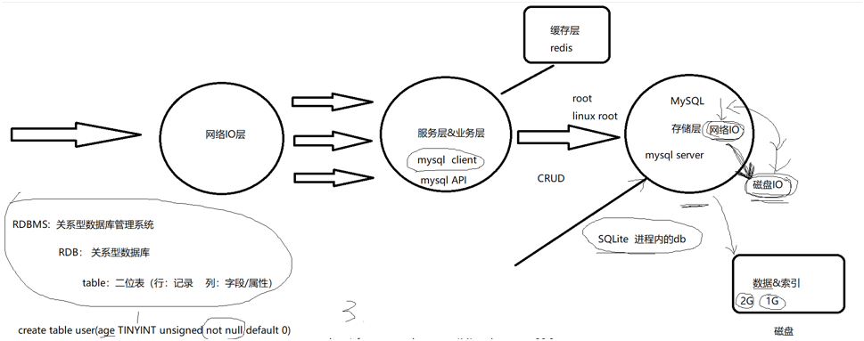


# Mysql配置目录

## MySQL 默认目录结构

1. **默认安装目录：**
   - 通常位于 `/var/lib/mysql`。
   - 是 MySQL 的 **数据目录**，保存所有数据库和表的数据文件。
2. **数据目录结构说明：**
   - 每个数据库对应一个子目录（类似 Windows 下结构）。
   - 每张表通常包含多个文件，如 `.frm`（旧版本表结构）、`.ibd`（InnoDB 数据文件）、`.MYD`、`.MYI` 等（MyISAM）。
   - 不同的存储引擎使用不同后缀。

------

## MySQL 配置文件

1. **配置文件位置：**

   - 通常在 `/etc/my.cnf`，有些系统中可能不存在，需要手动创建。--- 或者在 `/etc/mysql/mysql.conf.d/mysqld.cnf`--ubuntu22.04 
   - ubuntu22.04
     `/etc/mysql/mysql.conf.d/mysqld.cnf`（服务器配置）
     `/etc/mysql/mysql.conf.d/mysql.cnf`（客户端配置）
   - 可使用 `touch /etc/my.cnf` 创建，并使用编辑器（如 vim）添加内容。

2. **常见配置项示例（放在 `[mysqld]` 区块）：**

   ```
   [mysqld]
   datadir=/var/lib/mysql
   log-error=/var/log/mysqld.log
   character-set-server=utf8    # 修改 编码格式
   default-storage-engine=InnoDB # 默认存储引擎 
   ```

   - 修改配置后，需使用 `systemctl restart mysqld` 重启服务。
   
   > [!tip]
   >
   > ## 补充
   >
   > 1. **`mysqld`** 是 MySQL 服务器的实际守护进程名称（`d` 表示 daemon），常见于 RHEL/CentOS 或手动编译安装的环境。
   >
   > 2. **`mysql`** 是某些发行版（如 Ubuntu/Debian）的服务别名，简化了操作，但底层调用的仍是 `mysqld` 进程。
   >
   > 3. **MariaDB** 可能使用 `mysql` 或 `mariadb` 作为服务名以保持兼容性。
   >
   > 4. `systemctl` 命令 可以自动补全
   >
   > 5. ```
   >    systemctl restart mysql
   >    ```
   >
   > | **特性**     | **systemctl** (Systemd)               | **service** (SysVinit)       |
   > | :----------- | :------------------------------------ | :--------------------------- |
   > | **所属体系** | 现代 Linux（Ubuntu 16.04+/CentOS 7+） | 传统 Linux（旧版本）         |
   > | **配置文件** | `.service` 文件（如 `mysql.service`） | `/etc/init.d/` 下的脚本      |
   > | **功能**     | 更强大（依赖管理、日志集成等）        | 基础功能（启动/停止/状态）   |
   > | **命令示例** | `sudo systemctl restart mysql`        | `sudo service mysql restart` |
   > | **日志查看** | `journalctl -u mysql`                 | 需手动查 `/var/log/` 文件    |

------

## 支持远程连接配置

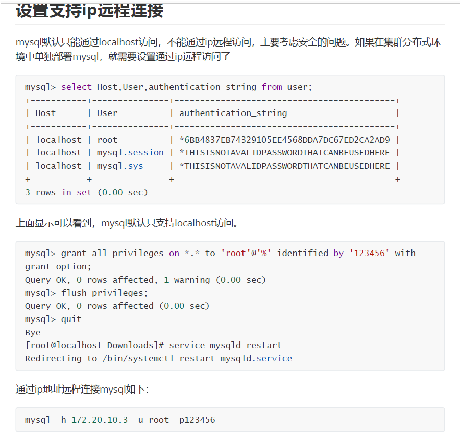

1. **登录 MySQL 并查看用户权限：**

   ```
   mysql -u root -p
   USE mysql;
   SELECT Host, User FROM user;
   ```

2. **默认情况：**

   - root 用户默认只能通过 `localhost` 登录，远程连接被拒绝（错误：`host is not allowed to connect`）。

3. **授予远程连接权限：**

   ```
   GRANT ALL PRIVILEGES ON *.* TO 'root'@'%' IDENTIFIED BY '123456' WITH GRANT OPTION;
   FLUSH PRIVILEGES;
   ```

   - `@'%'` 表示允许任意 IP 登录。---- % 可修为 **特定ip**
   - `FLUSH PRIVILEGES` 必须执行，刷新权限才会生效。

4. **远程登录命令示例：**

   ```
   mysql -h <IP地址> -P 3306 -u root -p
   ```
   
5. **注意密码策略：**

   - 如果提示密码不符合策略（如太简单），可临时放宽密码强度策略，或者设置更复杂的密码。


## 默认复杂密码问题

`set global validate_password_policy=0;`

- **作用**：将密码策略设为最低强度（`0`=只检查长度）。
- **其他可选值**：
  - `1`（默认）：需包含数字、大小写字母、特殊字符。
  - `2`：严格模式（额外字典检查）。

`set global validate_password_length=1;`

- **作用**：允许密码最小长度为 1 个字符（默认通常为 8）。


## 实用建议

- **真实环境中**应使用复杂密码，并**仅为特定 IP 开放远程**权限。
- 熟练掌握配置文件的位置与作用，对 MySQL 管理尤为重要。
- **操作习惯建议：** 配置修改后重启服务、权限修改后刷新权限。


# mysql数据类型

## 为什么要重视数据类型选择？

- **数据库是最先遇到性能瓶颈的环节**，因其涉及磁盘 I/O。
- 字段类型选择过大，浪费存储空间，增加磁盘读取开销。
- **合理的数据类型选择 = 更少的 I/O = 更高的性能**。
- 例如：相同1000万行，如果字段选型合理，可能只占 1GB 而不是 2GB。

------

## 整型数值类型（Numeric Types）

| 类型        | 字节数 | 有符号范围             | 无符号范围     |
| ----------- | ------ | ---------------------- | -------------- |
| `TINYINT`   | 1      | -128 ~ 127             | 0 ~ 255        |
| `SMALLINT`  | 2      | -32,768 ~ 32,767       | 0 ~ 65,535     |
| `MEDIUMINT` | 3      | -8,388,608 ~ 8,388,607 | 0 ~ 16,777,215 |
| `INT`       | 4      | -2^31 ~ 2^31-1         | 0 ~ 2^32-1     |
| `BIGINT`    | 8      | -2^63 ~ 2^63-1         | 0 ~ 2^64-1     |


**实际建议**：

- 年龄：`TINYINT UNSIGNED` 足够（0~255）。
- 身份证号、手机号：用字符串存储，避免整数溢出或丢失精度。

------

## 浮点数与高精度计算

| 类型           | 字节 | 精度（有效位） | 场景                   |
| -------------- | ---- | -------------- | ---------------------- |
| `FLOAT`        | 4    | 约7位          | 对精度要求不高的场景   |
| `DOUBLE`       | 8    | 约15位         | 普通浮点计算           |
| `DECIMAL(m,d)` | 可变 | 28位以上       | 高精度金融计算（推荐） |


⚠️注意：

- `FLOAT` / `DOUBLE` 精度可能丢失，**不会报错**。
- `DECIMAL` 底层用字符串存储，计算精度高，溢出时会**报错提醒**。

------

## 字符串类型

更多见 pdf

| 类型                 | 特点                           | 最大长度            |
| -------------------- | ------------------------------ | ------------------- |
| `CHAR(n)`            | 固定长度，占满n字节            | 最多255字节         |
| `VARCHAR(n)`         | 可变长度，更节省空间           | 最多65535字节       |
| `TEXT`--类似INIT多种 | 大文本存储，按长度分为多个级别 | 最多4GB（longtext） |
| `BLOB`               | 二进制数据，如图片、音频等     | 最多4GB（longblob） |


常见误区：  **面试**

- `INT(4)` 里的 **(4)** 表示显示宽度，不影响存储大小。
- `VARCHAR(n)` 的 **n** 是字符数（字符 != 字节，UTF-8中文通常是3字节）。

------

## 时间与日期类型

| 类型                                                    | 说明                  | 适用情况                           |
| ------------------------------------------------------- | --------------------- | ---------------------------------- |
| `DATE`                                                  | 年-月-日              | 只存日期                           |
| `DATETIME`                                              | 年月日+时分秒         | 通常用于记录时间点--需要手动更新   |
| `TIMESTAMP`                                             | 与时区相关，自动更新  | 不推荐用作更新时间戳--自动更新时间 |
| `YEAR`                                                  | 只存年份（1901-2155） | 不推荐                             |
| 推荐：使用整型字段存储 Unix 时间戳（`INT` 存 `time()`） |                       |                                    |

> ### `TIMESTAMP`为什么不推荐?
>
> 实时更新, 涉及太多 磁盘io, 为了性能, 最好少 磁盘io
>
> 尽量 让 mysql 做最少的事


## 时间戳--用的多 

```c++
select unix_timestamp(now());
```

显示  自 1970年 开始 到现在的 秒数

可以很方便的  转换为 当前时间


## enum和set

这两个类型，都是**限制该字段只能取固定的值**，但是**枚举字段只能取一个唯一的值**，而**集合字段可以取**
**任意个值。**

比如  性别,  男女

## 设计建议 & 踩坑提示

1. **数据字段类型要“够用就好”，不是越大越好。**
2. 约束条件（如 `NOT NULL`、`DEFAULT`）是完整性的一部分，**便于数据规范化**。
3. **避免使用 MySQL 的复杂特性**如存储过程、触发器、外键 —— 将逻辑转移到业务层，减轻数据库负担。
4. 避免 `TEXT` 存储字段内容超出预期导致截断，可结合实际加字符长度限制。


# 运算符

## 算术运算符（+ - * / %）

- 与大多数编程语言类似，用于数值计算。

- **示例**：学生升学，年龄+1

  ```
  UPDATE user SET age = age + 1;
  ```

- **注意事项**：

  - 数据**类型要匹配**，避免越界。
  - 浮点数（float、double）精度有限，**可能导致溢出或截断**。
  - 若对精度要求高，应使用 `DECIMAL` 类型。

------

## 逻辑运算符（AND、OR、NOT）

- 常用于 `WHERE` 条件组合。

> #### 1. AND：逻辑与（都满足）
>
> ```
> SELECT * FROM user WHERE sex = '男' AND score >= 90;
> ```
>
> #### 2. OR：逻辑或（满足任一即可）
>
> ```
> SELECT * FROM user WHERE sex = '男' OR score > 90;
> ```
>
> #### 3. NOT：逻辑非
>
> ```
> SELECT * FROM user WHERE NOT (score > 90);
> ```


## 比较运算符（=、!=、>、<、>=、<=、BETWEEN、IN）

> #### 1. 基本运算符
>
> - `=`：等于
> - `!=` 或 `<>`：不等于（推荐使用 `!=`，`<>` 未来可能弃用）
> - `>`、`<`、`>=`、`<=`：大小比较
>
> #### 2. BETWEEN ... AND ...
>
> - 判断某个字段值是否**在某个范围之间**
>
> ```
> SELECT * FROM user WHERE age BETWEEN 20 AND 22;
> ```
>
> #### 3. IN (...)
>
> - 判断字段是否**属于多个值中的一个**
>
> ```
> SELECT * FROM user WHERE score IN (90, 99, 100);         
> ```


## IS NULL / IS NOT NULL

- 用于判断字段值是否为空（**不能用 = NULL 或 != NULL**）

```
SELECT * FROM user WHERE score IS NULL;
SELECT * FROM user WHERE score IS NOT NULL;
```

- 常出现在：
  - **字段未加 `NOT NULL` 约束时**----- **条件**
  - 外连接（LEFT JOIN / RIGHT JOIN）结果中，缺失值默认为 NULL

------

## LIKE 通配符（模糊匹配）

> #### 1. 通配符
>
> - `%`：匹配**任意多个字符**
> - `_`：匹配**任意一个字符**
>
> #### 2. 示例：查找姓名以“张”开头的用户
>
> ```
> SELECT * FROM user WHERE name LIKE '张%';
> ```
>
> - `LIKE '张%'` 匹配“张三”、“张晓阿达”、“张瑶是”等。
> - `LIKE '张_'` 只匹配“张三”、“张强”这类 **两个字** 的。
>
> #### 3. 索引优化问题--- **注意-坑点**
>
> - 是否能使用索引：
>   - 通配符在**末尾**或**中间**（如 `'张%'`, `'张_强'`）：**可能用到索引**
>   - 通配符在**开头**（如 `'%三'`）：**无法使用索引**，全表扫描。

------

## 注意事项与避坑指南

1. **数据类型选择需谨慎**，避免：
   - 数值溢出（int 溢出）
   - 浮点精度误差（float/double）
2. **空值判断**一定要用 `IS NULL / IS NOT NULL`，**不能用 `=` 比较**
3. **LIKE 查询是否走索引**取决于通配符位置，**查询效率需考虑**
4. **提前考虑边界问题与异常数据**，避免线上出错
   - 出错不仅影响业务，还影响绩效、奖金等

------

## 总结

- 掌握 **MySQL 中常用运算符**
- 理解其在实际业务中的常见应用
- **避免常见错误（如空值判断、索引失效）**
- 建立正确的数据处理思维，提前规避问题


# mysql完整性约束条件

## 主键约束（`PRIMARY KEY`）与 自增键约束

- **作用**：唯一标识一条记录，**不能重复，不能为 NULL**。

- **说明**：

  - 一个表只能有一个主键（可由多个字段联合组成）。
  - 通常用于 id 字段，可搭配 `AUTO_INCREMENT`-- **自增键约束** 实现自增。

- **示例**：   无需 not null

  ```
  CREATE TABLE user(
  id INT PRIMARY KEY AUTO_INCREMENT COMMENT '用户的主键id'
  ```

------

## 唯一约束（`UNIQUE`）

- **作用**：字段值不能重复，但**可以为 NULL**（可多个字段为 NULL）。

- **说明**：

  - 一个表可定义多个 `UNIQUE` 约束。
  - 常用于邮箱、用户名等不能重复的字段。

- **示例**： 根据实际  是否需要 not null

  ```
  CREATE TABLE user(
  id INT PRIMARY KEY AUTO_INCREMENT COMMENT '用户的主键id',
  nickname varchar(50) UNIQUE NOT NULL COMMENT '用户的名称',
  
  ```

------

## 非空约束（`NOT NULL`）

- **作用**：字段值不能为空。

- **说明**：

  - 常用于必须填写的字段，如用户名、密码等。
  - 可搭配 `DEFAULT` 提供默认值。

- **示例**：

  ```
  CREATE TABLE user(
  id INT PRIMARY KEY AUTO_INCREMENT COMMENT '用户的主键id',
  nickname varchar(50) UNIQUE NOT NULL COMMENT '用户的名称',
  age TINYINT UNSIGNED NOT NULL DEFAULT 18,
  
  ```

------

## 枚举使用

```c++
CREATE TABLE user(
id INT PRIMARY KEY AUTO_INCREMENT COMMENT '用户的主键id',
nickname varchar(50) UNIQUE NOT NULL COMMENT '用户的名称',
age TINYINT UNSIGNED NOT NULL DEFAULT 18,
sex ENUM('male', 'famale'));
```


## 创建数据库和表

```c++
create database test;

use test;

CREATE TABLE user(
id INT PRIMARY KEY AUTO_INCREMENT COMMENT '用户的主键id',
nickname varchar(50) UNIQUE NOT NULL COMMENT '用户的名称',
age TINYINT UNSIGNED NOT NULL DEFAULT 18,
sex ENUM('male', 'famale'));

desc user\G   --  无分号
```

`\G` 是一个特殊的语法，用于将查询结果按行垂直显示，而非默认的水平表格形式。


## 默认值约束（`DEFAULT`）

- **作用**：字段未赋值时使用默认值。

- **说明**：

  - 可与 `NOT NULL` 一起使用，避免插入 NULL。

- **示例**：

  ```
  status INT NOT NULL DEFAULT 1
  ```

------

## 检查约束（`CHECK`）

- **作用**：限制字段取值范围或满足的条件。

- **说明**：

  - ✅ **MySQL 8.0.16+ 才真正支持 `CHECK` 约束！**
  - ✅ 可用 `ENUM` 类型替代一些简单的检查需求。
  - ❌ MySQL 5.x 虽可写 `CHECK`，但**不会生效**。

- **示例**（MySQL 8.0.16+ 才有效）：

  ```
  age INT CHECK (age >= 0 AND age <= 120)
  ```

------

## 外键约束（`FOREIGN KEY`）-- 一般不用


- **作用**：建立两张表之间的关系，保证引用字段存在于目标表。

- **实际场景说明**：

  - 如学生表 `student` 和考试表 `exam` 之间通过学号建立关联。
  - **现在后台开发中一般不使用外键**，因为：
    - 会影响性能。
    - 多表逻辑通常放在业务代码中处理更灵活、可控。

- **说明**：

  - ✅ 外键字段必须引用另一表的 **主键或唯一键**。
  - ✅ **仅 InnoDB 引擎支持**，MyISAM 等不支持外键。
  - ✅ 可设置级联操作，如：
    - `ON DELETE CASCADE`：删除父表记录时，自动删除子表记录。
    - `ON UPDATE CASCADE`：更新主键时，自动更新子表。
  - **⚠️ 实际开发中**，大型系统常通过程序控制逻辑，**不使用外键**（为降低耦合，提高扩展性）。

- **示例**：

  ```
  CONSTRAINT fk_user_id
  FOREIGN KEY (user_id) REFERENCES user(id)
  ON DELETE CASCADE
  ```

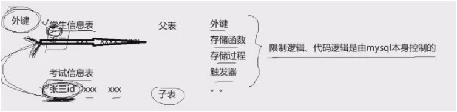

## 为什么后台开发中通常不用外键、存储过程、触发器等 MySQL 逻辑功能？

> ### **后台开发的实践倾向**
>
> - 在实际开发中，**后台逻辑尽量不写在数据库中**。
> - 外键、存储过程、触发器等机制，**在现代系统中使用非常少**。
>
> ### **核心原因：性能与可维护性**
>
> - 数据库（MySQL）的 **存储层最容易成为性能瓶颈**。
> - 将复杂逻辑放在数据库执行，会：
>   - 增加数据库的负担；
>   - 降低扩展性（逻辑封闭在数据库中，调试与迁移困难）；
>   - 不利于分布式架构和微服务的逻辑分拆。
>
> ### **更好的做法：逻辑上移**
>
> - 外键约束、字段检查、级联操作等应由**后端业务代码来控制**。
> - 增删改查、数据校验、逻辑处理等操作建议：
>   - 放在 **服务层 / 业务逻辑层** 完成；
>   - 数据库只负责 **纯粹的数据存储与读取**。


# 表设计原则(一)-**重点**

> 了解与范式、约束、外键等相关的基本设计原则

## 背景与应用场景

- 在项目初期进行需求分析后，需要进行**库表设计**；
- 表设计涉及**实体建模、字段定义、字段类型、主键选择、表间关系**等；
- 与面向对象设计类比：**表 = 实体类**；**表间关系 = 实体间关系（组合、继承）**；
- 表间关系常见三种：
  - **一对一**
  - **一对多**
  - **多对多**

## 一对一关系定义与示例

> #### 概念说明：
>
> - 一个实体 A 对应一个实体 B；
> - 示例：`用户 user` 与 `身份信息 info`；
>   - 一个用户仅有一个身份信息；
>   - 一个身份信息也仅属于一个用户。
>
> #### 示例表结构：
>
> - **用户表 user**：
>   - `uid`（用户ID，主键）
>   - `name`（姓名）
>   - `age`（年龄）
>   - `gender`（性别）
> - **身份信息表 info**：
>   - `id_card`（身份证号，主键或唯一字段）
>   - `address_info`（地址信息）
>   - `uid`（用户ID，用于关联 user 表）

## 如何建立关联？

- 在 **子表（info）中添加外键列 `uid`**，逻辑上关联 user 表的主键 `uid`；

- `uid` 的类型必须与主表中的类型一致；

- 实际查询示例：

  ```
  SELECT * FROM info WHERE uid = 2010;
  ```

  可查出王同学的身份信息。

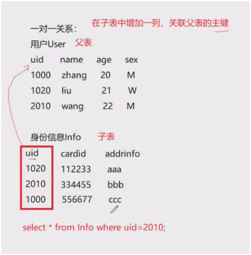

## 注意事项与实践建议

- **理论上是外键约束，但实际开发中不推荐使用数据库外键约束机制**：

  - 原因：数据库（如 MySQL）存储层 IO 压力大，容易成为性能瓶颈；
  - 建议将关联逻辑放在 **后端服务层代码中控制**；
  - 例如，通过业务代码确保某 UID 在 user 表存在，保持一致性；

- 所以：

  > “**不要让 MySQL 做过多限制逻辑，只负责存储核心数据，逻辑由后端控制**”

> 一对一表设计：**在子表中添加一列逻辑外键，关联主表主键；关联控制应在业务代码中完成，而不是依赖数据库约束机制。**


# 表设计原则(二)-**重点**

## 一对多 & 多对多 关系的理解与数据库表设计例子

## 电商系统涉及的核心实体：

- `User（用户）`
- `Product（商品）`
- `Order（订单）`

------

## 实体之间的关系分析：

| 实体关系    | 类型       | 说明                                                         |
| ----------- | ---------- | ------------------------------------------------------------ |
| 用户 ⇄ 商品 | 无直接关系 | 用户只是**查看**商品，未购买前无交集                         |
| 用户 → 订单 | 一对多     | 一个用户可以有**多个订单**，每个订单只属于**一个用户**       |
| 订单 ⇄ 商品 | 多对多     | 一个订单可以包含**多个商品**，一个商品也可以出现在**多个订单中** |


------

## 表结构设计方式

> #### 一对多关系设计 —— 用户与订单
>
> - 方案：**在子表（订单表）中添加父表（用户表）的主键 `UID` 作为外键**
>
> ```
> 用户表（user）
> --------------------------
> UID (PK) | Name | Age | Sex
> 
> 订单表（order）
> ---------------------------------------------
> OrderID (PK) | UID (FK) | TotalPrice | Address
> ```
>
> - 表达关系：一个 UID 可以对应多条订单记录（OrderID），即实现一对多。
>
> 

------

## 总结表间关系设计方式

| 关系类型 | 设计方式                         | 本例实体    |
| -------- | -------------------------------- | ----------- |
| 一对多   | 子表添加外键, 并不是约束, 要分清 | 用户 → 订单 |
| 多对多   | 引入中间表，包含双方主键         | 订单 ⇄ 商品 |


------

## 为什么要这么设计？

- 保持数据 **规范性**（避免冗余）；

- 保证查询 **高效性**（字段冗余最小化 + 结构清晰）；

- 支持 **灵活扩展**（例如后续给订单加评价、商品加分类）。

  

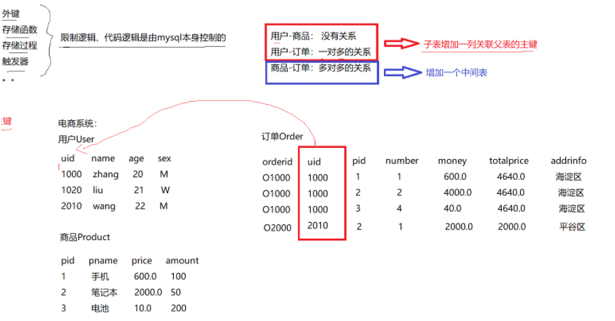


# 表设计原则(三)-**重点**

## 用中间表来建立“多对多”关系

## 为什么要设计中间表（避免数据冗余）

- **问题场景**：一个订单中可能包含多个商品，一个商品也可能出现在多个订单中，属于**多对多关系**。
- **如果直接在订单表中冗余存商品信息**：
  - 会产生**重复数据**（如相同的订单 ID、地址、总价等被重复存储）。
  - 对订单中商品的增删改操作，会导致**批量更新或删除**，**影响性能和一致性**。
- **冗余带来的问题**：
  - 修改一项数据（如地址或总价）需改多行，易造成数据不一致。
  - 删除订单时需删多条记录，逻辑复杂。
  - 占用存储空间、效率低。

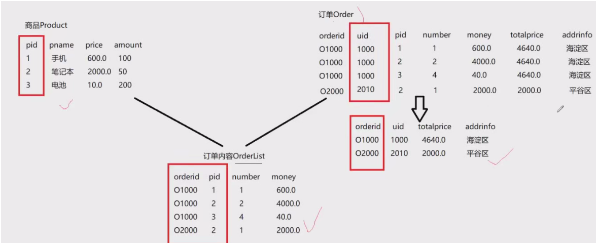

## 表结构设计方式

> ### 多对多关系设计 —— 商品与订单
>
> #### 商品表（`product`）：
>
> | 字段名 | 含义           |
> | ------ | -------------- |
> | PID    | 商品ID（主键） |
> | name   | 商品名称       |
> | price  | 单价           |
>
> 
>
> #### 订单表（`order`）：
>
> | 字段名       | 含义           |
> | ------------ | -------------- |
> | orderID      | 订单ID（主键） |
> | UID          | 用户ID（外键） |
> | total_price  | 总价           |
> | address_info | 配送地址       |
>
> 
>
> #### 中间表（`order_list` 或 `order_detail`）：
>
> | 字段名  | 含义                      |
> | ------- | ------------------------- |
> | orderID | 外键：对应某一订单        |
> | PID     | 外键：对应某一商品        |
> | number  | 商品数量                  |
> | money   | 商品对应金额（单价×数量） |
>
> 
>
> > **联合主键建议**：`orderID + PID`，防止重复添加相同商品到同一订单中。


## 数据查询逻辑（如何用）

- 想看某个订单的所有商品：
  - 从 `order_list` 查出所有 `PID`，再查 `product` 表获得商品详情。
- 想看某个用户的订单：
  - 从 `order` 查出 `UID` 对应的订单，结合 `order_list` 得出每个订单包含的商品清单。


## 提醒与建议

- 多对多中避免把重复信息（如地址、总价）存在多条记录中。
- 表设计应考虑可维护性、扩展性、操作简便性。
- 避免数据冗余，是数据库设计中的核心目标之一。
- 多实践、多思考，遇到新业务场景时灵活应用。


# 面试中的泛型设计

> 配合pdf食用

## 什么是范式设计？

- **范式（Normalization）**：是一套数据库设计准则，目的是**减少数据冗余、提高数据一致性和可维护性**。
- 与之前讲的“一对一/一对多/多对多”关系设计**相辅相成**：
  - 关系设计解决“表与表的连接关系”；
  - 范式设计解决“表内部字段组织结构”的合理性。

------

## 范式的分类（重点前三个）

> 1. ### **第一范式（1NF）——列的原子性**
>
>    - 每一列都要是**不可再分的原子值**，**不能存储复合信息**。
>    - ✅ 正确做法：地址字段应拆为 `国家`、`城市`、`街道`，甚至可以独立成表。
>    - ❌ 错误做法：将“地址”字段直接存成 `"中国北京市朝阳区"`。------  **退化为  key-value 了!!!**
>
>    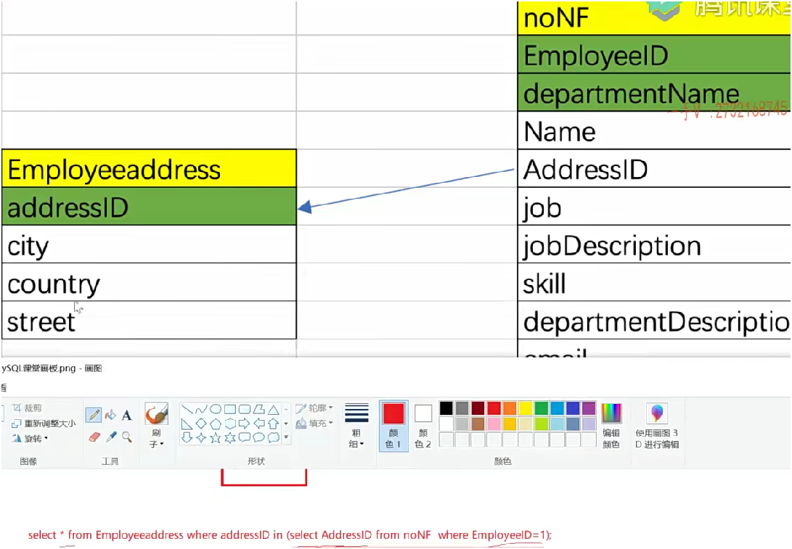
>
>    **举例**
>
>    ```
>    错误：address = “中国北京市朝阳区”
>    正确：country = “中国”，city = “北京”，district = “朝阳”
>    ```
>
>    > [!warning]
>    >
>    > 1NF 都不满足, 就不是 **关系型数据库**了, 而是 **非关系型 数据库**
>
> 2. ### **第二范式（2NF）——消除“部分依赖”**
>
>    - 前提：存在联合主键（即主键由多个字段组成）。
>    - 要求：所有非主属性必须**完全依赖于联合主键的所有字段**，不能只依赖其中的一部分。
>    - ✅ 正确做法：将只依赖部分主键的字段拆分成新表。
>    - ❌ 错误做法：比如课程的“学分”只依赖于课程ID，不应放在学号+课程ID的联合表里。
>
>    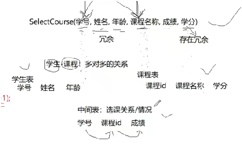
>
>    **举例**
>
>    ```
>    表：学号 + 课程名称 -> 成绩、学分、学生姓名、年龄    ------------ 学分和成绩 要区分清楚
>    问题：
>    - 学分只依赖课程，不依赖学号 ➜ 数据冗余
>    - 姓名、年龄只依赖学号 ➜ 数据冗余
>    正确做法：
>    - 拆分出学生表、课程表、选课关系表（中间表）
>    ```
>
>    > [!tip]
>    >
>    > pdf 里 第一范式的 图片里, 不遵循 第二范式!!  ----  拆分!
>
> 3. ### **第三范式（3NF）——消除“传递依赖”**
>
>    - 要求：非主属性不能依赖于其它非主属性。
>
>    - **在满足2NF基础上，消除对“非主属性”的依赖（传递依赖）。**
>
>      ✅ 所有非主属性都**必须依赖主键**，**不能依赖其他非主属性**。
>
>      举例：学生表中的“学院地点”“学院电话”依赖“学院”，不是学号 ➝ 应拆分成两个表（学生表、学院表）。
>
> 4. ###  **BC范式（Boyce-Codd Normal Form，BCNF）**
>
>    - **在3NF基础上，要求每个决定因素都是候选键。**
>    - ✅ 表中只能有一个候选键（主键），非主键字段不能依赖非候选键。
>    - ⚠️ 使用场景少，通常满足3NF即可。
>
>    > **候选键 = 能唯一标识记录的最小字段组合；是主键的候选人。**
>
> 5. ### **第四范式（4NF）**
>
>    - **在BCNF基础上，消除多值依赖。**
>    - 可以减少维护数据一致性的工作
>    - 举例：员工表中存储技能（Skill）时，不应该在一个字段中存储多个值 ➝ 应将技能拆分成一张新表（多行单值）。
>    - 有的人是“java，mysql”，有的人描述的是“Java，MySQL”，这样
>      数据就不一致了，解决办法就是将多值属性放入一个新表
>
>    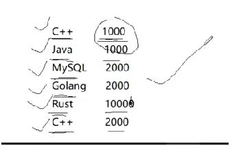


## 范式与性能的取舍


- 范式高 ➝ 表拆得多 ➝ 查询更复杂 ➝ 性能更差（多表 JOIN）。
- 实际项目中：
  - 通常满足 **第三范式即可**；
  - 有时会 **适当冗余**，换取性能；
  - 根据业务频率和场景决定是否范式化。


## 候选键

> 在关系型数据库中，**候选键（Candidate Key）** 是能够唯一标识表中每一行数据的最小属性集。它是数据库设计的基础概念，用于确保数据的完整性和查询效率。以下是详细解释：
>
> ### **定义与特性**
>
> 1. **唯一性**：候选键的任何两个元组（行）在该属性集上的值都不相同。
> 2. **最小性**：候选键的任何真子集都不能唯一标识元组（即去掉任何一个属性后，剩余属性无法保证唯一性）。
> 3. **可选性**：一个表可以有多个候选键，但至少存在一个（主键通常从候选键中选择）。
>
> ### **示例说明**
>
> 假设有学生表 `Student` 包含以下字段：
> `(学号, 身份证号, 姓名, 年龄, 班级)`
>
> - **候选键分析**：
>   1. **{学号}**：唯一标识学生，不可再分。
>   2. **{身份证号}**：唯一标识学生，不可再分。
>   3. **{学号，姓名}**：虽然组合能唯一标识，但非最小集（因单独`学号`已足够）。
> - **结论**：`{学号}` 和 `{身份证号}` 是候选键，而 `{学号, 姓名}` 不是。
>
> ### **候选键 vs 主键 vs 超键**
>
> | 概念       | 定义                                     | 示例（学生表）           |
> | ---------- | ---------------------------------------- | ------------------------ |
> | **候选键** | 唯一且最小的属性集                       | `{学号}`、`{身份证号}`   |
> | **主键**   | 从候选键中选定的 “主” 标识（唯一且非空） | `{学号}`（假设选为主键） |
> | **超键**   | 包含候选键的属性集（可能不满足最小性）   | `{学号}`、`{学号, 姓名}` |


## 面试问法与答题套路（建议这样答）

> **Q: 你对数据库范式的理解？**

可从两个角度答：

**① 作用：**

- 避免数据冗余，提高数据一致性，防止异常（更新、插入、删除）。

**② 常用范式说明：**

- 第一范式：字段原子性；--- 不可再分
- 第二范式：消除部分依赖；--- 基本完全依赖于主键-主要针对联合主键
- 第三范式：消除传递依赖（推荐遵守）；--- 在满足2NF基础上，消除对“非主属性”的依赖
- BCNF：理解即可，实际少用； --- 每个都是 候选键 ,  能通过候选键 都能唯一 查到
- 第四范式: 避免 出现 多值, 保持 一致性--比如 大小写
- 实际开发中：遵循第三范式，必要时做性能优化可容忍冗余。


# 库操作

## SQL（Structured Query Language）是通用语言

- **SQL 是结构化查询语言，不专属于 MySQL**。
- 几乎所有关系型数据库系统（RDBMS）都支持 SQL，例如：
  - MySQL、SQL Server、Oracle、DB2、MariaDB、PostgreSQL、SQLite 等。
- 各个数据库对 SQL 的支持有细微差异（比如分页语法），但大约 **95% 是相同的**。

------

## SQL 中最核心、最常用的是「查询语句（SELECT）」

- 在 CRUD（增删改查）四种操作中，**查询（Read）使用频率远高于其他操作**。
  - 例如：电商 App 中用户的浏览（查询）远多于购买（新增）。
- 查询 SQL 涉及内容非常多：
  - 单表查询
  - 多表查询（内连接、外连接）
  - 子查询
  - 索引优化
  - 查询性能分析
- **实际工作和面试中经常会被问到“SQL 优化”和“索引设计”等问题。**

------

## SQL 分类：三大类语句

| 类型 | 全称                       | 含义                           | 常见指令                                                     |
| ---- | -------------------------- | ------------------------------ | ------------------------------------------------------------ |
| DDL  | Data Definition Language   | 数据定义语言（库、表结构定义） | `CREATE`、`DROP`删除数据库对象、`ALTER`修改已有的数据库对象结构(少用) |
| DML  | Data Manipulation Language | 数据操作语言（增删改查）       | `INSERT`、`DELETE`、`UPDATE`、`SELECT`---CRUD                |
| DCL  | Data Control Language      | 数据控制语言（权限）           | `GRANT`、`REVOKE`                                            |

## `GRANT`

用于**授予用户权限**，例如对数据库、表、列的操作权限。
 **常见权限**：`SELECT`、`INSERT`、`UPDATE`、`DELETE`、`ALL` 等。

```c++
GRANT SELECT, INSERT ON users TO 'alice'@'localhost';
```

## `REVOKE`

用于**收回已授予的权限**。

```c++
REVOKE INSERT ON users FROM 'alice'@'localhost';
```


------

## 重点强调的几点建议

> - ### **库和表的命名**不要与 SQL 关键字重复
>
>   例如不要命名为 `select`、`user` 等。
>
> - ### 数据库系统（如 MySQL）本身叫做 **RDBMS（关系型数据库管理系统）**
>
>   可以创建多个数据库（库名），每个数据库下可以建多个表（表名）。
>
> - ### 推荐使用 **命令行操作数据库** 而非 GUI 工具（如 Navicat）
>
>   以加强对 SQL 的熟练掌握。
>
> - 实际项目中，数据库命名要 **遵守统一规范**，以保证团队协作与维护便利。

------

## 实践操作演示要点（基于 ubuntu22.04 + MySQL）

1. **查看当前已有数据库：**

   ```
   SHOW DATABASES;
   ```

2. **创建新数据库：**

   ```
   CREATE DATABASE chat;
   ```

3. **选择数据库（进入库）：**

   ```
   USE chat;
   ```

4. **查看当前库下的所有表：**

   ```
   SHOW TABLES;
   ```

5. **删除数据库：**

   ```
   DROP DATABASE chat;
   ```

------

## RDBMS 的组织结构和范式理解

- RDBMS 组织结构是：

  ```
  MySQL Server
     └── 数据库（库）
            └── 表（table）
                  └── 行（记录）和列（字段）
  ```

- 为什么叫“关系型”？表与表之间可以建立关联（如外键），且**每一列具有原子性（第一范式）**。

- 相对的，非关系型数据库（如 NoSQL 的 KV 存储）则不满足原子性。


# 表操作 

## 数据库与表的基本操作

> #### 1. 数据库操作
>
> - **创建数据库**
>
>   ```
>   CREATE DATABASE school;
>   ```
>
> - **使用数据库**
>
>   ```
>   USE school;
>   ```
>
> - **查看当前数据库所有表**
>
>   ```
>   SHOW TABLES;
>   ```
>
> #### 2. 删除数据库/表
>
> - **删除数据库**
>
>   ```
>   DROP DATABASE dbname;
>   ```
>
> - **删除表**
>
>   ```
>   DROP TABLE user;
>   ```


## 创建表的语法与实践

> #### 示例：创建 `user` 表
>
> ```
> CREATE TABLE user (
>   id INT UNSIGNED NOT NULL AUTO_INCREMENT COMMENT '主键ID',
>   name VARCHAR(50) NOT NULL UNIQUE COMMENT '用户名',
>   age TINYINT NOT NULL COMMENT '年龄',
>   sex ENUM('man', 'woman') NOT NULL COMMENT '性别',
>   PRIMARY KEY (id)
> ) ENGINE=InnoDB DEFAULT CHARSET=utf8; 
> //  有时候, 设置不能为空, 又不知道值, 可以设置一个 默认值  
> ```
>
> #### 常见问题（容易写错）：
>
> - `AUTO_INCREMENT` 中间有下划线，不是空格。
> - `PRIMARY KEY` 是两个词。
> - `VARCHAR(n)` 中 `n` 表示最大**字节数**，不是字符数。
> - 整数类型的长度（如 `INT(8)`）只是**显示宽度**，不影响存储大小。

------

## 字段完整性约束（6种）

| 约束类型         | 含义与作用                           |
| ---------------- | ------------------------------------ |
| `PRIMARY KEY`    | 主键，唯一且不能为空                 |
| `UNIQUE`         | 唯一约束，可以为空，但值不可重复     |
| `NOT NULL`       | 不能为空                             |
| `DEFAULT`        | 设置默认值                           |
| `AUTO_INCREMENT` | 自增，只能用于整数类型，通常用于主键 |
| `FOREIGN KEY`    | 外键，表示表与表之间的关联           |


> ### **开发中实践建议：**
>
> - 外键约束**通常不直接设置**在数据库层，而是放在业务逻辑中维护数据一致性，以减少数据库压力（避免磁盘 I/O 瓶颈）。

## 表结构查看

- ### **查看表结构**

  ```
  DESC user;
  ```

- ### **查看表创建语句**

  ```
  SHOW CREATE TABLE user;
  ```

- ### 表在创建时, 实际是创建三个东西

  - ### **表的结构**

  - ### **表的数据**

  - ### **表的索引**	

------

## 字符集与引擎设置

- 建议在创建表时显式设置：

  ```
  ENGINE=InnoDB DEFAULT CHARSET=utf8;
  ```

- **MySQL 配置文件修改默认设置**

  - Windows: `C:\ProgramData\MySQL\my.ini`
  - Linux: `/etc/my.cnf` 或 `/etc/mysql/my.cnf`----不同系统, 不同版本 不一样

------

## 思维训练与面试建议

- **遇到数据库问题，要联想多个知识点一起思考：**
  - 是否索引未命中导致查询慢？
  - API 响应超时是否源于 SQL 性能？
  - 是否将业务逻辑合理分层处理？
- **学习技巧：**
  - 把常用 SQL 写入文本文档，养成积累习惯。
  - 遇到报错优先看关键字拼写、语法符号、字段类型是否正确。


# 单表查询操作select

## insert

> ### 什么是 `INSERT` 语句？
>
> `INSERT` 语句用于**向表中插入数据**。
>
> ------
>
> ### 基本语法
>
> ```
> INSERT INTO 表名 (列1, 列2, ...) VALUES (值1, 值2, ...);
> ```
>
> ------
>
> ### 示例一：插入一条数据
>
> 假设我们有如下用户表：
>
> ```
> CREATE TABLE user (
>   id INT PRIMARY KEY,
>   name VARCHAR(50),
>   age INT,
>   email VARCHAR(100)
> );
> ```
>
> 我们向表中插入一个用户：
>
> ```
> INSERT INTO user (id, name, age, email) VALUES (1, '张三', 20, 'zhangsan@example.com');
> ```
>
> ------
>
> ### 示例二：一次插入多条数据
>
> ```
> INSERT INTO user (id, name, age, email) VALUES
> (2, '李四', 22, 'lisi@example.com'),
> (3, '王五', 23, 'wangwu@example.com');
> ```
>
> ------
>
> ### 示例三：省略列名（**不推荐**，要求值顺序和所有列完全一致）
>
> ```
> INSERT INTO user VALUES (4, '赵六', 25, 'zhaoliu@example.com');
> ```
>
> ------
>
> ### 🔸 注意事项：
>
> - `id` 是主键，不能重复；
> - 插入数据时必须满足表结构和字段约束（比如类型、非空、唯一等）；
> - 插入失败时数据库会报错，如违反主键唯一性。

## select

- 主要讲解的是 **单表查询的 SQL 语句（SELECT）**。
- SELECT 是日常开发、面试、项目中最常见的 SQL 操作。
- 学好 SELECT 为后续学习 **索引与 SQL 优化** 打基础。
- 尽管此节暂未讲索引，但已提前强调一些 **与索引密切相关的概念（如: 回表）**。


## 基本语法结构：SELECT + FROM

> 
>
> ```
> SELECT * FROM user;
> ```
>
> - `SELECT` 和 `FROM` 是 SQL 的关键字，语法结构是固定的。
> - `*` 是通配符，表示选择所有字段。
>
> ### 建议：不要轻易使用 `*`，原因如下：
>
> 1. **表结构变化风险大**：以后字段增减时可能造成数据逻辑异常。
> 2. **不利于性能优化**：会增加 IO 与网络传输的负担。
> 3. **可能影响索引优化效果**：增加“回表”风险（后面详细讲）。 
>
> ### 更推荐的写法：
>
> ```
> SELECT name, age, sex FROM user;
> ```


## WHERE 子句：添加过滤条件

> - `WHERE` 后面可以添加 **各种比较或逻辑条件**，用于筛选数据。
>
> ### 常用条件类型示例：
>
> | 类型     | 示例语法                                  | 说明              |
> | -------- | ----------------------------------------- | ----------------- |
> | 比较运算 | `age >= 21`                               | 年龄大于等于 21   |
> | 逻辑运算 | `sex = 'woman' AND age > 20` ---- 还有 OR | 同时满足两个条件  |
> | 范围查询 | `age BETWEEN 20 AND 22`                   | 包含 20 和 22     |
> | 多值匹配 | `age IN (20, 21)`                         | 年龄为 20 或 21   |
> | 排除匹配 | `age NOT IN (20, 21)`                     | 年龄不是 20 或 21 |
> | 模糊匹配 | `name LIKE '张%'`                         | 以“张”开头的名字  |
> | 空值判断 | `name IS NULL` / `IS NOT NULL`            | 判断是否为空      |
>
> 
>
> ⚠️ 注意：
>
> - 使用通配符 `%` 或 `_` 时，需要搭配 `LIKE` 使用，不能用 `=`。
> - 判断空值用 `IS NULL` 或 `IS NOT NULL`，不能用 `= NULL`。


## 去重distinct 与 GROUP BY

```c++
select distinct age from user;  
```

可以通过这种 方式 查看 age 的分布, 不需要重复 

GROUP BY 大材小用!!

##  什么是 `UNION`？

> - `UNION` 用于 **合并两个或多个 `SELECT` 查询结果**。---- 仅是显示, 不 创建新表
> - 每个 `SELECT` 语句的字段数量和顺序必须相同，字段类型也要兼容。
> - 默认情况下，`UNION` 会自动去重（即重复的行只保留一条）。
>
> ------
>
> ### 🔹 `UNION` 基本语法
>
> ```
> SELECT column1, column2 FROM table1
> UNION
> SELECT column1, column2 FROM table2;
> ```
>
> ------
>
> ### 🔹 `UNION ALL` 与 `UNION` 的区别
>
> | 关键字      | 是否去重   | 性能               |
> | ----------- | ---------- | ------------------ |
> | `UNION`     | ✅ 自动去重 | 较慢（有去重计算） |
> | `UNION ALL` | ❌ 不去重   | 更快（直接合并）   |
>
> 
>
> ```
> -- 会去除重复记录
> SELECT name FROM user1
> UNION
> SELECT name FROM user2;
> 
> -- 不去除重复记录
> SELECT name FROM user1
> UNION ALL
> SELECT name FROM user2;
> ```


## 关于“回表”的提前提醒

- **什么是回表？**
  - 当使用覆盖索引查询字段时，如果你查询的字段不在索引中，数据库需回到主表读取完整数据，这就叫回表。
- **为什么要避免回表？**
  - 回表会造成额外的磁盘 IO，性能下降。
- **如何减少回表？**
  - 查询时精确指定字段，并结合索引的设计来决定。
  - 使用覆盖索引的思维：尽量只查在索引列中的字段。


## 逻辑或（`OR`）、`IN`、`NOT IN` 等到底能不能用索引？误区

> ### 常见误区：
>
> 很多资料或书上说——**“逻辑或（`OR`）不能用索引”、“`NOT IN` 不能用索引”**，这其实是**不严谨甚至错误的理解！**
>
> 
>
> ### 正确理解：MySQL 是会自动优化 SQL 的！
>
> #### 🔸 举个例子，`OR` 条件：
>
> ```
> SELECT name, age, sex FROM user WHERE age = 20 OR age = 21;
> ```
>
> 看起来是一个 `OR` 条件，**好像不能用索引？**
>
> 不对！MySQL 会对这个 SQL 自动进行**优化转换**，转换成两个单独的 `SELECT`，再使用 `UNION ALL` 合并结果：
>
> ```
> SELECT name, age, sex FROM user WHERE age = 20
> UNION ALL
> SELECT name, age, sex FROM user WHERE age = 21;
> ```
>
> 这两个 `SELECT` 查询都可以**分别使用索引**，也就达到了使用索引的目的。
>
> ### MySQL 会自动转换成更适合走索引的结构：
>
> | 场景                         | 原始写法            | 优化后可能转换为           | 是否能走索引     |
> | ---------------------------- | ------------------- | -------------------------- | ---------------- |
> | `OR` 条件                    | `a = 1 OR a = 2`    | 两个子查询 + `UNION ALL`   | ✅ 能             |
> | `IN` 条件                    | `a IN (1,2,3)`      | 相当于多个 `OR`            | ✅ 能             |
> | `NOT IN`                     | `a NOT IN (1,2)`    | 复杂逻辑，**可能不能**优化 | ⚠️ 有时不能走索引 |
> | `NOT EXISTS` / `NOT IN` 替换 | 推荐用 `NOT EXISTS` | ✅ 更好优化                 | ✅ 更建议         |
>
> ### 关键提醒：
>
> - 不要**死背教条**：“某个语法就一定不能用索引”——这只是在**SQL 没被优化**的前提下；
> - 实际情况中，MySQL 会**根据执行计划自动选择是否拆分、合并查询**；
> - 所以：**逻辑或（`OR`）、`IN` 是有可能、甚至是常常可以用到索引的！**


## 示例

> pdf 有 带 in 子查询, in 里面还可以 是 select语句

> ```c++
> create database test;
> 
> 
> use test;
> 
> 
> CREATE TABLE user (
>   id INT UNSIGNED NOT NULL AUTO_INCREMENT COMMENT '主键ID',
>   name VARCHAR(50) NOT NULL UNIQUE COMMENT '用户名',
>   age TINYINT NOT NULL COMMENT '年龄',
>   sex ENUM('man', 'woman') NOT NULL COMMENT '性别',
>   PRIMARY KEY (id)
> ) ENGINE=InnoDB DEFAULT CHARSET=utf8; 
> 
> 
> insert into user(name,age,sex) values  ('hui sang', 28, 'man'), ('xu ting', 26, 'man'), ('xing huai', 27, 'man'), ('hai sang', 25, 'woman'), ('jiji ko', 24, 'woman');
> 
> 
> SELECT name, age, sex FROM user WHERE age > 25 UNION ALL SELECT name, age, sex FROM user WHERE sex =
> 'man';
> 
> 
>  select age from user where age>24;
> 
> 
> select distinct age from user;
> 
> 
>  select * from user where age in (24,25,28);
> ```

## 错误

```c++
select name age sex from user age>25 union all select name age sex from user sex='man';
```

语法错误点：

缺了 WHERE（应该是 WHERE age > 25）；

列之间少了逗号（应写作 SELECT name, age, sex）；


# limiit分页查询(一)

## 分页查询的必要性

> ### 1. 避免一次加载过多数据
>
> - 比如电商平台中有几千上万商品，不能全部一口气展示。
> - 分页可以提高可读性，方便定位查看。
>
> ### 2. 提升用户体验
>
> - 页面加载更快。
> - 翻到第几页、找回看过内容更容易。
>
> ### 3. 降低系统负载
>
> - 每次只查询并传输少量数据，减少数据库压力。
>
>   
>
> 分页常结合 `LIMIT` 或  `OFFSET` 使用，并配合索引优化查询效率，是现代数据库开发中的基础功能。


## LIMIT基本语法

> 1. ### **基本形式**：
>
>    ```
>    SELECT * FROM user LIMIT n;
>    ```
>
>    - 返回查询结果的前n条记录
>    - 等价于`LIMIT 0, n`
>
> 2. ### **带偏移量的形式**：
>
>    ```
>    SELECT * FROM user LIMIT m, n;
>    ```
>
>    - m表示偏移量(从0开始)，n表示要返回的记录数
>    - 例如`LIMIT 1, 3`表示**跳过1条记录，返回接下来的3条**
>
> 3. ### **使用OFFSET关键字**：   可读性更强的语法
>
>    ```
>    SELECT * FROM user LIMIT n OFFSET m;
>    ```
>
>    - 与`LIMIT m, n`效果相同，但语法更清晰
>    - 这是SQL标准语法，兼容性更好


## LIMIT与查询效率

> [!warning]
>
> 区别 **不加 where**  和 **加了 where**
>
> ### **不加:  返回 前n 行**
>
> ### **加: 最多显示 n条记录**

> 1. ### **LIMIT对性能的影响**：
>
>    - #### 当**表没有索引时**，LIMIT可以**提前终止全表扫描**
>
>    - 例如`SELECT * FROM user WHERE age=20 LIMIT 1`，找到第一条匹配记录后就停止扫描
>
>    - 但**EXPLAIN可能无法显示这种优化**，实际执行时确实有效
>
> 2. ### **索引的重要性**：
>
>    - 对于**经常用作查询条件的字段(如name,age)应该建立索引**
>    - 有索引的字段查询效率高，**不受数据位置影响**
>    - 无**索引字段查询需要全表扫描**，数据量大时性能差
>
> 3. ### `LIMIT` 是否能提高查询效率？
>
>    #### 错误理解：
>
>    > 有些同学以为 `LIMIT` 会加快 SQL 查询的速度。
>
>    #### 正确理解：
>
>    - ## `LIMIT` 只是**限制返回的记录数**
>
>      **不会减少数据库实际读取的行数**。
>
>    - ### 如果配合了合适的 **索引**，才能提升效率。
>
>    - 否则即使只返回 1 条数据，也可能扫描了整个表（**全表扫描**）。
>
> 


## EXPLAIN执行计划--**面试重点**

> 1. ### **EXPLAIN的作用**：
>
>    - **查看SQL语句的执行计划**
>    - 分析查询性能瓶颈
>    - 显示可能用到的索引、实际使用的索引等信息
>
> 2. ### **关键字段解读**：
>
>    `type`：访问类型（如 const, ref, ALL）—— 越靠近 `const` 越好。
>
>    `rows`：**预估要扫描的行数**。
>
>    `key`：实际使用的索引。
>
>    `possible_keys`：可能用到的索引。
>
>    `extra`：额外信息，如是否使用了临时表或排序等。
>
> 3. | 查询条件         | 是否建索引  | 扫描行数（rows） | 访问类型（type） |
>    | ---------------- | ----------- | ---------------- | ---------------- |
>    | `WHERE name = ?` | ✅（唯一键） | 1                | const            |
>    | `WHERE age = ?`  | ❌（无索引） | 所有行（如5）    | ALL（全表扫描）  |


## EXPLAIN分析查询

> ```c++
> explain select * from user where name = '第一个/第三个';
> ```
>
> ### 会发现 实际 查询 **都是 只查了 一行** --- >  看 rows
>
> ```c++
> | id | select_type | table | partitions | type  | possible_keys | key  | key_len | ref   | rows | filtered | Extra |
> +----+-------------+-------+------------+-------+---------------+------+---------+-------+------+----------+-------+
> |  1 | SIMPLE      | user  | NULL       | const | name          | name | 152     | const |    1 |   100.00 | NULL  |
> ```
>
> ### **因为 name加了 索引**
>
> ### 查 age,sex **没有索引, 导致查了 全部**
>
> ```c++
> explain select * from user where age=25;
> +----+-------------+-------+------------+------+---------------+------+---------+------+------+----------+-------------+
> | id | select_type | table | partitions | type | possible_keys | key  | key_len | ref  | rows | filtered | Extra       |
> +----+-------------+-------+------------+------+---------------+------+---------+------+------+----------+-------------+
> |  1 | SIMPLE      | user  | NULL       | ALL  | NULL          | NULL | NULL    | NULL |    6 |    16.67 | Using where |
> +----+-------------+-------+------------+------+---------------+------+---------+------+------+----------+-------------+
> ```
>
> 


## 加limit优化--**特别注意意思**

> 限制 行数, 再查询
>
> ```c++
> SELECT * FROM user WHERE age = 25 LIMIT 3;
> ```
>
> 的意思是：
>
> ## **在 user 表中查询所有 age = 25 的用户，只返回最多3条记录。**
>
> 使用 explain 会发现, 读取行数 并没有减少


> 
>
> ### 分页查询是Web开发中最常用的技术之一，合理使用LIMIT能显著提高查询效率，**特别是在大数据量场景下**。理解其工作原理和性能特点对于开发高性能应用至关重要。
>
> 


# 25-05-10完

# explain字段解析

> 在 MySQL 中，`EXPLAIN` 是一个用于分析 SQL 查询执行计划的工具。通过 `EXPLAIN`，可以了解查询的执行方式、索引的使用情况以及潜在的性能问题。`EXPLAIN` 的输出包含多个字段，每个字段都有特定的含义。
>
> ---
>
> ### 1. **id**
> - **含义**：查询中每个操作的标识符，表示执行顺序。
> - **值**：
>   - 数字越大，优先级越高。
>   - 如果是子查询或联合查询，`id` 会区分不同的查询块。
>
> ---
>
> ### 2. **select_type**
> - **含义**：查询的类型，表示当前查询的操作类型。
> - **常见值**：
>   - `SIMPLE`：简单查询，不包含子查询或联合查询。
>   - `PRIMARY`：最外层查询。
>   - `SUBQUERY`：子查询。
>   - `DERIVED`：派生表（子查询作为 `FROM` 子句的一部分）。
>   - `UNION`：联合查询的第二个或后续部分。
>   - `UNION RESULT`：存储联合查询结果的临时表。
>
> ---
>
> ### 3. **table**
> - **含义**：查询涉及的表名或临时表的名称。
> - **值**：
>   - 如果是子查询或派生表，可能显示为 `<derivedN>`，其中 `N` 是派生表的编号。
>
> ---
>
> ### 4. **partitions**
> - **含义**：查询涉及的分区（如果表使用了分区）。
> - **值**：
>   - 显示具体使用的分区名称。
>   - 如果未使用分区，则为 `NULL`。
>
> ---
>
> ### 5. **type**
> - **含义**：访问类型，表示查询的效率。
> - **值（按效率从高到低排序）**：
>   - `system`：表只有一行（系统表）。
>   - `const`：通过主键或唯一索引一次定位一行。
>   - `eq_ref`：对每个结果行进行索引查找，通常用于连接查询。
>   - `ref`：非唯一索引查找，返回匹配的多行。
>   - `range`：索引范围扫描。
>   - `index`：全索引扫描。
>   - `ALL`：全表扫描（效率最低）。
>
> ---
>
> ### 6. **possible_keys**
> - **含义**：查询可能使用的索引。
> - **值**：
>   - 显示查询中可以使用的索引。
>   - 如果为 `NULL`，表示没有可用索引。
>
> ---
>
> ### 7. **key**
> - **含义**：实际使用的索引。
> - **值**：
>   - 显示查询实际使用的索引名称。
>   - 如果为 `NULL`，表示未使用索引。
>
> ---
>
> ### 8. **key_len**
> - **含义**：使用的索引长度（字节数）。
> - **值**：
>   - 表示 MySQL 实际使用索引的部分长度。
>   - 值越小，使用的索引字段越少。
>
> ---
>
> ### 9. **ref**
> - **含义**：索引列与查询条件的比较方式。
> - **值**：
>   - 显示查询条件中与索引匹配的字段或常量。
>
> ---
>
> ### 10. **rows**
> - **含义**：MySQL 估算需要扫描的行数。
> - **值**：
>   - 是一个估算值，表示查询需要处理的行数。
>
> ---
>
> ### 11. **filtered**
> - **含义**：查询条件过滤后的行百分比。
> - **值**：
>   - 表示满足查询条件的行占总扫描行数的百分比。
>
> ---
>
> ### 12. **extra**
> - **含义**：额外信息，描述查询的其他操作。
> - **常见值**：
>   - `Using index`：查询只使用索引，不需要回表。
>   - `Using where`：查询使用了 `WHERE` 条件过滤。
>   - `Using filesort`：查询需要额外的排序操作（性能较差）。
>   - `Using temporary`：查询需要使用临时表（性能较差）。
>   - ### `NULL`：没有额外操作。--- **但是, 使用了二级索引, 且回表了, 会显示null**[回表的概念-explain](##回表的概念-explain)
>
> ---
>
> ### 示例
> ```sql
> EXPLAIN SELECT * FROM student WHERE UID = 5;
> ```
>
> **结果**：
> | id   | select_type | table   | type  | possible_keys | key     | key_len | ref   | rows | extra |
> | ---- | ----------- | ------- | ----- | ------------- | ------- | ------- | ----- | ---- | ----- |
> | 1    | SIMPLE      | student | const | PRIMARY       | PRIMARY | 4       | const | 1    | NULL  |
>
> **解释**：
> - 查询是一个简单查询（`SIMPLE`）。
> - 查询的表是 `student`。
> - 使用了主键索引（`PRIMARY`）。
> - 访问类型是 `const`，表示通过主键一次定位到一行。
> - `extra` 为 `NULL`，表示没有额外操作。
>
> ---
>
> ### 总结
> 通过分析 `EXPLAIN` 的输出，可以清楚了解查询的执行计划，识别潜在的性能问题（如全表扫描、排序、临时表等），并通过优化索引或调整查询语句来提高性能。


# limiit分页查询(二)--**重点**

> 直接看 [本节创建函数示例](##本节创建函数示例)
>
> 看不明白 再看这节 前面几个

## 使用delimiter(de-limit-er)

> ## **1. DELIMITER 的作用**
>
> `DELIMITER` 是 MySQL 的一个客户端命令（不是 SQL 语句），用于**临时修改 SQL 语句的结束符**。默认情况下，MySQL 使用分号 `;` 作为语句结束符，但在定义存储过程、函数、触发器时，由于这些对象内部可能包含多个 `;`，因此需要临时修改结束符。
>
> ## **2. 基本语法**
>
> ```
> DELIMITER 新结束符
> ```
>
> - 新结束符可以是任意字符或字符串（如 `$$`、`//`、`@@` 等）
> - 修改后，所有 SQL 语句直到遇到新结束符才会被执行
>
> 
>
> ## **3. 注意事项**
>
> 1. **DELIMITER 是客户端命令**，不是 SQL 标准的一部分
> 2. **只在定义复合语句时使用**（存储过程、函数、触发器）
> 3. **必须成对使用**：修改后要恢复默认的 `;`
> 4. **工具兼容性**：
>    - MySQL 命令行客户端支持
>    - 部分 GUI 工具（如 Navicat）可能自动处理
>    - 编程语言接口（如 JDBC）通常不需要手动设置
>
> ## **4. 常见问题**
>
> ### **4.1 忘记恢复 DELIMITER**
>
> ```
> DELIMITER $$
> -- 创建存储过程...
> -- 忘记执行 DELIMITER ;
> ```
>
> 后果：后续所有 SQL 必须用 `$$` 结束，直到再次修改
>
> ### **4.2 使用空格**
>
> 错误写法：
>
> ```
> DELIMITER $ $  -- 中间不能有空格
> ```
>
> ### **4.3 特殊字符冲突**
>
> 如果存储过程内容包含 `$$`，应选择其他分隔符：
>
> ```
> DELIMITER //
> CREATE PROCEDURE check_balance()
> BEGIN
>     -- 这里可以使用 $$
>     SELECT * FROM accounts WHERE balance > 100.00;
> END//
> DELIMITER ;
> ```
>
> ## **5. 最佳实践**
>
> 1. 推荐使用 `$$` 或 `//` 作为临时分隔符
> 2. 在脚本中显式恢复默认分隔符
> 3. 复杂的存储过程建议单独保存为 `.sql` 文件
> 4. 在应用程序中，优先使用预处理语句而非存储过程
>
> 通过合理使用 `DELIMITER`，可以确保 MySQL 正确解析包含多个语句的存储程序定义。

## delimiter典型使用场景

> ### 本节重点是 **创建存储过程**

> ### **创建存储过程**
>
> ```
> DELIMITER $$
> CREATE PROCEDURE my_procedure()
> BEGIN
>     SELECT * FROM users;
>     SELECT * FROM orders;
> END$$
> DELIMITER ;
> ```
>
> - 第一行 `DELIMITER $$` 将结束符改为 `$$`
> - 存储过程内的 `;` 不会导致语句立即执行
> - 最后 `DELIMITER ;` 恢复默认结束符
>
> ### **创建函数**
>
> ```
> DELIMITER //
> CREATE FUNCTION add_tax(price DECIMAL(10,2)) 
> RETURNS DECIMAL(10,2)
> DETERMINISTIC
> BEGIN
>     RETURN price * 1.1;
> END//
> DELIMITER ;
> ```
>
> ### **创建触发器**
>
> ```
> DELIMITER $$
> CREATE TRIGGER before_insert_user
> BEFORE INSERT ON users
> FOR EACH ROW
> BEGIN
>     SET NEW.created_at = NOW();
> END$$
> DELIMITER ;
> ```
>
> ## **示例完整流程**
>
> ```
> -- 1. 修改分隔符
> DELIMITER $$
> 
> -- 2. 创建存储过程
> CREATE PROCEDURE update_salary(IN emp_id INT, IN increase DECIMAL(10,2))
> BEGIN
>     UPDATE employees 
>     SET salary = salary + increase 
>     WHERE id = emp_id;
>     
>     SELECT CONCAT('Updated salary for employee ', emp_id) AS message;
> END$$
> 
> -- 3. 恢复默认分隔符
> DELIMITER ;
> 
> -- 4. 调用存储过程
> CALL update_salary(1001, 500.00);
> ```
>
> 


## mysql创建存储过程-先简单了解

> ## 基本概念
>
> **存储过程是预编译的SQL语句集合，存储在数据库中，可通过名称调用执行。**
>
> ## 核心语法
>
> ```
> DELIMITER //
> CREATE PROCEDURE 过程名([参数])
> BEGIN
>     -- SQL语句
> END//
> DELIMITER ;
> ```
>
> ## 参数类型
>
> 1. **IN**：输入参数（默认）
> 2. **OUT**：输出参数
> 3. **INOUT**：输入输出参数
>
> ## 简单示例
>
> ```
> DELIMITER //
> CREATE PROCEDURE get_employee(IN emp_id INT)
> BEGIN
>     SELECT * FROM employees WHERE id = emp_id;
> END//
> DELIMITER ;
> 
> -- 调用
> CALL get_employee(1001);
> ```
>
> ## 主要特点
>
> 1. 提高性能（预编译）
> 2. 减少网络流量
> 3. 增强安全性
> 4. 支持复杂业务逻辑
> 5. 可包含流程控制（IF/WHILE等）
>
> ## 管理命令
>
> - 查看：`SHOW PROCEDURE STATUS`
> - 查看定义：`SHOW CREATE PROCEDURE 过程名`
> - 删除：`DROP PROCEDURE 过程名`
>
> ## 与函数的区别
>
> 1. 存储过程不返回值，函数必须返回
> 2. 存储过程可返回多个结果集
> 3. 存储过程支持事务，函数不支持
> 4. 调用方式不同（CALL vs SELECT）
>
> 


## 本节创建存储过程示例

> ### 创建表
>
> ```c++
> create table t_user (
> 	id int unsigned not null primary key auto_increment,
>     email varchar(255) default null,
>     passwd varchar(255) default null
> )ENGINE=InnoDB DEFAULT CHARSET=utf8;
> ```
>
> 
>
> ### 创建存储过程
>
> `DECLARE i INIT;`----声明一个 init 的 i
>
> ```c++
> delimiter $   // 先改结束标志
>     
>    
> create procedure add_t_user(IN n INT)
> BEGIN 
> DECLARE i INT;
> SET i=0;
> 
> WHILE i<n DO
> INSERT INTO t_user VALUES(NULL, CONCAT(i+1,'@xinghuai.com'),i+1);
> SET i=i+1;
> END WHILE;
> END $
> 
> 
> 
> delimiter ; // 恢复结束标志
> 
> call add_t_user(2000000);   // 调用创建存储过程
> ```
>
> 


## 调用创建存储函数 **速度慢** 问题原因

> ### 1. 查看 `innodb_buffer_pool_size`：
>
> ```
> SHOW VARIABLES LIKE 'innodb_buffer_pool_size';
> ```
>
> - 返回的是字节数（Bytes），比如 `134217728` 表示 128MB。
> - 建议在大数据量场景设置为几 GB 以上。
>
> ------
>
> ### 2. 查看 `innodb_flush_log_at_trx_commit`：
>
> ```
> SHOW VARIABLES LIKE 'innodb_flush_log_at_trx_commit';
> ```
>
> - 常见值：
>   - `1`（默认，最安全）
>   - `2`（适度折中）
>   - `0`（最快，但有数据丢失风险）
>
> 3. ```c++
>    SHOW VARIABLES LIKE 'sync_binlog';
>                                     
>    ```
>
>    

> ## 1. `innodb_buffer_pool_size` 设置过小
>
> ### 含义：
>
> 该参数用于配置 InnoDB 存储引擎用于**缓存数据页和索引**的内存大小，是 InnoDB 最重要的性能参数之一。
>
> ### 设置过小的影响：
>
> - 数据访问频繁落盘（命中率低），严重影响查询和插入性能。
> - 特别在处理大表或批量写入（如插入 200 万行）时，容易造成**磁盘 I/O 瓶颈**。
>
> ### 建议：
>
> - 服务器专用于数据库时，可设为物理内存的 60%～80%。
>
> ------
>
> ## 2. `innodb_flush_log_at_trx_commit = 1`
>
> ### 含义：
>
> 每次事务提交时，**立即写入 redo log 并刷新到磁盘**，保证最强的数据安全（事务持久性）。
>
> ### 性能影响：
>
> - 写入频繁时性能下降显著，因为每次提交都要进行磁盘刷写（fsync）。
> - 在高并发大事务插入场景中尤其明显。
>
> ### 安全与性能权衡：
>
> | 值   | 含义                         | 安全性     | 性能   |
> | ---- | ---------------------------- | ---------- | ------ |
> | 1    | 每次事务提交立即刷盘（默认） | ✅ 最高安全 | ❌ 最慢 |
> | 2    | 每次提交写日志，不立即刷盘   | ⚠️ 较安全   | ✅ 快   |
> | 0    | 日志写和刷盘都延迟           | ❌ 不安全   | 3.✅ 快 |
>
> ## 3. `sync_binlog = 0` 是什么？
>
> 这是 MySQL 的一个参数，控制 **二进制日志（binlog）** 写入磁盘的频率。
>
> ------
>
> ### 参数含义对比如下：
>
> | 值   | 含义                                                         | 安全性       | 性能   |
> | ---- | ------------------------------------------------------------ | ------------ | ------ |
> | `0`  | MySQL 不控制 binlog 何时刷盘，由操作系统自行决定（性能最好） | ❌ 可能丢数据 | ✅ 最高 |
> | `1`  | 每次事务提交都 **同步刷新 binlog 到磁盘**（默认，最安全）    | ✅ 最安全     | ❌ 慢   |
> | `N`  | 每 N 个事务提交才刷新一次 binlog                             | ⚠️ 折中       | ✅ 较快 |
>
> ------
>
> ## 小结：
>
> | 配置项                           | 作用                                         | 设置过小/默认值影响                 |
> | -------------------------------- | -------------------------------------------- | ----------------------------------- |
> | `innodb_buffer_pool_size`        | 控制 InnoDB 内存缓存大小                     | 内存不足，频繁磁盘访问，性能下降    |
> | `innodb_flush_log_at_trx_commit` | 控制事务提交日志写盘策略                     | 默认值（1）最安全，但批量写入性能差 |
> | `sync_binlog`                    | 控制 **二进制日志（binlog）** 写入磁盘的频率 | 默认值(1)最安全，但批量写入性能差   |


## 速度慢临时设置----速度很快

> ### **临时修改命令（不建议生产使用）**
>
> 可用于测试环境临时调优：
>
> ```
> SET GLOBAL innodb_flush_log_at_trx_commit = 2;
> 
> SET GLOBAL sync_binlog = 0;
> 
> // 前两个 最重要
> 
> SET GLOBAL innodb_buffer_pool_size = 1073741824; -- 1GB
> 
> 
> ```
>
> 需要有 `SUPER` 权限，且某些参数（如 `buffer_pool_size`）**重启后生效**，更推荐通过配置文件修改。
>
> | 参数                               | 写入提速效果 | 是否建议用于大量插入   |
> | ---------------------------------- | ------------ | ---------------------- |
> | `innodb_flush_log_at_trx_commit=2` | ✅✅✅          | ✅ 强烈推荐（第一步）   |
> | `sync_binlog=0`                    | ✅✅           | ✅ 推荐（与上面搭配）   |
> | `innodb_buffer_pool_size=1GB`      | ✅（间接）    | ⚠️ 可配合调大，但非核心 |
>
> ### **重启即可恢复默认**---是重启服务
>
> ```c++
> systemctl restart mysql.service
> ```
>
> 


## 聚合函数

> 在 SQL 中，**聚合函数（Aggregate Functions）**是对一组数据进行计算后，返回单个结果值的函数，常用于 `GROUP BY` 或直接统计汇总数据。
>
> ------
>
> ## 常用聚合函数汇总
>
> | 函数             | 含义                     | 示例用途             |
> | ---------------- | ------------------------ | -------------------- |
> | `COUNT()`        | 统计行数                 | 总用户数             |
> | `SUM()`          | 计算总和（用于数值列）   | 总销售额             |
> | `AVG()`          | 平均值（用于数值列）     | 平均工资             |
> | `MAX()`          | 最大值                   | 最高成绩             |
> | `MIN()`          | 最小值                   | 最低库存             |
> | `GROUP_CONCAT()` | 将一列多个值拼接为字符串 | 拼接多个标签、分类等 |
>
> 
>
> ## 示例
>
> 假设有如下表结构 `t_user`：
>
> ```
> CREATE TABLE t_user (
>   id INT AUTO_INCREMENT PRIMARY KEY,
>   email VARCHAR(50),
>   passwd VARCHAR(50)
> );
> ```
>
> ------
>
> ### 1. 统计用户数量
>
> ```
> SELECT COUNT(*) FROM t_user;
> ```
>
> ------
>
> ### 2. 查询密码字段的平均“数值”（假设 passwd 存储的是数字）
>
> ```
> SELECT AVG(passwd + 0) FROM t_user;
> ```
>
> ------
>
> ### 3. 查询最大 ID 和最小 ID
>
> ```
> SELECT MAX(id), MIN(id) FROM t_user;
> ```
>
> ------
>
> ### 4. 分组统计（如按邮箱后缀）
>
> ```
> SELECT
>   SUBSTRING_INDEX(email, '@', -1) AS domain,
>   COUNT(*) AS user_count
> FROM t_user
> GROUP BY domain;
> ```
>
> ------
>
> ### 5. 拼接某类用户的所有 email
>
> ```
> SELECT GROUP_CONCAT(email) FROM t_user WHERE id <= 10;
> ```


## 错误问题

```c++
create table t_user (
	id int unsigned not null primary key auto_increment,
    email varchar(50) default null,
    passwd varchar(50) default null
)engine=InnoDB default charset=utf8;
```

> 括号里 以 `,` 划分, 而不是 `;` 划分
>
> 括号里 最后一句 不加 `,`
>
> 引擎名  必须 严格 按照大小写


## 进行limit测试

> ###  1. **无索引字段 + LIMIT 优化**
>
> - **无索引字段查询**（如 `WHERE email = 'xxx'`）会触发全表扫描。
> - **加 `LIMIT` 后**，MySQL 找到足够记录后立即停止扫描，提高效率。
>
> **示例对比：**
>
> ```
> SELECT * FROM t_user WHERE email = '1@xinghuai.com';  ---0.33s
> 
> SELECT * FROM t_user WHERE email = '1@xinghuai.com' limit 1;   -- 0.00s
> 
> 
> -- 无 LIMIT（扫描全表 200 万行）
> SELECT * FROM t_user WHERE email = '1000000@xinghuai.com';  -- 耗时 0.22s
> 
> -- 加 LIMIT 1（找到第一条即停止）
> SELECT * FROM t_user WHERE email = '1000000@xinghuai.com' LIMIT 1;  -- 耗时 0.12s
> ```
>
> ### 2. **有索引字段 + LIMIT**
>
> - **索引查询（如主键或唯一索引）**，`LIMIT` 对性能影响较小，因为 MySQL 能直接定位数据。
>
> - **非唯一索引**，`LIMIT` 仍可减少回表次数，提高效率。
>
> - 主键 是 id, 主键有索引, 下面两个 都只扫 一行
>
> - ```c++
>   SELECT * FROM t_user WHERE id = 1000000;
>   SELECT * FROM t_user WHERE id = 1000000 limit 1;
>   ```
>
> ### 3. **大偏移量（OFFSET）的性能瓶颈**
>
> ```
> -- 查询第 100 万页（每页 10 条）
> SELECT * FROM t_user LIMIT 1000000, 10;  -- 先扫描 100 万条，再返回 10 条
> ```
>
> **问题**：
>
> - MySQL 必须先读取 `1000010` 条记录，再丢弃前 `1000000` 条，效率极低。


## 注意-explain

> ### **explain  显示不出 limit 的优化!!!**
>
> ### 仅反映 大致的 执行计划!!


# 生产测试用--知识点

### [本节创建存储过程示例](##本节创建存储过程示例)

# limiit分页查询(三)--**重点**

## 基本分页查询
- 使用 `LIMIT offset, count` 实现分页查询。
- `offset` 表示偏移量，`count` 表示每页显示的行数。
- 示例：
  ```sql
  SELECT * FROM user LIMIT (page_number - 1) * page_size, page_size;
  ```
  - `page_number` 是页码。
  - `page_size` 是每页显示的行数。

## 性能问题
- 当 `offset` 值较大时，MySQL 会扫描大量数据，导致性能下降。
- 例如，`LIMIT 1000000, 20` 会先扫描 100 万行数据，再返回 20 行，耗时较长。

## 优化方法
- 使用**索引字段（如主键 `ID`）**来避免大偏移量的性能问题。
- 通过 `WHERE` 条件过滤掉前面的数据，直接定位到需要的数据范围。
- 示例：
  ```sql
  SELECT * FROM user 
  WHERE id > (上一页最后一条数据的 ID)
  LIMIT page_size;
  ```
  - 这种方式利用索引快速定位数据，避免了大偏移量的性能开销。
  
  > [!tip]
  >
  > #### limitt 没有偏移 那个参数了

> ```c++
> SELECT * FROM t_user LIMIT 1000000, 10;   -- 0.1s
> ```
>
> ### 优化为
>
> ```c++
> SELECT * FROM t_user where id>999999 LIMIT  10;   -- 0.01s
> ```
>
> 

## 优化的优势

- 无论是第一页还是最后一页，查询性能基本一致。
- 通过**索引字段过滤**，查询效率更高。

## 注意事项
- 索引字段不一定必须是 `ID`，可以根据实际业务选择合适的字段。
- 如果没有索引，分页查询的性能优化会受到限制。

## 总结
- 基本分页查询适合小数据量场景。
- 在大数据量场景中，推荐使用**索引字段结合 `WHERE` 条件优化**分页查询。
- 通过这种优化方式，可以确保每一页的查询性能均衡。


# order by排序

## **`ORDER BY` 的基本用法**
- 用于对查询结果进行排序。
- 支持升序（`ASC`）和降序（`DESC`），默认是升序。----**Ascending**上升    **Descending**下降 
- 可以按单个字段或多个字段排序：
  ```sql
  SELECT * FROM user ORDER BY name ASC, age DESC;
  ```
  - 当 `name` 相同时，按 `age` 降序排序。

---

## **`ORDER BY` 的性能问题**
- 如果排序字段**没有索引**，MySQL 会进行**全表扫描**(explain-type-all)，并使用文件排序（`Using filesort`）。
- 文件排序（外排序）：  ---  一般使用 归并
  - 当**数据量较大且内存不足时**，MySQL 会将数据写入磁盘进行排序。
  - 涉及大量磁盘 I/O，**性能较低**。
  - 可以通过 `EXPLAIN` 查看查询计划，`Extra` 列中显示 `Using filesort` 表示存在文件排序。

---

## **优化 `ORDER BY` 的方法**

> ### 先看个例子
>
> ```c++
> mysql> explain select * from user order by name;
> +----+-------------+-------+------------+------+---------------+------+---------+------+------+----------+----------------+
> | id | select_type | table | partitions | type | possible_keys | key  | key_len | ref  | rows | filtered | Extra          |
> +----+-------------+-------+------------+------+---------------+------+---------+------+------+----------+----------------+
> |  1 | SIMPLE      | user  | NULL       | ALL  | NULL          | NULL | NULL    | NULL |    5 |   100.00 | Using filesort |
> +----+-------------+-------+------------+------+---------------+------+---------+------+------+----------+----------------+
> 1 row in set, 1 warning (0.01 sec)
> 
> ```
>
> ```c++
> mysql> explain select name from user order by name;
> +----+-------------+-------+------------+-------+---------------+------+---------+------+------+----------+-------------+
> | id | select_type | table | partitions | type  | possible_keys | key  | key_len | ref  | rows | filtered | Extra       |
> +----+-------------+-------+------------+-------+---------------+------+---------+------+------+----------+-------------+
> |  1 | SIMPLE      | user  | NULL       | index | NULL          | name | 152     | NULL |    5 |   100.00 | Using index |
> +----+-------------+-------+------------+-------+---------------+------+---------+------+------+----------+-------------+
> 1 row in set, 1 warning (0.00 sec)
> ```
>
> ### 仅仅在 加了 select name 后, 就变为了 **索引排序**
>
> ### 减少了 回表 ------ 请看 [关于“回表”的提前提醒](##关于“回表”的提前提醒)

> 1. ### **为排序字段添加索引**
>    
>    - 如果排序字段有索引，MySQL 可以利用索引直接排序，避免文件排序。
>    - 示例：
>      ```sql
>      CREATE INDEX idx_name ON user(name);
>      SELECT * FROM user ORDER BY name;
>      ```
>    - 添加索引后，`EXPLAIN` 中的 `Extra` 列会显示 `Using index`，表示使用了索引。
>    
> 2. ### **减少查询的字段**
>    
>    - 如果查询中只需要排序字段，可以只查询该字段，避免回表操作。
>    - 示例：
>      ```sql
>      SELECT name FROM user ORDER BY name;
>      ```
>    - 查询所有字段（`SELECT *`）可能导致回表查询，增加性能开销。
>    
> 3. **结合 `WHERE` 条件过滤数据**
>    - 在排序前先通过 `WHERE` 条件减少数据量，降低排序的开销。
>    - 示例：
>      ```sql
>      SELECT * FROM user WHERE age > 20 ORDER BY name;
>      ```
>
> 4. **避免大数据量排序**
>    - 如果数据量过大，可以通过分页（`LIMIT`）减少排序的数据量。
>    - 示例：
>      ```sql
>      SELECT * FROM user ORDER BY name LIMIT 100;
>      ```
>


## `ORDER BY` 的注意事项
- 排序性能不仅与排序字段是否有索引有关，还与查询的字段（`SELECT` 的列）有关。
- 如果查询的字段需要回表操作，性能会受到影响。
- 索引的选择需要结合实际业务场景，合理设计主键索引和辅助索引。

---

## 面试中的回答建议--**重点**
- 面试中回答优化问题时，建议结合实际项目经验，描述问题的发现、分析和解决过程。
- ### 示例回答：
  
  - **问题**：在项目中，某个查询的排序性能较低。
  - ### **分析**：通过 `EXPLAIN` 查看查询计划，发现 `Extra` 列中有 `Using filesort`。, 这表示 `外排序`
  - **解决**：
    
    1. 为排序字段添加索引。  **光加索引 还不行, 如果 select *, 还是会 回表**
    2. 优化查询字段，避免不必要的回表操作。  **指定 select 字段**
    3. 结合 `WHERE` 条件减少排序数据量。 
  - **结果**：优化后查询性能显著提升。


## 总结
- `ORDER BY` 是 MySQL 中常用的排序功能，支持升序和降序。
- 性能问题主要来源于文件排序（`Using filesort`），可以通过添加索引、减少查询字段、结合 `WHERE` 条件等方式优化。
- 在实际项目中，优化排序需要结合业务场景，合理设计索引和查询语句。

希望这段内容对你理解 `ORDER BY` 的使用和优化有所帮助！


# group by分组

## `GROUP BY` 的实际应用场景

- **统计分析**：

  - 统计每个年龄段的人数、每个部门的总薪资等。

- **数据分布**：

  - 分析数据在不同类别中的分布情况。

- **结合分页**：

  - 分组后结合 `LIMIT` 实现分页显示。

    

不关心 25岁有多少个,  只关心 有没有 25岁

> 有人想用 去重 distinct 
>
> ```c++
> select distinct age from user;
> ```
>
> 但是 这样, 又没法 统计 个数了


## `GROUP BY` 的基本用法
- **功能**：将查询结果按照指定字段的值进行分组，相同值的记录归为一组。
- **语法**：
  ```sql
  SELECT 分组字段, 聚合函数(其他字段)
  FROM 表名
  GROUP BY 分组字段;
  ```
- **示例**：
  
  ```sql
  SELECT age, COUNT(*) AS count
  FROM user
  GROUP BY age;
  ```
  ```sql
   select age from user group by age;
  ```
  
  > ### 显示了 统计数
  
  ```sql
  select age,count(age) from user group by age;
  ```
  
  
  
  > ### 在 SQL 中，**`AS` 是可选的**，因此以下两种写法是等价的：
  
  ```sql
   select age,count(age) as num from user group by age;   // 统计列名命名为-num
   select age,count(age) num from user group by age;
  ```
  
  
  
  - 按 `age` 分组，统计每个年龄段的人数。


## 错误问题

```sql
 select age from user group by age;
```

出现错误----根据老师 win安装 sql_mode , 没有这个问题

```sql
sql_mode=only_full_group_by
```

> 当 `sql_mode=only_full_group_by` 时，SQL 查询必须严格遵守 `GROUP BY` 的规则。也就是说，`SELECT` 中的所有字段要么出现在 `GROUP BY` 子句中，要么被聚合函数包裹。
>
> 如果你在 `sql_mode=only_full_group_by` 模式下运行以下查询：
>
> ```sql
> SELECT age FROM user GROUP BY age;
> ```
>
> ### 这是合法的，因为 `age` 出现在 `GROUP BY` 子句中。
>
> 但是，如果你尝试选择其他未聚合的列，例如：
>
> ```sql
> SELECT age, name FROM user GROUP BY age;
> ```
>
> ### 这会报错，因为 `name` 既没有出现在 `GROUP BY` 子句中，也没有被聚合函数包裹。
>
> ### 解决方法
>
> 1. **修改查询**：确保所有未聚合的列都出现在 `GROUP BY` 子句中，或者使用聚合函数。例如：
>
>    ```sql
>    SELECT age, GROUP_CONCAT(name) AS names FROM user GROUP BY age;
>    ```
>
> 2. **关闭 `ONLY_FULL_GROUP_BY` 模式**（不推荐）：如果你不需要严格遵守 `GROUP BY` 规则，可以通过以下方式关闭该模式：
>
>    ```sql
>    SET GLOBAL sql_mode=(SELECT REPLACE(@@sql_mode,'ONLY_FULL_GROUP_BY',''));
>    ```
>
>    或者针对当前会话：
>
>    ```sql
>    SET SESSION sql_mode=(SELECT REPLACE(@@sql_mode,'ONLY_FULL_GROUP_BY',''));
>    ```
>
>    **注意**：关闭该模式可能会导致查询结果不确定，尤其是在未聚合的列上。
>
> ### 推荐
>
> 尽量调整查询以适应 `ONLY_FULL_GROUP_BY` 模式，而不是关闭它，因为该模式可以帮助你避免潜在的逻辑错误。


## `GROUP BY` 与聚合函数

- 常用的聚合函数：
  - `COUNT()`：统计数量。
  - `SUM()`：求和。
  - `AVG()`：求平均值。
  - `MAX()`：求最大值。
  - `MIN()`：求最小值。
- 示例：
  ```sql
  SELECT age, SUM(salary) AS total_salary
  FROM user
  GROUP BY age;
  ```
  - 按 `age` 分组，统计每个年龄段的薪资总和。

---

## `GROUP BY` 与 `HAVING`--加条件
- **`HAVING`**：用于对分组后的结果**进行过滤。**
- 来源于 have ,  理解为 **“具有某种条件的分组”**
- **区别**：
  
  - `WHERE`：在分组前过滤数据。
  - `HAVING`：在分组后过滤数据。
- 示例：
  ```sql
  SELECT age, COUNT(*) AS count
  FROM user
  GROUP BY age
  HAVING count > 1;
  ```
  ```sql
   select age,count(age) num from user group by age having age>25;
  ```
  
  
  
  - 统计每个年龄段的人数，并筛选出人数大于 1 的年龄段。

---

## `GROUP BY` 与多字段分组
- 可以按多个字段分组。
- 示例：
  ```sql
  SELECT age, sex, COUNT(*) AS count
  FROM user
  GROUP BY age, sex;
  ```
  ```sql
  SELECT age, sex  FROM user GROUP BY age, sex;
  ```
  
  - 按 `age` 和 `sex` 组合分组，统计每组的人数。

> ### COUNT(*) 
>
> ### 会被优化为 以 主键 为准 的行数

---


## `GROUP BY` 与 `ORDER BY` 的结合

- 可以在分组后对结果进行排序。

- 示例：

  ```sql
  SELECT age, COUNT(*) AS count
  FROM user
  GROUP BY age
  ORDER BY count DESC;
  ```

  - 按 `age` 分组后，按人数降序排序。


## 注意-mysql-8.0性能问题

> ### **group by 很少有 外排序了** 
>
> ### **仍然有外排序，但触发条件变少了**
>
> - 从 **MySQL 8.0 开始**，优化器更倾向于使用：
>   - **索引排序**
>   - **临时表（memory 或 disk）聚合**
>   - **hash 聚合（8.0 引入）**
>
> ### 因此, 下面的性能测试, 很少看到 外排序了

##  `GROUP BY` 的性能问题--explain

```sql
explain select age from user group by age;
```

> ## **`EXPLAIN` 分析 `GROUP BY` 性能**
>
> - 使用 `EXPLAIN` 查看查询计划，分析性能问题。
>
> - **关键字段**：
>
>   - **`Extra`**：
>     - `Using filesort`：表示触发了文件排序，性能较低。
>     - `Using temporary`：表示创建了临时表，增加了开销。
>
> - 示例：
>
>   ```sql
>   EXPLAIN SELECT age, COUNT(*) AS count
>   FROM user
>   GROUP BY age;
>   ```
>
>   - 如果 `Extra` 中出现 `Using filesort` 或 `Using temporary`，需要优化分组字段或添加索引。
>
> ## 分析优化
>
> - ### **默认排序**：
>
>   - `GROUP BY` 会对**分组字段进行排序**，类似于隐式的 `ORDER BY`。
>   - 如果**分组字段没有索引**，可能会触发文件排序（`Using filesort`），导致性能下降。
> - ### **临时表**：
>
>   - 在 SQL 中，**临时表**（Temporary Table）是一种在数据库会话中临时存储数据的表。临时表的生命周期仅限于当前会话或事务，适用于需要在查询中存储中间结果的场景。---- **group by 就产生了 临时表, 存储 查询和统计的 数据**
>   - `GROUP BY` 可能会**创建临时表**（`Using temporary`），进一步增加性能开销。
> - ### **优化方法**：
>
>   1. **为分组字段添加索引**：
>      
>      - 示例：
>        ```sql
>        CREATE INDEX idx_age ON user(age);
>        ```
>   2. **减少分组字段的数量**：
>      
>      - 只分组必要的字段，避免不必要的复杂分组。
>   3. **使用 `WHERE` 过滤数据**：
>      
>      - 在分组前通过 `WHERE` 条件减少数据量。
>      - 示例：
>        ```sql
>        SELECT age, COUNT(*) AS count
>        FROM user
>        WHERE age > 20
>        GROUP BY age;
>        ```
>
> ---
>
> 


## **`GROUP BY` 与大数据量的优化**
- **问题**：
  
  - 当数据量较大（如百万级别），`GROUP BY` 的性能问题会更加明显。
- **优化策略**：
  1. **分组字段添加索引**：
     - 索引可以加速分组操作，避免全表扫描。
  2. **减少分组数据量**：
     - 使用 `WHERE` 条件过滤不必要的数据。
  3. **避免隐式排序**：
     - 如果不需要排序，可以通过 `ORDER BY NULL` 禁用默认排序：
       ```sql
       SELECT age, COUNT(*) AS count
       FROM user
       GROUP BY age
       ORDER BY NULL;
       ```


## 总结
- **`GROUP BY` 的作用**：
  - 按指定字段分组，结合聚合函数进行统计分析。
- **性能优化的关键**：
  - 为分组字段添加索引。
  - 使用 `WHERE` 过滤数据，减少分组数据量。
  - 使用 `EXPLAIN` 分析查询计划，定位性能瓶颈。
- **注意事项**：
  - 分组字段默认排序，可能触发文件排序（`Using filesort`）。
  - 分组后的条件过滤使用 `HAVING`，而非 `WHERE`。


# 笔试问题实践

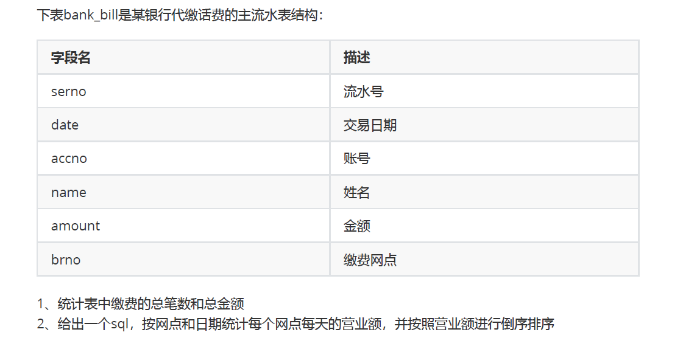

```sql
select count(serno), sum(amount) from bank_bili ;
类似
select count(id),sum(age) from user;
```

```sql

select brno,date,sum(amount) money from bank_bili group by brno,date order by brno,money desc ;

类似
 select sex,age,sum(age) from user group by sex,age order by age desc;
 优化--同一个性别 在一块
  select sex,age,sum(age) from user group by sex,age order by sex,age desc;
```

```sql
+-------+-----+----------+
| sex   | age | sum(age) |
+-------+-----+----------+
| man   |  28 |       28 |
| man   |  27 |       27 |
| man   |  26 |       26 |
| woman |  25 |       25 |
| man   |  25 |       25 |
| woman |  24 |       24 |
+-------+-----+----------+
6 rows in set (0.00 sec)

+-------+-----+----------+
| sex   | age | sum(age) |
+-------+-----+----------+
| man   |  28 |       28 |
| man   |  27 |       27 |
| man   |  26 |       26 |
| man   |  25 |       25 |
| woman |  25 |       25 |
| woman |  24 |       24 |
+-------+-----+----------+
6 rows in set (0.00 sec)
```

## 特别注意-desc歧义

在 SQL 中，`DESC` 有两个常见的含义，具体取决于上下文：

- **`DESC` 表示降序排序**：用于 `ORDER BY`。   ASC 升序
- **`DESC` 表示描述表结构**：用于查看表的定义。


# 单表查询结束

# 连接查询(一)

  


> 在实际的数据库应用中，单表查询无法满足复杂的数据需求，尤其是在符合范式设计的情况下，数据通常会被拆分到多个表中。为了高效地从多个表中获取相关数据，我们需要使用 **连接查询**。
>
> 还得 发起两次  连接

---

## **连接查询的必要性**
- **避免多次查询**：多次查询会导致多次通信，增加网络开销和数据库服务器的处理负担。
- **提高效率**：通过一次查询获取多个表的数据，减少通信次数和处理流程。
- **范式设计的需求**：表拆分后，数据分布在多个表中，连接查询是整合数据的必要手段。

---

## **连接查询的分类**


> 连接查询分为两大类：**内连接** 和 **外连接**。
>
> #### （1）**内连接（INNER JOIN）**
> - **作用**：获取两个表中匹配的数据（交集）。
> - **特点**：只返回两个表中满足连接条件的记录。
> - **示例**：
>   ```sql
>   SELECT students.name, scores.subject, scores.score
>   FROM students
>   INNER JOIN scores ON students.id = scores.student_id;
>   ```
>
> #### （2）**外连接（OUTER JOIN）**
> 外连接又分为三种：
> - **左连接（LEFT JOIN）**：
>   - 返回左表的所有记录，以及右表中与之匹配的记录；如果右表没有匹配的记录，则返回 `NULL`。
>   - **示例**：
>     
>     ```sql
>     SELECT students.name, scores.subject, scores.score
>     FROM students
>     LEFT JOIN scores ON students.id = scores.student_id;
>     ```
>   
> - **右连接（RIGHT JOIN）**：
>   - 返回右表的所有记录，以及左表中与之匹配的记录；如果左表没有匹配的记录，则返回 `NULL`。
>   - **示例**：
>     ```sql
>     SELECT students.name, scores.subject, scores.score
>     FROM students
>     RIGHT JOIN scores ON students.id = scores.student_id;
>     ```
>
> - **全连接（FULL OUTER JOIN）**：
>   - 返回两个表中所有的记录，不管是否匹配；不匹配的部分用 `NULL` 填充。
>   - **注意**：MySQL 不直接支持 `FULL OUTER JOIN`，可以通过 `UNION` 模拟实现。
>

---

## **连接查询的注意事项**
- **表拆分的平衡**：表拆分过多会导致连接查询变得复杂，影响性能。
- **查询效率**：连接查询涉及多个表，可能会增加查询时间，尤其是表数据量较大时。
- **索引优化**：为连接条件的列（如主键、外键）创建索引，可以显著提高查询效率。


# 25-5-11

 

# 连接查询(二)

在数据库设计中，随着表的拆分和范式化设计，数据往往分布在多个表中。为了高效地获取相关数据，我们需要使用 **多表连接查询**。


## **场景描述**


以学生考试系统为例，设计了三张表：
- **学生表（student）**：存储学生的基本信息（如学号、姓名、年龄、性别）。
- **课程表（course）**：存储课程的基本信息（如课程号、课程名称、学分）。
- **考试表（exam）**：存储考试结果（如学生ID、课程ID、考试时间、成绩）。

通过这些表，我们可以实现以下需求：
- 查询某个学生的考试成绩。
- 查询某个学生的详细信息及其考试成绩。
- 查询某门课程的考试成绩及相关学生信息。

> ### 创建表
>
> ```sql
> create table student(
> uid int unsigned primary key  not null auto_increment,
> name varchar(50) not null,
> age tinyint unsigned not null,
> sex enum('M','W') not null
> );
> 
> create table course(
> cid int unsigned primary key  not null auto_increment,
> cname varchar(50) not null,
> credit tinyint unsigned not null
> );
> 
> create table exame(
> uid int unsigned not null ,
> cid int unsigned  not null ,
> time date not null,
> score float not null,
> primary key (uid,cid)
> );
> ```
>
> 
>
> ### 添加数据
>
> ```sql
> insert into student(name, age, sex) values
> ('zhangsan', 18, 'M'),
> ('gaoyang', 20, 'W'),
> ('chenwei', 22, 'M'),
> ('linfeng', 21, 'W'),
> ('liuxiang', 19, 'W');
> 
> insert into course(cname, credit) values
> ('C++基础课程', 5),
> ('C++高级课程', 10),
> ('C++项目开发', 8),
> ('C++算法课程', 12);
> 
> insert into exame(uid, cid, time, score) values
> (1, 1, '2021-04-09', 99.0),
> (1, 2, '2021-04-10', 80.0),
> (1, 3, '2021-04-10', 90.0),
> (2, 2, '2021-04-12', 85.0),
> (3, 1, '2021-04-09', 56.0),
> (3, 2, '2021-04-10', 93.0),
> (3, 3, '2021-04-11', 100.0),
> (4, 4, '2021-04-11', 99.0),
> (5, 2, '2021-04-10', 59.0),
> (5, 3, '2021-04-12', 94.0),
> (5, 4, '2021-04-11', 95.0);
> ```
>
> 
>
> ### 查询
>
> 按照 之前学的 单表查询, 必须知道 uid 和 cid 才能获得 score  ------  **不过, 显然,这是一个 内连接查询**
>
> 显然这样是不行的


## 内连接语法

> 在 SQL 中，**内连接（INNER JOIN）** 是一种用于连接两个或多个表的操作。它会返回两个表中满足连接条件的交集部分，即只有那些在所有参与表中都匹配的记录才会出现在结果集中。
>
> ### 语法：
> ```sql
> SELECT 列名
> FROM 表1
> INNER JOIN 表2
> ON 表1.列名 = 表2.列名;
> ```
>
> ### 关键点：
> 1. ### **INNER JOIN**：指定进行内连接。
> 2. ### **ON**：定义连接条件，通常是两个表中相关联的列。
>
> ### 示例：
> 假设有两个表：
>
> **表1：student**
> | id   | name |
> | ---- | ---- |
> | 1    | 张三 |
> | 2    | 李四 |
> | 3    | 王五 |
>
> **表2：score**
> | student_id | course | score |
> | ---------- | ------ | ----- |
> | 1          | 数学   | 90    |
> | 2          | 英语   | 85    |
> | 4          | 物理   | 88    |
>
> 执行以下内连接查询：
> ```sql
> SELECT student.name, score.course, score.score
> FROM student
> INNER JOIN score
> ON student.id = score.student_id;
> ```
>
> **结果：**
> | name | course | score |
> | ---- | ------ | ----- |
> | 张三 | 数学   | 90    |
> | 李四 | 英语   | 85    |
>
> ### 解释：
> - `student` 表和 `score` 表通过 `student.id = score.student_id` 进行连接。
> - 只有 `student.id` 和 `score.student_id` 匹配的记录会出现在结果中。
> - `王五` 和 `score` 表没有匹配的记录，因此不会出现在结果中。
> - `score` 表中 `student_id = 4` 的记录也没有匹配的学生，因此也被排除。
>
> ### 总结：
> 内连接用于提取两个表中共有的数据，未匹配的记录会被过滤掉。


## 多表连接查询的步骤

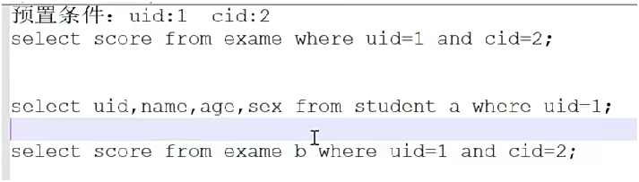

目的 是 合并上面的 两条 sql语句

> ### (1）明确需求
>
> - 确定需要查询的字段。
> - 确定涉及的表及其关系（如主键与外键的关联）。
>
> ### （2）**逐步构建查询**--- 一个 过程
>
> 1. **单表查询**：先从单表中获取需要的数据。
>
>    ```sql
>    SELECT a.uid, a.name, a.age, a.sex 
>                                  
>    FROM student a 
>                                  
>    WHERE a.uid = 1;
>                                  
>    =================
>                                  
>    SELECT c.score 
>                                  
>    FROM exam c 
>                                  
>    WHERE c.uid = 1 AND c.cid = 2;
>    ```
>
>    
>
> 2. **两表连接**：通过主键和外键的关系，将两张表的数据关联起来。
>
>    ```sql
>    SELECT a.name, c.score 
>                                  
>    FROM student a
>                                  
>    INNER JOIN exam c 
>                                  
>    ON a.uid = c.uid
>                                  
>    WHERE a.uid = 1 AND c.cid = 2;
>    ```
>
>    
>
> 3. **多表连接**：在两表连接的基础上，逐步加入其他表的数据。
>
>    ```sql
>    SELECT a.name, b.course_name, c.score
>                                  
>    FROM student a
>                                  
>    INNER JOIN exam c 
>                                  
>    ON a.uid = c.uid
>                                  
>    INNER JOIN course b 
>                                  
>    ON c.cid = b.cid;
>    ```
>
>    
>
> ### （3）**使用别名**
>
> - 为表设置别名，便于区分字段，避免字段名冲突。
>
> - 示例：
>
>   ```sql
>   SELECT a.uid, a.name, a.age, a.sex, b.course_name, c.score
>                       
>   FROM student a
>                       
>   INNER JOIN exam c ON a.uid = c.uid
>                       
>   INNER JOIN course b ON c.cid = b.cid
>                       
>   WHERE a.uid = 1 AND c.cid = 2;
>   ```
>
>   
>
> ### （4）优化查询
>
> - **过滤条件**：通过 `WHERE` 子句过滤不必要的数据，减少查询结果的大小。
> - **索引优化**：为大表的连接字段（如外键）创建索引，提高查询效率。


## 注意理解`ON`--性能问题

> ```sql
> on a.uid=c.uid
> ```
>
> ## 注意
>
> ### 小表 永远是 **全表扫描**
>
> ### 然后 去 大表里 搜索
>
> 对于 **大表** 和 **小表** 的区分，通常是从性能优化的角度来考虑的，尤其是在处理大数据量时。
>
> ### 区分大表和小表的意义
>
> 1. **大表**：通常指记录数较多的表。
> 2. **小表**：通常指记录数较少的表。
>
> 在连接操作中，SQL 优化器会根据表的大小和索引情况决定连接的执行顺序。合理使用 `ON` 子句可以减少数据扫描量，提高查询效率。


## 查询优化的关键点

> #### （1）小表整表扫描，大表索引扫描   
> - 在多表连接中，数据库会优先扫描小表，然后根据小表的连接字段去大表中查找匹配的数据。
> - ### **优化建议**：为**大表**的连接字段创建索引。 小表先查, **第一个from 为小表**(现代mysql会自动优化, 无需关注)
>
> #### （2）减少数据量
> - 使用 `WHERE` 子句过滤数据，减少参与连接的数据量。
> - 示例：
>   ```sql
>   SELECT a.uid, a.name, a.age, a.sex, c.score
>   FROM student a
>   INNER JOIN exame c ON a.uid = c.uid
>   WHERE a.uid = 1 AND c.cid = 2;
>   ```
>
> #### （3）避免过多的表连接
> - 表连接过多会导致查询效率下降，尽量控制表的拆分数量，遵循范式设计的基本原则。
>


# 连接查询(三)

## 区分 内连接和union

> 
>
> ### **内连接（INNER JOIN）**
> - **作用**：将两张或多张表按照某些条件（通常是关联字段）进行连接，返回满足条件的匹配记录。
> - **特点**：
>   
>   - 数据来自多张表。
>   - 需要明确的连接条件（`ON` 或 `USING` 子句）。
>   - 结果只包含匹配的记录，未匹配的记录不会出现在结果中。
> - **示例**：
>   查询学生和他们所选课程的信息：
>   
>   ```sql
>   SELECT students.name, courses.course_name
>   FROM students
>   INNER JOIN enrollments ON students.id = enrollments.student_id
>   INNER JOIN courses ON enrollments.course_id = courses.id;
>   ```
>
> ---
>
> ### **UNION**
> - **作用**：将两个或多个查询的结果合并为一个结果集。
> - **特点**：
>   - 数据来自多个查询的结果集，而不是多张表之间的关联。
>   - 默认去重（使用`UNION ALL`可以保留重复记录）。
>   - 不需要表之间的关联关系，但**要求每个查询的列数和数据类型一致**。
> - **示例**：
>   合并客户表和员工表的用户信息：
>   
>   ```sql
>   SELECT name, email
>   FROM customers
>   UNION
>   SELECT name, email
>   FROM employees;
>   ```
>
> ---
>
> ### **主要区别**
> | 特性         | 内连接（INNER JOIN） | UNION                         |
> | ------------ | -------------------- | ----------------------------- |
> | **用途**     | 关联多张表的数据     | 合并多个查询的结果            |
> | **数据来源** | 多张表               | 多个查询                      |
> | **结果集**   | 满足连接条件的记录   | 合并的结果集                  |
> | **去重**     | 不涉及去重           | 默认去重（`UNION ALL`不去重） |
> | **关联条件** | 需要明确的连接条件   | 不需要关联条件                |
>
> ---
>
> ### **总结**
> - **内连接**：用于表与表之间的关联查询，结果是匹配的记录。
> - **UNION**：用于合并多个查询的结果，结果是并集，默认去重。


## 多表联合

利用 exame 的 联合主键, 连接 两个表

```sql
SELECT a.uid, a.name, a.age, a.sex, b.cname, c.score

FROM student a

INNER JOIN exame c ON a.uid = c.uid

INNER JOIN course b ON c.cid = b.cid      

WHERE a.uid = 1 AND c.cid = 2;      

// c.cid = b.cid   顺序 不重要
```


## 优化注意

> [!warning]
>
> 性能优化的**重点应该放在索引、过滤条件和查询逻辑上**，而**不是表的书写顺序。**


## 添加分组

```sql
select b.cid,b.cname,b.credit
from exame c
inner join course b on c.cid=b.cid;
```

```sql
+-----+-----------------+--------+
|   1 | C++基础课程     |      5 |
|   2 | C++高级课程     |     10 |
|   3 | C++项目开发     |      8 |
|   2 | C++高级课程     |     10 |
|   1 | C++基础课程     |      5 |
|   2 | C++高级课程     |     10 |
|   3 | C++项目开发     |      8 |
|   4 | C++算法课程     |     12 |
|   2 | C++高级课程     |     10 |
|   3 | C++项目开发     |      8 |
|   4 | C++算法课程     |     12 |
+-----+-----------------+--------+
```


```sql
select b.cid,b.cname,b.credit, count(*)
from exame c
inner join course b on c.cid=b.cid
group by c.cid,;   // 最好加上 聚合函数里 所有的字段  b.cid, b.cname, b.credit

```

```sql
+-----+-----------------+--------+----------+
| cid | cname           | credit | count(*) |
+-----+-----------------+--------+----------+
|   1 | C++基础课程     |      5 |        2 |
|   2 | C++高级课程     |     10 |        4 |
|   3 | C++项目开发     |      8 |        3 |
|   4 | C++算法课程     |     12 |        2 |
+-----+-----------------+--------+----------+
```

```sql
select b.cid,b.cname,b.credit, count(*)
from exame c
inner join course b on c.cid=b.cid
where c.score>=90
group by c.cid;
```

```sql
+-----+-----------------+--------+----------+
| cid | cname           | credit | count(*) |
+-----+-----------------+--------+----------+
|   1 | C++基础课程     |      5 |        1 |
|   3 | C++项目开发     |      8 |        3 |
|   2 | C++高级课程     |     10 |        1 |
|   4 | C++算法课程     |     12 |        2 |
+-----+-----------------+--------+----------+
```


```sql
select b.cid,b.cname,b.credit, count(*)
from exame c
inner join course b on c.cid=b.cid
where c.score>=90
group by c.cid
having c.cid=2;
```

```sql
+-----+-----------------+--------+----------+
| cid | cname           | credit | count(*) |
+-----+-----------------+--------+----------+
|   2 | C++高级课程     |     10 |        1 |
+-----+-----------------+--------+----------+
```

## 加排序

```sql
select b.cid,b.cname,b.credit, count(*)
from exame c
inner join course b on c.cid=b.cid
where c.score>=90
group by c.cid
order by c.cid;
```

```sql
+-----+-----------------+--------+----------+
| cid | cname           | credit | count(*) |
+-----+-----------------+--------+----------+
|   1 | C++基础课程     |      5 |        1 |
|   2 | C++高级课程     |     10 |        1 |
|   3 | C++项目开发     |      8 |        3 |
|   4 | C++算法课程     |     12 |        2 |
+-----+-----------------+--------+----------+
```

```sql
select * from (select b.cid,b.cname,b.credit, count(*)
from exame c
inner join course b on c.cid=b.cid
where c.score>=90
group by c.cid
order by c.cid) as mm where cid = 1;
```


## 错误问题

当在 `SELECT` 中选择了普通字段（非聚合字段）并同时使用了聚合函数（如 `COUNT`），**就需要使用 `GROUP BY`**，否则会导致语法错误。

```sql
select b.cid,b.cname,b.credit, count(*)
from exame c
inner join course b on c.cid=b.cid;   // 错误的
```


> 在SQL中，`COUNT(*)` **不一定必须搭配 `GROUP BY`**，但它的行为会根据是否使用 `GROUP BY` 而有所不同：
>
> ### 1. **没有 `GROUP BY` 的情况**
> - 如果没有 `GROUP BY`，`COUNT(*)` 会返回整个结果集中所有行的总数。
> - 示例：
>   ```sql
>   SELECT COUNT(*)
>   FROM exame;
>   ```
>   - 返回的是 `exame` 表中所有行的总数。
>
> ---
>
> ### 2. **有 `GROUP BY` 的情况**
> - 如果使用了 `GROUP BY`，`COUNT(*)` 会对每个分组分别统计行数。
> - 示例：
>   ```sql
>   SELECT c.cid, COUNT(*)
>   FROM exame c
>   GROUP BY c.cid;
>   ```
>   - 返回的是 `exame` 表中每个 `cid` 分组的行数。
>
> ---
>
> ### 3. **你的查询问题**
> 在你的查询中：
> ```sql
> SELECT b.cid, b.cname, b.credit, COUNT(*)
> FROM exame c
> INNER JOIN course b ON c.cid = b.cid
> GROUP BY c.cid;
> ```
> - 这里使用了 `GROUP BY c.cid`，但查询的字段中包含了 `b.cname` 和 `b.credit`，这会导致语法错误。
> - **原因**：在使用 `GROUP BY` 时，`SELECT` 中的非聚合字段（如 `b.cname` 和 `b.credit`）必须出现在 `GROUP BY` 子句中，或者是聚合函数的结果。
>
> ---
>
> ### 4. **修正后的查询**
> 如果你希望按课程分组统计每门课程的考试人数，可以这样写：
> ```sql
> SELECT b.cid, b.cname, b.credit, COUNT(*)
> FROM exame c
> INNER JOIN course b ON c.cid = b.cid
> GROUP BY b.cid, b.cname, b.credit;
> ```
> - 这里将 `b.cid`、`b.cname` 和 `b.credit` 都加入了 `GROUP BY`，以确保语法正确。
>
> ---
>
> ### 5. **总结**
> - **`COUNT(*)` 不一定需要 `GROUP BY`**，但如果你希望按某些字段分组统计，则必须使用 `GROUP BY`。
> - 在使用 `GROUP BY` 时，`SELECT` 中的非聚合字段必须出现在 `GROUP BY` 子句中。
> - **普通字段 + 聚合函数**：需要 `GROUP BY`。
> - **只有聚合函数**：不需要 `GROUP BY`。


# 连接查询(四)

## 内连接在分页查询limit中的优化应用

## 问题背景
- 在大数据量的表中使用 `LIMIT m, n` 进行分页查询时，**偏移量（m）越大，性能越低**。
- 查询的字段越多，偏移的性能开销也会增加。
- 如果无法通过 `WHERE` 条件或索引优化偏移量，直接使用 `LIMIT` 会导致效率低下。

## 性能问题
- **偏移量的影响**：
  - `LIMIT m, n` 会先扫描前 `m` 条记录，然后跳过它们，再返回后续的 `n` 条记录。
  - 偏移量越大，扫描的无用数据越多，性能越差。
- **选择字段的影响**：
  
  - 查询的字段越多，数据量越大，偏移的性能开销也越高。
  - ### **查询单个字段（如主键）比查询多个字段效率更高。**
  
  > 以 t_user 为例
  >
  > ```sql
  > select * from t_user limit 1500000,10;    -- 0.30s
  > select email from t_user limit 1500000,10; -- 0.09s
  > ```
  >
  > ### 当然 也可以可使用 where 优化

---

## 新解决方案-**内连接+临时表**
> 通过 **内连接** 和 **临时表** 优化分页查询：
> 1. **步骤**：
>    - **第一步**：先查询主键（或索引字段）生成一个小表，利用其高效性快速定位偏移范围。
>    - **第二步**：将小表与原表进行内连接，查询所需的完整字段。
> 2. ### **示例**：   --  **得到 多个字段的 同时, 效率 也好了**
>    
>    ```sql
>    select id from t_user limit 1500000,10;   // 优化为
>                                  
>    SELECT a.id, a.email, a.passwd
>    FROM t_user a
>    INNER JOIN (
>        SELECT id
>        FROM t_user
>        LIMIT 1500000, 10
>    ) b ON a.id = b.id;   ---- 0.12s
>    ```
>    - **内层查询**：通过 `LIMIT` 查询主键 `id`，生成一个小表（偏移效率高）。
>    - **外层查询**：通过内连接，利用小表的 `id` 在大表中查询完整字段。
>

---

## **优化效果**-explain

```sql
| id | select_type | table      | partitions | type   | possible_keys | key     | key_len | ref  | rows    | filtered | Extra       |
+----+-------------+------------+------------+--------+---------------+---------+---------+------+---------+----------+-------------+
|  1 | PRIMARY     | <derived2> | NULL       | ALL    | NULL          | NULL    | NULL    | NULL | 1500010 |   100.00 | NULL        |
|  1 | PRIMARY     | a          | NULL       | eq_ref | PRIMARY       | PRIMARY | 4       | b.id |       1 |   100.00 | NULL        |
|  2 | DERIVED     | t_user     | NULL       | index  | NULL          | PRIMARY | 4       | NULL | 1880672 |   100.00 | Using index 
```


> 解释 上面explain---了解即可,不用深究
>
> ### **1. 第一行**
> | **字段**        | **值**       | **解释**                                                 |
> | --------------- | ------------ | -------------------------------------------------------- |
> | `id`            | `1`          | 查询的步骤编号，`PRIMARY` 表示这是外层查询。             |
> | `select_type`   | `PRIMARY`    | 主查询（外层查询）。                                     |
> | `table`         | `<derived2>` | 表示这是一个派生表（子查询的结果作为临时表）。           |
> | `partitions`    | `NULL`       | 没有使用分区表。                                         |
> | `type`          | `ALL`        | 对派生表执行全表扫描（因为派生表是小表，扫描开销较小）。 |
> | `possible_keys` | `NULL`       | 没有可用的索引，因为派生表是临时生成的，没有索引。       |
> | `key`           | `NULL`       | 没有使用索引。                                           |
> | `key_len`       | `NULL`       | 没有索引长度，因为没有使用索引。                         |
> | `ref`           | `NULL`       | 没有引用其他表。                                         |
> | `rows`          | `1500010`    | 预计扫描派生表中的 1,500,010 行记录。                    |
> | `filtered`      | `100.00`     | 过滤比例为 100%，表示所有行都被保留。                    |
> | `Extra`         | `NULL`       | 没有额外信息。                                           |
>
> **总结**：  
> 外层查询从派生表 `<derived2>` 中扫描所有行（1,500,010 行），这是子查询生成的小表。
>
> ---
>
> ### **2. 第二行**
> | **字段**        | **值**    | **解释**                                               |
> | --------------- | --------- | ------------------------------------------------------ |
> | `id`            | `1`       | 查询的步骤编号，与第一行同属外层查询。                 |
> | `select_type`   | `PRIMARY` | 主查询（外层查询）。                                   |
> | `table`         | `a`       | 表 `a`，即主表 `t_user`。                              |
> | `partitions`    | `NULL`    | 没有使用分区表。                                       |
> | `type`          | `eq_ref`  | 使用了等值引用连接（`eq_ref`），表示通过主键精确匹配。 |
> | `possible_keys` | `PRIMARY` | 可能使用的索引是主键索引。                             |
> | `key`           | `PRIMARY` | 实际使用的索引是主键索引。                             |
> | `key_len`       | `4`       | 主键索引的长度为 4 字节（通常是 `INT` 类型）。         |
> | `ref`           | `b.id`    | 使用派生表 `b` 的 `id` 字段与主表 `a` 的主键进行匹配。 |
> | `rows`          | `1`       | 每次匹配只需扫描 1 行（因为主键是唯一的）。            |
> | `filtered`      | `100.00`  | 过滤比例为 100%，表示所有匹配的行都被保留。            |
> | `Extra`         | `NULL`    | 没有额外信息。                                         |
>
> **总结**：  
> 外层查询通过主键索引（`PRIMARY`）将派生表中的 `id` 与主表 `t_user` 的主键进行精确匹配，每次只需扫描 1 行。
>
> ---
>
> ### **3. 第三行**
> | **字段**        | **值**        | **解释**                                                    |
> | --------------- | ------------- | ----------------------------------------------------------- |
> | `id`            | `2`           | 查询的步骤编号，`DERIVED` 表示这是子查询的执行步骤。        |
> | `select_type`   | `DERIVED`     | 子查询（派生表）。                                          |
> | `table`         | `t_user`      | 表 `t_user`，即主表。                                       |
> | `partitions`    | `NULL`        | 没有使用分区表。                                            |
> | `type`          | `index`       | 使用了索引扫描（`index`），表示扫描索引而不是表数据。       |
> | `possible_keys` | `NULL`        | 没有明确指定的索引，但使用了主键索引。                      |
> | `key`           | `PRIMARY`     | 实际使用的索引是主键索引。                                  |
> | `key_len`       | `4`           | 主键索引的长度为 4 字节（通常是 `INT` 类型）。              |
> | `ref`           | `NULL`        | 没有引用其他表。                                            |
> | `rows`          | `1880672`     | 预计扫描 `t_user` 表中的 1,880,672 行记录（即表的总行数）。 |
> | `filtered`      | `100.00`      | 过滤比例为 100%，表示所有行都被保留。                       |
> | `Extra`         | `Using index` | 表示查询只使用了索引，不需要访问表的实际数据（覆盖索引）。  |
>
> **总结**：  
> 子查询从 `t_user` 表中扫描主键索引，生成一个包含 `id` 的派生表，扫描了 1,880,672 行。
>
> ---
>
> ### **整体总结**
> 1. **查询逻辑**：
>    - 子查询（`DERIVED`）从 `t_user` 表中扫描主键索引，生成一个包含 `id` 的派生表（小表）。
>    - 外层查询通过内连接，将派生表的 `id` 与主表的主键进行匹配，查询完整字段。
>
> 2. **性能分析**：
>    - 子查询使用了主键索引（`Using index`），效率较高。
>    - 外层查询通过主键索引（`eq_ref`）进行精确匹配，效率也较高。
>    - 派生表的扫描（`ALL`）是全表扫描，但由于派生表很小（10 行），开销可以忽略。
>
> 3. **优化建议**：
>    - 该查询已经充分利用了索引，性能较优，无需进一步优化。
>    - 如果数据量更大，可以考虑进一步优化索引或分区策略。

- **小表的优势**：
  
  - 内层查询只返回主键字段，数据量小，查询效率高。
  - 小表的结果作为临时表，与大表进行连接时，主键字段通常有索引，查询效率高。
- ### **性能提升**：
  
  - ### 避免直接对大表进行多字段的偏移查询。
  - ### 将偏移查询的开销降到最低，同时保留完整字段的查询结果。


# 目前 优化性能的手段

- **索引**：快速定位数据。
- **WHERE**：减少数据扫描量。
- **LIMIT**：限制结果集大小。
- **INNER JOIN**：优化多表查询。  + **临时表 可以优化 单表**
- **ORDER BY / GROUP BY**：结合索引优化排序和分组。
- **子查询与表设计**：简化查询逻辑，优化数据结构。


# 连接查询(五)


## 内连接与外连接的执行原理与对比

---

## 内连接（INNER JOIN）-- 明白过程细节-**重点**
- **核心概念**：
  
  - 内连接只**返回两张表中满足关联条件**的记录。
  - 查询结果是两张表**交集部分的数据**。
  
- **执行过程**：
  1. ### 区分大表和小表：
    
     - 小表通常是**整表扫描**。
     - 小表的字段在大表中进行**匹配搜索**。
  2. ### 如果有 `WHERE` 条件：
    
     - ### **优先对表进行 `WHERE` 条件过滤**，减少数据量。
     - ### **过滤后**的表可能**会改变大表和小表的角色**。
  3. 使用索引：
     - ### 索引的使用与 `WHERE` 条件的字段相关，**与 `SELECT` 的字段无关**。
     
       - 索引主要是为了快速定位数据，而不是为了获取数据
       - 数据库引擎使用索引来快速找到满足WHERE条件的行
     - 大表使用索引效率更高。
  
- **注意点**：
  - ### `WHERE` 和 `ON` 的过滤条件在内连接中效果相同。
  - 使用 `EXPLAIN` 可以查看执行计划，分析索引是否被使用。

---

## 外连接（LEFT JOIN 和 RIGHT JOIN）
- **核心概念**：
  - **左连接（LEFT JOIN）**：
    - 返回左表的所有记录，即使右表中没有匹配的记录。
  - **右连接（RIGHT JOIN）**：
    - 返回右表的所有记录，即使左表中没有匹配的记录。

- **与内连接的区别**：
  - ### 内连接只返回匹配的记录，而**外连接会保留一侧表的所有记录**。
  - ### 外连接的结果中，未匹配的记录会以 `NULL` 填充。


## where与on性能问题实践

> 在 student 新增一个 学生, 成绩表 将 没有其信息
>
> ```sql
> insert into student(name,age,sex) values('xing huai', 25, 'M');
> ```
>
>  
>
> ```sql
> select a.*, b.* from student a inner join exame b on a.uid=b.uid;
> ```
>
> ```sql
> select a.*, b.* from student a inner join exame b on a.uid=b.uid where b.uid=3;
> select a.*, b.* from student a inner join exame b on a.uid=b.uid and b.uid=3;
> ```
>
> 在老师的 5.1 版本中, 会显示  `using where` 但是, 在 高版本, 都会显示 `NULL`, 
>
> - 在较新的版本中，优化器可能会更智能地将 `WHERE` 条件合并到索引查找中，从而减少 `EXTRA` 列中显示 `Using where` 的情况。


---

## 索引的使用
- **索引的作用**： 
  - 索引可以显著提高查询效率，尤其是在大表中。
  - 索引的使用与过滤字段相关，**必须是索引字段才能生效**。

- **联合索引的注意点**：
  - 联合索引的第一列必须被使用，否则索引无法生效。


# 连接查询(六)

## 外连接实现方式：

LEFT/RIGHT OUTER JOIN---------OUTER 一般省略, 无序显示

- 使用`LEFT JOIN`或`RIGHT JOIN`结合`WHERE`条件判断`NULL`值。

- 示例：

  ```sql
  select a.*,b.* from student a left join exame b on a.uid=b.uid;
  ```

  ```sql
  +-----+-----------+-----+-----+------+------+------------+-------+
  | uid | name      | age | sex | uid  | cid  | time       | score |
  +-----+-----------+-----+-----+------+------+------------+-------+
  |   1 | zhangsan  |  18 | M   |    1 |    1 | 2021-04-09 |    99 |
  |   1 | zhangsan  |  18 | M   |    1 |    2 | 2021-04-10 |    80 |
  |   1 | zhangsan  |  18 | M   |    1 |    3 | 2021-04-10 |    90 |
  |   2 | gaoyang   |  20 | W   |    2 |    2 | 2021-04-12 |    85 |
  |   3 | chenwei   |  22 | M   |    3 |    1 | 2021-04-09 |    56 |
  |   3 | chenwei   |  22 | M   |    3 |    2 | 2021-04-10 |    93 |
  |   3 | chenwei   |  22 | M   |    3 |    3 | 2021-04-11 |   100 |
  |   4 | linfeng   |  21 | W   |    4 |    4 | 2021-04-11 |    99 |
  |   5 | liuxiang  |  19 | W   |    5 |    2 | 2021-04-10 |    59 |
  |   5 | liuxiang  |  19 | W   |    5 |    3 | 2021-04-12 |    94 |
  |   5 | liuxiang  |  19 | W   |    5 |    4 | 2021-04-11 |    95 |
  |   6 | xing huai |  25 | M   | NULL | NULL | NULL       |  NULL |
  ```

  ```sql
  // 对比 内连接
  select a.*,b.* from student a inner join exame b on a.uid=b.uid;
  +-----+----------+-----+-----+-----+-----+------------+-------+
  | uid | name     | age | sex | uid | cid | time       | score |
  +-----+----------+-----+-----+-----+-----+------------+-------+
  |   1 | zhangsan |  18 | M   |   1 |   1 | 2021-04-09 |    99 |
  |   1 | zhangsan |  18 | M   |   1 |   2 | 2021-04-10 |    80 |
  |   1 | zhangsan |  18 | M   |   1 |   3 | 2021-04-10 |    90 |
  |   2 | gaoyang  |  20 | W   |   2 |   2 | 2021-04-12 |    85 |
  |   3 | chenwei  |  22 | M   |   3 |   1 | 2021-04-09 |    56 |
  |   3 | chenwei  |  22 | M   |   3 |   2 | 2021-04-10 |    93 |
  |   3 | chenwei  |  22 | M   |   3 |   3 | 2021-04-11 |   100 |
  |   4 | linfeng  |  21 | W   |   4 |   4 | 2021-04-11 |    99 |
  |   5 | liuxiang |  19 | W   |   5 |   2 | 2021-04-10 |    59 |
  |   5 | liuxiang |  19 | W   |   5 |   3 | 2021-04-12 |    94 |
  |   5 | liuxiang |  19 | W   |   5 |   4 | 2021-04-11 |    95 |
  +-----+----------+-----+-----+-----+-----+------------+-------+
  ```

  ### 上述查询可以 找出没有参加考试的学生。 

## 执行计划分析：

- 使用`EXPLAIN`查看查询的执行过程。

- ### **不区分 大小表**

- 外连接的执行顺序：

  - ### 左连接：先扫描左表，再匹配右表。

  - ### 右连接：先扫描右表，再匹配左表。

- 左右表的区分取决于`LEFT JOIN`或`RIGHT JOIN`的语法位置。


## 内连接与外连接的对比  
| 特性           | 内连接（INNER JOIN） | 外连接（LEFT JOIN / RIGHT JOIN）     |
| -------------- | -------------------- | ------------------------------------ |
| **结果集**     | 只返回匹配的记录     | 返回匹配记录，并保留一侧表的所有记录 |
| **未匹配记录** | 不包含               | 以 `NULL` 填充未匹配记录             |
| **应用场景**   | 查询两表关联数据     | 查询一表的完整数据，并补充关联信息   |
| **性能**       | 通常更快             | 可能稍慢，因为需要保留未匹配记录     |


## 与子查询的对比：

- 子查询（如`NOT IN`）也可以实现类似功能，但可能会有性能问题：

  - `NOT IN`**通常**无法利用索引，效率较低。

  - ### 子查询可能**会生成中间表**，增加开销。

- 外连接通常效率更高，推荐使用。


## 关于not in示例

```sql
select * from student where uid not in (select distinct uid from exame);
```

`select distinct uid from exame`  ===>  会产生中间表 存储结果 供外面的 sql来查询

not in 对 索引命中率不高 ===>  **但是 select 后面字段, 也影响 是否用到索引**--细节太多,不深究


## 关于子查询能否用到索引?-索引命中困难

> [!warning]
>
> ### **非常 难以确定!!不深究**

> 在 MySQL 中，`NOT IN` 通常无法利用索引的原因主要与其工作原理有关，但在某些特定情况下，`NOT IN` 也可以利用索引。
>
> ### 1. **`NOT IN` 通常无法利用索引的原因**
> - **全表扫描**：`NOT IN` 的逻辑是检查某个值是否不在一个列表中。为了确保结果的准确性，MySQL 通常需要扫描整个表来验证每个值是否不在列表中。
> - **`NULL` 的影响**：如果子查询返回的结果中包含 `NULL` 值，`NOT IN` 的行为会变得复杂，因为任何与 `NULL` 相关的比较都会返回 `UNKNOWN`。为了处理这种情况，MySQL 可能会放弃使用索引，改为全表扫描。
> - **优化器的限制**：MySQL 的查询优化器在处理 `NOT IN` 时，可能无法有效地将其转换为可以利用索引的操作。
>
> ### 2. **`NOT IN` 可以利用索引的情况**
> - **子查询结果不包含 `NULL`**：如果可以确保子查询的结果集中没有 `NULL` 值，`NOT IN` 有可能利用索引。例如：
>   
>   ```sql
>   SELECT * 
>   FROM student 
>   WHERE UID NOT IN (SELECT UID FROM exame WHERE UID IS NOT NULL);
>   ```
>   在这种情况下，`UID IS NOT NULL` 确保了子查询结果中没有 `NULL`，因此 MySQL 可能会使用索引。
>   
> - **静态列表**：如果 `NOT IN` 的比较对象是一个静态列表，而不是子查询，MySQL 可以更高效地处理。例如：
>   
>   ```sql
>   SELECT * 
>   FROM student 
>   WHERE UID NOT IN (1, 2, 3);
>   ```
>   对于静态列表，MySQL 可以直接利用索引进行优化。
>
> ### 3. **替代方案**
> 为了提高查询性能，通常建议使用以下替代方案：
>
> - **`LEFT JOIN` + `IS NULL`**：
>   
>   ```sql
>   SELECT a.* 
>   FROM student a
>   LEFT JOIN exam b ON a.UID = b.UID
>   WHERE b.UID IS NULL;
>   ```
>   这种方式通常比 `NOT IN` 更高效，因为它可以更好地利用索引。
>   
> - **`NOT EXISTS`**：
>   ```sql
>   SELECT * 
>   FROM student a
>   WHERE NOT EXISTS (
>       SELECT 1 
>       FROM exam b 
>       WHERE a.UID = b.UID
>   );
>   ```
>   `NOT EXISTS` 通常比 `NOT IN` 更高效，尤其是在子查询中可能包含 `NULL` 的情况下。
>
> ### 4. **总结**
> - `NOT IN` 通常无法利用索引，尤其是当子查询结果中可能包含 `NULL` 时。
> - 如果可以确保子查询结果中没有 `NULL`，或者使用静态列表，`NOT IN` 有可能利用索引。
> - 推荐使用 `LEFT JOIN` 或 `NOT EXISTS` 替代 `NOT IN`，以提高查询性能并避免潜在问题。


## 使用外连接替代子查询,优化-**重点**

```sql
select * from student where uid not in (select distinct uid from exame);  // not in
```

```sql
+-----+-----------+-----+-----+
| uid | name      | age | sex |
+-----+-----------+-----+-----+
|   6 | xing huai |  25 | M   |
+-----+-----------+-----+-----+
```

- ### **对比**

```sql
select a.* from student a left join exame b on a.uid=b.uid where b.cid is null;
```

```sql
+-----+-----------+-----+-----+------+------+------+-------+
| uid | name      | age | sex | uid  | cid  | time | score |
+-----+-----------+-----+-----+------+------+------+-------+
|   6 | xing huai |  25 | M   | NULL | NULL | NULL |  NULL |
+-----+-----------+-----+-----+------+------+------+-------+
```

```sql
+----+-------------+-------+------------+------+---------------+------+---------+------+------+----------+--------------------------------------------------------+
| id | select_type | table | partitions | type | possible_keys | key  | key_len | ref  | rows | filtered | Extra                                                  |
+----+-------------+-------+------------+------+---------------+------+---------+------+------+----------+--------------------------------------------------------+
|  1 | SIMPLE      | a     | NULL       | ALL  | NULL          | NULL | NULL    | NULL |    6 |   100.00 | NULL                                                   |
|  1 | SIMPLE      | b     | NULL       | ALL  | PRIMARY       | NULL | NULL    | NULL |   11 |    10.00 | Using where; Not exists; Using join buffer (hash join) |
+----+-------------+-------+------------+------+---------------+------+---------+------+------+----------+--------------------------------------------------------+
```

- ### **select对比**----影响 查询效率, 看type

```sql
select a.* from student a left join exame b on a.uid=b.uid where b.cid is null
```

```sql
+-----+-----------+-----+-----+
| uid | name      | age | sex |
+-----+-----------+-----+-----+
|   6 | xing huai |  25 | M   |
+-----+-----------+-----+-----+
```

```sql
+----+-------------+-------+------------+------+---------------+---------+---------+------------+------+----------+--------------------------------------+
| id | select_type | table | partitions | type | possible_keys | key     | key_len | ref        | rows | filtered | Extra                                |
+----+-------------+-------+------------+------+---------------+---------+---------+------------+------+----------+--------------------------------------+
|  1 | SIMPLE      | a     | NULL       | ALL  | NULL          | NULL    | NULL    | NULL       |    6 |   100.00 | NULL                                 |
|  1 | SIMPLE      | b     | NULL       | ref  | PRIMARY       | PRIMARY | 4       | test.a.uid |    2 |    10.00 | Using where; Not exists; Using index |
+----+-------------+-------+------------+------+---------------+---------+---------+------------+------+----------+--------------------------------------+
```


# 连接查询(七)


## 内连接与外连接的区别
- **内连接（Inner Join）**：
  - 只返回两张表中匹配的数据（交集）。
  - 过滤条件写在 `ON` 或 `WHERE` 后效果相同，最终都会被 MySQL 优化器转化为 `WHERE` 过滤。--5.1版本
- **外连接（Outer Join）**：
  - 包括左连接（Left Join）和右连接（Right Join）。
  - 左连接：以左表为主，显示左表的所有数据，右表中没有匹配的数据则显示 `NULL`。
  - 右连接：以右表为主，显示右表的所有数据，左表中没有匹配的数据则显示 `NULL`。

## 外连接中过滤条件的位置
- **`ON` 后的条件**：
  - 用于指定连接条件和过滤条件。
  - 在外连接中，`ON` 后的条件会影响连接的结果集，决定哪些数据会被保留。
  
- **`WHERE` 后的条件**：
  - 用于对连接后的结果集进行过滤。
  - 在外连接中，如果将过滤条件写在 `WHERE` 后，会导致外连接的结果被进一步过滤，可能使外连接的行为变成内连接。

## 本节示例

之前是 获取 没有参加 考试的 人

- **现在需求**：查找没有参加课程号为 3 的考试的学生信息。

- **写法思考**：

  ```sql
  内连接 找 参加了 3 的 学生
  select a.* from student a inner join exame b on a.uid=b.uid where b.cid=3;
  ```

  外连接 找 没有参加的学生信息

  ```sql
  select a.* from student a left join exame b on a.uid=b.uid where b.cid=3 and b.cid IS NULL;  // 错的
  select a.* from student a left join exame b on a.uid=b.uid where b.cid=3;  // 和内联结果一样, 并没有显示全部的 a 表
  ```

  - 显然 这两种都是 有问题的, 为什么?

## 外连接中**条件位置**的影响-**重点**

> [!important]
>
> ### **外连接 的 where 和 on 是有区别的**

- ### **过滤条件写在 `WHERE` 后**：
  
  - 如果在外连接中将过滤条件写在 `WHERE` 后，**外连接的结果会被过滤，可能导致结果与内连接一致**。
  - 示例：
    ```sql
    SELECT a.*
    FROM student a
    LEFT JOIN exam b ON a.UID = b.UID
    WHERE b.cid = 3;
    ```
    - 结果：只返回匹配 `b.cid = 3` 的数据，外连接的特性被破坏，结果与内连接一致。
  
- ### **过滤条件写在 `ON` 后**：
  
  - 如果将过滤条件写在 `ON` 后，**外连接的特性得以保留**。
  - 示例：
    ```sql
    SELECT a.*
    FROM student a
    LEFT JOIN exam b ON a.UID = b.UID AND b.cid = 3;
    ```
    - 结果：左表的所有数据都会保留，右表中不匹配 `b.cid = 3` 的数据会显示为 `NULL`。


## 执行计划分析（EXPLAIN)
- ### **过滤条件在 `WHERE` 后**：
  
  - MySQL 会先对右表进行过滤，然后再进行连接，结果与内连接一致。
  
  - ### type 第一个都将是 index, 而不是 all
  
- ### **过滤条件在 `ON` 后**：
  
  - MySQL 会先扫描左表（整表扫描），然后根据 `ON` 条件进行连接，保留左表的所有数据。
  
  - ### type 第一个是 all


## 正确写法

```sql
select a.*,b.* from student a left join exame b on a.uid=b.uid and b.cid=3;  // 将拿到 正确的 外连接表
```

```sql
+-----+-----------+-----+-----+------+------+------------+-------+
| uid | name      | age | sex | uid  | cid  | time       | score |
+-----+-----------+-----+-----+------+------+------------+-------+
|   1 | zhangsan  |  18 | M   |    1 |    3 | 2021-04-10 |    90 |
|   2 | gaoyang   |  20 | W   | NULL | NULL | NULL       |  NULL |
|   3 | chenwei   |  22 | M   |    3 |    3 | 2021-04-11 |   100 |
|   4 | linfeng   |  21 | W   | NULL | NULL | NULL       |  NULL |
|   5 | liuxiang  |  19 | W   |    5 |    3 | 2021-04-12 |    94 |
|   6 | xing huai |  25 | M   | NULL | NULL | NULL       |  NULL |
+-----+-----------+-----+-----+------+------+------------+-------+
```

在此基础上, 再进行过滤

```sql
select a.*,b.* from student a left join exame b on a.uid=b.uid and b.cid=3 where b.cid is null; // 正确
```

```sql
+-----+-----------+-----+-----+------+------+------+-------+
| uid | name      | age | sex | uid  | cid  | time | score |
+-----+-----------+-----+-----+------+------+------+-------+
|   2 | gaoyang   |  20 | W   | NULL | NULL | NULL |  NULL |
|   4 | linfeng   |  21 | W   | NULL | NULL | NULL |  NULL |
|   6 | xing huai |  25 | M   | NULL | NULL | NULL |  NULL |
+-----+-----------+-----+-----+------+------+------+-------+
```


## 本节重点

区分 下面 的命令

```sql
select a.* from student a left join exame b on a.uid=b.uid where b.cid=3 and b.cid IS NULL;  // 错的

select a.* from student a left join exame b on a.uid=b.uid where b.cid=3;  // 和内联结果一样, 并没有显示全部的 a 表

select a.*,b.* from student a left join exame b on a.uid=b.uid and b.cid=3 where b.cid is null; 
```

> [!tip]
>
> 第一条命令: 会在 `select a.* from student a left join exame b on a.uid=b.uid` 的结果里, 查找 `b.cid=3 and b.cid IS NULL`的 结果 并显示-----> 显然, 后面的 逻辑有误
>
> 第二条命令: 在 `select a.* from student a left join exame b on a.uid=b.uid` 的结果里, 查找 `b.cid=3`的结果 并显示 , 这个意思 是 找到 参与 3 这门考试的, 和内联意思一样
>
> 第三条命令: 在 `select a.*,b.* from student a left join exame b on a.uid=b.uid and b.cid=3 ` 的结果里, 找 `b.cid is null`的 结果 并显示,  这就找到了 没有参加 考试 3的 学生信息

## 注意事项
- 在外连接中，**过滤条件的位置非常重要**：
  - ### `ON` 后：用于连接时的条件过滤。
  - ### `WHERE` 后：用于最终结果的过滤。
- 如果过滤条件写错位置，**可能导致外连接的行为变成内连接**。

---

## 建议
- **外连接的写法**：
  - `ON` 后只写连接条件和过滤条件。
  - `WHERE` 后只写 `NULL` 判断，用于筛选不存在的数据。
- **多练习**：
  
  - 通过实践和 `EXPLAIN` 分析执行计划，理解查询的执行过程。
- **应用场景**：
  
  - ### **外连接常用于查找一张表中有而另一张表中没有的数据**，
  
  - 例如：
    
    - 查找没有参加某门考试的学生。
    - 查找未出现在订单中的商品。


# 存储引擎-pdf


## 存储引擎的概念  

- 存储引擎决定了**表的结构、数据和索引**的**存储方式**。
- MySQL的特点之一是**支持插件式存储引擎**，可以更换不同的存储引擎。

## 存储引擎的作用  

- 存储表的结构（字段、类型、约束等）。
- 存储表的数据（记录）。
- 存储表的索引（加速查询）。

## 常见存储引擎 

```sql
show engines;   // 有详细信息
```

> - **InnoDB**（默认引擎）：
>   - 数据和索引存储在同一个文件中（`.ibd`）。
>   - 支持事务（ACID）。
>   - 支持行级锁（Row Level Locking），并发性能更好。
>   - 支持外键。
> - **MyISAM**：
>   - 数据和索引分开存储（`.MYD`存数据，`.MYI`存索引）。
>   - 不支持事务。
>   - 使用表级锁（Table Level Locking），并发性能较差。
>   - 不支持外键。


> [!warning]
>
> 注意:  **8.0版本, InnoDB引擎 ** 已经没有 frm 只有idb
>
> **新建数据库 在 /var/lib/mysql中**  的 **<数据库名>/<表名>.idb** 里面

- 表的元数据（如表结构定义）不再存储在 `.frm` 文件中，而是存储在 **数据字典** 中。
- 数据字典是 InnoDB 的一部分，存储在系统表空间中（`ibdata1` 文件）。

## 存储引擎的区别 

> - ### **数据存储方式**：
>   
>   - #### InnoDB：**数据和索引存储在一起。**---- .idb
>   
>     - ```sql
>       course.ibd  exame.ibd  student.ibd  t_user.ibd  user.ibd
>       ```
>   
>       - ~~`.frm`：表结构。~~
>       - `.ibd`：表数据和索引。
>   - MyISAM：数据和索引**分开存储**。
>   
>     - 如果没有, 建立一个, 看看
>   
>     - ```sql
>       student.MYD  student.MYI  student_568.sdi
>       ```
>   
>       - ~~`.frm`：表结构。~~
>       - `.MYD`：表数据。D
>       - `.MYI`：表索引。I
> - > ### 
>   >
>   > - ### **锁机制**：--多线程 查时  --- pdf
>   >
>   >   - InnoDB：行级锁，支持高并发。
>   >   - MyISAM：**表级锁**，锁粒度大，性能较低。
>   >
>   > - ### **事务支持**：
>   >
>   >   - InnoDB：支持事务。
>   >   - MyISAM：不支持事务。
>   >
>   > - ### **外键支持**：
>   >
>   >   - InnoDB：支持外键。
>   >   - MyISAM：不支持外键。

## 面试常见问题  

> - ### 常见存储引擎?-- 就说 那两
> - ### 存储引擎的作用是什么？
> - ### InnoDB和MyISAM的区别？
> - ### 为什么InnoDB会自动生成主键？
>   
>   - 因为InnoDB的数据存储在索引树上,存在一起，没有主键无法存储数据。
> - ### 为什么MyISAM不会自动生成主键？
>   
>   - 因为MyISAM的数据和索引**分开存储**，主键不是必须的。
>   
> - 回答问题时聚焦重点（如InnoDB和MyISAM）。
>   
> - 结合存储引擎的特点，**引申到索引、事务、锁机制等相关知识**。
>
> - 避免回答过多不熟悉的内容，避免挖坑。

## 其他存储引擎--不重要

面试 不说这两个  

- **Memory**：基于内存的存储引擎，速度快，但数据断电丢失。
- **CSV**：以CSV文件形式存储数据，适合简单的数据交换。

## 性能优化相关  

- ### **缓存机制**：
  
  > - ### 索引缓存和数据缓存可以提升查询性能。
  >
  > - **索引缓存**：主要用于加速索引的查找操作，减少磁盘 I/O。
  >
  > - **数据缓存**：主要用于加速数据的读取和写入操作，减少磁盘 I/O。
  >
  > - **InnoDB**：通过缓冲池统一管理索引和数据的缓存。
  >
  > - **MyISAM**：仅支持索引缓存，不支持数据缓存。
- **锁机制**：
  
  - 行锁（InnoDB）更适合**高并发**场景。
  - 表锁（MyISAM）适合简单查询场景。


## 补充-索引缓存,数据缓存

> ### **索引缓存与数据缓存的简述**
>
> ---
>
> ### **1. 索引缓存（Index Cache）**
> - **定义**：索引缓存是指将索引数据加载到内存中，以加速索引的查找和查询操作。
> - **作用**：
>   - 提高索引的访问速度，减少磁盘 I/O。
>   - 在查询时，优先从内存中读取索引，而不是每次都从磁盘加载。
> - **实现方式**：
>   - **InnoDB**：索引缓存是 InnoDB 缓冲池（Buffer Pool）的一部分，存储 B+ 树索引的节点。
>   - **MyISAM**：通过 `key_buffer_size` 参数配置索引缓存，用于缓存 `.MYI` 文件中的索引。
> - **相关参数**：
>   - **InnoDB**：`innodb_buffer_pool_size`（缓冲池大小，包含索引和数据）。
>   - **MyISAM**：`key_buffer_size`（仅用于索引缓存）。
>
> ---
>
> ### **2. 数据缓存（Data Cache）**
> - **定义**：数据缓存是指将表中的数据页加载到内存中，以加速数据的读取和写入操作。
> - **作用**：
>   - 提高数据访问速度，减少磁盘 I/O。
>   - 在查询或更新数据时，优先从内存中读取或写入，而不是直接操作磁盘。
> - **实现方式**：
>   - **InnoDB**：数据缓存也是缓冲池的一部分，存储表的数据页。
>   - **MyISAM**：MyISAM 不支持数据缓存，数据直接从磁盘读取。
> - **相关参数**：
>   - **InnoDB**：`innodb_buffer_pool_size`（缓冲池大小，包含索引和数据）。
>
> ---
>
> ### **3. 区别**
> | **特性**     | **索引缓存**                | **数据缓存**                        |
> | ------------ | --------------------------- | ----------------------------------- |
> | **作用对象** | 索引数据（如 B+ 树节点）    | 表中的实际数据页                    |
> | **适用引擎** | InnoDB 和 MyISAM            | 仅 InnoDB                           |
> | **配置参数** | `key_buffer_size`（MyISAM） | `innodb_buffer_pool_size`（InnoDB） |
> | **存储位置** | 内存                        | 内存                                |
>
> ---
>
> ### **4. 总结**
> - **索引缓存**：主要用于加速索引的查找操作，减少磁盘 I/O。
> - **数据缓存**：主要用于加速数据的读取和写入操作，减少磁盘 I/O。
> - **InnoDB**：通过缓冲池统一管理索引和数据的缓存。
> - **MyISAM**：仅支持索引缓存，不支持数据缓存。


## 锁的内容也很多-后面有


# 25-05-12

# 索引(一)-pdf

## 索引的核心概念  

- 索引是关系型数据库中提高查询效率的核心工具。
- 数据量较大时（几十万、上百万甚至上千万），没有索引的查询会导致业务耗时过长，影响并发性能。

## 索引的作用  

- 提高查询速度和效率。
- 索引本质上是一个数据结构（如B+树）。

## 索引的存储  

- 不同存储引擎的索引存储方式不同：
  - MyISAM：数据和索引分开存储。
  - InnoDB：数据和索引存储在一起（索引树上）。

## 索引的底层实现-why?

- 常见存储引擎（如 MyISAM 和 InnoDB）使用 **B+树**作为索引结构。
- **哈希索引**仅在特定存储引擎（如 Memory）中支持


## 索引的使用注意事项  

- 索引**并非越多越好**，过多的索引会**增加磁盘IO**，降低性能。--- **索引也需要 存储为 索引文件**
- 索引的维护（如插入、删除、更新数据）也会涉及磁盘IO操作。
- 一次SQL查询只能使用一个索引。
- 多列索引必须使用第一列才能生效。


## 索引的分类  

- ### **物理分类**：

  - 聚集索引（Clustered Index）。
  - 非聚集索引（Non-Clustered Index）。

- ### **逻辑分类**：

  - 普通索引（Secondary Index）。-- (创建新表&已创建表，数量是不限的，**一张表的一次sql查询只能用一个索引** where a=1 and b='M')

    - 看 where 后面的, 不是 select后面,  看过滤字段

  - 唯一索引（Unique Index）。--**使用UNIQUE修饰的字段，值不能够重复，主键索引就隶属于唯一性索引**

  - 主键索引（Primary Key Index）。-- **使用Primary Key修饰的字段会自动创建索引(MyISAM(因为分开, 不是主键不加索引), InnoDB(因为不分开, 不加主键, 也会自动加索引))**

  - 单列索引：在单个字段上创建索引。

  - **多列索引（联合索引）**：--在表的多个字段上创建索引 (uid+cid，***多列索引必须使用到第一个列***，才能用到多列索
    引，否则索引用不上)

  - 全文索引（Full-Text Index）。-- 主要用于字符串搜索（如MyISAM支持） -- 使用少

    > - 使用`FULLTEXT`参数可以设置全文索引
    >
    > - **只支持**CHAR，VARCHAR和TEXT类型的字段上，常用于**数据量较大的字符串类型**上，可以提高查询速度
    >
    > - **线上项目支持专门的搜索功能**，给后台服务器增加专门的搜索引擎支持快速高校的搜索 elasticsearch 简称es
    >
    > - ### **C++开源的搜索引擎 搜狗的workflow**

## 专业搜索引擎-补充-了解

> 1. **为什么需要专业搜索引擎**  
>    
>    - 数据库直接搜索效率低，尤其是面对海量数据时。
>    - 专业搜索引擎（如 Elasticsearch 和 Solr）提供高效、稳定的搜索功能，适合大规模文本内容的快速检索。
>    
> 2. **Elasticsearch（ES）简介**  
>    - 基于 Lucene 的开源搜索引擎。
>    - 提供标准的 HTTP 接口，支持 RESTful API。
>    - 适合高并发、高性能的搜索场景。
>    - 部署简单，支持分布式架构，易于扩展。
>
> 3. ### **Solr 简介**  
>    
>    - 同样基于 Lucene 的开源搜索引擎。
>    - 提供丰富的配置选项，适合复杂的搜索需求。
>    - 在企业级项目中应用广泛。
>    
> 4. **使用场景**  
>    - **大规模搜索**：如博客、论坛、社交平台等需要快速检索大量文本内容的场景。
>    - **小规模搜索**：如学校系统、内部管理系统等用户量较小的场景，**可直接在数据库中通过索引支持简单搜索**。
>
> 5. **ES 的优势**  
>    
>    - 高效的全文检索能力。
>    - 支持复杂查询（如模糊搜索、范围查询、聚合分析等）。
>    - 高可用性和分布式存储，适合处理大规模数据。
>    
> 6. **ES 的使用方式**  
>    - 部署一个 Elasticsearch 服务。
>    - 将需要搜索的数据通过序列化存入 ES。
>    - 通过标准 HTTP API 接口进行查询。
>
> 7. **小规模搜索的替代方案**  
>    - 对于用户量较小的系统（如学校系统），可以直接在数据库中通过索引支持简单搜索。
>    - 适合数据量有限、并发量较低的场景。
>
> 8. **推荐学习**  
>    - 学习 Elasticsearch 的基本使用和配置。
>    - 掌握如何通过 API 调用 ES 提供的搜索服务。
>    - 了解 Solr 的配置和使用场景。
>
> ### 总结
> 在真实项目中，专业搜索引擎（如 Elasticsearch 和 Solr）是处理**大规模文本搜索**的首选工具。对于小规模场景，可以通过数据库索引实现简单搜索。根据项目需求选择合适的方案，既能保证性能，又能降低开发和维护成本。

## 索引的底层原理  

- 索引底层**通常使用B+树**，而非AVL树或其他平衡二叉树。
- B+树的特点更适合数据库的磁盘IO操作。

## 回顾学习内容  

- 数据结构基础：二叉树、平衡二叉树（AVL树）、红黑树、B树、B+树。 -- B 是 blance的意思
- 搜索引擎相关：倒排索引、字典树等。


# 索引(二)

## **索引的创建**
- ### **建表时创建索引**：
  
  - 主键索引：`PRIMARY KEY` 修饰的字段自动创建主键索引。
  - 唯一索引：`UNIQUE` 修饰的字段自动创建唯一索引。
  - 普通索引：通过 `INDEX` 关键字显式创建。
  - 示例：-- **索引名 可添加, 不添加会自动有**
    
    单列索引
    
    ```sql
    CREATE TABLE student (
        id INT PRIMARY KEY,
        name VARCHAR(50),
        INDEX name_idx (name)
    );
    ```
    
    多列索引
    
    ```sql
    CREATE TABLE index1(id INT,
                        name VARCHAR(20),
                        sex ENUM('male', 'female'),
                        INDEX(id,name));
    ```
    
    
  
- ### **已创建表上添加索引**：
  
  - 使用 `CREATE INDEX` 语法：
    ```sql
    CREATE INDEX name_idx ON student(name);
    ```
    
    ```sql
    CREATE [UNIQUE] INDEX 索引名 ON 表名（属性名（length） [ASC | DESC]);
    ```
    
    


## 索引实践及效果-student

```sql
explain select * from student where uid=3;  // const 常数级 , 一行就找到 , key_len null
```

```sql
 explain select * from student where name='zhang san'; // all 全扫 key_len null
```

给name 加索引

```sql
create index nameidx on student(name);
 show create table student;
```

```sql
explain select * from student where name='zhang san'; /// ref , 一行找到, key_len 152
```

- **`const`**：效率最高，使用**主键或唯一索引**精确匹配。

- ### **`ref`**：使用**非唯一索引**（普通索引或多列索引），**扫描索引匹配多行**。 ---- 这个 多行, 要注意

- **`all`**：全表扫描，效率最低。

> [!important]
>
> sql优化, 索引得到的数据量 如果 和 全表数据量 差不多, 就不用索引了


## 使用 EXPLAIN 分析 SQL 性能

- **EXPLAIN 的作用**：
  - 分析 SQL 查询是否使用了索引。
  - 判断查询的效率，优化 SQL。
  - 查看是否存在全表扫描（`ALL`）或索引扫描（`INDEX`）。

- **EXPLAIN 常见字段**：
  - `type`：查询类型。
    - `ALL`：全表扫描。
    - `ref`：索引扫描。
    - `const`：主键或唯一索引精确匹配。
  - `possible_keys`：可能使用的索引。
  - `key`：实际使用的索引。
  - `rows`：扫描的行数。

## 字符串 索引长度问题及优化

> 在 MySQL 中，为字符串字段创建索引时，可以通过指定索引长度来优化性能。
>
> ---
>
> ### 1. **为什么要指定字符串索引长度**
> - **减少索引文件大小**：字符串字段可能很长，**直接对整个字段创建索引会导致索引文件过大**，影响查询性能。
> - **提高查询效率**：索引文件越小，磁盘 I/O 越少，查询速度越快。
> - **避免不必要的存储开销**：**只需使用字符串的前几个字符即可区分大多数记录**，无需对整个字段建立索引。
>
> ---
>
> ### 2. **如何指定字符串索引长度**
> - 在创建索引时，可以通过指定索引长度来限制索引使用的字符数。
> - 语法：
>   ```sql
>   CREATE INDEX 索引名 ON 表名(字段名(长度));
>   ```
> - 示例：
>   ```sql
>   CREATE INDEX name_idx ON student(name(20));
>   ```
>   - 这里为 `name` 字段的前 20 个字符创建索引。
>
> ---
>
> ### 3. **索引长度的选择**
> - **选择合适的长度**：
>   
>   - 索引长度应足够区分大多数记录。
>   - 如果字段值的**前几个字符具有较高的区分度**，可以选择较短的长度。
> - ### **如何确定长度**：
>   
>   - 使用 `SELECT COUNT(DISTINCT LEFT(字段名, 长度))` 来测试不同长度的区分度。
>   - 示例：
>     ```sql
>     SELECT COUNT(DISTINCT LEFT(name, 10)) FROM student;
>     ```
>
> ---
>
> ### 4. **注意事项**
> - **适用字段类型**：
>   - 适用于 `CHAR`、`VARCHAR`、`TEXT` 等字符串类型字段。
> - **全文索引**：
>   
>   - 如果需要全文搜索（`FULLTEXT`），**不能指定索引长度**。
> - ### **过短的索引长度**：
>   
>   - 如果索引长度过短，可能导致区分度不足，查询效率下降。
>
> ---
>
> ### 5. **优化建议**
> - 对于长字符串字段（如 `VARCHAR(255)` 或 `TEXT`），建议指定索引长度。
> - 索引长度的选择应在性能和区分度之间找到平衡点。
>
> ---
>
> ### 示例对比
> 假设有一个 `student` 表，`name` 字段为 `VARCHAR(255)`：
>
> - **不指定索引长度**：
>   
>   ```sql
>   CREATE INDEX name_idx ON student(name);
>   ```
>   - 索引文件较大，查询效率较低。
>   
> - **指定索引长度**：
>   ```sql
>   CREATE INDEX name_idx ON student(name(20));
>   ```
>   - 索引文件较小，查询效率更高。
>
> ---
>
> 通过合理指定字符串索引长度，可以有效优化 MySQL 的查询性能，同时减少存储开销。


## 索引缓存-第二次速度快

```sql
select * from t_user where passwd=1000000;   // 0.44->0.24
```


## 索引实践及效果-t_user

```sql
create index pwdidx on t_user(passwd);
select * from t_user where passwd=1000000; 
```

- ### 但是, 速度, 并没有快,为什么?---索引失效

- ### 涉及 **类型转换的 索引, 将会失效**!!!


## 索引失效的场景- **重点**

> - `WHERE` 条件中字段涉及**类型转换**（如字符串与整数比较）。
> - 使用了 **MySQL 函数**（如 `UPPER()`、`CONCAT()` 等）。
> - 使用**表达式或计算**（如 `age + 1 = 30`）。
> - **查询结果数据量接近全表数据量**（MySQL 优化器可能选择全表扫描）。

```sql
select * from t_user where passwd='1000000'; 
explain select * from t_user where passwd='1000000'; // ref    1
```


## 索引的删除

- 使用 `DROP INDEX` 删除指定索引：
  ```sql
  DROP INDEX name_idx ON student;
  ```

## 索引优化的常见场景
- **需要添加索引的场景**：
  
  1. 经常作为 `WHERE` 条件的字段。
  2. 经常用于排序（`ORDER BY`）或分组（`GROUP BY`）的字段。
  3. 经常用于连接查询的字段。
  
- **字符串索引优化**：
  
  - 为字符串字段创建索引时，建议指定索引长度：
    ```sql
    CREATE INDEX name_idx ON student(name(20));
    ```
  - 避免索引值过长，减少索引文件大小，提高查询效率。


## 面试说法

从实践中, 用到的 创建索引 和 索引优化, 索引失效问题


## 索引漫画pdf--看一看


# b树索引详解

## 要回答的问题

> - **索引的底层原理是什么？**
> - **索引的底层数据结构是什么？**
> - **聚集索引和非聚集索引的区别是什么？**
> - **主键索引和辅助索引（也叫二级索引）的区别是什么？**
> - **InnoDB 和 MyISAM 存储引擎下的索引有什么不同？**
> - **B+树索引和哈希索引的优缺点是什么？**
> - **为什么 InnoDB 和 MyISAM 存储引擎支持 B+树索引，而 Memory 存储引擎支持哈希索引？**
> - **为什么数据库索引的底层采用 B+树而不是其他数据结构？**
> - **B树和 B+树的区别是什么？**
> - **在数据库中，如何减少磁盘 IO 操作以提高查询效率？**


## 看pdf


## 磁盘IO与内存管理：

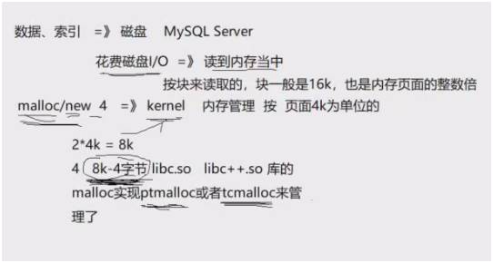

- **磁盘IO**是**以块为单位**读取数据，通常为16KB。--- **内存页面的 整数倍**
- **内存管理**是**以页面**为单位，通常为4KB(32位)。
- 减少磁盘IO次数是提高查询效率的关键。 

> 以下是关于磁盘IO与内存管理的细化要点：
>
> ### 1. **磁盘IO的特点**
>    - **操作单位**：磁盘IO以块（Block）为单位读取数据，通常一个块大小为16KB。
>    - **效率**：磁盘IO操作速度远低于内存操作，因此减少磁盘IO次数是优化的关键。
>    - **顺序读取与随机读取**：
>      - 顺序读取效率高，因为磁盘磁头移动较少。
>      - 随机读取效率低，因为磁头需要频繁移动定位。
>
> ### 2. **内存管理的特点**
>    - **操作单位**：内存管理以**页面（Page）**为单位，通常一个页面大小为4KB。
>    - **内存分配**：
>      - 操作系统按页面分配内存，而**不是按字节分配**。
>      - 小内存分配（如4字节）会由用户态的内存分配器（如 `malloc` 或 `new`）管理，避免频繁陷入内核。
>    - **缓存机制**：
>      - 内存分配器会缓存未使用的内存块，以提高后续分配效率。
>      - 当缓存耗尽时，才会向操作系统申请新的内存页面。
>
> ### 3. **磁盘IO与内存的关系**
>    - **数据加载**：
>      - 数据库从磁盘读取数据时，数据会先加载到内存中。
>      - 一次磁盘IO通常会读取一个磁盘块（16KB），并存储到内存的多个页面中。
>    - ### **索引加载**：
>      
>      - 索引文件从磁盘加载到内存时，会构建为特定的数据结构（如B树或B+树）以加速查询。
>    - **减少磁盘IO**：
>      - 数据库通过优化索引结构（如B+树）和缓存机制（如缓冲池）来减少磁盘IO次数。
>
> ### 4. **磁盘IO与内存管理的优化策略**
>    - **批量读取**：
>      - 磁盘IO按块读取数据，避免频繁的小数据读取。
>    - ### **索引结构优化**：
>      
>      - 使用B树或B+树等平衡树结构，减少磁盘IO次数。
>    - ### **缓存机制**：
>      
>      - 数据库通过缓冲池（Buffer Pool）将常用数据缓存到内存中，减少磁盘访问。
>    - ### **分页管理**：
>      
>      - 内存分页与磁盘块**对齐**，确保数据读取后能高效存储到内存中。
>
> ### 5. **磁盘IO与内存管理的实践意义**
>    - **查询性能**：
>      - 减少磁盘IO次数可以显著提高查询性能。
>    - **数据结构选择**：
>      - 数据库索引选择B+树等结构，确保一次磁盘IO能加载更多数据。
>    - **硬件匹配**：
>      - 磁盘块大小与内存页面大小的整数倍关系，确保数据读取和存储的高效性。
>
> 通过以上细化，可以更清晰地理解磁盘IO与内存管理在数据库中的作用及优化方向。


## 你研究过 内存分配器的实现吗?

> `ptmalloc` 和 `tcmalloc` 是两种常见的内存分配器（Memory Allocator），它们在内存管理中扮演着重要角色。
>
> ---
>
> ### 1. **ptmalloc**
>    - **全称**：Pthread malloc
>    - **来源**：基于 GNU C Library (glibc) 的内存分配器。
>    - **特点**：
>      1. **线程安全**：
>         - 支持多线程环境，通过锁机制（如互斥锁）实现线程安全。
>      2. **分配策略**：
>         - 使用分级分配策略（Bins），将内存分为小块（Small Bins）、大块（Large Bins）和快速分配块（Fast Bins）。
>      3. **内存碎片管理**：
>         - 通过合并相邻的空闲块减少内存碎片。
>      4. **适用场景**：
>         - 适合一般的多线程程序，尤其是需要与 glibc 兼容的场景。
>    - **缺点**：
>      - 在高并发场景下，锁机制可能导致性能瓶颈。
>      - 内存碎片问题在某些情况下仍然存在。
>
> ---
>
> ### 2. **tcmalloc**
>    - **全称**：Thread-Caching Malloc
>    - **来源**：由 Google 开发，专为高性能应用设计。
>    - **特点**：
>      1. **线程缓存**：
>         - 每个线程维护独立的内存缓存，减少线程间的锁竞争。
>      2. **分配效率**：
>         - 使用高效的内存分配算法，分配和释放内存的速度更快。
>      3. **内存碎片管理**：
>         - 通过全局和线程本地缓存的结合，减少内存碎片。
>      4. **适用场景**：
>         - 适合高并发、高性能的应用场景，如 Web 服务器、大型分布式系统等。
>    - **缺点**：
>      - 在低并发或单线程场景下，性能优势不明显。
>      - 线程缓存可能导致内存使用量增加。
>
> ---
>
> ### 3. **对比总结**
>
> | 特性             | ptmalloc                       | tcmalloc                         |
> | ---------------- | ------------------------------ | -------------------------------- |
> | **线程安全**     | 通过全局锁实现                 | 通过线程本地缓存实现，无需全局锁 |
> | **分配效率**     | 较慢，适合一般场景             | 高效，适合高并发场景             |
> | **内存碎片管理** | 合并空闲块，效果一般           | 通过线程缓存和全局缓存结合优化   |
> | **适用场景**     | 多线程程序，兼容性要求高的场景 | 高性能、高并发应用               |
> | **内存使用量**   | 较低                           | 较高（线程缓存可能增加内存占用） |
>
> ---
>
> ### 4. **选择建议**
> - **使用 ptmalloc**：
>   - 如果你的程序需要与 glibc 兼容。
>   - 如果你的程序是普通的多线程应用，且对性能要求不高。
> - **使用 tcmalloc**：
>   - 如果你的程序是高并发、高性能应用（如 Web 服务、分布式系统）。
>   - 如果你需要更快的内存分配和释放速度。
>
> ---
>
> ### 5. **如何切换内存分配器**
> - **ptmalloc**：默认内置于 glibc，无需额外配置。
> - **tcmalloc**：需要单独安装并链接：
>   ```bash
>   sudo apt-get install libgoogle-perftools-dev
>   ```
>   编译时链接：
>   ```bash
>   g++ -o app app.cpp -ltcmalloc
>   ```
>
> 通过了解两者的特点和适用场景，可以根据需求选择合适的内存分配器。


## AVL树与B树的对比：

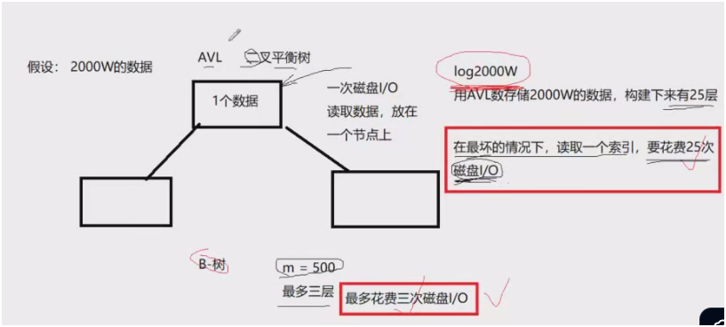

- AVL树是二叉平衡树，每个节点最多两个子节点。
- AVL树层数较高（例如**2000万数据需要25层**），磁盘IO次数多。-- log(2) 2000w
- B树通过增加每个节点的子节点数量（M阶）降低了树的高度。

## B树的特点：

- B树是一种平衡树，**所有叶子节点在同一层**。
- **每个节点可以存储多个键值（M阶B树，M一般为300-500）**。 300/500 叉 平衡树
-  B树的层数较少（例如2000万数据，**M=500时最多3层**），因此磁盘IO次数少。

> ## m怎么取?
>
> 一次 磁盘io 读取的磁盘块内容, 刚好 存储在 b树的 一个节点中


## 所以为什么用b树做设计磁盘io?

因为 !!  花费 磁盘 io 次数 少!!


## 数据库 查询流程


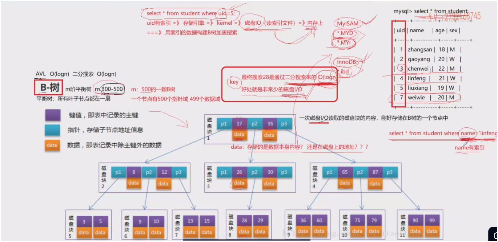

## B树的data节点中存储的是数据本身还是磁盘地址？

- 取决于存储引擎：
  - **MyISAM**：索引和数据分开存储，B树节点存储的是数据在磁盘上的地址。
  - **InnoDB**：索引和数据存储在一起，B树节点存储的是数据本身。

## B树的搜索过程是怎样的？

> 对于每一个 节点
>
> 因为 节点内 是 有序, 所以使用 二分查找, 

- ### 从根节点开始，通过**二分搜索**找到目标值**所在的范围**。

- 根据指针**跳转到子节点**，重复二分搜索，直到找到目标值。

- ### 节点内 的 搜索的时间复杂度为 `O(log₂N)`。


> ### **avl 也是 O(log₂N),为什么还要用b树?** 
>
> ### 就是因为 **磁盘io 次数 被大大优化** 了!!


## 索引占用空间问题-补充

> ## *索引 都会 存储 源数据的 一行吗?*
>
> ### **1. MyISAM 存储引擎**
> - **索引和数据是分开存储的**。
> - ### 索引存储的是数据**在磁盘上的地址（指针）**。
> - ### 当通过索引找到目标值后，**还需要通过指针去磁盘读取**对应的数据行。
>
> ### **2. InnoDB 存储引擎**
> - **主键索引（聚集索引）和数据存储在一起**。
>   
>   - ### **主键索引的**每个节点存储的是**整行数据**。
> - **辅助索引（非聚集索引）存储的是主键值**。
>   
>   - ### 通过**辅助索引**找到主键值后，**再通过主键索引定位到整行数据**。
>   
>   - 引出了 [InnoDB存储引擎的索引结构](##InnoDB存储引擎的索引结构)
>
> ---
>
> ### **总结**
> - **MyISAM**：索引存储的是数据的磁盘地址。
> - **InnoDB**：
>   - 主键索引存储整行数据。
>   - 辅助索引存储主键值，通过主键索引再找到整行数据。


# b+树索引详解

## B+树链表

> 是的，B+ 树的叶子节点整体是通过链表连接起来的，形成一个**有序链表**。以下是具体说明：
>
> ### 1. **节点中的数据是一个链表**
> - 在 B+ 树中，每个节点（无论是非叶子节点还是叶子节点）内部的数据（索引值）是有序排列的。
> - 这些数据通常可以看作是一个数组或链表，便于快速查找和定位。
>
> ### 2. **叶子节点整体连成链表**
> - B+ 树的叶子节点之间通过指针连接，形成一个**有序链表**。
> - 这个链表的顺序与索引值的大小顺序一致，从最小到最大。
> - 这种设计的好处是：
>   - **范围查询更高效**：可以直接从链表的起点开始，顺序遍历到终点，避免了回溯或复杂的树结构遍历。
>   - **整表扫描更方便**：直接遍历叶子节点的链表即可完成，而不需要像 B 树那样遍历整个树结构。
>
> ### 3. **示意图**
> 假设有一棵简单的 B+ 树：
>
> ```
> 非叶子节点：
>        [10 | 20]
>       /    |    \
> 叶子节点：
> [1, 5, 8] -> [10, 15, 18] -> [20, 25, 30]
> ```
>
> - 非叶子节点只存储索引值 `[10, 20]`，用于指导搜索路径。
> - 叶子节点存储所有的索引值和对应的数据，并通过链表连接起来（`->` 表示链表指针）。
>

## 为什么选择 B+ 树而不是 B 树？

1. ### **数据分布与搜索效率**：
  
   - 在 B 树中，数据（索引值和数据）分布在**所有节点上**（**包括非叶子节点和叶子节点**）。这**导致离根节点越近的数据搜索效率更高，而离根节点越远的数据搜索效率较低**，**磁盘 I/O 次数不平均**。
   - B+ 树优化了这一点，所有数据（索引值和对应的数据）都存储在叶子节点上，非叶子节点只存储索引值（键）。这样，每次搜索都需要访问叶子节点，搜索时间更加平均。
   
2. ### **节点存储效率**：
  
   - B 树的**每个节点存储索引值和数据**，因此在**相同大小的节点中，B 树能存储的索引值较少**。
   - B+ 树的非叶子节点只存储索引值，因此每个节点可以存储更多的索引值。这使得 B+ 树的高度更低，减少了磁盘 I/O 次数，从而提高了搜索效率。
   
3. ### **范围查询与整表遍历**：
  
   - B 树在进行范围查询时，**需要遍历多个子树**，操作复杂且效率较低。---- **遍历 数组,链表, 比树 简单的多!!**
   - B+ 树的**叶子节点通过链表连接，形成一个有序链表**。范围查询或整表遍历时，只需遍历叶子节点的链表即可，操作简单且高效。

## B+ 树的优势总结 

- **磁盘 I/O 更少**：由于每个节点存储更多的索引值，树的高度更低，访问节点的次数减少。
- **搜索时间更平均**：所有数据都存储在叶子节点上，搜索路径固定。
- **范围查询更高效**：叶子节点形成有序链表，直接遍历链表即可完成范围查询或整表遍历。

## 实际应用中的意义

在 MySQL 中，B+ 树索引被广泛用于支持高效的查询操作，特别是范围查询（如 `WHERE age BETWEEN 18 AND 25`）和排序操作。相比之下，B 树在这些场景下的性能较差，因此 B+ 树成为更优的选择。


## 示例回答-索引底层原理

> ### 索引的底层原理
>
> 当我们通过 `SELECT` 语句对一张表进行查询时，如果加了过滤条件（如 `WHERE` 子句），MySQL 会按照以下步骤处理：
>
> 1. **检查是否有索引**  
>    - **没有索引**：直接进行整表扫描，效率较低。  
>    - **有索引**：MySQL 会利用索引加速查询。
>
> 2. **索引的加载与构建**  
>    - 如果有索引，操作系统会从磁盘上的索引文件中加载索引数据到内存中。
>    - MySQL 使用 **B+ 树** 来构建索引。B+ 树是一种平衡树，搜索效率非常高。
>
> 3. **为什么使用 B+ 树**  
>    - **磁盘 I/O 对应性**：B+ 树的每个节点刚好对应一次磁盘 I/O 操作，能够高效地利用磁盘读取性能。  
>    - **非叶子节点存储索引值（键）**：非叶子节点只存储索引值（`k`），可以存储更多的索引值，减少树的高度，从而减少磁盘 I/O 次数。  
>    - **叶子节点存储数据**：所有的索引值和对应的数据（`k` 和 `data`）都存储在叶子节点中，保证搜索路径固定，效率更平均。
>
> 4. **搜索效率**  
>    - B+ 树的时间复杂度为 `O(log n)`，通过二分搜索快速定位索引值。
>    - 由于树的高度较低，磁盘 I/O 次数最少，查询效率更高。
>
> 


# InnoDB的主键和二级索引树

## InnoDB存储引擎的索引结构

- 主键索引（Primary Key Index）：B+树结构，叶子节点存储的是整行数据。
- 二级索引（Secondary Index）：B+树结构，叶子节点存储的是索引字段的值和对应的主键值。

## 索引的使用场景-explain

> ### name 无索引
>
> - 等值查询（如`WHERE UID=5`）：直接通过**主键索引或二级索引**定位数据。
>   - type 为 const
> - 范围查询（如`WHERE UID<5`）：通过**索引的有序链表**快速定位范围内的数据。
>   - type 为 range
> - 无索引 查询, 全表搜索

> ### name 有索引
>
> ```sql
> select name from student where name = 'zhang san';
> 
> select uid,name from student where name = 'zhang san';
> 
> select * from student where name = 'zhang san';  // 回表,  data 数据不够 *
> ```
>
> ### 最后一个 **需要回表**


## 回表的概念-explain

- 当二级索引无法满足查询所需的所有字段时，需要通过二级索引找到主键值，再**回到主键索引树中获取完整数据**。

> ### explain--注意 extra的值
>
> ```sql
> select name from student where name = 'zhang san';
> ```
>
> ```sql
> +----+-------------+---------+------------+------+---------------+---------+---------+-------+------+----------+-------------+
> | id | select_type | table   | partitions | type | possible_keys | key     | key_len | ref   | rows | filtered | Extra       |
> +----+-------------+---------+------------+------+---------------+---------+---------+-------+------+----------+-------------+
> |  1 | SIMPLE      | student | NULL       | ref  | nameidx       | nameidx | 152     | const |    1 |   100.00 | Using index |
> +----+-------------+---------+------------+------+---------------+---------+---------+-------+------+----------+-------------+
> ```
>
> 
>
> 
>
> ```sql
> select uid,name from student where name = 'zhang san';
> ```
>
> ```sql
> +----+-------------+---------+------------+------+---------------+---------+---------+-------+------+----------+-------------+
> | id | select_type | table   | partitions | type | possible_keys | key     | key_len | ref   | rows | filtered | Extra       |
> +----+-------------+---------+------------+------+---------------+---------+---------+-------+------+----------+-------------+
> |  1 | SIMPLE      | student | NULL       | ref  | nameidx       | nameidx | 152     | const |    1 |   100.00 | Using index |
> +----+-------------+---------+------------+------+---------------+---------+---------+-------+------+----------+-------------+
> ```
>
> 
>
> 
>
> ```sql
> select * from student where name = 'zhang san';
> ```
>
> ```sql
> +----+-------------+---------+------------+------+---------------+---------+---------+-------+------+----------+-------+
> | id | select_type | table   | partitions | type | possible_keys | key     | key_len | ref   | rows | filtered | Extra |
> +----+-------------+---------+------------+------+---------------+---------+---------+-------+------+----------+-------+
> |  1 | SIMPLE      | student | NULL       | ref  | nameidx       | nameidx | 152     | const |    1 |   100.00 | NULL  |
> +----+-------------+---------+------------+------+---------------+---------+---------+-------+------+----------+-------+
> ```
>
> 

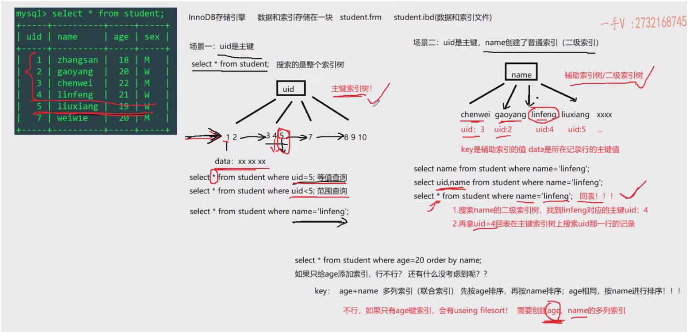

## 一个优化案例-跟着思维-**重点**

> 在 name 有 索引的基础上
>
> ```sql
> explain select * from student where age=25 order by name;
> ```
>
> 出现  
>
> ```sql
> Using filesort
> ```
>
> 这是 必须优化的
>
> 
>
> ### 1.age加索引, 再看
>
>  没有效果
>
> 能命中索引, 但是 没去掉 `Using filesort`
>
> ### 2.age+name 多列索引
>
> 先删除之前的, 再创建
>
> ### 此时 成功了, 优化成功


## 索引优化-**重点**

- 使用`EXPLAIN`分析SQL执行计划，判断

  ### 是否命中索引、

  ### 是否需要回表。
- ### 避免`SELECT *`，

  明确选择所需字段，**减少不必要的回表操作**。
- ### 针对排序和过滤条件，创建联合索引

  （如`CREATE INDEX idx ON table(age, name)`），以提高查询效率并避免`Using filesort`。


## 以上, 就是从 **b+树原理 进行理解和优化**!!


# 聚集索引和非聚集索引

好的，这段内容主要讲解了 MyISAM 和 InnoDB 存储引擎在主键索引树和辅助索引树（即二级索引树）上的存储方式和实现原理的区别。以下是内容的要点总结：

---

## MyISAM 存储引擎
- ### **主键索引树**：
  
  - 索引树中的键值（`k`）存储的是主键值（如 `UID`）。
  - 索引树中的数据部分存储的是**数据的物理地址**。
  - 数据和索引分开存储，数据存储在数据文件中，索引存储在索引文件中。
  - **特点**：主键值不能重复。
  
- ### **辅助索引树**：
  
  - 索引树中的键值（`k`）存储的是辅助索引值（如 `name`）。
  - 索引树中的数据部分同样存储的是数据的物理地址。
  - **特点**：辅助索引值可以**重复**。
  
- > ## **总结**：
  >
  > - ### **主键索引树和辅助索引树的存储结构完全相同**，**唯一的区别**是**主键值不能重复**，而辅**助索引值可以重复**。
  > - ### 这种索引结构称为 **非聚集索引**，因为**索引和数据是分开存**储的。

---

## InnoDB 存储引擎
- **主键索引树**：
  - 索引树中的键值（`k`）存储的是主键值。
  - 索引树中的数据部分存储的是完整的行数据。
  - 数据和索引存储在同一个文件中。
  - **特点**：主键索引树即数据存储结构，称为 **聚集索引**。

- **辅助索引树**：
  - 索引树中的键值（`k`）存储的是辅助索引值。
  - 索引树中的数据部分存储的是对应行的主键值。
  - **特点**：查询辅助索引时，可能需要通过主键值回表查询完整数据。

- **总结**：
  - 主键索引树和辅助索引树的存储结构不同。
  - > ### 主键索引树是**聚集索引**，辅助索引树是**非聚集索引**。

---

## 聚集索引 vs 非聚集索引
- **聚集索引**：
  - 数据和索引存储在一起。
  - 主键索引树即数据存储结构。
  - 例如：InnoDB 的主键索引树。

- **非聚集索引**：
  - 数据和索引分开存储。
  - 索引树中存储的是数据的物理地址或主键值。
  - 例如：MyISAM 的主键索引树和辅助索引树，以及 InnoDB 的辅助索引树。


# 哈希索引

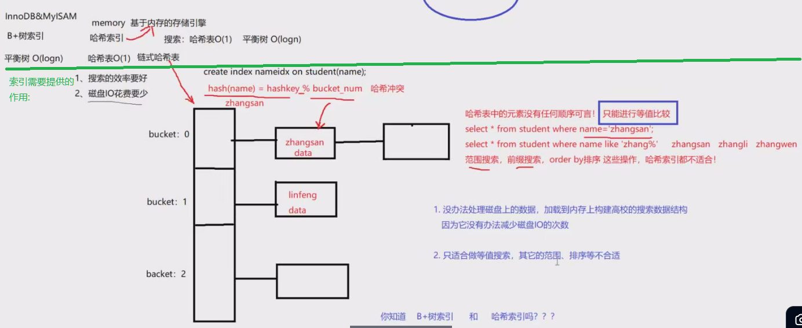

## memory引擎

使用的是 哈希索引

是基于 内存的 存储引擎

## 添加哈希索引

```sql
create index nameidx on stedent(name) using hash;

create index nameidx on stedent(name) using btree;

```


## 查看所有索引

> ### 这个 显示 不准确 

```sql
show create table student\G      
```


> ### 这个准确

```sql
show indexes from student;
```


## 哈希索引的原理
- **数据结构**：哈希索引基于 **链式哈希表** 实现。
- **构建过程**：
  1. 使用哈希函数对索引字段的值（如 `name`）计算哈希值。
  2. 根据哈希值将数据分配到不同的桶（`bucket`）中。
  3. 如果多个值映射到同一个桶（哈希冲突），则通过链表解决冲突。
- **特点**：
  
  - 查询效率高，增删查的时间复杂度为 **O(1)**。
  - ### 哈希表中的数据**是无序的**。

---

## 哈希索引的局限性--**重点**
- ### **无序性**：
  
  - ### 哈希表中的数据**没有顺序，无法支持范围查询**、**前缀查询**、**排序（`ORDER BY`）**等操作。
  - ### 只能支持 **等值查询**（如 `=`）。
  
- ### **磁盘 I/O 问题**：
  
  - 哈希索引无法减少磁盘 I/O 次数。
  - 每个桶可能对应一次磁盘 I/O，导致效率低下。
  
- ### **适用场景有限**：
  
  - ### 哈希索引适用于 **内存中的数据**，如 Memory 存储引擎。
  - ### **不适合需要持久化**到磁盘的数据。

---

## B+树索引的优势--回顾
- **有序性**：
  - B+树索引在构建时会对数据进行排序。
  - 支持范围查询、前缀查询、排序（`ORDER BY`）等操作。
  
- **磁盘 I/O 优化**：
  - B+树的节点可以存储多个索引值，减少磁盘 I/O 次数。
  - 在千万级数据中，B+树的高度通常不超过 3 层，最多只需 3 次磁盘 I/O 即可完成查询。

- **适用场景广泛**：
  - B+树索引适用于需要持久化到磁盘的数据。
  - 是 InnoDB 和 MyISAM 存储引擎的默认索引类型。

---

## 哈希索引 vs B+树索引
| 特性               | 哈希索引             | B+树索引                                 |
| ------------------ | -------------------- | ---------------------------------------- |
| **数据结构**       | 链式哈希表           | B+树                                     |
| **查询效率**       | O(1)（仅限等值查询） | O(log n)                                 |
| **支持的查询类型** | 仅支持等值查询       | 支持等值查询、范围查询、前缀查询、排序等 |
| **数据有序性**     | 无序                 | 有序                                     |
| **磁盘 I/O 优化**  | 不支持               | 支持                                     |
| **适用场景**       | 内存中的数据         | 磁盘中的数据                             |

---

## 总结
- **哈希索引**：
  - 适用于内存中的数据，增删查效率高，但仅支持等值查询。
  - 不适合需要持久化到磁盘的数据，也不支持范围查询、排序等操作。

- **B+树索引**：
  - 是数据库中最常用的索引类型，支持多种查询类型，适合磁盘存储。
  - 是 InnoDB 和 MyISAM 存储引擎的默认索引类型。

在面试中，如果被问到 B+树索引和哈希索引的区别，可以从 **数据结构、查询效率、支持的查询类型、磁盘 I/O 优化、适用场景** 等方面进行对比，重点突出 B+树索引的优势和通用性。


# InnoDB自适应哈希索引

## 此哈希非彼哈希

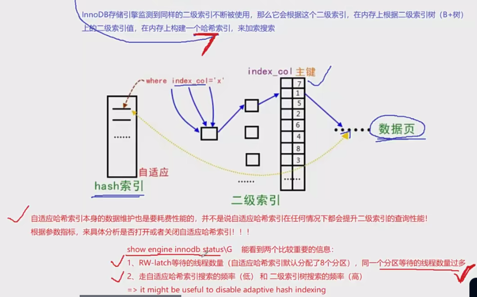

---

## 自适应哈希索引（AHI）概述
1. **定义**：
  
   - 自适应哈希索引是 **InnoDB 存储引擎的一种优化机制**，用于**加速频繁访问的二级索引**的查询。
   - 它基于 B+ 树索引的内**容动态生成哈希索引**，**主要用于等值查询**。
   
2. ### **触发条件**：
  
   - ### 当 InnoDB 检测到某个**二级索引被频繁访问**时，会**自动在内存中**为该索引构建哈希索引。
   - ### 这种优化无需手动创建，完全由 InnoDB 自动管理。
   
3. **作用**：
  
   - 减少查询路径：通过哈希索引直接定位数据指针，避免二级索引树和主键索引树的多次搜索。
   - 提升查询效率：适用于等值查询场景，时间复杂度接近 O(1)。

---


## 理解这个过程-**重点**

> - ### **查找路径优化**：通过哈希函数直接定位到桶，时间复杂度接近 `O(1)`，避免了 B+ 树的多层节点查找（`O(log(n))`）。
>
> - ### **桶内查找优化**：在桶内查找数据通常比在 B+ 树叶子节点中查找更快，尤其是哈希冲突较少时，遍历链表效率高于叶子节点的二分查找。
>
> 
>
> ## 淮-话
>
> 就是, 使用哈希 索引, 查桶 优化了, 在桶里的数据, 也可能优化
> 就 比 在b+树 查到叶子结点, 再在叶子结点里找, 快,
>
> 
>
> ## **但是**
>
> **并不一定** 使用了 自适应哈希, 他就快!


## 自适应哈希索引的优缺点

1. **优点**：
  
   - **加速查询**：在频繁使用的二级索引上，显著提升等值查询的性能。
   - **自动化**：无需开发者手动干预，InnoDB 自动监测和创建。
   
2. ### **缺点**：
  
   - **维护成本高**：哈希索引的生成和维护会消耗额外的内存和 CPU 资源。
   - **并发问题**：在高并发场景下，同一分区的锁竞争可能导致性能下降。
   - **场景限制**：仅适用于等值查询，对范围查询无效。-无序

---

## 优化与配置
1. ### **分区机制**：
  
   - 自适应哈希索引在 **MySQL 5.7** 版本后引入了**分区机制**，**每个分区有独立的锁，减少锁竞争**。
   - **默认分区数量为 8**，可通过参数调整。
   
2. **监控与关闭**：
  
   - 使用命令 `SHOW ENGINE INNODB STATUS` 查看自适应哈希索引的使用情况。
   
     - ```sql
       show variables like 'innodb_adaptive_hash_index';
       ```
   
       ```sql
       +----------------------------+-------+
       | Variable_name              | Value |
       +----------------------------+-------+
       | innodb_adaptive_hash_index | ON    |
       +----------------------------+-------+
       ```
   
       ```sql
       show variables like 'innodb_adaptive_hash_index_parts';
       ```
   
       ```sql
       +----------------------------------+-------+
       | Variable_name                    | Value |
       +----------------------------------+-------+
       | innodb_adaptive_hash_index_parts | 8     |
       +----------------------------------+-------+
       ```
   
   - ### **关键监控指标：**
   
     - 哈希索引的使用频率。
   
       ```sql
       SHOW ENGINE INNODB STATUS;
       ```
   
       看  `0.00 hash searches/s` 越高,  说明越有用, 提升越高
   
       ``0.00 non-hash searches/s`  越高, 说明 越没用, 此时需要关闭
   
       ```sql
       INSERT BUFFER AND ADAPTIVE HASH INDEX
       -------------------------------------
       Ibuf: size 1, free list len 0, seg size 2, 0 merges
       merged operations:
        insert 0, delete mark 0, delete 0
       discarded operations:
        insert 0, delete mark 0, delete 0
       Hash table size 34679, node heap has 1 buffer(s)
       Hash table size 34679, node heap has 0 buffer(s)
       Hash table size 34679, node heap has 0 buffer(s)
       Hash table size 34679, node heap has 0 buffer(s)
       Hash table size 34679, node heap has 0 buffer(s)
       Hash table size 34679, node heap has 0 buffer(s)
       Hash table size 34679, node heap has 0 buffer(s)
       Hash table size 34679, node heap has 0 buffer(s)
       0.00 hash searches/s, 0.00 non-hash searches/s
       ```
   
     - 分区锁的线程等待数量。
   - 如果发现线程等待过多或哈希索引使用率低，可以通过以下方式关闭：
     ```sql
     SET GLOBAL innodb_adaptive_hash_index = OFF;
     ```
   
3. **适用场景**：
  
   - 适用于频繁等值查询的场景。
   - 如果查询模式多为范围查询或分区锁竞争严重，应考虑关闭自适应哈希索引。

---

## 总结
- 自适应哈希索引是 InnoDB 的一种动态优化机制，旨在提升二级索引的查询效率。
- 它**并非万能**，在某些场景下**可能会带来性能问题**，因此需要根据实际情况决定是否启用。
- 学习和掌握自适应哈希索引的原理和使用场景，有助于更好地优化数据库性能。


# 索引常见问题-**索引大重点**

## 内容有点乱,版本不同

> [!warning]
>
> 重点看看 特殊情况的优化 部分    extrta 字段注释., 很有意思


结合的 索引漫画 第五章

## 核心内容总结

> [!warning]
>
> ### **一定要记住 有索引 不一定 必须用到索引**
>
> ### **要看 mysql 自己的 优化选择**

> 1. **索引的基本原理**：  本课程 索引相关 内容
>    
>    - 主键索引、二级索引、聚集索引、非聚集索引、哈希索引、自适应哈希索引的概念和作用。
>    - 二级索引需要回表，联合索引可以减少回表和排序操作。
>    
> 2. ### **索引的优化实践**：
>    
>    - **过滤条件加索引**：优先为 `WHERE` 条件中的字段加索引。
>    - **联合索引**：对 `WHERE` 和 `ORDER BY` 涉及的字段创建联合索引，避免 `Using filesort`。
>    - **区分度高的字段加索引**：如 `user_id`，而非区分度低的字段（如 `status`）。
>    - **避免无效索引**：如 `LIKE '%xxx'` 或涉及函数计算的字段无法使用索引。
>    
> 3. ### **索引的使用限制**：
>    
>    - ### **一次查询只能使用一个索引**，MySQL 会选择 **过滤数据量最少** 的索引。
>
>      ### 看哪个索引 取的 数据少, 用哪个
>    - ### 可以通过 `FORCE INDEX` 强制指定索引。
>    
>      ``` sql
>      select * from student force index(ageidx) where name='xing huai' and age=25;
>      ```
>    
>      
>    
> 4. **特殊情况的优化**：
>    
>    - ### `NOT IN` 和 `OR` 查询**可以被优化为范围查询或 `UNION`**，从而使用索引。
>
>      ### 和 select 后面 也有关 --- **索引下推的出现, 使得和老师不一样了**
>    
>      ### explain 结果不是 固定的, **不一定都一样**!
>    
>      ```sql
>      // 只有age 索引时,  且为 *
>      explain select * from student where age in (24, 25);   -- range, 用到索引, Using index condition 搜索时就过滤, 但可能回表
>      
>      explain select * from student where age in (25);   -- ref, 用到索引, null--无需过滤
>      
>      explain select * from student where age not in (25);  -- range, 用到索引, Using index condition 
>      
>      explain select * from student where age>25 or age<25; -- range, 用到索引, Using index condition
>      ```
>    
>      select 后面 索引字段, 使得, 无需回表
>    
>      ```sql
>      explain select age from student where age in (24, 25);   -- range, 用到索引, Using where; Using index -- 先过滤,再直接,无需回表
>      
>      explain select age from student where age in (25);   -- ref, 用到索引,  Using index-无需回表
>      
>      explain select age from student where age not in (25);  -- index, 用到索引, Using where; Using index
>      
>      explain select age from student where age>25 or age<25; -- index, 用到索引, Using where; Using index
>      ```
>    
>    - ### **or  被优化为 union** 
>    
>      ### 仅对于 or , 字段 不同 用不到索引(仅对于 有 无索引字段), 字段 相同 会用到索引, 不绝对
>    
>      ### 都有索引, mysql8.0 会使用 `Using sort_union` **索引合并** 进行
>    
>      ### 不过, 看下来, 感觉还是  优化为 union 更好
>    
>       本质是, or 是不同的条件, 也就早就了 可以使用 不同的 sql 语句 进行 联合
>    
>      ```sql
>       explain select * from student where age>25 or name='xing huai';
>                                               
>      explain select age from student where age>25 union all select age from student where name='xing huai';
>      ```
>    
>      
>    
>    - 数据类型转换、函数调用等会导致索引失效。
>    
> 5. ### **多表连接查询**：
>    
>    - ### **小表决定循环次数**，**大表决定每次循环的查询时间**。
>
>      > 怎么理解呢?
>      >
>      > - **小表决定循环次数**：小表会被完整扫描，**每一行数据都会与大表进行匹配**，因此小表的行数决定了循环的次数。
>      > - **大表决定每次循环的查询时间**：大表根据小表的每一行数据进行查询，如果大表的关联字段有索引，查询会很快；如果没有索引，则需要全表扫描，查询时间会增加。
>      >
>      > **总结**：小表越小，循环次数越少；大表有索引，每次查询时间越短，整体效率越高。
>    - ### **大表的关联字段应加索引以提高查询效率。**
>    
> 6. **SQL 优化的流程**：
>    - 使用 `EXPLAIN` 分析 SQL 执行计划，查看索引使用情况。
>    - 关注 `Extra` 字段中的 `Using filesort` 和 `Using temporary` 等信息，优化排序和临时表操作。
>

---


## 注意

在上面 not in, in 优化时,  如果 where  后面是 **联合索引的 其中一个字段**, extra 会显示 `using index condition`

`Using index condition` 是 MySQL 执行计划中 `EXPLAIN` 的 `Extra` 字段可能出现的一种信息，表示 MySQL 在查询时使用了 **索引条件下推（Index Condition Pushdown, ICP）** 优化。

> ### **什么是索引条件下推（ICP）？**
>
> - **定义**：在使用索引扫描时，将部分 `WHERE` 条件下推到存储引擎层，**由存储引擎在索引扫描过程中直接过滤数据**，而不是将所有数据返回给 MySQL Server 层再进行过滤。
> - **作用**：减少从存储引擎返回到 MySQL Server 层的数据量，从而提高查询效率。
>
> ### **适用场景**
>
> - 当查询条件中包含索引字段和非索引字段时，MySQL 会优先使用索引字段进行索引扫描。
> - 如果启用了 ICP，存储引擎会在扫描索引时直接应用部分 `WHERE` 条件，减少需要回表的数据量。
>
> ## 常见于 二级索引 where过滤


## 索引下推-补充

> **索引下推（Index Condition Pushdown, ICP）**是在 **MySQL 5.6** 版本中引入的优化功能。它的主要作用是将部分 `WHERE` 条件下推到存储引擎层，在索引扫描过程中直接过滤数据，从而减少回表次数和数据传输量，提高查询效率。
>
> ### **关键点**
> - **引入版本**：MySQL 5.6。
> - ### **默认启用**：在 MySQL 5.6 及以上版本中，索引下推默认启用。
> - **适用场景**：主要用于**复合索引（联合索引）和部分索引字段**参与查询条件的场景。
>
> ### **如何检查是否启用**
> 可以通过以下命令查看是否启用了索引下推：
> ```sql
> SHOW VARIABLES LIKE 'optimizer_switch';
> ```
> 如果输出中包含 `index_condition_pushdown=on`，说明索引下推已启用。
>
> ### **示例**
> 假设有一个联合索引：
> ```sql
> KEY idx_age_score (age, score)
> ```
> 查询语句：
> ```sql
> SELECT * FROM student WHERE age = 18 AND score > 90;
> ```
> - **索引下推启用时**：存储引擎在扫描索引时，会同时应用 `age = 18` 和 `score > 90` 的条件，减少回表次数。
> - **索引下推未启用时**：存储引擎只应用 `age = 18` 的条件，将所有匹配的记录返回给 MySQL Server 层，再由 Server 层过滤 `score > 90`。
>
> 索引下推的引入显著提升了复杂查询的效率，尤其是在大数据量场景下。


## extra字段判断回表-不能完全确定

但有 参考价值

- ### `Using index`---- **必没有回表**

  - 表示查询使用了覆盖索引（Covering Index），不需要回表。
  - 查询的所有字段都在索引中，直接从索引中获取数据。

- `Using where`

  - 表示查询需要额外的过滤操作，可能需要回表。
  - 如果查询的字段不完全被索引覆盖，则需要回表获取完整数据。

- `Using index condition`

  - 表示使用了索引条件下推（ICP），**部分过滤条件在存储引擎层完成，可能减少回表次数。**


### **关键问题与思考**

1. **如何定位性能问题的 SQL**：
   - 不可能对所有 SQL 都用 `EXPLAIN` 分析，应先通过慢查询日志或性能监控工具定位耗时较长的 SQL，再针对性优化。

2. **回答索引优化问题的思路**：
   - 先描述如何定位问题（如慢查询日志）。
   - 再说明如何分析问题（如使用 `EXPLAIN`）。
   - 最后提出优化方案（如加索引、调整 SQL 结构）。

---

## 总结

> ### **or 不绝对!!**------------or 字段不同, 才会 用不到 索引


## 问题--值得自己想怎么回答

> ### 如果是 练习, 按照 学到的 : 
>
> explain 分析 , 加索引, 改sql 使得优化等等!!
>
> ### 但是 不适用于 企业级项目,  sql 太多了


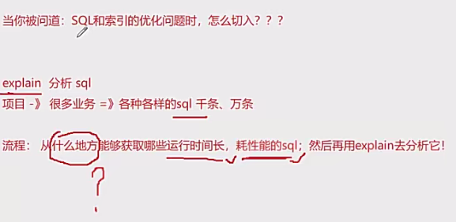


# 索引和慢查询日志

## 回答上节问题

> ### 多学学 工具,  压力测试 jmeter等 
>
> ### 本节 使用 慢查询 日志

## 慢查询日志的作用  

- 用于**记录执行时间超过设定阈值**的SQL语句，**帮助定位性能瓶颈**。

## 开启慢查询日志  

- 查看慢查询日志开关状态：
  ```sql
  SHOW VARIABLES LIKE 'slow_query_log';
  ```
- 开启慢查询日志：
  ```sql
  SET GLOBAL slow_query_log = ON;   // 不加global 可能 必须让你 加
  ```
  
  > SET slow_query_log = ON;
  > ERROR 1229 (HY000): Variable 'slow_query_log' is a GLOBAL variable and should be set with SET GLOBAL
  >
  > ### 这是 全局的, 不是 session的
- 查看慢查询日志文件路径：
  ```sql
  SHOW VARIABLES LIKE 'slow_query_log_file';
  ```

## 设置慢查询时间阈值  

- 查看当前慢查询时间：
  ```sql
  SHOW VARIABLES LIKE 'long_query_time';
  ```
- 设置慢查询时间（单位：秒，可设置为小数）：
  ```sql
  SET long_query_time = 0.1; -- 100毫秒   不能使用 GLOBAL, 不影响当前会话, 影响 之后的新连接!!
  ```

## 慢查询日志的使用流程及实践--**重点**

以 t_user 为例 去测试, 200w 数据

```sql
select * from t_user where passwd = 1000000;
```


```sql
/var/lib/mysql/<主机名>-slow.log
```

```sql
Tcp port: 3306  Unix socket: /var/run/mysqld/mysqld.sock
Time                 Id Command    Argument
# Time: 2025-05-13T15:24:14.068120Z
# User@Host: root[root] @ localhost []  Id:     9
# Query_time: 0.378882  Lock_time: 0.000003 Rows_sent: 1  Rows_examined: 2000000
use test;
SET timestamp=1747149853;
select * from t_user where passwd = 1000000; 
```

```sql
pwd 是 字符串, 注意 即使有索引, 也会 因为 类型转换, 使得 索引失效 
```


> ## 重点---面试说出来
>
> - **第一步**：开启慢查询日志并设置合理的时间阈值。
> - **第二步**：执行业务或进行压测。
> - **第三步**：查看慢查询日志，定位耗时SQL。
> - **第四步**：使用 `EXPLAIN` 分析耗时SQL，找出性能问题。
> - **第五步**：根据分析结果优化SQL（如添加索引、调整查询逻辑等）。


## 常见优化方向  

- 确保过滤条件字段有索引。
- 避免类型转换导致索引失效。
- 使用联合索引优化 `WHERE` 和 `ORDER BY`。
- 避免使用函数或表达式操作索引字段。


## 辅助工具  

- **`SHOW PROFILES`**：查看SQL执行的详细耗时。---看0.00s 的 更详细 时间
  
  ```sql
  show variable like 'profiling';
  SET profiling = ON;
   explain select * from t_user where passwd = '1000000';
  SHOW PROFILES;
  ```
  
  ```sql
  +----------+------------+-------------------------------------------------------+
  | Query_ID | Duration   | Query                                                 |
  +----------+------------+-------------------------------------------------------+
  |        1 | 0.00054725 | explain select * from t_user where passwd = '1000000' |
  +----------+------------+-------------------------------------------------------+
  ```
  
  
  
- **`EXPLAIN`**：分析SQL执行计划，定位性能问题。

## 面试中的切入点  

- 强调通过慢查询日志定位问题的实践经验，而非单纯背诵优化措施。
- 展示解决问题的完整流程：从日志定位到SQL优化，再到性能验证。

通过以上步骤，能够系统性地优化SQL性能，并在面试中展现实际解决问题的能力。


# 2025-05-13

# 事务核心概念

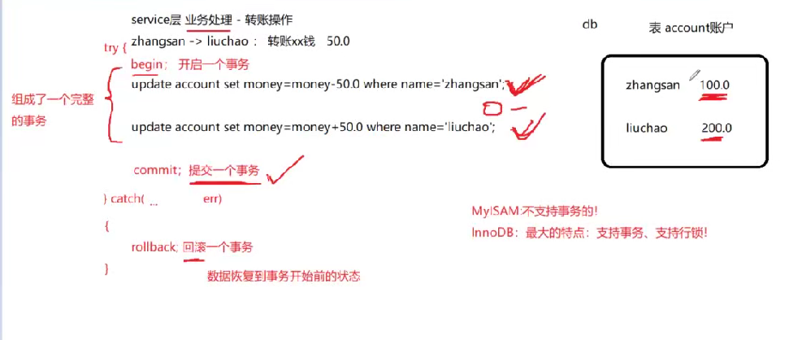

## 事务的定义
事务是由一条或多条对数据库操作的SQL语句组成的一个**不可分割的单元**。事务的核心特性是**原子性**，即：
- 要么事务中的所有操作全部成功并提交；
- 要么事务中的所有操作全部失败并回滚。

---

## 事务的应用场景

事务通常用于需要多条SQL语句共同完成的复杂业务逻辑。例如：

- **银行转账**：从一个账户扣款，同时向另一个账户存款。
- **库存管理**：商品的出库和入库操作。

事务的使用可以确保数据的一致性，避免出现部分操作成功、部分操作失败的情况。

------

## 事务的三个状态

> - ### **BEGIN**（或 `START TRANSACTION`）：开启事务。
> - ### **COMMIT**：提交事务，保存所有更改。
> - ### **ROLLBACK**：回滚事务，撤销所有更改，恢复到事务开始前的状态。
>


## 事务的实现
事务的实现依赖于数据库的存储引擎。例如：
> - ### **InnoDB**（MySQL默认存储引擎）：支持事务、行锁和外键。
> - ### **MyISAM**：不支持事务，每条SQL语句自动提交。
> - ### InnoDB通过**Redo Log**（重做日志）和**Undo Log**（回滚日志）来实现**事务的提交和回滚**。
>


> ### 查看 引擎 相关
>
> ```sql
> show engines\G
> ```
>
> ```sql
> *************************** 7. row ***************************
>       Engine: InnoDB
>      Support: DEFAULT
>      Comment: Supports transactions, row-level locking, and foreign keys
> Transactions: YES
>           XA: YES
>   Savepoints: YES
> ```
>
> transactions--- **事务,交易**


---

## 注意事项

- 如果业务中涉及事务，需将 `autocommit` 设置为 `0`（手动提交模式）。

  ```sql
  select @@autocommit;
  ```

  ### 默认为 1, 自动提交

  ```sql
  set @@autocommit=0;
  ```

  

- 使用事务时，需确保所有操作都成功后再提交，否则应回滚。


# 事务ACID

## 事务的特性（ACID）

事务具有以下四个特性：

- **原子性（Atomicity）**：事务是不可分割的最小操作单元。
- **一致性（Consistency）**：事务**执行前后**，数据库的状态必须保持一致。
- **隔离性（Isolation）**：多个事务**并发执行**时，彼此之间互不干扰。  -- 就像 多线程 的 线程安全问题
- **持久性（Durability）**：事务一旦提交，其结果将永久保存。

> 


> ### commit 只是一个状态, 并不是 直接 磁盘io
>
> ### 对于 并发性高低, 取决于 隔离性的高低 , 也决定了 安全性
>
> 

## ACID特性的实现机制

- ### **Undo Log**: 用于回滚未完成的事务，保证原子性。
- ### **Redo Log**: 用于恢复已提交的事务，**保证持久性**。

  > 1. **保证持久性**：
  >
  >    - 当事务提交后，**即使系统崩溃或掉电，**Redo Log 也能确保事务的修改被持久化到磁盘。
  >
  >      > 这个意思是, 提交了, 放到缓存了, 还没写磁盘
  >      >
  >      > 事务虽然提交了，但数据却没有真正保存到磁盘，导致数据不一致
  >
  >    - 数据库可以通过重做日志恢复已提交的事务，避免数据丢失。
  >
  > 2. **提高性能**：
  >
  >    - 数据库的写操作通常是**先写入内存（缓冲区），再异步写入磁盘。Redo Log 允许事务提交时只写日志**，而不是立即将数据写入磁盘，从而提高性能。
  >
  > > #### **Redo Log 的写入状态**
  > >
  > > - **Redo Log 是顺序写入的**，并且每次写入都会记录一个事务的状态（如 "准备提交" 或 "已提交"）。
  > > - 如果数据库重启时发现某个事务的状态是 "准备提交" 而不是 "已提交"，说明事务未完成，数据可能写了一半。

- **锁机制**: 用于控制**并发事务**的隔离性。
- **约束和规则**: 用于保证**数据的一致性**。


> ### ACD 由  日志 保证
>
> ### I 由 锁机制+mvcc 保证

## mysql重点

> ### 最重要的是 
>
> ## **日志!!!**


# 脏读,不可重复读,幻读

## 事务并发问题
事务并发执行时，如果不加以控制，可能会导致以下问题：
- ### **脏读（Dirty Read）**：---- 必须杜绝
  
  - 一个事务读取了另一个事务尚未提交的数据。
  - 如果另一个事务回滚，则读取到的数据是无效的。
  - **必须杜绝**，因为它会导致严重的数据不一致问题。
  
  > ### 脏读, 需要 配合 **事务隔离级别** 理解  --- 不然理解不了!!
  >
  > 在某些数据库的默认事务隔离级别（如 **Read Uncommitted**）下
  >
  > ### 事务B是允许读取事务A尚未提交的数据的。
  >
  > 这种行为就是导致**脏读**的原因。
  >
  > 
  >
  > ### 示例
  >
  > 1. **事务A**：正在修改一条数据，但还没有提交。
  >
  >    ```sql
  >    BEGIN;
  >                         
  >    UPDATE accounts SET balance = balance - 100 WHERE id = 1;
  >                         
  >    -- 此时事务A还没有提交
  >    ```
  >
  >    
  >
  > 2. **事务B**：在事务A提交之前，读取了事务A修改的数据。
  >
  >    ```sql
  >    SELECT balance FROM accounts WHERE id = 1;
  >                         
  >    -- 读取到了事务A尚未提交的修改结果
  >    ```
  >
  >    
  >
  > 3. 如果事务A随后回滚：
  >
  >    ```sql
  >    ROLLBACK;
  >                         
  >    -- 数据恢复到事务A修改之前的状态
  >    ```
  >
  >    
  >
  > 此时，事务B读取到的数据是无效的，因为事务A的修改并没有真正生效。这种读取未提交数据的行为就是**脏读**。
  
- ### **不可重复读（Non-Repeatable Read）**：  --- 可能是允许的 -- 数据值被修改
  
  - 一个事务在两次读取同一数据时，发现数据被另一个事务修改并提交，导致两次读取结果不一致。
  - ### 也就是, 另一个事务修改, 不影响, 读到还是 未修改的
  - **是否需要杜绝**取决于业务需求，某些场景下可以接受。
  
- ### **幻读（Phantom Read）**： -- 数据行被新增或删除。
  
  - 一个事务在两次查询时，发现数据的数量发生了变化（如新增或删除了符合查询条件的记录）。
  - **是否需要杜绝**同样取决于业务需求。


## 事务相关命令

- **事务控制命令**：
  
  - `BEGIN`：开启事务。
  - `COMMIT`：提交事务。
  - `ROLLBACK`：回滚事务。
  - `SAVEPOINT point1`: 设置一个名字为point1的保存点
  - `ROLLBACK TO point1`：回滚到指定的保存点。
  
- **自动提交设置**： -- 加 @@ --- 这表示系统变量
  
  - `SET AUTOCOMMIT = 0`：关闭自动提交，改为手动提交事务。
  - `SET AUTOCOMMIT = 1`：开启自动提交。
  
- **隔离级别设置**：
  
  - `SET TRANSACTION ISOLATION LEVEL <级别>`：设置事务的隔离级别。
  - `SELECT @@tx_isolation`：查询当前事务的隔离级别。
  - ### 在 MySQL 8.0 及更高版本中，`@@tx_isolation` 已被弃用，改为使用 `@@transaction_isolation`


# 事务隔离级别


## 事务隔离级别的作用-why  

- 事务隔离级别用于解决事务并发执行时的数据安全问题。
- 主要问题包括：脏读（Dirty Read）、不可重复读（Non-Repeatable Read）、幻读（Phantom Read）。

> ### 淮话
>
> 数据在并发执行时, 可能出现 脏读,不可重复读,幻读, 不能保证数据的 安全性, 
>
> 而 这并非都是 不允许的, 因此, 出现了 事务隔离级别, 有的 需要完全杜绝, 有的可以被允许

## 四种事务隔离级别  

- **未提交读（Read Uncommitted）**  
  
  - 允许读取未提交的数据。  
  - 问题：可能发生脏读、不可重复读和幻读。  
- **已提交读（Read Committed）**  
  - 只能读取已提交的数据。  
  - 解决了脏读问题，但仍可能发生不可重复读和幻读。  
  - Oracle 默认隔离级别。  
- **可重复读（Repeatable Read）**  
  
  - 保证同一事务中多次读取的数据一致。  
  - 解决了脏读和不可重复读问题，但可能发生幻读。  
  - MySQL 默认隔离级别。  
- ### **串行化（Serializable）**  -  `并发堪忧`
  
  - 最高隔离级别，事务串行执行。  
  - 解决了脏读、不可重复读和幻读问题，**但并发性能最低**。

## 隔离级别与问题的关系  

| 隔离级别 | 脏读   | 不可重复读 | 幻读   |
| -------- | ------ | ---------- | ------ |
| 未提交读 | 可能   | 可能       | 可能   |
| 已提交读 | 不可能 | 可能       | 可能   |
| 可重复读 | 不可能 | 不可能     | 可能   |
| 串行化   | 不可能 | 不可能     | 不可能 |

## MySQL 和 Oracle 的默认隔离级别  

- **MySQL**：可重复读（Repeatable Read）。  -- 默认 不允许 脏读和 不可重复读
- **Oracle**：已提交读（Read Committed）。--- 即默认不允许 脏读


## 修改隔离级别

```sql
 set @@transaction_isolation='级别';
 // 级别
 READ-UNCOMMITTED
 READ-COMMITTED
 REPEATABLE-READ
 SERIALIZABLE
```

> [!warning]
>
> ### **短杠是中间,  不是 下划线**
>
> ### **@@ 查询需要,  修改不需要**---**有点变态**
>
> ### **修改完必须  看一下是否成功!!**

## 隔离级别实践

开启两个 mysqld, user为例

> 修改隔离级别
>
> ```sql
>  set transaction_isolation='READ-UNCOMMITTED';  // 使用@@, 不会生效
>  select @@transaction_isolation;
> ```
>
> 

```sql
// 1
begin;
```

```sql
// 2
begin;
select * from user where name='xing huai';
```

```sql
// 1
update user set age=26 where name='xing huai';
```

```sql
// 2
select * from user where name='xing huai';  // 读到了 未提交的 修改
```

```sql
// 1 2
rollback;
```


> 设置 为 提交读, 继续测试
>
> 修改完 提交  `commit`

> 设置为 可重复读 , 继续测试
>
> 在修改后, 提交后
>
> 另一个读取的 仍是 未修改的值

> 设置为 串行,  
>
> ## 进行 写, **直接 阻塞了, 锁住了!!**

## 可重复读问题

可重复读 并不能 完全意义上, 防止 幻读

> ### 可以防止,  但 不能完全 防止
>
> 在一个 mysql 服务里,  防止了 幻读 发生
>
> 但是 在另一个 已经 进入事务 并读过的 mysql服务里, 不能 防止 幻读发生

> ### 例子
>
> ```sql
> set transaction_isolation='REPEATABLE-READ';
> ```
>
> ```sql
> // 1
> begin;
> ```
>
> ```sql
> // 2
> begin;
> select * from user where age=25;
> ```
>
> ```sql
> // 1
> insert into user(name,age,sex) values('hehe',25,'man');
> ```
>
> ```sql
> // 2
> select * from user where age=25;   // 还是原来的
> 
> ```
>
> ```sql
> // 1 
> commit;
> ```
>
> ```sql
> // 2
> // update 
> update user set age=25 where name='hehe';   // 能成功, 
> select * from user where age=25;  // 不能看到新的
> select * from user where age=25 for updata;  // 能看到, 出现幻读
> ```
>
> 但是,还是看不到, 不知道为啥,  和老师的 不太一样   
>
> ## 老师的 看到了幻读, 我的没看到 幻读
>
> ### 25-05-15- 使用 `select ... for update`  会看到幻读 -- 8.0.x 版本-- 此时其他事务不能修改
>
> > `SELECT ... FOR UPDATE` 是一种**加锁查询**语句，常用于数据库事务中。
> >
> > ------
> >
> > ### 作用说明
> >
> > - 查询数据的同时，对查询到的行**加排他锁（行锁）**。
> > - 在当前事务提交前，其他事务**不能修改或删除**这些被锁定的行。 
> > - 主要用于**防止并发修改、保证数据一致性**，常见于“先查后改”场景。


> ### 和老师 结果 不太一样
>
> ### 具体行为分析
>
> #### 事务 1 和事务 2 的操作流程
>
> 1. **事务 2 开始时的快照视图**
>    - 事务 2 在 `BEGIN` 时创建了一个快照视图。
>    - 此时，`user` 表中没有 ` name='hehe'` 的记录。
> 2. **事务 1 插入数据**
>    - 事务 1 插入了一条 ` name='hehe'` 的记录，但事务 2 的快照视图不会更新。
> 3. **事务 2 查询数据**
>    - 事务 2 的 `SELECT` 查询基于快照视图，因此看不到事务 1 插入的数据。
> 4. **事务 1 提交**
>    - 事务 1 提交后，数据对其他事务可见，但事务 2 的快照视图仍然不变。
> 5. **事务 2 的 `UPDATE`**
>    - `UPDATE` 操作不依赖快照视图，而是直接操作当前最新的数据，因此可以成功更新事务 1 提交的记录。

## 关于 幻读

> ### 回答
>
> 1. **在事务里，不同的 MySQL 会话是隔开的**  
>    - 每个事务在自己的会话中运行，事务之间的数据是隔离的，具体隔离程度取决于事务的隔离级别。
>    - 例如：
>      - 在 `READ UNCOMMITTED` 隔离级别下，一个事务可以读取另一个事务未提交的数据。
>      - 在 `REPEATABLE READ` 或更高隔离级别下，一个事务无法看到另一个事务未提交的更改。
>
> 2. **同一个事务里，不会发生幻读吗？**  
>    - **是否发生幻读取决于隔离级别：**
>      - **`READ UNCOMMITTED` 和 `READ COMMITTED`**：可能发生幻读。
>      - **`REPEATABLE READ`**：在 MySQL 中，`REPEATABLE READ` 使用 MVCC（多版本并发控制）机制，通常可以防止幻读，但仅限于 `SELECT` 查询。对于 `INSERT` 或 `DELETE` 操作引发的幻读，`REPEATABLE READ` 可能无法完全防止。
>      - **`SERIALIZABLE`**：完全防止幻读，因为事务是串行执行的。
>
>    - **幻读的定义：**
>      - 幻读是指在同一个事务中，前后两次查询结果集的行数不一致。例如：
>        - 第一次查询条件为 `age > 20`，返回 5 行。
>        - 另一个事务插入了一条符合条件的记录。
>        - 第二次查询条件相同，但返回了 6 行。
>
>    - **在 `REPEATABLE READ` 下的特殊情况：**
>      - MySQL 的 `REPEATABLE READ` 隔离级别通过 MVCC 防止了大多数幻读，但对于某些操作（如范围查询中的 `INSERT`），可能仍会发生幻读。
>
> ---
>
> ### 总结
> - **不同事务是隔离的**，但隔离程度取决于隔离级别。
> - **同一个事务中是否发生幻读**，取决于隔离级别：
>   - `SERIALIZABLE`：完全防止幻读。
>   - `REPEATABLE READ`：大多数情况下防止幻读，但可能**无法完全防止范**围查询中的幻读。
>   - `READ COMMITTED` 和 `READ UNCOMMITTED`：可能发生幻读。


## 性能与隔离级别的权衡  

- 隔离级别越高，数据安全性越强，但性能开销越大。  
- 串行化隔离级别虽然最安全，但并发性能最差，实际中很少使用。

## MySQL 的 MVCC（多版本并发控制）-先了解  

- MySQL 使用 MVCC 和锁机制来实现隔离级别。  
- 可重复读隔离级别下，MVCC 可以防止脏读和不可重复读，但无法完全防止幻读。


# 25-05-14

# 系统崩溃的处理步骤-补充

> 详细讲解**数据库事务**与**断电/崩溃（宕机）**时的数据安全保障机制。
>
> ---
>
> ## 一、事务（Transaction）详解
>
> 事务是数据库管理系统中的一个操作序列，这些操作要么全部执行，要么全部不执行。事务的四大特性（ACID）：
>
> 1. **原子性（Atomicity）**  
>    事务中的所有操作要么全部完成，要么全部不完成，不会停留在中间状态。
>
> 2. **一致性（Consistency）**  
>    事务执行前后，数据库都处于一致性状态。例如转账操作，A账户扣钱，B账户加钱，不能只扣不加。
>
> 3. **隔离性（Isolation）**  
>    并发执行的事务之间互不影响。隔离级别不同，影响并发读写的效果。
>
> 4. **持久性（Durability）**  
>    事务一旦提交，对数据库的修改就是永久性的，即使系统崩溃也不会丢失。
>
> ---
>
> ## 二、断电/崩溃时的数据安全
>
> ### 1. 问题描述
>
> - 当数据库正在执行事务时突然断电或崩溃，内存中的数据会丢失。
> - 如何保证已提交的事务数据不会丢失？未提交的数据不会“污染”数据库？
>
> ### 2. 关键机制
>
> #### （1）WAL（Write-Ahead Logging，预写式日志）
>
> - **原理**：先写日志，再写数据。  
> - 当事务执行时，先把操作记录到日志（如redo log），再修改数据页。
> - 日志通常会先写入磁盘，保证即使断电，日志也能恢复数据。
>
> #### （2）Redo Log（重做日志）
>
> - 记录已提交事务对数据的修改。
> - 崩溃恢复时，数据库会根据redo log把已提交但未写入磁盘的数据“重做”一遍，保证持久性。
>
> #### （3）Undo Log（回滚日志）
>
> - 记录事务执行前的数据快照。
> - 用于回滚未提交的事务，保证原子性和一致性。
>
> #### （4）两阶段提交
>
> - 保证事务的提交过程可靠，防止部分提交。
>
> ### 3. 崩溃恢复流程
>
> 1. **崩溃发生**，数据库重启。
> 2. **扫描redo log**，找到所有已提交但未写入磁盘的数据，进行重做（保证持久性）。
> 3. **扫描undo log**，回滚所有未提交的事务（保证原子性和一致性）。
> 4. 数据库恢复到崩溃前的正确状态。
>
> ### 4. 例子说明
>
> 假设有如下转账事务：
>
> ```sql
> BEGIN;
> UPDATE account SET balance = balance - 100 WHERE id = 1;
> UPDATE account SET balance = balance + 100 WHERE id = 2;
> COMMIT;
> ```
>
> - **执行过程中断电**：如果事务未提交，undo log会回滚所有操作，数据不会被污染。
> - **刚提交还未写入磁盘断电**：redo log已写入磁盘，重启后数据库会根据redo log重做操作，保证数据不丢失。
>
> ---
>
> ## 三、总结
>
> - 事务通过ACID特性保证数据安全。
> - 断电/崩溃时，数据库通过**预写日志（WAL）**、**redo log**、**undo log**等机制，保证已提交的数据不会丢失，未提交的数据不会污染数据库。
> - 这些机制共同保障了数据库的高可靠性和数据一致性。
>


# 表级锁,行级锁

## 再次回顾为什么要事务隔离级别

> 事务要允许 并发执行 ==> 数据安全性与一致性 和 并发效率问题
>
> 如果没有 事务隔离级别 ==> 脏读, 不可重复读(可能被允许), 幻读(只有串行能完全解决)
>
> 串行化 完全靠锁实现 > ==给所有事物排序== 
>
> 

## 锁机制
- ### **表级锁（Table Lock）**：
  
  - 锁住整张表。
  - 开销小，加锁快，不会死锁。
  - 锁力度大，并发能力低。
- ### **行级锁（Row Lock）**：
  
  - 锁住特定的行记录。
  - 开销大，加锁慢，可能死锁。
  - 锁力度小，并发能力高。

# 排它锁和共享锁

## 锁支持

- ### MyISAM 存储引擎**只支持表级锁**。

- InnoDB 支持行级锁。

## 锁的分类
- ### **排他锁 (X 锁/写锁)**：
  
  - ### **独占锁**，**不能与其他锁共存**。
  - 写操作需要获取排他锁。
- ### **共享锁 (S 锁/读锁)**：
  
  - **允许多个事务同时读取**数据。
  - 读操作需要获取共享锁。

## 事务隔离级别与锁

- **可重复读 (Repeatable Read)**：

  - 默认隔离级别，防止脏读和不可重复读，但可能出现幻读。

  - ### 使用 **MVCC 实现快照读，通常不加锁。**

  - 可以通过显式加锁 (select ... `FOR UPDATE` 或 `LOCK IN SHARE MODE`) 实现排他锁或共享锁。

- **串行化 (Serializable)**：

  - 最严格的隔离级别，所有操作都串行化。
  - 读操作获取共享锁，写操作获取排他锁。

## 显式加锁

- `FOR UPDATE`：获取排他锁。
- `LOCK IN SHARE MODE`：获取共享锁。

## 锁实践

> [!warning]
>
> ### **共享锁 无 for**

> ### 两个事务 同时 排它锁---->  其中一个阻塞 === 排它锁 是 独占
>
> ```sql 
> // 1
>  select * from user where id=7 for update;
>  
>  // 2
>  select * from user where id=7 for update;  // 阻塞
> ```
>
> ### 一个排他, 一个共享
>
> ```sql
> // 1
>  select * from user where id=7 for update;
>  
>   // 2
>  select * from user where id=7 lock in share mode;  // 阻塞
> ```
>
> ### 不过 不同行, 就可以 另外操作了
>
> 支持到 行级锁


## InnoDB 行锁退化
- ### 行锁是加在**索引项**上的，而不是直接加在行记录上的。
- ### 如果**查询条件未使用索引**，InnoDB 会`退化为表锁`。
- ```sql
   select * from user where name='xing huai' for update;   // 表锁
  ```

  

## 锁的兼容性

> 有排它锁, 就互斥

- **共享锁 (S)** 与 **共享锁 (S)**：兼容。
- **排他锁 (X)** 与 **排他锁 (X)**：互斥。
- **共享锁 (S)** 与 **排他锁 (X)**：互斥。

## 索引对行锁的影响
- 使用索引字段作为查询条件时，InnoDB 会加行锁。
- 如果查询条件未使用索引，InnoDB 会加表锁。
- ### **索引提高了锁的粒度和并发性能。**


## 串行化级别的锁

使用 select 会 自动加 共享锁

使用 insert, uptate, delete 自动加 排他锁

## 注意事项
- InnoDB 的行锁是**基于索引实现**的，未使用索引的查询会退化为表锁。
- 锁的高并发性能依赖于索引的使用。
- MySQL 会对**长时间阻塞的锁设置超时机制，避免死锁**。
- ### 表级锁和行级锁是**锁的力度**，排他锁和共享锁是**锁的类型**。
- **无索引字段查询**：加表锁。
- **有索引字段查询**：加行锁。

- ### **辅助索引**：通过辅助索引找到主键，再加锁。

- **主键索引**：直接加锁。


# 间隙锁与next-key lock(一)

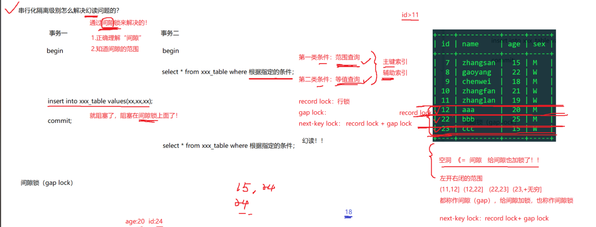

## 串行化隔离级别如何解决幻读？
在 **串行化隔离级别**下，MySQL 使用 **间隙锁（Gap Lock）** 来防止幻读的发生。

## 间隙锁的概念
- **间隙锁（Gap Lock）** 是一种锁定记录之间“间隙”的机制。
- 它不仅锁定了查询结果中的具体行（行锁/Record Lock），还锁定了这些行之间的“间隙”。
- **通过锁定间隙，防止其他事务在这些间隙中插入新数据。**
- ### **空洞:** 就是 间隙
- ### 第一个结果的前面间隙 -- 也加了间隙锁

## Next-Key Lock-**临键锁**
- **Next-Key Lock** 是 **行锁（Record Lock）** 和 **间隙锁（Gap Lock）** 的组合。--- **范围锁**
- 它锁定了查询结果中的行以及这些行之间的间隙。
- **范围**：`左开右闭`，例如 `(11, 12]`。

---

## 间隙锁的作用
- 防止其他事务**在查询范围内**插入新数据。
- 确保事务的查询结果在整个事务期间保持一致。

## 示例
> 修改为 手动提交,  以及 串行化 隔离级别
>
> ```sql
> set @@autocommit = 0;
> set transaction_isolation='serializable';
> ```
>
> ```sql
> // 2
> select * from user where age>25;
> ```
>
> ```sql
> // 1
> insert into user(name,age,sex) values('gap',25,'man');
> ```
>
> 


## 注意

X 与 S 不能共存

即使 先 S ,后X 也不行

---

## 为什么间隙锁能防止幻读？
- 在事务 1 查询时，间隙锁锁定了所有可能插入新数据的范围。
- 事务 2 无法在这些范围内插入新数据，因此事务 1 的查询结果不会发生变化。


## 问题-补充

> 如果说 是在查询的范围内 加 间隙锁, 如果, 查到的 不是连在 一起的, 这个 会 锁 从第一个查到的, 到 最后一个查到的 以及 空洞吗?
>
> - **InnoDB 会自动按照索引顺序加锁**，无论查询结果的顺序如何。
> - 这确保了加锁的一致性和避免死锁的可能性。
> - 如果查询没有使用索引，则会触发 **表锁**，而不是行锁或间隙锁。

## 总结
- **幻读问题**：事务间并发导致查询结果不一致。
- **解决方法**：通过 **间隙锁（Gap Lock）** 和 **Next-Key Lock**，锁定查询范围内的行和间隙，防止其他事务插入新数据。
- **串行化隔离级别**：通过严格的锁机制，确保事务的完全隔离，避免幻读问题。

这种机制虽然解决了数据一致性问题，但会降低并发性能，因此需要根据实际场景权衡使用。


# 索引-补充

b+索引会自动排序!!!

不然, b+ 怎么进行范围查询呢!!!

> ### 1. **B+ 树索引**
>
> - 大多数数据库（如 MySQL 的 InnoDB 存储引擎）使用 B+ 树结构来实现索引。
> - B+ 树索引会**将数据按照索引列的值进行排序**，并存储在叶子节点中。
> - 如果是主键索引（聚簇索引），数据行会**按照主键值的顺序存储**。
> - 如果是辅助索引（非聚簇索引），叶子节点存储的是索引列的值和对应的主键值，**索引列的值也是有序的**。
>
> ### 2. **哈希索引**
>
> - **哈希索引不会排序**，因为它是基于哈希函数计算的，适用于等值查询（如 `=`）。
> - 哈希索引不支持范围查询（如 `>`, `<`）。
>
> ### 3. **自动排序的作用**
>
> - **范围查询**：由于索引是有序的，范围查询（如 `BETWEEN`、`>`, `<`）可以高效地利用索引。
> - **ORDER BY 优化**：如果查询的 `ORDER BY` 子句与索引的排序一致，数据库可以直接利用索引，而无需额外排序。


# 间隙锁-辅助索引(二)

## 注意理解本节的内容-补充

> ### 对于 主键索引-- 如果主键 不是 自增, 而是手动, 将会和 辅助索引一样
>
> 已进行 测试

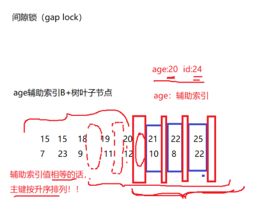

## 辅助索引与B+树结构

- 辅助索引（Secondary Index）在B+树的叶子节点存储的是索引值和对应的主键值。
- 辅助索引的值是可以重复的，但主键值是唯一的。
- ### 当**辅助索引值相同**时，**主键值按升序排列**。

## 示例分析

> #### 查询条件：`SELECT * FROM user WHERE age > 20`
>
> - **加锁范围**：
>
>   - 行锁：`age = 21, 22, 25` 的记录。
>
>   - 间隙锁：`20-21, 21-22, 22-25, >25` 的间隙。
>
>     
>
> #### 插入操作：
>
> - 插入 `age = 19`：成功，因为 `19` 不在加锁范围内。
> - 插入 `age = 20`：失败，因为 `20` 落在 `20-21` 的间隙锁范围内。
> - 插入 `age = 18`：成功，因为 `18` 不在加锁范围内。
>
> #### 查询未使用索引的情况：
>
> - 如果查询未使用索引（例如 `age > 18`），可能会加表锁，导致整个表被锁住，任何插入操作都会被阻塞。


## 索引-锁-优化

通过 `EXPLAIN` 查看查询**是否使用了索引**

- ### MySQL 在查询时可能会选择**不使用索引**（例如，当全表扫描的代价与索引扫描相差不大时）。

  where 条件 使得 进行了 全表查询

- ### 如果**查询未使用索引**，则**可能会加表锁**而不是行锁或间隙锁。


## 注意!!>=-本节重点汇总

> ### age **>** 25:   **25-26**, 26-最大  都加间隙锁
>
> ### age **>=** 25:   **24-25**,25-最大 都加间隙锁
>
> ### 感觉 实际就是 加 **找到的第一行** **前面的 间隙** 锁
>
> ### 串行化, 一定是 行锁吗?---explain


# 间隙锁(三)

## 回顾

> ### (一)是正确理解间隙
>
> ### (二)是正确理解间隙范围
>
> ### 本节 主要是 等值查询 的间隙锁


## 等值-主键索引

> ### where 主键, 等值查询, 不可能 幻读, **主键 不能重复**


## 等值-辅助索引

要从 **辅助索引 b+树** 来去看 和理解


> insert 时
>
> 13,14 能成功
>
> 15不行, 因为按主键排序, 只会在 间隙锁那里
>
> 19可以 还是 主键排序, 不过在后面


# MVCC和undo log(一)

## 面试重点

已提交读

可重复读

## MVCC（多版本并发控制）

- 是**InnoDB存储引擎**实现已提交读和可重复读隔离级别的底层原理。
- 提供了**快照读**（非锁定读），通过多版本数据实现并发控制。

---

## MVCC的实现原理
> **两种读取方式**：
>
> - **锁定读**：读取时加锁（S锁或X锁）。
> - **非锁定读**：通过MVCC实现的**快照读**，无需加锁。
>
> **关键技术：Undo Log（回滚日志）**：
>
> - **作用**：
>   1. **事务回滚**：记录修改前的数据，用于事务失败时回滚。
>   2. **快照读**：提供MVCC的非锁定读功能。
> - **原理**：
>   - 每次数据修改时，修改前的数据会存储在Undo Log中。
>   - 当前数据行通过`DB_TRX_ID`（事务ID）和`DB_ROLL_PTR`（指向旧版本的指针）形成一个链表，指向修改前的旧版本数据。

---

## Undo Log的原理和结构
> 1. **额外字段**：
>    
>    - **DB_TRX_ID**：记录修改该行数据的事务ID。  一个事务里, 在该事务里, 是不会变的
>    - ### **DB_ROLL_PTR**：指向Undo Log中**旧版本数据**的指针。
>    - **ROW_ID**：行ID，用于唯一标识每行数据（与主键相关）。--- 若创建表没有主键列, InnoDB会自动 在这里 加唯一标识
>    
> 2. **数据版本链表**：
>    
>    - 当前数据行通过`DB_ROLL_PTR`指向Undo Log中的旧版本数据。
>    - ### 形成一个**链表结构**，支持事务回滚和快照读。
>

---

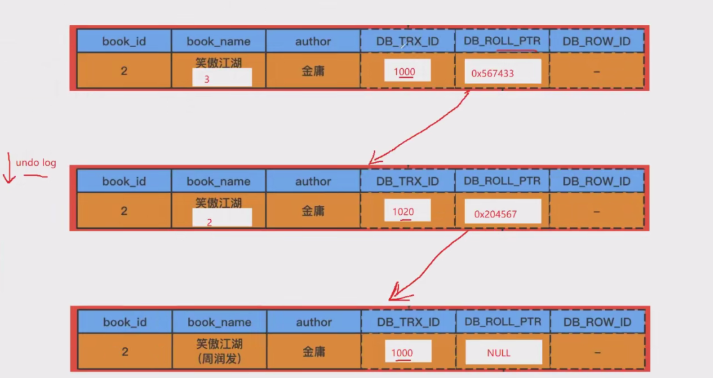

> 图中, 下面是 就是 旧数据
>
> 上面是 新数据

## 总结

- **Undo Log** 是MVCC的核心，支持事务回滚和快照读。
- **快照读** 通过访问Undo Log中的旧版本数据实现，避免加锁，提高并发性能。
- **事务隔离级别** 的实现依赖于MVCC（已提交读和可重复读）或锁机制（串行化）。


# MVCC和undo log(二)已提交读

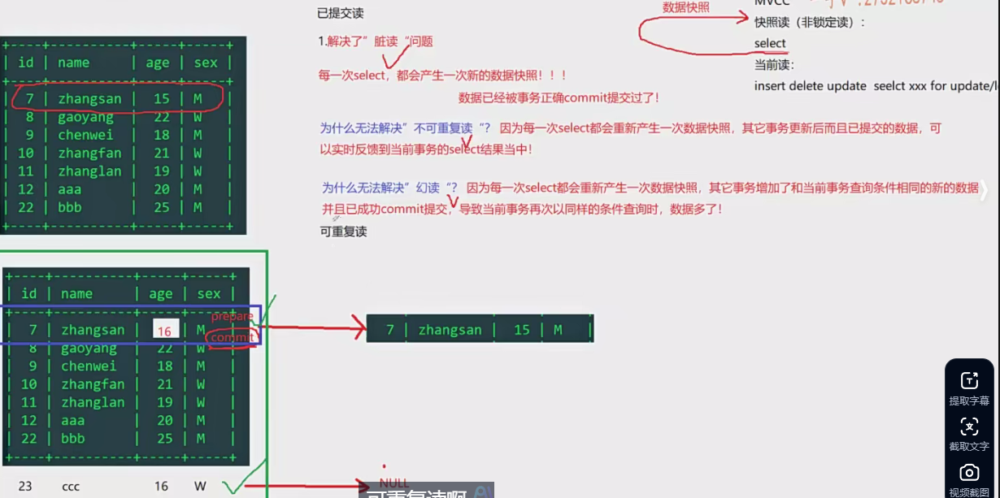

## **已提交读**（Read Committed）隔离级别的原理
- ### **MVCC（多版本并发控制）**：
  
  - **快照读**：读取的是数据的历史版本（拍照时的数据），**无需加锁**。
  - **当前读**：读取的是数据的最新版本（实时数据），**需要加锁**。
- ### **快照生成时机**：  !!!
  
  - **每次**执行 `SELECT` 时，**都会**生成一个新的快照（Read View）。
  
    ### 即使没有 任何改变, 只要`select` 就会产生快照
  - **快照只包含已提交的数据**（`COMMIT` 状态），未提交的数据（`PREPARE` 状态）不会进入快照。

---

## 快照读与当前读

1. **快照读**：
   - 通过 **MVCC 实现**，读取的是历史版本数据。
   - 常见操作：普通的 `SELECT` 查询。
   - 特点：无需加锁，性能高。

2. **当前读**：
   - 读取的是最新版本数据。
   - 常见操作：`INSERT`、`UPDATE`、`DELETE`，以及手动加锁的查询（如 `SELECT ... FOR UPDATE`）。
   - 特点：需要加锁，确保数据一致性。

---

## 已提交读的行为分析-面试

> 注意说明 undo log日志, 对 每行 多加的 字段

> 1. ### **脏读的解决**： 面试
>    
>    - ### 已提交读 使用的是 **非锁定读**, 是**不加锁 读**, **依赖于 MVCC 快照读** 实现  
>    - 事务读取数据时，只能读取到其他事务已提交的数据。
>    - ### 未提交的数据**不会进入快照**，因此无法被读取。
>    
> 2. ### **不可重复读的原因**： !! 
>    
>    - ### commit 后, 修改的 进入了 快照, 再次读, 结果不一样  
>    - 每次 `SELECT` 都会生成新的快照。
>    - ### 如果其他事务**提交了更新操作**，**新的快照会包含最新的数据版本**，导致同一事务中多次读取结果不一致。
>    
> 3. ### **幻读的原因**：
>    
>    - 每次 `SELECT` 都会生成新的快照。
>    - 如果其他事务提交了插入操作，新的快照会包含新增的数据，导致查询结果集发生变化。
>

---

## 总结
- **已提交读的优点**：
  - 通过 MVCC 快照读解决了脏读问题。
  - 性能较高，适合大多数业务场景。

- **已提交读的缺点**：
  - 无法解决不可重复读和幻读问题。
  - 每次查询都会生成新的快照，可能导致结果不一致。

- **核心原理**：
  - **依赖 MVCC 的快照读机制**。
  - 快照**只包含已提交的数据**，未提交的数据不会进入快照。


# MVCC和undo log(二)可重复读

## 可重复读（Repeatable Read）隔离级别的原理
1. **解决的问题**：
  
   - **解决了脏读问题**：与已提交读相同，通过 MVCC 快照读，读取的都是已提交的数据。
   - **解决了不可重复读问题**：同一事务中多次读取同一数据，结果始终一致。
   
2. **未完全解决的问题**：
   - **部分解决幻读问题**：通过快照读避免了新增数据的影响，但在某些情况下（如当前读操作），幻读仍可能发生。

3. **实现方式**：
   - **MVCC（多版本并发控制）**：
     
     - **快照读**：读取的是事务开始时生成的快照数据。
     - **当前读**：读取的是最新版本数据（如 `UPDATE`、`DELETE` 等操作）。
   - ### **快照生成时机**： !!!!
     
     - ### **可重复读**：事务的第一次 `SELECT` 时生成快照，后续查询均基于该快照。
     
       > ### 事务1 先加,未提交,   事务2 再select, 读不到, 因为 没提交!!
       >
       > 可重复读, 是读  提交后的, 不是 未提交 就能看到


---

## 可重复读的行为分析-面试
> 1. **脏读的解决**：
>    
>    - 与已提交读相同，读取的都是已提交的数据。
>    - 未提交的数据不会进入快照，因此无法被读取。
>    
> 2. **不可重复读的解决**：
>    - ### 事务的第一次 `SELECT` 时生成快照，**后续查询均基于该快照**。
>    - 即使其他事务提交了更新操作，当前**事务的查询结果仍然一致。**
>
> 3. **幻读的部分解决**：
>    - 快照读避免了新增数据的影响，因为查询基于事务开始时的快照。
>    - ### 但当前读操作（如 `UPDATE`）会读取最新数据，可能导致幻读。
>    
>      ### update delete insert  是 当前读  ,  不过 **高版本 优化了** 5.7 和8.0 都优化了
>    
>      select ... for update  会导致 幻读
>    
>      ### `不用 这么在意,  实际去 操作就知道了!!`
>

---

## 总结
- **可重复读的优点**：
  - 通过 MVCC 快照读解决了脏读和不可重复读问题。
  - 部分解决幻读问题，性能较高。

- **可重复读的缺点**：
  - 幻读问题未完全解决，当前读操作可能导致幻读。

- **核心原理**：
  - 依赖 MVCC 的快照读机制。
  - 快照在事务的第一次 `SELECT` 时生成，后续查询基于该快照。


---

## 重点理解
1. **快照生成时机**：
   - 已提交读：每次查询生成新的快照。
   - 可重复读：事务的第一次查询生成快照。

2. **当前读与快照读的区别**：
   - 当前读：读取最新数据，可能导致幻读。
   - 快照读：读取快照数据，避免了幻读。

3. **事务内的可见性**：
   - 当前事务可以看到自己修改的数据，即使这些数据未提交。

---


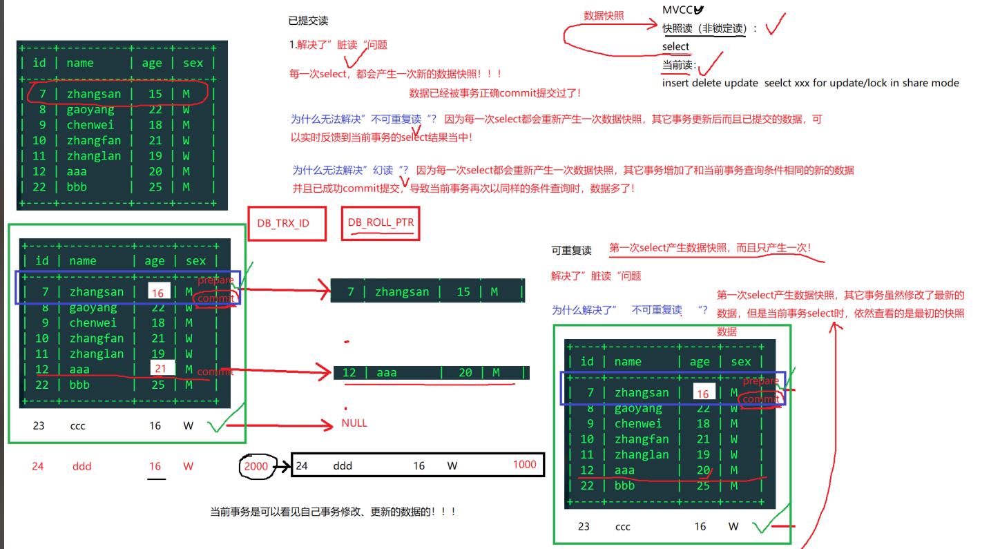


# 意向共享锁和意向排他锁

## 主要意义

> ### 可以 **快速 判断** **能否获得** `表锁`
>
> ### 而**不需要 取逐行** 判断-- 因为你不知道 这个表里 有没有 行 是 X锁 , 有了, 就不能 整表 X了

## 意向锁的定义
- ### **意向锁**是**表级别**的锁，用于**协调表锁和行锁之间**的关系。
- **意向共享锁（IS）**：表示事务计划对某些行加共享锁（S锁）。 

  ### 事务计划给记录加行共享锁，事务在给一行记录加共享锁前，必须先取得该表的 IS 锁。
- **意向排他锁（IX）**：表示事务计划对某些行加排他锁（X锁）。

  ### 事务计划给记录加行排他锁，事务在给一行记录加排他锁前，必须先取得该表的 IX 锁。

---

## 意向锁的作用
意向锁的主要目的是**提高获取表锁的效率**，**避免在获取表锁时需要扫描表中所有行的锁状态**。它通过以下方式实现：
- 当事务需要获取表的共享锁（S锁）或排他锁（X锁）时，可以通过检查表上的意向锁（IS或IX）快速判断是否有冲突。
- 避免逐行检查表中每一行的锁状态，从而提升性能。

---

## 意向锁的特点
- ### **自动加锁**：意向锁是由`InnoDB存储引擎自动加上`的，`用户无法手动加意向锁`。
- ### **兼容性**：意向锁之间（IS与IS、IX与IX、IS与IX）是**兼容的**，不会产生冲突。
- ### **冲突检测**：`意向锁与表锁`（S锁、X锁）之间`会产生冲突`，用于快速判断是否可以获取表锁。

  ### 不是 行锁, 是表锁

---

## 意向锁的使用场景
- **行锁与表锁的共存**：当事务对表中的某些行加锁时，会自动在表上加意向锁，表明该表的某些行已被加锁。
- **快速判断表锁的可用性**：在获取表锁时，通过检查表上的意向锁，可以快速判断是否有其他事务对表中的行加了冲突锁。

---

## 兼容性矩阵
以下是意向锁与表锁的兼容性表（简化版）：

> 注意, 意向锁 只有 IX, IS
>
> 表锁只有 X S  
>
> ### 注意 X  使得 其  不可读,不可写!!  因此 IS 与X 冲突
>
> 不要 不会看表

| 表锁/意向锁 | IS   | IX   | S    | X    |
| ----------- | ---- | ---- | ---- | ---- |
| **IS**      | ✔️    | ✔️    | ✔️    | ❌    |
| **IX**      | ✔️    | ✔️    | ❌    | ❌    |
| **S**       | ✔️    | ❌    | ✔️    | ❌    |
| **X**       | ❌    | ❌    | ❌    | ❌    |

---

## 总结
- **意向锁的核心意义**：通过在表级别加锁，避免在获取表锁时逐行扫描，提高效率。
- **意向锁的本质**：它是表级锁，用于辅助行锁和表锁的协调。
- ### **记忆要点**：
  
  1. 意向锁是针对表锁的，不是针对行锁的。
  2. 意向锁的目的是为了更快速地获取表锁。
  3. 意向锁是由存储引擎自动加的，用户无需手动操作。

# 手动加表锁-补充

> ## 一、MyISAM 引擎支持显式表锁
>
> MyISAM 不支持行锁，只支持表锁，**可以手动加锁**：
>
> ```
> LOCK TABLES 表名 READ;   -- 读锁
> LOCK TABLES 表名 WRITE;  -- 写锁
> ```
>
> 使用后记得解锁：
>
> ```
> UNLOCK TABLES;
> ```
>
> 示例：
>
> ```
> LOCK TABLES users WRITE;
> 
> -- 执行对 users 表的写操作
> 
> UNLOCK TABLES;
> ```
>
> ------
>
> ## 二、InnoDB 引擎默认使用行级锁，但也支持表锁（通过 `LOCK TABLES`）
>
> InnoDB 引擎默认支持**行级锁**，可以在事务中隐式加锁（例如 `SELECT ... FOR UPDATE`），但它也支持显式加表锁，方式与 MyISAM 相同：
>
> ```
> LOCK TABLES 表名 READ;
> LOCK TABLES 表名 WRITE;
> ```
>
> 注意事项：
>
> - 如果你使用了 `LOCK TABLES`，即使是 InnoDB 也只会使用表锁，不再使用行锁。
> - 使用表锁后，InnoDB 也会**自动提交当前事务**（⚠️）。
>
> ------
>
> ## 三、在 InnoDB 中建议使用行锁的方式加锁（更细粒度）
>
> 行锁使用语句：
>
> ```
> START TRANSACTION;
> SELECT * FROM 表名 WHERE id=1 FOR UPDATE;  -- 加写锁
> -- 或
> SELECT * FROM 表名 WHERE id=1 LOCK IN SHARE MODE;  -- 加读锁
> ```
>
> ## 总结：MySQL 手动加锁的方式
>
> | 类型                  | 加锁方式                     | 说明                             |
> | --------------------- | ---------------------------- | -------------------------------- |
> | 表锁（MyISAM/InnoDB） | `LOCK TABLES ... READ/WRITE` | 全表加锁，适合读多写少、简单应用 |
> | 行锁（InnoDB）        | `SELECT ... FOR UPDATE` 等   | 更细粒度控制，推荐用于事务       |


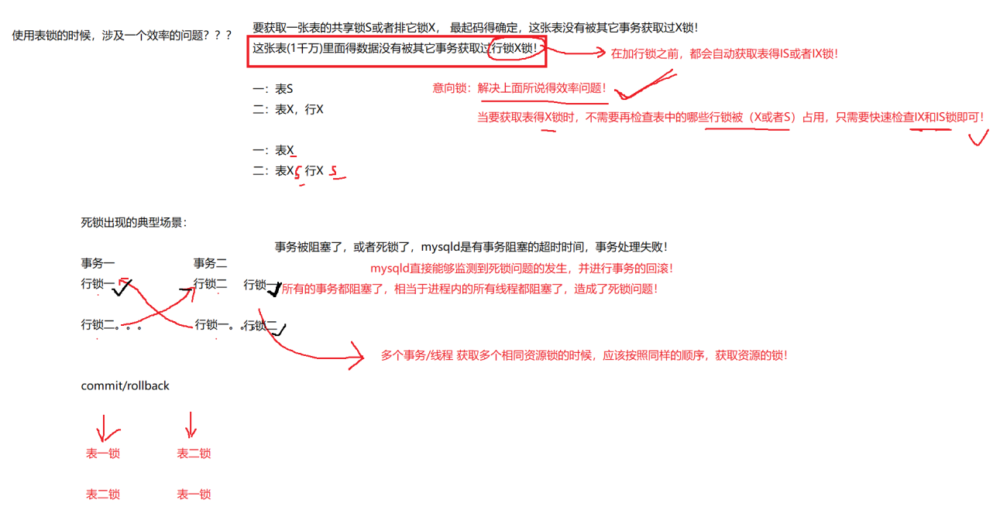

# 死锁

## 看一下 老师 博文--死锁分析

gdb 调试 死锁

好的，这是一段关于数据库锁机制和死锁问题的详细讲解，主要涉及MySQL的表锁和行锁，以及如何避免和处理死锁问题。以下是内容的简要总结和关键点提炼：

---

## 不同引擎的死锁
- MyISAM存储引擎 **只有表锁**
  
  - 因为锁定的是整个表，**不会发生死锁**。
- ### InnoDB存储引擎 支持 行锁
  
  - ### 支持更高的并发，**但可能发生死锁**。

---

## 死锁的发生条件
- ### 死锁通常发生在**多个事务**尝试**以不同顺序**获取相同资源的锁时。
- 典型场景：
  - 事务1先获取资源A的锁，再尝试获取资源B的锁。
  - 事务2先获取资源B的锁，再尝试获取资源A的锁。
  - 两个事务互相等待对方释放锁，导致死锁。

---

## MySQL对死锁的处理

- InnoDB存储引擎：
  - 自动检测死锁。
  - ### **回滚**其中一个事务以解除死锁。 -- 这是 自动回滚
  - 提示`Deadlock found when trying to get lock`错误信息。
  - 将需要 重新 开启一个事务
- **MyISAM存储引擎**：
  
  - ### 不支持事务，因此不会发生死锁。

---

## 避免死锁的建议-不用全背


- **统一资源锁的获取顺序**：
  - 所有事务按照相同的顺序获取资源锁。
- **减少事务的大小**：
  - 小事务减少锁冲突的概率。
- **设计合理的索引**：
  - 使用索引访问数据，使加锁更精准，减少锁冲突。
- **尽量使用较低的隔离级别**：
  - 根据业务需求选择适当的隔离级别（如已提交读或可重复读）。
- **避免显示加锁**：
  - 非必要情况下，不使用`FOR UPDATE`或`LOCK IN SHARE MODE`手动加锁。

---

## 间隙锁（Gap Lock）
- **优化**：
  - 尽量使用等值查询，减少间隙锁的影响。

---

## 实践与面试建议
- 理解理论的同时，结合实际场景进行实践。
- 在面试中，结合具体案例（如死锁的调试和解决）进行说明，更具说服力。


# redo log-结合pdf图

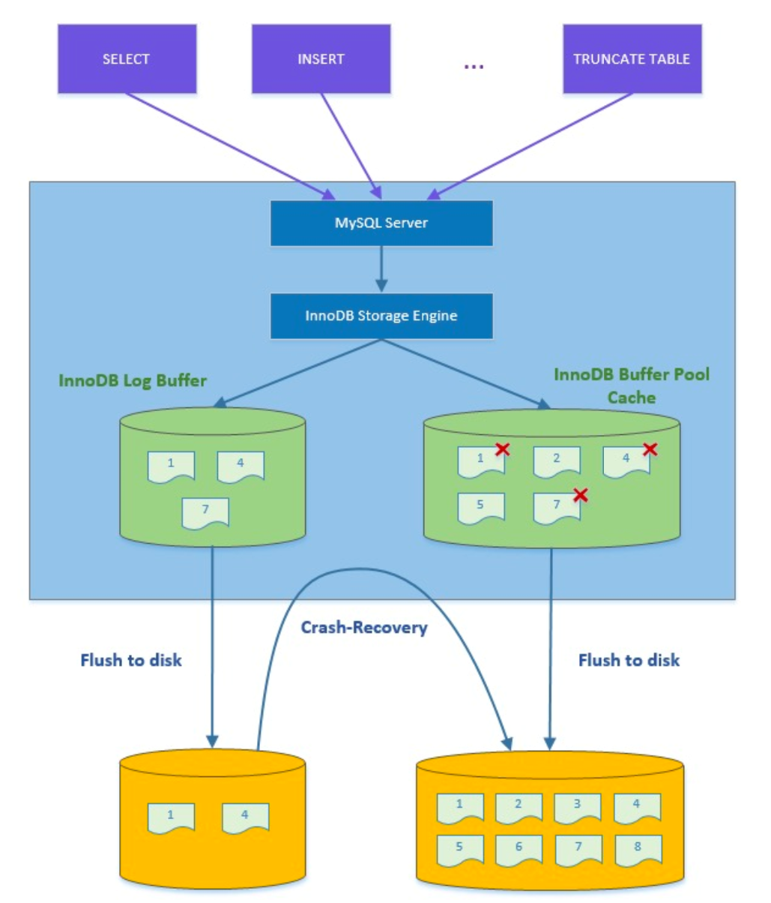

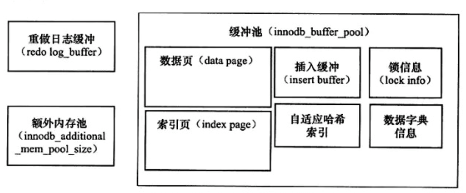

## `redo log` 的核心作用

> 1. **保证事务的持久性（Durability）**：
>    
>    - 当事务提交（`commit`）成功后，即使发生掉电、服务崩溃等异常，`redo log` 也能确保数据恢复到事务提交后的状态。
>    - 这是事务 ACID 特性中 **持久性** 的体现。
>    
> 2. **记录事务的修改**：
>    - `redo log` 记录的是事务对数据页的修改内容（物理日志），而**不是具体的 SQL 操作**。
>    - ### 事务从 `begin` 开始时，`redo log` 就开始记录，而不是等到 `commit` 时才记录。
>    
>      
>
> > [!important]
> >
> > ### 必须明白 **redo log的 具体 作用**  --- 保证持久性
> >
> > ### 什么是 持久性: 只要事务 被commit, 不管是断电还是崩溃, 重启后, 仍能 恢复 commit的 数据, 保证 数据 持久性

---

## `redo log` 的工作机制
> 1. **写入流程**：
>    
>    - 数据修改时，首先记录到 `redo log buffer`（内存中的日志缓冲区）。
>    - 当事务提交时，`redo log buffer` 的内容会被刷新到磁盘上的 `redo log` 文件中。
>    - 事务提交成功的标志是 `redo log` 写入磁盘并标记为 `commit` 状态。
>    
> 2. **与数据写入的关系**：
>    
>    - 数据的修改首先发生在 `buffer pool`（内存中的数据缓存区）中，而**不是直接写入磁盘**。
>    - `redo log` 的写入优先于数据的写入，事务提交时**只需确保 `redo log` 写入成功**，而**数据的写入可以延后**。
>    
> 3. **异常恢复**：
>    
>    - 如果在事务提交后发生异常（如掉电），`MySQL` 会通过 `redo log` 恢复数据到事务提交后的状态。
>    - 如果在事务回滚过程中发生异常，也可以通过 `redo log` 和 `undo log` 恢复到事务开始前的状态。
>    
> 4. ### 注意: `undo log` 也是 记录在 `redo log` 中
>

---

## `undo log`在`redo log` 中

> `undo log` 的确也会被记录在 `redo log` 中。这是因为：
>
> 1. **`undo log` 的持久性**：
>    - `undo log` 是用来支持事务回滚的，它记录了数据修改前的状态（逻辑日志）。
>    - ### 为了保证事务的原子性（Atomicity），`undo log` 本身也需要具备持久性。
>    - 因此，`undo log` 的内容会被记录到 `redo log` 中，以确保在系统崩溃后，`undo log` 也能被恢复。
>
> 2. ### **回滚过程中的异常处理**：
>    
>    - 如果在**事务回滚过程中发生异常（如掉电）**，`redo log` 中的 `undo log` 记录可以用来继续完成未完成的回滚操作。
>    - 这进一步保证了事务的原子性（**要么完全成功，要么完全失败**）。
>    
>    > 当回滚操作中途失败时，MySQL 通过以下机制确保回滚能够继续完成：
>    >
>    > 1. `undo log` 的链式结构，记录回滚的顺序。
>    > 2. `redo log` 中的 `undo log` 记录，用于恢复 `undo log`。
>    > 3. 回滚操作的幂等性，确保重复执行不会影响一致性。
>    > 4. 崩溃恢复机制，自动完成未完成的回滚。
>    > 5. `undo log` 的状态标记，明确回滚的进度。
>    
> 3. **写入顺序**：
>    
>    - 当事务执行时，`undo log` 会先记录到内存中（`undo log buffer`）。
>    - 随后，`redo log` 会记录 `undo log` 的内容，以确保其持久化。
>
> ---
>
> ### **总结**
> `undo log` 是事务回滚的关键，而 `redo log` 是事务持久性的保障。通过将 `undo log` 的内容记录到 `redo log` 中，MySQL 能够在崩溃恢复时同时保证事务的原子性和持久性。这种设计使得 MySQL 的事务机制更加健壮和可靠。

## `redo log` 的特点

> 1. **物理日志**：
>    - 记录的是**数据页**的修改内容，而不是具体的 SQL 操作。
>    - 与 `undo log`（逻辑日志）不同，`undo log` 记录的是 SQL 操作对数据的影响。
>
> 2. **性能优化**：
>    - 通过 `redo log buffer` 缓存日志，**减少直接写磁盘的 I/O 操作**，提高性能。
>    - 数据的写入由**后台线程**在合适的时机完成，而**不是与事务提交同步**。
>

---

## 相关大小
1. **`innodb_log_buffer_size`**：
  
   - `redo log buffer` 的大小，默认值为 16MB。   

     `show engine InnoDB status\G` 
   
      `show variables like 'innodb_buffer_pool%;'`   ---  这个 不就是 前面 插入200w 速度慢 改了吗
   - 如果事务较大，可以适当增大该值以减少磁盘 I/O。
   
2. **`innodb_buffer_pool_size`**：
  
   - 数据缓存区（`buffer pool`）的大小，默认值较大（如 134MB）。
   - 用于缓存数据页和索引页，减少磁盘 I/O。

---

## 日志路径

> ### **1. `redo log`**
> - **文件位置**：
>   
>   ```
>   #innodb_redo
>   ```
>   - 这是 MySQL 8.0 中 `redo log` 的存储文件。
>   - 从 MySQL 8.0 开始，`redo log` 默认存储在一个名为 `#innodb_redo` 的目录中，而不是像早期版本那样使用 `ib_logfile0` 和 `ib_logfile1`。
>
> ---
>
> ### **2. `undo log`**
> - **文件位置**：
>   ```
>   undo_001
>   undo_002
>   ```
>   - 这是 `undo log` 的独立表空间文件。
>   - 从 MySQL 8.0 开始，`undo log` 默认存储在独立的表空间中，而不是共享表空间（如 `ibdata1`）。
>
> ---
>
> ### **3. 其他相关文件**
> - **`ibdata1`**：
>   - 这是 InnoDB 的系统表空间文件，存储了一些元数据和历史数据。
>   - 在 MySQL 8.0 中，`undo log` 已经从 `ibdata1` 中分离出来。
>
> - **`ibtmp1`**：
>   - 临时表空间文件，用于存储临时表和临时数据。
>
> - **`binlog.*`**：
>   - 二进制日志文件（`binlog`），用于记录所有对数据库的更改（如 `INSERT`、`UPDATE` 等），主要用于主从复制和数据恢复。
>
> ---
>
> ### **总结**
> - **`redo log` 文件**：`#innodb_redo`
> - **`undo log` 文件**：`undo_001` 和 `undo_002`
> - **其他相关文件**：
>   - `ibdata1`：系统表空间文件
>   - `ibtmp1`：临时表空间文件
>   - `binlog.*`：二进制日志文件
>
> 这些文件通常位于 MySQL 的数据目录中，可以通过以下命令查看数据目录路径：
> ```bash
> SHOW VARIABLES LIKE 'datadir';
> ```

## 总结

- **`redo log` 的核心功能**：保证事务的持久性。
- ### **事务提交的关键**：确保 `redo log` 写入磁盘成功，而不是立即将数据写入磁盘。
- **异常恢复**：通过 `redo log` 恢复事务提交后的数据状态。


## redo log数据是什么形式呢?

自行了解, 可以看源码


# 25-05-15

# mysql优化问题

## SQL语句和索引的优化
- **慢查询日志**：
  - 开启慢查询日志（`slow query log`），设置合理的慢查询时间。
  - 分析慢查询日志，定位性能瓶颈。
- **执行计划分析**：
  - 使用 `EXPLAIN` 分析 SQL 执行计划，优化查询。
- **常见优化措施**：
  - 使用**分页减少**数据量。
  - 确保索引的正确使用（如**多列索引需用到第一列**）。
  - 优化多表查询，**避免子查询**,会有中间表，使用连接（如左连接、右连接）。
  - **避免产生中间表**，合理设计索引。

---

## 应用层的优化
- **连接池**：   -- 老师教了
  
  - 引入**数据库连接池**，减少频繁建立和断开连接的开销。
  - 配置连接池参数（如最大连接数、初始连接数、超时时间）。
- **缓存**：
  
  - 使用 **Redis 等缓存中间件**存储**热点数据**，**减少对 MySQL 的直接访问**。
  - 缓存访问流程：
    1. 先查询缓存（如 Redis）。
    2. 如果缓存命中，直接返回结果。
    3. 如果缓存未命中，查询 MySQL，将结果写入缓存，再返回给用户。
  - ### **注意事项**：  缓存 会引出 这些问题
    
    > ### 不懂...
    >
    > - 解决缓存一致性问题。
    > - 防止缓存穿透、缓存雪崩等问题。
  - ### Redis 的其他功能：
    
    - 发布订阅。
    - 事务处理。
    - 内建数据结构（如哈希、跳跃表、布隆过滤器）。

---

## MySQL服务器参数的优化
- **常见参数调整**：
  - **自适应哈希索引**：
    - 使用 `SHOW ENGINE INNODB STATUS` 查看自适应哈希索引的使用情况。
    - 如果使用率低，可关闭自适应哈希索引。
  - **重做日志缓冲区**：
    - 调整 `innodb_log_buffer_size`，减少磁盘 I/O。
  - **缓冲池大小**：
    - 调整 `innodb_buffer_pool_size`，提高内存利用率。
- **根据硬件配置优化**：
  - 根据服务器性能（如内存、CPU）合理调整参数，提升并发处理能力。

---

## 总结
- 优化不仅限于 MySQL 本身，还包括 SQL 语句、索引设计、应用层优化和服务器参数调整。
- 面试中回答优化问题时，可结合实际项目经验，重点阐述熟悉的优化点。
- 对于 Redis 等中间件，需了解其常见问题及解决方案，以便深入讨论。
- 


# mysql优化问题补充

## MySQL Server 优化参数总结

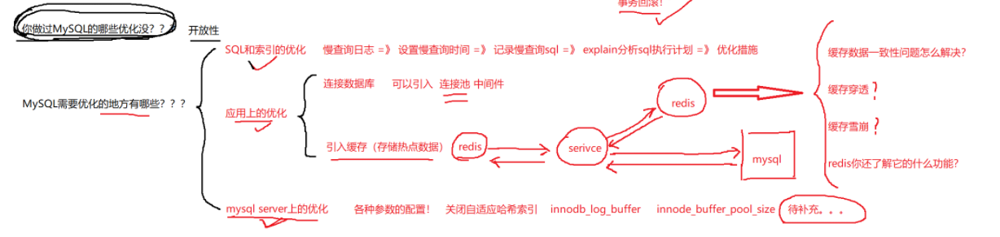

在 MySQL Server 的优化中，主要通过调整配置文件（通常是 `/etc/my.cnf`）中的参数来提升性能。以下是一些常见的优化参数及其作用：

> #### 1. **查询缓存（Query Cache）**
>
> ```sql
> show variables like '%query_cache%';  
> 
> ```
>
> ### 查询缓存**在 MySQL 8.0 中已被移除**
>
> - **作用**：
>   
>   - 缓存 `SELECT` 查询的结果，减少重复查询的开销。
> - ### **适用场景**：
>   
>   - 适合查询频繁但更新较少的表。
> - ### **注意事项**：
>   
>   - 更新操作（`INSERT`、`UPDATE`、`DELETE`）会清空查询缓存。
>   - 查询缓存过多的添加和删除可能影响性能。
>   
>   ### 基于这些缺点, 8.0 版本 移除了 查询缓存
> - **相关参数**：
>   - `query_cache_size`：查询缓存的大小。
>   - `query_cache_type`：是否开启查询缓存。
> - **优化建议**：
>   
>   - 如果查询多、更新少，可以开启查询缓存并适当增大缓存大小。
>   - 对于更新频繁的场景，不建议使用查询缓存。
>
> ---
>
> #### 2. **索引和数据缓存**
> - **参数**：
>   - `innodb_buffer_pool_size`：InnoDB 缓冲池大小，用于缓存索引和数据。
>   - **作用**：
>     - 减少磁盘 I/O，提高查询性能。
>   - **优化建议**：
>     - 根据服务器内存大小合理设置，通常设置为物理内存的 50%-80%。
>
> ---
>
> #### 3. **线程缓存（Thread Cache）**
>
> ```sql
>  show variables like '%thread_cache%';
> ```
>
> 
>
> - **作用**：
>   - 缓存线程，减少频繁创建和销毁线程的开销。
> - **相关参数**：
>   - `thread_cache_size`：线程缓存的数量。
> - **优化建议**：
>   - 根据服务器性能（如 CPU 核心数）调整线程缓存大小，提高并发处理能力。
>
> ---
>
> #### 4. **并发连接和超时时间**
>
> ```sql
>  show variables like '%connect%';
> ```
>
> 
>
> - **参数**：
>   - `max_connections`：最大并发连接数。  默认 151   压测 时, 容易出现瓶颈, 需要修改
>   
>     配置文件 添加    `max_connections=2000;`
>   - `wait_timeout`：连接的超时时间（单位：秒）。   
>   
>     配置文件 添加   `wait_timeout=60;`
> - **作用**：
>   
>   - 控制 MySQL Server 的最大连接数和空闲连接的超时时间。
> - **优化建议**：
>   - 根据业务需求和服务器性能调整 `max_connections`。
>   - 设置合理的 `wait_timeout`，避免长时间空闲连接占用资源。
>
> ---
>
> #### 5. **二进制日志（Binary Log）**
> - **参数**：
>   - `log_bin`：是否开启二进制日志。
> - **作用**：
>   - 用于数据恢复和主从复制。
> - **优化建议**：
>   - 在需要主从复制或数据恢复的场景下开启。
>
> ---
>
> #### 6. **其他优化参数**
> - **自适应哈希索引**：
>   - 参数：`innodb_adaptive_hash_index`。
>   - 作用：提高查询性能。
>   - 优化建议：如果使用率低，可以关闭以减少性能开销。
> - **重做日志缓冲区**：
>   - 参数：`innodb_log_buffer_size`。
>   - 作用：减少磁盘 I/O。
>   - 优化建议：根据写入频率调整缓冲区大小。
>

---

## 总结
- **优化思路**：
  - 根据业务场景和服务器性能调整参数。
  - 查询多、更新少时，可开启查询缓存。
  - 合理设置线程缓存、并发连接数和超时时间。
  - 充分利用内存，调整缓冲池大小。
- **学习建议**：
  - 阅读 MySQL 官方文档，了解更多参数。
  - 多实践，通过压测验证优化效果。


# mysql日志系统

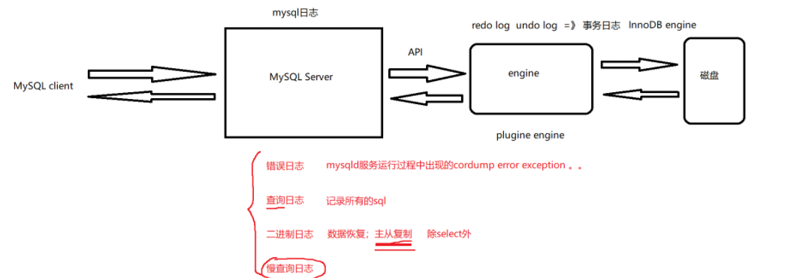

## 事务日志

> ### 产生于 存储引擎层

- **Redo Log（重做日志）**：
  - 用于恢复已提交事务的数据。
  - 由 InnoDB 存储引擎生成。
- **Undo Log（回滚日志）**：
  - 用于事务回滚，保证事务的原子性。
  - 由 InnoDB 存储引擎生成。


## MySQL Server 层日志

```sql
show variables like 'log_%';
```

MySQL Server 层的日志与存储引擎无关，适用于所有存储引擎。主要包括以下四种：

> ##### （1）**错误日志（Error Log）**
> - **作用**：
>   - 记录 MySQL Server 启动、运行和停止过程中发生的错误和警告。
>   - 用于排查服务启动失败或运行异常的问题。
> - **存储位置**：
>   
>   - 默认路径：`/var/log/mysql/error.log`。 8.0
>   - 可通过 `log_error` 参数自定义路径。
> - **配置示例**：
>   ```ini
>   [mysqld]
>   log_error=/var/log/mysql/error.log
>   ```
>
> ---
>
> ##### （2）**查询日志（General Query Log）**
> - **作用**：
>   - 记录所有客户端发送的 SQL 语句（包括增删改查）。
> - **注意事项**：
>   - 查询日志会记录大量信息，开启后可能影响性能。
>   - 通常仅在调试时开启。
> - **配置示例**：
>   ```ini
>   [mysqld]
>   general_log=ON
>   general_log_file=/var/lib/mysql/<主机>.log
>   ```
>
> ---
>
> ##### （3）**慢查询日志（Slow Query Log）**
>
> ```sql
> show variables like '%slow_query%';
> ```
>
> 
>
> - **作用**：
>   - 记录执行时间超过指定阈值的 SQL 语句。
>   - 用于分析和优化慢查询。
> - **相关参数**：
>   - `slow_query_log`：是否开启慢查询日志。
>   - `long_query_time`：慢查询的时间阈值（单位：秒）。
> - **配置示例**：
>   ```ini
>   [mysqld]
>   slow_query_log=ON
>   slow_query_log_file= /var/lib/mysql/<主机名>-slow.log    默认
>   long_query_time=2
>   ```
> - **分析工具**：
>   - 使用 `EXPLAIN` 分析慢查询语句的执行计划。
>
> ---
>
> ### （4）**二进制日志（Binary Log）**!!!
> - **作用**：
>   
>   - 记录所有对数据库进行更改的操作（如 `INSERT`、`UPDATE`、`DELETE`）。
>   - ### 不记录查询操作（如 `SELECT`）。
>   
>     和 查询日志 互补
> - **主要用途**：
>   1. **数据恢复**：通过重放二进制日志恢复数据。
>   2. **主从复制**：主库将二进制日志同步到从库，实现数据同步。
> - **相关参数**：
>   - `log_bin`：是否开启二进制日志。
>   - ### `server_id`：MySQL Server 的唯一标识（主从复制时必须配置）。
>   
>     否则 开启不了 mysqld
>   - `expire_logs_days`：设置二进制日志的过期时间。
> - **配置示例**：
>   ```ini
>   [mysqld]
>   log_bin=/var/log/mysql_bin.log
>   server_id=1
>   expire_logs_days=7
>   ```
> - **注意事项**：
>   - ### 二进制日志文件可能**占用大量磁盘空间**，需设置过期时间清理旧日志。
>

---

## 日志的重要性
- **排查问题**：
  - 错误日志是排查服务启动或运行异常的关键工具。
- **性能优化**：
  - 慢查询日志帮助定位性能瓶颈。
- **数据安全**：
  - 二进制日志用于数据恢复和主从复制，保障数据一致性。

---

## 日志的持久化配置

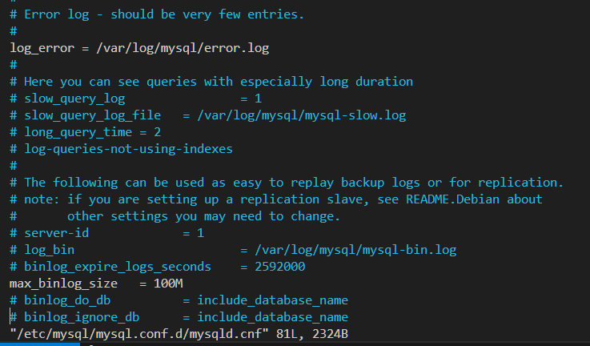

- 在配置文件中添加日志相关参数。
- 修改配置后需重启 MySQL 服务以生效：
  ```bash
  sudo service mysqld restart
  ```


# binlog

## mysql自带工具--了解即可,太多

> ### 1. **`mysql`**
> - **功能**：
>   - MySQL 的命令行客户端，用于连接和操作 MySQL 数据库。
> - **常用命令**：
>   ```bash
>   mysql -u root -p
>   ```
>   - 连接 MySQL 数据库。
>   ```sql
>   SHOW DATABASES;
>   USE database_name;
>   SELECT * FROM table_name;
>   ```
>
> ---
>
> ### 2. **`mysqldump`**
> - **功能**：
>   - 用于备份 MySQL 数据库或表。
> - **常用命令**：
>   - 备份整个数据库：
>     ```bash
>     mysqldump -u root -p database_name > backup.sql
>     ```
>   - 备份多个数据库：
>     ```bash
>     mysqldump -u root -p --databases db1 db2 > backup.sql
>     ```
>   - 备份所有数据库：
>     ```bash
>     mysqldump -u root -p --all-databases > backup.sql
>     ```
>   - 恢复数据：
>     ```bash
>     mysql -u root -p database_name < backup.sql
>     ```
>
> ---
>
> ### 3. **`mysqlbinlog`**
> - **功能**：
>   - 用于查看和操作二进制日志（Binary Log）。
> - **常用命令**：
>   - 查看二进制日志内容：
>     ```bash
>     mysqlbinlog /path/to/binlog.000001
>     ```
>   - 恢复数据：
>     ```bash
>     mysqlbinlog /path/to/binlog.000001 | mysql -u root -p
>     ```
>
> ---
>
> ### 4. **`mysqladmin`**
> - **功能**：
>   - 用于管理 MySQL 服务器（如启动、关闭、监控等）。
> - **常用命令**：
>   - 检查服务器状态：
>     ```bash
>     mysqladmin -u root -p status
>     ```
>   - 重启 MySQL 服务：
>     ```bash
>     mysqladmin -u root -p shutdown
>     ```
>
> ---
>
> ### 5. **`mysqlcheck`**
> - **功能**：
>   - 用于检查、修复和优化 MySQL 数据库表。
> - **常用命令**：
>   - 检查表：
>     ```bash
>     mysqlcheck -u root -p database_name
>     ```
>   - 修复表：
>     ```bash
>     mysqlcheck -u root -p --repair database_name
>     ```
>   - 优化表：
>     ```bash
>     mysqlcheck -u root -p --optimize database_name
>     ```
>
> ---
>
> ### 6. **`mysqld_safe`**
> - **功能**：
>   - 用于安全启动 MySQL 服务，通常用于调试或修复问题。
> - **常用命令**：
>   ```bash
>   mysqld_safe --user=mysql &
>   ```
>
> ---
>
> ### 7. **`mysqlimport`**
> - **功能**：
>   - 用于从文本文件中导入数据到 MySQL 表。
> - **常用命令**：
>   ```bash
>   mysqlimport -u root -p --local database_name table_name.txt
>   ```
>
> ---
>
> ### 8. **`mysqlslap`**
> - **功能**：
>   - 用于压力测试 MySQL 数据库。
> - **常用命令**：
>   ```bash
>   mysqlslap -u root -p --concurrency=50 --iterations=10 --query="SELECT * FROM table_name"
>   ```
>
> ---
>
> ### 9. **`myisamchk`**
> - **功能**：
>   - 用于检查和修复 MyISAM 存储引擎的表。
> - **常用命令**：
>   - 检查表：
>     ```bash
>     myisamchk /path/to/table_name.MYI
>     ```
>   - 修复表：
>     ```bash
>     myisamchk --recover /path/to/table_name.MYI
>     ```
>
> ---
>
> ### 10. **`perror`**
> - **功能**：
>   - 用于查看 MySQL 错误代码的含义。
> - **常用命令**：
>   ```bash
>   perror 1045
>   ```
>
> ---
>
> ### 11. **`innochecksum`**
> - **功能**：
>   - 用于检查 InnoDB 表空间文件的校验和。
> - **常用命令**：
>   ```bash
>   innochecksum /path/to/ibdata1
>   ```
>
> ---
>
> ### 12. **`pt-query-digest`**（Percona 工具）
> - **功能**：
>   - 分析慢查询日志，优化 SQL 性能。
> - **常用命令**：
>   ```bash
>   pt-query-digest /path/to/slow_query.log
>   ```
>
> ---
>
> ### 总结
> MySQL 自带的工具涵盖了数据库管理、备份恢复、日志分析、性能优化等多个方面。熟练使用这些工具可以大大提高数据库运维和管理的效率。

## 二进制日志的作用

- **数据恢复**：
  - 当数据库发生误操作（如删除数据或表）时，可以通过二进制日志恢复数据。
  - 恢复的过程是通过重放日志中的操作来还原数据。
- **主从复制**：
  - 主库将二进制日志同步到从库，从库通过重放日志实现数据同步。
  - 二进制日志是主从复制的核心。
  
- 默认路径 :  `/var/log/mysql/binlog`

- ### 查看 MySQL 主库的二进制日志文件列表及其大小

  ```sql
  show master logs;
  ```

  

## 二进制日志的配置

- **配置文件**：~~`/etc/my.cnf`~~

- **常用参数**：

  ```ini
  [mysqld]
  log_bin=/var/log/mysql_bin.log
  server_id=1
  expire_logs_days=7
  ```

  - `log_bin`：开启二进制日志并指定日志文件路径。
  - `server_id`：MySQL Server 的唯一标识（主从复制时必须配置）。
  - `expire_logs_days`：设置日志的过期时间（单位：天）。

## 二进制日志的特点

- **记录内容**：
  - 记录所有对数据库的更改操作（如 `INSERT`、`UPDATE`、`DELETE`）。
  - 不记录查询操作（如 `SELECT`）。
- **存储形式**：
  - 二进制日志以编码形式存储，不能直接查看，需要使用工具解码。
- **日志文件**：
  - ~~日志文件以 `.bin` 为后缀，存储在 MySQL 的数据目录中~~。

## 实践示例

> 1.刷新日志
>
> ```sql
> flush logs;
> ```
>
> 2.user 为例,添加几个
>
> ```sql
> show master logs;
> insert into user(name,age,sex) values('aaa',27,'man');
> show master logs;
> 
> show master status;  // 查看当前 二进制日志
> ```
>
> 3.使用工具
>
> 不在mysql里, 进入 binlog目录
>
> ```bash
> mysqlbinlog --no-defaults --database=test --base64-output=DECODE-ROWS -v --start-datetime='2025-05-16 00:00:00' --stop-datetime="2025-05-16 12:00:00" binlog.000041 | more
> ```
>
> 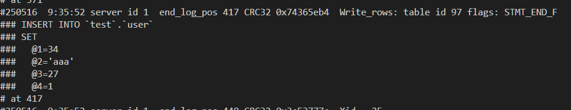
>
> ```sql
> mysqlbinlog --no-defaults --database=test --base64-output=DECODE-ROWS -v --start-datetime='2025-05-16 00:00:00' --stop-datetime="2025-05-16 12:00:00" --start-position=371 --stop-position=471 binlog.000041 | more
> ```
>
> 


## 操作二进制日志的工具

- **工具名称**：`mysqlbinlog`

- **作用**：

  - 解码二进制日志，查看日志内容。
  - 用于数据恢复或分析日志。

- **选项**

  - 通常用于忽略默认配置文件。    **`--no-defaults`**

  - | `--start-datetime`            | 指定开始时间（格式：`YYYY-MM-DD HH:MM:SS`）。  |
    | ----------------------------- | ---------------------------------------------- |
    | `--stop-datetime`             | 指定结束时间（格式：`YYYY-MM-DD HH:MM:SS`）。  |
    | `--start-position`            | 指定开始位置（日志文件中的字节位置）。  at ... |
    | `--stop-position`             | 指定结束位置（日志文件中的字节位置）。         |
    | `--database=database_name`    | 仅显示指定数据库的更改。                       |
    | `--verbose`  -v               | 显示详细信息，包括事件的注释和元数据。         |
    | `--base64-output=DECODE-ROWS` | 解码基于行的事件，显示为可读的 SQL 语句。      |
    | `--result-file=file_name`     | 将输出保存到指定文件中。                       |

- **常用命令**： -- 了解

  - 查看日志内容：

    ```bash
    mysqlbinlog /path/to/binlog.000001
    ```

  - 查看指定时间段的日志：

    ```bash
    mysqlbinlog --start-datetime="2025-05-16 10:00:00" --stop-datetime="2025-05-16 12:00:00" /path/to/binlog.000001
    ```

  - 查看指定位置的日志：

    ```bash
    mysqlbinlog --start-position=123 --stop-position=456 /path/to/binlog.000001
    ```

## binlog太多

> ### **清理旧的 binlog 文件**
>
> #### （1）**按文件名清理**
>
> 清理到指定的 binlog 文件（不包括该文件）：
>
> ```sql
> PURGE BINARY LOGS TO 'binlog.000020';
> ```
>
> 
>
> - 这将删除 `binlog.000001` 到 `binlog.000019` 的文件。
>
> #### （2）**按时间清理**
>
> 清理指定日期之前的 binlog 文件：
>
> ```sql
> PURGE BINARY LOGS BEFORE '2025-05-01 00:00:00';
> ```
>
> 
>
> - 这将删除指定日期之前的所有 binlog 文件。


## binlog过期时间

配置文件修改

- 对于 MySQL 8.0.3 以下版本，使用 `expire_logs_days = 5`。
- 对于 MySQL 8.0.3 及以上版本，使用 `binlog_expire_logs_seconds = 432000`。


## 数据恢复

> - **恢复步骤**：
>   1. 确定需要恢复的日志文件和范围（时间或位置）。
>   2. 使用 `mysqlbinlog` 提取日志内容。
>   3. 将日志内容通过管道或脚本重放到 MySQL 中。
> - **注意事项**：
>   - 恢复前建议使用 `FLUSH LOGS` 刷新日志，避免混淆恢复过程中的新日志。
>   - 恢复时需明确起始和结束位置，避免重复操作。
>
> ## 示例
>
> ```sql
> create database mytest;
> 
> 
> use mytest;
> 
> create table myuser(id int,name varchar(50));
> 
> 
> insert into myuser(id,name) values(1,'aaa'), (2,'bbb'),(3,'ccc');
> 
> 
> select * from myuser;
> 
> 
> drop database mytest;
> 
> ```
>
> ## 恢复
>
> ```sql
>  mysqlbinlog --no-defaults --base64-output=DECODE-ROWS -v --start-datetime='2025-05-16 00:00:00' --stop-datetime="2025-05-16 12:00:00"  binlog.0000.. | more
> ```
>
> 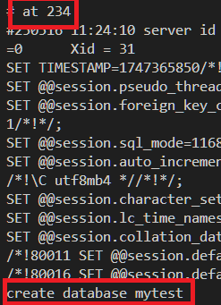
>
> 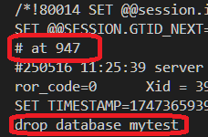
>
> ```sql
> mysqlbinlog --start-position=234 --stop-position=947 binlog... | mysql -u root -p
> ```
>
> ### 再次回看,  即恢复
>
> 


## 数据备份与恢复的结合

> 双重 保险
>
> binlog 有效时期内的, 使用 binlog恢复
>
> 否则使用 mysql  备份恢复

- **备份策略**：
  
  - 定期对数据库进行全量备份（如每天或每周）。  
  
    ### --  根据 binlog 的过期时间, 进行备份
  
    ```sql
    mysql source ...
    ```
  
  - 配合二进制日志实现增量恢复。
- **恢复流程**：
  
  1. 从备份文件恢复全量数据。
  2. 使用二进制日志恢复备份后到数据丢失之间的增量数据。

---

## 总结
- **二进制日志**是 **MySQL 数据恢复和主从复制**的核心工具。
- 通过 `mysqlbinlog` 工具可以解码日志内容并进行数据恢复。
- 数据恢复需要结合全量备份和二进制日志，确保数据完整性。
- 实践操作是掌握二进制日志的关键，建议多动手实验。


# mysqldump备份

## dump备份常用命令

> ```sql
> mysqldump
> Usage: mysqldump [OPTIONS] database [tables]
> OR     mysqldump [OPTIONS] --databases [OPTIONS] DB1 [DB2 DB3...]
> OR     mysqldump [OPTIONS] --all-databases [OPTIONS]
> ```
>
> ##### **备份命令**
>
> - **备份单个表**：
>
>   ```bash
>   mysqldump -u root -p database_name table_name > /path/to/backup.sql
>   ```
>
>   ### 示例：
>
>   ```bash
>   mysqldump -u root -p mytest user > ~/user.sql
>   ```
>
> - **备份单个数据库**：
>
>   ```bash
>   mysqldump -u root -p database_name > /path/to/backup.sql
>   ```
>
> - **备份多个数据库**：
>
>   ```bash
>   mysqldump -u root -p --databases db1 db2 > /path/to/backup.sql
>   ```
>
> - **备份所有数据库**：
>
>   ```bash
>   mysqldump -u root -p --all-databases > /path/to/backup.sql
>   ```
>
> ## vim 可查看


## 恢复命令

> - 使用 `source` 命令恢复：
>   ```sql
>   ---mysqld
>   source /path/to/backup.sql;
>   ```
> - 或直接在 Linux Shell 中恢复：
>   ```bash
>   mysql -u root -p database_name < /path/to/backup.sql
>   ```
>   
>   
>
> > [!important]
> >
> > 要注意, 如果时单张表, 需要选中 数据库 再source


## 导出数据为文本文件--不使用mysqldump
使用 `mysql` 命令直接导出表数据到文本文件。

> ##### **导出命令**
> - ### 导出表的所有数据：
>   
>   ```bash
>   mysql -u root -p -D database_name -e "SELECT * FROM table_name" > /path/to/output.txt
>   ```
>   示例：
>   
>   ```bash
>   mysql -u root -p -D mytest -e "SELECT * FROM myuser" > ~/myuser.txt
>   ```
>   
> - ### 导出符合条件的数据：
>   
>   ```bash
>   mysql -u root -p -D database_name -e "SELECT * FROM table_name WHERE age > 18" > /path/to/output.txt
>   ```
>
> ##### **导出格式化数据**
> - 使用制表符（Tab）分隔字段：   ` --batch --silent`
>   ```bash
>   mysql -u root -p -D database_name -e "SELECT * FROM table_name" --batch --silent > /path/to/output.txt
>   ```
>


## 数据迁移-补充
通过 `mysqldump` 导出的 SQL 脚本文件可以用于数据迁移。

> ##### **步骤**
> 1. **在源数据库中导出数据**：
>    
>    ```bash
>    mysqldump -u root -p database_name > /path/to/backup.sql
>    ```
>    
> 2. **在目标数据库中导入数据**：
>    ```bash
>    mysql -u root -p database_name < /path/to/backup.sql
>    ```
>


## 总结
- **`mysqldump`** 是**备份和迁移数据**的主要工具，支持单表、单库、多库和全库的备份。

  ### 备份和迁移 都是用 .sql, 其实 命令都一样
- **`mysql`** 命令可以直接**导出表数据到文本文件**，便于数据分析或处理。
- 通过 `source` 或直接在 Shell 中执行 SQL 脚本，可以快速恢复或迁移数据。
- 建议多实践这些命令，熟悉其用法，因为它们在实际开发和运维中使用频率非常高。


# 一次sql的完整处理流程

> [!tip]
>
> 尽量 那个简单图, 能自己画,自己讲出来

当客户端发送一条 SQL 请求到 MySQL Server 时，SQL 会经过以下模块进行处理：

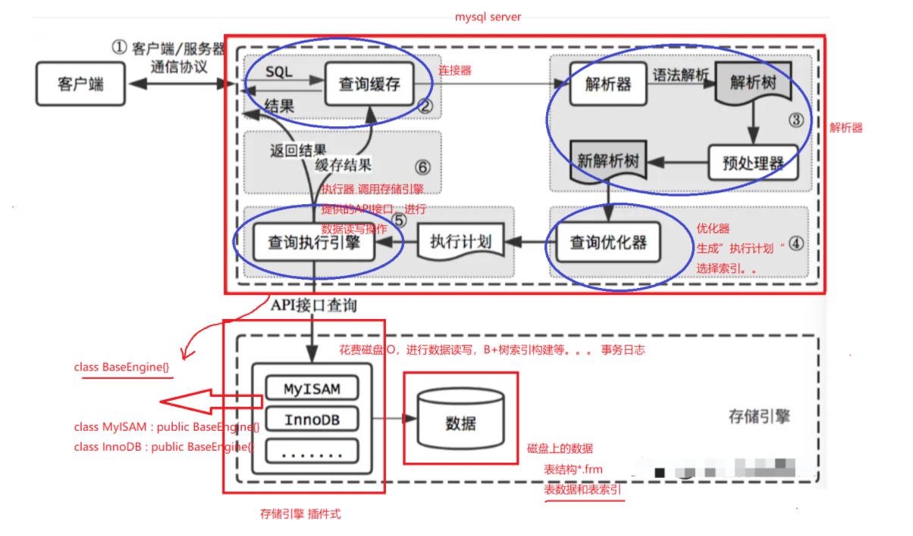

> [!tip]
>
> 存储引擎那里 有点 oop 的感觉

## 模块

> #### 1. **连接器（Connector）**
>
> - **功能**：
>   - 负责客户端与 MySQL Server 的连接管理。
>   - 验证客户端的合法性（账号、密码、权限等）。
>   - 控制最大连接数（`max_connections`）和超时断开（`wait_timeout`）。
> - **特点**：
>   - 如果查询缓存命中，直接返回结果，无需进入后续模块。
>
> ---
>
> #### 2. **查询缓存（Query Cache）**
> - **功能**：
>   - 缓存最近的查询结果。
>   - 如果查询命中缓存，直接返回结果，跳过解析、优化和执行。
> - **注意**：
>   - 如果在两次相同查询之间有更新操作，查询缓存会被清空。
>   - **MySQL 8.0 已移除查询缓存。**
>
> ---
>
> #### 3. **解析器（Parser）**
> - **功能**：
>   - 对 SQL 语句进行语法解析，生成语法树。
>   - 验证 SQL 语句的合法性。
> - **作用**：
>   - 确保 SQL 语句符合 MySQL 的语法规则。
>
> ---
>
> #### 4. **优化器（Optimizer）**
> - **功能**：
>   - 根据解析器生成的语法树，生成执行计划。
>   - 确定 SQL 的执行顺序（如表的连接顺序）。
>   - 选择最优的索引。
> - **工具**：
>   - 可以使用 `EXPLAIN` 查看优化器生成的执行计划。
>
> ---
>
> #### 5. **执行器（Executor）**
> - **功能**：
>   - 根据优化器生成的执行计划，调用存储引擎的 API 执行具体的操作。
>   - 负责与存储引擎交互，完成数据的读写操作。
> - **特点**：
>   - 执行器是 MySQL Server 与存储引擎之间的桥梁。
>
> ---
>
> #### 6. **存储引擎（Storage Engine）**
> - **功能**：
>   - 负责数据的实际存储和读取。
>   - 提供统一的 API 接口供执行器调用。
> - **常见存储引擎**：
>   - **InnoDB**：
>     - 支持事务（`redo log` 和 `undo log`）。
>     - 使用 `ibd` 文件存储表数据和索引。
>   - **MyISAM**：
>     - 不支持事务。
>     - 使用 `MYD` 和 `MYI` 文件存储表数据和索引。
> - **特点**：
>   - 插件式设计，可以更换存储引擎。
>
> ---
>
> #### 7. **日志模块**
> - **功能**：
>   - 记录 MySQL 的运行状态和操作日志。
> - **常见日志**：
>   - **错误日志（Error Log）**：记录 MySQL 的错误信息。
>   - **查询日志（General Log）**：记录所有的 SQL 请求。
>   - **慢查询日志（Slow Query Log）**：记录执行时间超过阈值的 SQL。
>   - **二进制日志（Binary Log）**：记录所有数据更改操作，用于数据恢复和主从复制。
>

---

## 数据流总结
1. **客户端发送 SQL 请求**：
   - 连接器验证连接。
2. **查询缓存**：
   - 如果命中缓存，直接返回结果。
3. **解析器**：
   - 解析 SQL，生成语法树。
4. **优化器**：
   - 生成执行计划，选择最优索引。
5. **执行器**：
   - 调用存储引擎的 API，执行具体操作。
6. **存储引擎**：
   - 负责数据的实际存储和读取。
7. **返回结果**：
   - 查询结果返回给客户端。

---

## 图示模块划分
1. **MySQL Server 层**：
   - 包括连接器、查询缓存、解析器、优化器、执行器。
   - 负责 SQL 的解析、优化和执行。
2. **存储引擎层**：
   - 提供数据存储和读取功能。
   - **插件式设计**，支持多种存储引擎（如 InnoDB、MyISAM）。
   - oop思想

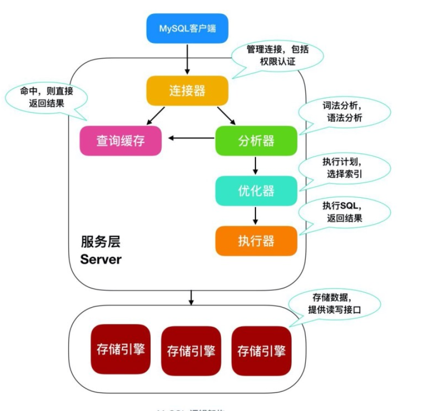

## 关键点总结
- **连接器**：管理连接和权限。
- **查询缓存**：加速重复查询（MySQL 8.0 已移除）。
- **解析器**：验证 SQL 语法。
- **优化器**：生成执行计划，选择最优索引。
- **执行器**：调用存储引擎完成操作。
- **存储引擎**：负责数据的实际存储和读取。

通过以上流程，MySQL 实现了从客户端发送 SQL 到返回结果的完整处理过程。


# mysql主从复制

## 中间件小大全--了解

> 以下是 MySQL 和服务器常用的中间件分类及其用途：
>
> ---
>
> ### **MySQL 常用中间件**
> 1. **读写分离和负载均衡中间件**：
>    - **MyCat**：
>      - 基于 Java 开发的数据库中间件，支持读写分离、分库分表。
>    - **ProxySQL**：
>      - 高性能的 MySQL 代理，支持读写分离、查询缓存、负载均衡。
>    - **MaxScale**：
>      - MariaDB 官方推出的中间件，支持读写分离、查询路由和高可用。
>
> 2. **分库分表中间件**：
>    - **ShardingSphere**：
>      - Apache 开源的分布式数据库中间件，支持分库分表、读写分离、分布式事务。
>    - **TDDL（Taobao Distributed Data Layer）**：
>      - 淘宝开源的分布式数据库中间件，支持分库分表和动态数据源管理。
>
> 3. **高可用中间件**：
>    - **MHA（Master High Availability）**：
>      - 用于 MySQL 主从复制环境的高可用解决方案，支持主库故障自动切换。
>    - **MMM（Master-Master Replication Manager）**：
>      - 管理 MySQL 主主复制的高可用工具。
>    - **Orchestrator**：
>      - 用于管理和监控 MySQL 主从拓扑结构，支持自动故障切换。
>
> 4. **分布式事务中间件**：
>    - **Seata**：
>      - 阿里巴巴开源的分布式事务解决方案，支持 AT、TCC、SAGA 等模式。
>    - **DTM**：
>      - 支持多种语言的分布式事务管理器，适用于微服务架构。
>
> ---
>
> ### **服务器常用中间件**
> 1. **消息队列中间件**：
>    - **RabbitMQ**：
>      - 基于 AMQP 协议的消息队列，支持可靠消息传递。
>    - **Kafka**：
>      - 高吞吐量的分布式消息队列，适合日志处理和实时数据流。
>    - **RocketMQ**：
>      - 阿里巴巴开源的分布式消息中间件，支持事务消息和延时消息。
>
> 2. **缓存中间件**：
>    - **Redis**：
>      - 高性能的内存数据库，支持缓存、分布式锁、消息队列等功能。
>    - **Memcached**：
>      - 简单高效的分布式内存缓存系统。
>
> 3. **服务治理中间件**：
>    - **Zookeeper**：
>      - 分布式协调服务，常用于服务注册与发现。
>    - **Consul**：
>      - 支持服务注册与发现、健康检查和分布式配置。
>    - **Nacos**：
>      - 阿里巴巴开源的服务治理平台，支持服务注册、配置管理和动态 DNS。
>
> 4. **负载均衡中间件**：
>    - **Nginx**：
>      - 高性能的反向代理服务器，支持负载均衡和静态资源缓存。
>    - **HAProxy**：
>      - 专业的负载均衡器和代理服务器，支持高并发场景。
>
> 5. **日志和监控中间件**：
>    - **ELK（Elasticsearch + Logstash + Kibana）**：
>      - 日志收集、存储和可视化分析工具链。
>    - **Prometheus**：
>      - 开源的监控系统，支持多维度数据模型和告警功能。
>    - **Grafana**：
>      - 数据可视化工具，常与 Prometheus 搭配使用。
>


## 主从复制的作用：

- **数据备份**：主从复制可以**实现数据的实时备份**，甚至支持**热备份**。

  实现实时备份，支持热备份，提升数据安全性。

  > **热备份**是指在系统运行过程中，不需要停止服务或中断业务的情况下，对数据进行备份的一种技术。它允许系统在备份的同时继续处理用户请求和操作，因此特别适合对高可用性要求较高的系统。
- **容灾**：当主库发生故障时，可以通过中间件（如 MyCat）切换到从库，保证服务的高可用性。

  主库故障时，通过中间件切换到从库，保证服务的高可用性。
- **读写分离**：通过主从复制**实现读写分离**，提升数据库的并发能力。

  ### 主库负责写操作，从库负责读操作，分摊压力

  > 一般 读多, 写少
  >
  > 因此,  主库负责写, 从库负责查询, 并 进行 主库修改的 备份,binlog
  >
  > - 在实际应用中，读操作通常远多于写操作（如电商平台的浏览与购买行为）。
  > - 通过读写分离，主库专注于写操作，从库专注于读操作，**可以挂载多个从库**以支持高并发的读请求。

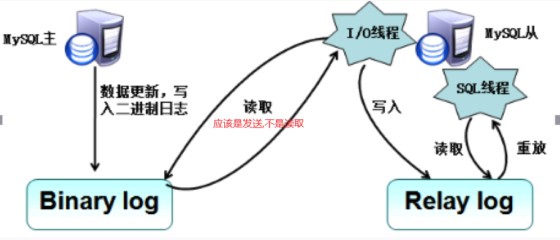

## 主从复制的流程：

- ### --- binlog二进制日志和三个线程(master的一个线程和slave的两个线程)

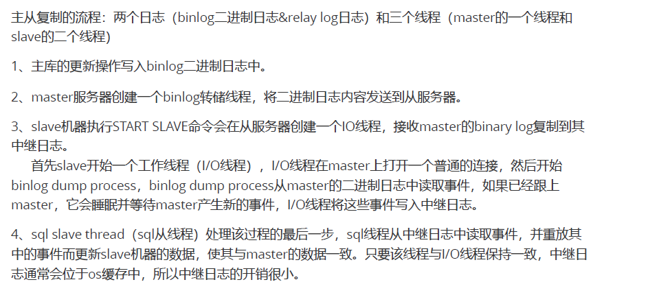

- 主库（Master）记录所有数据变更操作到二进制日志（bin log）。
- 从库（Slave）通过 **IO 线程**读取主库的 bin log，并写入中继日志（relay log）。

  > ### 中继日志 
  >
  > 防止 binlog 过多, 进行频繁的 写入, 但写入速度 又慢, **跟不上 主库的更新** 
- **从库的 SQL 线程**从 relay log 中**读取操作并在从库中重放**(重做主库的步骤)，完成数据同步。


## 涉及的日志和线程：

- **日志**：
  
  - 主库的二进制日志（bin log）。
  - 从库的中继日志（relay log）。
- ### **线程**：
  
  - 主库的 bin log dump 线程：负责将 bin log 内容**发送**到从库。
  - 从库的 IO 线程：接收主库的 bin log 内容并写入 relay log。
  - 从库的 SQL 线程：从 relay log 中读取操作并在从库中执行。


## 总结
- 主从复制的核心是两个日志（bin log 和 relay log）和三个线程（bin log dump、IO、SQL）。
- 主从复制是实现读写分离的基础技术。
- 配置主从复制后，可以通过中间件（如 MyCat）实现容灾和读写分离。

## 注意事项：

- 主从复制是单向的（主到从），从库不能反向同步到主库。

- ### 配置主从复制后，只有从配置开始的节点往后的数据会同步。

  ### 原本的 数据 都不受影响!!


# mysql主从复制实践

## 环境：

- 主库：wsl2  ubuntu22.04  -- ~~`172.21.233.172`~~   `172.21.224.1` 8.0   

  > 注意, 从库 是通过第二个ip 连接主库的,也就是说, 主库 允许被 第二个 ip访问
- 从库： windows -- `192.168.226.18`   8.0

> wsl ping 不通主机 
>
> 1. **ICMP 协议限制**：
>    - `ping` 使用的是 ICMP 协议，而 WSL2 的虚拟网络适配器默认不支持直接通过 ICMP 协议访问主机。
> 2. **网络隔离**：
>    - WSL2 的网络是通过 NAT（网络地址转换）实现的，主机和 WSL2 实例之间的通信需要通过特定的端口转发，而不是直接通过 IP。
>
> #### **启用 ICMP 协议支持**   --  即可 wsl ping 主机
>
> **启用 Windows 防火墙中的 ICMP 回显请求**：
>
> - 打开 **控制面板** > **系统和安全** > **Windows 防火墙** > **高级设置**。
> - 在左侧选择 **入站规则**，找到 **文件和打印共享（回显请求 - ICMPv4-In）**。
> - 右键点击规则，选择 **启用规则**。

## 主库配置

> ### 1 .  先进行 **ubuntu 开放3306 端口**
>
> ​	使得 主机 可以通过 下面这个命令 连接到 linux的 mysql   
>
> ### 	先看 远程 ip 访问---在读写分离
>
> ```sql
> mysql -h 172.21.233.172 -u root -p
> ```
>
> ### 怎么做?
>
> - 首先 其实可以 不用开 防火墙, 默认开放所有, 当然 这样不安全
>
> - ubuntu 使用 ufw 控制 防火墙,  默认不开启
>
> - 为了安全,  就需要 开启防火墙, 并 开放端口号
>
> - ```sql
>   sudo ufw allow 3306/tcp   // 开放特定端口
>   sudo ufw enable        //开启防火墙
>   sudo ufw status       // 查看当前规则
>   systemctl status ufw   // 查看状态
>   ```
>
> ​	

> ### 2 . 创建一个 用于 **主从库 通信**的 **账号**
>
> - 可以直接使用root账户,   但是 这里新创建一个
>
> - ```sql
>   create user 'mslave'@'172.21.224.1' identified by 'xing@huai';    // 密码要复杂, 不然通不过
>   // 'mslave'@'%'  任意ip    // 若是虚拟机,net模式, 则是 vmware8 的 地址
>   // wsl 要使用 wsl hype-v 的ip
>   ```
>
> - ```sql
>   开启主从复制权限 *.*  所有库的所有表
>   grant replication slave on *.* to 'mslave'@'172.21.224.1';
>   identified by 'xing@huai'   在 MySQL 5.7 或更低版本中，您可以直接在 GRANT 语句中使用 IDENTIFIED BY
>   ```
>
>   replication:  复制
>
>   grant : 授予
>
> - ```sql
>   flush privileges;
>   ```
>
>   privilege: 特权
>
>   


> ### 3 . 进行mysql 配置
>
> - 开启 二进制 日志, 默认开启 ---  配置文件进行修改
>
> - 获取二进制日志和位置
>
>   ```sql
>   show master status;    // 这是当前 的二进制
>   ```
>
>   


## 从库配置

> ### 1 . 配置全局唯一的server-id（涉及修改配置文件，需要重启mysql80服务）
>
> win 配置文件 路径 : `"C:\ProgramData\MySQL\MySQL Server 8.0\my.ini"` 
>
> ```sql
> server-id=2
> ```
>
> 重启服务
>
> 直接任务管理器, 服务里 找 mysql 重启

> ### 2 . 创建的账户读取binlog同步数据
>
> ```sql
> CHANGE MASTER TO MASTER_HOST='172.21.233.172',
> MASTER_PORT=3306,
> MASTER_USER='mslave',
> MASTER_PASSWORD='xing@huai',
> MASTER_LOG_FILE='binlog.000061',
> MASTER_LOG_POS=1432,
> GET_MASTER_PUBLIC_KEY=1;   // 这个 是 突然需要的, 第一天是好的, 配了 mycat 后, 怎么改 都不行了
> ```
>
> 

> ### 3 . 开启从库
>
> ```sql
> start slave;
> show slave status\G
> ```
>
> > [!tip]
> >
> > `SHOW SLAVE STATUS\G` 的重点字段：
> >
> > 1. **Slave_IO_Running** 和 **Slave_SQL_Running**
> >    - 确认 I/O 和 SQL 线程是否正常运行（值应为 `Yes`）。
> > 2. **Seconds_Behind_Master**
> >    - 从库落后主库的时间（值为 `0` 表示同步完成）。
> > 3. **Last_IO_Error** 和 **Last_SQL_Error**
> >    - 检查 I/O 和 SQL 线程的最后错误信息（为空表示无错误）。
> > 4. **Master_Log_File** 和 **Read_Master_Log_Pos**
> >    - 当前主库的日志文件及从库读取的位置，用于确认同步进度。
> > 5. **Exec_Master_Log_Pos**
> >    - 从库已执行的主库日志位置，用于确认同步到哪里。
>
> ```sql
> show processlist;
> ```
>
> 

## 查看当前mysql线程

```sql
show processlist;   // 有 bin log dump线程
```

验证主从复制：

- 在主库创建数据库或表，从库会同步这些变更。
- 使用 `SHOW PROCESSLIST` 查看主库和从库的线程状态：
  - 主库有 bin log dump 线程。
  - 从库有 IO 线程和 SQL 线程。


# 主从复制问题解决-老师

## 主要是 看日志!!

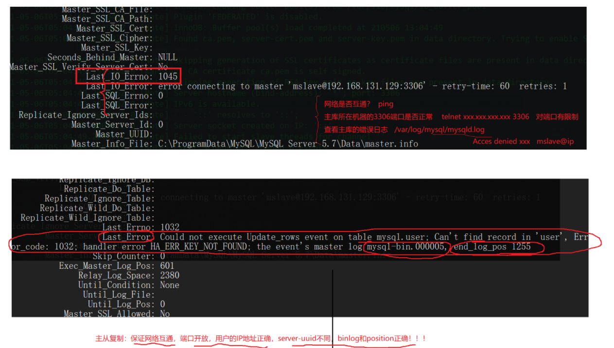

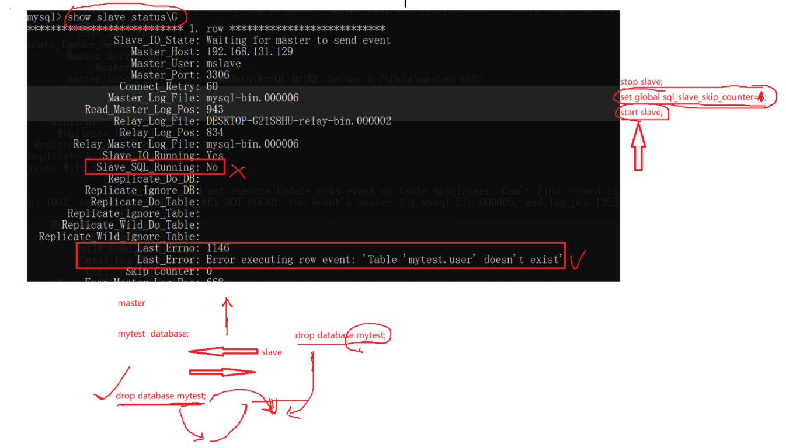

# 主从复制问题解决-自己

## 注意

在 从库 `start slave`之前,  必须先进行 是否能 远程 登录 测试,  否则 容易出现

下面的 mysql 保护日志, 会被加入黑名单

## wsl-ip问题

> ### wsl 要使用 wsl hyper-v 的ip
>
> 而不是  wsl里的ip

## 清理复制状态

```sql
RESET SLAVE ALL;
```


## 用户配置错误,删除或修改

> 要删除之前创建的用户，可以使用以下 SQL 命令：
>
> ```sql
> DROP USER 'mslave'@'192.168.226.18';
> ```
>
> ### 说明：
>
> 1. **`DROP USER`**：用于删除指定的 MySQL 用户。
>
> 2. **`'mslave'@'192.168.226.18'`**：指定要删除的用户和其主机限制。
>
> 3. 执行以下命令查看用户列表，确认用户是否已删除：
>
>    ```sql
>    SELECT user, host FROM mysql.user WHERE user = 'mslave';
>    ```
>
>    

> 如果不想删除用户，而是修改用户的主机限制或密码，可以使用以下方法：
>
> ### **修改用户的主机限制**
> 将用户 `mslave` 的主机限制从 `192.168.226.18` 修改为 `%`（允许任意主机连接）：
> ```sql
> UPDATE mysql.user SET host = '%' WHERE user = 'mslave' AND host = '192.168.226.18';
> FLUSH PRIVILEGES;
> ```
>
> 如果需要修改为特定的 IP 地址（例如 `172.21.224.1`）：
> ```sql
> UPDATE mysql.user SET host = '172.21.224.1' WHERE user = 'mslave' AND host = '192.168.226.18';
> FLUSH PRIVILEGES;
> ```
>
> ---
>
> ### **修改用户的密码**
> 如果需要修改用户的密码，可以使用以下命令：
> ```sql
> ALTER USER 'mslave'@'192.168.226.18' IDENTIFIED BY 'new_password';
> FLUSH PRIVILEGES;
> ```
>
> ---
>
> ### **修改用户的权限**
> 如果需要调整用户的权限，例如允许主从复制：
> ```sql
> GRANT REPLICATION SLAVE ON *.* TO 'mslave'@'192.168.226.18';
> FLUSH PRIVILEGES;
> ```
>
> ---
>
> ### 4. **验证修改结果**
> 执行以下命令，确认用户的主机限制和权限是否已修改：
> ```sql
> SELECT user, host FROM mysql.user WHERE user = 'mslave';
> SHOW GRANTS FOR 'mslave'@'192.168.226.18';
> ```
>
> ---
>
> 通过以上方法，可以灵活地修改用户的主机限制、密码或权限，而无需删除用户重新创建。

## 无法远程连接-配置文件

```sql
bind-address            = 127.0.0.1
mysqlx-bind-address     = 127.0.0.1
```

都改为 `0.0.0.0`


## 无法远程连接-mysql内部

检查 用户的主机访问权限

```sql
SELECT user, host FROM mysql.user WHERE user = 'root';
SELECT user, host FROM mysql.user WHERE user = 'mslave';
```

root 是 localhost  只允许 本地连接

## win测试远程端口是否开放

```sql
Test-NetConnection -ComputerName 172.21.233.172 -Port 3306
```

linux 是 

```sql
telnet 172.21.233.172 3306
```


## mysql保护机制

```sql
ERROR 1129 (HY000): Host '172.21.224.1' is blocked because of many connection errors; unblock with 'mysqladmin flush-hosts'
```

**由于发生了太多次连接错误**（例如连接被拒绝、认证失败、网络断开等），被 MySQL **自动加入黑名单**，暂时禁止该主机继续连接数据库。

```sql
// 在被连接端刷新
mysqladmin -u root -p flush-hosts
并重启
```


## 版本必须一致

否则 报 ssl 错误,  不同版本, 尤其是大版本, ssl 不一样


# 读写分离原理

## 面试会问有没有用过

主从复制, 读写分离  ---  根据老师讲的原理 及 操作 --- 进行回答即可

> ### 面试中关于主从复制与读写分离的回答技巧
>
> 在面试中，关于 **主从复制** 和 **读写分离** 的问题，面试官可能会从以下几个方面提问。以下是一些常见问题及回答思路：
>
> ---
>
> #### 一、主从复制相关问题
>
> 1. **主从复制的原理是什么？**
>    - **回答要点**：
>      - 主从复制通过主库的 **二进制日志（binlog）** 实现。
>      - 主库有一个 **binlog 线程**，将操作记录写入二进制日志。
>      - 从库有两个线程：
>        - **I/O 线程**：从主库读取 binlog 并写入从库的中继日志（relay log）。
>        - **SQL 线程**：从中继日志中读取并执行 SQL 语句，完成数据同步。
>
> 2. **主从复制的配置步骤？**
>    - **回答要点**：
>      - 主库配置：
>        1. 开启二进制日志。
>        2. 设置唯一的 `server_id`。
>        3. 创建用于主从同步的用户并授权。
>      - 从库配置：
>        1. 设置唯一的 `server_id`。
>        2. 配置主库信息（`CHANGE MASTER TO`）。
>        3. 启动从库线程（`START SLAVE`）。
>      - 使用 `SHOW MASTER STATUS` 和 `SHOW SLAVE STATUS\G` 检查状态。
>
> 3. **主从复制中可能遇到的问题及解决方法？**
>    - **回答要点**：
>      - **网络问题**：检查主从库之间的网络连通性（`ping` 和 `telnet` 测试）。
>      - **权限问题**：确保主库用户权限正确（`GRANT REPLICATION SLAVE`）。
>      - **二进制日志位置错误**：重新配置主库的 binlog 文件和位置。
>      - **从库 SQL 错误**：通过 `SET GLOBAL sql_slave_skip_counter=1` 跳过错误。
>
> ---
>
> #### 二、读写分离相关问题
>
> 1. **读写分离的原理是什么？**
>    - **回答要点**：
>      - 通过将写操作分配到主库，读操作分配到从库，提升数据库的并发处理能力。
>      - 读写分离需要依赖 **数据库中间件**（如 MyCat）。
>      - 中间件根据操作类型（读/写）自动分发请求到主库或从库。
>
> 2. **读写分离的实现步骤？**
>    - **回答要点**：
>      - 配置主从复制，确保主库和从库之间的数据同步。
>      - 引入数据库中间件（如 MyCat），配置主库和从库的信息。
>      - 在中间件中设置读写分离规则。
>      - 客户端连接中间件的 **数据端口**（如 MyCat 的 8066 端口）。
>
> 3. **如何证明你使用过 MyCat？**
>    - **回答要点**：
>      - 说明 MyCat 的两个端口：
>        - **数据端口（8066）**：用于客户端访问数据库。
>        - **管理端口（9066）**：用于查看 MyCat 的运行状态和后端数据库的连接状态。
>      - 说明 MyCat 支持的配置：
>        - 一主一从、一主多从、多主多从。
>      - 提到 MyCat 的高可用特性：
>        - 主库挂掉时，可以自动切换到从库。
>        - 支持多主多从配置，增强容灾能力。
>
> ---
>
> #### 三、面试回答中的加分点
>
> 1. **结合实际项目经验**：
>    - **示例**：
>      - “在之前的项目中，我们使用 MySQL 主从复制实现了读写分离。通过引入 MyCat 中间件，解决了数据库性能瓶颈问题。MyCat 的 8066 数据端口让客户端无需感知主从库的存在，读写分离的逻辑完全由中间件处理。”
>
> 2. **提到常见问题及解决方法**：
>    - **示例**：
>      - “在配置主从复制时，曾遇到过 `ERROR 1045` 的权限问题。通过检查主库用户的权限配置，发现是从库的 IP 地址未被授权，最终通过 `GRANT REPLICATION SLAVE` 解决了问题。”
>
> 3. **展示对中间件的理解**：
>    - **示例**：
>      - “MyCat 类似于 Nginx 的反向代理功能，客户端只需连接 MyCat 的数据端口，MyCat 会根据读写操作自动分发请求到主库或从库。它还支持多主多从配置，提升了系统的高可用性。”
>
> 4. **提到性能优化和高可用性**：
>    - **示例**：
>      - “通过 MyCat 的多主多从配置，我们实现了数据库的高可用。当主库挂掉时，MyCat 可以自动切换到从库，确保服务的连续性。”
>
> ---
>
> #### 四、总结
>
> 在面试中，关于主从复制和读写分离的回答可以从以下几个方面展开：
> 1. **原理**：清晰描述主从复制和读写分离的工作机制。
> 2. **配置步骤**：简明扼要地说明配置过程。
> 3. **实际经验**：结合项目中的实际应用，展示解决问题的能力。
> 4. **中间件的使用**：重点说明 MyCat 的作用、端口和配置特点。
> 5. **问题排查**：提到常见问题及解决方法，展示你的问题分析和解决能力。
>


## 主从复制与读写分离的关系
> 1. **主从复制**：
>    - 主从复制是实现读写分离的基础。
>    - 主库（Master）负责写操作，从库（Slave）负责读操作。
>    - 主从之间通过二进制日志（binlog）和线程（I/O 线程和 SQL 线程）实现数据同步。
>
> 2. **读写分离**：
>    - 通过将写操作分配到主库，读操作分配到从库，提升数据库的并发处理能力。
>    - 需要引入 **数据库中间件**（如 MyCat）来实现自动化的读写分离。
>

## 读写分离的实现
> 1. **传统实现方式**：
>    
>    - 代码中手动指定主库和从库。
>    - **缺点：**代码与数据库环境强耦合，维护复杂。
>    
> 2. ## **通过数据库中间件实现**：
>    
>    - ### **引入中间件（如 MyCat）作为代理服务器**。  --  比较像 nginx负载均衡
>    - 客户端只需连接中间件，中间件根据操作类型（读/写）自动分发请求到主库或从库。
>    - 优点：代码无需修改，支持动态扩展和高可用。
>

## MyCat 中间件
> 1. **MyCat 的作用**：
>
>    - 实现读写分离。
>
>    - ### 支持多种主从配置（如**一主一从、一主多从、多主多从**）。
>
>    - 但是 有个问题, 主库挂了, 就要换到从库, 从与从之间 没有主从复制, 比较复杂
>
>      ### 推荐看源码---读写分离
>
>    - 提供高可用和容灾能力。
>
> 2. **MyCat 的优势**：
>
>    - 遵循 MySQL 通信协议，客户端无需感知中间件的存在。
>    - ### **支持动态切换主从库**，提升系统的**高可用性**。
>    - ### **支持多主多从配置**，增强容灾能力。
>
> 3. ### **MyCat 的端口**： --- 证明你用过
>
>    - #### **数据端口（8066）**：客户端通过该端口访问数据库。
>
>    - #### **管理端口（9066）**：用于查看 MyCat 的运行状态和后端数据库的连接状态。
>


## 面试中的关键点
**MyCat 的特点**：

- 支持的端口（8066 和 9066）。
- 支持的主从配置（如一主多从、多主多从）。
- 高可用和容灾能力。

---

## 总结
- **主从复制** 是实现读写分离的基础，确保主库和从库之间的数据一致性。
- **读写分离** 通过引入中间件（如 MyCat）实现，提升了系统的并发能力和高可用性。
- **MyCat** 是一种强大的数据库中间件，支持多种主从配置和高可用特性。
- 面试中，除了掌握理论，还需要结合实践，能够清晰地描述配置步骤和原理。

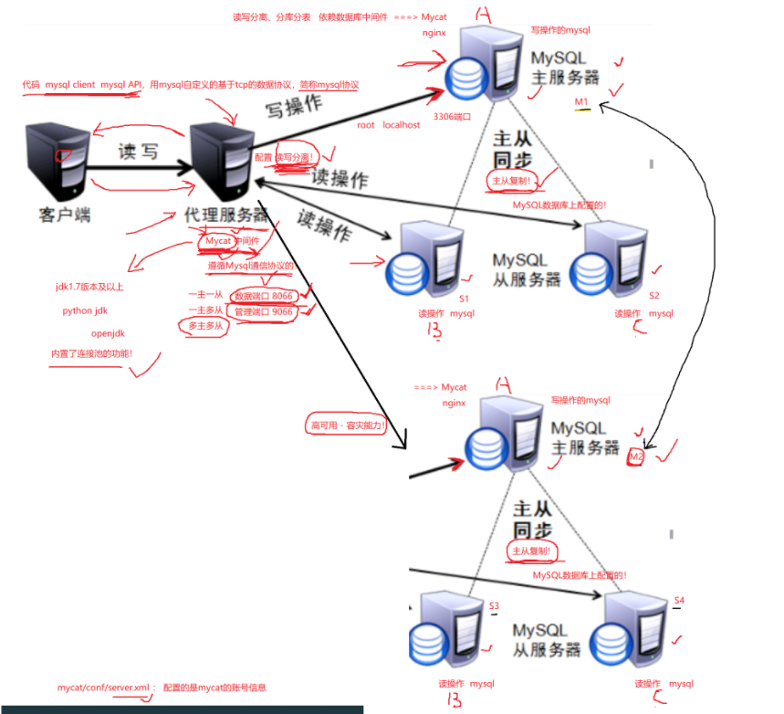

# 读写分离实践(一)

## 动态ip

> 容易出现 下次 出现问题, 因为
>
> ### 动态 ip 有时间限制, 会过期, 会变化


## 环境-对比主从复制

- 主库：wsl2  ubuntu22.04  -- `172.21.233.172`   ~~`172.21.224.1`~~ 8.0   

  > ### 区别
  >
  > mycat 访问 主库 是通过 主库的 ip, 而不是中转ip
  >
  > 因为 这个实践把 mycat 安装在 主库的服务器上

- 从库： windows -- `192.168.226.18`   8.0


## jdk环境

由于 mycat 是java开发, 因此需要 jdk环境

```sql
java --version   // 通用
```


## 设置ip远程连接

这里 直接使用 root  可以被 所有 ip 远程连接

> // 不使用root,  试一下别的, 用了 root 总是 不太对

```sql
SELECT user, host FROM mysql.user WHERE user = 'root';
```

更改 连接信息

> 创建账户  
>
> ```sql
> CREATE USER 'root'@'%' IDENTIFIED BY '123456';
> CREATE USER 'user'@'%' IDENTIFIED BY '123456';
> ```
>
> 授予权限  -- 8.0 不能包含密码
>
> ```sql
> grant all privileges on *.* to 'root'@'%'  with grant option; 
> grant all privileges on *.* to 'user'@'%'  with grant option; 
> ```
>
> 


## 安装mycat中间件

> mycat有 1 和 2 两个版本,  先用 1 把
>
> ```sql
> wget  ....
> 解压
> mycat 目录
> ```
>
> ### 重点是  `conf(配置文件)` 和 `log(日志) `
>
> 
>
> ### 为了 方便启动, 建立一个 软链接
>
> ```sql
> ln -s ...mycat/bin/mycat /usr/bin/mycat
> ```
>
> ```sql
> mycat
> ```
>
> ```sql
> 会有提示, 
> Usage: /usr/bin/mycat { console | start | stop | restart | status | dump }
> ```
>
> 


## 查看mycat配置文件

> ###  `server.xml`
>
> 1. **作用**：  
>    
>    - 配置 MyCat 的登录账号信息。
>    - 设置客户端连接 MyCat 的**用户名、密码，以及 IP 白名单和黑名单**。--- 功能很多, 很强大
>    
> 2. **主要内容**：  
>    
>    - **用户配置**：定义登录 MyCat 的用户名和密码，例如：
>      
>      ```xml
>      <user name="root">
>          <property name="password">123456</property>
>      </user>
>      ```
>    - **IP 限制**：通过 `whitehost` 和 `blackhost` 属性限制客户端连接来源。
>    
> 3. **注意事项**：  
>    
>    - ### 确保 XML 格式正确（如尖括号和注释符号）。
>    - 如果配置错误，MyCat 服务可能无法启动，可通过日志排查问题。
>    
> 4. **位置**：  
>    - 配置文件位于 MyCat 的 `conf` 目录下。


# 25-05-17

# 读写分离实践(二)

## mycat配置-server.xml

需要在 配置文件中修改

> **`server.xml`**：
>
> - **作用**：配置 MyCat 的登录账号信息和逻辑库。
> - 主要内容
>   - 登录 MyCat 的用户名和密码。
>   - 配置逻辑库名称（如 `userdb`）。
>   - 支持 IP 白名单和黑名单，限制客户端连接来源。

> ```sql
>  vim mycat/conf/server.xml
> ```
>
> ### 配置 登录 mycat 账户密码
>
> ### 配置 逻辑库
>
> - 由于客户端通过 `mycat` 连接 `mysql` , `mycat` 直接操作的 就是 `逻辑库`, 一个`不存在`的库, 这个库 会 `映射`到 `mysql`上
> - 逻辑库是 MyCat 中的一个概念，指的是客户端操作的虚拟数据库。逻辑库并不直接对应物理数据库，而是通过 MyCat 的配置将其映射到后端的一个或多个物理数据库。
> - 多个,用 逗号 隔开
>
> 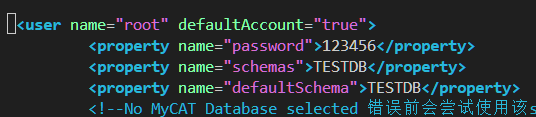


## 错误

注意, 尽管 从库 未开起 slave,  开启后 也会 进行 主库 这段时间的 操作

## `schema.xml`理解

> - **作用**：配置`读写分离`、`分库分表`和`数据节点`。
> - 主要内容
>   - **逻辑库和逻辑表**：客户端操作的虚拟库表，最终映射到物理库表。
>   - **数据节点（data node）**：定义逻辑库表与物理库表的映射关系。
>   - **物理数据库（data host）**：配置主库（master）和从库（slave）的 IP、端口、账号和密码。

> ### 字段解释
>
> `schema name`: 逻辑库 
>
> `dataNode name`:存储节点 --- 这个的 database 必须是 实际的 要映射的 库
>
> `dataHost name`:数据库主机
>
> `maxcon,  mincon`    ---  最大最小连接量   ---  其内部 自带了 连接池 功能
>
> `blance`: 一般为 3
>
> - 控制读写分离的策略：
>   - `0`：不开启读写分离。
>   - `1`：主库和从库都参与读操作。
>   - `3`：主库只负责写操作，从库负责读操作（推荐）。
>
> **容灾切换**：
>
> - `switchType` 参数
>   - `1`：基于心跳检测（mycat发送`SELECT USER()`,接收成功, 就没挂）。
>   - `2`：基于主从同步状态（`SHOW SLAVE STATUS`）。
> - 当主库挂掉时，MyCat 会自动切换到从库或备用主库。
>
> `writetype`: 0   挂没挂怎么知道 
>
> ### 心跳!!
>
> 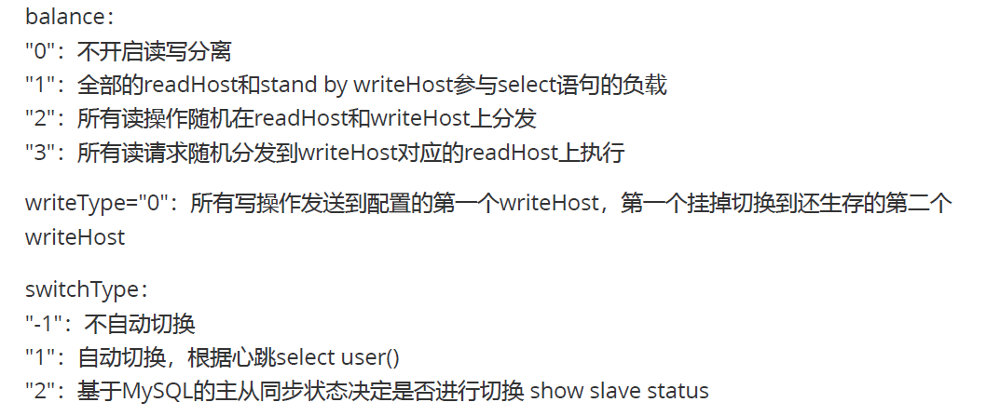
>
> ### 这里 要 `修改` `blance`

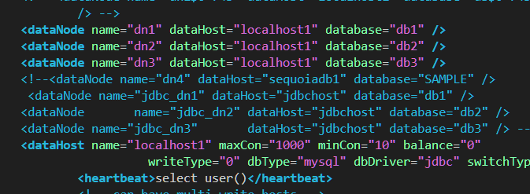

> 这里 writehost   其实代表 主库
>
> 里面 可以 加一个 readhost  是 从库
>
> ### 这里设置 主从库 ip和账户  --  **读写分离**!!
>
> datahost 里面 配置 一主一从, 一主多从,多住多从
>
> 即 配置 
>
> ### 1 write 1read
>
> ### 1 write 多 read
>
> ### 多 write 多 read
>
> 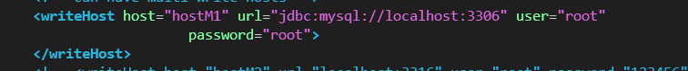
>
> `配置一下, 这个 主从`
>
> ### 看一下老师的
>
> 正常 两主(写)一从(读)
>
> 备份的 主库(写) 是 从库(读)
>
> 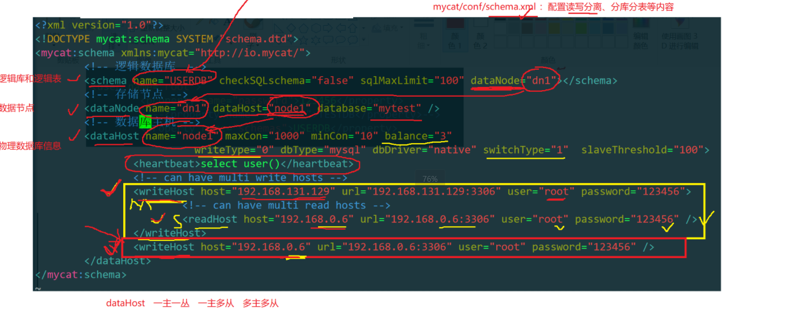
>
> ### 主挂掉, 内部的从 也无法使用, 必须 换主


## `schema.xml`修改配置-有错误

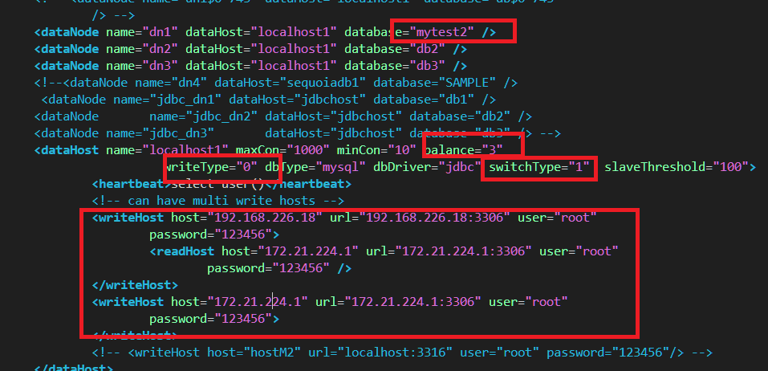


## 开启mycat

```sql
mycat start

netstat -tanp | grep 66

有错误, 看日志
```

## 错误-1

`mycat.log` `wrapper.log`

没有 logs 文件夹, 创建一个 就好了

## 错误-2--特别注意-老师没说

> 显示 ip:port 无效
>
> 看一下 `dbDriver="jdbc"`
>
> 这个 如果是这个 就需要完整的 `jdbc:mysql://...`
>
> ### 改成 `native`!!!!!

## 错误3-模板问题

> 模板给的 `randomDataNode` 是配置 分表分片的
>
> 我们不搞这个, 要改为 和下面 节点标签一样的 `dataNode`
>
> ### **区分大小写!!!**


## 修改配置-正确

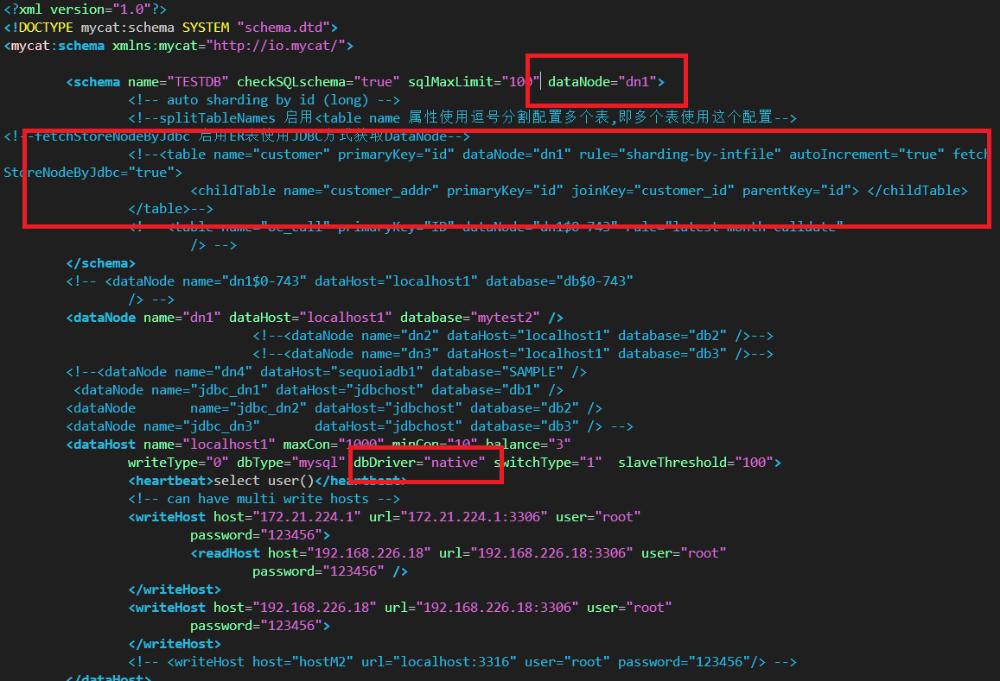

## 至此, mycat正确运行

## 有兴趣可以研究研究别的中间件

vitess 配置读写分离

proxysql 配置读写分离


# 读写分离实践(三)

## 怎么用mycat

- #### **数据端口（8066）**：客户端通过该端口访问数据库。

- #### **管理端口（9066）**：用于查看 MyCat 的运行状态和后端数据库的连接状态。

```sql
mysql -h 172.21.233.172 -P 9066 -u root -p123456
```

> [!important]
>
> ### 这不是在登陆 主机 mysql
>
> ### 而是登录 mycat!!! 且是 管理端口
>
> 账户是 server.xml 配置的
>
> ```sql
> Server version: 5.6.29-mycat-1.6.7.5-release-20200422133810 MyCat Server (monitor)
> monitor --- 监控
> ```
>
> 


## 管理端操作

```sql
show @@help;
```

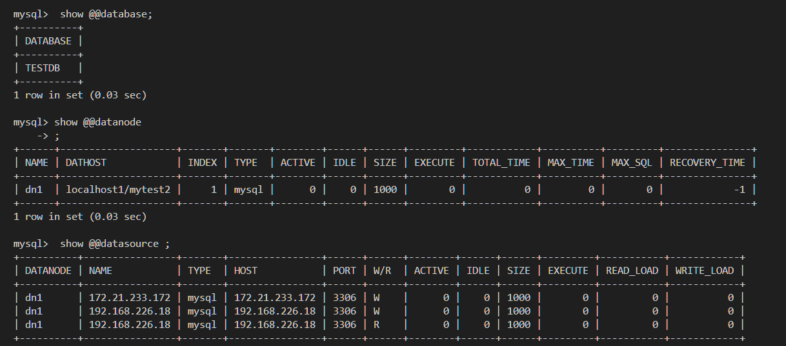

> 其余自己看看


## 数据端口

```sql
mysql -h 172.21.233.172 -P 8066 -u user -p123456
```

```sql
Server version: 5.6.29-mycat-1.6.7.5-release-20200422133810 MyCat Server (OpenCloudDB)

```

与 mysql 操作 一样, 不过 目前只有一个 逻辑库 可用

## 错误-1

> win 那边 可能没配置 远程连接mysql

修改配置文件 

win 的 "C:\ProgramData\MySQL\MySQL Server 8.0\my.ini"

添加就行

```sql
# 设置端口
port=3306
# 允许远程连接
bind-address=0.0.0.0
```

问题类似[无法远程连接-配置文件](##无法远程连接-配置文件)


mysql 远程连接测试一下

## 错误-2-高版本问题

学看这个错误

> ```sql
> errmsg: Client does not support authentication protocol requested by server
> // 仔细找 
> ```

> ### mysql 版本太高
>
> - **MySQL 8.0+ 使用了默认的 `caching_sha2_password` 身份验证插件**；
>
> - 而 **MyCat 还不支持这种新认证协议**，只支持旧的 `mysql_native_password`。
>
> - 
>
> - | 插件名称                | 含义说明                             | MySQL 版本     |
>   | ----------------------- | ------------------------------------ | -------------- |
>   | `mysql_native_password` | 传统的认证方式，MyCat 支持           | MySQL 5.x 默认 |
>   | `caching_sha2_password` | 更安全的新认证方式，MySQL 8 默认使用 | MySQL 8+ 默认  |
>   | `sha256_password`       | 使用更复杂加密的认证方式             | 可选           |

> ## 解决
>
>  **告诉 MySQL 用旧门禁方式（mysql_native_password）再发一次通行证**：
>
> ```
> ALTER USER 'user'@'%' IDENTIFIED WITH mysql_native_password BY '123456';
> FLUSH PRIVILEGES;
> ```
>
> ## 注意
>
> 这样的话, 主库 也要这么做, 不然 配置的 主写节点1  默认 就挂了


## 怎么看查询的是从库呢

使用查询日志

```sql
show variables like 'general%';    // 有显示日志文件名
set global general_log=on;
```

这个图里 有 错误日志, 查询日志, 二进制日志, 延迟日志, 慢查询日志

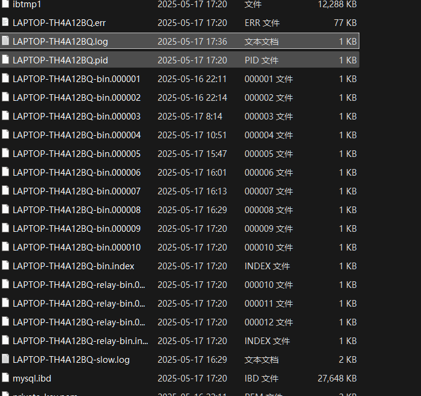

```sql
slect * from user;
```

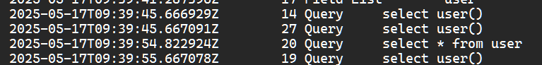

```sql
insert into user(id, name) values(1,'aaa'),(2,'bbb');
```


## 错误3

为什么测试的 都是 从库在 读写?

```sql
 mysql -h 172.21.233.172 -u root -p
使用类似的,  先看看 都能不能连接,   可能是 之前出问题, 进入黑名单了
```

> ### 这里 测三个
>
> 主 -> 从
>
> 从 -> 主
>
> mycat所在服务器ip->主


# 主从复制读写分离错误很多

> 有时间 重新 配一个, 重新写个 新步骤
>
> 复习的 时候 汇总一下 问题
>
> # 太恶心了!!!!!!!!!!!!!!!!!!!!!!!!!!!


# 扩展-mysql分库分表

## 为什么需要分库分表？
- ### **单库瓶颈**：
  
  - **数据量过大**导致磁盘**空间不足、IO 瓶**颈。
  - **单表数据量过大**，**CURD 效率低**，**索引膨胀**，查询超时。
  - 单库**中表过多**，管理复杂，性能下降。
- ### **解决方案**：
  
  - **垂直拆分**：根据业务模块将表分布到不同的库中。
  - **水平拆分**：将单表的数据按规则拆分到多个表中。

---

## MyCat 在分库分表应用

> ### 本身就是为了解决**数据库分库分表（即数据水平拆分）**而设计的中间件。

- **逻辑与物理分离**：

  - 客户端操作的是逻辑库和逻辑表。
  - MyCat 负责将逻辑库表映射到真实的物理库表。

- **分库分表的透明性**：

  - 客户端无需关心数据分布，MyCat **自动处理查询分发和结果合并**。

- ### **支持多种拆分规则**：

  - #### 如**主键取模**、**一致性哈希**、**时间分片**等。

## 分库分表的两种方式及策略

> #### **垂直拆分**
> - **定义**：根据业务模块将表分布到不同的库中。
>
> - ### **适用场景**：库中表过多，且表之间业务关联性较低。
>
> #### **水平拆分**
>
> - **定义**：将单表的数据按规则拆分到多个表中。
>
> - ### **适用场景**：单表数据量过大，导致性能问题。
>
> ### 分库分表的优先级
>
> - **优先垂直拆分**：
>   - 先根据业务模块拆分库，减少单库的表数量。
> - **再考虑水平拆分**：
>   - 当单表数据量过大时，再对表进行水平拆分。

---

## 配置文件解析
- **server.xml**：配置逻辑库和数据节点。
- **schema.xml**：定义逻辑库、逻辑表及其映射关系。
- ### **rule.xml**：定义分表规则。

## 示例配置
- **垂直拆分**：

- 将不同业务的表分配到不同的逻辑库。

- 每个逻辑库映射到不同的物理数据库。

  ```xml
  <!-- schema.xml -->
  <schema name="user_db1" dataNode="dn1" />
  <schema name="user_db2" dataNode="dn2" />
  ```

- **水平拆分**：
  
- 按照某种规则（如主键取模、时间分片等）将数据分布到多个表。
  
  ```xml
  <!-- schema.xml -->
  <table name="student" primaryKey="id" autoIncrement="true" dataNode="dn1,dn2" rule="modRule" />
  ```

## 实践

> 不实践了, 有时间再说, 就是 配置文件

> ### 先关闭 主从复制 , 目前不需要
>
> ```sql
> stop slave;
> ```
>
> 

> ### `server.xml`
>
> 添加 两个 逻辑库
>
> 
>
> ### `schema.xml`
>
> 对应的 两个逻辑库
>
> 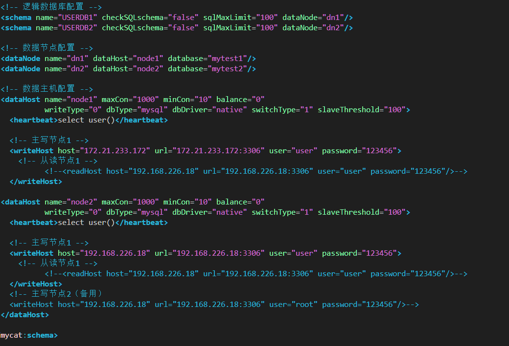
>
> balance为 0
>
> 


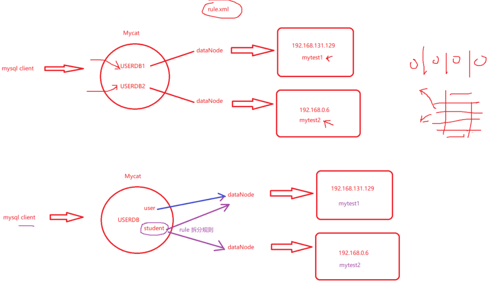

> ### **6. 示例场景**
>
> - **垂直拆分**：
>   - 将 `user` 表和 `student` 表分布到不同的库中。
> - **水平拆分**：
>   - 将 `student` 表的数据按主键取模分布到两台机器上的两个表中。
>

---

## 总结
- 分库分表是应对数据库性能瓶颈的重要手段。
- 垂直拆分和水平拆分各有适用场景，需根据业务需求选择。
- MyCat 提供了强大的分库分表支持，简化了客户端操作。


# 二

### **1. MyCat 的作用**
1. **逻辑与物理分离**：
   - 客户端操作的是逻辑库和逻辑表，MyCat 负责将逻辑库表映射到真实的物理库表。
   - 通过 MyCat，开发者无需关心数据的实际存储位置。

2. **分库分表支持**：
   - 支持垂直拆分（按业务模块分库）和水平拆分（按规则分表）。
   - 提供多种分表算法（如取模、时间分片、一致性哈希等），满足不同业务需求。

3. **透明性**：
   - 对客户端透明，客户端只需操作逻辑库表，MyCat 自动完成数据路由、查询分发和结果合并。

4. **高可扩展性**：
   - 通过分库分表，可以将数据分布到多台机器上，降低单机压力，提高系统的并发处理能力。

---

### **2. 分库分表的实现**
#### **垂直拆分**
- 按业务模块将表分布到不同的库中。
- 适用于库中表过多且业务关联性较低的场景。

#### **水平拆分**
- 按规则（如主键取模）将单表的数据分布到多个表中。
- 适用于单表数据量过大的场景。

---

### **3. 配置文件的关键点**
1. **`schema.xml`**：
   - 定义逻辑库、逻辑表及其映射关系。
   - 示例：
     ```xml
     <table name="student" primaryKey="id" autoIncrement="true" dataNode="dn1,dn2" rule="modRule" />
     ```

2. **`rule.xml`**：
   - 定义分表规则。
   - 示例：
     ```xml
     <function name="modRule" class="io.mycat.route.function.PartitionByMod">
         <property name="count">2</property>
     </function>
     ```

3. **`server.xml`**：
   - 配置数据节点和物理数据库。

---

### **4. 示例场景**
- **水平拆分**：
  - 将 `student` 表的数据按主键取模分布到两台机器上的两个表中。
  - 插入数据时，MyCat 根据主键和分表规则决定数据存储位置。
  - 查询数据时，MyCat 自动在所有分表中查询并合并结果。

---

### **5. 优势**
- **性能提升**：通过分库分表降低单机压力，提高并发能力。
- **扩展性强**：可以随时增加数据节点，扩展系统容量。
- **开发简单**：开发者只需操作逻辑库表，无需关心底层数据分布。

---

### **6. 注意事项**
1. **分表规则的选择**：
   - 根据业务特点选择合适的分表规则（如取模、时间分片等）。
   - 分表规则一旦确定，后续修改会比较复杂。

2. **配置文件的正确性**：
   - 配置文件（如 `schema.xml`、`rule.xml`）需要严格按照 MyCat 的格式和要求编写。
   - 修改配置后需要重启 MyCat，并检查日志确认是否启动成功。

3. **数据一致性**：
   - 分库分表后，事务和数据一致性需要通过业务逻辑或分布式事务框架来保证。

---

### **总结**
MyCat 是分库分表场景中的重要工具，能够有效解决单机数据库的性能瓶颈问题。通过合理的配置和分表规则，可以显著提升系统的并发处理能力和扩展性。在实际应用中，需要根据业务需求选择合适的分库分表策略，并结合 MyCat 的功能进行实现。


# GUI工具

这节课主要讲解了 **MySQL 数据库的图形化界面工具（GUI）**，包括常用的工具 **小海豚（DBeaver 或类似工具）** 和 **Navicat**，以及它们的使用方法和注意事项。以下是内容的总结和关键点提炼：

---

### **1. 为什么使用图形化工具？**
- **简化操作**：相比命令行，图形化工具更直观，适合初学者或不熟悉命令行的用户。
- **提高效率**：通过界面化操作，可以快速完成数据库的增删改查、备份、导入导出等操作。
- **功能丰富**：支持表设计、数据管理、关系图展示等高级功能。

---

### **2. 常用的图形化工具**
#### **小海豚（DBeaver 或类似工具）**
- **特点**：
  - 免费、轻量级，占用资源少。
  - 适合电脑配置较低的用户。
- **适用场景**：
  - 基础的数据库操作，如增删改查、表设计等。
- **注意事项**：
  - 主要运行在 Windows 系统下，Mac 系统用户需自行查找是否有对应版本。

#### **Navicat**
- **特点**：
  - 功能强大，支持多种数据库（MySQL、PostgreSQL、SQLite 等）。
  - 提供高级功能，如数据同步、备份恢复、查询生成器等。
  - 收费软件，但可以通过试用版或其他方式体验。
- **适用场景**：
  - 需要更复杂的数据库管理功能时。
- **注意事项**：
  - Navicat 占用资源较多，适合电脑配置较高的用户。

---

### **3. 图形化工具的使用步骤**
#### **1. 远程连接 MySQL 数据库**
- **前提**：
  - 确保 MySQL 服务所在的服务器（如 Linux）允许远程连接。
  - 确保防火墙开放了 MySQL 的默认端口（3306）。
- **步骤**：
  1. **检查服务器 IP 是否可达**：
     - 在 Windows 下打开命令行，使用 `ping` 命令测试服务器 IP。
       ```bash
       ping 192.168.x.x
       ```
  2. **开放防火墙端口**（以 CentOS 为例）：
     - 查看当前开放的端口：
       ```bash
       firewall-cmd --list-ports
       ```
     - 开放 3306 端口：
       ```bash
       firewall-cmd --add-port=3306/tcp --permanent
       ```
     - 重启防火墙：
       ```bash
       systemctl restart firewalld
       ```
  3. **测试连接**：
     - 在图形化工具中输入服务器 IP、用户名、密码和端口，测试连接是否成功。

#### **2. 使用图形化工具操作数据库**
- **常见功能**：
  - **查看数据库和表**：左侧展示所有数据库和表，点击即可查看表结构和数据。
  - **执行 SQL 语句**：提供 SQL 编辑器，可以直接运行查询语句。
    ```sql
    SELECT * FROM student WHERE age > 18;
    ```
  - **导入导出数据**：
    - 导入：选择 SQL 文件或其他格式文件，将数据导入表中。
    - 导出：将表数据导出为 SQL 文件或其他格式。
  - **设计表结构**：
    - 使用架构设计器（Schema Designer）可视化表与表之间的关系。
    - 支持主键、外键、联合主键等设计。

---

### **4. 注意事项**
1. **远程连接问题**：
   - 确保服务器的防火墙已开放 3306 端口。
   - 确保 MySQL 配置文件（`my.cnf`）中允许远程连接：
     ```ini
     bind-address = 0.0.0.0
     ```
     然后重启 MySQL 服务：
     ```bash
     systemctl restart mysqld
     ```

2. **工具选择**：
   - 如果电脑配置较低，推荐使用小海豚等轻量级工具。
   - 如果需要高级功能，可以选择 Navicat。

3. **表设计的重要性**：
   - 在项目开发初期，需详细设计数据库表结构，避免后期频繁修改导致代码变更。

4. **术语规范**：
   - GUI 是 **Graphical User Interface** 的缩写，表示图形用户界面。
   - 不要用拼音“归”来代替 GUI。

---

### **5. 总结**
- 图形化工具为数据库操作提供了更直观和高效的方式，适合初学者和需要快速操作的场景。
- 小海豚和 Navicat 是两种常用工具，各有优缺点，可根据需求选择。
- 在使用图形化工具时，需注意远程连接的配置和数据库表设计的重要性。


# 看源码

这节课主要讲解了 **MySQL 源码的阅读方法**，并介绍了如何使用 **Source Insight** 和其他工具（如 VS Code）来高效地查看和分析源码。以下是内容的总结和关键点提炼：

---

### **1. 为什么要阅读 MySQL 源码？**
- **学习优秀设计**：
  - MySQL 是一个成熟的开源项目，源码中包含了许多优秀的设计思想和实现方法。
  - 通过阅读源码，可以深入理解数据库的核心原理，如存储引擎、索引结构、网络通信等。
- **理论结合实践**：
  - 将前面学习的理论知识与源码实现相结合，理解其背后的逻辑。
- **提升编程能力**：
  - 学习源码的编程风格、模块划分、接口设计等，提升自己的代码质量。
- **解决疑难问题**：
  - 当遇到文档或网络资料无法解答的问题时，可以通过源码找到最权威的答案。

---

### **2. 源码版本和工具选择**
- **源码版本**：
  - 本次课程选择的是 **MySQL 5.1.73** 版本。
  - 该版本相对稳定，适合学习和研究。
- **工具选择**：
  - **Windows 下**：推荐使用 **Source Insight**。
  - **Mac/Linux 下**：推荐使用 **VS Code** 或 **JetBrains CLion**。
  - **Source Insight 的优势**：
    - 专为源码阅读设计，支持快速搜索、符号跳转、代码关系图等功能。
    - 在 Windows 下是查看 C/C++ 源码的首选工具。

---

### **3. Source Insight 的使用步骤**
#### **1. 创建工程**
1. 打开 Source Insight，选择 `Project > New Project`。
2. 输入工程名称（如 `MySQL_Code`）。
3. 设置工程文件的存储路径（可以与源码目录相同）。
4. 添加源码目录到工程中，点击 `Add Tree`，将所有源码文件导入。

#### **2. 同步代码**
- 在导入源码后，选择 `Project > Synchronize Files`，等待工具完成文件索引。
- 索引完成后，可以通过工具的搜索功能快速定位代码中的符号、函数、变量等。

#### **3. 常用功能**
- **搜索符号**：
  - 使用 `Project > Search Project Symbols` 搜索函数、变量、宏定义等。
- **查看调用关系**：
  - 右键点击函数名，选择 `Relations`，查看函数的调用关系（谁调用了它，它调用了谁）。
- **快速跳转**：
  - 按住 `Ctrl` 并点击符号名，可以快速跳转到定义处。
- **代码结构图**：
  - 使用 `Tools > Relation Window` 查看代码的模块关系和调用图。

---

### **4. MySQL 源码结构**
- **源码目录结构**：
  - `sql/`：MySQL 的核心代码，包括 SQL 解析、执行、存储引擎接口等。
  - `storage/`：存储引擎相关代码，如 InnoDB、MyISAM 等。
  - `include/`：头文件目录，定义了全局变量、函数声明等。
  - `libmysql/`：客户端库代码。
  - `cmake/`：CMake 构建脚本。
  - `scripts/`：安装和初始化脚本。
  - `tests/`：测试代码。

- **核心文件**：
  - `sql/mysqld.cc`：MySQL 服务端的入口文件，包含主函数 `main`。
  - `sql/sql_parse.cc`：SQL 解析相关代码。
  - `sql/sql_executor.cc`：SQL 执行相关代码。
  - `storage/innobase/`：InnoDB 存储引擎的实现。

---

### **5. MySQL 服务端的主流程**
- **入口函数**：
  - `mysqld.cc` 中的 `main` 函数是 MySQL 服务端的入口。
  - 主要流程：
    1. **初始化**：
       - 初始化日志、线程、SSL 等模块。
    2. **网络初始化**：
       - 设置网络参数（如端口、地址重用等），并绑定监听端口。
    3. **事件循环**：
       - 使用 IO 复用（如 `select`）处理客户端连接。
       - 为每个连接创建线程，处理 SQL 请求。
    4. **清理资源**：
       - 关闭连接，释放内存，退出服务。

- **网络模块**：
  - 使用 `select` 实现 IO 复用，兼顾网络性能和磁盘 IO 的处理能力。
  - 处理新连接时，调用 `accept` 接收客户端请求，并分配线程处理。

- **线程池管理**：
  - 每个客户端连接对应一个线程。
  - 线程池的大小可以通过配置文件调整。

---

### **6. 阅读源码的建议**
1. **明确目标**：
   - 不要试图逐行阅读源码，而是聚焦于感兴趣的模块或功能。
   - 例如：
     - 想了解网络通信，可以阅读 `mysqld.cc` 和相关网络模块代码。
     - 想了解存储引擎，可以阅读 `storage/innobase` 中的代码。

2. **抓住主流程**：
   - 先理解代码的主流程，再深入到具体实现。
   - 例如：
     - MySQL 的主流程是从 `main` 函数开始的，可以从这里入手。

3. **结合文档和资料**：
   - 阅读源码时，可以结合官方文档或社区资料，帮助理解代码逻辑。

4. **使用工具辅助**：
   - 善用 Source Insight 的搜索、跳转、调用关系图等功能，提高阅读效率。

---

### **7. 总结**
- 阅读 MySQL 源码是深入理解数据库原理和提升编程能力的重要途径。
- 使用 Source Insight 或 VS Code 等工具，可以高效地查看和分析源码。
- 阅读源码时，应聚焦于核心模块和主流程，结合工具和资料，逐步深入。

如果对某些模块或功能有具体的疑问，可以随时告诉我！
