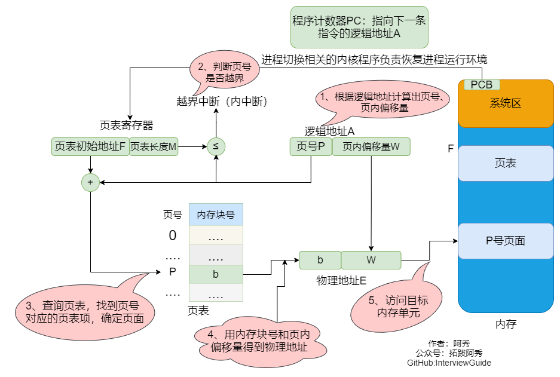

# 操作系统


## 1、进程、线程和协程的区别和联系

|          | 进程                                                         | 线程                                               | 协程                                                         |
| -------- | ------------------------------------------------------------ | -------------------------------------------------- | ------------------------------------------------------------ |
| 定义     | 资源分配和拥有的基本单位                                     | 程序执行的基本单位                                 | 用户态的轻量级线程，线程内部调度的基本单位                   |
| 切换情况 | 进程CPU环境(栈、寄存器、页表和文件句柄等)的保存以及新调度的进程CPU环境的设置 | 保存和设置程序计数器、少量寄存器和栈的内容         | 先将寄存器上下文和栈保存，等切换回来的时候再进行恢复         |
| 切换者   | 操作系统                                                     | 操作系统                                           | 用户                                                         |
| 切换过程 | 用户态->内核态->用户态                                       | 用户态->内核态->用户态                             | 用户态(没有陷入内核)                                         |
| 调用栈   | 内核栈                                                       | 内核栈                                             | 用户栈                                                       |
| 拥有资源 | CPU资源、内存资源、文件资源和句柄等                          | 程序计数器、寄存器、栈和状态字                     | 拥有自己的寄存器上下文和栈                                   |
| 并发性   | 不同进程之间切换实现并发，各自占有CPU实现并行                | 一个进程内部的多个线程并发执行                     | 同一时间只能执行一个协程，而其他协程处于休眠状态，适合对任务进行分时处理 |
| 系统开销 | 切换虚拟地址空间，切换内核栈和硬件上下文，CPU高速缓存失效、页表切换，开销很大 | 切换时只需保存和设置少量寄存器内容，因此开销很小   | 直接操作栈则基本没有内核切换的开销，可以不加锁的访问全局变量，所以上下文的切换非常快 |
| 通信方面 | 进程间通信需要借助操作系统                                   | 线程间可以直接读写进程数据段(如全局变量)来进行通信 | 共享内存、消息队列                                           |


1、进程是资源分配的基本单位，运行一个可执行程序会创建一个或多个进程，进程就是运行起来的可执行程序

2、线程是资源调度的基本单位，也是程序执行的基本单位，是轻量级的进程。每个进程中都有唯一的主线程，且只能有一个，主线程和进程是相互依存的关系，主线程结束进程也会结束。多提一句：协程是用户态的轻量级线程，线程内部调度的基本单位


> ### 补充-gpt
>
> ### **进程、线程和协程的区别与联系**
>
> ---
>
> ### **1. 定义**
> - **进程**：
>   - 操作系统资源分配的基本单位，每个进程有独立的内存空间和系统资源。
>   - 一个程序运行后至少会启动一个进程。
>
> - **线程**：
>   - CPU 调度的基本单位，是进程中的一个执行流。
>   - 一个进程可以包含多个线程，线程共享进程的内存和资源。
>
> - **协程**：
>   - 一种用户态的轻量级线程，由程序自身调度。
>   - 协程在一个线程内运行，切换时不需要操作系统的上下文切换。
>
> ---
>
> ### **2. 区别**
>
> | 特性         | 进程                           | 线程                             | 协程                                    |
> | ------------ | ------------------------------ | -------------------------------- | --------------------------------------- |
> | **调度**     | 由操作系统调度                 | 由操作系统调度                   | 由程序自身调度                          |
> | **资源占用** | 独立的内存空间，资源开销大     | 共享进程资源，开销较小           | 运行在线程内，开销最小                  |
> | **切换开销** | 进程切换需要上下文切换，开销大 | 线程切换需要上下文切换，开销较小 | 协程切换无需上下文切换，开销极小        |
> | **并发性**   | 进程之间可以并发               | 同一进程内的线程可以并发         | 协程本质是单线程，不能并行,但是可以并发 |
> | **通信方式** | 进程间通信（IPC）              | 共享内存、同步机制               | 通过共享内存直接通信                    |
> | **依赖关系** | 独立存在                       | 依赖进程                         | 依赖线程                                |
>
> ---
>
> ### **3. 联系**
> - **线程属于进程**：
>   - 一个进程可以包含多个线程，线程共享进程的资源（如内存、文件句柄等）。
>   - 线程是进程的执行单元，进程至少有一个主线程。
>
> - **协程运行在线程中**：
>   - 协程是线程中的更小的执行单元，多个协程可以在一个线程中切换执行。
>   - 协程的调度由程序控制，而不是操作系统。
>
> - **资源共享**：
>   - 线程和协程都可以共享进程的资源，但协程的切换更加轻量。
>
> ---
>
> ### **4. 应用场景**
> - **进程**：
>   - 适用于需要高隔离的任务，如多进程服务器、分布式系统。
>   - 例如：浏览器的多进程架构（每个标签页一个进程）。
>
> - **线程**：
>   - 适用于需要并发执行的任务，如多线程下载、并发计算。
>   - 例如：Java 的多线程编程。
>
> - **协程**：
>   - 适用于高并发、I/O 密集型任务，如异步编程、事件驱动模型。
>   - 例如：Python 的 `asyncio`、Go 的 goroutine。
>
> ---
>
> ### **5. 总结**
> - **进程**：资源隔离性强，开销大，适合高隔离任务。
> - **线程**：共享资源，开销较小，适合并发任务。
> - **协程**：轻量级，切换开销低，适合高并发和 I/O 密集型任务。
>
> 三者的选择取决于具体的应用场景和性能需求。

> **协程不能并行**，但可以并发。
>
> ---
>
> ### **1. 协程是单线程的**
> - 协程运行在单个线程中，多个协程通过程序自身的调度机制切换执行。
> - 因为协程依赖于线程，而线程本身是`单核 CPU 上`的`执行单元`，所以协程在单个线程中无法实现真正的**并行**（多个任务同时执行）。
> - 线程本身是可以并行的(多核),但是开销大
> - 一般 线程数根据 cpu核心数 对齐, 所以一般 一个线程对应一个 核心
>
> ---
>
> ### **2. 并发 vs 并行**
> - **并发**：多个任务在同一时间段内交替执行，但在某一时刻只有一个任务在运行。
>   - 协程通过主动让出控制权（如 `await` 或 `yield`），实现任务之间的快速切换，从而达到并发效果。
> - **并行**：多个任务在同一时刻同时运行，通常需要多核 CPU 支持。
>   - 协程本身是单线程的，因此无法实现真正的并行。
>
> ---
>
> ### **3. 协程的并行性**
> - 如果需要协程实现并行，可以通过多线程或多进程的方式运行多个协程组。
> - 例如，在 Python 中，可以结合 `asyncio` 和 `ThreadPoolExecutor` 或 `ProcessPoolExecutor` 来实现协程的并行执行。
>
> ---
>
> ### **4. 总结**
> - **单线程不能并行**，因为一个线程在某一时刻只能运行一个任务。
> - **协程不能并行**，因为协程依赖于线程，运行在单线程中，但协程可以通过快速切换实现并发。


## 2、线程与进程的比较

1、线程启动速度快，轻量级   

2、线程的系统开销小   

3、线程使用有一定难度，需要处理数据一致性问题

4、同一线程共享的有堆、全局变量、静态变量、指针，引用、文件等，而独自占有栈

> ### 补充
>
> ### **进程与线程的资源共享总结**
>
> ---
>
> ### **1. 进程的资源共享**
>
> - **资源隔离性强**：
>   - 每个进程拥有独立的内存空间，包括代码段、数据段、堆和栈。
>   - 进程之间的资源（如文件描述符、变量）默认不共享。
>
> - **进程间通信（IPC）**：
>   - 如果需要共享数据，必须通过进程间通信机制（IPC），常见方式包括：
>     - **管道（Pipe）**
>     - **消息队列（Message Queue）**
>     - **共享内存（Shared Memory）**
>     - **信号量（Semaphore）**
>     - **套接字（Socket）**
>
> - **读时共享，写时复制（Copy-On-Write）**：
>   - 父子进程在创建时共享内存，避免不必要的复制。
>   - 当某个进程尝试写入共享内存时，操作系统会为其分配独立的内存页。
>   - 这种机制提高了进程创建效率，同时节省了内存资源。
>
> ---
>
> ### **2. 线程的资源共享**
>
> - **线程属于同一进程**：
>   - 同一进程中的线程共享进程的资源，包括：
>     - **内存空间**（代码段、数据段、堆）
>     - **文件描述符**（打开的文件、套接字等）
>     - **全局变量**
>   - #### **每个线程有独立的栈空间和寄存器，用于存储私有数据和执行状态。**
>
> - **线程间通信**：
>   
>   - 由于线程共享进程资源，线程间通信比进程间通信更高效。
>   - 常用的同步机制包括：
>     - **互斥锁（Mutex）**
>     - **条件变量（Condition Variable）**
>     - **信号量（Semaphore）**
>
> ---
>
> ### **3. 进程与线程的资源共享对比**
>
> | **特性**       | **进程**      | **线程**               |
> | -------------- | ------------- | ---------------------- |
> | **内存空间**   | 独立          | 共享                   |
> | **文件描述符** | 独立          | 共享                   |
> | **全局变量**   | 独立          | 共享                   |
> | **栈空间**     | 独立          | 独立                   |
> | **通信方式**   | 需要 IPC 机制 | 直接共享内存，效率更高 |
> | **隔离性**     | 高            | 低                     |
>
> ---
>
> ### **4. 总结**
>
> - **进程**：
>   - 资源隔离性强，默认不共享资源，适合需要高隔离的场景。
>   - 通信成本较高，通常需要借助 IPC 机制。
>
> - **线程**：
>   - 资源共享性强，适合需要高效通信的场景。
>   - 由于共享资源，容易引发数据竞争问题，需要同步机制（如锁）来保证线程安全。

## 2.2、补充另一种问法

**线程和进程的区别？**

- 调度：线程是调度的基本单位（PC，状态码，通用寄存器，线程栈及栈指针）；进程是拥有资源的基本单位（打开文件，堆，静态区，代码段等）。

- 并发性：一个进程内多个线程可以并发（最好和CPU核数相等）；多个进程可以并发。

- 拥有资源：线程不拥有系统资源，但一个进程的多个线程可以共享隶属进程的资源；进程是拥有资源的独立单位。

- 系统开销：线程创建销毁只需要处理PC值，状态码，通用寄存器值，线程栈及栈指针即可；进程创建和销毁需要重新分配及销毁task_struct结构。

> ### 补充
>
> 以下是关于 **PC（程序计数器）**、**状态码**、**通用寄存器**、**线程栈及栈指针** 的简要说明及它们在计算机系统中的作用：
>
> ---
>
> ### **1. PC（Program Counter，程序计数器）**
> - **定义**：
>   - 程序计数器是一个寄存器，用于存储当前线程正在执行的指令地址。
> - **作用**：
>   - 指示 CPU 下一条要执行的指令的位置。
>   - 在指令执行过程中，PC 会自动递增，指向下一条指令。
>   - 在函数调用或跳转指令时，PC 会被修改为目标地址。
> - **线程相关性**：
>   - 每个线程都有自己的程序计数器，保证线程独立执行。
>
> ---
>
> ### **2. 状态码（Flags 或 Status Register）**
> - **定义**：
>   - 状态码是 CPU 中的一个特殊寄存器（通常称为标志寄存器），用于记录指令执行后的状态信息。
> - **作用**：
>   - 存储指令执行后的结果状态，例如：
>     - **零标志（ZF）**：结果是否为零。
>     - **进位标志（CF）**：是否发生进位或借位。
>     - **溢出标志（OF）**：是否发生算术溢出。
>     - **符号标志（SF）**：结果是否为负数。
>   - 状态码用于条件分支指令（如 `if` 或 `while`）的判断。
>
> ---
>
> ### **3. 通用寄存器**
> - **定义**：
>   - 通用寄存器是 CPU 中的一组寄存器，用于存储临时数据、操作数或指令执行的中间结果。
> - **作用**：
>   - 提供快速访问的数据存储，用于加速指令执行。
>   - 常见的通用寄存器（以 x86 为例）：
>     - **EAX/AX**：累加器寄存器，通常用于算术运算。
>     - **EBX/BX**：基址寄存器，常用于存储内存地址。
>     - **ECX/CX**：计数器寄存器，常用于循环计数。
>     - **EDX/DX**：数据寄存器，常用于 I/O 操作或扩展运算。
> - **线程相关性**：
>   - 每个线程都有自己的通用寄存器副本，线程切换时需要保存和恢复这些寄存器的值。
>
> ---
>
> ### **4. 线程栈及栈指针**
> - **线程栈**：
>   - 每个线程都有自己的栈，用于存储函数调用信息（如返回地址、局部变量、参数等）。
>   - 栈是线程私有的，保证线程之间的独立性。
> - **栈指针（SP，Stack Pointer）**：
>   - 栈指针是一个寄存器，指向当前栈顶的位置。
>   - 在函数调用时，栈指针会向下移动以分配空间；在函数返回时，栈指针会向上移动以释放空间。
> - **作用**：
>   - 管理函数调用的上下文，包括参数传递、局部变量存储和返回地址保存。
>   - 栈指针的变化由指令（如 `PUSH` 和 `POP`）自动管理。
> - **线程相关性**：
>   - 每个线程有独立的栈和栈指针，线程切换时需要保存和恢复栈指针的值。
>
> ---
>
> ### **总结**
> | **概念**             | **作用**                                                     |
> | -------------------- | ------------------------------------------------------------ |
> | **PC（程序计数器）** | 指向当前线程正在执行的指令地址，控制程序的执行流。           |
> | **状态码**           | 记录指令执行后的状态信息，用于条件判断和分支指令。           |
> | **通用寄存器**       | 存储临时数据和中间结果，加速指令执行。                       |
> | **线程栈及栈指针**   | 管理函数调用的上下文（如局部变量、参数和返回地址），保证线程的独立性。 |
>
> 这些概念共同构成了线程执行的基础，确保线程能够独立、高效地运行，同时支持多线程环境下的上下文切换。

<p  id="一个进程可以创建多少线程和什么有关"></p>

## 3、一个进程可以创建多少线程，和什么有关？

这个要分不同系统去看：

- 如果是32 位系统，用户态的虚拟空间只有 3G，如果创建线程时分配的栈空间是 10M，那么一个进程最多只能创建 300 个左右的线程。

  > 补充
  >
  > - linux默认栈空间8M, 因此 380左右
  > - ulimit -a
- 如果是64 位系统，用户态的虚拟空间大到有 128T，理论上不会受虚拟内存大小的限制，而会受系统的参数或性能限制。

顺便多说一句，过多的线程将会导致大量的时间浪费在线程切换上，给程序运行效率带来负面影响，无用线程要及时销毁。

<p  id="外中断和异常有什么区别"></p>


## 4、外中断和异常有什么区别？

外中断是指由 `CPU 执行指令以外的事件`引起，如 `I/O 完成中断`，表示设备输入/输出处理已经完成，处理器能够发送下一个输入/输出请求。此外还有`时钟中断`、`控制台中断`等。

而异常时由 `CPU 执行指令的内部事件`引起，如非法操作码、地址越界、算术溢出等。

<p  id="进程线程模型你知道多少"></p>


## 5、进程线程模型你知道多少？

对于进程和线程的理解和把握可以说基本奠定了对系统的认知和把控能力。其核心意义绝不仅仅是“线程是调度的基本单位，进程是资源分配的基本单位”这么简单。

### 多线程

我们这里讨论的是用户态的多线程模型，同一个进程内部有多个线程，所有的线程共享同一个进程的内存空间，`进程中定义的全局变量会被所有的线程共享`，比如有全局变量int i = 10，这一进程中所有并发运行的线程都可以读取和修改这个i的值，而多个线程被CPU调度的顺序又是不可控的，所以对`临界资源(可能引发竟态条件)的访问`尤其需要注意安全。

我们必须知道，**做一次简单的i = i + 1在计算机中并不是原子操作，涉及内存取数，计算和写入内存几个环节，**而线程的切换有可能发生在上述任何一个环节中间，所以不同的操作顺序很有可能带来意想不到的结果。

但是，虽然线程在安全性方面会引入许多新挑战，但是线程带来的好处也是有目共睹的。首先，原先顺序执行的程序（暂时不考虑多进程）可以被拆分成几个独立的逻辑流，这些逻辑流可以独立完成一些任务（最好这些任务是不相关的）。

比如 QQ 可以一个线程处理聊天一个线程处理上传文件，两个线程互不干涉，在用户看来是同步在执行两个任务，试想如果线性完成这个任务的话，在数据传输完成之前用户聊天被一直阻塞会是多么尴尬的情况。

对于线程，我认为弄清以下两点非常重要：

- 线程之间有无先后访问顺序（线程依赖关系）

- 多个线程共享访问同一变量（同步互斥问题）

另外，我们通常只会去说同一进程的多个线程共享进程的资源，但是每个线程特有的部分却很少提及，除了标识线程的tid，每个线程还有自己`独立的栈空间`，线程彼此之间是无法访问其他线程栈上内容的。

而作为处理机调度的最小单位，线程调度只需要保存线程栈、寄存器数据和PC即可，相比进程切换开销要小很多。

线程相关接口不少，主要需要了解各个参数意义和返回值意义。

1. 线程创建和结束

   - 背景知识：

     在一个文件内的多个函数通常都是按照main函数中出现的顺序来执行，但是在分时系统下，我们可以让每个函数都作为一个逻辑流并发执行，最简单的方式就是采用多线程策略。在main函数中调用多线程接口创建线程，每个线程对应特定的函数（操作），这样就可以不按照main函数中各个函数出现的顺序来执行，避免了忙等的情况。线程基本操作的接口如下。

   - 相关接口：

     - 创建线程：`int pthread_create(pthread_t *tidp,const pthread_attr_t *attr, void *(*start_rtn)(void*),void *arg)`;

       创建一个新线程，pthread和start_routine不可或缺，分别用于标识线程和执行体入口，其他可以填NULL。

       - pthread：用来返回线程的tid，*pthread值即为tid，类型pthread_t == unsigned long int。

       - attr：指向线程属性结构体的指针，用于改变所创线程的属性，填NULL使用默认值。

       - start_routine：线程执行函数的首地址，传入函数指针。

       - arg：通过地址传递来传递函数参数，这里是无符号类型指针，可以传任意类型变量的地址，在被传入函数中先强制类型转换成所需类型即可。

     - 获得线程ID：`pthread_t pthread_self()`;

       调用时，会打印线程ID。

     - 等待线程结束：`int pthread_join`(pthread_t tid, void** retval);

       主线程调用，等待子线程退出并回收其资源，类似于进程中wait/waitpid回收僵尸进程，调用pthread_join的线程会被阻塞。

       - tid：创建线程时通过指针得到tid值。

       - retval：指向返回值的指针。

     - 结束线程：`pthread_exit(void *retval)`;

       子线程执行，用来结束当前线程并通过retval传递返回值，该返回值可通过pthread_join获得。

       - retval：同上。

     - 分离线程：`int pthread_detach(pthread_t tid)`;

       主线程、子线程均可调用。主线程中pthread_detach(tid)，子线程中pthread_detach(pthread_self())，调用后和主线程分离，子线程结束时自己立即回收资源。

       - tid：同上。

2. 线程属性值修改

   - 背景知识：

     线程属性对象类型为`pthread_attr_t`，结构体定义如下：

     ```C
     typedef struct{
         int detachstate;    // 线程分离的状态
         int schedpolicy;    // 线程调度策略
         struct sched_param schedparam;    // 线程的调度参数
         int inheritsched;    // 线程的继承性
         int scope;    // 线程的作用域
         // 以下为线程栈的设置
         size_t guardsize;    // 线程栈末尾警戒缓冲大小
         int stackaddr_set;    // 线程的栈设置
         void *    stackaddr;    // 线程栈的位置
         size_t stacksize;    // 线程栈大小
     }pthread_attr_t;
     ```
- 相关接口：
  
  对上述结构体中各参数大多有：pthread_attr_get()和pthread_attr_set()系统调用函数来设置和获取。这里不一一罗列。

### 多进程

每一个进程是资源分配的基本单位。

进程结构由以下几个部分组成：代码段、堆栈段、数据段。代码段是静态的二进制代码，多个程序可以共享。

实际上在父进程创建子进程之后，父、子进程除了pid外，几乎所有的部分几乎一样。

父、子进程共享全部数据，但并不是说他们就是对同一块数据进行操作，子进程在读写数据时会通过写时复制机制将公共的数据重新拷贝一份，之后在拷贝出的数据上进行操作。

如果`子进程`想要运行自己的代码段，还可以通过`调用execv()函数`重新加载`新的代码段`，之后就和父进程独立开了。

我们在shell中执行程序就是通过shell进程先fork()一个子进程再通过execv()重新加载新的代码段的过程。

1. 进程创建与结束

   - 背景知识：

     进程有两种创建方式，一种是操作系统创建的一种是父进程创建的。从计算机启动到终端执行程序的过程为：0号进程 -> 1号内核进程 -> 1号用户进程(init进程) -> getty进程 -> shell进程 -> 命令行执行进程。所以我们在命令行中通过 ./program执行可执行文件时，所有创建的进程都是shell进程的子进程，这也就是为什么shell一关闭，在shell中执行的进程都自动被关闭的原因。从shell进程到创建其他子进程需要通过以下接口。

   - 相关接口：

     - 创建进程：`pid_t fork(void)`;

       返回值：出错返回-1；父进程中返回pid > 0；子进程中pid == 0

     - 结束进程：`void exit(int status)`;

       - status是退出状态，保存在全局变量中S?，通常0表示正常退出。

     - 获得PID：`pid_t getpid(void)`;

       返回调用者pid。

     - 获得父进程PID：`pid_t getppid(void)`;

       返回父进程pid。

   - 其他补充：

     - `正常退出方式`：exit()、_exit()、return（在main中）。

       exit()和_exit()区别：exit()是对\__exit()的封装，都会终止进程并做相关收尾工作，最主要的区别是`_exit()`函数关闭全部描述符和清理函数后`不会刷新流`，但是`exit()`会在`调用_exit()函数前刷新数据流`。

       return和exit()区别：exit()是函数，但有参数，执行完之后控制权交给系统。return若是在调用函数中，执行完之后控制权交给调用进程，若是在main函数中，控制权交给系统。

     - `异常退出方式`：abort()、终止信号。

2. Linux进程控制

- 进程地址空间（地址空间）

  虚拟存储器为每个进程提供了独占系统地址空间的假象。

  尽管每个进程地址空间内容不尽相同，但是他们的都有相似的结构。X86 Linux进程的地址空间底部是保留给用户程序的，包括文本、数据、堆、栈等，其中文本区和数据区是通过存储器映射方式将磁盘中可执行文件的相应段映射至虚拟存储器地址空间中。

  有一些"敏感"的地址需要注意下，对于32位进程来说，代码段从0x08048000开始。从0xC0000000开始到0xFFFFFFFF是内核地址空间，通常情况下代码运行在用户态（使用0x00000000 ~ 0xC00000000的用户地址空间），当`发生系统调用、进程切换等操作`时CPU控制寄存器设置模式位，进入内核模式，在该状态（超级用户模式）下`进程可以访问全部存储器位置和执行全部指令`。--有安全问题

  也就说32位进程的地址空间都是4G，但用户态下只能访问低3G的地址空间，若要访问3G ~ 4G的地址空间则只有进入内核态才行。

- 进程控制块（处理机）

  进程的调度实际就是内核选择相应的进程控制块，被选择的进程控制块中包含了一个进程基本的信息。

- 上下文切换

  内核管理所有进程控制块，而进程控制块记录了进程全部状态信息。每一次进程调度就是一次上下文切换，所谓的上下文本质上就是当前运行状态，主要包括`通用寄存器、浮点寄存器、状态寄存器、程序计数器、用户栈和内核数据结构（页表、进程表、文件表）等`。

  进程执行时刻，内核可以决定抢占当前进程并开始新的进程，这个过程由内核调度器完成，当调度器选择了某个进程时称为该进程被调度，该过程通过上下文切换来改变当前状态。

  `一次完整的上下文切换`通常是进程原先运行于用户态，之后因系统调用或时间片到切换到内核态执行内核指令，完成上下文切换后回到用户态，此时已经切换到进程B。
  
  > ### 补充
  >
  > 一次完整的上下文切换包括以下步骤：
  >
  > 1. 当前任务运行于用户态。
  > 2. 因时间片耗尽、系统调用或中断切换到内核态。
  > 3. 操作系统保存当前任务的上下文。
  > 4. 调度器选择下一个任务。
  > 5. 恢复新任务的上下文。
  > 6. 新任务切换回用户态继续运行。


> 感谢网友勘误https://github.com/forthespada/InterviewGuide/issues/32，-2022.02.22

<p  id="进程调度算法你了解多少"></p>


## 6、进程调度算法你了解多少？

### 1、 **先来先服务 first-come first-serverd（FCFS）**  

非抢占式的调度算法，按照请求的顺序进行调度。

`有利于长作业，但不利于短作业`，因为短作业必须一直等待前面的长作业执行完毕才能执行，而长作业又需要执行很长时间，造成了短作业等待时间过长。

### 2、 **短作业优先 shortest job first（SJF）**  

非抢占式的调度算法，按估计运行时间最短的顺序进行调度。

`长作业有可能会饿死`，处于一直等待短作业执行完毕的状态。因为如果一直有短作业到来，那么长作业永远得不到调度。

### 3、**最短剩余时间优先 shortest remaining time next（SRTN）**  

最短作业优先的`抢占式版本`，`按剩余运行时间的顺序进行调度`。 当一个新的作业到达时，其整个运行时间与当前进程的剩余时间作比较。

如果新的进程需要的时间更少，则挂起当前进程，运行新的进程。否则新的进程等待。

### 4、**时间片轮转**  

将所有就绪进程按 FCFS 的原则排成一个队列，每次调度时，把 CPU 时间分配给队首进程，该进程可以执行一个时间片。

当时间片用完时，由计时器发出时钟中断，调度程序便停止该进程的执行，并将它送往就绪队列的末尾，同时继续把 CPU 时间分配给队首的进程。

时间片轮转算法的效率和时间片的大小有很大关系：

- 因为进程切换都要保存进程的信息并且载入新进程的信息，如果时间片太小，会导致进程切换得太频繁，在进程切换上就会花过多时间。
- 而如果时间片过长，那么实时性就不能得到保证。


### 5、**优先级调度**  

为每个进程分配一个优先级，按优先级进行调度。

为了`防止低优先级`的进程永远等不到调度，可以随着时间的推移`增加等待进程的优先级`。

### 6、**多级反馈队列**  

一个进程需要执行 100 个时间片，如果采用时间片轮转调度算法，那么需要交换 100 次。

多级队列是为这种需要连续执行多个时间片的进程考虑，它设置了多个队列，每个队列时间片大小都不同，例如 1,2,4,8,..。进程在第一个队列没执行完，就会被移到下一个队列。

这种方式下，之前的进程只需要交换 7 次。每个队列优先权也不同，最上面的优先权最高。因此只有上一个队列没有进程在排队，才能调度当前队列上的进程。

可以将这种调度算法看成是时间片轮转调度算法和优先级调度算法的结合。


<p  id="里牛客死下进程间通信方式"></p>


## 7、Linux下进程间通信方式？

- 管道：

  - 无名管道（内存文件）：管道是一种半双工的通信方式，数据只能单向流动，而且只能在具有亲缘关系的进程之间使用。进程的亲缘关系通常是指父子进程关系。

  - 有名管道（FIFO文件，借助文件系统）：有名管道也是半双工的通信方式，但是允许在没有亲缘关系的进程之间使用，管道是先进先出的通信方式。

- 共享内存：共享内存就是映射一段能被其他进程所访问的内存，这段共享内存由一个进程创建，但多个进程都可以访问。共享内存是最快的IPC方式，它是针对其他进程间通信方式运行效率低而专门设计的。它往往与信号量，配合使用来实现进程间的同步和通信。

- 消息队列：消息队列是有消息的链表，存放在内核中并由消息队列标识符标识。消息队列克服了信号传递信息少、管道只能承载无格式字节流以及缓冲区大小受限等缺点。

- 套接字：适用于不同机器间进程通信，在本地也可作为两个进程通信的方式。

- 信号：用于通知接收进程某个事件已经发生，比如按下ctrl + C就是信号。

- 信号量：信号量是一个计数器，可以用来控制多个进程对共享资源的访问。它常作为一种锁机制，实现进程、线程的对临界区的同步及互斥访问。

<p  id="李牛可爱下同步机制"></p>

## 8、Linux下同步机制？

- **POSIX信号量**：可用于**进程同步**，也可用于**线程同步**。

- POSIX互斥锁 + 条件变量：只能用于线程同步。

<p  id="如果系统中具有快表后那么地址的转换过程变成什么样了"></p>

## 9、如果系统中具有快表后，那么地址的转换过程变成什么样了？

 **快表（TLB，Translation Lookaside Buffer）** 是一种 **硬件缓存**(cache)，它**不在内存中**，而是在 **CPU 内部**，或者说在 CPU 芯片上的缓存区中。

> ①CPU给出逻辑地址，由某个硬件算得页号、页内偏移量，将页号与快表中的所有页号进行比较。
>
> ②如果找到匹配的页号，说明要访问的页表项在快表中有副本，则直接从中取出该页对应的内存块号，再将内存块号与页内偏移量拼接形成物理地址，最后，访问该物理地址对应的内存单元。因此，若快表命中，则访问某个逻辑地址仅需一次访存即可。
>
> ③如果没有找到匹配的页号，则需要访问内存中的页表，找到对应页表项，得到页面存放的内存块号，再将内存块号与页内偏移量拼接形成物理地址，最后，访问该物理地址对应的内存单元。因此,若快表未命中，则访问某个逻辑地址需要两次访存(注意:在找到页表项后，应同时将其存入快表,以便后面可能的再次访问。但若快表已满，则必须按照-定的算法对旧的页表项进行替换)

由于查询快表的速度比查询页表的速度快很多，因此只要快表命中，就可以节省很多时间。
因为局部性原理，–般来说快表的命中率可以达到90%以上。

例:某系统使用基本分页存储管理，并采用了具有快表的地址变换机构。访问一次快表耗时1us， 访问一次内存耗时100us。若快表的命中率为90%，那么访问一个逻辑地址的平均耗时是多少?
(1+100) * 0.9 + (1+100+100) * 0.1 = 111 us   ----  页表也在内存中

有的系统支持快表和慢表(就是页表)同时查找，如果是这样，平均耗时应该是(1+100) * 0.9+ (100+100) *0.1=110.9 us

若未采用快表机制，则访问一个逻辑地址需要100+100 = 200us

显然，引入快表机制后，访问一个逻辑地址的速度快多了。


>              +------------------------+
>              |      虚拟地址 VA       |
>              +------------------------+
>                          |
>                          v
>           +-----------------------------+
>           |     拆分为 VPN + Offset     |
>           +-----------------------------+
>                          |
>                          v
>                 +-----------------+
>                 | 查 TLB（快表）  |
>                 +-----------------+
>                  /         \
>         命中（Hit）       未命中（Miss）
>            |                  |
>            v                  v
>     +----------------+  +-------------------+
>     | 得到 PFN       |  | 去页表（慢表）查VPN|
>     | 拼接 Offset    |  | 得到 PFN，更新TLB |
>     +----------------+  +-------------------+
>            |                  |
>            v                  v
>      +-------------------------------+
>      | 拼接 PFN 和 Offset 得物理地址 |
>      +-------------------------------+


## 10、内存交换和覆盖有什么区别？

交换技术主要是在不同进程（或作业）之间进行，而`覆盖则用于同一程序或进程中`。


## 11、动态分区分配算法有哪几种？可以分别说说吗？

### 1、首次适应算法

算法思想：每次都从低地址开始查找，找到第–个能满足大小的空闲分区。

如何实现：空闲分区以`地址递增的次`序排列。每次分配内存时顺序查找空闲分区链( 或空闲分[表)，找到大小能满足要求的第-一个空闲分区。


### 2、最佳适应算法

算法思想:由于动态分区分配是一种`连续分配方式`，为各进程分配的空间必须是连续的一整片区域。因此为了保证当“大进程”到来时能有连续的大片空间，可以`尽可能多地留下大片的空闲区`,即，`优先使用更小的空闲区`。

如何实现:空闲分区按`容量递增次序`链接。每次分配内存时顺序查找空闲分区链(或空闲分区表)，找到大小能满足要求的第-一个空闲分区。


> #### 最佳--大量碎片的原因
>
> - **示例**：
>   - 假设有以下空闲分区：`[20KB, 50KB, 100KB]`。
>   - 请求分配 `18KB`，最佳适配选择 `20KB` 分区，剩余 `2KB`。
>   - 剩余的 `2KB` 很可能无法满足后续的分配请求，成为碎片。


### 3、最坏适应算法

又称最大适应算法(Largest Fit)

算法思想:为了解决最佳适应算法的问题—即留下太多难以利用的小碎片，可以在每次分配时优先使用最大的连续空闲区，这样分配后剩余的空闲区就不会太小，更方便使用。

如何实现:空闲分区`按容量递减次序`链接。每次分配内存时顺序查找空闲分区链(或空闲分区表)，找到大小能满足要求的第-一个空闲分区。


### 4、邻近适应算法

算法思想：首次适应算法每次都从链头开始查找的。这可能会导致低地址部分出现很多小的空闲分区，而每次分配查找时，都要经过这些分区，因此也增加了查找的开销。如果每次都从上次查找结束的位置开始检索，就能解决上述问题。

如何实现：空闲分区以地址递增的顺序排列(可排成-一个循环链表)。每次分配内存时`从上次查找结束的位置`开始查找空闲分区链(或空闲分区表)，找到大小能满足要求的第一个空闲分区。


##### 5、总结

`首次适应不仅最简单，通常也是最好最快`，不过首次适应算法会使得内存低地址部分出现很多小的空闲分区，而每次查找都要经过这些分区，因此也增加了查找的开销。

`邻近算法试图解决这个问题`，但实际上，它常常`会导致在内存的末尾`分配空间`分裂成小的碎片`，它通常比首次适应算法结果要差。

最佳导致大量碎片，最坏导致没有大的空间。

进过实验，首次适应比最佳适应要好，他们都比最坏好。

| 算法     | 算法思想                                           | 分区排列顺序                                 | 优点                                                         | 缺点                                                         |
| -------- | -------------------------------------------------- | -------------------------------------------- | ------------------------------------------------------------ | ------------------------------------------------------------ |
| 首次适应 | 从头到尾找适合的分区                               | 空闲分区以地址递增次序排列                   | 综合看性能最好。**算法开销小**，回收分区后一.般不需要对空闲分区队列重新排序 |                                                              |
| 最佳适应 | 优先使用更小的分区，以保留更多大分区               | 空闲分区以容量递增次序排列                   | 会有更多的大分区被保留下来，更能满足大进程需求               | 会产生很多太小的、难以利用的碎片;**算法开销大**，回收分区后可能需要对空闲分区队列重新排序 |
| 最坏适应 | 优先使用更大的分区，以防止产生太小的不可用的碎片   | 空闲分区以容量递减次序排列                   | 可以减少难以利用的小碎片                                     | 大分区容易被用完，不利于大进程;**算法开销大**(原因同上)      |
| 邻近适应 | 由首次适应演变而来，每次从上次查找结束位置开始查找 | 空闲分区以地址递增次序排列(可排列成循环链表) | 不用每次都从低地址的小分区开始检索。**算法开销小**(原因同首次适应算法) | 会使高地址的大分区也被用完                                   |

<p  id="虚拟技术你了解吗"></p>


## 12、虚拟技术你了解吗？

虚拟技术把一个物理实体转换为多个逻辑实体。

主要有两种虚拟技术：`时（时间）分复用技术`和`空（空间）分复用技术`。

**多进程与多线程**：多个进程能在同一个处理器上`并发执行`使用了`时分复用技术`，让每个进程轮流占用处理器，每次只执行一小个时间片并快速切换。

**虚拟内存**: 使用了`空分复用技术`，它将物理内存抽象为地址空间，每个进程都有各自的地址空间。地址空间的页被映射到物理内存，地址空间的页并不需要全部在物理内存中，当使用到一个没有在物理内存的页时，执行页面置换算法，将该页置换到内存中。

> ### 补充
>
> ### **虚拟内存与页面置换机制**
>
> ---
>
> ### **1. 地址空间与物理内存的抽象**
>
> - **地址空间**：
>   - 操作系统将物理内存抽象为虚拟地址空间，每个进程都有独立的地址空间。
>   - 地址空间是进程可见的逻辑内存范围，进程通过虚拟地址访问内存。
>
> - **页（Page）**：
>   - 地址空间被划分为固定大小的页（通常为 `4KB`）。
>   - 每个页可以映射到物理内存中的一个`页框`（Page Frame）。
>
> - **映射关系**：
>   - 虚拟地址通过`页表（Page Table）`映射到物理地址。
>   - 页表记录了虚拟页与物理页框的对应关系。
>
> ---
>
> ### **2. 部分加载与按需调页**
> - **部分加载**：
>   - 地址空间的所有页并不需要全部加载到物理内存中。
>   - 只有当进程访问某个虚拟页时，操作系统才会将该页加载到物理内存。
>
> - **按需调页（Demand Paging）**：
>   - 当进程访问一个未加载到物理内存的虚拟页时，会触发**缺页中断（Page Fault）**。
>   - 操作系统会将该页从`磁盘加载到物理内存`中。
>
> ---
>
> ### **3. 页面置换算法**
> 当物理内存已满且需要加载新的页时，操作系统需要选择一个页从内存中移出（置换），以腾出空间。这时会使用**页面置换算法**。
>
> #### **常见页面置换算法**：
> 1. **FIFO（先进先出）算法**：**（First In First Out, FIFO）**
>    - 按照页进入内存的顺序，最早进入的页最先被置换。
>    - 简单易实现，但可能会导致性能问题（如 Belady 异常）。
>
> 2. **LRU（最近最少使用）算法**：**（Least Recently Used, LRU）**
>    - 置换最近最少被访问的页，假设最近使用的页在未来仍可能被访问。
>    - 需要记录每个页的访问时间，开销较大。
>
> 3. **LFU（最少使用）算法**：**（Least Frequently Used, LFU）**
>    - 置换访问次数最少的页，假设访问频率低的页在未来仍不常用。
>    - 需要维护每个页的访问计数。
>
> 4. **OPT（最佳置换）算法**：**（Optimal, OPT）**
>    - 理论上的最优算法，置换未来最长时间不会被访问的页。
>    - 需要预知未来的访问情况`，实际中无法实现`，通常用于评估其他算法的性能。
>
> 5. **Clock（时钟）算法**：
>    - 一种改进的 FIFO 算法，使用一个环形指针和访问位（Reference Bit）来决定置换的页。
>    - 简单高效，常用于实际系统中。
>
> ---
>
> ### **4. 页面置换的过程**
> 1. **缺页中断**：
>    - 当进程访问一个未加载的虚拟页时，触发缺页中断。
> 2. **查找页表**：
>    - 操作系统查找页表，确认该页是否存在于磁盘中。
> 3. **选择置换页**：
>    - 如果物理内存已满，操作系统根据页面置换算法选择一个页进行置换。
> 4. **加载新页**：
>    - 将新页从磁盘加载到物理内存中，并更新页表。
> 5. **恢复执行**：
>    - 缺页处理完成后，进程继续执行。
>
> ---
>
> 
>
> ### **总结**
>
> - **虚拟内存**：将物理内存抽象为地址空间，每个进程拥有独立的地址空间，虚拟地址通过页表映射到物理地址。
> - **按需调页**：地址空间的页`不需要全部加载`到物理内存，只有在`访问时才加载`，`未加载时`触发`缺页中断`。
> - **页面置换**：当物理内存不足时，使用页面置换算法将某些页移出内存，为新页腾出空间。
> - **常见页面置换算法**：
>   - **FIFO**：最早进入的页最先被置换。
>   - **LRU**：最近最少使用的页被置换。
>   - **LFU**：访问次数最少的页被置换。
>   - **OPT**：理论最优算法，置换未来最长时间不使用的页。
>   - **Clock**：改进的 FIFO，使用访问位判断置换页。
> - **目标**：通过虚拟内存和页面置换机制，提高内存利用率，支持更大的地址空间，同时保证系统性能和稳定性。


## 13、进程状态的切换你知道多少？


- 就绪状态（ready）：等待被调度
- 运行状态（running）
- 阻塞状态（waiting）：等待资源

应该注意以下内容：

- 只有就绪态和运行态可以相互转换，其它的都是单向转换。就绪状态的进程通过调度算法从而获得 CPU 时间，转为运行状态；而运行状态的进程，在分配给它的 CPU 时间片用完之后就会转为就绪状态，等待下一次调度。
- 阻塞状态是缺少需要的资源从而由运行状态转换而来，但是该资源不包括 CPU 时间，缺少 CPU 时间会从运行态转换为就绪态。


> ### 补充
>
> 推荐施磊线程池中的 说法, 这个不太准确

>感谢微信好友“Beautiful”指出配图文字笔误，已改正，感谢！-2021.05.31

<p  id="一个C/C++程序从开始编译到生成可执行文件的完整过程你能说出来多少"></p>


##  14、一个C/C++程序从开始编译到生成可执行文件的完整过程，你能说出来多少？

四个过程：

**（1）预编译**
主要处理源代码文件中的以“#”开头的预编译指令。处理规则见下

1、删除所有的**#define**，展开所有的宏定义。

2、处理所有的**条件预编译指令**，如“#if”、“#endif”、“#ifdef”、“#elif”和“#else”。

3、处理**#include**预编译指令，将文件内容替换到它的位置，这个过程是`递归进行`的，文件中包含其他
文件。

4、`删除所有的注释`，“//”和“/**/”。

5、保留所有的**#pragma 编译器指令**，编译器需要用到他们，如：#pragma once 是为了防止有文件被重
复引用。

6、**添加行号和文件标识**，便于编译时编译器产生调试用的行号信息，和编译时产生编译错误或警告是
能够显示行号。

> ### **预编译简述**
>
> 预编译是编译过程的第一步，主要处理源代码中的以 `#` 开头的预处理指令，具体包括以下内容：
>
> 1. **宏展开**：删除所有 `#define`，并展开宏定义。
> 2. **条件编译**：处理 `#if`、`#ifdef`、`#endif` 等条件预编译指令，保留符合条件的代码。
> 3. **文件包含**：处理 `#include` 指令，将被包含文件的内容递归替换到指令位置。
> 4. **注释删除**：移除所有注释（ 和 `/* */`）。
> 5. **保留编译器指令**：保留 `#pragma` 指令（如 `#pragma once`），供编译器使用。
> 6. **添加调试信息**：插入行号和文件标识，便于调试和错误定位。
>
> 预编译的输出是一个纯净的、无宏、无注释的代码文件（通常以 `.i` 或 `.ii` 结尾）。


**（2）编译**
把**预编译**之后生成的xxx**.i**或xxx.ii文件，进行一系列词法分析、语法分析、语义分析及优化后，生成相应的汇编代码文件。

1、词法分析：利用类似于“有限状态机”的算法，将源代码程序输入到扫描机中，将其中的字符序列分割成一系列的记号。

2、语法分析：语法分析器对由扫描器产生的记号，进行语法分析，产生语法树。由语法分析器输出的语法树是一种以表达式为节点的树。

3、语义分析：语法分析器只是完成了对表达式语法层面的分析，语义分析器则对表达式是否有意义进行判断，其分析的语义是静态语义——在编译期能分期的语义，相对应的动态语义是在运行期才能确定的语义。

4、优化：源代码级别的一个优化过程。

5、目标代码生成：由代码生成器将中间代码转换成目标机器代码，生成一系列的代码序列——汇编语言表示。

6、目标代码优化：目标代码优化器对上述的目标机器代码进行优化：寻找合适的寻址方式、使用位移来替代乘法运算、删除多余的指令等。

> ### **编译简述**
>
> 编译是将预编译后的代码（`.i` 或 `.ii` 文件）转化为汇编代码的过程，主要包括以下步骤：
>
> 1. **词法分析**：将源代码分割成记号（Token），如关键字、标识符、运算符等。
> 2. **语法分析**：根据语法规则生成语法树，表示代码的结构。
> 3. **语义分析**：检查代码的语义正确性（如类型匹配、变量是否声明等）。
> 4. **优化**：对代码进行源代码级优化（如常量折叠、消除冗余代码）。
> 5. **目标代码生成**：将中间代码转换为汇编代码。
> 6. **目标代码优化**：对汇编代码进行优化（如优化寻址方式、删除冗余指令）。
>
> 最终输出一个汇编代码文件（通常以 `.s` 结尾）。


**（3）汇编**

将汇编代码转变成机器可以执行的指令(机器码文件)。 汇编器的汇编过程相对于编译器来说更简单，没有复杂的语法，也没有语义，更不需要做指令优化，只是根据汇编指令和机器指令的对照表一一翻译过来，汇编过程有汇编器as完成。

经汇编之后，产生目标文件(与可执行文件格式几乎一样)xxx.o(Linux下)、xxx.obj(Windows下)。

**（4）链接**

将不同的源文件产生的目标文件进行链接，从而形成一个可以执行的程序。链接分为静态链接和动态链接：

**1、静态链接**

函数和数据被编译进一个二进制文件。在使用静态库的情况下，在编译链接可执行文件时，链接器从库中复制这些函数和数据并把它们和应用程序的其它模块组合起来创建最终的可执行文件。

空间浪费：因为每个可执行程序中对所有需要的目标文件都要有一份副本，所以如果多个程序对同一个目标文件都有依赖，会出现同一个目标文件都在内存存在多个副本；

更新困难：每当库函数的代码修改了，这个时候就需要重新进行编译链接形成可执行程序。

运行速度快：但是静态链接的优点就是，在可执行程序中已经具备了所有执行程序所需要的任何东西，在执行的时候运行速度快。

**2、动态链接**

动态链接的基本思想是把程序按照模块拆分成各个相对独立部分，在程序运行时才将它们链接在一起形成一个完整的程序，而不是像静态链接一样把所有程序模块都链接成一个单独的可执行文件。

共享库：就是即使需要每个程序都依赖同一个库，但是该库不会像静态链接那样在内存中存在多份副本，而是这多个程序在执行时共享同一份副本；

更新方便：更新时只需要替换原来的目标文件，而无需将所有的程序再重新链接一遍。当程序下一次运行时，新版本的目标文件会被自动加载到内存并且链接起来，程序就完成了升级的目标。

性能损耗：因为把链接推迟到了程序运行时，所以每次执行程序都需要进行链接，所以性能会有一定损失。

> ### **链接简述**
>
> 链接是将多个目标文件组合成一个可执行文件的过程，分为**静态链接**和**动态链接**：
>
> ---
>
> #### **1. 静态链接**
> - **特点**：
>   - 所有依赖的函数和数据在编译时被复制到可执行文件中。
>   - 每个可执行文件包含独立的库副本。
> - **优点**：
>   - 运行速度快（无需运行时链接）。
> - **缺点**：
>   - 空间浪费（多个程序重复存储相同的库）。
>   - 更新困难（库更新后需重新编译所有程序）。
>
> ---
>
> #### **2. 动态链接**
> - **特点**：
>   - 程序运行时才加载和链接所需的库。
>   - 多个程序共享同一个动态库副本。
> - **优点**：
>   - 节省内存（共享库）。
>   - 更新方便（无需重新编译程序）。
> - **缺点**：
>   - 运行时需要加载和链接，性能略有损耗。
>
> ---
>
> **总结**：  
> 静态链接适合对性能要求高的场景，动态链接更适合节省资源和便于维护的场景。

> ### 补充
>
> ### **静态库与动态库命令简述**
>
> #### **静态库**
> 1. **创建静态库**：
>    ```bash
>    gcc -c file1.c file2.c          # 编译为目标文件
>    ar rcs libmylib.a file1.o file2.o  # 创建静态库
>    ```
> 2. **使用静态库**：
>    ```bash
>    gcc main.c -L. -lmylib -o main  # 链接静态库
>    ```
>
> #### **动态库**
> 1. **创建动态库**：
>    ```bash
>    gcc -fPIC -c file1.c file2.c    # 编译为位置无关代码
>    gcc -shared -o libmylib.so file1.o file2.o  # 创建动态库
>    ```
> 2. **使用动态库**：
>    ```bash
>    gcc main.c -L. -lmylib -o main  # 链接动态库
>    export LD_LIBRARY_PATH=.:$LD_LIBRARY_PATH  # 设置动态库路径
>    ./main
>    ```
>
> #### **常用命令**
> - `ar rcs`：创建静态库。
> - `gcc -shared`：创建动态库。
> - `export LD_LIBRARY_PATH`：设置动态库路径。
> - `ldconfig`：更新动态库缓存。

> ### 区别一下 软硬连接
>
> #### **软链接（Symbolic Link）**
> - 类似于 Windows 的快捷方式。
> - **指向**：目标文件的路径。
> - **特点**：
>   - 可以跨文件系统。
>   - 如果目标文件被删除，软链接会失效（称为“悬空链接”）。
>   - 可以指向文件或目录。
> - **创建命令**：
>   ```bash
>   ln -s [目标文件或目录] [软链接名称]
>   ```
>
> #### **硬链接（Hard Link）**
> - 是目标文件的另一个名字。
> - **指向**：目标文件的实际数据块。
> - **特点**：
>   - 不能跨文件系统。
>   - 即使目标文件被删除，硬链接仍然有效（数据不会丢失）。
>   - 只能指向文件，不能指向目录（大多数文件系统限制）。
> - **创建命令**：
>   ```bash
>   ln [目标文件] [硬链接名称]
>   ```
>
> #### **对比总结**
> | **属性**         | **软链接** | **硬链接**         |
> | ---------------- | ---------- | ------------------ |
> | **指向**         | 文件路径   | 文件数据块         |
> | **跨文件系统**   | 支持       | 不支持             |
> | **目标删除影响** | 链接失效   | 链接仍然有效       |
> | **指向目录**     | 支持       | 不支持（通常限制） |

> ### 补充
>
> 下面通过一个简单的 C 程序，结合预编译、编译、汇编和链接的过程，逐步展示每个阶段的作用和输出。
>
> ---
>
> ### 示例代码
> ```c
> #include <stdio.h>
> #define PI 3.14
> 
> int main() {
>     float radius = 5.0;
>     float area = PI * radius * radius;
>     printf("Area: %.2f\n", area);
>     return 0;
> }
> ```
>
> ---
>
> ### **（1）预编译**
> 预编译阶段主要处理 `#` 开头的指令，如 `#include` 和 `#define`，并删除注释。
>
> #### 预编译后的代码（生成 `.i` 文件）：
> ```c
> // 展开 #include，将 <stdio.h> 的内容插入
> extern int printf(const char *format, ...);
> 
> // 展开 #define，将 PI 替换为 3.14
> int main() {
>     float radius = 5.0;
>     float area = 3.14 * radius * radius;  // PI 被替换为 3.14
>     printf("Area: %.2f\n", area);
>     return 0;
> }
> ```
>
> **预编译的变化：**
> 1. `#include <stdio.h>` 被替换为标准库的声明。
> 2. 宏 `PI` 被替换为 `3.14`。
> 3. 注释被删除。
>
> ---
>
> ### **（2）编译**
> 编译阶段将预编译后的代码进行词法分析、语法分析、语义分析、优化，并生成汇编代码。
>
> #### 编译后的汇编代码（生成 `.s` 文件）：
> ```asm
>     .section .rodata
> .LC0:
>     .string "Area: %.2f\n"
> 
>     .text
>     .globl main
> main:
>     push    rbp
>     mov     rbp, rsp
>     sub     rsp, 16
>     mov     DWORD PTR [rbp-4], 5.0  // radius = 5.0
>     mov     eax, DWORD PTR [rbp-4]
>     imul    eax, eax                // radius * radius
>     mov     DWORD PTR [rbp-8], eax
>     mov     eax, DWORD PTR [rbp-8]
>     imul    eax, 3.14               // area = 3.14 * radius * radius
>     mov     DWORD PTR [rbp-12], eax
>     mov     eax, DWORD PTR [rbp-12]
>     mov     esi, eax
>     mov     edi, OFFSET FLAT:.LC0
>     call    printf                  // 调用 printf
>     mov     eax, 0
>     leave
>     ret
> ```
>
> **编译的变化：**
> 1. 将代码转化为汇编语言。
> 2. 进行了简单的优化，例如常量折叠（将 `PI` 替换为 `3.14`）。
>
> ---
>
> ### **（3）汇编**
> 汇编阶段将汇编代码转化为机器码（目标文件）。
>
> #### 汇编后的目标文件（生成 `.o` 文件）：
> 目标文件是二进制文件，无法直接阅读。它包含：
> 1. **机器指令**：CPU 可以直接执行的二进制指令。
> 2. **符号表**：记录未解析的外部符号（如 `printf`）。
> 3. **段信息**：如代码段、数据段等。
>
> ---
>
> ### **（4）链接**
> 链接阶段将目标文件与标准库（如 `printf` 所在的库）链接，生成可执行文件。
>
> #### 链接后的可执行文件：
> 生成的可执行文件（如 `a.exe` 或 `a.out`）可以直接运行。
>
> ---
>
> ### **静态链接 vs 动态链接**
> 假设我们使用静态链接和动态链接分别生成可执行文件：
>
> #### 静态链接：
> - **特点**：`printf` 函数的代码会被复制到可执行文件中。
> - **优点**：运行时不依赖外部库，执行速度快。
> - **缺点**：可执行文件体积较大。
>
> #### 动态链接：
> - **特点**：`printf` 函数的代码不会被复制，而是在运行时从共享库（如 `libc.so` 或 `msvcrt.dll`）加载。
> - **优点**：节省空间，多个程序可以共享同一个库。
> - **缺点**：运行时需要加载库，性能略有损失。
>
> ---
>
> ### **运行结果**
> 运行生成的可执行文件，输出：
> ```
> Area: 78.50
> ```
>
> ---
>
> ### 总结
> 通过这个例子，我们可以看到：
> 1. **预编译**：处理宏、头文件和注释。
> 2. **编译**：生成汇编代码，完成语法和语义分析。
> 3. **汇编**：将汇编代码转化为机器码。
> 4. **链接**：将目标文件与库文件链接，生成可执行文件。
>
> 每个阶段都有其独特的作用，最终将源代码转化为可以运行的程序。


> ### 补充--编译阶段
>
> ### 示例代码
> ```c
> #include <stdio.h>
> 
> int main() {
>     int a = 5, b = 10;
>     int sum = a + b;
>     printf("Sum: %d\n", sum);
>     return 0;
> }
> ```
>
> ---
>
> ### 1. **词法分析**
> - **作用**：将代码分解成**记号（Token）**。
> - **输出**：记号流（Token Stream），例如：
>   ```
>   #include -> 预处理指令
>   <stdio.h> -> 标准库
>   int -> 关键字
>   main -> 标识符
>   ( -> 左括号
>   ) -> 右括号
>   { -> 左大括号
>   int -> 关键字
>   a -> 标识符
>   = -> 运算符
>   5 -> 常量
>   , -> 分隔符
>   b -> 标识符
>   = -> 运算符
>   10 -> 常量
>   ; -> 分号
>   ...
>   ```
>
> ---
>
> ### 2. **语法分析**
> - **作用**：根据语言的语法规则，生成**语法树**。
> - **输出**：语法树（部分示例）：
>   ```
>   Program
>   └── FunctionDefinition
>       ├── ReturnType: int
>       ├── FunctionName: main
>       ├── Parameters: ()
>       └── Body
>           ├── VariableDeclaration: int a = 5, b = 10
>           ├── VariableDeclaration: int sum = a + b
>           ├── FunctionCall: printf("Sum: %d\n", sum)
>           └── ReturnStatement: return 0
>   ```
>
> ---
>
> ### 3. **语义分析**
> - **作用**：检查语义是否正确。
> - **检查内容**：
>   - **变量声明**：`a`、`b`、`sum` 是否已声明。
>   - **类型匹配**：`a + b` 的类型是否与 `sum` 的类型兼容。
>   - **函数调用**：`printf` 的参数是否正确。
> - **输出**：增强的语法树，附加了类型信息：
>   ```
>   VariableDeclaration: int a = 5  (类型: int)
>   VariableDeclaration: int b = 10 (类型: int)
>   VariableDeclaration: int sum = a + b (类型: int)
>   FunctionCall: printf("Sum: %d\n", sum) (返回类型: void)
>   ```
>
> ---
>
> ### 4. **优化**
> - **作用**：对代码进行优化。
> - **优化内容**：
>   - **常量折叠**：`int sum = a + b` 中，`a` 和 `b` 的值是已知的，可以直接计算出 `sum = 15`。
>   - **死代码消除**：如果某些变量或代码没有被使用，会被移除（本例中无死代码）。
> - **输出**：优化后的中间代码：
>   ```
>   int sum = 15;
>   printf("Sum: %d\n", 15);
>   return 0;
>   ```
>
> ---
>
> ### 5. **目标代码生成**
> - **作用**：将中间代码转换为汇编代码。
> - **输出**：生成的汇编代码（部分示例，x86 架构）：
>   ```asm
>   mov dword ptr [a], 5       ; 将 5 存入变量 a
>   mov dword ptr [b], 10      ; 将 10 存入变量 b
>   mov eax, dword ptr [a]     ; 将 a 的值加载到寄存器 eax
>   add eax, dword ptr [b]     ; 将 b 的值加到 eax
>   mov dword ptr [sum], eax   ; 将结果存入 sum
>   push dword ptr [sum]       ; 将 sum 压栈
>   push offset format_string  ; 压入格式化字符串
>   call printf                ; 调用 printf 函数
>   add esp, 8                 ; 清理栈
>   mov eax, 0                 ; 返回 0
>   ret
>   ```
>
> ---
>
> ### 6. **目标代码优化**
> - **作用**：对汇编代码进行优化。
> - **优化内容**：
>   - **删除冗余指令**：直接将 `sum` 的值替换为常量。
>   - **优化寻址方式**：减少内存访问。
> - **优化后的汇编代码**：
>   ```asm
>   mov eax, 15                ; 直接将 15 加载到寄存器 eax
>   push eax                   ; 将 15 压栈
>   push offset format_string  ; 压入格式化字符串
>   call printf                ; 调用 printf 函数
>   add esp, 8                 ; 清理栈
>   mov eax, 0                 ; 返回 0
>   ret
>   ```
>
> ---
>
> ### 总结
> 通过这个例子，可以看到编译的每个阶段如何一步步将源代码转化为高效的目标代码。每个阶段的作用和输出都更加直观了！

## 15、通过例子讲解逻辑地址转换为物理地址的基本过程

可以借助`进程的页表`将`逻辑地址转换为物理地址`。

通常会在系统中设置一个`页表寄存器(PTR)`，存放页表在内存中的`起始地址F和页表长度M`。进程未执行时，页表的始址和页表长度放在进程控制块(PCB) 中，当进程被调度时，操作系统内核会把它们放到页表寄存器中。

**注意:页面大小是2的整数幂**

设页面大小为L，逻辑地址A到物理地址E的变换过程如下:




例:若页面大小L为1K字节，页号2对应的内存块号b=8，将逻辑地址A=2500转换为物理地址E。
等价描述：某系统按字节寻址，逻辑地址结构中，页内偏移量占10位(说明一个页面的大小为2^10B = 1KB)，页号2对应的内存块号 b=8，将逻辑地址A=2500转换为物理地址E。

> ①计算页号、页内偏移量
> 页号P=A/L = 2500/1024 = 2; 页内偏移量W= A%L = 2500%1024 = 452
>
> ②根据题中条件可知，页号2没有越界，其存放的内存块号b=8
>
> ③物理地址E=b*L+W=8 * 1024+ 425 = 8644
>
> 在分页存储管理(页式管理)的系统中，只要确定了每个页面的大小，逻辑地址结构就确定了。因此，页式管理中地址是-维的。即，只要给出一个逻辑地址，系统就可以自动地算出页号、页内偏移量两个部分，并不需要显式地告诉系统这个逻辑地址中，页内偏移量占多少位。

<p  id="进程同步的四种方法"></p>


## 16、进程同步的四种方法？

### 1. 临界区

对临界资源进行访问的那段代码称为临界区。

为了互斥访问临界资源，每个进程在进入临界区之前，需要先进行检查。

```html
// entry section
// critical section;
// exit section
```

### 2. 同步与互斥

- 同步：多个进程因为合作产生的直接制约关系，使得进程有一定的先后执行关系。
- 互斥：多个进程在同一时刻只有一个进程能进入临界区。

### 3. 信号量

> ### 补充
>
> 不要看 down, up
>
> **减操作（P）和加操作（V）**
>
> wait()---P    相当于加锁
>
> post()---V    相当于解锁
>
> 
>
> 若是想 实现 加锁, 则是只需要一个信号量, 初始化为1, 表示资源可用, 未加锁
>
> P---变为0, 会阻塞, 相当于加锁
>
> V---变为1, 相当于解锁, 下次可以继续 P-V
>
> ~~如果反复 V, 是不是相当于 反复加锁~~
>
> **反复执行 V 操作** 不会导致“反复加锁”，而是会破坏加锁的语义，因为信号量值会大于 1，允许多个线程同时进入临界区。
>
> 
>
> ### linux生产者消费者模型--系统编程笔记
>
> 需要多个信号量
>
> P 相当于 生产者的 空格子数
>
> V 相当于 消费者的 产品数
>
> 下面代码有缺陷, 还需要加锁, 保护临界区-----所以阿秀原本的例子还有 mutex
>
> ```cpp
> /*信号量实现 生产者 消费者问题*/
> 
> #include <stdlib.h>
> #include <unistd.h>
> #include <pthread.h>
> #include <stdio.h>
> #include <semaphore.h>
> 
> #define NUM 5               
> 
> int queue[NUM];                                     //全局数组实现环形队列
> sem_t blank_number, product_number;                 //空格子信号量, 产品信号量
> 
> void *producer(void *arg)
> {
>     int i = 0;
> 
>     while (1) {
>         sem_wait(&blank_number);                    //生产者将空格子数--,为0则阻塞等待
>         queue[i] = rand() % 1000 + 1;               //生产一个产品
>         printf("----Produce---%d\n", queue[i]);        
>         sem_post(&product_number);                  //将产品数++
> 
>         i = (i+1) % NUM;                            //借助下标实现环形
>         sleep(rand()%1);
>     }
> }
> 
> void *consumer(void *arg)
> {
>     int i = 0;
> 
>     while (1) {
>         sem_wait(&product_number);                  //消费者将产品数--,为0则阻塞等待
>         printf("-Consume---%d\n", queue[i]);
>         queue[i] = 0;                               //消费一个产品 
>         sem_post(&blank_number);                    //消费掉以后,将空格子数++
> 
>         i = (i+1) % NUM;
>         sleep(rand()%3);
>     }
> }
> 
> int main(int argc, char *argv[])
> {
>     pthread_t pid, cid;
> 
>     sem_init(&blank_number, 0, NUM);                //初始化空格子信号量为5, 线程间共享 -- 0
>     sem_init(&product_number, 0, 0);                //产品数为0
> 
>     pthread_create(&pid, NULL, producer, NULL);
>     pthread_create(&cid, NULL, consumer, NULL);
> 
>     pthread_join(pid, NULL);
>     pthread_join(cid, NULL);
> 
>     sem_destroy(&blank_number);
>     sem_destroy(&product_number);
> 
>     return 0;
> }
> ```
>
> ### 改进---系统编程笔记 有缺陷
>
> ```cpp
> #include <stdlib.h>
> #include <unistd.h>
> #include <pthread.h>
> #include <stdio.h>
> #include <semaphore.h>
> 
> #define NUM 5               
> 
> int queue[NUM];                                     // 全局数组实现环形队列
> sem_t blank_number, product_number;                 // 空格子信号量, 产品信号量
> pthread_mutex_t mutex;                              // 互斥锁，保护对队列的访问
> 
> void *producer(void *arg)
> {
>     int i = 0;
> 
>     while (1) {
>         sem_wait(&blank_number);                    // 生产者将空格子数--,为0则阻塞等待
>         pthread_mutex_lock(&mutex);                // 加锁，保护临界区
>         queue[i] = rand() % 1000 + 1;               // 生产一个产品
>         printf("----Produce---%d\n", queue[i]);        
>         pthread_mutex_unlock(&mutex);              // 解锁
>         sem_post(&product_number);                  // 将产品数++
> 
>         i = (i+1) % NUM;                            // 借助下标实现环形
>         sleep(rand()%1);
>     }
> }
> 
> void *consumer(void *arg)
> {
>     int i = 0;
> 
>     while (1) {
>         sem_wait(&product_number);                  // 消费者将产品数--,为0则阻塞等待
>         pthread_mutex_lock(&mutex);                // 加锁，保护临界区
>         printf("-Consume---%d\n", queue[i]);
>         queue[i] = 0;                               // 消费一个产品 
>         pthread_mutex_unlock(&mutex);              // 解锁
>         sem_post(&blank_number);                    // 消费掉以后,将空格子数++
> 
>         i = (i+1) % NUM;
>         sleep(rand()%3);
>     }
> }
> 
> int main(int argc, char *argv[])
> {
>     pthread_t pid, cid;
> 
>     sem_init(&blank_number, 0, NUM);                // 初始化空格子信号量为5, 线程间共享 -- 0
>     sem_init(&product_number, 0, 0);                // 产品数为0
>     pthread_mutex_init(&mutex, NULL);               // 初始化互斥锁
> 
>     pthread_create(&pid, NULL, producer, NULL);
>     pthread_create(&cid, NULL, consumer, NULL);
> 
>     pthread_join(pid, NULL);
>     pthread_join(cid, NULL);
> 
>     sem_destroy(&blank_number);
>     sem_destroy(&product_number);
>     pthread_mutex_destroy(&mutex);                  // 销毁互斥锁
> 
>     return 0;
> }
> ```
>
> 

信号量（Semaphore）是一个整型变量，可以对其执行 down 和 up 操作，也就是常见的 P 和 V 操作。

-   **down**   : 如果信号量大于 0 ，执行 -1 操作；如果信号量等于 0，进程睡眠，等待信号量大于 0；
-   **up**  ：对信号量执行 +1 操作，唤醒睡眠的进程让其完成 down 操作。

down 和 up 操作需要被设计成原语，不可分割，通常的做法是在执行这些操作的时候屏蔽中断。

如果信号量的取值只能为 0 或者 1，那么就成为了   **互斥量（Mutex）**  ，0 表示临界区已经加锁，1 表示临界区解锁。

```c
typedef int semaphore;
semaphore mutex = 1;
void P1() {
    down(&mutex);
    // 临界区
    up(&mutex);
}

void P2() {
    down(&mutex);
    // 临界区
    up(&mutex);
}
```

<font size=3>   **使用信号量实现生产者-消费者问题**   </font> </br>

问题描述：使用一个缓冲区来保存物品，只有缓冲区没有满，生产者才可以放入物品；只有缓冲区不为空，消费者才可以拿走物品。

因为缓冲区属于临界资源，因此需要使用一个互斥量 mutex 来控制对缓冲区的互斥访问。

为了同步生产者和消费者的行为，需要记录缓冲区中物品的数量。数量可以使用信号量来进行统计，这里需要使用两个信号量：empty 记录空缓冲区的数量，full 记录满缓冲区的数量。

其中，empty 信号量是在生产者进程中使用，当 empty 不为 0 时，生产者才可以放入物品；full 信号量是在消费者进程中使用，当 full 信号量不为 0 时，消费者才可以取走物品。

**注意**，不能先对缓冲区进行加锁，再测试信号量。也就是说，不能先执行 down(mutex) 再执行 down(empty)。如果这么做了，那么可能会出现这种情况：生产者对缓冲区加锁后，执行 down(empty) 操作，发现 empty = 0，此时生产者睡眠。

消费者不能进入临界区，因为生产者对缓冲区加锁了，消费者就无法执行 up(empty) 操作，empty 永远都为 0，导致生产者永远等待下，不会释放锁，消费者因此也会永远等待下去。

```c
#define N 100
typedef int semaphore;
semaphore mutex = 1;
semaphore empty = N;
semaphore full = 0;

void producer() {
    while(TRUE) {
        int item = produce_item();
        down(&empty);
        down(&mutex);
        insert_item(item);
        up(&mutex);
        up(&full);
    }
}

void consumer() {
    while(TRUE) {
        down(&full);
        down(&mutex);
        int item = remove_item();
        consume_item(item);
        up(&mutex);
        up(&empty);
    }
}
```

### 4. 管程

> c和c++ 没有直接的 管程支持

使用信号量机制实现的生产者消费者问题需要客户端代码做很多控制，而管程把控制的代码独立出来，不仅不容易出错，也使得客户端代码调用更容易。

c 语言不支持管程，下面的示例代码使用了类 Pascal 语言来描述管程。示例代码的管程提供了 insert() 和 remove() 方法，客户端代码通过调用这两个方法来解决生产者-消费者问题。

```pascal
monitor ProducerConsumer
    integer i;
    condition c;

    procedure insert();
    begin
        // ...
    end;

    procedure remove();
    begin
        // ...
    end;
end monitor;
```

管程有一个重要特性：在一个时刻只能有一个进程使用管程。进程在无法继续执行的时候不能一直占用管程，否则其它进程永远不能使用管程。

管程引入了   **条件变量**   以及相关的操作：**wait()** 和 **signal()** 来实现同步操作。对条件变量执行 wait() 操作会导致调用进程阻塞，把管程让出来给另一个进程持有。signal() 操作用于唤醒被阻塞的进程。

<font size=3>  **使用管程实现生产者-消费者问题**  </font><br>

```pascal
// 管程
monitor ProducerConsumer
    condition full, empty;
    integer count := 0;
    condition c;

    procedure insert(item: integer);
    begin
        if count = N then wait(full);
        insert_item(item);
        count := count + 1;
        if count = 1 then signal(empty);
    end;

    function remove: integer;
    begin
        if count = 0 then wait(empty);
        remove = remove_item;
        count := count - 1;
        if count = N -1 then signal(full);
    end;
end monitor;

// 生产者客户端
procedure producer
begin
    while true do
    begin
        item = produce_item;
        ProducerConsumer.insert(item);
    end
end;

// 消费者客户端
procedure consumer
begin
    while true do
    begin
        item = ProducerConsumer.remove;
        consume_item(item);
    end
end;
```


## 16-2-补充

阿秀的 太宽泛了

> **4 种方法** 是一种常见的分类方式，主要包括：
>
> 1. **临界区**（Critical Section）
> 2. **同步与互斥**
> 3. **信号量**（Semaphore）
> 4. **管程**（Monitor）
>
> 但如果从更广泛的角度来看，进程同步的方法还可以包括其他机制，比如 **条件变量**、**消息队列**、**共享内存** 等。以下是更全面的分类：
>
> ---
>
> ### **1. 基于锁的同步**
> - **互斥锁（Mutex）**：
>   - 用于实现互斥访问，确保同一时刻只有一个进程访问共享资源。
>   - 常见于多线程编程。
> - **读写锁（Read-Write Lock）**：
>   - 允许多个读者同时访问，但写者独占访问。
>   - 适合读多写少的场景。
>
> ---
>
> ### **2. 基于信号量的同步**
> - **信号量（Semaphore）**：
>   - 通过计数机制实现同步和互斥。
>   - 二值信号量（Binary Semaphore）可以实现互斥，类似于互斥锁。
>   - 计数信号量（Counting Semaphore）可以实现资源计数和线程同步。
>
> ---
>
> ### **3. 基于条件变量的同步**
> - **条件变量（Condition Variable）**：
>   - 与互斥锁配合使用，用于线程间的条件等待和通知。
>   - 适合实现复杂的同步逻辑。
>
> ---
>
> ### **4. 基于消息传递的同步**
> - **管道（Pipe）**：
>   - 用于父子进程之间的通信，通过阻塞读写实现同步。
> - **消息队列（Message Queue）**：
>   - 用于进程间通信，支持异步通信。
>   - 通过消息的发送和接收实现同步。
> - **信号（Signal）**：
>   - 用于进程间的简单通知机制。
>   - 适合轻量级的同步场景。
>
> ---
>
> ### **5. 基于共享内存的同步**
> - **共享内存（Shared Memory）**：
>   - 多个进程共享一块内存区域，通过同步机制（如信号量或互斥锁）控制访问。
>   - 高效，但需要额外的同步机制。
>
> ---
>
> ### **6. 高级同步机制**
> - **管程（Monitor）**：
>   - 将共享资源和操作封装在一个模块中，提供互斥访问和条件同步。
>   - 需要语言或库支持（如 Java 的 `synchronized` 或 C++ 的 `std::condition_variable`）。
> - **事件（Event）**：
>   - 一种高级同步机制，常见于 Windows 系统，用于线程间的事件通知。
>
> ---
>
> ### **7. 文件锁**
> - **文件锁（File Lock）**：
>   - 用于对文件的互斥访问。
>   - 适合文件操作场景。
>
> ---
>
> ### **总结**
> 不同的分类方式会导致列出的同步方法数量不同。你提到的 **4 种方法** 是一种经典的分类方式，主要关注了 **临界区**、**信号量** 和 **管程** 等核心概念。如果从更广泛的角度来看，还可以包括 **条件变量**、**消息队列**、**共享内存** 等方法。
>
> 所以，分类方式不同，列出的同步方法数量也会有所不同。


## 16-3-补充 同步互斥

> ### **同步与互斥简述**
>
> 1. **互斥**：  
>    - 确保同一时刻只有一个线程/进程访问共享资源。  
>    - 解决竞态条件问题。  
>    - 常用工具：互斥锁、信号量（值为 1）。  
>
> 2. **同步**：  
>    - 协调线程/进程之间的`执行顺序`，确保`协作正确`。  
>    - 解决线程间的依赖关系问题。  
>    - 常用工具：条件变量、信号量、消息队列。  
>
> 3. **为什么强调同步**：  
>    - `同步包含互斥`，范围更广。  
>    - 实际开发中线程协作需求更复杂、更常见。  
>    - 数据一致性和正确性需要同步机制保障。  
> 4. 互斥是同步的一种特殊情况
>    - 互斥关注的是对共享资源的独占访问。
>    - 同步则更广泛，既可以实现互斥，也可以实现线程间的协作。

## 17、操作系统在对内存进行管理的时候需要做些什么?

- 操作系统负责`内存空间的分配与回收`。
- 操作系统需要提供某种技术`从逻辑上对内存空间进行扩充`。
- 操作系统需要提供`地址转换功能`，负责程序的`逻辑地址与物理地址的转换`。
- 操作系统需要提供`内存保护功能`。保证各进程在各自存储空间内运行，互不干扰

<p  id="进程通信方法下线程通信方法里牛客死下"></p>


## 18、进程通信方法（Linux和windows下），线程通信方法（Linux和windows下）

**进程通信方法**


| 名称及方式                                                   |
| ------------------------------------------------------------ |
| 管道(pipe)：允许一个进程和另一个与它有共同祖先的进程之间进行通信 |
| 命名管道(FIFO)：类似于管道，但是它可以用于任何两个进程之间的通信，命名管道在文件系统中有对应的文件名。命名管道通过命令mkfifo或系统调用mkfifo来创建 |
| 消息队列(MQ)：消息队列是消息的连接表，包括POSIX消息对和System V消息队列。有足够权限的进程可以向队列中添加消息，被赋予读权限的进程则可以读走队列中的消息。消息队列克服了信号承载信息量少，管道只能成该无格式字节流以及缓冲区大小受限等缺点； |
| 信号量(semaphore)：信号量主要作为进程间以及同进程不同线程之间的同步手段； |
| 共享内存(shared memory)：它使得多个进程可以访问同一块内存空间，**是最快的可用IPC形式。**这是针对其他通信机制运行效率较低而设计的。它往往与其他通信机制，如信号量结合使用，以达到进程间的同步及互斥 |
| 信号(signal)：信号是比较复杂的通信方式，用于通知接收进程有某种事情发生，除了用于进程间通信外，进程还可以发送信号给进程本身 |
| 内存映射(mapped memory)：内存映射允许任何多个进程间通信，每一个使用该机制的进程通过把一个共享的文件映射到自己的进程地址空间来实现它 |
| Socket：它是更为通用的进程间通信机制，可用于不同机器之间的进程间通信 |

**线程通信方法**


| 名称及含义                                                   |
| ------------------------------------------------------------ |
| **Linux：**                                                  |
| 信号：类似进程间的信号处理                                   |
| 锁机制：互斥锁、读写锁和自旋锁                               |
| 条件变量：使用通知的方式解锁，与互斥锁配合使用               |
| 信号量：包括无名线程信号量和命名线程信号量                   |
| **Windows：**                                                |
| 全局变量：需要有多个线程来访问一个全局变量时，通常我们会在这个全局变量前加上volatile声明，以防编译器对此变量进行优化 |
| Message消息机制：常用的Message通信的接口主要有两个：PostMessage和PostThreadMessage，PostMessage为线程向主窗口发送消息。而PostThreadMessage是任意两个线程之间的通信接口。 |
| CEvent对象：CEvent为MFC中的一个对象，可以通过对CEvent的触发状态进行改变，从而实现线程间的通信和同步，这个主要是实现线程直接同步的一种方法。 |

<p  id="进程间通信有哪几种方式把你知道的都说出来"></p>


## 19、进程间通信有哪几种方式？把你知道的都说出来

Linux几乎支持全部UNIX进程间通信方法，包括管道（有名管道和无名管道）、消息队列、共享内存、信号量和套接字。其中前四个属于同一台机器下进程间的通信，套接字则是用于网络通信。

### 管道

- 无名管道

  - 无名管道特点：

    - 无名管道是一种特殊的文件，这种文件只存在于内存中。

    - 无名管道只能用于父子进程或兄弟进程之间，必须用于具有亲缘关系的进程间的通信。

    - 无名管道只能由一端向另一端发送数据，是半双工方式，如果双方需要同时收发数据需要两个管道。

  - 相关接口：

    - int pipe(int fd[2]);

      - fd[2]：管道两端用fd[0]和fd[1]来描述，读的一端用fd[0]表示，写的一端用fd[1]表示。通信双方的进程中写数据的一方需要把fd[0]先close掉，读的一方需要先把fd[1]给close掉。

- 有名管道：

  - 有名管道特点：

    - 有名管道是FIFO文件，存在于文件系统中，可以通过文件路径名来指出。

    - 有名管道可以在不具有亲缘关系的进程间进行通信。

  - 相关接口：

    - int mkfifo(const char *pathname, mode_t mode);

      - pathname：即将创建的FIFO文件路径，如果文件存在需要先删除。

      - mode：和open()中的参数相同。

### 消息队列

相比于 FIFO，消息队列具有以下优点：

- 消息队列可以独立于读写进程存在，从而避免了 FIFO 中同步管道的打开和关闭时可能产生的困难；
- 避免了 FIFO 的同步阻塞问题，不需要进程自己提供同步方法；
- 读进程可以根据消息类型有选择地接收消息，而不像 FIFO 那样只能默认地接收。

### 共享内存

进程可以将同一段共享内存连接到它们自己的地址空间，所有进程都可以访问共享内存中的地址，如果某个进程向共享内存内写入数据，所做的改动将立即影响到可以访问该共享内存的其他所有进程。

- 相关接口

  - 创建共享内存：int shmget(key_t key, int size, int flag);

    成功时返回一个和key相关的共享内存标识符，失败范湖范围-1。

    - key：为共享内存段命名，多个共享同一片内存的进程使用同一个key。

    - size：共享内存容量。

    - flag：权限标志位，和open的mode参数一样。

  - 连接到共享内存地址空间：void *shmat(int shmid, void *addr, int flag);

    返回值即共享内存实际地址。

    - shmid：shmget()返回的标识。

    - addr：决定以什么方式连接地址。

    - flag：访问模式。

  - 从共享内存分离：int shmdt(const void *shmaddr);

    调用成功返回0，失败返回-1。

    - shmaddr：是shmat()返回的地址指针。

- 其他补充

  共享内存的方式像极了多线程中线程对全局变量的访问，大家都对等地有权去修改这块内存的值，这就导致在多进程并发下，最终结果是不可预期的。所以对这块临界区的访问需要通过信号量来进行进程同步。

  但共享内存的优势也很明显，首先可以通过共享内存进行通信的进程不需要像无名管道一样需要通信的进程间有亲缘关系。其次内存共享的速度也比较快，不存在读取文件、消息传递等过程，只需要到相应映射到的内存地址直接读写数据即可。

### 信号量

在提到共享内存方式时也提到，进程共享内存和多线程共享全局变量非常相似。所以在使用内存共享的方式是也需要通过信号量来完成进程间同步。多线程同步的信号量是POSIX信号量，而在进程里使用SYSTEM  V信号量。

- 相关接口

  - 创建信号量：int semget(key_t key, int nsems, int semflag);

    创建成功返回信号量标识符，失败返回-1。

    - key：进程pid。

    - nsems：创建信号量的个数。

    - semflag：指定信号量读写权限。

  - 改变信号量值：int semop(int semid, struct sembuf *sops, unsigned nsops);

    我们所需要做的主要工作就是串讲sembuf变量并设置其值，然后调用semop，把设置好的sembuf变量传递进去。

    struct sembuf结构体定义如下：

    ```C++
    struct sembuf{
        short sem_num;
        short sem_op;
        short sem_flg;
    };
    ```

    成功返回信号量标识符，失败返回-1。

    - semid：信号量集标识符，由semget()函数返回。

    - sops：指向struct sembuf结构的指针，先设置好sembuf值再通过指针传递。

    - nsops：进行操作信号量的个数，即sops结构变量的个数，需大于或等于1。最常见设置此值等于1，只完成对一个信号量的操作。

  - 直接控制信号量信息：int semctl(int semid, int semnum, int cmd, union semun arg);

    - semid：信号量集标识符。

    - semnum：信号量集数组上的下标，表示某一个信号量。

    - arg：union semun类型。

### 辅助命令

ipcs命令用于报告共享内存、信号量和消息队列信息。

- ipcs -a：列出共享内存、信号量和消息队列信息。

- ipcs -l：列出系统限额。

- ipcs -u：列出当前使用情况。

### 套接字

与其它通信机制不同的是，它可用于不同机器间的进程通信。

<p  id="虚拟内存的目的是什么"></p>


## 20、虚拟内存的目的是什么？

虚拟内存的目的是`为了让物理内存扩充成更大的逻辑内存`，从而让程序获得更多的可用内存。

为了更好的管理内存，操作系统将`内存抽象成地址空间`。每个程序拥有自己的地址空间，这个`地址空间被分割成多个块`，`每一块称为一页`。

这些页被映射到物理内存，但`不需要映射到连续的物理内存`，也`不需要所有页都必须在物理内存`中。当程序引用到`不在物理内存中的页`时，由`硬件执行必要的映射`，将`缺失的部分装入物理内存并重新执行失败的指令`。

从上面的描述中可以看出，虚拟内存允许程序`不用将`地址空间中的每一页都映射到物理内存，也就是说一个程序不需要全部调入内存就可以运行，这使得有限的内存运行大程序成为可能。

例如有一台计算机可以产生 16 位地址，那么一个程序的地址空间范围是 0\~64K。该计算机只有 32KB 的物理内存，虚拟内存技术允许该计算机运行一个 64K 大小的程序。


