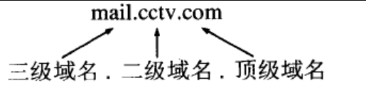
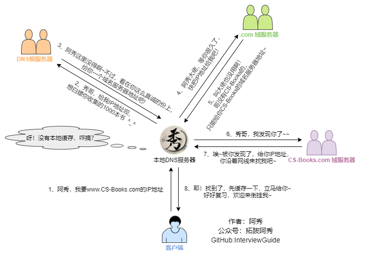

# 计算机网络

## 1、OSI 的七层模型分别是？各自的功能是什么？

### 简要概括

- 物理层：底层数据传输，如网线；网卡标准。 

- 数据链路层：定义数据的基本格式，如何传输，如何标识；如网卡MAC地址。

- 网络层：定义IP编址，定义路由功能；如不同设备的数据转发。

- 传输层：端到端传输数据的基本功能；如 TCP、UDP。

- 会话层：控制应用程序之间会话能力；如不同软件数据分发给不同软件。

- 表示层：数据格式标识，基本压缩加密功能。

- 应用层：各种应用软件，包括 Web 应用。

### 说明

- 在四层，既传输层数据被称作**tcp报文段或udp用户数据报**（Segments）；
- 三层网络层数据被称做**包**（Packages）；
- 二层数据链路层时数据被称为**帧**（Frames）；
- 一层物理层时数据被称为**比特流**（Bits）。

### 总结

- 网络七层模型是一个标准，而非实现。
- 网络四层模型是一个实现的应用模型。
- 网络四层模型由七层模型简化合并而来。--- `链路接口层, 网络层, 运输层, 应用层`
  - 这四层 也叫  --- `TCP/IP网络模型`

## 2、说一下一次完整的HTTP请求过程包括哪些内容？

### 第一种回答

- 建立起客户机和服务器连接。
- 建立连接后，客户机发送一个请求给服务器。
- 服务器收到请求给予响应信息。
- 客户端浏览器将返回的内容解析并呈现，断开连接。

### **第二种回答**

域名解析 --> 发起TCP的3次握手 --> 建立TCP连接后发起http请求 --> 服务器响应http请求，浏览器得到html代码 --> 浏览器解析html代码，并请求html代码中的资源（如js、css、图片等） --> 浏览器对页面进行渲染呈现给用户。

## 3、你知道DNS是什么？

**官方解释**：DNS（Domain Name System，域名系统），因特网上作为**域名和IP地址相互映射**的一个**分布式数据库**，能够使用户更方便的访问互联网，而不用去记住能够被机器直接读取的IP数串。

通过主机名，最终得到该主机名对应的IP地址的过程叫做**域名解析**（或主机名解析）。

**通俗的讲**，我们更习惯于记住一个网站的名字，比如www.baidu.com,而不是记住它的ip地址，比如：167.23.10.2。

## 4、DNS的工作原理？

> 结合小林
>
> 基础篇-DNS介绍
>
> 下面缺少了  根据 hosts 查域名的 ip 

将主机域名转换为ip地址，**属于应用层协议**，使用**UDP**传输。（DNS应用层协议，以前有个考官问过）

过程：

总结： 浏览器缓存，操作系统缓存，路由器缓存，ISP服务器缓存(ISP提供本地域名服务器)，根域名服务器缓存，顶级域名服务器缓存，主域名服务器缓存。

> ### 查询方式
>
> 一、**主机向本地域名服务器**的查询一般都是采用**递归查询**。
> 二、本地域名服务器向根域名服务器的查询的**迭代查询**。

1. 当用户输入域名时，浏览器先检查自己的缓存中是否包含这个域名映射的ip地址，有解析结束。
  2）若没命中，则检查**操作系统缓存（如Windows的hosts）**中有没有解析过的结果，有解析结束。
  3）若无命中，则请求**本地域名服务器解析**（LDNS）。

  - 本地域名服务器通常由ISP提供，负责处理用户的DNS请求。

  - **递归查询**：主机向本地域名服务器的查询通常是递归查询，即LDNS负责完成整个解析过程并返回结果。

  - > 注意, 在请求 LDNS时, 会经过路由器, 也有缓存

  4）若LDNS没有命中就**直接跳到根域名服务器**(`.`)请求解析。根域名服务器返回给LDNS一个 **主域名服务器地址**(`.com`)。

  - 根域名服务器不会直接返回IP地址

  5）此时LDNS再发送请求给上一步返回的**gTLD（ 通用顶级域）**， 接受请求的gTLD查找并返回这个域名对应的Name Server的地址(`.cctv.com`)
  6）LDNS再发送请求 给 Name Server, Name Server根据映射关系表找到目标ip(`mail.cctv.com`)，返回给LDNS

2. LDNS缓存这个域名和对应的ip， 把解析的结果返回给用户，用户根据**TTL值**缓存到本地系统缓存中，域名解析过程至此结束

> ### 英文
>
> 以下是描述中提到的英文缩写及其含义：
>
> 1. **DNS**：Domain(域) Name System  
>    - 域名系统，用于将域名解析为IP地址。
>
> 2. **UDP**：User Datagram Protocol(协议)  
>    - 用户数据报协议，DNS主要使用的传输协议。
>
> 3. **LDNS**：Local Domain Name Server  
>    - 本地域名服务器，通常由ISP提供，负责处理用户的DNS查询。
>
> 4. **ISP**：Internet Service Provider  
>    - 互联网服务提供商，为用户提供网络接入服务。
>
> 5. **TTL**：Time To Live  
>    - 生存时间，DNS缓存的有效时间，决定缓存数据的存储时长。
>
> 6. **gTLD**：Generic Top-Level Domain  
>    - 通用顶级域名，例如`.com`、`.org`、`.net`等。
>
> 7. **TLD**：Top-Level Domain  
>    - 顶级域名，域名系统中的最高级别域名，例如`.com`、`.cn`。
>
> 8. **Name Server**：  
>    - 权威域名服务器，存储域名与IP地址的映射关系。
>

## 5、为什么域名解析用UDP协议？

**因为UDP快**啊！UDP的DNS协议**只要一个请求、一个应答**就好了。

而使用基于TCP的DNS协议要三次握手、发送数据以及应答、四次挥手，**但是UDP协议传输内容不能超过512字节。**

不过客户端向DNS服务器查询域名，**一般返回的内容都不超过512字节**，用UDP传输即可。

## 6、为什么区域传送用TCP协议？

因为TCP协议**可靠性好**啊！

你要从主DNS上复制内容啊，你用不可靠的UDP？ 因为TCP协议**传输的内容大**啊，你用最大只能传512字节的UDP协议？万一同步的数据大于512字节，你怎么办？所以用TCP协议比较好！

**顺序性**

> ### 补充
>
> **区域传送（Zone Transfer）** 是DNS（域名系统）中的一种机制，用于在主DNS服务器（Primary DNS Server）和从DNS服务器（Secondary DNS Server）之间同步DNS区域数据。
>
> ### 1. **什么是区域（Zone）？**
> - DNS区域是DNS命名空间的一部分，包含该区域内的所有域名及其对应的资源记录（如A记录、MX记录等）。
> - 一个区域通常由一个主DNS服务器负责管理，并可以有多个从DNS服务器作为备份。
>
> ### 2. **区域传送的作用**
> - 区域传送的目的是将主DNS服务器上的区域数据复制到从DNS服务器上，以实现数据同步。
> - 这样，从DNS服务器可以作为主DNS服务器的备份，在主服务器不可用时继续提供DNS解析服务，提高系统的可靠性和可用性。
>
> ### 3. **区域传送的类型**
> - **全量传送（AXFR，Authoritative Zone Transfer Full）：**
>   - 将整个区域的所有数据从主服务器传送到从服务器。
>   - 通常用于从服务器首次同步区域数据或区域数据发生重大更改时。
>   
> - **增量传送（IXFR，Incremental Zone Transfer）：**
>   - 仅传送自上次同步以来发生变化的记录。
>   - 增量传送效率更高，适合频繁更新的区域。
>
> ### 4. **区域传送的工作流程**
> 1. 从DNS服务器向主DNS服务器发起区域传送请求。
> 2. 主DNS服务器验证请求是否合法（如通过TSIG签名验证）。
> 3. 如果请求合法，主DNS服务器将区域数据通过TCP协议传送给从DNS服务器。
> 4. 从DNS服务器接收数据并更新本地的区域副本。
>
> ### 5. **为什么需要区域传送？**
> - **高可用性**：从DNS服务器可以在主DNS服务器故障时继续提供服务。
> - **负载均衡**：多个从DNS服务器可以分担DNS查询的负载。
> - **数据备份**：从DNS服务器保存主DNS服务器的区域数据副本，防止数据丢失。
>
> ### 6. **安全性问题**
> - 区域传送可能被恶意用户利用来获取整个DNS区域的数据（如域名和IP地址的映射关系）。
> - 为了防止未经授权的区域传送，可以采取以下措施：
>   - 使用**TSIG（Transaction Signature）**对传送请求进行验证。
>   - 配置服务器，仅允许特定的从DNS服务器发起区域传送请求。
>
> ### 总结
> 区域传送是DNS服务器之间同步区域数据的重要机制，通常用于主从DNS服务器之间的数据复制。它通过TCP协议传输，确保数据的完整性和可靠性，同时支持全量和增量两种传送方式。

## 7、HTTP长连接和短连接的区别

在HTTP/1.0中默认使用短连接。也就是说，客户端和服务器每进行一次HTTP操作，就建立一次连接，**任务结束就中断连接**。

而从HTTP/1.1起，默认使用长连接，用以保持连接特性。

## 8、什么是TCP粘包/拆包？发生的原因？

在TCP通信中，一个完整的业务数据可能会被拆分成多个TCP包发送（拆包），也可能将多个小的业务数据合并到一个TCP包中发送（粘包）。这就是**TCP粘包/拆包问题**。

---

### **什么是TCP粘包？**
TCP粘包是指在接收端读取数据时，多个数据包被粘在一起，接收端无法区分每个数据包的边界。这是因为TCP是**面向字节流**的协议，它只保证数据的顺序和可靠性，但**不提供消息边界的划分**。

---

### **什么是TCP拆包？**
TCP拆包是指一个完整的业务数据被拆分成多个TCP数据包进行发送，接收端需要将这些数据包重新组装成完整的业务数据。拆包通常发生在以下情况下：
- 发送的数据量超过了TCP的**MSS（最大报文段长度）**，需要分段发送。
- 以太网的**MTU（最大传输单元）**限制导致IP层对数据包进行分片。

---

### **发生原因**

#### 1. **粘包的原因**
- **发送端原因**：
  - 应用程序写入的数据量小于套接字发送缓冲区的大小，多个小数据包被合并到一个TCP段中发送（如Nagle算法的作用）。
- **接收端原因**：
  - 接收端读取数据的速度慢，导致多个TCP段的数据被合并到接收缓冲区中。
  - 接收端一次性读取了多个TCP段的数据，无法区分边界。

#### 2. **拆包的原因**
- **发送端原因**：
  - 应用程序写入的数据量大于套接字发送缓冲区的大小，数据被分成多个TCP段发送。
- **网络传输原因**：
  - **TCP分段**：当数据包的大小超过MSS时，TCP会将数据分段。
  - **IP分片**：当以太网的Payload大于MTU时，IP层会对数据包进行分片。

---

### **解决方案**

#### 1. **解决粘包问题**
- **消息定长**：
  - 每个消息的长度固定，接收端按照固定长度读取数据。
- **分隔符协议**：
  - 在每个消息的末尾添加特殊分隔符（如`\n`、空格等），接收端根据分隔符拆分数据。
- **长度字段协议**：
  - 在消息头部添加一个字段，表示消息的长度，接收端先读取长度字段，再根据长度读取完整消息。

#### 2. **解决拆包问题**
- **重组数据**：
  - 接收端需要缓存接收到的TCP数据流，并根据应用层协议的规则（如长度字段或分隔符）将拆分的数据重新组装成完整的消息。
- **调整MSS和MTU**：
  - 在网络配置中调整MSS和MTU的大小，尽量减少拆包的发生。

---

### **总结**
TCP粘包和拆包问题是由于TCP的**面向字节流**特性导致的，解决方案需要在**应用层协议**中明确消息边界。常见方法包括`消息定长、分隔符协议和长度字段协议`等。同时，接收端需要具备缓存和重组数据的能力，以正确处理拆包问题。

### 注意

TCP粘包和拆包问题本身是TCP协议的**正常现象**，但如果处理不当，会带来

1. **数据解析错误**：接收端无法正确区分消息边界或还原完整消息。
2. **开发复杂度增加**：需要设计应用层协议来解决粘包和拆包问题。
3. **性能开销**：增加了内存、处理时间和数据包大小的开销。
4. **调试困难**：问题可能在高并发或网络不稳定情况下更容易暴露。
5. **潜在安全隐患**：错误处理可能引发漏洞，如缓冲区溢出。

因此，在实际开发中，需要通过合理的应用层协议设计来规避这些问题

## 9、为什么服务器会 `缓存` 这一项功能?如何实现的？

**原因**

- 缓解服务器压力；
- 降低客户端获取资源的延迟：缓存通常位于内存中，读取缓存的速度更快。并且缓存服务器在地理位置上也有可能比源服务器来得近，例如浏览器缓存。

**实现方法**

- 让代理服务器进行缓存；
- 让客户端浏览器进行缓存。

> ### 补充
>
> 这个问题的核心是考察你对**服务器缓存机制**的理解，包括**缓存的目的**、**缓存的作用**以及**实现方式**。
>
> **如何实现缓存**：通过HTTP缓存、内存缓存、数据库缓存、代码级缓存等方式
>
> 
>
> #### 代理服务器缓存的典型应用
>
> 1. **CDN（内容分发网络）**：
>    - CDN本质上是一种分布式代理服务器，缓存静态资源以加速用户访问。
> 2. **反向代理服务器**：
>    - 反向代理（如Nginx、Apache）可以缓存后端服务器的响应，减少后端服务器的负载。
> 3. **正向代理服务器**：
>    - 正向代理（如Squid）可以缓存客户端访问的资源，减少重复请求。

## 10、HTTP请求方法你知道多少？

客户端发送的   **请求报文**   第一行为请求行，包含了方法字段。

根据 HTTP 标准，HTTP 请求可以使用多种请求方法。

**HTTP1.0 定义了三种请求方法： GET, POST 和 HEAD方法。**

HTTP1.1 新增了六种请求方法：OPTIONS、PUT、PATCH、DELETE、TRACE 和 CONNECT 方法。

| 序  号 | 方法    | 描述                                                         |
| :----- | :------ | :----------------------------------------------------------- |
| 1      | GET     | 请求指定的页面信息，并返回实体主体。                         |
| 2      | HEAD    | 类似于 GET 请求，只不过返回的响应中没有具体的内容，用于获取报头 |
| 3      | POST    | 向指定资源提交数据进行处理请求（例如提交表单或者上传文件）。数据被包含在请求体中。POST 请求可能会导致新的资源的建立和/或已有资源的修改。 |
| 4      | PUT     | 从客户端向服务器传送的数据取代指定的文档的内容。             |
| 5      | DELETE  | 请求服务器删除指定的页面。                                   |
| 6      | CONNECT | HTTP/1.1 协议中预留给能够将连接改为管道方式的代理服务器。    |
| 7      | OPTIONS | 允许客户端查看服务器的性能。                                 |
| 8      | TRACE   | 回显服务器收到的请求，主要用于测试或诊断。                   |
| 9      | PATCH   | 是对 PUT 方法的补充，用来对已知资源进行局部更新。            |

> ### 补充
>
> 1. **安全性**：
>    - GET、HEAD、OPTIONS、TRACE 是**安全方法**，即不会对服务器资源产生副作用。
>    - POST、PUT、DELETE、PATCH 是**非安全方法**，可能会修改服务器资源。
> 2. **幂等性**：
>    - PUT、DELETE 是幂等的，即多次调用的效果与调用一次相同。
>    - GET、HEAD、OPTIONS 也是幂等的。
>    - POST 和 PATCH 通常不是幂等的。
> 3. **CONNECT 的用途**：
>    - CONNECT 方法主要用于代理服务器，建立隧道连接（如 HTTPS 请求）。

## 11、GET 和 POST 的区别，你知道哪些？

1. get是`获取数据`，post是`修改数据`

2. get把请求的数据放在url上， 以`?`分割URL和传输数据，参数之间以`&`相连，所以get不太安全。而post把数据放在HTTP的`包体内`（request body  相对安全）

3. get提交的`数据最大`是2k（ 限制实际上取决于浏览器）， post理论上`没有限制`。

4. GET产生`一个`TCP数据包，浏览器会把http header和data一并发送出去，服务器响应200(返回数据); POST产生`两个`TCP数据包，浏览器先发送header，服务器响应100 continue，浏览器再发送data，服务器响应200 ok(返回数据)。

5. GET请求会被`浏览器主动缓存`，而POST`不会`，除非`手动设置`。

6. 本质区别：GET是`幂等的`，而POST`不是幂等的`

   > 这里的幂等性：幂等性是指一次和多次请求某一个资源应该具有同样的副作用。简单来说意味着对同一URL的多个请求应该返回同样的结果。

正因为它们有这样的区别，所以不应该且**不能用get请求做数据的增删改这些有副作用的操作**。因为get请求是幂等的，**在网络不好的隧道中会尝试重试**。如果用get请求增数据，会有**重复操作**的风险，而这种重复操作可能会导致副作用（浏览器和操作系统并不知道你会用get请求去做增操作）。

## 12、一个TCP连接可以对应几个HTTP请求？

如果`维持`连接，一个 TCP 连接是可以发送`多个` HTTP 请求的。

## 13、一个 TCP 连接中 HTTP 请求发送可以一起发送么（比如一起发三个请求，再三个响应一起接收）？

`HTTP/1.1` 存在一个问题，`单个` TCP 连接在`同一时刻`只能处理`一个`请求，意思是说：两个请求的`生命周期不能重叠`，任意两个 HTTP 请求从开始到结束的时间在同一个 TCP 连接里不能重叠。

在 `HTTP/1.1` 存在 `Pipelining` 技术可以完成这个多个请求同时发送，但是由于`浏览器默认关闭`，所以可以认为这是不可行的。在 HTTP2 中由于 `Multiplexing` 特点的存在，多个 HTTP 请求可以在同一个 TCP 连接中`并行`进行。

那么在 `HTTP/1.1 时代`，浏览器是如何`提高页面加载效率`的呢？主要有下面两点：

- 维持和服务器已经建立的 TCP 连接，在同一连接上顺序处理多个请求。
- 和服务器建立多个 TCP 连接。

## 14、浏览器对同一 Host 建立 TCP 连接到的数量有没有限制？

假设我们还处在 `HTTP/1.1` 时代，那个时候`没有多路传输`，当浏览器拿到一个有几十张图片的网页该怎么办呢？

肯定不能只开一个 TCP 连接顺序下载，那样用户肯定等的很难受，但是如果每个图片都开一个 TCP 连接发 HTTP 请求，那电脑或者服务器都可能受不了，要是有 1000 张图片的话总不能开 1000 个TCP 连接吧，你的电脑同意 NAT 也不一定会同意。

> NAT 是一种重要的网络技术，广泛应用于私有网络与公共网络之间的通信。它通过地址转换节省了 IPv4 地址，同时提供了一定的安全性。然而，NAT 也带来了一些问题，如破坏端到端通信和增加网络复杂性。在 IPv6 普及后，NAT 的使用可能会逐渐减少，但在 IPv4 网络中仍然是不可或缺的技术。
>
> NAT 不同意开太多 TCP 连接的原因主要是 **端口资源有限** 和 **状态表容量限制**。在 HTTP/1.1 时代，浏览器通过限制并发连接数、资源分域和持久连接等方式缓解了这些问题，而 HTTP/2 的多路复用技术则彻底解决了这一瓶颈。
>
> ### **NAT 的工作原理**
>
> NAT（网络地址转换）通过将私有网络中的多个设备共享一个公共 IP 地址来实现外网通信。为了区分不同的连接，NAT 使用 **端口号** 来标识每个连接的映射关系。
>
> - 每个 TCP 连接需要一个唯一的 `(源IP, 源端口, 目标IP, 目标端口)` 四元组。
> - NAT 会为每个连接分配一个源端口，并记录映射关系。
>
> ### **为什么 NAT 不同意开太多 TCP 连接？**
>
> #### **(1) NAT 的端口资源有限**
>
> - NAT 使用的端口号范围是 **0~65535**，但其中很多端口是保留的（如系统端口 0~1023），实际可用的端口数量有限。
> - 如果每个图片都需要一个独立的 TCP 连接，NAT 需要为每个连接分配一个端口。当连接数量过多时，端口可能会耗尽，导致无法建立新的连接。
>
> #### **(2) NAT 的状态表有限**
>
> - NAT 需要维护一个 **连接状态表**，记录每个连接的映射关系（源 IP、源端口、目标 IP、目标端口）。
> - 如果同时建立大量 TCP 连接，NAT 的状态表会迅速膨胀，超出 NAT 设备的处理能力，导致性能下降甚至崩溃。
>
> #### **(3)性能 和 网络拥堵**

**有。Chrome 最多允许对同一个 Host 建立六个 TCP 连接。不同的浏览器有一些区别。**

如果图片都是 HTTPS 连接并且`在同一个域名`下，那么浏览器在 `SSL 握手`之后会和服务器`商量`能不能`用 HTTP2`，如果能的话就使用 Multiplexing 功能在这个连接上进行多路传输。

不过也未必会所有挂在这个域名的资源都会使用一个 TCP 连接去获取，但是可以确定的是 Multiplexing 很可能会被用到。

如果发现用不了 HTTP2 呢？或者用不了 HTTPS（现实中的 HTTP2 都是在 HTTPS 上实现的，所以也就是只能使用 HTTP/1.1）。

那浏览器就会在一个 HOST 上建立多个 TCP 连接，连接数量的最大限制取决于浏览器设置，这些连接会在空闲的时候被浏览器用来发送新的请求，如果所有的连接都正在发送请求呢？那其他的请求就只能等等了。

>update1：微信好友“卷轴”提出勘误“连接到”-》“连接到的”
>
>

## 15、在浏览器中输入url地址后显示主页的过程?

> - 根据域名，进行DNS域名解析；
> - 拿到解析的IP地址，建立TCP连接；
> - 向IP地址，发送HTTP请求；
> - 服务器处理请求；
> - 返回响应结果；
> - 关闭TCP连接；
> - 浏览器解析HTML；
> - 浏览器布局渲染；

## 16、在浏览器地址栏输入一个URL后回车，背后会进行哪些技术步骤？

### 第一种回答

1、查浏览器缓存，看看有没有已经缓存好的，如果没有

2 、检查本机host文件，

3、调用API，Linux下Socket函数 gethostbyname

4、向DNS服务器发送DNS请求，查询本地DNS服务器，这其中用的是UDP的协议

5、如果在一个子网内采用ARP地址解析协议进行ARP查询如果不在一个子网那就需要对默认网关进行DNS查询，如果还找不到会一直向上找根DNS服务器，直到最终拿到IP地址（全球400多个根DNS服务器，由13个不同的组织管理）

6、这个时候我们就有了服务器的IP地址 以及默认的端口号了，http默认是80 https是 443 端口号，会，首先尝试http然后调用Socket建立TCP连接，

7、经过三次握手成功建立连接后，开始传送数据，如果正是http协议的话，就返回就完事了，

8、如果不是http协议，服务器会返回一个5开头的的重定向消息，告诉我们用的是https，那就是说IP没变，但是端口号从80变成443了，好了，再四次挥手，完事，

9、再来一遍，这次除了上述的端口号从80变成443之外，还会采用SSL的加密技术来保证传输数据的安全性，保证数据传输过程中不被修改或者替换之类的，

10、这次依然是三次握手，沟通好双方使用的认证算法，加密和检验算法，在此过程中也会检验对方的CA安全证书。

11、确认无误后，开始通信，然后服务器就会返回你所要访问的网址的一些数据，在此过程中会将界面进行渲染，牵涉到ajax技术之类的，直到最后我们看到色彩斑斓的网页

>update1:为微信好友”卷轴“提出勘误”缺少5“-》现已加上

### 第二种回答

浏览器检查域名是否在缓存当中（要查看 Chrome 当中的缓存， 打开 chrome://net-internals/#dns）。

如果缓存中没有，就去调用 `gethostbyname` 库函数（操作系统不同函数也不同）进行查询。

如果 `gethostbyname` 没有这个域名的缓存记录，也没有在 `hosts` 里找到，它将会向 DNS 服务器发送一条 DNS 查询请求。DNS 服务器是由网络通信栈提供的，通常是本地路由器或者 ISP 的缓存 DNS 服务器。

查询本地 DNS 服务器

如果 DNS 服务器和我们的主机在同一个子网内，系统会按照下面的 ARP 过程对 DNS 服务器进行 ARP查询

如果 DNS 服务器和我们的主机在不同的子网，系统会按照下面的 ARP 过程对默认网关进行查询

## 17、谈谈DNS解析过程，具体一点

- 请求一旦发起，若是chrome浏览器，先在浏览器找之前**有没有缓存过的域名所对应的ip地址**，有的话，直接跳过dns解析了，若是没有，就会**找硬盘的hosts文件**，看看有没有，有的话，直接找到hosts文件里面的ip
- 如果本地的hosts文件没有能得到对应的ip地址，浏览器会发出一个**dns请求到本地dns服务器**，**本地dns服务器一般都是你的网络接入服务器商提供**，比如中国电信，中国移动等。
- 查询你输入的网址的DNS请求到达本地DNS服务器之后，**本地DNS服务器会首先查询它的缓存记录**，如果缓存中有此条记录，就可以直接返回结果，此过程是**递归的方式进行查询**。如果没有，本地DNS服务器还要向**DNS根服务器**进行查询。
- 本地DNS服务器继续向域服务器发出请求，在这个例子中，请求的对象是.com域服务器。.com域服务器收到请求之后，也不会直接返回域名和IP地址的对应关系，而是告诉本地DNS服务器，你的域名的解析服务器的地址。
- 最后，本地DNS服务器向**域名的解析服务器**发出请求，这时就能收到一个域名和IP地址对应关系，本地DNS服务器不仅要把IP地址返回给用户电脑，还要把这个对应关系保存在缓存中，以备下次别的用户查询时，可以直接返回结果，加快网络访问。

## 18、DNS负载均衡是什么策略？

当一个网站有足够多的用户的时候，假如每次请求的资源都位于同一台机器上面，那么这台机器随时可能会崩掉。

处理办法就是用DNS负载均衡技术，它的原理是在**DNS服务器中为同一个主机名配置多个IP地址,在应答DNS查询时,DNS服务器对每个查询将以DNS文件中主机记录的IP地址按顺序返回不同的解析结果,将客户端的访问引导到不同的机器上去,使得不同的客户端访问不同的服务器**，从而达到负载均衡的目的｡例如可以根据每台机器的负载量，该机器离用户地理位置的距离等等。

## 19、HTTPS和HTTP的区别

1、HTTP协议传输的数据都是未加密的，也就是明文的，因此使用HTTP协议传输隐私信息非常不安全， HTTPS协议是由`SSL+HTTP`协议构建的可进行加密传输、身份认证的网络协议，要比http协议安全。

2、https协议需要到`ca申请证书`，一般免费证书较少，因而需要一定费用。
3、http和https使用的是完全不同的连接方式，用的端口也不一样，前者是80，后者是443。

> ### 连接方式
>
> #### http
>
> - 连接过程
>   1. 客户端（如浏览器）通过 TCP 三次握手与服务器建立连接。
>   2. 建立连接后，客户端发送 HTTP 请求，服务器返回 HTTP 响应。
>   3. 数据以明文形式传输，任何中间人（如网络监听者）都可以直接读取数据内容。
>
> https
>
> - 连接过程
>   1. TCP 三次握手
>      - 客户端与服务器首先通过 TCP 三次握手建立基础连接。
>   2. TLS/SSL 握手
>      - 在 TCP 连接建立后，客户端和服务器进行 TLS/SSL 握手，协商加密算法和密钥。
>      - 握手过程包括：
>        - 客户端发送支持的加密算法列表。
>        - 服务器选择加密算法，并返回数字证书（包含公钥）。
>        - 客户端验证证书的合法性，并生成会话密钥（通过公钥加密后发送给服务器）。
>        - 服务器使用私钥解密会话密钥，双方确认加密通信。
>   3. 加密通信
>      - 握手完成后，客户端和服务器使用对称加密算法进行加密通信，传输 HTTP 请求和响应。

## 20、什么是SSL/TLS ？

`SSL（Secure Sockets Layer） 和 TLS（Transport Layer Security）`（安全套接字层）是一种协议，用于加密和验证应用程序（如浏览器）与 Web 服务器之间传输的数据。它通过身份验证、加密和数据完整性保护，确保通信的安全性。

**TLS** 是 SSL 的升级版本

HTTPS 的加密机制是一种结合了共享密钥加密（对称加密）和公开密钥加密（非对称加密）的混合加密方式。  
- **非对称加密**：加密和解密使用不同的密钥（公钥和私钥），公钥是公开的，主要用于安全地交换对称加密的密钥。  
- **对称加密**：加密和解密使用同一个密钥，优点是加密和解密效率较高，适合大数据量的传输。

SSL/TLS 协议的主要作用包括：认证用户和服务器、加密数据传输，以及维护数据的完整性。HTTPS 正是基于 SSL/TLS 协议实现的安全通信。
